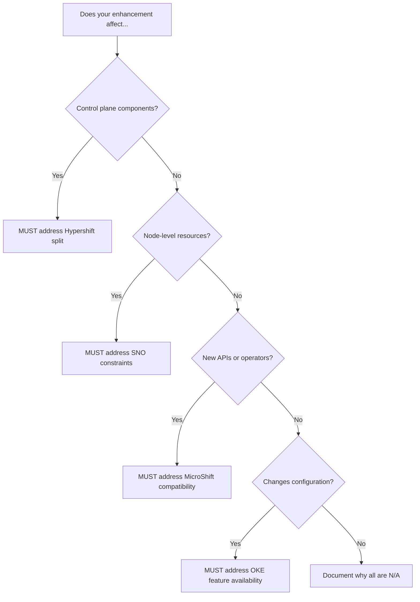

# Topology Considerations Guide

**Purpose**: Guide enhancement authors and reviewers through deployment topology sections  
**Target Audience**: EP authors, reviewers, approvers  
**Template Section**: "Topology Considerations" in enhancement_template.md  
**Last Updated**: 2026-05-14

---

## Overview

OpenShift supports multiple deployment topologies, each with different architectural constraints, resource profiles, and operational models. Enhancement proposals must explicitly address how changes affect each topology.

**Key principle**: If unsure, research and ask questions. "Not applicable" without explanation is insufficient.

---

## Quick Decision Tree



---

## Hypershift / Hosted Control Planes

**Architecture**: Control plane runs in management cluster; workloads run in guest cluster

**When to consider**:
- ✅ Changes to control plane components (kube-apiserver, etcd, controllers)
- ✅ New operators or controllers
- ✅ API extensions (CRDs, webhooks)
- ✅ Certificate or authentication changes
- ✅ Networking between control plane and data plane

**Key questions for authors**:

| Question | Why it matters | Example |
|----------|----------------|---------|
| **Where does this component run?** | Management vs. guest cluster determines RBAC, networking, resource accounting | Operator in management, webhook in guest |
| **Does it need cross-cluster communication?** | Impacts networking policies and certificate management | KAS in management serves guest kubelets |
| **What RBAC is needed in each cluster?** | Management cluster may need federated identity; guest uses service accounts | HO pod needs Network Contributor on mgmt cluster |
| **How does upgrade orchestration work?** | HCP upgrades management-side components separately from guest | CVO runs in guest; HO orchestrates mgmt components |
| **Are there separate control plane/data plane versions?** | Version skew tolerance becomes critical | N→N+1 skew during rolling upgrade |

**Good example**:
> This enhancement is specific to HyperShift. The `controlPlaneVersion` field is added to `HostedClusterStatus` and `HostedControlPlaneStatus`. The reconciliation logic runs in the CPO on the management cluster and inspects `ControlPlaneComponent` resources in the HCP namespace.
>
> **Management cluster impact**: CPO resource consumption increases by ~50MB per hosted cluster.  
> **Guest cluster impact**: None; status is reflected via existing CVO.

**Bad example**:
> This works with Hypershift.
>
> *Missing: WHERE components run, networking implications, upgrade orchestration*

---

## Standalone Clusters

**Architecture**: Traditional self-hosted control plane; all components in same cluster

**When to consider**:
- ✅ Always applicable unless enhancement is Hypershift-specific
- ✅ Most enhancements should work here by default

**Key questions**:
- Is this Hypershift-only? (standalone won't have Hypershift CRDs/controllers)
- Does it depend on Hypershift-specific features? (may need alternative)

**Good example**:
> This change applies to standalone clusters. The new webhook runs as a pod in the openshift-authentication namespace and validates authentication CRs.

**Bad example**:
> No special considerations for standalone clusters.
>
> *Better: Explain WHY (e.g., "Component runs identically in standalone; no control-plane split to handle")*

---

## Single-Node Deployments (SNO)

**Architecture**: Single node acts as both control plane and worker; no high availability

**Resource constraints**:
- **CPU**: 8 vCPUs typical (vs. 3×4 in HA)
- **Memory**: 16-32 GB typical (vs. 3×16 in HA)
- **Storage**: Local disk only; no distributed storage

**When to consider**:
- ✅ New daemons or operators that consume memory/CPU
- ✅ Features requiring quorum or leader election
- ✅ Storage-intensive workloads
- ✅ Features assuming multiple nodes exist

**Key questions for authors**:

| Question | Why it matters | Example |
|----------|----------------|---------|
| **What is the per-node resource overhead?** | In SNO, ALL overhead is on one node | +200MB per node = +200MB total in SNO |
| **Does it assume multiple nodes?** | Pod anti-affinity, zone spreading, quorum | 3-replica StatefulSet can't schedule |
| **Does it require high availability?** | SNO has no HA; single point of failure | Leader election still works but no failover |
| **Does it use local storage?** | SNO often uses hostPath or local PVs | Database needs fsync; can't assume network storage |
| **How does it behave during node reboot?** | Entire cluster goes down | Must tolerate full cluster restart |

**Common scenarios**:

| Scenario | SNO Impact | Mitigation |
|----------|------------|------------|
| **New DaemonSet** | N×overhead becomes 1×overhead (good) | Document actual resource usage |
| **Replica requirements** | Can't schedule 3 replicas | Allow replica=1 via SNO detection |
| **Distributed quorum** | No quorum with 1 member | Use single-member mode or disable |
| **Network partitions** | Can't happen (1 node) | Simplifies some failure modes |

**Topology detection** (API-level, used by operators at runtime):
```bash
oc get infrastructure cluster -o jsonpath='{.status.controlPlaneTopology}'
# Returns "SingleReplica" for SNO, "HighlyAvailable" for multi-node
```

**Good example**:
> **SNO impact**: This adds a DaemonSet consuming 100MB RAM and 50m CPU per node. In SNO, this is 100MB total. The feature detects single-node topology (via `Infrastructure.Status.ControlPlaneTopology == SingleReplica`) and reduces replica count from 3 to 1 for the StatefulSet.

**Bad example**:
> No special considerations for single-node deployments.
>
> *Missing: Memory/CPU overhead, replica adjustments, HA assumptions*

---

## MicroShift

**Architecture**: Minimal OpenShift for edge; subset of operators and APIs

**Key differences from OCP**:
- **No CNO**: Network config via MicroShift config file, not `network.config.openshift.io`
- **No CVO**: No cluster-version-operator; updates via rpm-ostree
- **Subset of operators**: Only essential operators run
- **Config file driven**: `/etc/microshift/config.yaml` instead of CRs
- **Smaller footprint**: Optimized for 2-4 GB RAM

**When to consider**:
- ✅ New APIs (MicroShift may not include them)
- ✅ Operators or controllers (may not run in MicroShift)
- ✅ Configuration via CRs (may need config file alternative)
- ✅ Features depending on other operators (check dependencies)

**Operators in MicroShift**:
- ✅ Service CA operator
- ✅ DNS operator  
- ✅ Ingress operator (route controller)
- ❌ CNO (cluster-network-operator)
- ❌ CVO (cluster-version-operator)
- ❌ Marketplace
- ❌ Monitoring stack (Prometheus)

**Key questions**:
- Does this depend on an operator not in MicroShift?
- Does this add a new API? (MicroShift has limited CRD set)
- Can config be exposed via config file?
- What is the memory overhead? (target: <500MB)

**Good example**:
> **MicroShift**: This feature depends on the Cluster Network Operator (CNO), which does not run in MicroShift. MicroShift users configure networking via `/etc/microshift/config.yaml`. This enhancement does **not** apply to MicroShift.

**Config file alternative example**:
> **MicroShift**: The `maxPods` field is added to the kubelet configuration. In OCP, this is set via `KubeletConfig` CR. In MicroShift, users should set:
>
> ```yaml
> # /etc/microshift/config.yaml
> kubelet:
>   maxPods: 250
> ```

**Reference**: https://github.com/openshift/microshift

---

## OpenShift Kubernetes Engine (OKE)

**Architecture**: Upstream Kubernetes with minimal OpenShift additions; no platform operators

**Key differences from OCP**:
- **No platform operators**: monitoring, console, registry, etc.
- **Upstream components**: Uses upstream Kubernetes releases
- **Minimal API extensions**: Subset of `config.openshift.io` APIs

**When to consider**:
- ✅ Features depending on OCP-specific operators (console, monitoring, etc.)
- ✅ Features using `config.openshift.io` APIs not in OKE
- ✅ Features requiring OpenShift-specific integrations

**Good example**:
> **OKE**: This enhancement adds a console plugin, which depends on the OpenShift web console. OKE does not include the console, so this feature is **not available in OKE**.

**Reference**: [OKE comparison doc](https://docs.redhat.com/en/documentation/openshift_container_platform/latest/html/overview/oke-about#about_oke_similarities_and_differences)

---

## Decision Matrix Template

Use this checklist when writing the Topology Considerations section:

| Topology | Questions to Answer | Your Answer |
|----------|---------------------|-------------|
| **Hypershift** | - Where do components run (mgmt/guest)?<br>- Cross-cluster networking needed?<br>- Separate upgrade orchestration? | |
| **Standalone** | - Works identically to Hypershift?<br>- Hypershift-only feature? | |
| **SNO** | - Resource overhead (MB/CPU)?<br>- Replica count adjustments?<br>- HA assumptions? | |
| **MicroShift** | - Depends on missing operators?<br>- Config file alternative needed?<br>- Memory overhead acceptable? | |
| **OKE** | - Depends on OCP-only features?<br>- Uses upstream APIs only? | |

---

## Common Anti-Patterns

### ❌ "Not applicable" without explanation

**Bad**:
> Not applicable to Hypershift.

**Good**:
> Not applicable to Hypershift. This enhancement modifies the in-cluster storage operator, which runs identically in both standalone and Hypershift guest clusters. The management cluster is unaffected.

---

### ❌ "No special considerations"

**Bad**:
> No special considerations for SNO.

**Good**:
> SNO is supported. This adds a Deployment (not DaemonSet), consuming 200MB RAM total regardless of node count. In SNO, this is the same 200MB. No replica adjustments needed.

---

### ❌ Ignoring resource constraints

**Bad**:
> Adds a new monitoring sidecar to all pods.

**Good**:
> Adds a 50MB monitoring sidecar to all pods in the `openshift-*` namespaces. In SNO with ~100 system pods, this is ~5GB additional memory (~30% increase on 16GB node). We mitigate by making the sidecar opt-in via annotation.

---

## Reviewer Checklist

When reviewing enhancement PRs, verify:

**Hypershift**:
- [ ] Identifies which cluster(s) components run in
- [ ] Addresses cross-cluster communication if applicable
- [ ] Considers version skew during upgrades
- [ ] Quantifies management cluster resource impact

**SNO**:
- [ ] Quantifies per-node memory/CPU overhead
- [ ] Addresses replica count assumptions (if any)
- [ ] Documents behavior if HA is assumed
- [ ] Tests with SNO topology (`Infrastructure.Status.ControlPlaneTopology == SingleReplica`)

**MicroShift**:
- [ ] Lists operator dependencies (are they in MicroShift?)
- [ ] Proposes config file alternative if adding new API
- [ ] Quantifies memory overhead (is it <500MB?)

**OKE**:
- [ ] Identifies OCP-specific dependencies (console, monitoring, etc.)
- [ ] Links to OKE comparison doc if unclear

**General**:
- [ ] No section says "N/A" or "no special considerations" without explanation
- [ ] Author can articulate WHY each topology is/isn't affected

---

## Examples from Real Enhancements

### Hypershift-specific feature

From `hypershift-gcp-platform-support.md`:

> **Hypershift / Hosted Control Planes**  
> This enhancement is HyperShift-specific. It adds GCP as a new platform type for hosted control planes to enable a managed OpenShift service on GCP. Management clusters running on GKE are specific to the managed service architecture and are not intended for self-managed OCP deployments.
>
> **Standalone Clusters**  
> Not applicable. This enhancement is specific to the HyperShift topology.

---

### MicroShift incompatibility

From `configurable-network-diagnostics-pod-placement.md`:

> **Single-node Deployments or MicroShift**  
> MicroShift doesn't run CNO and network diagnostics.  
> No special considerations for single-node deployments.

---

---

## For Agentic Docs Contributors

**Context**: When documenting form factor behavior in `ai-docs/`, use authoritative enhancements as primary sources.

### Critical Rule

**ALWAYS cite authoritative enhancements when documenting HCP/SNO/MicroShift behavior.**

❌ **DON'T**: Rely on training data or general Kubernetes knowledge for form factor specifics
✅ **DO**: Read relevant enhancements, extract facts, cite sources

### Process

1. **Find authoritative source** - Search `enhancements/hypershift/`, topology sections in EPs
2. **Extract facts** - Quote specific lines, note architecture details
3. **Cite in docs** - Add references section linking to enhancements
4. **Mark inferences** - Distinguish verified facts from logical inferences

### Authoritative Sources by Topic

| Topic | Enhancement | Key Facts |
|-------|-------------|-----------|
| **HCP upgrade orchestration** | enhancements/hypershift/hypershift-control-plane-version-status.md | CPO (mgmt) vs CVO (guest), separate version tracking |
| **HCP networking** | enhancements/hypershift/hosted-control-plane-metrics-exposure.md, monitoring.md | Management/guest network separation |
| **HCP operator placement** | enhancements/hypershift/node-tuning.md | Split operator pattern, two kubeconfigs |
| **SNO constraints** | Search topology sections in EPs | Single node, no HA, resource limits |
| **MicroShift differences** | Search topology sections in EPs | No CVO/CNO, RPM-based upgrades |

---

## Related Documentation

- **Enhancement template**: [../../guidelines/enhancement_template.md](../../guidelines/enhancement_template.md)
- **MicroShift repo**: https://github.com/openshift/microshift
- **OKE comparison**: https://docs.redhat.com/en/documentation/openshift_container_platform/latest/html/overview/oke-about#about_oke_similarities_and_differences
- **HCP enhancements**: [../../enhancements/hypershift/](../../enhancements/hypershift/)

---

## Feedback

For questions or suggestions on this guide:
- **Slack**: #forum-ocp-arch
- **Issues**: https://github.com/openshift/enhancements/issues
