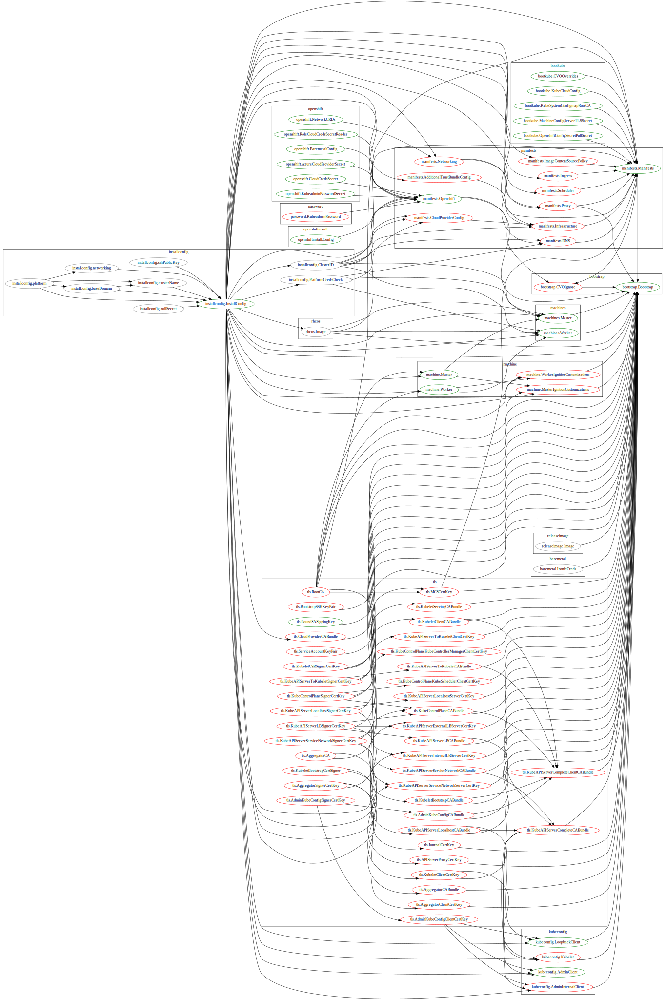
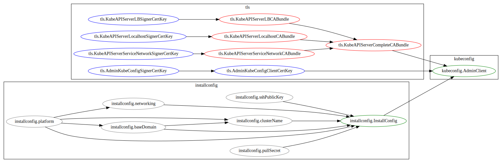
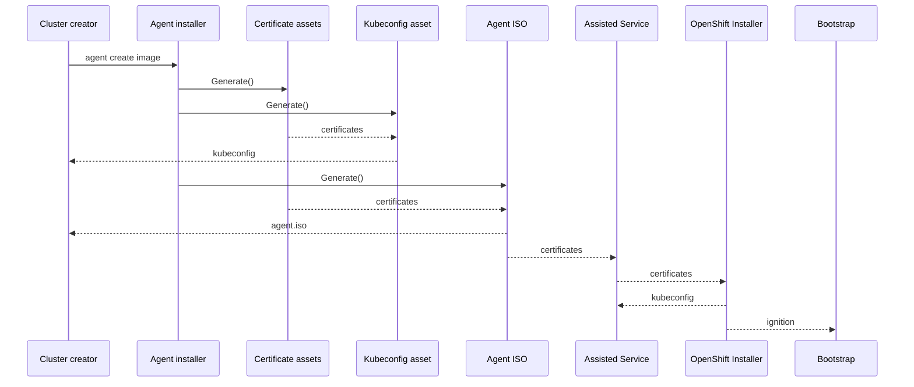

# Pre-generating the admin Kubeconfig in the Agent-based installer

## Summary

We will generate the admin kubeconfig file in the agent installer at the same
time as the agent ISO. The CA keys used to sign the client certificate in the
kubeconfig will be added to the ISO and eventually installed into the cluster
so that the credentials in the admin kubeconfig will be accepted.

## Motivation

In the hosted assisted service, the admin kubeconfig is available for download
from the web UI only after assisted-service has run openshift-installer to
create the bootstrap ignition (i.e. after cluster installation has started).
Since the hosted service is always available, this config can be downloaded at
any time before the certificates in it expire.

For the agent-based installer, doing the same would mean the kubeconfig was
only available for a brief window of time, since the assisted-service is
ephemeral. It runs on node 0 of the cluster and disappears after bootstrapping
when that node is rebooted to become a cluster member.

Furthermore, the kubeconfig file needs to be available to the installer in
order for it to be used to monitor the cluster status in the `openshift-install
agent wait-for install-complete` command.

### User Stories

* As a cluster creator, I want to have a reliable, non-timing dependent way to
  retrieve the admin kubeconfig for a new cluster created with the agent-based
  installer.

* As a cluster creator, I want to use the `agent wait-for install-complete`
  command to wait for the cluster to complete, with the preceding steps in the
  automated workflow limited to only running the `agent create image` command
  and booting the ISO on the hosts.

### Goals

* Generate a working admin kubeconfig as part of the `openshift-install agent
  create image` command.
* Remain as consistent as possible with the installer behaviour in the IPI and
  UPI install methods.

### Non-Goals

* Make the admin kubeconfig available earlier in the hosted assisted UI.
* Generate the admin password for the console during creation of the ISO (this
  will be added later).
* Implement key rotation for OpenShift clusters in general.

## Proposal

The admin kubeconfig will be generated by the `agent create image` command
using an Asset based on the existing `kubeconfig.AdminClient` one. This will
differ only in that it will get the cluster API address from the agent
cluster-manifests, rather than the install-config, because the install-config
is optional in the agent-based installer flow.

The actual ignition files used for bootstrapping the cluster are not created by
the agent-based installer binary, but rather by the assisted-service running
openshift-installer again. In order to ensure that the cluster that is
installed accepts the credentials in the kubeconfig, then during the ignition
generation step of the installer run by assisted-service, we must overwrite or
modify on disk:

* All assets that the admin kubeconfig depends on (directly or indirectly)
  * Unless the asset can be regenerated deterministically from its own
    dependencies.
* For each of *those* assets that cannot be loaded from disk, all other assets
  that depend on it, directly or indirectly, until reaching assets that can be
  loaded from disk

The status quo is that amongst the writable assets (shown in color below),
there are some (shown in red) that cannot actually be read back by the
installer. As a result, both the nature and the sheer number of assets required
would preclude this approach:

However, by adding the ability to read back a handful of assets (shown in blue
below) that currently cannot be, this complexity is massively reduced:

Accordingly, the installer will be modified to allow reading the following
certificate assets from disk:

* `tls.KubeAPIServerLBSignerCertKey`
* `tls.KubeAPIServerLocalhostSignerCertKey`
* `tls.KubeAPIServerServiceNetworkSignerCertKey`
* `tls.AdminKubeConfigSignerCertKey`
* `tls.AdminKubeConfigClientCertKey`

When generating the agent ISO, the certificate and key files for those same
assets will be built in to the ISO.

The assisted-service will copy the certificates from a location provided by the
environment variable `EPHEMERAL_INSTALLER_CLUSTER_TLS_CERTS_OVERRIDE_DIR` to
the installer's work directory before generating the manifests/ignition.

### Workflow Description

### API Extensions

N/A

### Implementation Details/Notes/Constraints

Note that the modifications to the installer to read certificates from disk
need to occur in the installer present in the payload of the release being
installed, i.e. on the `master` branch, not the `agent-installer` branch where
the agent-based installer is being developed.

The work directory for the installer is a tmpdir created by assisted-service on
the fly with a randomised name. Therefore it is not possible to pre-populate
the certificates into the directory, and assisted-service must be involved in
copying the files.

### Risks and Mitigations

End users will be able to supply their own CA certificates to the installer
much more easily than they could before. If done incorrectly, this may leave
the cluster less secure than if the keys and certificates are generated inside
openshift-installer. To discourage users from relying on this, the ability to
read the certificates from disk will only be enabled when the environment
variable `OPENSHIFT_INSTALL_LOAD_CLUSTER_CERTS` is set to the value `true`. The
assisted-service will set this in the environment when running the installer,
but otherwise it should not be routinely set.

A copy of the admin kubeconfig will remain accessible via the assisted-service
API, enabling an attacker with access to the network environment of the cluster
during bootstrapping to gain access to it. We could safely disable this API
when the `EPHEMERAL_INSTALLER_CLUSTER_TLS_CERTS_OVERRIDE_DIR` environment
variable is set. We expect to add authentication to the assisted-service API in
future, at which point this will cease to be an issue.

The private key for the admin kubeconfig client certificate, as well as for the
API Server signing certificates, will be embedded in the generated ISO. This
means that the ISO must be treated as private, even after the cluster is
created. Care must be taken when exposing it over the network, e.g. for PXE
boot. However, the same is already true for e.g. the UPI Bootstrap Ignition.

### Drawbacks

The same mechanism will likely not be usable in the interactive flow, because
we won't know the cluster name (and therefore its API address) at the time of
generating the agent ISO.

## Design Details

### Open Questions

### Test Plan

Since the admin kubeconfig is required to verify that the cluster installation
is completed, this feature is expected to be tested on every CI run.

### Graduation Criteria

N/A

#### Dev Preview -> Tech Preview

N/A

#### Tech Preview -> GA

N/A

#### Removing a deprecated feature

N/A

### Upgrade / Downgrade Strategy

N/A

### Version Skew Strategy

N/A

### Operational Aspects of API Extensions

N/A

#### Failure Modes

N/A

#### Support Procedures

N/A

## Implementation History

The changes to the installer to read the certificates/keys from disk were
implemented in
[openshift/installer#5872](https://github.com/openshift/installer/pull/5872)
and are available in OpenShift 4.11 nightlies from Feature Freeze on.

The changes to assisted-service to copy the certificates/keys into the
temporary work directory for the installer were implemented in
[openshift/assisted-service#3836](https://github.com/openshift/assisted-service/pull/3836).

The changes to the agent installer to generate the kubeconfig and pass the
certificate/key files to the assisted-service were implemented in
[openshift/installer#5959](https://github.com/openshift/installer/pull/5959).

## Alternatives

The agent installer could attempt to download the kubeconfig from the
assisted-service during installation. However, since it is up to the user to
boot the ISO this would have to be a separate command that the user would have
to run at the right time.

Similarly, the kubeconfig could be written to disk on one of the nodes and the
agent installer could attempt to download it over ssh. This suffers from
similar problems, although it could work at any time. It could also result in
nodes being tainted due to the ssh access.

A service running in the cluster could provide access to the admin kubeconfig
using some sort of ad hoc authentication, not dependent on the admin kubeconfig
signing key. It could perhaps also be removed when no longer required. This
would not be consistent with the other installer workflows, and could require
complex work on the part of the user when the cluster is started in an
environment not connected to the one where the ISO was generated (so the
installer might not be available to provide automation). It would be better
with the automation implemented in `oc`, and applicable to clusters installed
by any method, but such a change is out of scope for this enhancement.
