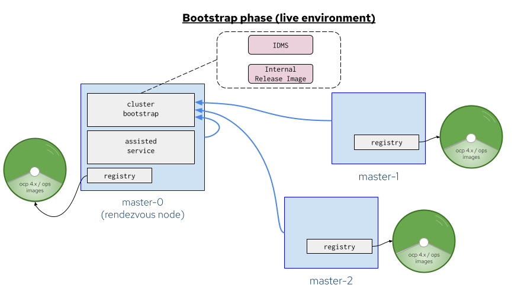
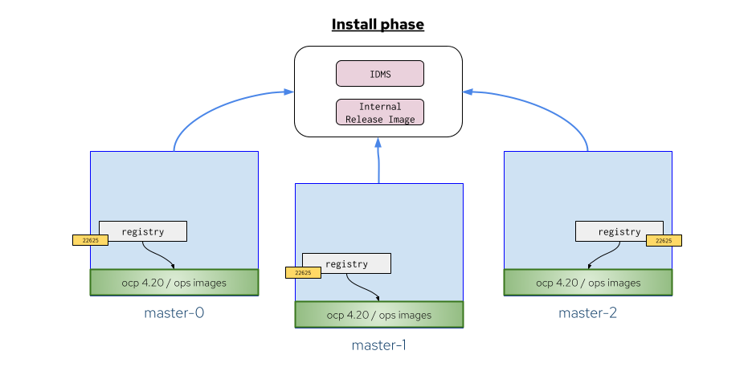

# Simplified registry-less cluster operations for disconnected environments

## Summary

This enhancement proposal outlines an opinionated workflow to simplify
on-premises cluster operations - such as installation, upgrade and node
expansion - by eliminating the need to setup and configure an external
registry mirror. This approach is specifically designed for disconnected
environments and leverages existing tools such as Agent-based Installer,
Assisted Installer and OpenShift Appliance.

## Motivation

One of the most recurring pain points when installing - and later managing -
an OpenShift cluster in a disconnected scenario has been the requirement to
setup an [additional registry](https://docs.redhat.com/en/documentation/openshift_container_platform/4.19/html/disconnected_environments/index)
within the same environment. This task involves not only deploying and
maintaining the registry service itself, but also mirroring the desired
OpenShift release payload - and optionally some additional OLM operators.
Such complexity made the initial deployment and further upgrades challenging
and time-consuming, often resulting in a frustrating process for the less
experienced users. Additionally, this approach was not considered suitable for
resource-constrained environments - where the lack of dedicated hardware for
hosting an external registry made it impractical.

### User Stories

* As an OpenShift administrator, I want to install a cluster into a
  disconnected environment without setting up an external registry (and
  optionally a selected set of OLM operators)
* As an OpenShift administrator, I want to upgrade a cluster into a
  disconnected environment without setting up an external registry (and
  optionally a selected set of OLM operators)
* As an OpenShift administrator, I want to add a node to an existing cluster in
  a disconnected environment without setting up an external registry
* As an OpenShift administrator, after having deployed a cluster, I want to
  start using my own external registries for future upgrades

### Goals

* Ensure successful installation/upgrade/adding new nodes in disconnected
  environments with minimal requirements and no pre-existing registry
* Offer a simplified installation experience for disconnected environments by
  leveraging existing tools like the Agent-Based Installer, Assisted Installer
  and OpenShift Appliance
* Support a mechanism to allow the user, after having successfully installed
  the cluster, to opt-out from the feature and start using his/her own external
  registry for the cluster upgrade operations

### Non-Goals

* Allow the user to install/upgrade any OLM operators

## Proposal

From a very high-level perspective, this proposal consists of building and
releasing an extended RHCOS live ISO that includes a full OCP release payload
(with a selected subset of OLM operators) and all the necessary
scripts/services to support the various operations. In general a local registry
service will be running on every control plane node, serving the OCP release
payload included in the ISO. Also, a new custom resource - managed by the 
Machine Config Operator (MCO) - will be introduced to control and manage the
internal release payload added to the system.

Since each cluster operation has its own requirements and characteristics, the
following paragraphs will provide more specific details for each different
scenario.

### Extended RHCOS ISO build and release

The foundation of the current proposal lies in the user's possibility to
download a customized self-sufficient RHCOS live ISO, containing all the
necessary elements to support the cluster operations in a disconnected
environment.
This ISO will be prepared and built using the [OpenShift Appliance Builder](https://github.com/openshift/appliance),
a command line utility for building a disk image to orchestrate an OpenShift
installation. The Appliance builder will be enhanced with a new 
`build live-iso` command capable to generate an ISO artifact. 
The extend ISO builder will be integrated within the official Red Hat build and
release pipeline, so that a new extended RHCOS ISO could be published following
the same OpenShift release cadence, and made it available via the 
[Red Hat Customer Portal](https://access.redhat.com).

### Installation

#### Bootstrap phase

Based on the same [Agent-based Installer](https://github.com/openshift/enhancements/blob/master/enhancements/agent-installer/automated-workflow-for-agent-based-installer.md)(ABI)
approach, the installation will be kicked off into an ephemeral environment
fully allocated in memory, as soon as each node is booted using the extended
ISO (bootstrap phase).
In addition to the usual ABI services configured to orchestrate the
installation, a local registry service will be created on each node, and the
content of the release payload from the mounted ISO will be used as its
backend source.
During this early phase, the main responsibility of the local registry will
be to serve any image pull request originating from the local services running
on the same node.

#### Installation phase (after the first reboot)

During the installation of each control plane node, the contents of the OCP
release payload will be copied from the ISO to the node's disk (in the format
of the registry's 'filesystem' backend) after the OS disk writing step - so
that it remains available not only after the first reboot, but also once the
installation is complete. Also the registry container image itself will be
copied in the node additional image store for podman.
[Assisted Service](https://github.com/openshift/assisted-service/)
and [Assisted Installer](https://github.com/openshift/assisted-installer)
will be enhanced accordingly to take care of this step, and to ensure it
will be properly monitored during the installation process.

A new registry service will be injected via MCO to support providing the
release content stored on disk after the reboot (since the previous ephemeral
environment will not be available anymore).

To allow pulling images from the cluster, an ImageDigestMirrorSet
(IDMS) policy will be added to the cluster manifests - using the `api-int` 
DNS entry - so that the set of registries running within
the control plane nodes will transparently serve the release payload images
locally mirrored.

Finally, a new `InternalReleaseImage` custom resource, managed by MCO, will
also be added as a cluster manifest to keep track and manage the currently
stored internal release image.

### Upgrade

Upgrading an existing lower version cluster will be performed via the same
extended ISO used for managing the installation. As soon as the user will
attach the extended ISO to one of the control planes a temporary registry
will be created to serve its content.
At this point the user could edit the existing IRI resource to add the new
release to trigger the copy process (from the temporary registry
to each local control plane node registry), managed by the Machine Config
Daemon (MCD). Once the copy has been completed on all the control plane nodes,
the user could start the usual offline upgrade process via the `oc adm upgrade
--allow-explicit-upgrade --to-image=<release-image>`.
At the end of the upgrade the user may decide to delete the previous release
entry from the IRI resource. In such case the MCD on each control plane node
will take care of removing the older release payload from the local registry.

### Adding a new node

A node could be added to a target existing cluster using the `oc adm
node-image` [command](https://github.com/openshift/enhancements/blob/master/enhancements/oc/day2-add-nodes.md)
(currently, limited to workers). Even though the IDMS resource guarantees that
the `oc adm node-image create` could successfully generate the node ISO, it
won't be sufficient to support the joining process. For that, it will be
necessary to run the registry on a host network port accessible from outside
the cluster. In addition to that, the registry will be secured via a
pull-secret. Users will be required to add this port to the api-int load
balancer (when it is external to the cluster) and open firewalls to allow
this port to be accessible from all the nodes, as well as the registry port.

### Workflow Description

The various workflows are briefly summarized below:

#### Installation

1. The user downloads the extended RHCOS ISO from the Red Hat Customer Portal.
2. The user moves the extended RHCOS ISO into the disconnected environment.
3. The user boots all the nodes that will be part of the cluster using the
   downloaded ISO.
   (note: even though not strictly relevant for the current proposal,
   we'll assume that the deployment configuration details are already
   available in the installation environment - either provided statically or
   interactively by the user - such as the rendezvous node selection and cluster
   specifications).
4. The installation process starts automatically and runs unattended until
   completed.

#### Upgrade

1. The user downloads the extended RHCOS ISO from the Red Hat Customer Portal,
   by selecting a compatible newer version release for the target cluster.
2. The user moves the extended RHCOS ISO into the disconnected environment.
3. The user attaches the extended RHCOS ISO to one of the control plane nodes
   of the target cluster.
4. The user edits the IRI resource by adding the release image pullspec to the
   `spec.releases` field.
5. The user waits until the copy process of the new release image is completed
   for all the control plane nodes. The progress and status of the task could
   be monitored via the IRI `status` field.
6. Once completed, the user upgrades the cluster via the `oc adm upgrade
   --allow-explicit-upgrade --to-image=<release-image>`

#### Post-upgrade optional steps

1. The user edits the IRI resource by removing the release image pullspec not
   in use anymore.
2. The specified release image is removed from all the control plane nodes. The
   progress and status of the task could be monitored via the IRI `status`
   field.

### Node expansion

1. The user runs the `oc adm node-image create` command from within the
   disconnected environment (with optionally some additional node
   configuration).
2. The user attaches the newly generate node ISO to the target machine(s),
   and boots it. The progress and status of the task can be monitored via the
   `oc adm node-image monitor` command.
3. The user waits until the CSRs are generated, and manually approves them
   via the `oc adm certificate approve` command.
   
### API Extensions

#### InternalReleaseImage custom resource

The `InternalReleaseImage` is a new singleton custom resource, named `cluster`,
controlled by MCO, used to keep track and manage the OCP release images stored
into the control planes nodes. In particular, it will be used for:

* Triggering a new release image copy task - as a preliminary upgrade step
* Delete from disk a release image version not anymore in use - as an optional
  post-upgrade step

This is an example of how the CR will look like:

```
apiVersion: releases.openshift.io/v1alpha1
kind: InternalReleaseImage
metadata:
  name: cluster
spec:
  releases:
    - name: quay.io/openshift-release-dev/ocp-release:4.18.0-x86_64
    - name: quay.io/openshift-release-dev/ocp-release:4.19.0-x86_64
status:
  releases:
    - "quay.io/openshift-release-dev/ocp-release:4.18.0-x86_64"
    - "quay.io/openshift-release-dev/ocp-release:4.19.0-x86_64"
  conditions:
    - type: "Available"
      status: "True"
      lastTransitionTime: "2025-07-12T14:02:00Z"
      reason: "ReleasesSynchronized"
      message: "The previously managed releases are available."
    - type: "Progressing"
      status: "True"
      lastTransitionTime: "2025-07-12T13:13:00Z"
      reason: "AddingRelease"
      message: "Adding new release image quay.io/openshift-release-dev/ocp-release:4.19.0-x86_64 on master-0."
  ...
```

* The `spec.releases` contains a list of release objects, and it will be used
  to configure the desired release contents. Adding (or removing) an entry from
  the list will trigger an update on all the control plane nodes.
* The `spec.releases.name` format is a pullspec by tag. This is a convenient
  format for the end user, since it is readable and commonly used for reference
  a specific releasy payload. Optionally, the user could also specify a pullspec
  by digest (internally the digest will always be used to avoid any ambiguity)
* The `status.releases` field will report the currently managed releases (this
  is an aggregated value, for individual node status see below)
* The `status.conditions` field will be used to keep track of the activity
  performed on the various nodes

##### MachineConfigNode InternalReleaseImage status

The `MachineConfigNode` CRD will be extended to report the per-node status, so
that it will be possible to track the current status/errors of each individual
node. The IRI resource will monitor all the MCN resources to update its status.

Following a proposal example for the extended status field:

```
kind: MachineConfigNode
metadata:
  name: master-0-machineconfignode
...
status:
  ...
  releases:
    - image: quay.io/openshift-release-dev/ocp-v4.0-art-dev@sha256:b6f3a6e7cab0bb6e2590f6e6612a3edec75e3b28d32a4e55325bdeeb7d836662
      conditions:
        - type: Available
          status: "True"
          lastTransitionTime: "2025-07-12T14:02:00Z"
          reason: "ReleasesCopied"
          message: "The release payload has been successfully copied."
          ...
    - image: quay.io/openshift-release-dev/ocp-v4.0-art-dev@sha256:6bd997996a5197c50e91564ab6ee74aae6b6ad38135ae3cbff320293fff074cc
      conditions:
        - type: Available
          status: "False"
          lastTransitionTime: "2025-08-12T17:01:13Z"
          reason: "Error"
          message: "Not enough storage space."
```

* The `status.releases` field will be used to track the status of the release
  payloads stored in the related node. To avoid any ambiguity, the release
  image will be referenced always by digest
* The `status.conditions` field will be used to keep track of the activity
  performed for the specific release payload, and in particular to report any
  error

### Topology Considerations

Will function identically in all topologies.

#### Hypershift / Hosted Control Planes

N/A

#### Standalone Clusters

N/A

#### Single-node Deployments or MicroShift

N/A

### Implementation Details/Notes/Constraints

#### InternalReleaseImage custom resource

A new `InternalReleaseImageController` sub-controller of the
_machine-config-controller_ will be created to watch and manage the
`InternalImageRelease` resource. The controller will take care of
updating the resource status.

A new `InternalReleaseImageManager` manager will be added to
_machine-config-daemon_ to handle per-node specific operations.

##### Removal of a release from the the InternalReleaseImage resource

The user could remove a release payload not anymore in use by editing the
`spec.releases` field of the `InternalReleaseImage` resource to delete the
desired release entry value.

A ValidatingAdmissionPolicy will be added to prevent the user to remove
a release entry that is currently being used by the cluster. The policy will
perform a check against the `ClusterVersion` `version` object to allow (or not)
the update request.

##### Removal of InternalReleaseImage resource

The deletion of the IRI `cluster` resource will be handled by a finalizer,
and it will stop all the registry services running on the control plane nodes.
In addition, all the currently stored release payloads will be deleted from the
nodes disk, and all the previously resources created will be removed as well
(such as the IDMS ones) to complete the cleanup.

It won't be allowed to delete the resource if the current release is still
managed by the IRI resource. Also in this case, a ValidatingAdmissionPolicy
performing a check against the `ClusterVersion` `version` object will be used
(to verify that none of the IRI releases is currently being used by the
cluster).
This means that a user, to opt-out from the feature, will have to previouslu
setup his/her own registry with the required mirrored content and then perform
a cluster upgrade. Once successfully completed, it'd be possible to remove the
IRI resource.

#### Extended RHCOS ISO build

The release image and operators images will be stored inside the extended RHCOS
ISO in the storage format used by the [distribution/distribution](https://github.com/distribution/distribution)
registry’s filesystem storage plugin.

#### Distribution/distribution registry OCP integration

The [distribution/distribution](https://github.com/distribution/distribution)
registry will be used to run the registry services on each control plane
node. The binary will be built and included in the same source as
[openshift/image-registry](https://github.com/openshift/image-registry) repo,
so that it will be available within an OCP release image payload and CVEs will
be handled without any additional overhead.

#### Installation - bootstrap phase



Initially the registry image will be placed into a read-only [additional image
store](https://www.redhat.com/en/blog/image-stores-podman), configured to be
used by podman in `/etc/containers/storage.conf`.
An initial service (added by the Appliance builder in the ISO ignition) will
startup the registry at the very beginning of the boot phase. 
The `/etc/containers/registries.conf` will be modified to ensure that the
images will be pulled from the local registry, using `localhost` as the
registry host.

#### Installation - install phase



A systemd service injected by MCO will ensure the registry will be available
after the reboot. 
The registry will have to run on a host network port on each node to ensure
it's accessible from the outside, specifically port 22625 (to be [registered](https://github.com/openshift/enhancements/blob/master/dev-guide/host-port-registry.md)). 
An Assisted Service pre-flight validation will ensure that the port is open.

#### Upgrade

A udev rule, along with a systemd service injected by MCO will detect when an
extended RHCOS ISO is attached, and then mount it to launch a temporary registry
to serve its content.
After the user modified the IRI resource with the new release pullspec, the new
OCP release image payload will be copied on each node registry using skopeo.

#### Storage requirements

The control plane nodes disks must have sufficient space to store the requested
release payloads. The recommendation is to allocate at least ~60Gb per release.
Thus, to fully support also the upgrade, a total of additional ~120GB will be
required.
Assisted Service will apply a pre-flight validation to ensure that the
control plane nodes will meet the new storage requirement. Additionally, it
should be properly documented in the pre-requistes section.


### Risks and Mitigations

* Exposing the internal registry on a node port will allow it to be reached
  from outside the cluster. This behavior is similar to the one already
  adopted by the Machine Config Server (MCS).
  This is a new requirement that will need to be properly documented. In
  addition, to minimize the risks, the registry will have to be secured
  via a pull-secret.

### Drawbacks

* The extended RHCOS ISO size is pretty big, currently ~35GB with just a
  limited set of OLM operators. Including all the OLM operators is not
  feasible, and the current selected set may not be sufficient and/or
  effectively required by all the users.
* Due the size, some hardware vendors may have difficulties into loading
  such ISO, so a more extended testing may be required.
* The lifecycle of some OLM operators is different from the OCP one,
  thus assembling an extended ISO may be challenging due the different release
  timings (between OCP and OLM operators).
* The upgrade path of some OLM operators may require to include different
  versions of the same operator, thus impacting on the final size of the
  extended ISO.
* Building and releasing the extended ISO via Konflux requires a non-trivial
  additional effort cost.

## Alternatives (Not Implemented)

* For building the ISO, we've explored also the usage of the [custom-coreos-disk-images](https://github.com/coreos/custom-coreos-disk-images)
  utility, to reuse the OCP layering feature. The approach was discarded as it
  appeared not feasible especially when dealing with such additional payload
  size (a standalone OCP release size is usually ~20GB)

* Instead of using a local registry on each node, we've also explored the
  possibility to pre-load all the required images into an additional read-only
  local container storage on each node. Unfortunately this approach wasn't
  feasible, as several pieces of the OpenShift ecosystem assume that a registry
  was always available in the environment. Removing such dependency across
  all the possible locations appeared to be particularly complex and
  challenging (and moreover no formal way to enforce it once removed)

## Test Plan

[dev-scripts](https://github.com/openshift-metal3/dev-scripts) will be enhanced
to support testing via the extended RHCOS ISO, and new jobs will be added in the
OpenShift CI to cover the sno/compact/ha topologies.

## Graduation Criteria

### Dev Preview -> Tech Preview

- Ability to utilize the enhancement end to end
- End user documentation
- Sufficient test coverage (using a disconnected environment)
- Gather feedback from users rather than just developers
- Integration with the official Red Hat build and release pipeline

### Tech Preview -> GA

- Complete e2e testing on installation, upgrade and node expansion
- User facing documentation created in [openshift-docs](https://github.com/openshift/openshift-docs/)

### Removing a deprecated feature

N/A

## Upgrade / Downgrade Strategy

N/A

## Version Skew Strategy

N/A

## Operational Aspects of API Extensions

N/A

## Support Procedures

N/A