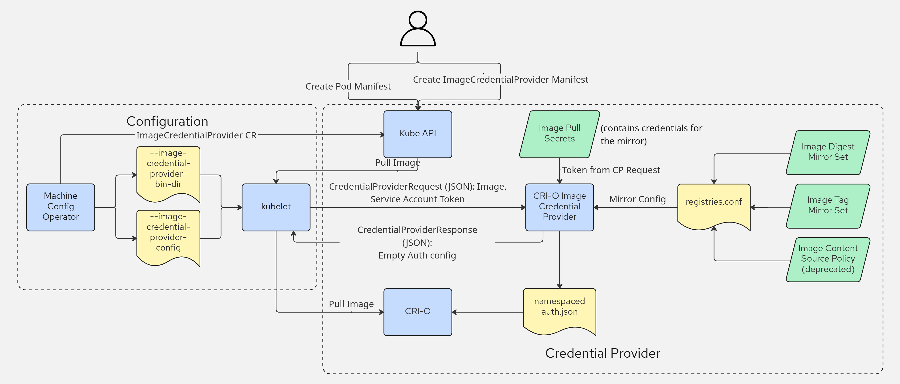

# CRIOCredentialProviderConfig for Namespace-Scoped Mirror Authentication 

## Summary

This enhancement addresses an OpenShift limitation when using CRI-O with namespace-scoped mirror registry authentication. Currently, clusters using private mirror registries are forced to use global pull secrets, breaking security isolation between projects. The solution proposed by the enhancement leverages kubelet's existing [CredentialProviderConfig](https://kubernetes.io/docs/reference/config-api/kubelet-credentialprovider.v1/) API, its [image credential provider](https://kubernetes.io/docs/tasks/administer-cluster/kubelet-credential-provider/) plugin mechanism, and the [`crio-credential-provider`](https://github.com/cri-o/crio-credential-provider) binary to enable Pods to pull images from mirrored registries using namespace-scoped secrets, without requiring global pull secrets.

The enhancement introduces a cluster-wide `CRIOCredentialProviderConfig` CRD that specifies source registries triggering `crio-credential-provider` execution. When Pods reference images from these registries, the credential provider resolves mirror configurations, discovers namespace-scoped secrets, and generates short-lived authentication files for CRI-O consumption. This maintains credential isolation between namespaces while preserving existing mirror configuration methods.

## Motivation

Currently, OpenShift clusters using CRI-O with registry mirrors face an authentication challenge. The namespace-scoped secrets containing mirror registry credentials cannot be used for mirror authentication. When a Pod specifies an image from a source registry (e.g., docker.io/nginx) that is mirrored to a private registry (e.g., mirror.example.com), and references a namespace-scoped secret for the mirror registry, the kubelet cannot provide the correct credentials for the mirror to CRI-O. This occurs because:

- The kubelet only sees the original image reference from the Pod spec and is unaware of CRI-O's mirror configuration

- CRI-O's mirror resolution happens after kubelet credential lookup

- Security constraints prevent credential exposure. Even when source registry credentials might work for the mirror (the registries can share the same credentials), CRI-O deliberately does not expose these credentials during mirror pulls to prevent potential credential leakage.

The current solution, as documented in [OpenShift documentation](https://docs.redhat.com/en/documentation/openshift_container_platform/4.19/html/images/image-configuration-classic#images-configuration-registry-mirror_image-configuration), requires updating mirror registry credentials to a global secret at `/var/lib/kubelet/config.json`. This approach has a significant limitation: "If your cluster uses an ImageDigestMirrorSet, ImageTagMirrorSet, or ImageContentSourcePolicy object to configure repository mirroring, you can use only global pull secrets for mirrored registries. You cannot add a pull secret to a project."
This introduces security risks by requiring global credentials for private mirror registries and preventing applications from managing secrets at the namespace level, thereby limiting security isolation.

### User Stories

As a Cluster Administrator, I want to:

Configure mirror registry pull secrets at the namespace level, reference them in the Pod spec, and have my Pods pull from configured mirrors with proper authentication, so that I can maintain security isolation between projects without exposing secrets in a global pull secret.

With this new feature, the user can create a cluster-wide `CRIOCredentialProviderConfig` object that defines which source registries should trigger the `crio-credential-provider` execution, the `crio-credential-provider` will provide the appropriate credentials based on the Pod's namespace.

### Goals

Enable Namespace-Scoped Mirror Authentication:

- Allow users to specify pull secrets for mirror registries at the namespace level

- Support Pod image pulls from authenticated mirrors using namespace-scoped secrets, without requiring global pull secrets

- Maintain secrets isolation between projects

- No regression in existing image pull functionality

### Non-Goals

No modifications to Kubernetes APIs, kubelet credential provider interfaces, or secret handling mechanisms.

No modifications to CRI-O's underlying mirror resolution and credential handling logic, including the current behavior of not exposing source registry credentials for mirror pulls, the order of trying mirrors and the fallback mechanism.

No modifications to existing cluster mirror configurations, ImageDigestMirrorSet, ImageTagMirrorSet, and ImageContentSourcePolicy(deprecated) objects continue to function.

Image signature verification for mirrors is out of this scope: Focus solely on registry authentication, not image signature security which is beyond credential management.

Implementation targets OpenShift clusters using CRI-O as the container runtime exclusively, not other container runtimes (containerd, Docker).

## Proposal

This proposal introduces a namespace-scoped mirror registry authentication solution that leverages existing [kubelet's image credential provider plugin mechanism](https://kubernetes.io/docs/tasks/configure-pod-container/pull-image-private-registry) and [crio-credential-provider](https://github.com/cri-o/crio-credential-provider).

Component Changes & Interactions

1. Add cluster-wide `CRIOCredentialProviderConfig` CRD to OpenShift API

    - Introduces a new cluster-wide CRD that serves as user-facing configuration interface

    - Specifies source registries that trigger `crio-credential-provider` execution

2. Machine Config Operator container runtime config controller

    - Extends the container runtime config controller to manage the `CRIOCredentialProviderConfig` objects

    - Generates and rolls out the `CRIOCredentialProviderConfig` to [CredentialProviderConfig](https://kubernetes.io/docs/reference/config-api/kubelet-config.v1/#kubelet-config-k8s-io-v1-CredentialProviderConfig) file to all cluster nodes 

    - Triggers kubelet restarts to make new configurations effective

3. CRI-O credential provider binary

    - `crio-credential-provider` will be shipped as part of OpenShift

    - This binary is executed by kubelet via CredentialProviderConfig that is configured from `CRIOCredentialProviderConfig`

    - Resolves mirror configuration and retrieves namespace-scoped secrets

    - generates a short-lived auth file in a standard naming pattern `/etc/crio/auth/<NAMESPACE>-<IMAGE_NAME_SHA256>.json` including mirror registry credentials and global pull secrets for CRI-O consumption

4. CRI-O

    - If the auth file generated by `crio-credential-provider` exists, moves the auth file from `/etc/crio/auth/<NAMESPACE>-<IMAGE_NAME_SHA256>.json` to a unique temporary location (`/etc/crio/auth/in-use/<NAMESPACE>-<IMAGE_NAME_SHA256>-<UUID>.json`) for each image pull

    - Uses the moved auth file at the temporary location for registry authentication during the image pull

    - Cleans up the auth file after pull completion/failure 

5. RBAC Configuration

    - Pre-configured [ClusterRole and ClusterRoleBinding](https://github.com/cri-o/crio-credential-provider/blob/main/test/cluster/rbac.yml) that grants node identity(used by kubelet) necessary permissions to access Pod serviceaccount token for `crio-credential-provider` execution.

    - Additional per-namespace RBAC required: Cluster administrators must create Role and RoleBinding in each namespace to grant Pod's ServiceAccount access to mirror registry secrets

### Workflow Description


<figure>
  
  <figcaption><em>Mirror Registry Authentication Workflow — Author: Sascha Grunert</em></figcaption>
</figure>

#### Use case workflow

Main Use Case: Deploying a Pod with Namespace-Scoped Mirror secrets

Actors: Cluster Admin, Application Developer

Starting State: OpenShift cluster with CRI-O, the featuregate `KubeletServiceAccountTokenForCredentialProviders` (Kubernetes v1.34 [beta], enabled by default: true) enabled. Cluster Admin has already created mirror configuration via `ImageDigestMirrorSet`(source: docker.io/nginx → mirror: mirror.example.com/nginx)

##### Step 1: Cluster Configurations Setup

1. Cluster Admin creates a namespace for the application to use

2. Cluster Admin creates mirror registry pull secret in the namespace

3. Cluster Admin grants ServiceAccount access to namespace secrets for either:

    - [default service account](https://github.com/cri-o/crio-credential-provider/blob/098c42ad2aeb071fea71392c32eb010e04f41108/test/cluster/secret.yml#L10-L33), or

    - a dedicated service account which has to be used for that pod

```yaml
# Required RBAC for each namespace using mirror secrets
apiVersion: rbac.authorization.k8s.io/v1
kind: Role
metadata:
  name: credential-provider-secret-access
  namespace: app-team-alpha
rules:
- apiGroups: [""]
  resources: ["secrets"]
  verbs: ["get"]
---
apiVersion: rbac.authorization.k8s.io/v1
kind: RoleBinding
metadata:
  name: credential-provider-secret-access-binding
  namespace: app-team-alpha
roleRef:
  apiGroup: rbac.authorization.k8s.io
  kind: Role
  name: credential-provider-secret-access
subjects:
- apiGroup: rbac.authorization.k8s.io
  kind: User
  name: system:serviceaccount:app-team-alpha:app-service-account
```

4. Cluster Admin configures cluster-wide `CRIOCredentialProviderConfig` object specifying source registries that should trigger `crio-credential-provider`

```yaml
# CRIOCredentialProviderConfig.yaml
apiVersion: config.openshift.io/v1alpha1
kind: CRIOCredentialProviderConfig
metadata:
  name: cluster
spec:
  matchImages:
    - "docker.io"
```   

Machine Config Operator Container Runtime Config Controller:

- Container Runtime Config Controller watches for `CRIOCredentialProviderConfig` changes and updates `CredentialProviderConfig` file `/etc/kubernetes/credential-providers/<platform>-credential-provider.yaml` with `crio-credential-provider` configuration to all nodes

- Machine Config Operator restarts kubelet to make the new CredentialProviderConfig settings effective

```yaml
# example /etc/kubernetes/credential-providers/ecr-credential-provider.yaml
apiVersion: kubelet.config.k8s.io/v1
kind: CredentialProviderConfig
providers:
  - name: crio-credential-provider
    matchImages:
      - "docker.io"
    defaultCacheDuration: "1s"
    apiVersion: credentialprovider.kubelet.k8s.io/v1
    tokenAttributes:
      serviceAccountTokenAudience: https://kubernetes.default.svc
      cacheType: "Token"
      requireServiceAccount: false
  # existing ecr-credential-provider config on nodes
  - name: ecr-credential-provider
    matchImages:
      - "*.dkr.ecr.*.amazonaws.com"
      - "*.dkr.ecr.*.amazonaws.com.cn"
      - "*.dkr.ecr-fips.*.amazonaws.com"
      - "*.dkr.ecr.us-iso-east-1.c2s.ic.gov"
      - "*.dkr.ecr.us-isob-east-1.sc2s.sgov.gov"
    defaultCacheDuration: "12h"
    apiVersion: credentialprovider.kubelet.k8s.io/v1
```

##### Step 2: Application Deployment

1. Application Developer creates Pod spec referencing images from source registries (docker.io/nginx)

```yaml
# app-pod.yaml
apiVersion: v1
kind: Pod
metadata:
  name: web-app
  namespace: app-team-alpha
spec:
  containers:
  - name: web-server
    image: docker.io/nginx@sha256:abcdef... # actual image pull will be from mirror.example.com/nginx@sha256:abcdef...
```

##### Step 3: Image Pull Process

1. Kubelet processes Pod creation request and identifies that the image  `docker.io/nginx@sha256:abcdef...` matches against `crio-credential-provider` `matchImages` in the `CredentialProviderConfig` file.

2. Kubelet executes `crio-credential-provider` binary, requests for service account token for Pod and sends `CredentialProviderRequest` to the binary with Pod context (namespace, service account) through stdin.

3. `crio-credential-provider` execution:

 - Parses the `CredentialProviderRequest` from stdin and gets Pod namespace(app-team-alpha) from it

 - resolves mirrors from `/etc/containers/registries.conf` for source image repository(docker.io/nginx)

 - Finds mirror pull secrets in Pod namespace (app-team-alpha) by using the service account token from the request

 - Generates a short-lived authentication file for each image pull at `/etc/crio/auth/<NAMESPACE>-<IMAGE_NAME_SHA256>.json`, which includes mirror credentials, source registry credentials, and any global pull secrets.

 - Returns empty `CredentialProviderResponse` to kubelet

4. CRI-O image pull:

  - Detects the file `/etc/crio/auth/<NAMESPACE>-<IMAGE_NAME_SHA256>.json` exists, uses the auth file for image pull authentication

  - Resolves pull source `docker.io/nginx@sha256:abcdef...` → `mirror.example.com/nginx@sha256:abcdef...`

  - Pulls image successfully from the mirror registry using the auth file

  - Cleans up the auth file after pull completion. CRI-O atomically moves the auth file from the directory `/etc/crio/auth/` to a pull-specific, unique temporary location (`/etc/crio/auth/in-use/<NAMESPACE>-<IMAGE_NAME_SHA256>-<UUID>.json`).

  - Creates Pod successfully

### API Extensions

This enhancement introduces the following `CRIOCredentialProviderConfig` CRD:

- API Group: `config.openshift.io/v1alpha1`

- Scope: Cluster-scoped

- Purpose: Configures which source registries trigger `crio-credential-provider` execution

- Status Reporting

  Condition Type: `Validated` reflects configuration validation state

  Failure States:

    - ReasonValidationFailed: Complete validation failure

    - ReasonConfigurationPartiallyApplied: Partial application with ignored conflicting entries

```go
// CRIOCredentialProviderConfig is the schema for the CRI-O credential provider configuration API
type CRIOCredentialProviderConfig struct {
	metav1.TypeMeta   `json:",inline"`
	metav1.ObjectMeta `json:"metadata,omitempty"`

	// Spec defines the desired behavior of the CRIOCredentialProviderConfig
	Spec CRIOCredentialProviderConfigSpec `json:"spec,omitempty"`

  // Status represents the current state of the CRIOCredentialProviderConfig
	Status CRIOCredentialProviderConfigStatus `json:"status,omitempty"`
}

// CRIOCredentialProviderConfigSpec defines the desired state of CRIOCredentialProviderConfig
type CRIOCredentialProviderConfigSpec struct {
	// MatchImages defines a list of source registry patterns that should trigger
	// CRI-O credential provider execution. Patterns follow the standard
	// kubelet credential provider matching rules.
	// 
	// Examples:
	// - "docker.io"
	// - "*.example.io" 
	// - "quay.io"
	// - "registry.example.com:5000"
	//
	// +kubebuilder:validation:MinItems=1
	// +kubebuilder:validation:MaxItems=50
	// +kubebuilder:validation:Required
	MatchImages []string `json:"matchImages"`
}

// CRIOCredentialProviderConfigStatus defines the observed state of CRIOCredentialProviderConfig
type CRIOCredentialProviderConfigStatus struct {
	// Conditions represent the latest available observations of the configuration state
	// +optional
	// +patchMergeKey=type
	// +patchStrategy=merge
	// +listType=map
	// +listMapKey=type
	Conditions []metav1.Condition `json:"conditions,omitempty" patchStrategy:"merge" patchMergeKey:"type"`
}

// Condition types
const (
	// ConditionTypeValidated indicates whether the configuration is failed, or partially valid
	ConditionTypeValidated  = "Validated"
)

// Condition reasons
const (
	// ReasonValidationFailed indicates the MatchImages configuration contains invalid patterns
	ReasonValidationFailed = "ValidationFailed"
	
	// ReasonConfigurationPartiallyApplied indicates some matchImage entries were ignored due to conflicts
	ReasonConfigurationPartiallyApplied = "ConfigurationPartiallyApplied"
)
```

#### Example Usage

```yaml
apiVersion: config.openshift.io/v1alpha1
kind: CRIOCredentialProviderConfig
metadata:
  name: cluster
spec:
  matchImages:
    - "docker.io"
    - "*.example.io"
    - "quay.io"
    - "registry.example.com:5000"
```

The `CRIOCredentialProviderConfig` CR is rolled out by the Machine Config Operator's Container Runtime Config controller which adds a `crio-credential-provider` entry to `providers`. Only the `matchImages` field is user-configurable; all other parameters are fixed:

- `name`: crio-credential-provider

- `apiVersion`: credentialprovider.kubelet.k8s.io/v1

- `tokenAttributes`: with fixed audience and settings

```yaml
apiVersion: kubelet.config.k8s.io/v1
kind: CredentialProviderConfig
providers:
  - name: crio-credential-provider
    matchImages:
      - "docker.io"
      - "*.example.io"
      - "quay.io"
      - "registry.example.com:5000"
    apiVersion: credentialprovider.kubelet.k8s.io/v1
    tokenAttributes:
      serviceAccountTokenAudience: https://kubernetes.default.svc
      cacheType: "Token" 
      requireServiceAccount: false
  # existing ecr-credential-provider config on nodes
  - name: ecr-credential-provider
    matchImages:
      - "*.dkr.ecr.*.amazonaws.com"
      - "*.dkr.ecr.*.amazonaws.com.cn"
      - "*.dkr.ecr-fips.*.amazonaws.com"
      - "*.dkr.ecr.us-iso-east-1.c2s.ic.gov"
      - "*.dkr.ecr.us-isob-east-1.sc2s.sgov.gov"
    defaultCacheDuration: "12h"
    apiVersion: credentialprovider.kubelet.k8s.io/v1
```

### Topology Considerations

#### Hypershift / Hosted Control Planes

Currently, there is no unique consideration for making this change work with Hypershift.

#### Standalone Clusters

This enhancement proposal applies to standalone OCP.

#### Single-node Deployments or MicroShift

This enhancement proposal applies to single-node OpenShift.
This proposal is not relevant for MicroShift.

### Implementation Details/Notes/Constraints

#### Container Runtime Config Controller Modifications:

The Container Runtime Config controller will be extended to watch for `CRIOCredentialProviderConfig` CR changes (Create/Update/Delete). Upon detecting changes to `CRIOCredentialProviderConfig`, the controller will:

- validate the `matchImages` field to ensure no conflicts with existing non-CRI-O credential providers. ignores conflicting registries and adds logs to CR's status condition. Validation requirements should remain consistent with, or more restrictive than, kubelet [validateCredentialProviderConfig()](https://github.com/kubernetes/kubernetes/blob/1bafa63caf6557d13b0da39f58396595ca50863e/pkg/credentialprovider/plugin/config.go#L146)

- retrieving which platform the node is running on (AWS, Azure, GCP, etc.) to determine the appropriate [CredentialProviderConfig file path](https://github.com/openshift/machine-config-operator/blob/c6faace50b71d89f694e9f3a8ee7a6635ac36f7c/pkg/controller/template/render.go#L458C2-L458C30): `/etc/kubernetes/credential-providers/<platform>-credential-provider.yaml`

- create/update the machine config to merge the generated configuration into the existing CredentialProviderConfig file:
  
  - [`gcr`](https://github.com/openshift/machine-config-operator/blob/main/templates/common/gcp/files/etc-kubernetes-credential-providers-gcr-credential-provider.yaml)

  - [`ecr`](https://github.com/openshift/machine-config-operator/blob/main/templates/common/aws/files/etc-kubernetes-credential-providers-ecr-credential-provider.yaml)

  - [`acr`](https://github.com/openshift/machine-config-operator/blob/main/templates/common/azure/files/etc-kubernetes-credential-providers-acr-credential-provider.yaml)

- clean up associated MachineConfig objects upon deletion of all CRIOCredentialProviderConfig instances

- trigger kubelet restarts to ensure new settings take effect on each configuration update

#### CRI-O Credential Provider integration and auth file generation details

The solution leverages the existing kubelet credential provider mechanism, where kubelet automatically executes configured provider binaries when Pod's Spec images match patterns specified in the `CredentialProviderConfig`. When a Pod specifies an image (e.g., docker.io/nginx) that matches a pattern in the `crio-credential-provider`'s matchImages configuration, the kubelet invokes the `crio-credential-provider` binary. 

 - The `crio-credential-provider` binary will be shipped as part of OpenShift and installed in the standard credential provider directory [`/usr/libexec/kubelet-image-credential-provider-plugins`](https://github.com/openshift/machine-config-operator/blob/c6faace50b71d89f694e9f3a8ee7a6635ac36f7c/pkg/controller/template/render.go#L457)

 - The provider inherits global pull secrets from `/var/lib/kubelet/config.json`, and adds mirror or source registry pull secrets by searching for namespace-scoped secrets in the Pod's namespace. When multiple secrets are found for the same mirror or source registry, the first valid secret encountered is used. Secrets from Pod's namespace take precedence over global pull secrets when conflicts occur.

 - Generated auth files are stored at location `/etc/crio/auth/<NAMESPACE>-<IMAGE_NAME_SHA256>.json` in standard naming pattern, the file name is unique per namespace and image name, ensuring credential isolation between projects through unique file naming. 

 - CRI-O consumes the auth files using its standard naming pattern and handles cleanup of the file after each pull completion/failure. CRI-O employs a secure file handling mechanism to prevent race conditions during concurrent image pulls. When an image pull is initiated, CRI-O atomically moves the auth file from the directory `/etc/crio/auth/` to a pull-specific, unique temporary location (`/etc/crio/auth/in-use/<NAMESPACE>-<IMAGE_NAME_SHA256>-<UUID>.json`). This ensures that:

    - Each concurrent pull operation references a dedicated, immutable auth file.

    - The `crio-credential-provider` can generate a new auth file in the shared location for subsequent pulls without interfering with in-progress operations.

 - The `crio-credential-provider` execution logs are available via journalctl for troubleshooting.

### Risks and Mitigations

Race Conditions in Parallel Image Pulls:

A potential race condition exists when multiple Pods in the same namespace specify the same image repositories simultaneously attempt to pull the image (e.g., `docker.io/nginx:1` and `docker.io/nginx:2`). This scenario can occur when a second pull operation begins while the auth file from a previous pull has already been cleaned up, or when the auth file generated for the second pull is deleted by the completion of the first pull operation.

The root cause is a kubelet limitation: the kubelet provides only the image repository name (docker.io/nginx) to the credential provider binary, not including the tag or digest. As a result, both `docker.io/nginx:1` and `docker.io/nginx:2` trigger credential lookup for the same key: `docker.io/nginx`. The crio-credential-provider constructs the auth file path using the pattern `/etc/crio/auth/<NAMESPACE>-<IMAGE_NAME_SHA256>.json`, where <IMAGE_NAME_SHA256> represents the SHA256 hash `docker.io/nginx`. Therefore, both images resolve to the same auth file path.

### Drawbacks

The solution requires a `crio-credential-provider` binary and the associated controller changes will require ongoing maintenance, testing, and support. This includes keeping up with changes in the Kubernetes credential provider API and CRI-O's behavior.

Each image pull from a mirrored registry now requires executing an external binary, API server calls for secret discovery, and file I/O operations for auth file generation.

## Alternatives (Not Implemented)

One alternative approach would be to propose changes to upstream Kubernetes to natively support namespace-scoped mirror authentication. This would involve coordination between kubelet and container runtimes for mirror handling and credential management.

The upstream Kubernetes enhancement process involves extensive discussion, design review, and community consensus, making the delivery timeline uncertain and spanning multiple releases. There is immediate demand for namespace-scoped mirror authentication in OpenShift, and waiting for upstream solutions would delay addressing critical customer requirements.

## Test Plan

Unit tests will validate the Container Runtime Config controller's ability to generate valid `CredentialProviderConfig` from `CRIOCredentialProviderConfig` CR instances.

End to end testing will validate the complete user workflow, from creating the `CRIOCredentialProviderConfig` CR and namespace-scoped secrets to verifying successful image pulls from mirrored registries. Critical test scenarios include: 

- the basic happy path where a Pod with a source image reference pulls from a private mirror using namespace-scoped secrets

- validation of fallback mechanisms to existing global pull secrets 

- error conditions such as missing secrets or configuration issues  

## Graduation Criteria

### Dev Preview -> Tech Preview

- Ability to utilize the enhancement end to end
- End user documentation, relative API stability
- Sufficient test coverage
- Write symptoms-based alerts for the component(s)

### Tech Preview -> GA

- More testing (upgrade, downgrade, scale)
- Sufficient time for feedback
- Available by default
- Conduct load testing
- User facing documentation created in [openshift-docs](https://github.com/openshift/openshift-docs/)

**For non-optional features moving to GA, the graduation criteria must include
end to end tests.**

### Removing a deprecated feature

N/A

## Upgrade / Downgrade Strategy

New CRD `CRIOCredentialProviderConfig` and `crio-credential-provider` binary deployed automatically during cluster upgrade. Existing workloads continue uninterrupted during upgrade. Feature remains inactive until user creates a `CRIOCredentialProviderConfig` CR.
Backward compatibility is maintained with existing mirror pulling process.

During a downgrade, the CRD and the `crio-credential-provider` support will be removed. The downgrade process should include deleting any `CRIOCredentialProviderConfig` CR instances and then allowing the CRD to be removed.

## Version Skew Strategy

Release of this feature should be in sync with CRI-O v1.34.z for `/etc/crio/auth` credential file support to avoid version skew.
Future enhancements to either the `crio-credential-provider` or CRI-O's mirror authentication mechanisms should preserve compatibility for both components.

## Operational Aspects of API Extensions

Running pods are unaffected. New pods that rely on this feature may experience pod creation latency for matched registries due to the execution of the credential provider. The impact depends on the number of mirror configurations and namespace-scoped secrets. Estimated overhead: 

- ~10 ms for 10 source–mirror pairs 
- ~50 ms for 1000 source–mirror pairs with 10/100 matched secrets
- ~1.5 seconds for 1000 source–mirror pairs with 1000 registry matched secrets

Requires MachineConfig updates, which trigger kubelet restarts. Nodes will experience temporary NotReady status during these restarts.

Automated CI testing every release follow the requirements of API GA. The Node team is likely to be called upon in case of escalation.

## Support Procedures

### Detection of Failure Modes

#### CRIOCredentialProviderConfig CR created failures:

- CR creation/update rejected by API server with validation errors

- Invalid matchImages patterns prevent configuration acceptance 


#### Container Runtime Config Controller / Machine Config Operator (MCO) Failures:
- Nodes not updating with `CredentialProviderConfig` file

- Generated MachineConfig missing or invalid

- Kubelet not restarting, configuration not taking effect

- Diagnosis: Check machine config controller logs, contents of the generated MachineConfigs

#### `crio-credential-provider` Failures

- Auth files not generated in `/etc/crio/auth/` for matched source registries

- Invalid or missing pull secrets in generated auth files

- Diagnosis: Check `crio-credential-provider` logs via journalctl

#### Image pull failures with authentication errors

- Diagnosis: Check Pod events for auth errors, `crio-credential-provider` logs, crio logs

### Consequences of failure to rollout correct configuration:

Existing Workloads:

Running Pods are not affected until they need to pull a new image and the image is not present on the node.

New Workloads:

New Pods will not have the `crio-credential-provider` invoked for image pulls. They will rely on global pull secrets or Pod's `spec.imagePullSecrets` for the source registry.
