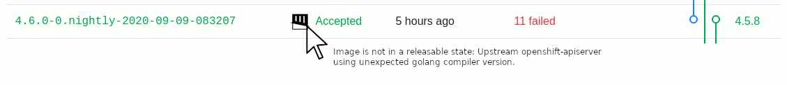

## Release Signoff Checklist

- [ ] Enhancement is `implementable`
- [ ] Design details are appropriately documented from clear requirements
- [ ] Test plan is defined
- [ ] Graduation criteria for dev preview, tech preview, GA
- [ ] User-facing documentation is created in [openshift-docs](https://github.com/openshift/openshift-docs/)

## Summary

OpenShift, as a supported product (OCP), is built behind the Red Hat firewall using systems and 
methods that differ greatly from our CI infrastructure. This is not necessarily a negative as it 
permits our CI to move fast, while production builds maintain enterprise-grade trust through 
rigorous process and auditability. Until recently, these systems were effectively independent, 
allowing CI artifacts and production artifacts to vary -- regularly differing in the version of 
golang being used or the RPM versions installed in base images. 

To aid in the migration from UBI7 to UBI8 for OpenShift 4.6, a mechanism was implemented which 
periodically drives consistency for base & builder images unidirectionally from downstream production 
metadata to upstream CI configuration (upstream in this document refers to OpenShift repos and CI; 
downstream refers to ART/production builds). 

Having established that consistency for the purposes of the migration, we want to swing the pendulum 
back somewhat to allow upstream repositories greater flexibility and timing to choose precisely when 
and if they want to migrate to a new version of golang while still keeping upstream and downstream 
builds tightly aligned. 

## Motivation
The current upstream / downstream alignment implementation ensures that upstream repos:
- Are automatically made aware of the state of golang and base image metadata being used downstream 
  by virtue of [PRs opened against their Dockerfiles](https://github.com/openshift/kubernetes/commit/5e44d0d96f6cceb855849703ad7d330b4e6049b4#diff-8b4ff66009686da578abb5f946c3d367).
- Have an opportunity to test those images in CI using that PR.
- Do not need to stay abreast of which builder and base images to adopt - they are suggested 
  automatically and are (to the extent possible) equivalent and up-to-date with the images being used 
  downstream.

These characteristics are a huge step forward when compared to the previously invisible disparity 
between upstream and downstream. That disparity allowed critical testing (unit tests, integration, 
and operator specific jobs) to run against images in CI that were built on potentially different 
golang versions - dramatically decreasing the fidelity of the upstream CI signal engineering 
relied upon - leaving the limited openshift-tests based periodics, run by the release controller, 
to exercise builds based on the actual downstream golang.

The drawback to the current alignment approach is that downstream begins using these base and builder 
images for production builds prior to the alignment PRs being opened or merged upstream. This creates 
extremely undesirable windows of time where an upstream team has not accepted (and tested!) a builder 
image change (e.g. a golang version bump), but production builds are already using it for their component.

This enhancement seeks to close that window and permit downstream builds to trail upstream in 
adopting the base & builder image changes. 

### Goals
The current alignment implementation, prior to this enhancement, had the following goals:
- The ART pipelines will provide up-to-date, downstream equivalent images within the CI environment. 
  These will be referred to as "ART equivalent" images.
- Downstream metadata describing how to build production images which compose a release will be 
  analyzed automatically and used to open upstream PRs for Dockerfiles when those Dockerfiles 
  are not aligned with the current state of the production metadata's ART equivalent images.

Enhancement Goal:
- If a component's upstream Dockerfile is using ART equivalent images, the downstream build process 
  will honor the builder images within that Dockerfile until shortly before feature freeze. This 
  will provide upstream teams:
    - Visibility that a change is being recommended.
    - The time to test those changes with full test coverage (not only openshift-tests periodics, 
      but also unit, integration, operator tests etc.).
    - The space to align their production metadata if the change is not appropriate for their component.
  All before production builds begin to use the suggested change.
- Ensure that all alignment PRs are either merged or closed (after discussion with ART to change 
  production metadata) well before GA.
- Prevent long term divergence between upstream and downstream builds.
- Prevent components from lingering on aging golang versions indefinitely. Older versions of 
  golang carry a growing support cost and security risk that is better addressed by teams 
  migrating to new versions.
- CI and downstream ART builds use the same image specification in the upstream repositories 
  until feature freeze. Disparities between CI and ART after this point will be visible and 
  tracked (first by PRs and then by BZs if the disparity remains).
- To make evident, through the release controller, when a release is inconsistent 
  between upstream and downstream in order to provide organizational visibility. 

### Non-Goals
- Improve coverage of minor Golang updates of the platform. Those updates only run openshift-tests 
  based tests (promotion jobs). We are aware that minor Golang updates do NOT have full test coverage, 
  e.g. unit, integration, operator tests are NOT run.
- To allow upstream repositories to use arbitrary builder images. Even if this were desirable, 
  it cannot be reproduced behind the firewall -- production builds cannot access the Internet 
  and all inputs to a given production build must themselves be produced as part of a production 
  build (e.g. an arbitrary golang version chosen upstream cannot be used downstream until a Red 
  Hat internal team builds  -- and supports -- that golang version as part of a production build).
- Within a given z-stream, allow users to pick a minor (eg. 1.15.1 vs 1.15.2) version of golang. 
  ART ensures that the latest available builder image provided by the golang team is used.
- To solve the problem of building upstream Dockerfiles locally with tools like "podman build". 
  With the current implementation, a Dockerfile which does not install any RPMs will build correctly 
  (in alignment with ART and CI) if the engineer is logged into the api.ci registry. 
  However, attempts to install RPM dependencies within a Dockerfile will fail as the yum 
  repositories defined in ART equivalent images resolve to services accessible only to 
  workloads on the api.ci cluster (e.g. `http://base-4-6-rhel8.ocp.svc`). These repos 
  will fail to resolve for local builds.

## Proposal
If, prior to code freeze, a downstream production build detects that an upstream Dockerfile is using an 
ART equivalent image, even if it differs from the currently desired production state for that image, 
the production build will trust that Dockerfile and reverse lookup production equivalent image(s) 
with which to build the Dockerfile. 

As an example: 
1. **Day 0 / Initial state**: all upstream component's 4.6 branches have Dockerfiles with FROM statements 
   based on ART equivalent images for golang 1.14:
   `FROM registry.svc.ci.openshift.org/ocp/builder:rhel-8-golang-1.14-openshift-4.6 AS builder`. 
   There are no open alignment PRs.
2. **Day 1**: the control-plane team notifies ART that golang 1.15 be a requirement for the upcoming rebase of 
   Kubernetes. ART works with the internal Red Hat golang team to ensure a production build of golang 1.15 is available.
3. **Day 15**: 1.15 is now available for production builds. 
    1. ART modifies its production metadata to add golang 1.15 as the suggested golang version for 
       upstream components tracking the control-plane's version 
       (this is most components, unless there is an exception granted; e.g. etcd).
    2. After making this change, an ART equivalent image is pushed to CI: 
       `registry.svc.ci.openshift.org/ocp/builder:rhel-8-golang-1.15-openshift-4.6`
    3. Soon after detecting this change, DPTP automation opens up >150 alignment PRs against upstream 
       component Dockerfiles tracking the control-plane's go version. The PRs recommend a change from:
       `FROM registry.svc.ci.openshift.org/ocp/builder:rhel-8-golang-1.14-openshift-4.6 AS builder`
       to
       `FROM registry.svc.ci.openshift.org/ocp/builder:rhel-8-golang-1.15-openshift-4.6 AS builder`
    4. In response to these PRs, CI will build images using the updated golang and run all test jobs for that repo.
    5. Production builds during this time will detect that many upstream components' Dockerfiles are using the older, 
       but valid, ART equivalent 1.14 golang image. Instead of using the production metadata's desired state 
       (golang 1.15) to compile, the previous version, golang 1.14, will be used to build those images.
    6. Downstream releases which contain builds from inconsistent upstream builder images will be produced as 
       normal nightlies, but they will be annotated in such a way as to make the release controller 
       highlight the discrepancy. 
4. **Day 19**: Half the upstream alignment PRs have been tested by component owners and merged. 
    ART is automatically building those components now with the desired golang 1.15 and the remaining upstream 
    components with golang 1.14.
5. **Day 20**: Component X owner is unable to migrate to golang 1.15. 
    1. They justify an exception with the architecture team and subsequently communicate the approved requirement to ART. 
    2. ART places the component image on a golang stream independent from the control-plane. 
    3. The alignment PR is updated automatically to reflect the new desired state. If that desired state 
       is identical to Day 0, the alignment PR is a no-op and can be closed.
6. **Day 45**: Feature freeze is approaching. ART queries for open alignment PRs and finds 2 in the search. 
   Urgent BZs are opened against both components to communicate the need for either alignment or production metadata changes.
7. **Day 48**: Feature freeze. ART changes production metadata to reflect the beginning of a new stage of the software 
   lifecycle. One urgent BZ, despite escalation, remains unanswered. It is changed to a blocker bug. To ensure consistent 
   and predictable builds leading up to and after GA, the production metadata is now authoritative and the upstream 
   discrepancy is ignored (the PR and BZ remain open).
8. **Day N**: If, at any point after feature freeze, the ART build pipeline detects that an upstream repository is not using 
   the builder image defined in ART metadata, the release will be marked as inconsistent (visible in the release controller 
   and programmatically accessible by checking an annotation). If the ART pipeline attempts to promote an inconsistent release, 
   it will abort unless it is manually overridden. The manual override would only be undertaken if it was determined, 
   with architectural approval, that the inconsistency was introduced erroneously and that the promotion is a critical 
   delivery (e.g. a CVE fix).
   
### Implementation Details/Notes/Constraints

If an upstream component owner does not just accept PRs (e.g. selects an arbitrary go version or selects 
an out of support ART equivalent from several releases ago), ART will not be able to reverse lookup the product 
equivalent image. The component owner may believe they are building using a particular version of golang in 
production, while they are not. If a reverse lookup fails, ART will build with the component using
the current state of ART metadata. It should be noted that, during this time, an alignment PR will remain 
open and the overall release will be annotated as inconsistent (details follow).

The proposal also implies that CI will make use of the FROM lines in the repository Dockerfiles. CI can 
and will apply a mapping to these, but will derive the Golang version (or other versions of that matter) 
from the repository files. The case of explicit image overrides in the openshift/release repository will become the exception, 
i.e. a PR against the upstream repository will be enough to switch the version of the base or build image.

When the ART pipeline detects that a given build has inconsistent upstream and downstream configurations, 
it will still feed the build into the OpenShift release controller. However, the imagestream tag within 
the 4.x-art-latest imagestream (which the release controller consumes) will be annotated with the reason 
ART believes the subsequent release cannot be used for a production. The release controller will propagate 
each inconsistency annotation within the ART imagestream into the subsequent release payload's imagestream 
tag in is/release. 

For example, if:
`istag/4.5-art-latest:tests` has the annotation `"release.openshift.io/inconsistency": [ "Upstream and downstream build configurations differ" ]`
`istag/4.5-art-latest:machine-os-content` has the annotation `"release.openshift.io/inconsistency": [ "Image build with disparate rpms" ]`

The subsequent entry for a release in is/release would be a union of all istag inconsistency annotations:
`istag/release:4.5.0...` would have the annotation `"release.openshift.io/inconsistency": [ "Image build with disparate rpms", "Upstream and downstream build configurations differ" ]`

When rendering the release controller browser interface, a release payload possessing these annotations 
will be displayed with an icon indicating inconsistency. When a user hovers their mouse over this icon, a 
tooltip will display all inconsistencies that prevent this release from being released for production.

### Risks and Mitigations

The proposal is designed to mitigate risks that already exist.

## Design Details

ART maintains metadata describing how to build component images behind the firewall in [ocp-build-data](https://gihub.com/openshift/ocp-build-data) branches. 

For example, the etcd-operator component is built from [upstream source](https://github.com/openshift/ocp-build-data/blob/ea361cd7df02ccb86ad5abd8b46ff0f1e9738918/images/cluster-etcd-operator.yml#L5-L11)
using the ART ["golang" builder stream](https://github.com/openshift/ocp-build-data/blob/8112d3d654460d8e70d14b8dae4ec8b9c75eecb8/images/cluster-etcd-operator.yml#L17) and 
uses [another product component](https://github.com/openshift/ocp-build-data/blob/8112d3d654460d8e70d14b8dae4ec8b9c75eecb8/images/cluster-etcd-operator.yml#L18) as a base image: `openshift-enterprise-base`. 
The `openshift-enterprise-base` component is built using the [ART "rhel"](https://github.com/openshift/ocp-build-data/blob/8112d3d654460d8e70d14b8dae4ec8b9c75eecb8/images/openshift-enterprise-base.yml#L14)
image stream as a base image (note that this ART image stream concept should not be confused with OpenShift imagestreams).

An ART "stream" name is just an indirection that is resolved to the pullspec of an image behind the 
firewall by referencing the map [streams.yml](https://github.com/openshift/ocp-build-data/blob/4ddb52b084eddecc1cc8c23c639a9764fd8f7825/streams.yml).  
In this file, you can find that the [golang stream](https://github.com/openshift/ocp-build-data/blob/4ddb52b084eddecc1cc8c23c639a9764fd8f7825/streams.yml#L36) 
will be dereferenced to the internal production image [openshift/golang-builder:rhel_8_golang_1.14](https://github.com/openshift/ocp-build-data/blob/4ddb52b084eddecc1cc8c23c639a9764fd8f7825/streams.yml#L37). 

Additional metadata is also present in streams.yml which maps these [internal image pullspecs](https://github.com/openshift/ocp-build-data/blob/4ddb52b084eddecc1cc8c23c639a9764fd8f7825/streams.yml#L37)
to their [ART equivalent locations for CI](https://github.com/openshift/ocp-build-data/blob/4ddb52b084eddecc1cc8c23c639a9764fd8f7825/streams.yml#L43). In some cases, this requires only a direct 
mirroring. In other cases, ART mirrors the internal image to an intermediate location, triggering a 
buildconfig in CI, which layers on additional CI specific information (e.g. yum repositories that can be 
used to install RHEL RPMs). 

The work to populate and maintain these ART equivalent images was completed as a necessary building block 
for the UBI8 migration and the first wave of alignment PRs. Additional details are outside the scope of this document. 
The purpose of describing them here is to make clear that ART now has a mapping from production builder images to locations 
which can be used by CI. 

This proposal relies on the fact that this linkage was established and the initial, unidirectional alignment PRs 
merging. Having done so, most (if not all) upstream component repositories will be using ART equivalent images 
in their Dockerfiles. This provides us our first ever opportunity for ART to honor the upstream Dockerfile 
builder images. ART can reverse lookup the ART equivalent images in streams.yml and find a valid internal image 
to use in its place for the production build.

### Test Plan

Test branches of ART metadata will be constructed to reflect golang version changes. Contrived upstream repositories 
states will be used as inputs. Analysis of the ART "rebase" process will be used to determine if the code is honoring 
ART equivalent images upstream.

    
## Drawbacks

- Upstream owners do not have unlimited flexibility in choosing golang builder images. It is limited to the 
  set available within the Red Hat firewall. 
- Upstream owners do not have indefinite flexibility in choosing golang builder images. Production builds will use 
  tightly controlled metadata for security purposes. 
- Upstream owners cannot build images that require the yum install of RPMs locally -- i.e. outside of the CI context. 
  In the CI environment, those RPMs are sourced from api.svc services. When run locally, they would require RHEL subscriptions. 
  If an image does not need to install any RPMs, they should be able to docker build the upstream Dockerfiles directly. 
  There are means by which we can try to address this, but this enhancement does not attempt to.

## Alternatives

1. Eliminating centralized configuration of golang versions and allowing upstream teams to choose their own 
   ART equivalent versions freely and indefinitely. Announce deprecation of ART equivalents as they become 
   unsupportable (and the architecture team agrees that can be avoided) and then disable them in production 
   builds (production owners would begin receiving build errors for their component).
2. Fundamentally revisiting internal Red Hat build systems and methods. 

