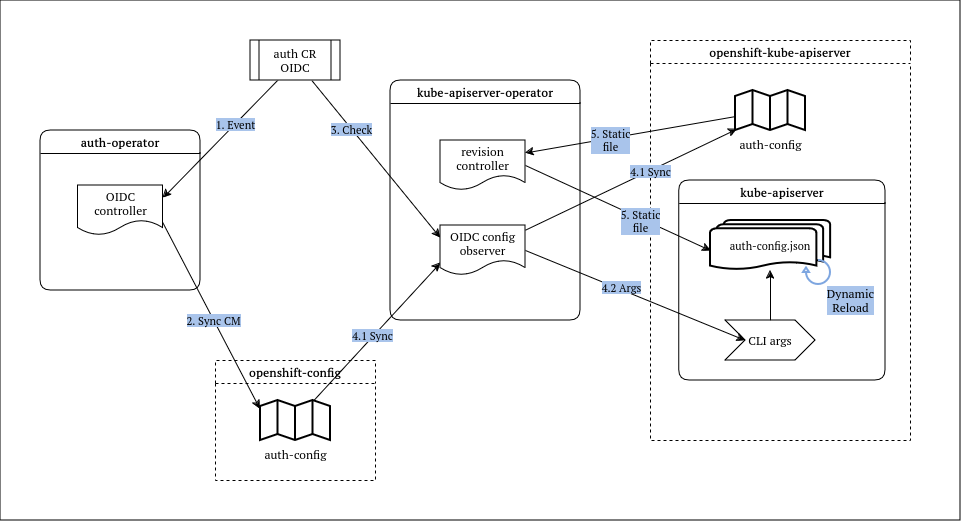

# Direct External OIDC Provider

## Summary

OpenShift has its own built-in OAuth server which can be used to obtain OAuth access tokens for authentication to the API. The server can be configured with an external identity provider (including support for OIDC), however it is still the built-in server that issues tokens. This enhancement proposal suggests a mechanism to enable configuration and direct usage of an external OIDC provider to issue tokens for authentication, instead of using the built-in OAuth server.

## Motivation

While external OIDC provider integration is supported by the built-in OAuth server, it is limited to the capabilities of the OAuth server itself. Customers want to be able to directly integrate their Identity Providers to the OpenShift cluster in order to facilitate machine-to-machine workflows (e.g. CLI) and capabilities of OIDC providers (similar to upstream Kubernetes), and to achieve seamless authentication in hybrid environments (e.g. k8s and non-k8s clusters) using a single Identity Provider.

### User Stories

- As a customer, I want to integrate my OIDC Identity Provider directly with OpenShift's APIServer so that I can fully use its capabilities in machine-to-machine workflows.
- As a customer in a hybrid cloud environment, I want to seamlessly use my OIDC Identity Provider across all of my fleet.

### Goals

1. Provide a direct authentication workflow such that OpenShift can consume bearer tokens issued by a single external OIDC identity provider.
2. Replace the built-in OAuth stack by deactivating/removing its components as necessary.

### Non-Goals

1. Keep the built-in OAuth stack working in parallel with an external OIDC provider.
2. Use more than one external OIDC provider at the same time.

## Proposal

This proposal introduces changes to the cluster-authentication-operator which manages the OAuth stack and to components that send requests to the existing built-in OAuth server. The built-in OAuth server will still be available as the default option; the user will be able to configure their provider as a Day-2 configuration.

Currently, any component that needs to obtain tokens or authenticate users does so using the built-in OAuth server. In order to integrate and use an external OIDC Identity Provider directly, any component must replace its configuration to call the external OIDC provider instead of the built-in server. The core components that send requests to the OAuth server are:

- OpenShift Console calls the OAuth server for user login to the console, and to obtain and display API access tokens
- `oc` calls the OAuth server for user login to the API, and to obtain API access tokens
- kube-apiserver calls the oauth-apiserver via an authentication webhook for token validation

OCP provides means of dynamic OAuth2 client registration, which means that other components using the OAuth2 server might also exist; however these cases are not within the scope of this proposal.

Note that the kube-apiserver already supports direct external OIDC providers; this proposal describes the mechanisms that need to be implemented in order to enable the configuration of an external OIDC provider for the kube-apiserver in an OCP cluster.

To enable configuration changes for each of the core components, the Authentication CRD has been extended with a new API that allows the specification of the details of the external OIDC provider to use. For `oc` in particular, this specification must be carried out via relevant command-line options.

Additionally, when an external OIDC provider is configured, any components and resources that are related to the built-in OAuth server must be removed (and recreated when the built-in OAuth server is configured anew). These components and resources are managed by the cluster-kube-apiserver-operator and the cluster-authentication-operator.

### Workflow Description

To use an external OIDC provider in core components, the user must update the Authentication CR and specify the provider's details in the respective fields. To use the provider with the `oc` CLI tool, the user must use the command-line flags of the tool in order to specify the provider's details.

#### External OIDC provider configuration

Apart from the provider URL, which is always required, the configuration details of an external OIDC provider might also include, depending on the workflow:

- the ID of the corresponding OIDC client at the provider's side
- the client secret
- the provider's certificate authority bundle
- any relevant extra scopes

#### Authentication Resource

The cluster's Authentication CR (`authentication.config/cluster`) must be modified and updated with the configuration of the external OIDC provider in the `OIDCProviders` field.

Once the CR gets updated, the changes will be picked up automatically by the cluster-kube-apiserver-operator, the cluster-authentication-operator and the console-operator; the operators will then update their operands accordingly and will remove all relevant components/resources.

For more information on the Authentication CR API, see [API Extensions](#api-extensions).

#### `oc` CLI tool

`oc` supports the specification of the details of an external OIDC provider to be used via an exec plugin (currently, only `oc-oidc` is supported). See `oc login --help` for more details on how to specify these details.

Note that the necessary changes have already been implemented in `oc`; see [oc#1640](https://github.com/openshift/oc/pull/1640).

### API Extensions

To facilitate the specification of the external OIDC provider configuration, the Authentication CRD is extended with a new field `OIDCProviders`, in its spec:

```go
type AuthenticationSpec struct {
	...

	// OIDCProviders are OIDC identity providers that can issue tokens
	// for this cluster
	// Can only be set if "Type" is set to "OIDC".
	//
	// At most one provider can be configured.
	//
	// +listType=map
	// +listMapKey=name
	// +kubebuilder:validation:MaxItems=1
	// +openshift:enable:FeatureGate=ExternalOIDC
	OIDCProviders []OIDCProvider `json:"oidcProviders,omitempty"`
}
```

For more details on the `OIDCProvider` type and its fields, see [here](https://github.com/openshift/api/blob/fa2f9ad8645efed0a83c24de025fd7fe791cc558/config/v1/types_authentication.go#L197).

### Topology Considerations

#### Hypershift / Hosted Control Planes

The functionality for enabling of external OIDC support has been implemented independently for Hypershift (see [OCPSTRAT-933](https://issues.redhat.com/browse/OCPSTRAT-933))

While the implementation for standalone OCP will not have any direct impacts to Hypershift, there are some kube-apiserver
changes that will be made to ensure a holistic change when enabling external OIDC on a standalone OCP cluster that
Hypershift should consider using to ensure a holistic change in a Hypershift cluster. More details can be found
in the Implementation Details below, specifically the section covering the considerations in place for the
`authorization.openshift.io/RestrictSubjectBindings` admission plugin.

#### Standalone Clusters

This enhancement proposal applies to standalone OCP.

#### Single-node Deployments or MicroShift

**SNO:** Configuring an external OIDC provider in a Single-Node deployment of OpenShift will result in reduced resource consumption overall, due to the fact that once an external provider is configured successfully, the system will remove components and resources that are unused (e.g. the oauth-server and oauth-apiserver pods won't exist).

**MicroShift:** This proposal is not relevant to MicroShift, as it does not run with multiple users.

While the implementation for standalone OCP will not have any direct impacts to MicroShift, there are some kube-apiserver
changes that will be made to ensure a holistic change when enabling external OIDC on a standalone OCP cluster that
MicroShift should consider using to prevent unintentional behaviors when the OAuth stack is not present.
More details can be found in the Implementation Details below, specifically the section covering the considerations
in place for the `authorization.openshift.io/RestrictSubjectBindings` admission plugin.

### Implementation Details/Notes/Constraints

#### Configuring the kube-apiserver

The kube-apiserver already supports using a direct external OIDC provider; it can be configured to use external OIDC using a [_structured authentication config file_](https://kubernetes.io/docs/reference/access-authn-authz/authentication/#using-authentication-configuration) or a set of specific command-line arguments (`--oidc-*` flags; see [here](https://kubernetes.io/docs/reference/access-authn-authz/authentication/#using-authentication-configuration) for more details). This enhancement uses the structured authentication configuration file approach, as this has several advantages, notably API validation and dynamic authenticator reload when file changes are detected (however the latter is currently not possible; more details below).

The following diagram summarizes what happens in the cluster when a new OIDC provider is configured in the Authentication Resource.



Configuration starts when an admin modifies the Authentication Resource (auth CR) and specifies the OIDC provider's configuration via the respective API. As shown in the diagram above, the following steps take place:

1. The External OIDC Controller inside the cluster-authentication-operator (CAO) tracks the auth CR and receives an event when it is modified
2. The controller generates a structured authentication configuration (`apiserver.config.k8s.io/AuthenticationConfiguration`) object based on the contents of the auth CR, validates the configuration and serializes it into JSON, storing it within a ConfigMap (`auth-config`) inside the `openshift-config-managed` namespace
3. The OIDC config observer inside the kube-apiserver-operator (KAS-o) detects an OIDC configuration in the auth CR
4. The config observer syncs the `auth-config` ConfigMap from `openshift-config-managed` into `openshift-kube-apiserver`, and sets up the `--authentication-config` CLI arg of the kube-apiserver (KAS) to point to a static file on each KAS node; this config change triggers a rollout
5. The revision controller of the KAS-o syncs the `auth-config` ConfigMap from within `openshift-kube-apiserver` into a static file on each KAS node; since this is a revisioned ConfigMap, any change will also trigger a rollout

During step 4, the respective config observers for the `WebhookTokenAuthenticator` and `AuthMetadata` must also detect the OIDC configuration and remove their respective CLI args and resources (more details in the next section). Since all config observers run in the same loop of the config observation controller, the resulting configuration will include the results of all three controllers. Once the next rollout is completed, the KAS pods will use the structured authentication configuration via the static file generated with the process described above.

After a successful rollout and hence configuration of OIDC for the KAS pods, the CAO must proceed and clean up any controllers and resources that are related to the OAuth stack, effectively disabling it (see next sections for more details).

#### Dynamic authenticator reload

When making changes to the OIDC configuration, there's various pros and cons in using dynamic file reload instead of performing a full kube-apiserver rollout. Dynamic authenticator reload has immediate effect, while performing a full rollout typically takes a while to complete; this is particularly evident when an admin makes several changes to the config, trying to get it right. However simply reloading the authenticator dynamically is a dangerous practice, as it might bring down authentication on all KAS pods should something go wrong, unless there are proper validation and health checks in place; doing a rollout is a more controller process, as the rollout stops and rolls back in case something goes wrong with the revision that triggers the rollout.

As mentioned above, kube-apiserver readily supports dynamic authenticator reload when using the structured authentication configuration file. However, this is currently not possible in OpenShift; at the time of writing this enhancement, there is no way to create static files from revisioned ConfigMaps without triggering a rollout at the same time. Having revisioned ConfigMaps is valuable as they can be used as a reference for each revision and provide a means for rollback. Once a mechanism to have revisioned ConfigMaps without triggering a rollout gets implemented, we should consider replacing the current OIDC config rollout.

#### cluster-kube-apiserver-operator

The cluster-kube-apiserver-operator (KAS-o) relies on the authentication configuration in the following cases:

- the `WebhookTokenAuthenticator` config observer observes the `webhookTokenAuthenticator` field of the Authentication CR and if `kubeConfig` secret reference is set it uses the contents of this secret as a webhook token authenticator for the API server; it also takes care of synchronizing this secret to the `openshift-kube-apiserver` namespace
- the `AuthMetadata` config observer sets the `OauthMetadataFile` field of the CR with the path for a ConfigMap referenced by the authentication config

The operator must watch the Authentication CR for changes, and when it detects an external OIDC provider configuration, the `WebhookTokenAuthenticator` and `AuthMetadata` observers must be adapted so that they remove the associated resources and KAS CLI flags from the observed configuration.

In case the authentication configuration gets changed back to the built-in OAuth server, the operator must revert these changes and bring the kube-apiserver and relevant resources back to the original state of affairs.

#### cluster-authentication-operator

When configuring OIDC, the operator will validate the input configuration in the authentication CR before generating the structured authentication configuration and serializing it into a ConfigMap. The operator must perform as many validations as possible on the configuration, in order to prevent configuration errors from manifesting after rolling out KAS pods; it should try to catch as many errors, as early as possible in the process.

When the built-in OAuth server is used for authentication (the default and original cluster state), the cluster-authentication-operator (CAO) manages all controllers and resources related to it; notably, it manages the deployments of the oauth-server and oauth-apiserver, and manages resources such as the respective namespaces, service accounts, role bindings, services, OAuth clients, etc. Moreover, it monitors the status of its operands, making sure that the routes/services are healthy and reachable, and updates its operator status accordingly.

##### OAuth stack deactivation

In case an external OIDC provider is configured for authentication, then these controllers and resources are neither useful nor relevant. The operator must watch the OIDC configuration status, and once it becomes available it must deactivate the OAuth stack.

_What signals that the OIDC configuration is available, and when should deactivation start?_
At the time of writing this enhancement, there is no suitable API that the cluster-kube-apiserver-operator can use to signal that the OIDC configuration is available. The Authentication CR contains an OIDC Clients Status field, however this is specific to clients in the context of the OIDC protocol. Additionally, that field uses the Available/Progressing/Degraded pattern which is not suitable for determining whether the operator needs to deactivate or reactivate the OAuth stack.

The current proposed solution for this is for the authentication operator to inspect the following:

1. Check all current revisions of the kube-apiserver pods
2. For each observed revision, check whether it includes a revisioned structured auth-config ConfigMap
3. If there is, and the respective revision KAS argument is enabled, then OIDC is available on the KAS pods
4. If any pod is on a revision that does not include an OIDC auth-config, then the OIDC rollout has not been completed in full yet, or that a rollout that switches auth from OIDC back to OAuth is in progress

The above information is available in the `kubeapiservers/cluster` resource.

This process determines whether OIDC is available on the KAS pods or not; when it is detected to be available, then the authentication operator can proceed with deactivation.

_How does deactivation happen?_
To deactivate the OAuth stack, each controller of the authentication operator must gracefully remove its operands from the respective namespaces. The two OAuth namespaces (`openshift-authentication`, `openshift-oauth-apiserver`) must not be deleted to avoid breaking watches from other components.

#### console-operator

The console-operator watches the Authentication CR for changes, and when it detects an external OIDC provider configuration, it makes the following changes to configure Console and replace the internal built-in OAuth server:

- if specified, it copies the provider's CA file to the Console's namespace as a ConfigMap, and updates the Console deployment to track it for changes
- if specified, it copies the provider's client secret to the Console's namespace as a Secret
- it stops OAuth Clients informers, where used in its controllers
- it updates the `AuthenticationStatus` field of the Authentication CR with the operator's status with respect to applying the OIDC provider configuration

These changes have already been implemented, and the initial PR for them can be found [here](https://github.com/openshift/console-operator/pull/839).

#### `oc` plugin considerations

In order to use `oc` with an external OIDC provider, the tool has been [extended](https://github.com/openshift/oc/pull/1640) with the necessary functionality, including command-line arguments that enable the required configuration. In particular, [`oauth2cli`](https://github.com/int128/oauth2cli) has been vendored into the `oc` codebase. One important consideration here is that depending on the OIDC provider, further functionality might be required, in which case `oc` will have to be extended to support that too.

#### authorization.openshift.io/RestrictSubjectBindings admission plugin considerations

OpenShift's default admission plugin `authorization.openshift.io/RestrictSubjectBindings`
utilizes the OAuth stack, specifically the `User` and `Group` APIs, to ensure `RoleBinding`
subjects do not violate any restrictions in the namespace they are going to be created in.
These restrictions are specified by `RoleBindingRestriction` custom resources.

Removing the OAuth stack entirely may result in the `authorization.openshift.io/RestrictSubjectBindings` admission plugin not functioning as expected.

Anticipated impacts are:

- Logs in the KAS reflecting that informers for OAuth APIs could not be started
- Errors, that are not actionable from the perspective of users, occurring during validation of `RoleBinding` resources when a `RoleBindingRestriction` resource in the same namespace specifies user/group restrictions. These errors prevent the creation of `RoleBinding`s in a namespace, making it impossible to manage permissions in the namespace.

These impacts may cause concern for cluster administrators that their cluster is in an unhealthy state and may not be easily correlated to taking down the OAuth stack.

To ensure a holistic change in cluster behavior when removing the OAuth stack, and reduce potentially concerning behavior in the control plane components, it is proposed that changes are made to:

- Remove the `rolebindingrestrictions.authorization.openshift.io` CustomResourceDefinition
- Disable the `authorization.openshift.io/RestrictSubjectBindings` and `authorization.openshift.io/ValidateRoleBindingRestriction` admission plugins as they are reliant on the `RoleBindingRestriction` resource and/or the OAuth stack being present

##### Changes to the kube-apiserver

The OpenShift-specific patch to the kube-apiserver that adds this admission plugin is found here:
https://github.com/openshift/kubernetes/blob/3c62f738ce74a624d46b4f73f25d6c15b3a80a2b/openshift-kube-apiserver/openshiftkubeapiserver/patch.go#L71

In order to prevent misleading logs about informers that failed to start or errors related to creating `RoleBinding` resources, the following changes to this patch are to be made:

- `Group` informer creation and configuration is moved into the `authorization.openshift.io/RestrictSubjectBindings` admission plugin initialization process

##### Changes to the cluster-kube-apiserver-operator

When the `Authentication` resource with name `cluster` has `.spec.type` not set to `IntegratedOAuth`, the `authorization.openshift.io/RestrictSubjectBindings` and `authorization.openshift.io/ValidateRoleBindingRestriction` admission plugins will be disabled.

When transitioning from `IntegratedOAuth` to another valid value, the appropriate config observers will update the `KubeAPIServerConfig.apiServerArguments` map to:

- Remove the `authorization.openshift.io/RestrictSubjectBindings` and `authorization.openshift.io/ValidateRoleBindingRestriction` admission plugins from the `--enable-admission-plugins` argument
- Add the `authorization.openshift.io/RestrictSubjectBindings` and `authorization.openshift.io/ValidateRoleBindingRestriction` admission plugins to the `--disable-admission-plugins` argument

When transitioning from another value to `IntegratedOAuth`, the appropriate config observers will update the `KubeAPIServerConfig.apiServerArguments` map to:

- Remove the `authorization.openshift.io/RestrictSubjectBindings` and `authorization.openshift.io/ValidateRoleBindingRestriction` admission plugins from the `--disable-admission-plugins` argument
- Add the `authorization.openshift.io/RestrictSubjectBindings` and `authorization.openshift.io/ValidateRoleBindingRestriction` admission plugins to the `--enable-admission-plugins` argument

##### Changes to the cluster-authentication-operator

To support the need to remove the `rolebindingrestrictions.authorization.openshift.io` CustomResourceDefinition when the OpenShift oauth server is not desired, the cluster-authentication-operator will be updated to manage this CRD.

This will mean vendoring the generated CRD manifests as outlined in https://github.com/openshift/api/tree/master?tab=readme-ov-file#vendoring-generated-manifests-into-other-repositories and adding a new static resource controller to manage the CRD.

Managing the CRD will consist of the following:

- When OpenShift oauth server is desired, ensure the `RoleBindingRestriction` CRD exists and matches desired state
- When OpenShift oauth server is not desired, but `RoleBindingRestriction` resources exist, ensure the `RoleBindingRestriction` CRD exists and matches desired state, set CAO status to `Degraded` with a message stating that `RoleBindingRestriction` resources exist and as such we can not delete the CRD
- When OpenShift oauth server is not desired, no `RoleBindingRestriction` resources exist, remove the `RoleBindingRestriction` CRD

##### Changes to openshift/api

As the cluster-authentication-operator will now be responsible for the `rolebindingrestrictions.authorization.openshift.io` CRD, it should no longer be added to the openshift/api payload manifests that are included in a payload image and get managed by CVO.

This will likely mean removing the associated files from the hack/update-payload-crd.sh script here: https://github.com/openshift/api/blob/dd0f68969241c0548906ec98c12bb208512cbbb4/hack/update-payload-crds.sh#L6

During an upgrade from a version of OpenShift where the CRD is part of the payload, managed by CVO, to a version of OpenShift where the CRD is managed by the cluster-authentication-operator it is expected to a smooth handover. The anticipated handover flow is:

- CRD is in payload of 4.X, managed by CVO
- CRD is not in payload of 4.Y, CVO ignores CRD, managed by cluster-authentication-operator

##### Considerations for HyperShift

To ensure commonality in behavior between standalone OpenShift and HyperShift, HyperShift should be updated such that the `HostedControlPlane` controller will act in the same way the cluster-authentication-operator and cluster-kube-apiserver-operator will. Specifically:

- Managing the `RoleBindingRestriction` CRD
- Setting the appropriate flags on the kube-apiserver when oauth stack is not desired

This enhancement proposal is scoped only to standalone OpenShift, and while the changes made as part of this EP won't break HyperShift it is recommended that HyperShift is updated in this way.

##### Considerations for MicroShift

As MicroShift does not run with the OpenShift OAuth stack, it should be updated to ensure that:

- The `RoleBindingRestriction` CRD is not present
- Setting the appropriate flags on the kube-apiserver when oauth stack is not desired

This enhancement proposal is scoped only to standalone OpenShift, and while the changes made as part of this EP won't break MicroShift it is recommended that MicroShift is updated in this way.

#### Authentication disruptions

In case something goes wrong with the external provider, authentication might stop working. In such cases, cluster admins will still be able to access the cluster using a `kubeconfig` file with client certificates for an admin user. It is the responsibility of the cluster admins to make sure that such users exist; deleting all admin users might result in losing access to the cluster should any issues with the external provider arise.

### Risks and Mitigations

Enabling an external OIDC provider to an OCP cluster will result in the oauth-apiserver being removed from the system; this inherently means that the two API Services it is serving (`v1.oauth.openshift.io`, `v1.user.openshift.io`) will be gone from the cluster, and therefore any related data will be lost. It is the user's responsibility to create backups of any required data.

Additionally, configuring an external OIDC identity provider for authentication by definition means that any security updates or patches must be managed independently from the cluster itself, i.e. cluster updates will not resolve security issues relevant to the provider itself; the provider will have to be updated separately. Additionally, new functionality or features on the provider's side might need integration work in OpenShift (depending on their nature).

### Drawbacks

As mentioned above, configuring an external OIDC provider will effectively deactivate the built-in OAuth2 stack and remove all related API Services, resources and data. While switching back from an external OIDC provider to the built-in server is possible, it does not ensure that all existing data before the first switch to an OIDC provider will still exist, after reverting back to the built-in server.

## Open Questions

## Test Plan

In order to make development of this feature easier, an initial e2e test must be provided that sets up an OIDC provider in a cluster "manually" (i.e. without the help of operators) in order to test a minimum required set of authentication related functionality.

Overall, for this feature there must be e2e tests that cover the following:

- configuring an external OIDC provider on a cluster that uses the built-in OAuth stack (good/bad configurations should be tested)
  - authenticate users with bearer tokens issued by the OIDC provider
  - ensure tokens issued by the built-in oauth stack do not work
  - ensure user mapping capabilities work as expected
  - ensure that existence of `RoleBindingRestriction` resources results in the CAO status going Degraded
- on a cluster that uses an external OIDC provider, test reverting configuration back to the built-in OAuth stack (good/bad configurations should be tested)
- on a cluster that uses an external OIDC provider, test monitoring and cluster-authentication-operator status when the provider becomes unavailable
- version skew between participating components; e.g. the cluster-authentication-operator has picked up the new configuration but the kube-apiserver-operator hasn't yet
- cluster still accessible if OIDC provider becomes unavailable using a `kubeconfig` (break-glass scenario)
- on a cluster that uses an external OIDC provider, test that the `rolebindingrestrictions.authorization.openshift.io` CRD does not exist

Finally, in order to make sure that others can test their components in an external OIDC environment, a cluster with an external OIDC configuration must be created and made available to the CI.

## Graduation Criteria

### Dev Preview -> Tech Preview

- unit test coverage
- complete work on all related components to OIDC enablement (kube-apiserver-operator, cluster-authentication-operator) within the TechPreviewNoUpgrade/ExternalOIDC feature gate
- some minimal documentation to be used as guidance should exist

### Tech Preview -> GA

#### **Functionality**

- Built-in OAuth stack deactivation on successful enablement of external OIDC
- Disabling of kube-apiserver admission plugins that depend on the built-in OAuth stack
- Improved admission time API validations

_Stretch goals_

- Multiple IDP provider support
- Expose metrics, such as:
  - total number of authentication attempts
  - number of successful authentication attempts
  - number of failed authentication attempts
  - labeled with requesting client information
- Configuration parity with upstream Structured Authentication Config format

#### **Testing**

- CAO pre-submit E2E tests that cover enablement/function/OAuth deactivation
  - create CI job that uses TechPreviewNoUpgrade and run said tests before promotion
- periodic/payload testing:
  - create cluster profile/variant where external OIDC is configured
  - run origin tests on said cluster
  - write external OIDC specific E2E tests that cover enablement/function/OAuth deactivation
- kube-rbac-proxy testing

_Stretch goals_

- HyperShift E2E testing

_Documentation_

- Improved API field documentation
- Feature enablement documentation and guide
- Troubleshooting

### Removing a deprecated feature

n/a

## Upgrade / Downgrade Strategy

This proposal introduces non-breaking API changes to the authentication configuration; additionally this is an opt-in feature, and the default is the original state (i.e. using the built-in OAuth server for authentication). Therefore, upgrading to a cluster version that has this feature (from one that doesn't) should not have any effect on authentication.

## Version Skew Strategy

For this feature to work, all participating components must be on a version that includes the feature; version skew is not viable among versions that include and do not include the feature. The cluster-authentication-operator must monitor the progress and validity of the configuration of the external OIDC provider and reflect it to its status.

## Operational Aspects of API Extensions

n/a

## Support Procedures

### Logging and errors

The OIDC configuration is consumed by the kube-apiserver (KAS) pods, but produced by the cluster-authentication-operator (CAO). The CAO is responsible for performing as many validations on the configuration as possible, before generating the final OIDC configuration that will be consumed by the KAS; this means that in case of a bad configuration, the CAO will move its status to Degraded and log any errors encountered. It is noteworthy that the CAO performs a full validation on the OIDC provider's CA bundle (if one is provided), by hitting the discovery endpoint of the provider (`/.well-known/openid-configuration`) using the provided CA bundle, so that any CA errors are also caught early in the process.

Nevertheless, in case of OIDC problems that are not logged on the CAO side, one should consult the KAS logs and rollout progress as well. Additionally, the KAS-operator logs will also reveal any problems with syncing the ConfigMap and creating a revisioned one, creating a static file and enabling the OIDC KAS CLI argument.

## Alternatives (Not Implemented)

n/a

## Infrastructure Needed [optional]

n/a
