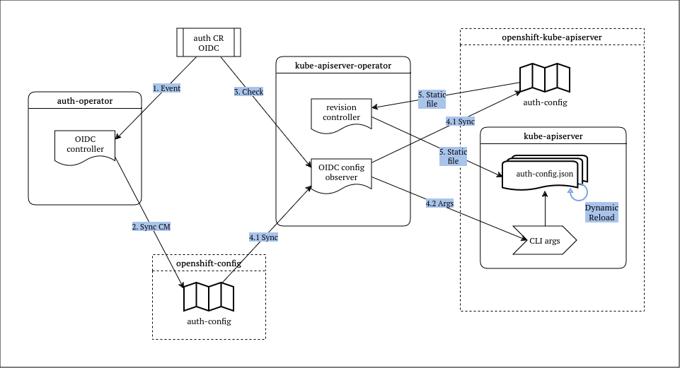

# Direct External OIDC Provider

## Summary

OpenShift has its own built-in OAuth server which can be used to obtain OAuth access tokens for authentication to the API. The server can be configured with an external identity provider (including support for OIDC), however it is still the built-in server that issues tokens. This enhancement proposal suggests a mechanism to enable configuration and direct usage of an external OIDC provider to issue tokens for authentication, instead of using the built-in OAuth server.

## Motivation

While external OIDC provider integration is supported by the built-in OAuth server, it is limited to the capabilities of the OAuth server itself. Customers want to be able to directly integrate their Identity Providers to the OpenShift cluster in order to facilitate machine-to-machine workflows (e.g. CLI) and capabilities of OIDC providers (similar to upstream Kubernetes), and to achieve seamless authentication in hybrid environments (e.g. k8s and non-k8s clusters) using a single Identity Provider.

### User Stories

- As a customer, I want to integrate my OIDC Identity Provider directly with OpenShift's APIServer so that I can fully use its capabilities in machine-to-machine workflows.
- As a customer in a hybrid cloud environment, I want to seamlessly use my OIDC Identity Provider across all of my fleet.

### Goals

1. Provide a direct authentication workflow such that OpenShift can consume bearer tokens issued by a single external OIDC identity provider.
2. Replace the built-in OAuth stack by deactivating/removing its components as necessary.

### Non-Goals

1. Keep the built-in OAuth stack working in parallel with an external OIDC provider.
2. Use more than one external OIDC provider at the same time.

## Proposal

This proposal introduces changes to the cluster-authentication-operator which manages the OAuth stack and to components that send requests to the existing built-in OAuth server. The built-in OAuth server will still be available as the default option; the user will be able to configure their provider as a Day-2 configuration.

Currently, any component that needs to obtain tokens or authenticate users does so using the built-in OAuth server. In order to integrate and use an external OIDC Identity Provider directly, any component must replace its configuration to call the external OIDC provider instead of the built-in server. The core components that send requests to the OAuth server are:

- OpenShift Console calls the OAuth server for user login to the console, and to obtain and display API access tokens
- `oc` calls the OAuth server for user login to the API, and to obtain API access tokens
- kube-apiserver calls the oauth-apiserver via an authentication webhook for token validation

OCP provides means of dynamic OAuth2 client registration, which means that other components using the OAuth2 server might also exist; however these cases are not within the scope of this proposal.

Note that the kube-apiserver already supports direct external OIDC providers; this proposal describes the mechanisms that need to be implemented in order to enable the configuration of an external OIDC provider for the kube-apiserver in an OCP cluster.

To enable configuration changes for each of the core components, the Authentication CRD has been extended with a new API that allows the specification of the details of the external OIDC provider to use. For `oc` in particular, this specification must be carried out via relevant command-line options.

Additionally, when an external OIDC provider is configured, any components and resources that are related to the built-in OAuth server must be removed (and recreated when the built-in OAuth server is configured anew). These components and resources are managed by the cluster-kube-apiserver-operator and the cluster-authentication-operator.

### Workflow Description

To use an external OIDC provider in core components, the user must update the Authentication CR and specify the provider's details in the respective fields. To use the provider with the `oc` CLI tool, the user must use the command-line flags of the tool in order to specify the provider's details.

#### External OIDC provider configuration

Apart from the provider URL, which is always required, the configuration details of an external OIDC provider might also include, depending on the workflow:

- the ID of the corresponding OIDC client at the provider's side
- the client secret
- the provider's certificate authority bundle
- any relevant extra scopes

#### Authentication Resource

The cluster's Authentication CR (`authentication.config/cluster`) must be modified and updated with the configuration of the external OIDC provider in the `OIDCProviders` field.

Once the CR gets updated, the changes will be picked up automatically by the cluster-kube-apiserver-operator, the cluster-authentication-operator and the console-operator; the operators will then update their operands accordingly and will remove all relevant components/resources.

For more information on the Authentication CR API, see [API Extensions](#api-extensions).

#### `oc` CLI tool

`oc` supports the specification of the details of an external OIDC provider to be used via an exec plugin (currently, only `oc-oidc` is supported). See `oc login --help` for more details on how to specify these details.

Note that the necessary changes have already been implemented in `oc`; see [oc#1640](https://github.com/openshift/oc/pull/1640).

### API Extensions

To facilitate the specification of the external OIDC provider configuration, the Authentication CRD is extended with a new field `OIDCProviders`, in its spec:

```go
type AuthenticationSpec struct {
	...

	// OIDCProviders are OIDC identity providers that can issue tokens
	// for this cluster
	// Can only be set if "Type" is set to "OIDC".
	//
	// At most one provider can be configured.
	//
	// +listType=map
	// +listMapKey=name
	// +kubebuilder:validation:MaxItems=1
	// +openshift:enable:FeatureGate=ExternalOIDC
	OIDCProviders []OIDCProvider `json:"oidcProviders,omitempty"`
}
```

For more details on the `OIDCProvider` type and its fields, see [here](https://github.com/openshift/api/blob/fa2f9ad8645efed0a83c24de025fd7fe791cc558/config/v1/types_authentication.go#L197).

### Topology Considerations

#### Hypershift / Hosted Control Planes

This enhancement proposal is not relevant to Hypershift; this has been implemented independently for Hypershift (see [OCPSTRAT-933](https://issues.redhat.com/browse/OCPSTRAT-933))

#### Standalone Clusters

This enhancement proposal applies to standalone OCP.

#### Single-node Deployments or MicroShift

**SNO:** Configuring an external OIDC provider in a Single-Node deployment of OpenShift will result in reduced resource consumption overall, due to the fact that once an external provider is configured successfully, the system will remove components and resources that are unused (e.g. the oauth-server and oauth-apiserver pods won't exist).

**MicroShift:** This proposal is not relevant to MicroShift, as it does not run with multiple users.

### Implementation Details/Notes/Constraints

#### Configuring the kube-apiserver

The kube-apiserver already supports using a direct external OIDC provider; it can be configured to use external OIDC using a [_structured authentication config file_](https://kubernetes.io/docs/reference/access-authn-authz/authentication/#using-authentication-configuration) or a set of specific command-line arguments (`--oidc-*` flags; see [here](https://kubernetes.io/docs/reference/access-authn-authz/authentication/#using-authentication-configuration) for more details). This enhancement uses the structured authentication configuration file approach, as this has several advantages, notably API validation and dynamic authenticator reload when file changes are detected.

The following diagram summarizes what happens in the cluster when a new OIDC provider is configured in the Authentication Resource.



Configuration starts when an admin modifies the Authentication Resource (auth CR) and specifies the OIDC provider's configuration via the respective API. As shown in the diagram above, the following steps take place:

1. The External OIDC Controller inside the cluster-authentication-operator (CAO) tracks the auth CR and receives an event when it is modified
2. The controller generates a structured authentication configuration (`apiserver.config.k8s.io/AuthenticationConfiguration`) object based on the contents of the auth CR, validates the configuration and serializes it into JSON, storing it within a ConfigMap (`auth-config`) inside the `openshift-config` namespace
3. The OIDC config observer inside the kube-apiserver-operator (KAS-o) detects an OIDC configuration in the auth CR
4. The config observer syncs the `auth-config` ConfigMap from `openshift-config` into `openshift-kube-apiserver`, and sets up the `--authentication-config` CLI arg of the kube-apiserver (KAS) to point to a static file on each KAS node; this config change triggers a rollout
5. The revision controller of the KAS-o syncs the `auth-config` ConfigMap from within `openshift-kube-apiserver` into a static file on each KAS node; since this is a revisioned ConfigMap, any change will also trigger a rollout

During step 4, the respective config observers for the `WebhookTokenAuthenticator` and `AuthMetadata` must also detect the OIDC configuration and remove their respective CLI args and resources (more details in the next section). Since all config observers run in the same loop of the config observation controller, the resulting configuration will include the results of all three controllers.

Once the next rollout is completed, the KAS pods will use the structured authentication configuration via the static file generated with the process described above. Any further changes to that file will trigger a dynamic reload of the authenticator within the KAS, without the need of a new revision rollout.

After a successful rollout and hence configuration of OIDC for the KAS pods, the CAO must proceed and clean up any controllers and resources that are related to the OAuth stack, effectively disabling it (see next sections for more details).

#### cluster-kube-apiserver-operator

The cluster-kube-apiserver-operator (KAS-o) relies on the authentication configuration in the following cases:

- the `WebhookTokenAuthenticator` config observer observes the `webhookTokenAuthenticator` field of the Authentication CR and if `kubeConfig` secret reference is set it uses the contents of this secret as a webhook token authenticator for the API server; it also takes care of synchronizing this secret to the `openshift-kube-apiserver` namespace
- the `AuthMetadata` config observer sets the `OauthMetadataFile` field of the CR with the path for a ConfigMap referenced by the authentication config

The operator must watch the Authentication CR for changes, and when it detects an external OIDC provider configuration, the `WebhookTokenAuthenticator` and `AuthMetadata` observers must be stopped or deactivated, as they are not relevant in the case of the external OIDC provider

In case the authentication configuration gets changed back to the built-in OAuth server, the operator must revert these changes and bring the kube-apiserver and relevant resources back to the original state of affairs.

#### cluster-authentication-operator

When the built-in OAuth server is used for authentication (the default and original cluster state), the cluster-authentication-operator (CAO) manages all controllers and resources related to it; notably, it manages the deployments of the oauth-server and oauth-apiserver, and manages resources such as the respective namespaces, service accounts, role bindings, services, OAuth clients, etc. Moreover, it monitors the status of its operands, making sure that the routes/services are healthy and reachable, and updates its operator status accordingly.

In case an external OIDC provider is configured for authentication, then these controllers and resources are neither useful nor relevant. Therefore, the operator must watch the Authentication CR, and when it detects a valid external OIDC provider configuration, it must turn its controllers into a state where they remove the state/resources they otherwise push to the cluster. The operator will not be monitoring the oauth-server and oauth-apiserver any longer, however it must monitor the external OIDC provider for reachability and health, and advertise the result in its status; it must either adapt the functionality of its monitoring controllers or use a new controller for that.

Note that the operator must first make sure that the rollout of the new provider configuration has been completed successfully before proceeding with the deactivation of the built-in OAuth stack. Also, in case the authentication configuration gets changed back to the built-in OAuth server, the operator must revert these changes and bring its operands and relevant resources back to the original state of affairs.

#### console-operator

The console-operator watches the Authentication CR for changes, and when it detects an external OIDC provider configuration, it makes the following changes to configure Console and replace the internal built-in OAuth server:

- if specified, it copies the provider's CA file to the Console's namespace as a ConfigMap, and updates the Console deployment to track it for changes
- if specified, it copies the provider's client secret to the Console's namespace as a Secret
- it stops OAuth Clients informers, where used in its controllers
- it updates the `AuthenticationStatus` field of the Authentication CR with the operator's status with respect to applying the OIDC provider configuration

These changes have already been implemented, and the initial PR for them can be found [here](https://github.com/openshift/console-operator/pull/839).

#### `oc` plugin considerations

In order to use `oc` with an external OIDC provider, the tool has been [extended](https://github.com/openshift/oc/pull/1640) with the necessary functionality, including command-line arguments that enable the required configuration. In particular, [`oauth2cli`](https://github.com/int128/oauth2cli) has been vendored into the `oc` codebase. One important consideration here is that depending on the OIDC provider, further functionality might be required, in which case `oc` will have to be extended to support that too.

#### Authentication disruptions

In case something goes wrong with the external provider, authentication might stop working. In such cases, cluster admins will still be able to access the cluster using a `kubeconfig` file with client certificates for an admin user. It is the responsibility of the cluster admins to make sure that such users exist; deleting all admin users might result in losing access to the cluster should any issues with the external provider arise.

### Risks and Mitigations

Enabling an external OIDC provider to an OCP cluster will result in the oauth-apiserver being removed from the system; this inherently means that the two API Services it is serving (`v1.oauth.openshift.io`, `v1.user.openshift.io`) will be gone from the cluster, and therefore any related data will be lost. It is the user's responsibility to create backups of any required data.

Additionally, configuring an external OIDC identity provider for authentication by definition means that any security updates or patches must be managed independently from the cluster itself, i.e. cluster updates will not resolve security issues relevant to the provider itself; the provider will have to be updated separately. Additionally, new functionality or features on the provider's side might need integration work in OpenShift (depending on their nature).

### Drawbacks

As mentioned above, configuring an external OIDC provider will effectively deactivate the built-in OAuth2 stack and remove all related API Services, resources and data. While switching back from an external OIDC provider to the built-in server is possible, it does not ensure that all existing data before the first switch to an OIDC provider will still exist, after reverting back to the built-in server.

## Open Questions

### console-operator

- Does the console-operator need to wait for the KAS-o to report that OIDC is configured and available before proceeding with its reconfiguration? It currently only watches for auth type to be OIDC before reconfiguring. This might affect hypershift, as there is no KAS-o.

### Structured authentication configuration ConfigMap as a revisioned resource

Using a revisioned resource for the structured authentication configuration ConfigMap allows us to sync its contents as a static file on the KAS nodes. However, this results in a new revision rollout of the pods with each change to that ConfigMap, which means that we won't be able to leverage the dynamic reload of the auth file into the KAS. Even at the first time we configure this, this shouldn't be a problem as the rollout will anyway happen for enabling the `--authentication-config` KAS CLI arg.

Is there a way to sync the ConfigMap into a static file, but avoid a new rollout?

### Config observers

Can we make sure that given a specific auth type in the auth CR, the three config observers (OAuth metadata, WebhookTokenAuthenticator, External OIDC) produce overall a valid config? This way there will be a single rollout needed to enable OIDC and disable oauth in one go.

### Deactivation of the OAuth stack

When an external OIDC provider is configured, the CAO must take down the oauth stack. When should the CAO do this process? Whenever it detects auth type OIDC, or should it wait for the KAS rollout for OIDC to be successful? How should this be detected?

## Test Plan

In order to make development of this feature easier, an initial e2e test must be provided that sets up an OIDC provider in a cluster "manually" (i.e. without the help of operators) in order to test a minimum required set of authentication related functionality.

Overall, for this feature there must be e2e tests that cover the following:

- configuring an external OIDC provider on a cluster that uses the built-in OAuth stack (good/bad configurations should be tested)
  - authenticate users with bearer tokens issued by the OIDC provider
  - ensure tokens issued by the built-in oauth stack do not work
  - ensure user mapping capabilities work as expected
- on a cluster that uses an external OIDC provider, test reverting configuration back to the built-in OAuth stack (good/bad configurations should be tested)
- on a cluster that uses an external OIDC provider, test monitoring and cluster-authentication-operator status when the provider becomes unavailable
- version skew between participating components; e.g. the cluster-authentication-operator has picked up the new configuration but the kube-apiserver-operator hasn't yet
- cluster still accessible if OIDC provider becomes unavailable using a `kubeconfig` (break-glass scenario)

Finally, in order to make sure that others can test their components in an external OIDC environment, a cluster with an external OIDC configuration must be created and made available to the CI.

## Graduation Criteria

### Dev Preview -> Tech Preview

- build a baseline e2e test (within the TechPreviewNoUpgrade/ExternalOIDC feature gate) that sets up an external OIDC provider, issues a token with it and uses that token to authenticate via the kube-apiserver
- unit test coverage
- complete work on all related components to the implementation (kube-apiserver-operator, cluster-authentication-operator) within the TechPreviewNoUpgrade/ExternalOIDC feature gate
- some minimal documentation to be used as guidance should exist
- make clusters configured with an external OIDC available in the CI for others to run their tests on

### Tech Preview -> GA

- write a complete set of e2e tests that covers all aspects of the implementation (as described in the Test Plan)
- complete documentation

### Removing a deprecated feature

n/a

## Upgrade / Downgrade Strategy

This proposal introduces non-breaking API changes to the authentication configuration; additionally this is an opt-in feature, and the default is the original state (i.e. using the built-in OAuth server for authentication). Therefore, upgrading to a cluster version that has this feature (from one that doesn't) should not have any effect on authentication.

## Version Skew Strategy

For this feature to work, all participating components must be on a version that includes the feature; version skew is not viable among versions that include and do not include the feature. The cluster-authentication-operator must monitor the progress and validity of the configuration of the external OIDC provider and reflect it to its status.

## Operational Aspects of API Extensions

n/a

## Support Procedures

n/a

## Alternatives

n/a

## Infrastructure Needed [optional]

n/a
