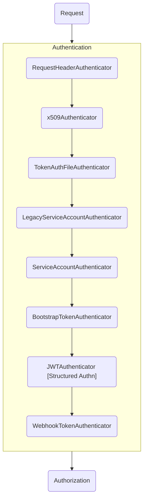
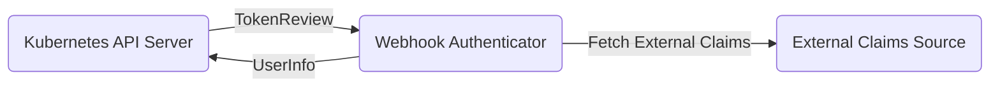
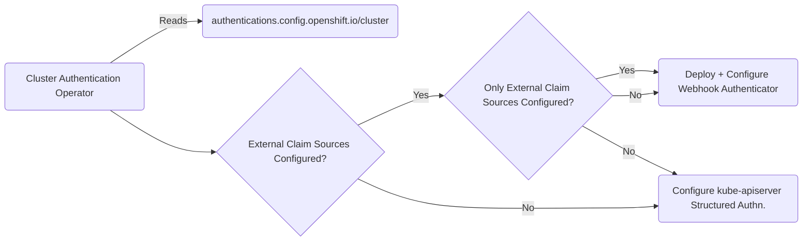
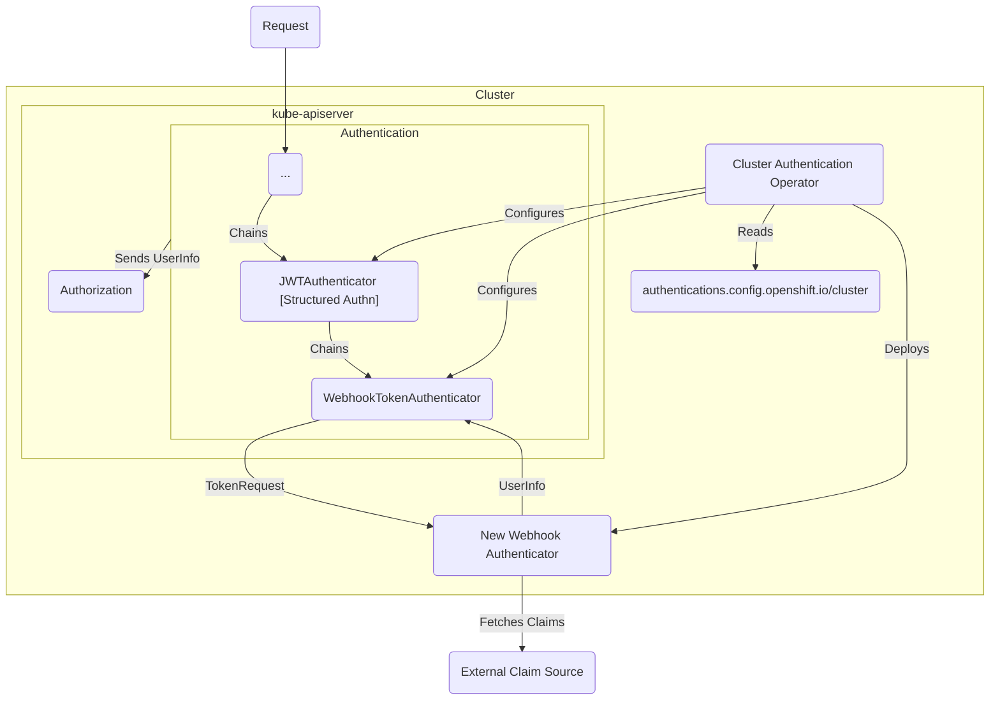

# External OIDC Additional Identity Information Sources

## Summary

Adds support to the external OIDC provider configuration of OpenShift to source
identity information from more than the claim information present in a JWT
issued by an identity provider.

## Motivation

Today, the Kubernetes API server is limited to sourcing and building a user identity
from the information that is present _only_ in the JWT provided in the `Authorization`
request header.

Most commonly, this is in the form of claims that are present in the JWT.
While the Kubernetes API server does handle [distributed claims](https://openid.net/specs/openid-connect-core-1_0.html#DistributedExample)
for the claim used as the `group` claim mapping, almost none of the most
common identity providers implement and use this OIDC standard.

The only major enterprise identity provider that comes close is
Microsoft's Entra ID, which uses the standard for claim overages
but it is used in a way that is incompatible with the
expectations of the Kubernetes API server.

Additionally, many identity providers discourage the use of putting large
amounts of user information in the claims of a JWT due to request header size constraints.
Instead, they encourage the use of either the [UserInfo endpoint](https://openid.net/specs/openid-connect-core-1_0.html#UserInfo)
or a proprietary API for sourcing user information (for example, Microsoft's Graph API).

In order to better facilitate customer use cases where they must source additional user information,
not in the JWT issued by their chosen identity provider to construct a user's cluster identity,
OpenShift needs to have a configurable way to source this additional information.

### User Stories

**High-Level User Stories**

* As an OpenShift cluster administrator, I want to configure how a user's
group membership information is sourced so that I can avoid bloated JWTs
and concerns related to header size limits.

* As an OpenShift cluster administrator, I want to configure OpenShift to
securely authenticate against my identity provider's endpoints for additional user information 
so that OpenShift can source user information not provided in the JWT issued
by my identity provider.

* As an OpenShift cluster administrator, I want to remove non-essential Personally Identifiable Information (PII) (like `email` and `full_name`)
from the JWT issued by my identity provider and configure OpenShift to source this information from
my identity provider so that I can minimize the blast radius of a leaked token while still
having readable user metadata in the cluster.

* As an OpenShift cluster administrator, I want to map specific attributes sourced from
external sources to cluster identities so that I can create policies based on information
not present in the JWT.

**More Specific User Stories**

* As an OpenShift cluster administrator, I want to configure OpenShift to
fetch user group information from Microsoft's Graph API so that
I can get user group information without including the group information in the JWT.

* As an OpenShift cluster administrator, I want to configure OpenShift to fetch
user information from the OIDC UserInfo endpoint for my identity provider so
that I can keep the initial ID token small while still populating the user's
identity with necessary metadata.


### Goals

- Enable sourcing of user identity metadata from external sources (i.e not claims in the JWT)
- Make configuration of this external sourcing seamless with configuring external OIDC providers

### Non-Goals

- Creating identity provider specific integrations for sourcing additional user identity information

## Proposal

To achieve the goals of this enhancement, the following is proposed:

* A new component, a webhook authenticator, is created that replicates
the upstream Structured Authentication Configuration capabilities
and adds the new configuration options and functionality on top.

* The `authentications.config.openshift.io` API is updated to add new
configuration fields that map to the configuration options for this new
functionality.

* The Cluster Authentication Operator / HyperShift Control Plane Operator
is updated to deploy and configure the new webhook authenticator only 
when the new API fields are configured.

### Workflow Description

#### Definitions

- **Cluster Administrator** is a human user responsible for managing the configuration of a cluster.
- **Identity Provider (IdP)** is an external piece of software responsible for creating access tokens used to authenticate requests against the Kubernetes API.
- **Cluster User Identity** is an internal construct of Kubernetes for building the "identity" of a user that is often used for authorization and admission decisions.
- **Cluster End User** is an individual using the cluster.

#### Scenarios

**Scenario**: Sourcing group information from an identity provider that was not provided in the JWT via the UserInfo endpoint.

1. Cluster Administrator configures the `authentications.config.openshift.io/cluster` resource
to tell OpenShift how to fetch the group information from the identity provider like so:
```yaml
apiVersion: config.openshift.io/v1
kind: Authentication
metadata:
  name: cluster
spec:
  type: OIDC
  oidcProviders:
  - name: foo
    claimMappings:
      uid:
        claim: email
      username:
        claim: username
      groups:
        claim: groups
    externalClaims: # This is the proposed new field
      clientAuth:
        type: RequestProvidedToken # Use the token from the request as the access token to the UserInfo endpoint
      claims:
        url:
          base: "https://contoso.com"
          pathExpression: "['userinfo']"
        mappings:
          - name: groups
            expression: "has(response.groups) ? response.groups.join(',') : \"\""
```
2. End user authenticates with the IdP and gets an access token:

```sh
oc login --exec-plugin="oc-oidc" --client-secret=... --client-id=...
```

3. End users identify their group memberships:

```sh
oc apply -o yaml -f - <<EOF
apiVersion: authentication.k8s.io/v1
kind: SelfSubjectReview
metadata:
  name: test
EOF
```

Output:
```sh
apiVersion: authentication.k8s.io/v1
kind: SelfSubjectReview
metadata:
  creationTimestamp: "2025-12-09T17:03:01Z"
status:
  userInfo:
    ...
    groups:
    - system:authenticated # automatically applied by the Kubernetes API server when a user is successfully authenticated
    - foo # fetched from UserInfo endpoint
```

**Scenario**: Sourcing group information from Entra ID that was not provided in the JWT via the Microsoft Graph API.

1. Cluster Administrator configures the `authentications.config.openshift.io/cluster` resource
to tell OpenShift how to fetch the group information from the identity provider like so:
```yaml
apiVersion: config.openshift.io/v1
kind: Authentication
metadata:
  name: cluster
spec:
  type: OIDC
  oidcProviders:
  - name: foo
    claimMappings:
      uid:
        claim: email
      username:
        claim: username
      groups:
        claim: groups
    externalClaims: # This is the proposed new field
      clientAuth:
        type: ClientCredential
        clientCredential:
          id: "kas"
          secret: "kas-foo-client-secret"
      claims:
        url:
          base: "https://graph.microsoft.com"
          pathExpression: "['v1.0', 'users', claims.upn, 'memberOf']"
        mappings:
          - name: groups
            expression: "has(response.value) ? response.value.map(x, x.displayName).join(',') : \"\""
```
2. End user authenticates with Entra ID and gets an access token:

```sh
oc login --exec-plugin="oc-oidc" --client-secret=... --client-id=...
```

3. End users identify their group memberships:

```sh
oc apply -o yaml -f - <<EOF
apiVersion: authentication.k8s.io/v1
kind: SelfSubjectReview
metadata:
  name: test
EOF
```

Output:
```sh
apiVersion: authentication.k8s.io/v1
kind: SelfSubjectReview
metadata:
  creationTimestamp: "2025-12-09T17:03:01Z"
status:
  userInfo:
    ...
    groups:
    - system:authenticated # automatically applied by the Kubernetes API server when a user is successfully authenticated
    - foo # fetched from Microsoft Graph API endpoint
```

### API Extensions

For review purposes, this section will focus on the user facing semantics of the API changes.

This section will be broken down into:
- The changes to the OpenShift `authentications.config.openshift` API
- The changes to the Kubernetes Structured Authentication Configuration API to use as the webhook configuration file

For the most part, the API will remain structurally the same. The core differences will be in field semantics.

#### OpenShift API Changes

The nuanced API review for the actual Go type changes will be done in a PR against the openshift/api
repository (TODO).

A new, optional, field `.spec.oidcProviders[].externalClaims` will be added to the
`authentications.config.openshift` API.

A YAML representation of the new API field and it's children:
```yaml
externalClaims:
  # clientAuth is how the Kubernetes API server
  # authenticates with the provided external claims sources.
  # clientAuth is optional, and when not set will
  # attempt to use anonymous authentication.
  clientAuth:
    # type is the type of clientAuth to use.
    # When set to RequestProvidedToken, it will attempt
    # to use the token in the Authorization header of the
    # request to authenticate with the provided external claims sources.
    # When set to ClientCredential, it will attempt to use configured
    # client-id and client-secret parameters to fetch an access token
    # to use to authenticate requests to the provided external claims sources.
    type: { RequestProvidedToken | ClientCredential }
    # clientCredential configures the client credentials
    # and token endpoint to use to get an access token.
    # Required when type is ClientCredential, and forbidden otherwise
    clientCredential:
      # id is required and is the client-id to use during the client credential oauth2 flow
      id: "..."
      # secret is a required reference to a secret in the openshift-config namespace 
      # and is the client-secret to use during the client credential oauth2 flow
      secret: "..."
      # tokenEndpoint is required and is the URL to query for an access token using the client credential oauth2 flow
      tokenEndpoint: "https://..."
  # claims is a required list of additional claims
  # to be sourced from external sources
  claims:
      # url configures the endpoint that the request should be made to.
    - url:
        # hostname is the hostname of the external source
        # that is used to construct the URL.
        hostname: "https://contoso.com"
        # pathExpression is a CEL expression that returns a list of strings
        # to be added to the URL when making a request.
        # All values in the returned list will be path escaped when joined
        # as path elements.
        pathExpression: "['v1', 'users', claims.upn, 'etc']"
      # mappings is a required list of claims that should be
      # built with the response from the request to this source.
      mappings:
          # name is the name of the claim to be built.
          # this name must be globally unique.
        - name: groups
          # expression is the CEL expression to extract
          # the claim data from the response.
          # It must return a string value.
          expression: "has(response.value) ? response.value.map(x, x.displayName).join(',')"
      # conditions are the conditions in which this external source should be used.
      # When not specified, the source will _always_ be used.
      # conditions is a list of CEL expressions.
      conditions:
        - expression: "!has(claims.groups)" # Ex: don't attempt to source claims from this source if the groups claim is already present in the JWT
  # tls configures the TLS settings for requests to external claim sources.
  tls:
    # certificateAuthority is a reference to a secret in the openshift-config
    # namespace that contains the certificate authority to use for requests
    # to external claim sources.
    certificateAuthority:
      name: "some-ca"
```

#### Kubernetes AuthenticationConfiguration API Changes

A new, optional, field `jwt[].externalClaimSources` will be added to the Kubernetes
AuthenticationConfiguration API. This API represents the configuration file
that is read by the webhook to mimic how the KAS StructuredAuthenticationConfiguration 
API represents a configuration file.

> [!NOTE]
> Deviations from the OpenShift API are intentional to align more closely with the
> existing AuthenticationConfiguration API structure and input semantics.

A YAML representation of the new API field and it's children:
```yaml
externalClaims:
  # clientAuth is how the Kubernetes API server
  # authenticates with the provided external claims sources.
  # clientAuth is optional, and when not set will
  # attempt to use anonymous authentication.
  clientAuth:
    # type is the type of clientAuth to use.
    # When set to RequestProvidedToken, it will attempt
    # to use the token in the Authorization header of the
    # request to authenticate with the provided external claims sources.
    # When set to ClientCredential, it will attempt to use configured
    # client-id and client-secret parameters to fetch an access token
    # to use to authenticate requests to the provided external claims sources.
    type: { RequestProvidedToken | ClientCredential }
    # clientCredential configures the client credentials
    # and token endpoint to use to get an access token.
    # Required when type is ClientCredential, and forbidden otherwise
    clientCredential:
      # id is required and is the client-id to use during the client credential oauth2 flow
      id: "..."
      # secret is the client-secret to use during the client credential oauth2 flow.
      # secret is required and is the literal string value of the client-secret.
      secret: "..."
      # tokenEndpoint is required and is the URL to query for an access token using the client credential oauth2 flow
      tokenEndpoint: "https://..."
    # accessToken configures the static access token to be used when interacting with
    # external claim sources.
    # Required when type is AccessToken, and forbidden otherwise.
    # It is the literal access token string.
    accessToken: "eyJ..."
  # claims is a required list of additional claims
  # to be sourced from external sources
  claims:
      # url configures the endpoint that the request should be made to.
    - url:
        # hostname is the hostname of the external source
        # that is used to construct the URL.
        hostname: "https://contoso.com"
        # pathExpression is a CEL expression that returns a list of strings
        # to be added to the URL when making a request.
        # All values in the returned list will be path escaped when joined
        # as path elements.
        pathExpression: "['v1', 'users', claims.upn, 'etc']"
      # mappings is a required list of claims that should be
      # built with the response from the request to this source.
      mappings:
          # name is the name of the claim to be built.
          # this name must be globally unique.
        - name: groups
          # expression is the CEL expression to extract
          # the claim data from the response.
          # It must return a string value.
          expression: "has(response.value) ? response.value.map(x, x.displayName).join(',')"
      # conditions are the conditions in which this external source should be used.
      # When not specified, the source will _always_ be used.
      # conditions is a list of CEL expressions.
      conditions:
        - expression: "!has(claims.groups)" # Ex: don't attempt to source claims from this source if the groups claim is already present in the JWT
  # tls configures the TLS settings for requests to external claim sources.
  tls:
    # certificateAuthority contains the certificate authority to use for requests
    # to external claim sources. It is the literal string format of the PEM encoded CA certificate.
    certificateAuthority: "--- BEGIN CERTIFICATE ---\n...\n--- END CERTIFICATE ---"
```


### Topology Considerations

#### Hypershift / Hosted Control Planes

No unique considerations for making this change work with HyperShift beyond updates to the appropriate controllers
to deploy and configure the new webhook authenticator component when necessary based on configuration options.

#### Standalone Clusters

Yes, this is applicable to standalone clusters.

#### Single-node Deployments or MicroShift

>How does this proposal affect the resource consumption of a
>single-node OpenShift deployment (SNO), CPU and memory?

Because this will be adding a new component for authentication decisions, there will likely
be an increase in the CPU and memory consumption of platform components on the cluster.

To mitigate this, the webhook authenticator will only be deployed and configured when an end-user
has explicitly opted into the new functionality via the new configuration options.

>How does this proposal affect MicroShift? For example, if the proposal
>adds configuration options through API resources, should any of those
>behaviors also be exposed to MicroShift admins through the
>configuration file for MicroShift?

Similar to all other BYO OIDC related enhancements, this will have no impact to MicroShift as
it does not run with multiple users and does not have a mechanism for configuring authentication in this way.

#### OpenShift Kubernetes Engine

No specific impacts to OpenShift Kubernetes Engine, but the changes are likely to be applicable.

### Implementation Details/Notes/Constraints

#### Context: How Authentication Works in the Kubernetes API Server

To set the stage for understanding how this feature will be integrated,
some background context as to how the authentication chain for authenticating
a request against the Kubernetes API server works may be helpful.

When a request enters the authentication stage of the request lifecycle,
it is passed through a chain of authenticators that are responsible for
determining _who_ the user making the request is.

At a high-level, that chain is:
- Local authenticators
- Remote authenticators

"Local authenticators" are the native authenticator implementations that
exist in the Kubernetes API server:
- Request Headers
- x509
- Token File
- Legacy Service Account Tokens
- Service Account Tokens
- Bootstrap Tokens
- JWT

"Remote authenticators" are non-native authenticator implementations
that the Kubernetes API server calls out to:
- Webhooks

Each enabled authenticator is consulted one-by-one.
The first one in the chain to return successfully short-circuits the chain
and the request moves on to the `Authorization` stage of the request lifecycle.

If none of the local authenticators successfully authenticate the request,
webhook authenticators will then be called for authentication.

To visualize the flow:



#### Proposed Architectural Changes

##### New Component: Webhook Authenticator

When the new configuration fields for sourcing claim information are set,
the Cluster Authentication Operator will be responsible for rolling out
and configuring this new component.

This component will be responsible for translating a token to user identity information
to be returned to the Kubernetes API server.

It will be constrained such that _only_ the Kubernetes API server can communicate with it.

It will re-implement/copy all existing logic from the Kubernetes API server for the Structured Authentication Configuration
authenticator as a baseline.
From this baseline, additional changes will be made as necessary to support the new desired functionality
of source claim information from external sources.

It will be stateless and deployed as a standalone component via a deployment in the `openshift-authentication` namespace.

Requests to external sources will be made and processed concurrently with strict timeouts (timeout TBD).
Validations will be enforced at configuration time to ensure no duplicate requests or
claims are ever created.

Request failures will result in partial availability of user identity information for identity mapping.
For example, a failure to fetch a user's group memberships from an external source may result in the absence
of a `groups` claim being available for use in cluster identity building.
It is up to end-user discretion to configure identity mapping behavior to proceed with partial information
or to fail on absence of a claim through their usage of CEL expressions.

Diagram of how this new component will work:


##### Cluster Authentication Operator / HyperShift Control Plane Operator

The Cluster Authentication Operator (Control Plane Operator for HyperShift) will be responsible for deploying and configuring the
correct components based on the user-provided configuration in the `authentications.config.openshift.io/cluster`
resource.

If the configuration does not configure any providers with the new external claim sourcing configuration options,
it will ensure that the webhook authenticator is not deployed and will directly configure the Kubernetes API server
using the Structured Authentication Configuration file.

If the configuration only contains providers that use the new external claim sourcing configuration options,
it will ensure that the webhook authenticator is deployed and configured, the Kubernetes API server is configured
to use the webhook authenticator, and the Structured Authentication Configuration is not configured on the Kubernetes API server

If there is a mixed configuration, it will ensure that the webook authenticator is deployed and configured for the providers leveraging
the new configuration options, the Kubernetes API server is configured to use the webhook authenticator, and the Structured Authentication
Configuration is configured on the Kubernetes API server for the providers that are not configured to leverage the new functionality.

The webhook authenticator will implement hot-reloading capabilities for the configuration file so that any changes to the configuration file
are automatically loaded without downtime, preventing disruption of communication between the KAS and the webhook authenticator
during configuration changes.

**NOTE**: The hot-reloading behavior _only_ applies to the webhook authenticator and changes to it's configuration file. For changes that impact
the Structured Authentication Configuration file for the KAS, there will still need to be a revisioned rollout that occurs, potentially incurring
disruption on SNO clusters. In an ideal world, there should be minimal to no disruption on HA clusters for a valid Structured Authentication Configuration.
In the future, work may be done to enable the KAS hot-reloading functionality for the Structured Authentication Configuration to mitigate this but that has non-trivial
impacts to our revisioned rollout process - and is out of scope of the proposed effort.

Diagram of the new behavior:


##### Full Architecture Diagram



### Risks and Mitigations

1. Misconfiguration of external claim sources
    * **Mitigation**: Perform robust admission time validation as we already do on the `Authentication` API.
    CEL expressions will have to successfully compile and will be limited in their length to prevent excessive
    compilation and run times.

2. Introduction of network latency to authentication
    * **Mitigation**: Allow for external claim sources to be skipped based on a condition.
    This isn't perfect, but may limit the number of cases where this may need to occur.
    This isn't a novel risk as the existing Structured Authentication Configuration feature
    has support for fetching distributed claims - which means an additional network request
    for the distributed claim on each request.
    Users can, and should, be made aware of the risks of using external claim sources and
    the latency they made add to the authentication chain.
    Strict timeouts will be enforced to keep impacts to requests against the
    Kubernetes API server due to latency to a minimum.

3. External source availability dependence
    * **Mitigation**: A failure to fetch claims from an external source does not
    mean that the entire authentication has to fail, just that those claims
    are not present. It will be up to individual users to ensure that
    their CEL expressions for claim mappings can handle
    claims missing if they don't want external source availability to impact
    the ability for users to authenticate with their cluster.
    This may mean some unexpected behaviors, but at least users can still
    access the cluster.
    Alternatively, there is always the break-glass scenario of continuing to
    use x509 certificate based authentication in the event of an outage.

4. Mixing authentication responsibilities between the KAS and new webhook authenticator
    * **Mitigation**: The webhook authenticator is an implementation detail that
    users do not need to concern themselves with beyond troubleshooting purposes.
    To an end-user, they will just make configuration changes on a central API
    and the platform operators will handle the correct configuration of platform components.

5. Additional resource consumption
    * **Mitigation**: None. This is a side effect of needing to generically support
    fetching of user identity information from an external source. This is no worse
    than the integrated OAuth server running. In the future, the intention is for
    this to get contributed back upstream to be native in the Kubernetes API server
    so an additional component is no longer necessary.

6. Maintenance burden
    * **Mitigation**: While it is a maintenance burden to re-implement and keep up-to-date
    the logic that exists today in the Kubernetes API server, this is done with the intention
    of contributing this back to the upstream to be handled natively by the KAS.
    In the event this isn't accepted upstream, this approach has a better maintenance cost than
    maintaining specialized logic for handling the nuances of every identity provider our customers
    use. Kubernetes has a history of maintaining stability and backwards compatibility where
    a per-identity-provider approach to solving this problem is likely to be more brittle.

7. Credential security and rotation
    * **Mitigation**: This is an implementation detail, but we can ensure that the
    webhook authenticator can handle changes to the files that it references for
    this information. Any secrets will be mounted as a volume to some file path.

### Drawbacks

The main drawbacks of this approach are:
- Technical complexity and development time/cost
- Yet another middleman component for authentication (we are trying to move away from the OAuth server, this moves the needle back towards that state)
- Users have more complexity to deal with for sourcing external claim information as opposed to a tailored solution.
- If contributed back upstream, we may be stuck supporting an API model that doesn't translate well.

While not perfect, the proposed approach was chosen because it:
- Is less maintenance burden to implement a generic approach than maintaining a specialized implementation per identity provider.
- Has potential to be contributed back upstream.
- Enables a use case that many of our enterprise customers need.

## Alternatives (Not Implemented)

### Do nothing

As the title suggests, this alternative means we don't do anything and
leave it up to the end-user to find an appropriate solution.

There are a handful of approaches that end users can give a try:
- For customers with group claim sizing issues, perform group filtering on the IdP side.
- Leverage existing solutions like Dex for IdP federation as it has IdP specific integrations.
- Leverage Keycloak as an identity broker (like Dex, but more flexible).
- Continue using the integrated OAuth server and utilize the Group Sync Operator to sync groups from an arbitrary source

**Reason for rejection**:

While this approach does mean we save time by not doing anything, means that we only adhere to OIDC standards, and puts
the onus on identity providers to implement and conform to the distributed claims standard - in reality it puts the
responsibility on the customer to identify workarounds and solutions that don't align with the direction
we've been pushing the OpenShift authentication stack towards.

Our long-term goal is to align more closely with the native authentication stack that is offered in upstream
Kubernetes and get rid of the integrated OAuth server altogether.

Our expectation is that many customers will not be able to easily leverage alternative solutions and it
is important that we provide native support for many different IdP interactions.

### Use Keycloak as an identity broker

This alternative approach involves leveraging Keycloak as the baseline identity provider that is used
within OpenShift. Instead of customers with the need for tighter IdP integrations writing a configuration
that is pushed to the KAS, they would wire their additional identity providers up to Keycloak in it's "identity broker"
mode.

The difference between this approach and the do nothing approach is that this would be a configuration that
is inherently supported by OpenShift and we would be deploying Keycloak by default.

**Reason for rejection**:

This approach similarly goes against the grain of where we want to go by needing a middleman
provider acting as an identity broker. It also adds yet another configuration
layer that end users would need to wire identity providers up to. Going even further,
while we have a Red Hat build of Keycloak we would still be limited by the broker integrations
that exist for Keycloak.

Our long-term goal of KAS-native authentication alignment is meant to simplify the authentication
configuration process for an OpenShift cluster and this approach goes against that.

Additionally, there is lots of strategic overhead associated with this approach:
- Keycloak because a standard OpenShift component and may impact usage of the Keycloak operator
- Maintenance and support burden for a component we don't explicitly maintain
- Managed Service and customer interactions, who is and isn't Keycloak admins and who is responsible for what?

### Lightweight Shim with provider-specific claim resolution knowledge

This alternative approach is very similar in nature to the Keycloak as an identity broker approach,
but is intended to be a lightweight issuer implementation that we maintain and own. This approach would
implement provider-specific claim resolution logic.

**Reason for rejection**:

Yet another step away from the direction we want to go by maintaining a new token issuer that cluster users
need to authenticate against. We would also have to maintain an ever growing list of identity provider
integrations which is another step towards the integrated OAuth world we are trying to get away from.

### Adding support for fetching user information from the OIDC UserInfo endpoint

This was a very promising alternative where we would allow cluster administrators to configure the UserInfo
endpoint that we would also fetch claims from. This is an OIDC standard specification and something
that we could see as reasonable to contribute upstream.

**Reason for rejection**:

One of the largest enterprise identity providers, Microsoft Entra ID, has extremely limited support for
what they expose via the UserInfo endpoint.

Many of our larger customers use Entra ID and Entra ID use cases were the original motivators for this
enhancement.

This limitation of UserInfo endpoint support on Entra ID led us to determining that this is a non-starter.

### Building the webhook authenticator but leaving deployment and configuration to users

This alternative approach builds the core webhook authenticator component in the existing proposal,
but _does not_ make any changes to OpenShift components to deploy and configure it. No API changes and
no controller changes.

Instead, customers must use the existing OpenShift configuration option for using a webhook authenticator
to wire it up themselves. This means they are responsible for the deployment and configuration.

This approach has not been entirely ruled out, but it does muddy the waters of support responsibility.
We are going to be expected to provide support for this either way, and the currently proposed
approach has a significantly better user experience despite having more technical overhead.

Nothing necessarily prevents us from starting with this path and then expanding to incorporate the
additional technical overhead currently proposed or pushing the upstream contribution before we
commit to fully supporting this in OpenShift.

### Patching openshift/kubernetes with an in-tree implementation

This alternative approach uses carry-patches to add the new external claim sourcing logic
to our fork of Kubernetes.

**Reason for rejection**:

Adding a carry patch of this complexity makes our Kubernetes rebase process more
complicated.

Rebasing on every Kubernetes release is a critical process for OpenShift and adding
additional overhead and complexity to this process is not something we should take lightly.

Because there is a mechanism to implement this solution out-of-tree, this approach is not preferred.

## Open Questions [optional]

TBD. Please leave any questions that warrant significant discussion or that you feel are relevant open questions here.

### Has this been discussed upstream? Is there buy-in?

A higher-level idea related to generically sourcing identity information from a non-JWT source was
discussed in the bi-weekly SIG Auth working group meeting on December 3rd 2025.

There was not explicit buy-in that this would be accepted natively in the Kubernetes Structured Authentication
Configuration functionality, but there was encouragement to create a webhook authenticator
that implements the functionality to rally support behind the functionality and show a need for
the native implementation.

Because we will need to support this kind of behavior for our customers anyways, we deemed this approach
as being the most upstream-able and being worth the risk of having to carry forever if the feature
is rejected for native support in upstream.

## Test Plan

TBD. This feature will start in DevPreviewNoUpgrade.

A concrete test plan will be written before promotion to GA.

At a high-level, there will be:
- Component-specific tests
- Integration / E2E tests (openshift/origin _or_ OTE tests)

## Graduation Criteria

TBD.

### Dev Preview -> Tech Preview

TBD.

### Tech Preview -> GA

TBD.

### Removing a deprecated feature

Not deprecating any features.

## Upgrade / Downgrade Strategy

### Upgrade

In order to utilize this feature after an upgrade, users will have to explicitly configure
the new configuration fields to opt-in to this functionality.

If a user does not explicitly opt-in to the functionality, all previous behavior will remain the same.

### Downgrade

In the event an upgrade fails mid-way through, or the `N+1` cluster is misbehaving, and the cluster needs
to be rolled back to the previous version - a user will only need to remove their configuration of any of the new fields.

If they have not explicitly configured these new fields, this will have no impact on their ability to downgrade.

## Version Skew Strategy

There should be no issues related to version skew.

The new webhook authenticator will be a standalone component managed by the Cluster Authentication Operator.
The Kubernetes API server, and OpenShift, has had support for configuring webhook authenticators for quite
some time now.
The `TokenReview` API that the Kubernetes API server uses to communicate with webhook authenticators has been
`v1` since Kubernetes 1.6.

In the event the `authentications.config.openshift.io/cluster` resource is configured before the
Cluster Authentication Operator has successfully upgraded, the configuration will not take effect until
it's upgrade is completed.

## Operational Aspects of API Extensions

**Impact to SLIs**

- Changes to configuration require updates to either Kubernetes API server configuration or
webhook authenticator configuration, which causes a revision rollout to occur and may
cause some cluster disruption - especially if it requires a revision rollout of the KAS.
- Configuration of the new fields add latency to every request in which claims must
be sourced from an external source.

**Measurement of SLI Impacts**

SLI impacts will be measured every release automatically in CI through
automated regression testing.

**Possible Failure Modes**

- External claims source is unavailable
    - This failure mode may impact the ability to access the cluster when
    using token-based authentication.
    - When external claim sources are unavailable, a metric - exposed by the webhook authenticator - signalling the unavailability of an external claim source will be incremented.
    The exact metric structure is TBD.

- External claims source request timeout
    - This failure mode may impact or degrade the ability to access the cluster
    when using token-based authentication.
    - When requests to an external claim source time out, a metric - exposed by the webhook authenticator - signalling timeouts of an external claim source will be incremented.
    The exact metric structure is TBD.

**OCP Teams Involved**

The teams likely to be called on in the event of an escalation related to one of these failure
modes are:

- Control Plane

## Support Procedures

### Detecting failure modes

The most common ways to detect failure modes will be:
- Previously authenticated users receiving unauthenticated errors
- KAS logs, specifically ones related to token authentication
- New webhook authenticator logs and metrics

### Recovering from failures

The most common way to recover from non-configuration-related
failures will be to revert the configuration of the new fields.

Removing the configuration of the new fields will revert the use
of the new webhook authenticator and instead directly configure the
Kubernetes API server.

### Graceful failures

The new webhook authenticator will be built to fail gracefully.

At a high-level, this means that to the best of our ability things like
unavailability of an external claims source will not cause
authentication failures, preserving _general_ access to the cluster.

A degraded state may result in an unexpected reduction in privileges for end users
(i.e could not fetch groups claim from external claim source).

## Infrastructure Needed [optional]

Likely will need a new repository for the new webhook authenticator.
