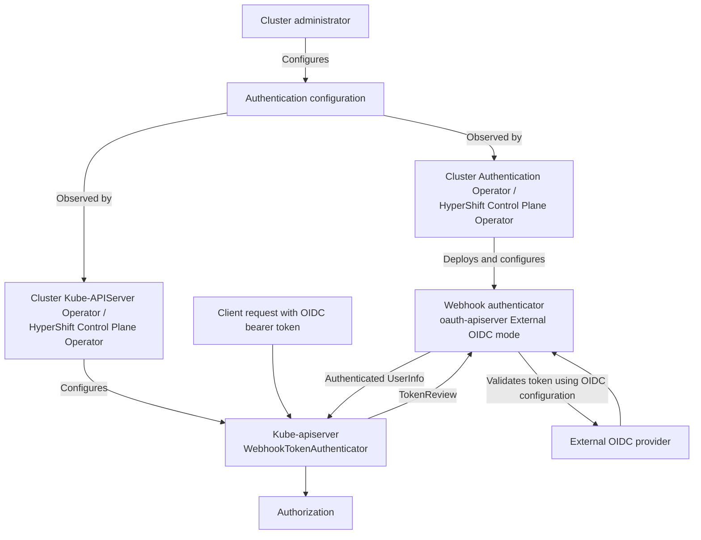

# External OIDC as a Webhook

## Summary

This enhancement proposes changes to the architecture of External OIDC authentication
in OpenShift. The current implementation configures the kube-apiserver to validate OIDC
tokens directly using its structured authentication configuration; the proposed architecture
configures the kube-apiserver to use a webhook token authenticator, as IntegratedOAuth
does today, while preserving the existing External OIDC behavior. This decouples the reusable
authentication architecture from [external claims sourcing](https://github.com/openshift/enhancements/blob/13f3a7957ce2aec7cc4003b68a1e1ec1d4f75eb6/enhancements/authentication/external-oidc-additional-identity-information-sources.md),
which will be delivered and graduated separately.

## Motivation

Currently, External OIDC is handled directly by the kube-apiserver (KAS) using a `JWTAuthenticator`,
which is different from the authentication path for `IntegratedOAuth` (which is a webhook
token authenticator). This couples External OIDC configuration and rollout to the kube-apiserver;
changes to the effective External OIDC configuration result in a new revision and rollout of all
kube-apiserver pods. At the same time, the direct approach makes it harder to evolve authentication
functionality without modifying the kube-apiserver implementation; changes to this authentication
behavior must either be contributed upstream to Kubernetes or carried as downstream patches.

A webhook token authenticator provides a reusable integration point between the kube-apiserver
and an external authentication implementation; this means that authentication functionality can
evolve independently from the kube-apiserver. In particular, the External Claims Sourcing feature
is an example of functionality that benefits from this decoupling. Such extensions are not in
scope of this enhancement, but this particular example is what motivated this architectural
investigation and change. Keeping the architectural changes and the external claims sourcing as
separate enhancements and feature gates will allow them to graduate independently while facilitating
parallel development of other features that depend on the External OIDC architecture.

This change gives administrators a consistent authentication topology to operate and troubleshoot.
Existing External OIDC authentication semantics and user-facing behavior remain unchanged, while
the underlying topology aligns with `IntegratedOAuth`, reducing coupling to kube-apiserver rollouts
and simplifying lifecycle management.

### User Stories

- As a cluster administrator, I want External OIDC and `IntegratedOAuth` to use a consistent
  authentication topology, so that I can apply the same operational practices when managing and
  troubleshooting either mode.

- As a cluster administrator, I want changes to the External OIDC provider configuration after External OIDC is
  enabled to avoid rolling out kube-apiserver pods, so that authentication remains available while the
  configuration is being updated.

- As an OpenShift engineer, I want to extend External OIDC authentication without modifying the
  kube-apiserver implementation, so that new authentication capabilities can be developed and maintained
  independently of upstream Kubernetes and downstream patches.

### Goals

- **Extensibility.** Provide an extensible authentication integration point so that new authentication
  functionality can be implemented without modifying the kube-apiserver or carrying complex downstream patches.

- **Lifecycle decoupling.** Decouple External OIDC authentication configuration lifecycle from that of the
  kube-apiserver; effective configuration changes should not require kube-apiserver rollouts.

- **Compatibility.** Preserve existing External OIDC authentication semantics and user-facing behavior
  across the architectural migration.

- **Independent graduation.** Graduate architectural changes independently from External Claims Sourcing
  so that dependent features can follow their own graduation timelines.

### Non-Goals

- **Implement external claims sourcing.** This enhancement provides the architecture that enables it,
  but the functionality, API fields, and behavior belong to the [separate external claims sourcing enhancement](https://github.com/openshift/enhancements/blob/13f3a7957ce2aec7cc4003b68a1e1ec1d4f75eb6/enhancements/authentication/external-oidc-additional-identity-information-sources.md).

- **Change External OIDC authentication semantics.** This does not change token validation rules,
  claim mappings, user identity construction, or authorization behavior.

- **Change the user-facing login experience.** Changes to `oc`, the console, OAuth clients, or login
  workflows are out of scope unless required to preserve existing behavior.

- **Eliminate all kube-apiserver rollouts.** The goal is to decouple External OIDC provider configuration
  changes from KAS rollouts, not to eliminate rollouts required when changing authentication type or caused by
  unrelated control-plane changes.

- **Change `IntegratedOAuth` behavior.** Integrated OAuth provides the existing reference topology,
  but its behavior and lifecycle are not being redesigned here.

## Proposal

The proposed architecture of this EP applies to both Standalone and HyperShift clusters; this section
will describe both the broad changes that apply to both, and also any implementation details that pertain
to each one.

This proposal consists of the following design pillars:

- When opting into External OIDC, instead of configuring the KAS with a `JWTAuthenticator`
  via the structured authentication configuration file, configure a `WebhookTokenAuthenticator`
  instead. External OIDC tokens are handled through the webhook path, and the KAS no longer directly
  consumes the External OIDC structured authentication configuration. In Standalone, the KAS retains
  a stable webhook authenticator configuration regardless of whether the webhook serves Integrated OAuth
  or External OIDC. In HyperShift, HCPO configures the hosted KAS to use the Service for the active
  authentication mode.

- The oauth-apiserver is updated to have a new mode of operation that replicates the existing
  KAS Structured Authentication Configuration feature; this new mode will be used as a webhook
  for the KAS's `WebhookTokenAuthenticator`. The authentication mode changes inside
  the webhook implementation, not in the KAS's direct structured-authentication configuration.

- The CAO and HCPO are updated to deploy and configure the oauth-apiserver in this new mode of
  operation whenever the External OIDC functionality is opted into. Apart from the oauth-apiserver
  deployment and webhook Service, the rest of the OAuth components are not needed for External OIDC
  and remain disabled or removed as appropriate.

### Feature Gates

The webhook architecture is controlled by the `ExternalOIDCAsWebhook` feature gate.
`ExternalOIDCExternalClaimsSourcing` continues to control external claims sourcing and requires the
webhook architecture; claims sourcing cannot use the legacy direct KAS authentication path.

The gates have independent graduation lifecycles: `ExternalOIDCAsWebhook` can graduate independently
while external claims sourcing remains feature-gated.

### Workflow Description

The following diagram shows the target architecture shared by Standalone and
HyperShift clusters. The webhook authenticator implements the existing External
OIDC authentication behavior and returns authenticated user information to the KAS.

No administrator-facing configuration changes are proposed with this EP. The existing
topology-specific configuration mechanisms for External OIDC remain unchanged. The operators
consume that configuration to configure and manage the webhook-side External OIDC implementation,
while the KAS continues to use the standard webhook-authenticator path and does not directly
consume the External OIDC structured authentication configuration. Updates, rollback, and
validation continue to follow the existing External OIDC behavior. Ordinary changes to the
effective External OIDC configuration do not require a kube-apiserver rollout.

#### Definitions

- **Cluster Administrator** is a human user responsible for managing the configuration of a cluster.
- **Identity Provider (IdP)** is an external piece of software responsible for creating access tokens
  used to authenticate requests against the Kubernetes API.
- **Operator** is an OpenShift/HyperShift component that is responsible for configuring and managing
  the components that provide External OIDC; this generic term is used in place of CAO / HCPO to keep
  this description at a high level; topology specific considerations are discussed in further detail
  in the relevant sections.

#### Request Flow

In a steady cluster state with External OIDC enabled, a request follows this flow:

1. The client sends an API request containing an OIDC bearer token
2. The kube-apiserver (KAS) invokes configured authenticators in sequence and proceeds to the webhook if earlier
   authenticators do not authenticate the request; the first successful authenticator short-circuits
   the chain
3. The kube-apiserver invokes the webhook by making a `TokenReview` request to the configured webhook Service
4. The webhook validates the token against the configured IdP and returns an authenticated or unauthenticated
   response to the kube-apiserver, including `UserInfo` on success
5. The kube-apiserver proceeds to authorization

#### Webhook unavailability

If the webhook is unavailable, requests that depend on External OIDC
authentication cannot be authenticated. Administrators can use configured
break-glass credentials to recover access and correct the configuration or
restore webhook availability. The availability impact during webhook updates
depends on the deployment topology and is described in the relevant sections.

### API Extensions

This proposal does not add API extensions or change API schemas -- the proposed changes will come
into effect using the same API as the existing External OIDC feature, and change how the existing
External OIDC API is consumed by the operators.

### Topology Considerations

The target authentication architecture is shared between standalone OpenShift and HyperShift. This section
describes topology-specific details, including component ownership, resource placement, configuration
propagation, connectivity, and availability.

#### Standalone Clusters

In standalone OpenShift, the CAO manages the authentication stack and the `oauth-apiserver` deployment and
configuration. The CKASO manages the KAS-side webhook configuration and configures the KAS to communicate
with the `oauth-apiserver`. Cluster administrators configure External OIDC through the existing
`config.openshift.io/v1` `Authentication` resource named `cluster`.

#### Hypershift / Hosted Control Planes

In HyperShift, the HCPO manages the authentication stack. For External OIDC, it deploys
a dedicated webhook component using the `oauth-apiserver` binary in `external-oidc` mode,
with a dedicated Service in the hosted control plane. The HCPO also manages the hosted
KAS-side webhook configuration and configures the hosted KAS to communicate with this
Service. Cluster administrators configure External OIDC through
`HostedCluster.spec.configuration.authentication`; the HCPO propagates this configuration
into the hosted control plane.

#### Single-node Deployments or MicroShift

Single-node OpenShift (SNO) follows the Standalone design within the scope of this feature. Because the target
architecture deploys the `oauth-apiserver` for External OIDC, resource consumption will increase compared with
the current direct External OIDC architecture, but is expected to remain less than or equivalent to the standard
Integrated OAuth authentication topology.

The single `oauth-apiserver` pod may be temporarily unavailable while it is rolling out or being updated. During
that window, requests that require External OIDC authentication may fail until the webhook becomes available
again.

This does not apply to `MicroShift`, as no authentication stack exists.

#### OpenShift Kubernetes Engine

No specific impacts to OpenShift Kubernetes Engine.

### Implementation Details/Notes/Constraints

#### OpenShift OAuth API Server (`oauth-apiserver`)

The `oauth-apiserver` binary is extended with a dedicated `external-oidc` subcommand. This subcommand runs
a standalone HTTPS webhook server rather than the normal aggregated API server. Its purpose is to
validate External OIDC tokens and return `TokenReview` responses to the KAS.

In this mode, the server exposes only the `/apis/oauth.openshift.io/v1/tokenreviews` endpoint. The other APIs
associated with the normal OAuth API server, including the OAuth and User APIs, are not served.

Token validation reuses the Kubernetes OIDC token-authenticator implementation and configures it from the
External OIDC authentication configuration. The webhook converts the authenticator result into a `TokenReview`
response, returning `UserInfo` when authentication succeeds.

In Standalone, the existing `openshift-oauth-apiserver/api` Service used to configure the Integrated OAuth
webhook remains unchanged and is reused by the External OIDC webhook. As a result, the KAS-facing webhook
configuration is the same for `IntegratedOAuth` and `OIDC`; only the internal authentication mode of the
webhook changes. In HyperShift, HCPO deploys a dedicated External OIDC webhook component and Service, as
described below.

##### Configuration Reload

In the `external-oidc` mode, the oauth-apiserver watches its mounted authentication configuration file.
When the file contents change, the server validates the new configuration and replaces the active token
authenticator without restarting the pod. Unchanged configuration contents are ignored. If a subsequent update
is invalid, the server logs the error and continues using the previous valid authenticator. An invalid initial
configuration prevents the server from starting.

KAS-side webhook authentication caching is unaffected by webhook configuration reloads. A successful
`TokenReview` result obtained before a configuration update can remain valid until the configured webhook
cache TTL expires (two minutes by default). This bounded delay is accepted to preserve the existing
Kubernetes webhook-authenticator behavior.

##### Configuration Distribution

In Standalone, CAO generates the authentication configuration in the stable
`openshift-config-managed/auth-config` ConfigMap and synchronizes it to
`openshift-oauth-apiserver/auth-config`, which is mounted by the webhook. Updates modify this
ConfigMap in place and are detected by the file watcher.

In HyperShift, HCPO generates and projects the equivalent configuration into the dedicated webhook
component. Updates to the projected configuration are detected by the same file watcher.

#### Cluster Authentication Operator / Cluster Kube-APIServer Operator

Today, when configuring the `authentication.config.openshift.io/cluster` resource to use the External OIDC
feature, the oauth-apiserver and oauth-server components are torn down and the KAS's Structured
Authentication Configuration feature is configured to point to a revisioned `ConfigMap` that is mounted as a file.

With the changes proposed in this enhancement, the oauth-apiserver will no longer be torn down but instead
configured to use its new external OIDC operation mode and the KAS will not have any configuration changes made
(apart from a one-time KAS reconfiguration for clusters already configured in the legacy External OIDC setup).
This transition removes the `--authentication-config` flag and its structured External OIDC authenticator after
the webhook is ready, switching the KAS to the webhook authenticator. Subsequent External OIDC configuration
changes therefore do not require a KAS rollout.

To facilitate this new behavior, the following changes will need to be made:

- The CKASO's config observer changes made in https://github.com/openshift/cluster-kube-apiserver-operator/pull/1760
  are reverted/removed so that the KAS is _always_ configured to call the oauth-apiserver as a webhook
  authenticator, regardless of its operation mode.
- The CAO is updated to remove everything _EXCEPT_ the following resources related to the oauth-apiserver:
  - The `oauth-apiserver` deployment. Instead, this is re-configured to set the new operation mode.
    The same serving certificates will be reused.
  - The `openshift-oauth-apiserver/api` Service. The CAO will be updated to ensure this always exists.
  - The webhook configuration controller will be reverted to standard operation of always applying the webhook
    secret for the KAS.

#### HyperShift Control Plane Operator

In HyperShift, external OIDC is configured via the `HostedCluster` resource
(`.spec.configuration.authentication`), unlike Standalone clusters where the admin configures
`authentication.config.openshift.io/cluster` directly. The HCPO reads this configuration and the goal is the
same: deploy a webhook authenticator that validates External OIDC tokens and configure the KAS to use it.

Unlike Standalone clusters where the existing oauth-apiserver deployment is reconfigured into the new mode, in
HyperShift a **new dedicated component** will be deployed for this purpose. The new component uses the
oauth-apiserver binary (with its `external-oidc` subcommand) but runs as a separate deployment with its own
Service, independent of the existing `openshift-oauth-apiserver` deployment. The existing oauth-apiserver
teardown behavior in External OIDC mode is preserved.

This separation is preferred for HyperShift because:

- Clean separation of concerns: the integrated OAuth functionality and the external OIDC webhook authenticator
  are fundamentally different functions with different lifecycles.
- No implicit assumptions broken: existing consumers of the `openshift-oauth-apiserver` Service are unaffected.
- Simpler operator logic: the HCPO deploys or tears down the new component based on each component's predicate,
  without mode-switching on a shared deployment.
- Future flexibility: the dedicated deployment can be backed by a different binary in the future without any
  topology changes to HyperShift.

In particular, the following HCPO changes are needed:

- Add a new component for the external OIDC webhook authenticator with its own deployment, Service, and
  configuration. The component is deployed when authentication type is `OIDC` in the `HostedCluster` resource.
  The dedicated deployment and its Service run inside the hosted control plane. The hosted KAS reaches the
  webhook through this Service using the webhook configuration generated by HCPO.
- Use the existing hosted-control-plane serving-certificate management patterns to provision the webhook's
  serving certificate and key, and project them into its pod. HCPO configures the hosted KAS webhook
  configuration with the corresponding trust bundle. Certificate rotation follows the same management and
  rollout patterns, preserving a valid serving certificate and matching KAS trust bundle throughout rotation.
- Ensure that other referenced configuration required by the new component is available on the management
  cluster and projected into its pod.
- Wait for the webhook deployment to become available and for its Service to have ready endpoints before
  updating the hosted KAS webhook configuration to point to the Service. The KAS configuration retains the
  webhook authenticator and drops configuration via the structured authentication file
  (i.e. flag `--authentication-config`).

### Risks and Mitigations

1. External OIDC authentication depends on the availability and correct rollout of the webhook.
   **Mitigation**: In Standalone, the webhook is implemented using the existing `oauth-apiserver` component
   and its established deployment, Service, serving certificate, health-check, and operator-management patterns.
   This reuses the availability and operational characteristics already provided for the integrated authentication
   stack. In HyperShift, the dedicated webhook deployment will receive equivalent availability and lifecycle
   management through HCPO. Bounded KAS webhook timeouts and configured break-glass credentials provide
   additional recovery mechanisms.

2. Migration could unintentionally change existing authentication behavior.
   **Mitigation**: The current External OIDC e2e test suite provides an established behavioral baseline
   for the existing implementation. The migration will run this suite against the webhook-based architecture
   to verify that existing authentication behavior is preserved. Any gaps identified during the migration
   will be addressed by extending the existing tests rather than introducing a separate, divergent test model.

3. The webhook becomes a new security boundary for bearer-token processing.
   **Mitigation**: Require TLS between the KAS and webhook, use least-privilege access to
   configuration and credential material, avoid logging tokens or credentials, and apply the existing
   security review and hardening requirements to the new component. Reusing the existing `oauth-apiserver`
   component also allows the implementation to follow its established certificate, Secret, and
   hardening patterns, while the new mode remains subject to the normal security review.

4. The additional network hop through the webhook can increase authentication latency.
   **Mitigation**: The KAS webhook client and the webhook's OIDC provider requests will use strict
   timeouts to bound the impact on API requests. The KAS's existing caching of successful TokenReview
   responses will reduce repeated authentication requests, and authentication latency and failure
   metrics will be monitored to identify regressions.

### Drawbacks

The main drawbacks of this approach are:

- Technical complexity, development time/cost, compatibility testing efforts, and maintenance of a separate
  authentication execution path and its operator integration
- Continued coupling to `oauth-apiserver` as the webhook implementation and its operator-managed lifecycle
- Extra network hop and webhook availability dependency

While not perfect, the proposed approach was chosen because it:

- Decouples KAS authentication behavior from the External OIDC implementation and avoids downstream KAS patches
- Allows ordinary External OIDC configuration changes without requiring a KAS rollout
- Preserves the existing administrator-facing API and External OIDC authentication semantics
- In Standalone, reuses the existing `oauth-apiserver` deployment, certificate, health-check, and
  operator-management patterns; in HyperShift, reuses the `oauth-apiserver` implementation with
  equivalent HCPO-managed lifecycle patterns
- Creates a stable architectural foundation for independently delivered features such as external claims sourcing

## Alternatives (Not Implemented)

- **Keep direct KAS structured authentication:** preserves the current architecture but leaves External OIDC
  coupled to KAS configuration and rollout behavior.
- **Build a new standalone webhook component:** provides decoupling but duplicates deployment, certificate, health-check, and operator-management logic that can be reused from `oauth-apiserver`.
- **Leave webhook deployment and configuration to administrators:** avoids OpenShift operator changes but produces a different administration model and weakens lifecycle/support guarantees.

Since this proposal is a result of the investigations and decisions on how to implement
[external claims sourcing](https://github.com/openshift/enhancements/blob/13f3a7957ce2aec7cc4003b68a1e1ec1d4f75eb6/enhancements/authentication/external-oidc-additional-identity-information-sources.md#alternatives-not-implemented), more information
on that investigation of alternative solutions can be found in that enhancement.

## Test Plan

This enhancement does not introduce behavioral changes to External OIDC, only structural ones. Existing
unit, integration and e2e tests that validate functionality remain relevant and must verify that
no behavioral regressions occur.

In some cases, existing tests validate architectural components, such as the requirement that OAuth-related
components exist or do not exist depending on whether `IntegratedOAuth` or External OIDC is configured. These
tests must be adjusted to account for the new architecture. They should verify that:

- The appropriate webhook Service and configuration are present.
- The KAS uses the webhook authenticator rather than directly consuming the External OIDC structured
  configuration.
- External OIDC mode exposes only the intended webhook endpoint.
- Standalone reuses the existing `oauth-apiserver` deployment.
- HyperShift deploys a dedicated webhook component.
- Behavioral e2e coverage validates External OIDC authentication in both Standalone and HyperShift.

## Graduation Criteria

### Dev Preview -> Tech Preview

The architecture described by this enhancement is currently implemented behind the
`ExternalOIDCExternalClaimsSourcing` feature gate and is therefore already at Tech Preview in standalone
OpenShift. This enhancement will separate the architecture behind its own feature gate, allowing it to graduate
independently from external claims sourcing. The new architecture feature gate will therefore begin at Tech
Preview.

In HyperShift, there is currently no Dev Preview; therefore the starting point will also be Tech Preview.

### Tech Preview -> GA

The architecture proposed in this EP will be ready for GA when it has demonstrated behavioral compatibility with
the existing implementation in both Standalone and HyperShift, and independent graduation from external claims
sourcing.

The following sections describe the criteria that must be met for graduation to GA.

#### Functionality

- External OIDC works through the webhook architecture in both standalone OpenShift and HyperShift.
- Existing administrator-facing configuration and authentication semantics remain unchanged.
- Standalone reuses the existing `oauth-apiserver` deployment; HyperShift deploys and manages its dedicated
  webhook component.
- The KAS consistently uses the webhook authenticator and does not directly consume the External OIDC structured authentication configuration.
- External OIDC configuration updates are handled by the webhook without requiring a KAS rollout.
- The architecture is controlled by the `ExternalOIDCAsWebhook` feature gate and can graduate independently
  from `ExternalOIDCExternalClaimsSourcing`, which requires the webhook architecture.
- The webhook exposes only the intended TokenReview endpoint in External OIDC mode.

#### Testing

- Existing External OIDC behavioral e2e tests pass against the webhook architecture.
- Structural validation tests cover both deployment models and the expected KAS/webhook configuration.
- Configuration update, invalid configuration, and webhook rollout scenarios are covered.
- Relevant tests run as daily periodic jobs and demonstrate sufficient stability to support promotion to GA.

### Removing a deprecated feature

n/a

## Upgrade / Downgrade Strategy

On clusters that have opted-in the External OIDC authentication feature, upgrades and downgrades require no additional
administrator actions or Authentication resource changes. The respective operators perform the architectural transition.
Crossing the architecture boundary, either when upgrading or downgrading, should trigger a KAS revision rollout; ordinary
External OIDC configuration updates should not.

Downgrade behavior for clusters using external claims sourcing is outside the scope of this enhancement and is described
by the [External OIDC Additional Identity Information Sources enhancement](https://github.com/openshift/enhancements/blob/13f3a7957ce2aec7cc4003b68a1e1ec1d4f75eb6/enhancements/authentication/external-oidc-additional-identity-information-sources.md).

In Standalone, upgrading rolls the existing `oauth-apiserver` deployment into `external-oidc` mode; downgrading
removes it as in the legacy External OIDC architecture. In HyperShift, HCPO creates the dedicated webhook
deployment and Service, waits for readiness before switching the hosted KAS, and removes them on downgrade.
The existing OAuth deployment continues to follow its separate predicate.

No availability impact is expected in HA clusters; a healthy HA control plane is expected to remain available through
controlled revisioned rollout. For SNO, disruption can occur during the KAS transition. While the deployment of the
oauth-apiserver itself does not affect KAS availability, requests that rely on External OIDC authentication may fail
while the webhook is unavailable.

## Version Skew Strategy

This enhancement introduces no API changes and has no node-level version skew considerations.

In standalone OpenShift, reconfiguration of the KAS to use the External OIDC webhook will occur only after the CAO has
successfully upgraded and reconciled the webhook implementation and its configuration.

In HyperShift, HCPO will configure the hosted KAS to use the webhook only when the target hosted control plane release
supports the webhook architecture.

## Operational Aspects of API Extensions

n/a

## Support Procedures

### Detecting failure modes

External OIDC failures appear as authentication failures for requests using External OIDC tokens. Administrators
should inspect KAS and `oauth-apiserver` logs, CAO/CKASO/HCPO conditions and the webhook Deployment, Service and endpoints.

### Recovering from failures

Administrators can use configured break-glass credentials to regain access. Recovery consists of
correcting the External OIDC configuration or restoring the webhook deployment, Service,
certificates, or external IdP connectivity. Once the webhook becomes available again, External
OIDC authentication resumes without user-side reconfiguration.

### Graceful failures

An invalid configuration update does not replace the active valid webhook configuration. If the
webhook is unavailable, only requests that rely on External OIDC authentication fail; other
configured authentication methods, including break-glass access, remain available.

## Infrastructure Needed [optional]

n/a
