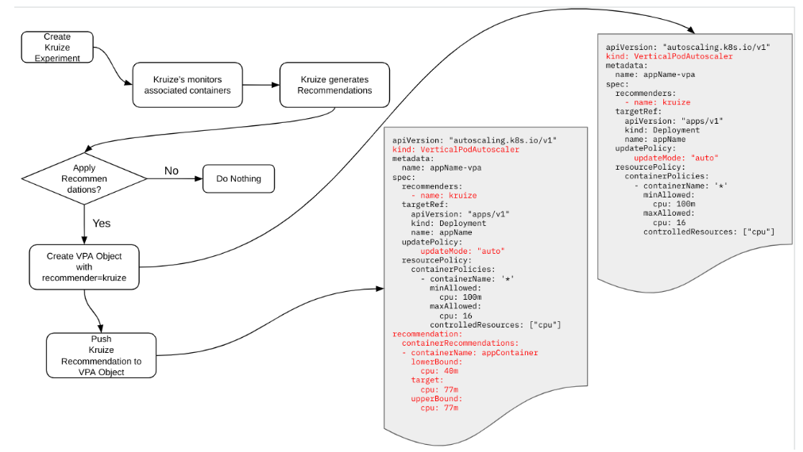

# Autoscaling with Kruize

**Summary**

This enhancement proposes the integration of Kruize as a new Autoscaling and Recommendation Engine in OpenShift. Kruize will assist users not only with container right-sizing and autoscaling, but also with namespace quota recommendations and GPU right-sizing and autoscaling through integration with the Instaslice project. Additionally, it will offer a Bulk API for managing multiple workloads simultaneously, box plots for improved visualization of recommendations, and notifications for various resource usage events.

**Motivation**

Vertical autoscaling is currently handled by the VPA project. However it has many drawbacks, including that it currently only scales the compute (cpu and memory), and has to be individually applied to containers that are of interest. It also does not provide GPU related recommendations or handle its autoscaling.

SREs and developers alike would like to see resource usage recommendations at a namespace level. This helps to setup namespace quotas that align with the needs of the set of applications that will need to be deployed together.

SREs typically need to resize several workloads in any given cluster. Currently the only way of accomplishing this is to have to write scripts that create VPA objects for each of them individually. Several customers have expressed interest to have a bulk API that can simplify the user experience.

Efficient use of GPU resources is a top priority given how costly these resources are. AI workloads dominate the use of GPU and inference servers account for a majority of these, it would be great to autoscale GPU resources for inference workloads similar to how we do them for CPU workloads.

With AI Agents, it would be easy to automate complex workflows such as, “shutdown workloads that have been idle for more than 10 days on my staging cluster”. Having notifications for idle workloads and exposing them through MCP can help manifest these workflows.

**User Stories**

* As an SRE, I would like to right size both my Application container and the namespace that it is deployed in, so that all of my workloads run in an efficient manner.  
    
* As an SRE, I would like to right size the use of GPU resources, so that my GPU resources are used efficiently and reduce overall costs for my workload.  
    
* As an SRE, I would like to right size all or a subset of my containers in the cluster with just one API, so that I can reduce the time needed to right size resources  
    
* As a developer, I would like to better understand the resources my workload needs, so that I can get the best performance for my workload with the right amount of resources  
    
* As a SRE, I want to all of the workloads that have been idle for more than a week on my staging cluster, so that I can shut them down

**Goals**

* Help both developers and SREs to arrive at right sizing both containers and namespaces  
* Provide a way to monitor GPU resources and right size them
* Provide a way to handle scaling of multiple workloads in a easy to use way
* Provide notifications for specific resource usage events such as idle

**Non-Goals**

* Replace VPA. Currently Kruize makes use of VPA under the covers to apply CPU and memory recommendations.

**Proposal**

1. **CPU Autoscaler**  

The following outlines the approach taken by Kruize for auto scaling CPU and Memory resources by using the custom recommender feature of the VPA.
     
1. User creates a Kruize experiment of mode “auto” for a specific container.  
2. Kruize monitors the metrics of the container and produces recommendations.  
3. If the mode is set to “auto”, Kruize creates a VPA object with a custom VPA recommender marked as “kruize”.  
4. It then pushes the recommendation to the VPA object.  
5. VPA then applies the recommendation as per the rules specified in the VPA object.  
6. Kruize continues to monitor the usage of the container and updates the recommendations based on changes observed.  
7. These recommendations are then pushed to the VPA object if they are larger than a user specified threshold.  
8. VPA applies the changes whenever it notices a new recommendation  
9. This loop continues for each experiment that has the “auto” mode specified.

**Fig 1\. Kruize \- VPA Integration Block Diagram**

**Workflow Description**

Here is a more detailed description of the workflow

1. User creates a regular kruize “experiment”. This is currently possible through REST APIs either as an individual experiment or through the bulk API.  
2. At the time of experiment creation, the user specifies the “mode” that is associated with the experiment. Currently the supported modes for Kruize are “monitor” and “autotune”.  
3. Two new Kruize modes “auto” and “recreate” will be added that map to the “updateModes” of the same names used by the VPA. They will also map to the same functionality as that of the VPA.  
4. When Kruize needs to apply recommendations, it does the following  
   1. Create a ‘VerticalPodAutoscaler’ Object with the recommender set to ‘kruize’  
   2. Patch the ‘recommendation’ in the appropriate VPA terms  
5. Kruize will continue to update the ‘recommendation’ on a regular basis to match the app usage  
6. The VPA object will be deleted on two conditions  
   1. Kruize experiment mode is updated from “auto” or “recreate” to “monitor”  
   2. The Kruize experiment is deleted  

**Fig 2\. Experiment Workflow**

2. **GPU Autoscaler**

Kruize can monitor the resource usage of Nvidia accelerators and provide right sizing recommendations in the form of Multi Instance GPU (MIG) partitions for supported cards. Kruize uses Instascale under the covers to scale Nvidia GPU resources using the right size for MIG partitions. 

**API Extensions**

**Topology Considerations**

**Implementation Details/Notes/Constraints**

**Risks and Mitigations**

**Drawbacks**

**Open Questions \[optional\]**

**Test Plan**

**Graduation Criteria**

**Dev Preview \-\> Tech Preview**

**Tech Preview \-\> GA**

**Upgrade / Downgrade Strategy**

**Version Skew Strategy**

**Operational Aspects of API Extensions**

**Support Procedures**

**Alternatives**

**Infrastructure Needed \[Optional\]**
