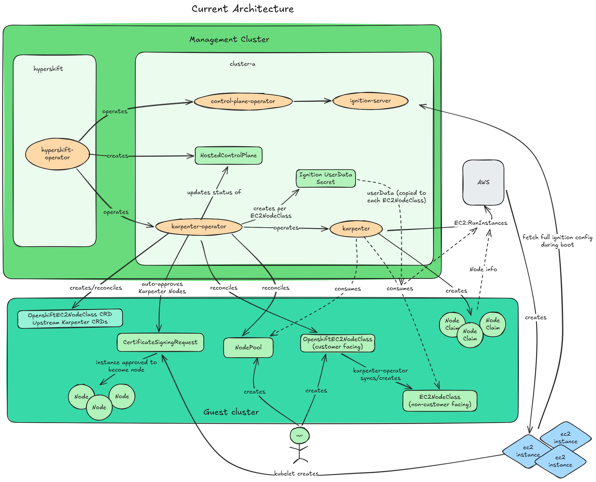
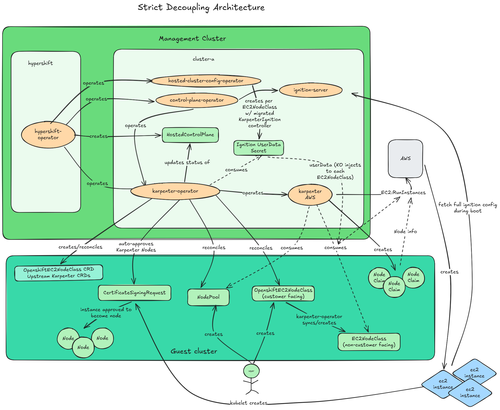

# Karpenter Operator

## Summary

This enhancement proposes `karpenter-operator`, a Cluster Version
Operator (CVO)-managed component in the OpenShift release payload
that deploys and manages [Karpenter](https://karpenter.sh/) across
standalone OpenShift and Hosted Control Planes (HCP). On HCP,
Karpenter is already shipped as AutoNode, Red Hat's managed node
autoprovisioning offering. This enhancement covers refactoring
the existing HCP implementation into the new operator binary, and
introducing Karpenter to standalone OpenShift as a DevPreview
feature (initially with AWS as a side effect of HCP integration).

## Motivation

[Karpenter](https://karpenter.sh/) is an open-source Kubernetes
node autoscaler hosted under the Cloud Native Computing
Foundation (CNCF). It watches for pods that the Kubernetes
scheduler cannot place, evaluates their scheduling constraints
against the full set of available instance types, and launches
best-fit instances directly without an intermediate node group
abstraction. Three custom resources (CRs) define the system: a
**NodePool** declares scheduling constraints, instance
requirements, and limits; a **NodeClass** (provider-specific,
e.g. `EC2NodeClass` on AWS) configures cloud settings like
AMI selection, subnets, and security groups; and a
**NodeClaim** represents a single node request created by
Karpenter at runtime. Karpenter also handles node lifecycle
through disruption: consolidating underutilized nodes,
replacing drifted nodes, and terminating expired ones. For a
full overview, see the upstream
[Karpenter Concepts](https://karpenter.sh/docs/concepts/)
documentation.

Karpenter adoption is growing across the Kubernetes ecosystem,
both in managed offerings (AWS
[EKS Auto Mode](https://docs.aws.amazon.com/eks/latest/userguide/automode.html),
Azure
[AKS Node Autoprovision](https://learn.microsoft.com/en-us/azure/aks/node-autoprovision))
and in self-managed clusters where teams deploy Karpenter
directly. OpenShift should support this capability natively
as a platform component, and customers migrating from other
Kubernetes distributions expect it to be available.

OpenShift today provides
[Cluster Autoscaler (CAS)](/enhancements/machine-api/cluster-autoscaler-operator.md)
paired with Machine API for automatic node scaling. That model
gives administrators explicit control: each MachineSet defines
a specific instance type and zone, and CAS scales those
MachineSets in response to pending pods. Karpenter serves a
different use case where administrators prefer to declare
high-level intent and let the autoscaler choose instances
dynamically. The two models are complementary; this
enhancement adds Karpenter as an opt-in alternative, not a
replacement for CAS.

HCP already ships Karpenter on AWS (AutoNode), but the
deployment/operation is embedded in the HyperShift repository.
Karpenter Go dependencies are coupled to HyperShift's go.mod,
and upstream rebases require cross-repo coordination and
dependency conflict resolution. This enhancement also covers
extracting that logic into a standalone karpenter-operator
binary so the team can develop and iterate on Karpenter
independently of HyperShift's codebase, enabling code reuse
across standalone and HCP topologies.

### User Stories

- As a platform engineer on another Kubernetes offering that
  uses Karpenter, I want to migrate to OpenShift without
  rewriting my autoscaling configuration.

- As a site reliability engineer (SRE) running both Cluster
  Autoscaler and Karpenter, I
  want OpenShift to let me run both so I can migrate workloads
  from one to the other without downtime.

- As a cluster admin running self-managed OpenShift, I want
  Karpenter available as a platform component so I can use its
  scheduling and instance selection capabilities without
  deploying and maintaining it outside of the platform.

- As a cluster admin, I want Karpenter installed, upgraded, and
  monitored as part of the platform so I do not have to manage
  its lifecycle separately.

- As a cluster admin, I want the operator to provide a default
  NodeClass that mirrors my cluster's infrastructure settings so
  new nodes work without manual cloud configuration, while still
  letting me create custom NodeClasses for specialized
  workloads.

- As an SRE managing HCP clusters, I expect the
  karpenter-operator migration to be transparent. Existing
  AutoNode behavior should not change.

### Goals

- Establish `karpenter-operator` as an OpenShift payload
  component that works across standalone (CVO-managed) and
  HCP (HO-managed) topologies, gated by the
  `KarpenterOperator` feature gate.

- Refactor the [existing karpenter-operator logic][hcp-karpenter-operator] out of the
  HyperShift repository into
  [openshift/karpenter-operator](https://github.com/openshift/karpenter-operator).

- Implement the AWS cloud provider in the operator (required
  for HCP integration).

- Define the `Karpenter` custom resource
  (`autoscaling.openshift.io`) lifecycle object, auto-created
  on HCP from `HostedCluster` spec and user-created on standalone,
  following the same pattern as the
  [`ClusterAutoscaler`](/enhancements/machine-api/cluster-autoscaler-operator.md)
  custom resource.

- Define the build, test, and release process for delivering
  karpenter-operator to both OCP and Managed Services (i.e. ROSA/ARO HCP).

### Non-Goals

- Replacing Cluster Autoscaler.

- Karpenter Operator for AWS on standalone as a primary deliverable. AWS on standalone
  works as a side effect of HCP integration but is not the
  main goal. The planned flagship provider for standalone
  OpenShift is Karpenter Cluster API (CAPI), which will be
  covered in a separate enhancement (TBD). This includes CAPI
  integration, APIs, the `KarpenterClusterAPI` feature gate, and
  standalone topology details.

- Implementation details of individual Karpenter cloud provider
  plugins. This enhancement covers the operator that deploys
  and configures those provider implementations.

- Guaranteeing safe simultaneous autoscaling by Karpenter and
  Cluster Autoscaler over the same nodes. Coexistence is
  supported for migration, but administrators must ensure they
  do not target the same nodes.

## Proposal

### Overview

Karpenter Operator on startup will auto-discover the cluster's cloud infrastructure,
and deploy/configure the corresponding Karpenter operand for the cloud provider.
Additionally, the operator will reconcile CRDs, create a default NodeClass for the cloud provider,
and auto-approve certificate signing requests (CSRs) that Karpenter will provision, as well as
other tasks such as maintaining the lifecycle of the Karpenter CR and related resources.
The same binary will run on both topologies. On standalone, CVO will deploy the operator
into the `openshift-karpenter` namespace. On HCP, the HyperShift Operator (HO) will
deploy it into the hosted control plane namespace on the management cluster. For more
information on the autoscaling capabilities of Karpenter itself,
refer to [Karpenter Concepts](https://karpenter.sh/docs/concepts/).

#### Karpenter CR lifecycle

The `Karpenter` CR is namespace-scoped (to support HCP where
multiple hosted clusters share a management cluster). On
standalone, the operator will only watch its own namespace and
the cluster administrator will create the CR directly, the
same pattern as `ClusterAutoscaler`. On HCP, the CR is
auto-created on the management cluster in the hosted control
plane namespace. The user configures Karpenter settings in
[`HostedCluster.spec`](https://github.com/openshift/hypershift/blob/main/api/hypershift/v1beta1/hostedcluster_types.go)
(e.g. [`spec.autoNode`](https://github.com/openshift/hypershift/blob/main/api/hypershift/v1beta1/hostedcluster_types.go));
the HyperShift operator creates the `Karpenter` CR and
karpenter-operator reconciles it. The CR is an internal implementation detail on
HCP, not user-facing.

#### Provider strategy

Cloud-native providers ([AWS][karpenter-aws],
[Azure][karpenter-azure]) are used on HCP for expedience.
They are mature upstream projects with broad community adoption
and vendor backing (AWS maintains the AWS provider, Microsoft
maintains the Azure provider).
Karpenter [CAPI][karpenter-capi] is the planned primary
provider for standalone OpenShift: strategic alignment with
CAPI migration, reduced per-cloud maintenance, and a common
abstraction across platforms. CAPI implementation details are
in a separate enhancement (TBD). A Karpenter Cluster API
feature gate is planned and will be detailed in that
enhancement.

Across all topologies, the operator is responsible for:

1. **Operand lifecycle.** Deploying the Karpenter Deployment,
   ServiceAccount, RBAC, and cloud credentials. The operator
   reads the `Infrastructure` CR to determine the cloud
   provider and selects the correct provider image.

2. **Default NodeClass.** The operator creates a default
   provider-specific NodeClass (e.g. `EC2NodeClass` on AWS)
   pre-configured with the cluster's infrastructure settings
   (subnets, security groups, AMI, userData) so that
   administrators can create a NodePool and start provisioning
   nodes immediately. Users can also create additional
   NodeClasses for specialized workloads. Operator-managed
   fields on all NodeClasses are protected by
   [ValidatingAdmissionPolicies (VAPs)](#validatingadmissionpolicies).
   The default NodeClass will be mutable but will be re-created with
   infrastructure-discovered defaults if deleted.

3. **CRD and RBAC management.** Deploying upstream Karpenter
   CRDs (`NodePool`, `NodeClaim`) and the provider-specific
   NodeClass CRD (e.g. `EC2NodeClass` on AWS), along with
   the operand's RBAC resources.

4. **Node identity.** OpenShift's existing machine approver
   relies on Machine/Cluster API `Machine` objects to verify
   that a certificate signing request (CSR) comes from a
   legitimate node. Because Karpenter bypasses Machine API,
   there are no `Machine` objects for Karpenter-provisioned
   nodes, so the existing approver will not approve their CSRs.
   The operator runs its own machine approver that
   cross-references each CSR against the cloud provider API
   (e.g. `ec2:DescribeInstances` on AWS) and the corresponding
   `NodeClaim` to verify the node's identity before approving.

Additional topology-specific responsibilities are described in
[Topology Considerations](#topology-considerations).

#### NodeClass customization

On both standalone and HCP, the karpenter-operator will reconcile
a default NodeClass. Users can also create additional NodeClass
resources for specialized workloads (e.g., nodes in a different
subnet or with different security group rules).

**Default NodeClass pre-population.** The operator discovers
the infrastructure that the installer provisioned — the
tagged VPC subnets, security groups, and instance profile
that existing worker MachineSets use — and pre-populates the
default NodeClass with matching `subnetSelectorTerms`,
`securityGroupSelectorTerms`, and `instanceProfile` so that
Karpenter launches nodes into the same network environment as
existing workers. Users can mutate these pre-populated fields
on the default NodeClass (e.g., to restrict Karpenter to a
subset of subnets). If the default NodeClass is deleted, the
operator will recreate it with the original
infrastructure-discovered defaults. On user-created
NodeClasses, these fields are not pre-populated; users set
them to target whatever they need as they create their own infrastructure.

**Protected fields (all NodeClasses).** Three fields are
required for a node to bootstrap as a functional OpenShift
node. Incorrect values would not just misconfigure the node
— they would prevent it from joining the cluster entirely.
The operator enforces these on every NodeClass (default and
user-created) via
[ValidatingAdmissionPolicies](#validatingadmissionpolicies)
and continuous reconciliation:

- **`amiFamily`**: Locked to `Custom`. OpenShift nodes must
  run RHCOS; no other AMI family is valid.
- **`amiSelectorTerms`**: Pinned to the cluster's RHCOS AMI
  for the current OCP version. The Machine Config Operator
  (MCO) handles in-place OS
  upgrades on running nodes, so the AMI only needs to match
  the cluster version at initial boot. The operator manages
  the pin during cluster upgrades, if needed.
- **`userData`**: The operator-generated Ignition pointer
  config. On standalone this points to the Machine Config
  Server (MCS); on HCP it authenticates to the
  ignition-server. Without a valid Ignition config, the
  instance cannot bootstrap.

Everything else on the NodeClass (blockDeviceMappings, tags,
metadataOptions, etc.) is user-configurable.

**Node configuration differs by topology:**

- **Standalone:** Users customize nodes through
  MachineConfig objects on the operator-created
  MachineConfigPool (MCP) for each NodeClass. The
  `spec.kubelet` field on the EC2NodeClass is not used on
  standalone because MachineConfig provides the same
  functionality with full OpenShift integration (kubelet
  settings, systemd units, files, kernel args). See
  [RHCOS Bootstrap and Ignition userData](#rhcos-bootstrap-and-ignition-userdata)
  for how the MCP and MCS pipeline works.
- **HCP:** Users customize nodes through `spec.kubelet` on
  the `OpenshiftEC2NodeClass`. KarpenterIgnition renders
  these settings into the Ignition config via a KubeletConfig
  ConfigMap on the management cluster. There is no MCO or MCS
  on HCP.

### Workflow Description

**cluster administrator** is a human user responsible for
managing the OpenShift workload cluster.

#### Standalone workflow

The following uses AWS as an illustrative example. The planned
primary provider for standalone is Karpenter CAPI, detailed in a
separate enhancement (TBD).

1. The `KarpenterOperator` feature gate must be enabled on
   the cluster (initially part of the `DevPreviewNoUpgrade`
   feature set).

2. The CVO will apply the operator manifests from the payload:
   namespace, CRDs, CredentialsRequests, RBAC, operator
   Deployment, and `ClusterOperator` CR.

3. The operator will start, read the `Infrastructure` CR, and
   wait for a `Karpenter` CR.

4. The cluster administrator will create a `Karpenter` CR:

   ```yaml
   apiVersion: autoscaling.openshift.io/v1alpha1
   kind: Karpenter
   metadata:
     name: cluster
     namespace: openshift-karpenter
   ```

5. The operator will reconcile: deploy the operand, create a
   default NodeClass (e.g. `EC2NodeClass` on AWS) from worker
   infrastructure, start the machine approver, and report
   `Available=True`.

6. The cluster administrator will create a `NodePool`. Using
   AWS as an example:

   ```yaml
   apiVersion: karpenter.sh/v1
   kind: NodePool
   metadata:
     name: general-purpose
   spec:
     template:
       spec:
         nodeClassRef:
           group: karpenter.k8s.aws
           kind: EC2NodeClass
           name: default
         requirements:
           - key: karpenter.sh/capacity-type
             operator: In
             values: ["on-demand"]
           - key: node.kubernetes.io/instance-type
             operator: In
             values: ["m5.xlarge", "m5.2xlarge",
                       "m6i.xlarge", "m6i.2xlarge"]
     limits:
       cpu: "100"
   ```

7. Karpenter will observe unschedulable pods, pick an instance
   type, and launch a cloud instance. The node will boot with
   Red Hat Enterprise Linux CoreOS (RHCOS) and userData, submit a certificate signing request
   (CSR), and the machine approver will approve it. The node
   will join the cluster.

#### HCP workflow

1. The HO deploys karpenter-operator into the hosted control
   plane namespace on the management cluster.

2. The HyperShift operator auto-creates a `Karpenter` CR from
   [`HostedCluster.spec`](https://github.com/openshift/hypershift/blob/main/api/hypershift/v1beta1/hostedcluster_types.go)
   configuration (e.g. [`spec.autoNode`](https://github.com/openshift/hypershift/blob/main/api/hypershift/v1beta1/hostedcluster_types.go)).

3. The operator reconciles the CR: deploys the Karpenter
   operand (with guest-cluster kubeconfig), manages CRDs and
   NodeClass on the guest cluster, and runs the machine
   approver.

4. KarpenterIgnition (HCP-specific controller) generates
   userData secrets; the operator's NodeClass controller reads
   those secrets and writes userData into the NodeClass.

5. Customers create `NodePool` resources in the guest cluster
   as on standalone. Karpenter provisions nodes through the
   cloud provider API; the machine approver verifies identity
   before approving CSRs.

If the `Karpenter` CR is deleted, the operator's finalizer
blocks deletion until all `NodeClaim` resources are gone,
ensuring nodes are drained and terminated first.

### API Extensions

**Deployed by CVO (standalone) / HO (HCP):**

- **`Karpenter`** (`autoscaling.openshift.io/v1alpha1`):
  namespace-scoped lifecycle trigger. Creating it deploys the
  operand; deleting it tears down after draining nodes. On HCP
  it is auto-created from
  [`HostedCluster.spec`](https://github.com/openshift/hypershift/blob/main/api/hypershift/v1beta1/hostedcluster_types.go);
  on standalone the administrator creates it directly.

  **spec:**
  - `logLevel`: operand log verbosity.
  - `deployment.requests` / `deployment.limits`: resource
    requests and limits for the Karpenter operand Deployment.

  **status:**
  - `conditions`. Standard operator conditions: `Available`,
    `Progressing`, `Degraded`. On standalone these mirror the
    `ClusterOperator` conditions. On HCP there is no
    `ClusterOperator`, so the `Karpenter` CR conditions are the
    primary operator health signal.
  - `enabledFeatureGates`. List of upstream Karpenter feature
    gates currently enabled on the operand.

  Future fields (not in scope for this enhancement): `clusterAPI`
  (bool, separate CAPI enhancement), upstream Karpenter settings,
  `spec.aws` sub-field for AWS-specific operator configuration.

**Deployed programmatically by the operator at runtime:**

- **`NodePool`** (`karpenter.sh/v1`): upstream CRD defining
  scheduling constraints, instance requirements, and limits.
- **`NodeClaim`** (`karpenter.sh/v1`): upstream CRD
  representing a Karpenter node lifecycle. These custom resources are created by Karpenter.
- **`EC2NodeClass`** (`karpenter.k8s.aws/v1`): upstream AWS
  CRD for provider-specific node configuration.

On HCP the operator currently deploys these CRDs at runtime.
On standalone, whether CRDs should be in CVO payload manifests
instead is an open question (see
[Open Questions](#open-questions-optional)).

Some NodeClass fields are operator-managed (e.g. `amiFamily`,
`userData`) and protected from user modification. The
mechanism differs by topology: standalone uses
[ValidatingAdmissionPolicies](#validatingadmissionpolicies),
while AWS HCP uses the
[`OpenshiftEC2NodeClass`](#openshiftec2nodeclass) facade API.
See [Topology Considerations](#topology-considerations) for
details. Write permissions for each actor are listed in
[RBAC and write contract](#rbac-and-write-contract).

This enhancement does not modify existing OpenShift resources.
Karpenter-provisioned nodes are standard Kubernetes nodes with
Karpenter-specific labels and annotations.

### Topology Considerations

#### Hypershift / Hosted Control Planes

In HCP, the control plane (API server, etcd, controllers)
runs in a management cluster, while customer workloads run in
a separate guest cluster. Operators like karpenter-operator
run on the management cluster and interact with the guest
cluster via a kubeconfig.

HyperShift already deploys Karpenter on AWS HCP clusters
(ROSA HCP and self-managed HCP on AWS) today under
AutoNode. This section describes the current state,
the refactoring, and the target architecture.

##### Today vs target

- **Today:** The HO deploys a karpenter Deployment from the
  `aws-karpenter-provider-aws` payload image and a
  karpenter-operator Deployment from the HyperShift image
  (different binary entrypoint). There is no separate operator
  binary. HyperShift-specific controllers (KarpenterIgnition,
  `OpenshiftEC2NodeClass` reconciler) are embedded in
  HyperShift.
- **Target:** The HO will deploy karpenter-operator from an image
  referenced in the image overrides file (see
  [Build, Release, and Delivery to HCP](#build-release-and-delivery-to-hcp)).
  Everything currently in HyperShift's
  [`karpenter-operator` directory][hcp-karpenter-operator]
  will move to the karpenter-operator repository.
  The operator will contain both common and HCP-specific code
  paths, toggled by topology detection from the
  `Infrastructure` CR. Anything that cannot move (deeply
  coupled HyperShift internals) stays in hypershift-operator.

##### Current state

In HCP the HyperShift Operator (HO) directly manages all
Deployments in the hosted control plane namespace. For
Karpenter this means the HO deploys two Deployments from the
HyperShift image:

- A **karpenter Deployment** using the
  `aws-karpenter-provider-aws` payload image. This is the
  Karpenter operand. It targets the guest cluster via a
  kubeconfig mounted by the HO.
- A **karpenter-operator Deployment** using the Hypershift
  image itself, running a different binary entrypoint. This
  controller handles EC2NodeClass reconciliation, Ignition
  configuration, and machine approval, but it does not deploy
  the Karpenter operand; the HO handles that directly.

Karpenter Go dependencies are coupled to the HyperShift
go.mod. Rebasing the OpenShift fork of karpenter-provider-aws
requires coordinating with the HyperShift release cycle.

Both Deployments run on the management cluster. Customers
never see or manage these processes.



##### HCP Karpenter Operator refactoring

All controllers and logic will port to
[openshift/karpenter-operator](https://github.com/openshift/karpenter-operator)
where possible. Anything deeply coupled to HCP that cannot
move will stay in HyperShift. The operator will ship as its own payload
image, deployed by the HO via CPOv2 controlPlaneComponents. HyperShift
will carry zero upstream Karpenter Go dependencies after the
refactor and be able to ship independently of any Karpenter changes made
by the team maintaining Karpenter for OpenShift. `OpenshiftEC2NodeClass`
API types will move to the `karpenter-operator/api` sub-module.



##### Migration period

The refactoring cannot happen atomically. Existing HCP
clusters will continue running the embedded code path until
they upgrade to a version with `KarpenterOperator`
enabled by default. During this transition period, both code paths must
be maintained, but features and bug fixes will no longer be merged into the
old karpenter-operator code path in HyperShift unless absolutely necessary.

- The embedded Karpenter logic in HyperShift remains the
  production path for clusters that have not yet upgraded.
  Critical fixes will be cherry-picked into the embedded
  code in hypershift/karpenter-operator when necessary to support those clusters.
- New clusters created after the feature gate is enabled will
  use the standalone karpenter-operator image from the start.
- Existing clusters will switch to karpenter-operator when
  they upgrade to a release where the gate is enabled. The
  HO handles this transition by deploying karpenter-operator
  and scaling down the embedded controllers.

The old embedded code can only be removed from HyperShift
once all supported HCP versions have moved past the
transition. New development will land in the
karpenter-operator repository only. Critical fixes will be
cherry-picked into the embedded HyperShift code only when
absolutely necessary to support clusters on older versions that have
not yet migrated.

##### Topology detection

The same binary will run on both topologies. The operator will
detect the topology at startup (e.g. from the `Infrastructure` CR
or a flag set by CPOv2) and enable the appropriate controller
set:

- **Standalone-only:** ClusterOperator status reporting.
- **HCP-only:** `OpenshiftEC2NodeClass` reconciliation, HCP
  lifecycle management.
- **Both:** `Karpenter` lifecycle CRD (auto-created on HCP,
  user-created on standalone), operand deployment and RBAC,
  machine approver, CRD management.

##### HCP deployment model (target)

After the refactor:

- `v2/karpenter/` (operand controlPlaneComponent) will be
  removed. karpenter-operator will manage the operand Deployment
  in both topologies.
- `v2/karpenteroperator/` (the HO's controlPlaneComponent for
  karpenter-operator) will deploy the `karpenter-operator`
  image instead of the HyperShift image.
- On HCP, the karpenter-operator image is not sourced from the
  hosted cluster's OCP payload. It is pinned as a digest in
  hypershift-operator source and delivered through the
  HCP/managed-services release stream (see
  [Build, Release, and Delivery to HCP](#build-release-and-delivery-to-hcp)).
  The OCP payload carries the image for standalone only.
- Karpenter configuration on HCP will flow through the
  [`HostedCluster` API](https://github.com/openshift/hypershift/blob/main/api/hypershift/v1beta1/hostedcluster_types.go)
  (e.g. [`spec.autoNode`](https://github.com/openshift/hypershift/blob/main/api/hypershift/v1beta1/hostedcluster_types.go)),
  which feeds into creating a `Karpenter` CR that the operator
  reconciles (same code path as standalone).
- On HCP, the operator will mount a guest-cluster kubeconfig and
  pass it to the Karpenter operand Deployment so the operand
  targets the guest cluster. This plumbing will be disabled on
  standalone where there is no management/guest distinction.

The karpenter-operator controlPlaneComponent will use
`.MonitorOperandsRolloutStatus()` to track the karpenter
operand Deployment. The operand Deployment will be labeled
with `hypershift.openshift.io/managed-by: karpenter-operator`
and annotated with `release.openshift.io/version`. The
karpenter-operator component will not report rollout-complete
until its operand is ready. No separate controlPlaneComponent
is needed for the operand.

The HCP refactor is an architectural change, not a new
user-facing feature. It is gated by the same
`KarpenterOperator` feature gate used on standalone. On HCP,
this gate controls the rollout of the separate
karpenter-operator binary on existing AWS HCP clusters.

##### OpenshiftEC2NodeClass

`OpenshiftEC2NodeClass`
(`karpenter.hypershift.openshift.io/v1`) is an OpenShift-owned
API modeled after the upstream `EC2NodeClass` but adapted to
fit OpenShift's API conventions. It emulates most upstream
`EC2NodeClass` fields while removing fields that users should
not touch in an OpenShift context (`amiFamily`, `userData`,
`amiSelectorTerms`) and adding OpenShift-specific fields
(e.g. `version` for release-pinned node configuration). The
karpenter-operator in HCP reconciles from
`OpenshiftEC2NodeClass` to the upstream `EC2NodeClass`,
filling in the removed fields (AMI, userData) from
platform-managed sources automatically. This wrapper exists because HCP customers interact with
NodeClasses directly in the guest cluster and need a surface
that is both simplified and compatible for RHCOS-based nodes.

> **Note:** The Autoscale team is exploring deprecating
> `OpenshiftEC2NodeClass` in favour of using the upstream
> `EC2NodeClass` directly with
> [ValidatingAdmissionPolicies](#validatingadmissionpolicies)
> controlling the same behaviour. A foreign API that diverges
> from upstream is confusing for users and requires ongoing
> toil (syncing new fields, reconciling drift, carrying an
> additional CRD lifecycle). The `version` field would move to
> another API surface. This is tracked in
> [AUTOSCALE-526](https://redhat.atlassian.net/browse/AUTOSCALE-526).
> For the same reasons, we are not planning to introduce an
> `OpenshiftAzureNodeClass` wrapper API for Azure HCP. The Azure provider
> will use the upstream `AzureNodeClass` directly with VAPs
> from the start (see
> [ValidatingAdmissionPolicies](#validatingadmissionpolicies)).

On standalone the operator will use the upstream NodeClass
directly with VAPs protecting operator-managed fields (see
[ValidatingAdmissionPolicies](#validatingadmissionpolicies)).

#### Standalone Clusters

Standalone self-managed OpenShift will be supported. See
[Provider strategy](#provider-strategy) for the standalone
provider path.

On standalone the operator will discover the cluster's worker
node infrastructure from existing MachineSets: subnets,
security groups, IAM instance profile, AMI, block device
mappings (on AWS). It will populate the default NodeClass with
these values. It will inject the `worker-user-data` secret
(the Ignition pointer config created by the MCO, used by
Machine API worker MachineSets) as userData with
`amiFamily: Custom` for RHCOS bootstrap. This
will provide a turnkey experience similar to the default
MachineSets and MachineDeployments that the installer creates
during Installer-Provisioned Infrastructure (IPI): Karpenter
will be ready to provision nodes immediately without manual
cloud configuration.

The operator will also maintain a `ClusterOperator` CR with
standard conditions, version reporting, and related-object
references for `oc adm must-gather`. This is standalone-only;
on HCP, status is reported through the hosted control plane
infrastructure.

#### Single-node Deployments or MicroShift

Not applicable.

#### OpenShift Kubernetes Engine

Same deployment model as standalone OpenShift. No differences
in karpenter-operator behavior.

### Implementation Details/Notes/Constraints

#### Payload Images

Two images have been added to the payload:

- **`karpenter-operator`**: the operator binary, built from
  [openshift/karpenter-operator](https://github.com/openshift/karpenter-operator).
- **`aws-karpenter-provider-aws`**: the Karpenter operand for
  AWS, built from
  [openshift/aws-karpenter-provider-aws](https://github.com/openshift/aws-karpenter-provider-aws)
  (OpenShift's fork of upstream
  [aws/karpenter-provider-aws](https://github.com/aws/karpenter-provider-aws)).
  This image bundles Karpenter core with the AWS provider
  plugin.

Each provider image follows the same pattern:
Karpenter core bundled with a provider plugin, selected by the
operator at runtime based on the `Infrastructure` CR.

The `aws-karpenter-provider-aws` image is already part of the
OpenShift release payload today. HyperShift uses it as the
Karpenter operand deployed into the hosted control plane
namespace for AutoNode on AWS HCP clusters. After the
refactoring, karpenter-operator will
manage the operand Deployment in both topologies. Sharing one payload
artifact avoids maintaining separate builds and ensures both
paths track the same Karpenter version.

#### Delivery Model and Provider Interface

For OCP standalone, two `CredentialsRequest` resources are in the payload
and deployed by the CVO: one for the operand (e.g. broad EC2/IAM/pricing permissions on
AWS) and one for the operator's machine approver (e.g.
`ec2:DescribeInstances` on AWS). These `CredentialsRequest`
resources do not exist on HCP. On HCP, cloud credentials
are provided through the HO's credential management, not
through `CredentialsRequest` CRs on the management cluster.
Internally the operator uses a provider interface.
Cloud-specific logic lives in per-provider packages, following
the same pattern. Adding a provider means implementing the
interface and supplying provider-specific CRDs and
CredentialsRequests. At startup the operator reads the
`Infrastructure` CR's `status.platformStatus.type` to
determine the cloud provider and selects the corresponding
operand image (e.g. `aws-karpenter-provider-aws` for AWS).

#### Upstream Karpenter feature gates

Upstream Karpenter has its own set of
[feature gates](https://karpenter.sh/docs/reference/settings/#feature-gates)
independent of OpenShift feature gates. The operator controls
which upstream gates are enabled on the operand Deployment.

OpenShift follows the upstream Karpenter feature gate lifecycle
but applies its own graduation criteria:

- **Upstream GA and default-on features** are considered GA in
  OpenShift from the start.
- **Upstream beta features** can be considered for GA in
  OpenShift. The upstream project tends to keep features in
  beta for a long time, and beta features are relatively
  stable (e.g. ReservedCapacity is default-on but still beta
  upstream). The Autoscale team will go through QA and documentation
  processes for beta features before GA-ing them in OpenShift.
- **Upstream alpha features** can be considered for TechPreview
  in OpenShift but cannot be GA until the upstream project
  graduates them to at least beta. Alpha APIs can change
  upstream at any time, making them unsuitable for a GA
  supported product.

At GA of karpenter-operator for OCP, the following upstream
features will be considered GA (on by default and does not require
an openshift/api feature gate):

- **Drift**
- **ReservedCapacity**

All other upstream feature gates will be registered in
`openshift/api`, started at DevPreview/TechPreview, and off by default.
They will graduate through the standard OpenShift feature gate
lifecycle as validation is completed.

Users control which Karpenter feature gates are active through
the OpenShift feature gate mechanism, not through fields on the
`Karpenter` CR or direct operand configuration. On standalone,
this is the cluster-scoped `FeatureGate` CR. On HCP, this is
`HostedCluster.spec.configuration.featureGate` (same
`configv1.FeatureGateSpec`). The operator reads the enabled
gates and translates them to the appropriate operand arguments.

OpenShift official documentation will list which upstream Karpenter
feature gates are available, enabled by default, and at what
OpenShift graduation level.

#### RBAC and write contract

| Actor | Resources | Verbs / fields |
| ----- | --------- | -------------- |
| karpenter-operator | `Infrastructure`, `MachineSet` (standalone), Secret `worker-user-data` (standalone) | Read |
| karpenter-operator | `Karpenter` status, default NodeClass, operand `Deployment`, VAPs, `ClusterOperator` (standalone only) | Write / reconcile |
| Karpenter operand | `NodePool` status, `NodeClaim` | Read / write |
| Karpenter operand | NodeClass | Read |
| Karpenter operand | Cloud API (e.g. EC2) | Per upstream [AWS IAM reference][karpenter-aws-iam] |
| Machine approver | CSR | Read / approve / deny |
| Machine approver | Cloud API (e.g. `ec2:DescribeInstances`) | Read |

On HCP, the operator and operand use a guest-cluster kubeconfig
for guest-cluster resources. RBAC for HCP KO is reused from
existing manifests in `v2/assets/karpenter-operator/`. The guest-cluster kubeconfig follows
the standard HO-minted kubeconfig secret pattern. HCP-specific
code paths in karpenter-operator are disabled on standalone.

#### RHCOS Bootstrap and Ignition userData

OpenShift nodes use RHCOS and require Ignition-based userData.
AMI selection and bootstrap configuration follow the same
patterns as other OpenShift node provisioning; see
[manage-boot-images](/enhancements/machine-config/manage-boot-images.md)
for how release-pinned AMIs are managed.

When Karpenter launches a node, the cloud provider passes
userData from the NodeClass to the instance at boot. On
OpenShift, this userData is a small Ignition "pointer config"
that tells the node where to fetch its full configuration.
The operator will generate this pointer config, store it in a
Secret, and write it into the NodeClass so Karpenter can
pass it to new instances. Both topologies will use the same
interface for reading the Secret and writing it into the
NodeClass; the difference is which pipeline produces it.

**Standalone.** On standalone OpenShift, the MCO manages node
configuration. It renders MachineConfig objects into full
Ignition configs and serves them via the MCS, which listens on
the control plane nodes. The operator will create a
MachineConfigPool (MCP) per NodeClass and write a pointer
config into the NodeClass's `spec.userData` field. This pointer
config contains the MCS URL for the correct MCP (e.g.
`/config/karpenter-<nodeclass-name>`). When Karpenter launches
an instance, the node boots, fetches its full Ignition config
from the MCS, and configures itself with the rendered
MachineConfig content (kubelet settings, systemd units, files,
kernel args, etc.).

When a MachineConfig changes, MCO re-renders the Ignition for
the MCP. Existing nodes are updated in-place by the Machine
Config Daemon (MCD) via rolling reboot, and new nodes boot
with the updated config from the MCS. Karpenter does not
detect "Drift" because the `userData` field (the MCS pointer
URL) has not changed; only the content served at that URL has.
See [NodeClass customization](#nodeclass-customization) for
the user-facing node configuration model.

**HCP.** On HCP there is no MCO or MCS on the guest cluster.
The KarpenterIgnition controller creates userData secrets via
the existing HyperShift NodePool ignition pipeline. The
resulting pointer config authenticates to the HyperShift
ignition-server with a bearer token to bootstrap nodes with
the correct RHCOS configuration. Node customization on HCP
goes through `spec.kubelet` on `OpenshiftEC2NodeClass`.
KarpenterIgnition reads the kubelet settings, generates a
KubeletConfig manifest stored in a ConfigMap on the
management cluster, and incorporates it into the rendered
Ignition. The `spec.kubelet` field supports both explicitly
typed fields (with CEL validation) and an overflow mechanism
for arbitrary kubelet settings that pass through to the node
(see [PR #8192](https://github.com/openshift/hypershift/pull/8192)).

**Drift detection.** Karpenter compares the configuration of
running nodes (AMI, userData, etc.) against the current
NodeClass spec. When they diverge, Karpenter marks affected
nodes as "Drifted" and replaces them. On HCP, the
ignition-server rotates the bearer token approximately every
5.5 hours, which changes the userData JSON. A naive hash of
the full userData would trigger false drift on every rotation.
To avoid this, the operator configures a
`TargetConfigVersionHash` header in the Ignition merge source
URL. When a node fetches its config, this value is sent as an
HTTP request header to the ignition-server. The
ignition-server derives the value from
`ConfigGenerator.Hash()`, which covers MachineConfig inputs,
release version, and cluster configuration, but not the
rotating bearer token. The OpenShift fork of
karpenter-provider-aws carries a patch that uses this header
value as the drift hash instead of hashing the full userData.
Token rotation does not trigger drift, but a release upgrade
or MachineConfig change does. On standalone, the Ignition
pointer config authenticates to the MCS and does not contain a
rotating bearer token, so false drift does not apply. The
carry patch falls back to hashing the full userData when the
header is absent.

#### ValidatingAdmissionPolicies

The operator reconciles VAPs to enforce the protected fields
described in [NodeClass customization](#nodeclass-customization)
(`amiFamily`, `amiSelectorTerms`, `userData`) on all
NodeClasses. The operator's ServiceAccount is excluded from
enforcement via a CEL expression.

The enforcement model differs by topology:

- **Standalone:** VAPs are operator-reconciled soft guardrails
  against accidental misconfiguration. A cluster admin could
  delete them, but the operator recreates them on the next
  reconcile. The admin can disable the operator and delete the
  VAPs if they choose, but this is unsupported and may result
  in nodes that fail to bootstrap or run a non-RHCOS image.
- **HCP:** Customers must not tamper with protected fields.
  We are exploring Kubernetes 1.36
  [manifest-based admission control](https://kubernetes.io/blog/2026/05/04/kubernetes-v1-36-manifest-based-admission-control/)
  to bake policies into the API server configuration on the
  management cluster. This would make VAPs a hard security
  boundary. Customers cannot delete or modify them because
  the policies are enforced by the API server itself, outside
  customer access. On AWS HCP,
  [`OpenshiftEC2NodeClass`](#openshiftec2nodeclass) stays for
  this enhancement; a VAP-only approach without the facade API
  is future work.

#### Build, Release, and Delivery to HCP

Today, Karpenter Go dependencies are embedded in the
HyperShift repository (see [Current state](#current-state)),
and upstream Karpenter AWS + Karpenter core rebases frequently
conflict with HyperShift's large dependency tree. After the refactoring (see
[above](#hcp-karpenter-operator-refactoring)), Karpenter
dependencies move to karpenter-operator's own go.mod which will be much
easier to manage. A hypershift-operator release is still required to ship to HCP
but for any karpenter specific functionality, the only HyperShift-side change
will be a single image digest bump, ignoring any changes that may need to happen
to HostedControlPlane status fields, or other HCP specific logic we can't port.

##### Development and release workflow

After the refactor, development for Karpenter/AutoNode will
happen primarily through
[openshift/karpenter-operator](https://github.com/openshift/karpenter-operator).
Development builds will go through the Automated Release Tooling (ART)
team's Konflux pipeline with two release streams:

1. Regular OCP release stream (standalone OCP, normal OCP
   release cadence).
2. HCP/ROSA/ARO stream (tied to main branch, shipped at the
   Autoscale team's own release cadence).

Both streams will build from the same canonical source repo.
Development on main will target HCP features and fixes
(changes also end up in the OCP stream); OCP backports will
not affect the HCP stream.

To cut a Karpenter on HCP release, the team will raise an ART JIRA ticket at least 5 working days in advance.
The ART pipeline auto-builds every commit on main to their staging registry. The team identifies and
tests the staged build to cut a release for. If successful, ART will promote the build to production.

The karpenter-operator image will be pinned as a digest in an
overrides file in hypershift-operator source. When a 
new Karpenter on HCP stream releases, renovate or dependabot will automatically open a PR to
the HyperShift repository bumping the digest. AutoNode presubmits will validate
the staged build, and if successful, will auto-merge the PR.
The Autoscale team will then inform Managed Services that karpenter-operator
version x.y.z will be available in the next hypershift-operator release.

The refactor will be transparent to Managed Services
(ROSA/ARO). Managed Services will continue consuming
hypershift-operator releases as today. Each HyperShift
operator version will pin the karpenter-operator version it
was tested against. Upgrading the HO will redeploy
karpenter-operator across all hosted clusters on that
management cluster, same as today.

Maintaining two release streams means changes to the karpenter-operator image
flow differently depending on which topology they affect. The following
scenarios illustrate common situations.

##### HCP-only change (e.g. OpenshiftEC2NodeClass API field update)

The fix goes to main branch only. The team cuts an
HCP stream release via ART, and renovate bumps the digest in
hypershift-operator.

The change will still appear in the OCP
payload changelog since both streams build from the same repo,
but it is transparent to standalone clusters and will not be
included in OCP release notes or documentation.

##### Shared bug fix

The fix lands on main first. If applicable, the team
backports it to the relevant OCP release branch(es). HCP
consumes the fix from main automatically on the next release.
Backports to previous OCP release branches (4.x, 5.x, etc.)
are invisible to HCP and managed services. Each stream ships
through its own mechanism (OCP z-stream release for standalone,
hypershift-operator digest bump for HCP).

##### Standalone-only fix
The fix goes to the relevant OCP release branch and can potentially
be backported.

If needed in the next OCP release, bug-fixes will be merged to main.
However, any standalone-specific changes are transparent to HCP and no HCP release is needed.
Regression e2e on HCP will still be run to confirm no unintended side effects from the
merge to main.

##### QE and testing

Autoscale QE tests bugs and features pre-merge on standalone
and self-managed HCP, using regression e2es and automated
suites. Bug cards assigned to the Autoscale team targeting the
`autoscaling / karpenter` component should and
will be closed after standalone and self-managed
HCP QE validation and signoff, irrespective of ROSA/ARO.

ROSA/ARO validation is handled separately by Managed
Services QE in their own staging environments, post-merge.
Managed Services should create their own tracking cards linked
to the original OCPBUGS card for their post-merge testing.

##### Communication

The dual-stream model requires tighter coordination with
Managed Services writers and stakeholders. New features and
bug fixes will be communicated through the team's forum
channel and the `wg-rosa-hcp-karpenter` Slack channel. Each
karpenter-operator release will include a summary of changes for Managed
Services consumers, and the next hypershift-operator release they will be available in.

### Risks and Mitigations

Karpenter's cloud-native providers launch instances directly
via the cloud API, bypassing Machine API. We mitigate this by
making AMI, userData, and amiFamily operator-managed and
protected via [ValidatingAdmissionPolicies](#validatingadmissionpolicies),
so Karpenter nodes use the same RHCOS image and bootstrap
configuration as Machine API nodes. The machine approver
controller within karpenter-operator verifies node identity
before approving certificate signing requests (CSRs).

The operator's machine approver auto-approves CSRs, which is
a security-sensitive operation. A bug or bypass in the identity
check could allow a rogue node to join the cluster. The
approver mitigates this by requiring a matching cloud instance
(e.g. via `ec2:DescribeInstances` on AWS) and a corresponding
`NodeClaim` before approving any CSR. CSRs with no `NodeClaim`
are ignored. This approach needs a security review before
promotion beyond Dev Preview.

The operand requires broad cloud permissions (e.g. EC2 and
IAM on AWS). It runs with a dedicated ServiceAccount and
Cloud Credential Operator (CCO)-provisioned credentials.
The operator itself uses a separate, narrower credential
(e.g. `ec2:DescribeInstances` on AWS for the machine approver).

Running Karpenter and Cluster Autoscaler concurrently is
supported for migration but carries operational risk. Both
autoscalers respond to pending pods independently. If a
`NodePool` and a MachineSet-backed node group cover the same
schedulable capacity, both may scale up for the same workload.
There is no runtime enforcement preventing overlap.
Administrators must configure disjoint node groups (e.g.
separate labels, taints, or topology constraints) so the two
autoscalers do not conflict. This will be documented but not enforced by the operator.

### Drawbacks

Maintaining cloud-native provider forks (AWS, Azure, and
potentially others) adds ongoing rebase and release overhead
per cloud, separate from the CAPI path planned for standalone.

The HCP refactor touches a shipped
AutoNode product. A regression during migration would affect
production ROSA HCP and self-managed HCP clusters on AWS.

RHCOS bootstrap requires Ignition userData pipelines,
drift-detection patches, and topology-specific controllers
(KarpenterIgnition on HCP, MCO on standalone). This diverges
from upstream Karpenter's simpler cloud-init model and adds
complexity the operator must carry indefinitely.

On AWS HCP, `OpenshiftEC2NodeClass` is a facade API over
upstream `EC2NodeClass`. It simplifies the user surface but
requires schema sync as upstream evolves and may confuse users
who expect standard Karpenter documentation.

## Alternatives (Not Implemented)

### Do nothing

Without this feature OpenShift lacks support for mixed-instance
autoprovisioning. Managed Kubernetes services from AWS and
Microsoft already offer this via Karpenter (EKS Auto Mode, AKS
Node Auto Provisioning).

### Enhance Cluster Autoscaler and MachineSets

Cluster Autoscaler is built on top of homogeneous MachineSets,
so it still requires the administrator to maintain the initial
MachineSet layout. Retrofitting Karpenter's scheduling model
onto it would amount to a ground-up rewrite. Karpenter has
broad community adoption and active maintenance from AWS and
Microsoft.

### Operator Lifecycle Manager (OLM)-managed layered operator

Users see Karpenter as a peer to Cluster Autoscaler, which is
CVO-managed, and expect parity in lifecycle management. CVO
provides tighter integration with upgrades, rollbacks, and
ClusterOperator status reporting.

## Open Questions [optional]

1. What is the cleanup procedure when the `Karpenter` CR is
   deleted on a cluster with active Karpenter nodes?

2. What is the node upgrade model for Karpenter-provisioned
   nodes? Covered in topology-specific enhancements (HCP
   Karpenter, standalone CAPI Karpenter (TBD)).

3. Where do HCP-specific controllers that cannot move to
   karpenter-operator run? (HCCO, CPO, standalone binary,
   etc.)

4. ~~What is the gating mechanism for the HCP refactor
   transition?~~ Resolved: `KarpenterOperator`
   feature gate, shared across both standalone and HCP.

5. How is the bidirectional API dependency between
   `karpenter-operator/api` and `hypershift/api` managed?

6. Should upstream Karpenter CRDs (`NodePool`, `NodeClaim`,
   provider-specific NodeClass) be deployed by the CVO from
   payload manifests, or remain operator-managed at runtime?
   CVO-managed CRDs get lifecycle guarantees (upgrade
   ordering, rollback) but require the CRDs to be present in
   the payload even when the operator is not active.
   Currently the operator manages CRDs at runtime: it applies
   the correct CRD version before starting the operand on both
   upgrade and downgrade, the same ordering CVO would provide.
   Upstream Karpenter CRDs are at `v1` with no planned API
   version bumps, so storage version migration is not a near-term
   concern.

7. Assuming we go with the MachineConfig story and completely ignore
   the upstream `spec.kubelet` field on EC2NodeClass, should it be
   VAP-blocked on standalone to prevent confusion?
   Or potentially even removed from the API altogether? See below.

8. Should upstream CRD schemas be modified to remove fields that
   are not applicable on OpenShift (e.g., restricting `amiFamily`
   enum to only `Custom`), or should the upstream schemas be kept
   as-is with VAPs enforcing constraints?

## Test Plan

Testing follows a three-tier strategy:

1. **HCP e2e tests**: `TestKarpenter` and
   `TestKarpenterUpgradeControlPlane` in the HyperShift test
   suite serve as regression coverage for the
   karpenter-operator refactoring on AWS HCP clusters.

2. **Standalone OCP e2e tests**: presubmits in the
   karpenter-operator repository cover provisioning,
   scale-down/consolidation, drift, disruption budgets,
   default NodeClass creation, ClusterOperator status, and
   upgrade rollout.

3. **autoscale-tests common suite**: runs upstream Karpenter
   core library tests shared across provider implementations.

Pre-merge (karpenter-operator repo): `e2e-aws-hypershift`
presubmit runs `TestKarpenter` and
`TestKarpenterUpgradeControlPlane` against the PR's image
and latest HyperShift operator. Pre-merge (hypershift repo):
renovate digest-bump PR runs standard HyperShift operator
presubmits including Karpenter e2e. Post-merge periodics:
daily AutoNode jobs run the full Karpenter test suite on
current OCP and n-1.

## Graduation Criteria

Both topologies are gated by the `KarpenterOperator`
OpenShift feature gate. On standalone, the CVO deploys the
operator when the gate is enabled. On HCP, the same gate
controls the rollout of the separate karpenter-operator
binary.

### Dev Preview -> Tech Preview

**Standalone (OCP):**

- karpenter-operator payload component deployed on standalone
  via the `KarpenterOperator` feature gate.
- `Karpenter` CR lifecycle working (user-created).
- ClusterOperator conditions reliable.
- Default NodeClass created from worker MachineSet
  infrastructure.
- Machine approver functional.
- Sufficient e2e coverage (standalone test tier).
- End user documentation published.
- Feedback gathered from users and field teams.

**HCP (refactor rollout, feature-gated):**

- Refactoring complete: operator logic
  extracted from HyperShift, image deployed by HO via CPOv2,
  zero Karpenter Go deps in HyperShift.
- `KarpenterOperator` feature gate enabled,
  karpenter-operator binary deployed
  instead of embedded HyperShift image controllers.
- AWS cloud-native provider functional on AWS HCP clusters
  (ROSA HCP and self-managed HCP on AWS).
- `Karpenter` CR lifecycle working (auto-created from
  `HostedCluster` spec).
- No regression in existing AutoNode behavior.
- E2e coverage validates no behavioral drift between the
  embedded code path and the standalone karpenter-operator
  during migration.
- Sufficient e2e coverage (HCP test tier).

Azure HCP Karpenter support is not in scope for this
enhancement, but the operator refactor is a prerequisite for
it. Azure and therefore ARO HCP Karpenter provider integration
will be worked through the karpenter-operator once the
refactoring is complete.

### Tech Preview -> GA

- Standalone CAPI provider promoted
  (separate enhancement (TBD)).
- Sufficient feedback across multiple releases.
- `KarpenterOperator` feature gate graduates to GA (operator
  is present on all clusters, idle until a `Karpenter` CR is
  created).
- Load testing (large NodePool counts, high churn).
- User-facing documentation in
  [openshift-docs](https://github.com/openshift/openshift-docs/).

### Removing a deprecated feature

Not applicable.

## Upgrade / Downgrade Strategy

### Operator and Operand Upgrade

During a cluster upgrade the CVO updates the operator manifests
as part of the normal payload rollout. The operator performs a
rolling update of the Karpenter Deployment. No administrator
action is required.

In Dev Preview the `KarpenterOperator` feature gate is part of
the `DevPreviewNoUpgrade` feature set, which prevents upgrades
and downgrades. Downgrade is not applicable at this stage.

## Version Skew Strategy

The operator and operand are part of the same payload and
upgraded together by the CVO. Karpenter nodes may run a
previous kubelet during upgrades, covered by standard
Kubernetes version skew guarantees (control plane N,
kubelet N-2).

## Operational Aspects of API Extensions

`NodePool` and `NodeClaim` instances are expected to stay in
the low hundreds per cluster; NodeClass resources under 10;
one `Karpenter` CR per namespace. None of these CRDs use
webhooks.

**Failure modes:**

- **Missing worker MachineSets:** The operator cannot discover
  subnets, security groups, or AMI for the default NodeClass.
  It sets `Degraded=True` on the `Karpenter` CR and retries
  until MachineSets exist.
- **Unreachable cloud API:** The machine approver cannot verify
  node identity. CSRs from Karpenter-provisioned nodes remain
  pending until the cloud API is reachable.
- **Missing `worker-user-data` secret:** The operator cannot
  populate NodeClass userData. It sets `Degraded=True` and
  retries until the secret is available.
- **VAPs deleted:** The operator recreates VAPs on the next
  reconcile and logs a warning. Nodes provisioned while VAPs
  are absent may use incorrect AMI or userData.


## Support Procedures

**Version compatibility:**

- OCP documentation will list which upstream Karpenter version
  is packaged with each OCP release. HCP/ROSA/ARO
  documentation will do the same for each managed services
  version. Some upstream Karpenter features may not exist in
  the version shipped with a given release.
- Upstream Karpenter feature gates available and enabled by
  default will also be documented per release (see
  [Upstream Karpenter feature gates](#upstream-karpenter-feature-gates)).
  Admins can check which gates are active via
  `status.enabledFeatureGates` on the `Karpenter` CR, or by
  inspecting the args on the Karpenter operand Deployment.

**Detecting failure:**

- On standalone, `oc get clusteroperator karpenter` shows
  `Degraded=True` or `Available=False` when the operator
  cannot reconcile. The `Karpenter` CR
  (`oc get karpenter -n openshift-karpenter -o yaml`) has
  more granular conditions.
- On HCP, there is no `ClusterOperator`. Check the
  `Karpenter` CR in the hosted control plane namespace on the
  management cluster
  (`oc get karpenter -n <hcp-namespace> -o yaml`).
- Nodes stuck in `NotReady` with pending CSRs indicate the
  machine approver cannot verify node identity. Check
  karpenter-operator logs for approver errors and verify
  cloud API connectivity.
- Missing or incomplete NodeClass (no subnets, no AMI, no
  userData) usually points to the operator failing an
  intermediate reconciliation step. Check karpenter-operator
  logs for errors.
- Operator and operand logs:
  - Standalone:
    `oc logs -n openshift-karpenter -l app=karpenter-operator`
    and `oc logs -n openshift-karpenter -l app=karpenter`
  - HCP (management cluster):
    `oc logs -n <hcp-namespace> -l app=karpenter-operator`
    and `oc logs -n <hcp-namespace> -l app=karpenter`
- Karpenter resources to inspect:
  `oc get nodepools,nodeclaims,ec2nodeclasses` (on the guest
  cluster for HCP, on the local cluster for standalone).
- On HCP, AutoNode issues may originate in the HyperShift
  operator. Check HyperShift operator logs for
  `HostedCluster` reconciliation errors related to
  [`spec.autoNode`](https://github.com/openshift/hypershift/blob/main/api/hypershift/v1beta1/hostedcluster_types.go).

**Disabling the feature:**

- Delete all `NodePool` resources and wait for Karpenter to
  drain and terminate the associated nodes. Then delete the
  `Karpenter` CR. The operator's finalizer blocks CR deletion
  until all `NodeClaim` resources are gone.
- On HCP, disable AutoNode through the `HostedCluster` spec.
  The HyperShift operator will remove the `Karpenter` CR.

**Consequences of disabling:**

- Existing Karpenter-provisioned nodes are drained and
  terminated. Workloads running on those nodes are
  rescheduled onto other nodes (MachineSet-backed or
  otherwise).
- The operator and operand Deployments remain but are idle
  until a new `Karpenter` CR is created.

**Recovery:**

- Create a new `Karpenter` CR (standalone) or re-enable
  AutoNode on the `HostedCluster` (HCP). The operator
  reconciles and redeploys the operand. No manual
  intervention beyond CR creation is needed.

## Infrastructure Needed [optional]

- The source repository already exists at
  [openshift/karpenter-operator](https://github.com/openshift/karpenter-operator).
- ART team adds the `karpenter-operator` image to the OCP release payload.
- ART team maintains two release streams for `karpenter-operator`:
  the regular OCP stream and an HCP/Managed Services stream
  tied to main (see
  [Build, Release, and Delivery to HCP](#build-release-and-delivery-to-hcp)).

[karpenter-aws]: https://github.com/aws/karpenter-provider-aws
[karpenter-azure]: https://github.com/Azure/karpenter-provider-azure
[karpenter-capi]: https://github.com/kubernetes-sigs/karpenter-provider-cluster-api
[karpenter-aws-iam]: https://karpenter.sh/docs/reference/cloudformation/
[hcp-karpenter-operator]: https://github.com/openshift/hypershift/tree/main/karpenter-operator
