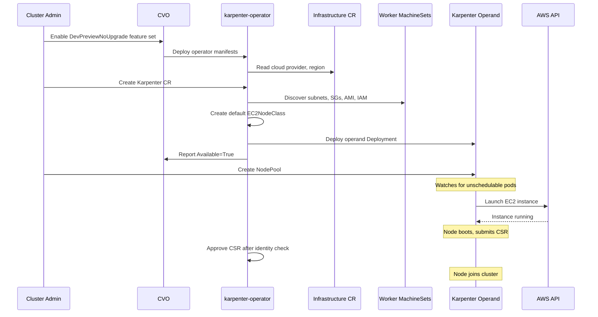

# Karpenter Operator

## Summary

This enhancement adds a Cluster Version Operator (CVO)-managed ClusterOperator,
`karpenter-operator`, to the OpenShift release payload. The
operator deploys and manages [Karpenter](https://karpenter.sh/) 
on OpenShift clusters, starting with AWS in Dev Preview.
Karpenter automatically provisions nodes by evaluating pending pod
requirments and cluster constraints to dynamically select the best-fit instance types.

## Motivation

[Karpenter](https://karpenter.sh/) is an open-source Kubernetes
node autoscaler maintained by the community under the
Cloud Native Computing Foundation (CNCF).
It takes an intent-based approach to node provisioning:
administrators describe constraints (instance families,
capacity types, topology spread) on a `NodePool`, and
Karpenter evaluates pending pod requirements against available
instance types to pick the best fit in real time. When an
instance type is unavailable, Karpenter falls back to
alternatives from the same NodePool constraints without
administrator intervention.

Managed Kubernetes services from AWS and Microsoft already
offer node auto-provisioning backed by Karpenter (EKS Auto
Mode, AKS Node Auto Provisioning). Customers familiar with
these capabilities expect something comparable from OpenShift.

OpenShift today provides
[Cluster Autoscaler (CAS)](/enhancements/machine-api/cluster-autoscaler-operator.md)
paired with Machine API for automatic node scaling. That model
gives administrators explicit control: each MachineSet defines
a specific instance type and zone, and CAS scales those
MachineSets in response to pending pods. Karpenter
serves a different use case where administrators prefer to
declare high-level intent and let the autoscaler choose
instances dynamically. The two models are complementary;
this enhancement adds Karpenter as an opt-in alternative, not
a replacement for CAS.

### User Stories

- As a cluster admin, I want to express intent for a diverse
  pool of nodes so I can deploy heterogeneous workloads without
  defining one MachineSet per instance type and zone.

- As a platform engineer on another Kubernetes offering that
  uses Karpenter, I want to migrate to OpenShift without
  rewriting my autoscaling configuration.

- As a site reliability engineer (SRE) running both Cluster
  Autoscaler and Karpenter, I
  want OpenShift to let me run both so I can migrate workloads
  from one to the other without downtime.

- As an AI platform engineer, I want to use Spot instances, mix
  Spot with On-Demand, and reserve GPU capacity blocks so I can
  reduce compute costs for heterogeneous workloads.

- As a cluster admin, I want Karpenter installed, upgraded, and
  monitored as part of the platform so I do not have to manage
  its lifecycle separately.

- As a cluster admin, I want the operator to provide a default
  NodeClass that mirrors my cluster's infrastructure settings so
  new nodes work without manual cloud configuration, while still
  letting me create custom NodeClasses for specialized
  workloads.

### Goals

- Deliver Karpenter as a CVO-managed payload component on AWS,
  initially available only on clusters running the
  `DevPreviewNoUpgrade` feature set (via manifest annotations).

- Introduce a `Karpenter` custom resource
  (`autoscaling.openshift.io`) that triggers the operand
  deployment when created, following the same pattern as the
  [`ClusterAutoscaler`](/enhancements/machine-api/cluster-autoscaler-operator.md)
  custom resource.

- Generate a default, operator-managed NodeClass (e.g.
  `EC2NodeClass` on AWS) that inherits the cluster's worker
  node infrastructure settings so Karpenter works out of the
  box.

- Allow Karpenter and Cluster Autoscaler to coexist on the
  same cluster for migration purposes.

- Provide an experimental `KarpenterClusterAPI` feature gate
  (DevPreviewNoUpgrade) that makes a Cluster API-backed
  Karpenter provider available as an alternative.

### Non-Goals

- Replacing Cluster Autoscaler.

- Non-AWS providers in the initial Dev Preview. Other providers
  are planned but out of scope here.

- Implementation details of individual Karpenter cloud provider
  plugins. This enhancement covers the operator that deploys
  and configures them.

- Guaranteeing safe simultaneous autoscaling by Karpenter and
  Cluster Autoscaler over the same nodes. Coexistence is
  supported for migration, but administrators must ensure they
  do not target the same nodes.

- Full HCP refactoring in the initial Dev Preview. The
  Hypershift convergence described in
  [Hypershift / Hosted Control Planes](#hypershift--hosted-control-planes)
  will happen incrementally after the standalone path is
  functional.

## Proposal

We add a CVO-managed ClusterOperator,
`karpenter-operator`, whose manifests carry the
`release.openshift.io/feature-set: DevPreviewNoUpgrade`
annotation. On clusters running the `DevPreviewNoUpgrade`
feature set the CVO applies these manifests and deploys the
operator into the `openshift-karpenter` namespace.
The operator is idle until the administrator creates a singleton
`Karpenter` custom resource, at which point it deploys the
Karpenter operand and supporting resources. This follows the
same lifecycle pattern used by the
[Cluster Autoscaler Operator](/enhancements/machine-api/cluster-autoscaler-operator.md)
and the
[Control Plane Machine Set Controller](/enhancements/machine-api/control-plane-machine-set.md):
a CRD-triggered second-level operator deployed by CVO.

The operator is responsible for:

1. **Operand lifecycle.** Deploying the Karpenter Deployment,
   ServiceAccount, RBAC, and cloud credentials. The operator
   reads the `Infrastructure` CR to determine the cloud
   provider and selects the correct provider image.

2. **Default NodeClass.** Creating a singleton NodeClass (e.g.
   `EC2NodeClass` named `default` on AWS) that mirrors the
   cluster's existing worker node infrastructure (subnets,
   security groups, IAM instance profile, AMI, block device
   mappings). The operator discovers these from worker
   MachineSets and injects the `worker-user-data` secret as
   userData with `amiFamily: Custom` for Red Hat Enterprise
   Linux CoreOS (RHCOS) bootstrap.
   Operator-managed fields are protected by a
   ValidatingAdmissionPolicy (VAP) and continuously reconciled.

3. **Node identity.** OpenShift's existing machine approver
   relies on Machine API `Machine` objects to verify that a
   certificate signing request (CSR) comes from a legitimate
   node. Because Karpenter
   bypasses Machine API, there are no `Machine` objects for
   Karpenter-provisioned nodes, so the existing approver will
   not approve their CSRs. The operator runs its own machine
   approver that cross-references each CSR against the cloud
   provider API (e.g. `ec2:DescribeInstances`) and the
   corresponding `NodeClaim` to verify the node's identity
   before approving.

4. **Status reporting.** Maintaining a `ClusterOperator` CR
   with standard conditions, version reporting, and
   related-object references for `oc adm must-gather`.

We start with the AWS-native provider because it has the most
mature upstream ecosystem and the broadest feature coverage.
A second feature gate, `KarpenterClusterAPI`
(`DevPreviewNoUpgrade`), makes a
[Cluster API (CAPI)](/enhancements/cluster-api/installing-cluster-api-components-in-ocp.md)-backed
provider available as an alternative that works on any
infrastructure with a CAPI provider, avoiding per-cloud
maintenance. Enabling the gate alone does not switch the
provider -- the administrator must also set `clusterAPI: true`
on the `Karpenter` CR. This variant is experimental.

### Workflow Description

**cluster administrator** is a human user responsible for
managing the OpenShift cluster.

1. The cluster administrator enables the `DevPreviewNoUpgrade`
   (or `CustomNoUpgrade`) feature set on the cluster.

2. The CVO sees the `DevPreviewNoUpgrade` manifest annotations
   and applies the operator manifests from the payload:
   namespace, CRDs, CredentialsRequests, RBAC, operator
   Deployment, and `ClusterOperator` CR.

3. The operator starts, reads the `Infrastructure` CR, and
   waits for a `Karpenter` CR.

4. The cluster administrator creates a `Karpenter` CR:

   ```yaml
   apiVersion: autoscaling.openshift.io/v1alpha1
   kind: Karpenter
   metadata:
     name: cluster
   ```

5. The operator reconciles: deploys the operand, creates a
   default `EC2NodeClass` from worker MachineSet
   infrastructure, starts the machine approver, and reports
   `Available=True`.

6. The cluster administrator creates a `NodePool`:

   ```yaml
   apiVersion: karpenter.sh/v1
   kind: NodePool
   metadata:
     name: general-purpose
   spec:
     template:
       spec:
         nodeClassRef:
           group: karpenter.k8s.aws
           kind: EC2NodeClass
           name: default
         requirements:
           - key: karpenter.sh/capacity-type
             operator: In
             values: ["on-demand"]
           - key: node.kubernetes.io/instance-type
             operator: In
             values: ["m5.xlarge", "m5.2xlarge",
                       "m6i.xlarge", "m6i.2xlarge"]
     limits:
       cpu: "100"
   ```

7. Karpenter observes unschedulable pods, picks an instance
   type, and launches an EC2 instance. The node boots with
   the RHCOS AMI and userData, submits a CSR, and the machine
   approver approves it. The node joins the cluster.



If the `Karpenter` CR is deleted, the operator's finalizer
blocks deletion until all `NodeClaim` resources are gone,
ensuring nodes are drained and terminated first.

### API Extensions

The following CRDs are added:

- **`Karpenter`** (`autoscaling.openshift.io/v1alpha1`):
  singleton lifecycle trigger. Creating it deploys the
  operand; deleting it tears down after draining nodes.
- **`NodePool`** (`karpenter.sh/v1`): upstream CRD defining
  scheduling constraints, instance requirements, and limits.
- **`NodeClaim`** (`karpenter.sh/v1`): upstream CRD
  representing a single node request. Created by Karpenter.
- **`EC2NodeClass`** (`karpenter.k8s.aws/v1`): upstream AWS
  CRD for provider-specific node configuration.

All upstream CRDs are deployed by the CVO from the payload.
The standalone operator uses the upstream `EC2NodeClass` CRD
directly rather than introducing a custom wrapper (e.g. the
`OpenshiftEC2NodeClass` used by Hypershift today).
This keeps parity with the upstream Karpenter API so that
users can follow upstream documentation and examples without
translation, and platform engineers migrating from EKS or
other Karpenter-enabled distributions do not have to learn an
OpenShift-specific CRD. Fields that conflict with RHCOS
requirements — `spec.amiFamily`, `spec.amiSelectorTerms`, and
`spec.userData` — are operator-managed and protected by
ValidatingAdmissionPolicies, so users cannot accidentally
break the OS bootstrap while still having full access to the
rest of the EC2NodeClass spec (instance profile, subnets,
security groups, block devices, etc.).

This enhancement does not modify existing OpenShift resources.
Karpenter-provisioned nodes are standard Kubernetes nodes with
Karpenter-specific labels and annotations.

### Topology Considerations

#### Hypershift / Hosted Control Planes

Hypershift already deploys Karpenter on ROSA and Standalone
AWS HCP clusters today under the AutoNode feature. In HCP the
control plane operator (CPO) directly manages all Deployments
in the hosted control plane namespace. For Karpenter this
means the CPO deploys two Deployments:

- A **karpenter Deployment** using the
  `aws-karpenter-provider-aws` payload image. This is the
  Karpenter operand. It targets the guest cluster via a
  kubeconfig mounted by the CPO.
- A **karpenter-operator Deployment** using the Hypershift
  image itself, running a different binary entrypoint. This
  controller handles logic around Karpenter on HCP —
  EC2NodeClass reconciliation, Ignition configuration, machine
  approval — but it does not deploy the Karpenter operand
  itself. The CPO handles that directly, as it does for all
  hosted control plane components.

Both Deployments run on the management cluster. Customers
never see or manage these processes.

This enhancement's `karpenter-operator` is designed to work
in both topologies. On a standalone self-managed cluster it
assumes a single-cluster model: the operator and operand run
in the same cluster as the workloads and the operator manages
the operand Deployment itself. On an HCP cluster the CPO will
deploy the `karpenter-operator` as its own Deployment (using
the `karpenter-operator` payload image instead of the
Hypershift image), and the operator will detect that it is
running in a management/guest-cluster topology and adjust its
code paths accordingly — for example, using a guest-cluster
kubeconfig to manage NodeClaims and Nodes while reading
infrastructure configuration from the management cluster. In
this model the CPO continues to deploy the Karpenter operand
Deployment directly, as it does today; the karpenter-operator
does not manage the operand lifecycle on HCP.

The plan is to replace the existing karpenter-operator
controller embedded in the Hypershift image with this
standalone operator binary. Logic that is generic across
topologies (default NodeClass reconciliation, machine
approval, status reporting) lives in the `karpenter-operator`
repository. Logic that is HCP-specific and cannot be
generalized will either remain in the Hypershift codebase
(e.g. CPO plumbing for kubeconfig secrets, token minting) or
be moved behind topology-aware configuration in the operator.
Where logic can be generalized without special-casing, the
refactoring will happen in the `karpenter-operator` itself
with any necessary configuration or plumbing changes in
Hypershift to accommodate it. The goal is a common set of
Karpenter management logic across all platforms and topologies
to minimize duplication and keep behavior as consistent as
possible.

One notable HCP-specific path is `OpenshiftEC2NodeClass`
(`karpenter.hypershift.openshift.io/v1`), a custom CRD used
in Hypershift that wraps the upstream `EC2NodeClass` and hides
RHCOS-sensitive fields from customers. The karpenter-operator
in HCP reconciles from `OpenshiftEC2NodeClass` to
`EC2NodeClass`, filling in AMI, userData, and other
platform-managed values automatically. This wrapper exists
because HCP customers interact with NodeClasses directly in
the guest cluster and need a simplified surface. The
standalone operator does not use `OpenshiftEC2NodeClass`; it
uses the upstream `EC2NodeClass` directly with VAPs protecting
the operator-managed fields (see
[API Extensions](#api-extensions)). `OpenshiftEC2NodeClass`
as it currently stands, will remain an HCP-specific resource
managed by Hypershift code.

#### Standalone Clusters

Standalone self-managed OpenShift on AWS is the primary target.

#### Single-node Deployments or MicroShift

Not applicable.

### Implementation Details/Notes/Constraints

#### Payload Images

Two images are added to the payload initially:

- **`karpenter-operator`** — the operator binary, built from
  [openshift/karpenter-operator](https://github.com/openshift/karpenter-operator).
- **`aws-karpenter-provider-aws`** — the Karpenter operand for
  AWS, built from
  [openshift/aws-karpenter-provider-aws](https://github.com/openshift/aws-karpenter-provider-aws)
  (OpenShift's fork of upstream
  [aws/karpenter-provider-aws](https://github.com/aws/karpenter-provider-aws)).
  This image bundles Karpenter core with the AWS provider
  plugin.

This enhancement will be amended to add additional provider
images as they are supported — for example a Cluster API-backed
Karpenter provider image when the `KarpenterClusterAPI` feature
gate matures, and any other cloud-specific provider images we
choose to ship. Each provider image follows the same pattern:
Karpenter core bundled with a provider plugin, selected by the
operator at runtime based on the `Infrastructure` CR.

The `aws-karpenter-provider-aws` image already exists in the
OpenShift release payload today: Hypershift uses it as the
Karpenter operand deployed into the hosted control plane
namespace for AutoNode on AWS HCP clusters. This enhancement
reuses the same payload image for standalone self-managed
clusters. In the standalone model the operator deploys
`aws-karpenter-provider-aws` as a Deployment in the
`openshift-karpenter` namespace; in HCP the control plane
operator deploys the same image into the management cluster's
HCP namespace. Sharing one payload artifact avoids maintaining
separate builds and ensures both paths track the same
Karpenter version.

#### Delivery Model and Provider Interface

The delivery model is the same as
[cluster-cloud-controller-manager-operator](/enhancements/cloud-integration/out-of-tree-provider-support.md):
a CVO-deployed operator managing a cloud-provider-specific
operand. Two `CredentialsRequest` resources are in the payload:
one for the operand (broad EC2/IAM/pricing permissions) and one
for the operator's machine approver (`ec2:DescribeInstances`).
Internally the operator uses a provider interface.
Cloud-specific logic lives in per-provider packages, following
the same pattern. Adding a provider means implementing the
interface and supplying provider-specific CRDs and
CredentialsRequests. At startup the operator reads the
`Infrastructure` CR's `status.platformStatus.type` to
determine the cloud provider and selects the corresponding
operand image (e.g. `aws-karpenter-provider-aws` for AWS).
If the `KarpenterClusterAPI` feature gate is enabled and the
`Karpenter` CR has `clusterAPI: true`, the operator deploys
the CAPI provider image instead of the provider-specific one.

#### RHCOS Bootstrap and Ignition userData

OpenShift nodes use RHCOS and require Ignition-based userData.
The operator reads the `worker-user-data` secret from
`openshift-machine-api`, which contains an Ignition config
pointing at the machine-config-server (MCS) with a bearer
token and CA certificate. The Machine Config Operator (MCO)
periodically rotates the MCS
TLS certificate and CA, which changes the raw Ignition
content. If the operator wrote this content verbatim into the
EC2NodeClass `spec.userData`, every rotation would change the
userData hash and trigger Karpenter drift-based node
replacement.

This has been solved from the HyperShift point of view. The
OpenShift fork of `karpenter-provider-aws` carries a patch
that changes how Karpenter hashes userData for drift
detection: instead of hashing the full Ignition content, it
parses the Ignition JSON, looks for a
`TargetConfigVersionHash` HTTP header in the merge config,
and uses only that header's value. In Hypershift the NodePool
controller computes this hash from the release version and
MachineConfig hash, and injects it into the Ignition config
it generates. Token and CA rotation change the surrounding
Ignition content but do not change the
`TargetConfigVersionHash`, so drift is not triggered. An
actual OS or config upgrade changes the hash and triggers
drift as intended.

The standalone operator will use the same mechanism. When
reconciling the default EC2NodeClass, the operator reads the
raw Ignition from the `worker-user-data` secret, generates
its own `TargetConfigVersionHash` from a stable source (e.g.
the `worker` MachineConfigPool's rendered config, which only
changes on actual OS or MachineConfig updates), injects that
hash as a `TargetConfigVersionHash` header into the Ignition
merge config, and writes the modified Ignition into the
EC2NodeClass `spec.userData`.

### Risks and Mitigations

Karpenter's cloud-native providers launch instances directly
via the cloud API, bypassing Machine API. We mitigate this by
making AMI, userData, and amiFamily operator-managed and
protected via VAPs, so Karpenter nodes use the same RHCOS
image and bootstrap configuration as Machine API nodes. The
machine approver controller within the karpenter-operator
verifies node identity before approving CSRs. The VAPs are
guardrails against accidental misconfiguration, not a hard
security boundary — a cluster admin with sufficient privileges
can delete the VAPs and modify these fields. Doing so is
unsupported and may result in nodes that fail to bootstrap or
run a non-RHCOS image.

The operator's machine approver auto-approves CSRs, which is
a security-sensitive operation. A bug or bypass in the identity
check could allow a rogue node to join the cluster. The
approver mitigates this by requiring a matching EC2 instance
(via `ec2:DescribeInstances`) and a corresponding `NodeClaim`
before approving any CSR. CSRs with no `NodeClaim` are
ignored. This approach needs a security review before
promotion beyond Dev Preview.

The operand requires broad EC2 and IAM permissions. It runs
with a dedicated ServiceAccount and Cloud Credential Operator
(CCO)-provisioned credentials.
The operator itself uses a separate, narrower credential
(`ec2:DescribeInstances` for now only).

Running Karpenter and Cluster Autoscaler at the same time can
cause double-scaling. We document that administrators must
ensure the two target disjoint node groups.

### Drawbacks

OpenShift is converging on Cluster API as a common machine
management interface across standalone and HCP topologies.
Cloud-native Karpenter providers bypass Cluster API entirely,
so the platform loses the unified surface for infrastructure
decisions and validations that Cluster API provides. With
Cluster API the CAS works with one abstraction across all
platforms and topologies — Red Hat ships the same CAS
codebase and image on both standalone and
HCP with only deployment configuration differences. Cloud-
native Karpenter providers break that model: each cloud is a
separate upstream project (AWS maintained by AWS, Azure by
Microsoft) with its own design goals, its own CRDs, and its
own set of validations. Supporting a new cloud means forking
and carrying patches against a new upstream, and each provider
needs its own facade API or admission policies to prevent
operational disruptions (e.g. `OpenshiftEC2NodeClass` in HCP,
VAPs in standalone). With a Cluster API approach all
infrastructure decisions are concentrated in the CAPI
resources, not requiring additional per-provider APIs or
controllers.

Adding a second autoscaler increases the support surface
overall. Non-CAPI Karpenter-provisioned nodes bypass Machine/Cluster
API, so future Machine/Cluster API features will not
automatically apply to them.

## Alternatives (Not Implemented)

### Do nothing

Without this feature OpenShift lacks support for mixed-instance
autoprovisioning. Managed Kubernetes services from AWS and
Microsoft already offer this via Karpenter (EKS Auto Mode, AKS
Node Auto Provisioning).

### Enhance Cluster Autoscaler and MachineSets

Cluster Autoscaler is built on top of homogeneous MachineSets,
so it still requires the administrator to maintain the initial
MachineSet layout. Retrofitting Karpenter's scheduling model
onto it would amount to a ground-up rewrite. Karpenter has
broad community adoption and active maintenance from AWS and
Microsoft.

### Use Karpenter Cluster API provider as the primary provider

Instead of shipping cloud-native Karpenter providers per
platform, we could use the Karpenter Cluster API provider as
the sole provider. OpenShift is migrating its machine
management from Machine API to Cluster API, and the Cluster
Autoscaler already uses Cluster API as a common abstraction
across all platforms. Using the CAPI provider for Karpenter
would give us a single codebase that works on any platform
Cluster API supports, reducing per-platform maintenance and
concentrating engineering effort on one provider rather than
one per cloud.

The trade-offs are: the CAPI provider is currently alpha,
lacking price-aware scaling (Cluster API does not expose
instance pricing data) and drift detection integration with
Cluster API's own upgrade mechanism. There are also minor
performance differences compared to native providers, since
native providers can use optimized cloud APIs (e.g. EC2 Fleet
API) while the CAPI provider goes through Cluster API's
resource-based abstraction. These gaps are expected to close
over time if we choose to focus on them.

We include the `KarpenterClusterAPI` feature gate in this
enhancement as an experimental path to evaluate this approach.

### Operator Lifecycle Manager (OLM)-managed layered operator

Users see Karpenter as a peer to Cluster Autoscaler, which is
CVO-managed, and expect parity in lifecycle management. CVO
provides tighter integration with upgrades, rollbacks, and
ClusterOperator status reporting.

## Open Questions [optional]

1. What is the cleanup procedure when the `Karpenter` CR is
   deleted on a cluster with active Karpenter nodes?

2. What is the node upgrade model for Karpenter-provisioned
   nodes? See the
   [Karpenter-Provisioned Node Upgrades](#karpenter-provisioned-node-upgrades)
   section.

## Test Plan

E2e tests will cover provisioning, scale-down/consolidation,
drift, disruption budgets, default NodeClass creation,
ClusterOperator status, and upgrade rollout.

<!-- TODO: Fill in detailed test scenarios and labels
([FeatureSet:DevPreviewNoUpgrade], [Jira:"Autoscaling"], etc.)
when targeted at a release. -->

## Graduation Criteria

### Dev Preview -> Tech Preview

- Provision and deprovision nodes end-to-end on AWS.
- Default `EC2NodeClass` created with correct settings.
- ClusterOperator conditions are reliable.
- Sufficient e2e coverage.
- End user documentation published.
- Feedback gathered from users and field teams.

### Tech Preview -> GA

- Node upgrade story resolved and tested.
- Sufficient feedback across multiple releases.
- Manifest annotation removed (operator deploys on all
  clusters).
- Load testing (large NodePool counts, high churn).
- User-facing documentation in
  [openshift-docs](https://github.com/openshift/openshift-docs/).

### Removing a deprecated feature

Not applicable.

## Upgrade / Downgrade Strategy

### Operator and Operand Upgrade

During a cluster upgrade the CVO updates the operator manifests
as part of the normal payload rollout. The operator performs a
rolling update of the Karpenter Deployment. No administrator
action is required. For the upgrade story of worker nodes
provisioned by Karpenter, see
[Karpenter-Provisioned Node Upgrades](#karpenter-provisioned-node-upgrades).

In Dev Preview the `DevPreviewNoUpgrade` feature set prevents
upgrades and downgrades, so downgrade is not applicable.

### Karpenter-Provisioned Node Upgrades

The upgrade story for Karpenter-provisioned nodes requires
further design work.

For context, CAS does not manage node upgrades at all. It
scales MachineSets. On traditional standalone OpenShift
clusters, MCO handles all node upgrades in-place via the
machine-config-daemon (MCD). New nodes that CAS scales up
get current userData from the MachineSet (which the Machine
API Operator and MCO keep updated), so they boot at the
correct version. The node lifecycle is cleanly separated:
CAS scales, MCO upgrades.

With Karpenter there is no Machine API or Cluster API in the
middle. Karpenter-provisioned nodes have no backing Machine,
MachineSet, or MachineDeployment objects, so the existing
platform upgrade machinery — whether standalone MCO acting
through MachineSets, or Hypershift's Replace (CAPI
MachineDeployment rolling replacement) and InPlace (ephemeral
MCD pods coordinated via CAPI MachineSet annotations) upgrade
types — does not apply. Node upgrades for Karpenter nodes
must be handled through a different path, and two models are
in play:

**MCO in-place.** MCO selects nodes into MachineConfigPools
via label selectors on Node objects — it does not depend on
Machine API. The MCD runs as a DaemonSet on every node.
Ignition/userData is only used at first boot; after that the
MCD handles all OS and configuration changes in-place
(cordon, drain, apply new OS image, reboot). If a
Karpenter-provisioned node boots with correct userData and
carries the `worker` role label, the MCD will manage it
going forward. However, OpenShift installer-provisioned
clusters use a pinned RHCOS AMI. MCO upgrades nodes from
that pinned AMI to the target version in-place after first
boot — the AMI itself is not updated for existing nodes.

**Karpenter drift.** Updating the AMI in a NodeClass is the
[canonical way to upgrade nodes in Karpenter](https://karpenter.sh/docs/tasks/managing-amis).
On EKS and other distributions using mutable AMIs (AL2,
Ubuntu, etc.), the operator or user updates `amiSelectorTerms`
to point at a newer AMI and Karpenter handles the rest: it
detects drift by comparing hashes on existing NodeClaims
against the current NodeClass hash, then replaces affected
nodes — taint, launch a replacement with the new AMI/userData,
wait for initialization, then delete the old NodeClaim (drain
and terminate). This works because those distributions treat
the AMI as the complete node image and do not apply further
in-place OS changes after boot.

RHCOS breaks this assumption. OpenShift nodes boot from an
installer-pinned RHCOS AMI, and MCO is responsible for
upgrading the OS version in-place after first boot —
rebasing the OS to the target release, applying
MachineConfig changes, and rebooting. The AMI on disk is
never swapped out for existing nodes. If the
karpenter-operator also updated the NodeClass AMI during a
cluster upgrade, Karpenter would trigger drift-based node
replacement concurrently with MCO's in-place upgrade,
causing conflicts and double drains.

**Hypershift.** HCP avoids the MCO/drift conflict because
there is no persistent MCD DaemonSet on the data plane —
regular HCP worker node upgrades are handled through CAPI
objects (MachineDeployment for Replace, MachineSet for
InPlace), not through a resident MCD. Since Karpenter nodes
have no backing CAPI objects either, Hypershift had to build
a custom userData-driven upgrade path. Node upgrades are
driven by Ignition content changes, not AMI changes. When
the hosted cluster's release image is updated, the
karpenter-operator's ignition controller reconciles the
ignition token secret for each `OpenshiftEC2NodeClass`. This
produces new Ignition content whose
`TargetConfigVersionHash` reflects the new release version.
The controller writes the updated Ignition into the
corresponding `EC2NodeClass` `spec.userData`. Karpenter
detects drift because the userData hash changed and replaces
affected nodes — the replacement nodes boot with the new
Ignition payload, which bootstraps them to the correct
release version. The RHCOS AMI may or may not change between
releases; it is the userData (Ignition config) that is the
primary upgrade driver.

**Standalone.** The same fundamental gap exists on standalone
OpenShift: Karpenter nodes have no CAPI objects for MCO or
the platform to coordinate upgrades through. On standalone
MCO is present and is the expected mechanism for node OS
upgrades, which makes the problem harder — the interaction
between MCO in-place upgrades and Karpenter drift-based
replacement must be resolved. The design needs to settle on
whether MCO drives node upgrades (as it does for all other
workers), whether Karpenter drift drives node replacement
(disabling MCO's role), or some combination. This is an open
design area that will be resolved before promotion beyond
Dev Preview.

## Version Skew Strategy

The operator and operand are part of the same payload and
upgraded together by the CVO. Karpenter nodes may run a
previous kubelet during upgrades, covered by standard
Kubernetes version skew guarantees (control plane N,
kubelet N-2).

## Operational Aspects of API Extensions

`NodePool` and `NodeClaim` instances are expected to stay in
the low hundreds per cluster; `EC2NodeClass` under 10;
`Karpenter` CR is a singleton. None of these CRDs use
webhooks.

<!-- TODO: Define SLIs, alerting rules, and SLO targets once
metrics are validated in CI. -->

## Support Procedures

Check `ClusterOperator` status with
`oc get clusteroperator karpenter`. Operator and operand logs
are in the `openshift-karpenter` namespace. CRD status is
available via `oc get nodepools`, `oc get nodeclaims`, and
`oc get ec2nodeclasses`. To disable Karpenter, delete all
`NodePool` resources and wait for node cleanup, then delete
the `Karpenter` CR.

## Infrastructure Needed [optional]

This project is hosted in the
[openshift/karpenter-operator](https://github.com/openshift/karpenter-operator)
repository on GitHub.
