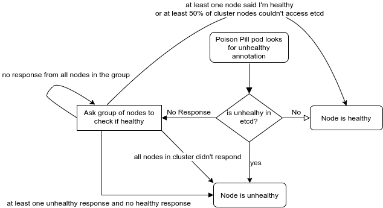

# Baremetal Poison Pill Remediation

## Release Signoff Checklist

- [ ] Enhancement is `implementable`
- [ ] Design details are appropriately documented from clear requirements
- [ ] Test plan is defined
- [ ] Graduation criteria for dev preview, tech preview, GA
- [ ] User-facing documentation is created in [openshift-docs](https://github.com/openshift/openshift-docs/)

## Summary

Existing baremetal remediation strategies utilize BMC credentials to power-cycle and/or reprovision the host.
However there are also environments that either do not include BMCs, or there are policies in place that prevent
them from being utilized. Such environments would also benefit from the ability to safely recover affected workloads
and restore cluster capacity (where possible).

This proposal describes an alternate mechanism for a node in a cluster
to detect its health status and take actions to remediate itself in case of a failure. While not all remediation events
can result in the node returning to a healthy state, the proposal does allow surviving parts of the cluster to assume
the node has reached a safe state so that its workloads can be automatically recovered.

This work can also be useful for clusters **with** BMC credentials.
If there’s a network outage between the node running CAPBM (which expects to use BMC commands like power-off etc.) and the
unhealthy node, the power-cycle attempt cannot
succeed. Self health checks and remediation can resolve such cases, however that work/scenario is out of scope for
this proposal.

## Motivation

Some clusters don’t have BMC credentials and we still want to have auto remediation for failing nodes.
This proposal allows:
1. To allow stateful workload running on the unhealthy nodes to be rescheduled after finite time on other healthy nodes.
1. To restore compute capacity by remediating the unhealthy node

### Goals

* To allow remediation of bare metal nodes without BMC credentials
* To utilize the MHC logic for deciding if a node is unhealthy and whether remediation is appropriate
* To allow the healthy majority to recover workloads after a pre-determined and finite interval
* To allow a node to take actions to remediate itself in case of a failure
* To allow a node to detect its health status when master<->node communication is partially failed
* To avoid false positives caused by failure of the control plane

### Non-Goals

* Self healing in combination with existing reprovisioning or reboot based remediation mechanisms in the Machine Health Check controller
* Recovering from all types of failure
* Having a distributed mesh of health checks where each node is checking health for its peers
* Creation of fake Machine objects for UPI clusters

## Proposal

Utilizing a DaemonSet to have a privileged critical pod running on each node. This pod will periodically check the
health status of the node it’s running on, and tickle a [watchdog device](https://en.wikipedia.org/wiki/Watchdog_timer).

This will be performed by looking for the `host.metal3.io/external-remediation` annotation added by MHC to the unhealthy
Machine CR.

If the unhealthy annotation was found, the node will remediate itself by using the watchdog device to
trigger a reset of the node. Watchdog devices, especially the hardware kind, are considered more reliable and predictable than the
reboot command.

If Machine CR is not accessible in 3 consecutive attempts, it needs external assistance to detect its
health status.

Failure to read Machine CR could stem from one of the following:
1. The node is unhealthy and therefore can’t read the Machine CR (e.g. local network failure)
1. There’s an etcd failure
1. Connectivity issues between the node and the control plane nodes (which doesn’t stem from local problem in the node)
1. Resource starvation, preventing our DaemonSet from initiating the check 
1. Authentication failure to API (ServiceAccount deleted?)
1. RBAC disallows read operation on Machine (Role deleted or changed

We only want to remediate if the problem is local (#1 and #4). Otherwise, we could create a "remediation storm" where
all nodes are trying to remediate themselves, even if the problem is not theirs.

The semantics of the watchdog device automatically handle #4 and to distinguish between the remaining three situations,
the node will ask its peers whether they think it is healthy.

The possible responses from a peer are:
1. You're unhealthy (the annotation exists)
1. You're healthy (the annotation does not exist)
1. The peer also cannot contact the api-server
1. No response (timeout or any TCP/HTTP error)

To avoid saturating the network, the node will pick *min(cluster_size/10, cluster_size-1)* random nodes, and ask these
nodes if they think it’s healthy using HTTP.
Each pod will listen on a specific node-port, and will run an HTTP web server that will be able to tell other peers if
the machine is healthy or not.
If two or more peers responded with a different result, we take an optimistic approach - one result of
*"you’re healthy"* is enough to determine that the node is healthy.
If all randomized peers returned *"you’re unhealthy"* - the node considers itself unhealthy.
If all randomized peers returned an error (#3 or #4), another set of random nodes will be used to determine health
status.
The node considers itself healthy if more than 50% of the nodes responded with #3.
The node considers itself unhealthy if we do not receive any peer responses.
The above algorithm to determine health state of a node is demonstrated in the following flow chart:

The state required to run this algorithm will be stored in-memory, including nodes addresses, retries count and so on.

Remediation will be done by using a watchdog device to trigger a reset of the node.

In the absence of a watchdog device, including softdog, a software reboot will be issued.

While reboot might not fix the health issue of the node, it will allow the cluster to assume that the workload on the failing node is no longer running, such that stateful applications scheduled on that node can be rescheduled to other healthy nodes.

Steps taken by the poison pill pod (on all nodes in the cluster) for any unhealthy node:
1. Mark the node as unschedulable (this prevents the node to run new workload after reboot)
1. Add current time to annotation
1. Unhealthy node reboot itself
1. After *timeout-to-assume-node-rebooted* (either configurable or calculated by software) - delete the unhealthy node (to signal the cluster that the workload is no longer running there, and it is safe to run it elsewhere)
1. Recreate the node object, without the unschedulable taint

The first step of marking the node as unschedulable is important, as the reboot might fix the health issue, and the scheduler could assign workload to that node after the it rebooted, which could result in other nodes deleteing the rebooted node while it is running some workload. To avoid that, the others will delete it and report it as unhealthy only after marking it as unschedulable which ensures it will not get any workloads after reboot.

### User Stories [optional]

#### Story 1
As a non-BMC baremetal cluster admin, I would like to have automated self-healing nodes. This will make my cluster more robust and immune to failures

#### Story 2
As a non-BMC baremetal cluster admin, I would like to minimze downtime for my applications, even if there's a node failure.

### Implementation Details/Notes/Constraints [optional]

This enhancement relies on the existence of MHC, which is currently working only in IPI and assisted insaller.
We might want to enable MHC for UPI clusters as well, maybe by faking Machine CRs for the nodes.

### Risks and Mitigations

If the unhealthy node doesn't reboot in time, then there's a risk that a node will be deleted while the workload is still running.
To mitigate this we prefer a hardware watchdog which ensures that reboot will take place if the poison pill is not running.

There could be cases where this algorithm will declare a node as unhealthy while it’s healthy (false negative)
For example, if someone made some network configuration mistake which blocks communication between the nodes - all nodes will consider themselves unhealthy and remediation will be triggered.
In this case, the cluster is mostly in an unusable state anyway, so no significant harm is made.

## Design Details

### Upgrade / Downgrade Strategy

N/A. This is a new component.

### Version Skew Strategy

Downgrade from a version with poison pill to a version without it during remediation process can result in a node that doesn't exist in api-server.
As part of the remediation process, the poison pill agents keep a backup for the node yaml.
They are expected to use that backup after the node has been deleted, to re-create the node.
If a downgrade happens during that process, there will be no poison pill agents to re-create the node.

In addition, a node might consult with its peers for its health status. If they are downgraded to a version without poison piil,
they won't respond, and we might get false positive.

## Drawbacks

TBD

## Alternatives

Instead of contacting other peers, we could use a shared storage to signal the health status for a peer.

## Infrastructure Needed [optional]

A new repo might be needed to host the new poison pill codebase.
