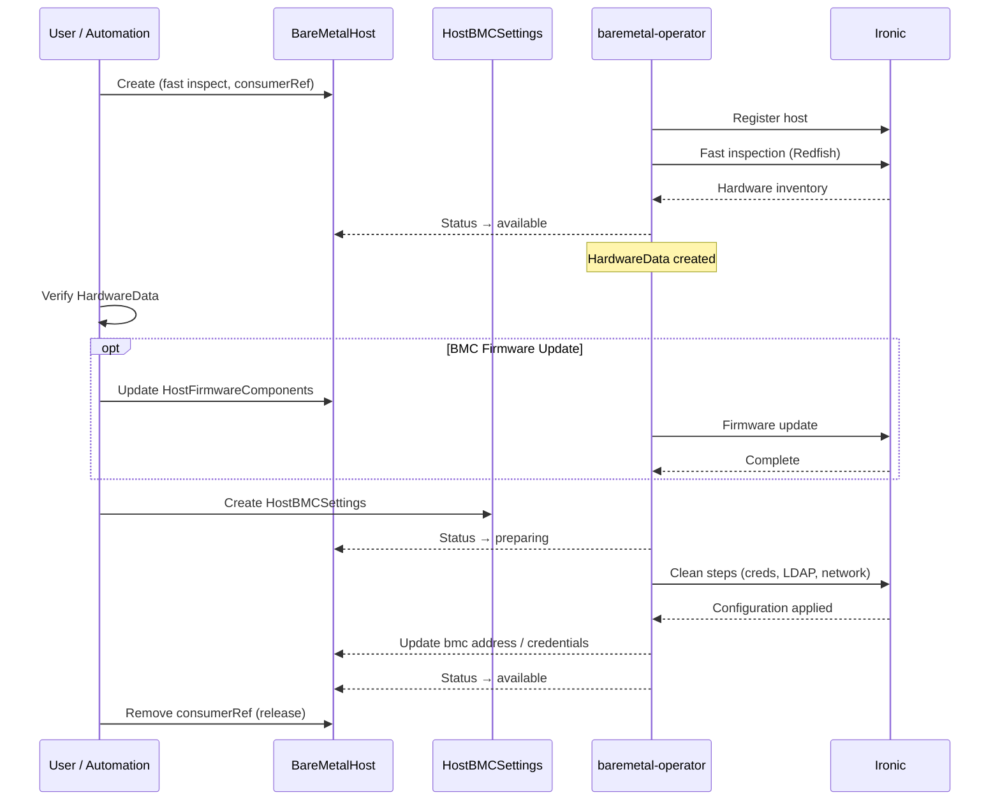

# BMC Enrollment and Configuration

## Summary

This enhancement introduces a declarative workflow for
enrolling and configuring bare metal host BMCs through the
Metal3 API. A new `HostBMCSettings` custom resource allows
administrators and automation systems to manage BMC
credentials, LDAP authentication, and BMC network
configuration as part of an end-to-end host onboarding
process. The workflow builds on existing `BareMetalHost`,
`HardwareData`, and `HostFirmwareComponents` APIs and
extends `HostUpdatePolicy` to support day-2 BMC
configuration changes. The feature is gated behind the
`MetalEnrollmentAPI` feature gate.

## Glossary

| Term | Meaning |
|------|---------|
| **BMC** | Baseboard Management Controller — an embedded processor on the server motherboard (e.g., Dell iDRAC, HPE iLO) that provides out-of-band management: power control, console access, sensor monitoring, and firmware updates. Accessed over a dedicated or shared network interface via Redfish. |
| **Redfish** | A DMTF standard REST API for server hardware management, replacing older IPMI. All modern BMCs expose a Redfish endpoint. |
| **Metal3** | The upstream project that provides Kubernetes-native bare metal host management. Defines the CRDs listed below. |
| **BMO** | baremetal-operator — the controller that reconciles `BareMetalHost` and related CRDs, delegating hardware operations to Ironic. |
| **Ironic** | An OpenStack service used by Metal3 to manage bare metal host lifecycle (registration, inspection, provisioning) via BMC protocols. Runs inside the `metal3` pod alongside BMO. |
| **CBO** | cluster-baremetal-operator — the OCP operator that deploys and manages BMO, Ironic, and related infrastructure via the `Provisioning` CR. |
| **BareMetalHost (BMH)** | CRD representing a physical server. Tracks BMC address, credentials, power state, and provisioning state. The primary resource users interact with. |
| **HardwareData** | Read-only CRD populated by BMO after inspection. Contains hardware inventory (CPU, RAM, NICs, disks, system vendor). One per BMH, matched by name. |
| **HostFirmwareComponents** | CRD for requesting firmware updates (BMC, BIOS, NIC). Users set `spec.updates`; BMO/Ironic apply them. One per BMH. |
| **HostFirmwareSettings** | CRD for managing BIOS/UEFI settings (key-value pairs). Separate from BMC settings. One per BMH. |
| **HostUpdatePolicy** | CRD that controls *when* firmware and (with this enhancement) BMC configuration changes take effect — immediately during the preparing phase or deferred to the next servicing cycle. One per BMH. |
| **Clean steps** | Ironic's mechanism for executing out-of-band management operations on a host (e.g., credential rotation, LDAP setup, network reconfiguration). Executed during the BMH `preparing` state. |

## Motivation

Telecom, edge, and large-scale bare metal deployments
require enrolling hundreds or thousands of hosts with
predictable, auditable BMC configuration. Today,
administrators must configure BMC credentials, LDAP, and
networking out of band using vendor-specific tooling or
manual processes. This is error-prone, difficult to audit,
and does not scale.

The Metal3 API already supports registering, inspecting,
and provisioning bare metal hosts. However, the gap between
receiving a host from a vendor and making it available for
provisioning — including credential rotation, identity
verification, firmware updates, and network reconfiguration
— is not covered by existing APIs.

This enhancement fills that gap by defining a standard
enrollment workflow and a new API for declarative BMC
configuration, enabling fully automated host onboarding
through the Kubernetes API.

### User Stories

- As an infrastructure administrator, I want to enroll
  newly delivered bare metal hosts and verify their
  hardware identity (manufacturer, model, serial number)
  before making them available for provisioning, so that
  I can detect misdelivered or misconfigured hardware
  early.

- As an infrastrucutre administrator, I want to automate the full
  host onboarding process — from initial enrollment
  through credential rotation, LDAP setup, and network
  configuration — so that I can bring up sites without
  manual intervention.

- As a security engineer, I want to rotate BMC credentials
  and configure LDAP authentication on all hosts in a
  namespace declaratively, so that I can enforce
  organizational security policies at scale.

- As a site reliability engineer, I want to detect BMC
  configuration drift and remediate it through the
  standard Kubernetes API, so that I can monitor and
  maintain consistent BMC state across my fleet.

### Goals

1. Provide a declarative API (`HostBMCSettings`) for BMC
   configuration including credentials, LDAP, and
   networking.

2. Enable host identity verification through the existing
   `HardwareData` API before hosts are first booted.

3. Support day-2 BMC configuration changes governed by an
   extension to the existing `HostUpdatePolicy` API.

### Non-Goals

1. BIOS or system firmware settings — these are already
   managed by the existing `HostFirmwareSettings` API.

2. OS image provisioning — this enhancement covers only
   pre-provisioning BMC configuration.

3. Vendor-specific BMC extensions beyond standard Redfish
   capabilities.

## Proposal

This enhancement proposes:

1. **A standard enrollment workflow** using existing
   `BareMetalHost` fields to enroll, inspect, and verify
   hosts before they are released for provisioning.

2. **A new `HostBMCSettings` CRD** that declares the
   desired BMC configuration for a host, including
   credentials, LDAP, and networking.

3. **An extension to `HostUpdatePolicy`** to control when
   day-2 BMC configuration changes take effect.

4. **An OpenShift feature gate** (`MetalEnrollmentAPI`)
   to control availability of the new functionality.

The enrollment workflow uses the `BareMetalHost`'s existing
fast inspection mode to gather hardware inventory without
booting a ramdisk, the `HardwareData` resource for identity
verification, and the `HostFirmwareComponents` resource for
firmware updates. The new `HostBMCSettings` resource
triggers BMC configuration through Ironic clean steps,
which update BMC credentials, LDAP, and networking in a
coordinated manner.

### Workflow Description

The workflow involves two actors:

**User** — any entity accessing the Metal3 API, such as an
administrator, an O-Cloud manager, or automation software.

**baremetal-operator (BMO)** — the controller that
reconciles `BareMetalHost` and related resources,
delegating hardware operations to Ironic.

The workflow assumes:

- The BMC supports Redfish.
- The BMC manages exactly one system (no multi-system
  chassis support required at this time).
- Default BMC credentials are known (from vendor or
  purchase documentation).

> **Note:** The API shapes described below are
> illustrative. The exact field names, types, and structure
> are subject to upstream review in the Metal3 community
> and may change during implementation.

#### Step 1: LDAP Preparation (Optional)

If LDAP authentication is desired, the administrator
creates a Secret containing the LDAP configuration in
the target namespace:

```yaml
apiVersion: v1
kind: Secret
metadata:
  name: ldap-config
  namespace: infra
  labels:
    environment.metal3.io: "baremetal"
stringData:
  # Top-level key: "ldap" or "activeDirectory"
  ldap: |
    Authentication:
      AuthenticationType: UsernameAndPassword
      Username: "cn=admin,dc=example,dc=com"
      Password: "secret"
    ServiceAddresses:
      - ldap://ldap.example.com
    SearchSettings:
      BaseDistinguishedNames: "dc=example,dc=com"
    RemoteRoleMapping:
      - RemoteGroup: admins
        LocalRole: Administrator
```

If TLS is used for LDAP, a ConfigMap with CA certificate(s)
is also created in the same namespace.

LDAP configuration is scoped per namespace. BMO does not
validate the LDAP schema — validation is performed on the
Ironic side against the DMTF Redfish specification.

#### Step 2: Initial Enrollment

The user creates a `BareMetalHost` with the following
configuration:

```yaml
apiVersion: metal3.io/v1alpha1
kind: BareMetalHost
metadata:
  name: host-0
  namespace: infra
spec:
  online: false
  bmc:
    # No system ID in path — relies on auto-detection.
    # Requires the BMC to manage exactly one system.
    address: redfish-virtualmedia://192.168.2.13
    credentialsName: host-0-default-credentials
    disableCertificateVerification: true
  automatedCleaningMode: disabled
  inspectionMode: fast
  consumerRef:
    apiVersion: ocloud.openshift.io/v1alpha1
    kind: DiscoveryRequest
    name: discover-abcd
```

Key fields:

- **`inspectionMode: fast`** — performs out-of-band
  inspection via the BMC (Redfish) without booting a
  ramdisk. This is faster and does not require network
  boot infrastructure.

- **`automatedCleaningMode: disabled`** — prevents
  automated disk wiping, preserving any existing data.

- **`consumerRef`** — marks the host as "in use" to
  prevent the Machine API or other consumers from
  claiming it during enrollment. The reference can point
  to a real discovery object or a placeholder.

- **`bmc.address`** — uses no system ID path, relying on
  auto-detection. This requires the BMC to manage exactly
  one system.

The host progresses through `registering` → `inspecting`
→ `available`.

#### Step 3: Identity Verification

Once the host reaches the `available` state, BMO populates
the corresponding `HardwareData` resource with hardware
inventory gathered during fast inspection. The user reads
this resource to verify the host's identity:

```yaml
apiVersion: metal3.io/v1alpha1
kind: HardwareData
metadata:
  name: host-0
  namespace: infra
spec:
  hardware:
    systemVendor:
      manufacturer: Dell Inc.
      productName: PowerEdge XR8620t
      serialNumber: CNWS300887005B
    cpu:
      arch: x86_64
      count: 32
    ramMebibytes: 131072
```

The user checks `manufacturer`, `productName`, and
optionally `serialNumber` against expected values.
`HostFirmwareComponents` can also be checked to verify
current firmware versions.

#### Step 4: BMC Firmware Update (Optional)

Before configuring the BMC, the user may update BMC
firmware to ensure subsequent configuration steps run
against a predictable target. This uses the existing
`HostFirmwareComponents` API:

```yaml
apiVersion: metal3.io/v1alpha1
kind: HostFirmwareComponents
metadata:
  name: host-0
  namespace: infra
spec:
  updates:
    - component: bmc
      url: https://firmware.example.com/bmc-v7.11.iso
```

#### Step 5: BMC Configuration

The user creates a `HostBMCSettings` resource to configure
the BMC. The exact API shape is subject to upstream review
in the Metal3 community.

```yaml
apiVersion: metal3.io/v1alpha1
kind: HostBMCSettings
metadata:
  name: host-0
  namespace: infra
spec:
  access:
    credentialsName: new-bmc-credentials
    disableOtherUsers: true
    ldap:
      enabled: true
      configName: ldap-config
      caCertificateName: ldap-ca
  networking:
    saveCurrentAsStatic: true
    staticAddresses:
      - ipClaimName: host-0-ipv4
      - ipClaimName: host-0-ipv6
        useByDefault: true
    nameServers:
      - 8.8.8.8
```

BMO puts the host into the `preparing` state and instructs
Ironic to execute clean steps that:

1. Update LDAP settings and BMC credentials in lockstep —
   Ironic changes both the BMC configuration and its own
   stored credentials atomically.

2. Update network settings — Ironic changes the BMC
   network configuration and its own stored Redfish
   address in lockstep.

On success, the host returns to the `available` state. BMO
updates the `BareMetalHost`'s `spec.bmc.credentialsName`
and `spec.bmc.address` to reflect the new configuration.
The `HostBMCSettings` status condition `ChangeDetected`
is set to `false`.

#### Step 6: Release

The user removes `consumerRef` from the `BareMetalHost`
to make it available for provisioning. The host can then
be consumed by the Machine API, Cluster API, or other
automation.



#### Day-2 BMC Configuration Changes

After initial enrollment, changes to `HostBMCSettings`
require explicit opt-in through `HostUpdatePolicy`.
The proposed extension to `HostUpdatePolicy` shown below
is subject to upstream review in the Metal3 community.

```yaml
apiVersion: metal3.io/v1alpha1
kind: HostUpdatePolicy
metadata:
  name: host-0
  namespace: infra
spec:
  firmwareSettings: onPreparing
  firmwareUpdates: onPreparing
  bmcSettings:
    access: onReboot
    networking: onReboot
```

The new `bmcSettings` field controls when BMC configuration
changes take effect. The `onReboot` policy means changes
are applied during the next host servicing cycle rather
than immediately.

For day-2 BMC changes that do not require a full host
reboot, an annotation triggers a servicing operation:

```shell
oc annotate bmh -n infra host-0 service.baremetal.openshift.io=""
```

This annotation-based mechanism is a stopgap. It will be
replaced by the upstream
[HostOperations API](https://github.com/metal3-io/metal3-docs/pull/709)
in a future release. The `onReboot` policy name will be
retained even if no actual reboot is involved.

### API Extensions

This enhancement introduces one new CRD and modifies one
existing CRD. Both belong to the `metal3.io/v1alpha1` API
group and will be implemented in BMO.

#### New: HostBMCSettings

A namespaced custom resource. One `HostBMCSettings`
resource corresponds to one `BareMetalHost` (matched by
name and namespace), following the same convention used by
`HardwareData`, `HostFirmwareComponents`, and
`HostFirmwareSettings`.

**Spec fields:**

- `access.credentialsName` (`string`) — reference to a
  Secret containing new BMC credentials.
- `access.disableOtherUsers` (`bool`) — disable BMC user
  accounts that do not match the new credentials.
- `access.ldap.enabled` (`bool`) — enable LDAP
  authentication on the BMC.
- `access.ldap.configName` (`string`) — reference to a
  Secret containing LDAP configuration.
- `access.ldap.caCertificateName` (`string`) — reference
  to a ConfigMap containing LDAP CA certificates.
- `networking.saveCurrentAsStatic` (`bool`) — persist the
  current BMC address as a static address.
- `networking.staticAddresses` (`list`) — static IP
  addresses via Metal3 `IPClaim` references.
- `networking.nameServers` (`list of string`) — static DNS
  server addresses.

**Status conditions** (following the Metal3 convention):

- `ChangeDetected` — spec differs from applied state.
- `Valid` — configuration is valid and can be applied.

#### Modified: HostUpdatePolicy

A new `bmcSettings` field is added to
`HostUpdatePolicySpec`:

```go
type HostUpdatePolicySpec struct {
    FirmwareSettings UpdatePolicy     `json:"firmwareSettings,omitempty"`
    FirmwareUpdates  UpdatePolicy     `json:"firmwareUpdates,omitempty"`
    BMCSettings      *BMCUpdatePolicy `json:"bmcSettings,omitempty"`
}

type BMCUpdatePolicy struct {
    Access     UpdatePolicy `json:"access,omitempty"`
    Networking UpdatePolicy `json:"networking,omitempty"`
}
```

Both fields accept the existing `UpdatePolicy` values:
`onPreparing` and `onReboot`.

#### Secret Convention for LDAP

LDAP configuration is stored in a Secret with a single
key — either `ldap` or `activeDirectory` — whose value is
Redfish-format LDAP configuration encoded as YAML. No
schema validation is performed by BMO; the configuration
is forwarded to Ironic, which validates it against the DMTF
Redfish specification.

### Topology Considerations

#### Hypershift / Hosted Control Planes

In HyperShift deployments, baremetal-operator runs in the
management cluster and manages hosts that form the data
plane of guest clusters. The enrollment workflow applies
to the management cluster, where `HostBMCSettings` and
related resources are created.

This enhancement does not add components to the guest
cluster and does not require cross-cluster communication
beyond what BMO already uses. There is no meaningful impact
on the management cluster's resource consumption beyond the
new CRD storage (negligible for typical fleet sizes).

#### Standalone Clusters

This is the primary target topology. The enrollment
workflow runs on the hub or management cluster where BMO
is deployed. All new resources are namespaced and created
alongside `BareMetalHost` resources.

#### Single-node Deployments or MicroShift

**SNO**: The enrollment workflow is applicable to SNO
clusters that use BMO for host management (e.g., a
single-node hub managing remote bare metal hosts). No
additional resource overhead beyond the new CRD
controller, which is part of the existing BMO deployment.

**MicroShift**: Not applicable. MicroShift does not include
the Metal3 stack (BMO, Ironic, CBO).

#### OpenShift Kubernetes Engine

Not applicable. OKE does not include the Metal3 bare metal
management components. This feature depends on
cluster-baremetal-operator and baremetal-operator, which
are part of OCP only.

### Implementation Details/Notes/Constraints

#### Feature Gate

A new feature gate `MetalEnrollmentAPI` must be added to
[openshift/api features/features.go](https://github.com/openshift/api/blob/master/features/features.go).
The gate should initially be placed in the
`TechPreviewNoUpgrade` feature set.

A corresponding feature gate will be added to BMO to cover the new
`HostBMCSettings` API.

#### cluster-baremetal-operator (CBO)

CBO reads the `MetalEnrollmentAPI` feature gate from the
`FeatureGate` CR (`featuregates.config.openshift.io/v1`)
and propagates it to BMO. BMO already supports a
`--feature-gates` flag and `FEATURE_GATES` environment
variable (see
`baremetal-operator/pkg/features/features.go`);
CBO sets this when constructing the BMO container
specification in `provisioning/bmo_pod.go`.

When the feature gate is disabled, BMO does not register
the `HostBMCSettings` controller or webhook, and the CRD
has no effect.

#### baremetal-operator (BMO)

BMO implements a new controller that watches
`HostBMCSettings` resources. When a `HostBMCSettings` is
created or modified, the controller:

1. Validates that referenced Secrets and ConfigMaps exist
   and contain expected keys.
2. Puts the corresponding `BareMetalHost` into the
   `preparing` state.
3. Constructs Ironic clean steps for the requested
   changes.
4. Updates the `BareMetalHost`'s `spec.bmc` fields upon
   successful completion.

#### Ironic

The BMC configuration clean steps are implemented in
Ironic. The upstream design is described in the
[Ironic BMC enrollment specification][ironic-spec].

[ironic-spec]: https://review.opendev.org/c/openstack/ironic-specs/+/1006205

At a high level, Ironic handles:

- Credential updates: changes BMC credentials and its own
  stored credentials atomically.
- LDAP configuration: applies settings via Redfish
  `AccountService` endpoints.
- Network changes: updates BMC network settings and its
  own stored address in lockstep.

Further Ironic implementation details are out of scope for
this enhancement. Refer to the Ironic specification for
protocol-level behavior.

### Risks and Mitigations

**Risk: BMC network misconfiguration makes hosts
unreachable.**

Mitigation: Ironic enforces that at least one configured
static address matches the currently active address before
applying network changes. This prevents accidental loss of
BMC connectivity.

**Risk: Credential update fails mid-way, leaving BMC and
Ironic out of sync.**

Mitigation: Ironic's clean step design updates its own
stored credentials in lockstep with the BMC. If the BMC
update fails, Ironic retains the previous credentials. The
`BareMetalHost` enters an error state with a descriptive
message.

**Risk: LDAP misconfiguration locks out all BMC users.**

Mitigation: The API design allows updating the credentials in
Ironic in lockstep with LDAP configuration. The normal BMC
credentials update feature can be used if these are incorrect.

### Drawbacks

- The `HostBMCSettings` API adds a new resource to the
  Metal3 API surface. This must be maintained upstream and
  may add complexity for users who do not need BMC
  enrollment automation.

- The workflow relies on Ironic clean steps for BMC
  configuration, creating a tight coupling between BMO and
  specific Ironic capabilities. If a BMC vendor does not
  fully implement the required Redfish endpoints, the
  workflow may partially fail.

- Day-2 changes currently rely on an annotation-based
  mechanism rather than a proper API, which adds technical
  debt to be addressed in a future release.

## Alternatives (Not Implemented)

**Direct Redfish access from a dedicated operator.**
An alternative would be to build BMC configuration directly
into a new operator that uses Redfish, bypassing Ironic.
This was rejected because it would duplicate Ironic's BMC
management capabilities and create two competing control
paths for BMC state.

**Cluster-wide LDAP configuration.**
An early iteration of this design included a cluster-scoped
LDAP configuration resource. This was dropped because
namespace-scoped LDAP secrets reduce the blast radius of
credential exposure and simplify RBAC. Cluster-wide LDAP
can be approximated by creating the same Secret in each
namespace.

**Inline BMC configuration in BareMetalHostSpec.**
Adding BMC configuration fields directly to the
`BareMetalHost` spec was considered but rejected to avoid
growing an already large API surface and to allow
independent lifecycle management of BMC configuration.

## Open Questions [optional]

1. Should the assisted-service (BMAC) be updated to
   recognize hosts with `consumerRef` pointing to
   non-Machine objects and skip them during host matching?

2. What is the fallback if a BMC vendor's Redfish
   implementation does not support `StaticNameServers` or
   `DHCPv4` configuration via standard endpoints? Some
   vendors (notably Dell iDRAC) may require OEM extensions
   for certain DNS settings.

3. Should `HostBMCSettings` support a `hostname` field for
   setting the BMC hostname, given that both Dell and HPE
   expose `HostName` in their Redfish interfaces?

## Test Plan

<!-- TODO: Tests must include the following labels per
dev-guide/feature-zero-to-hero.md:
- [OCPFeatureGate:MetalEnrollmentAPI]
- [Jira:"Bare Metal Hardware Provisioning"]
- Appropriate test type labels ([Serial], [Slow], etc.)
See dev-guide/test-conventions.md for details. -->

**Unit tests:**

- `HostBMCSettings` controller reconciliation logic.
- `HostBMCSettings` webhook validation.
- `HostUpdatePolicy` extension validation (new
  `bmcSettings` field).
- Feature gate propagation from CBO to BMO.

**Integration tests:**

- End-to-end enrollment workflow: create BMH with fast
  inspection → verify HardwareData → create
  HostBMCSettings → verify BMC configuration applied →
  remove consumerRef.
- Day-2 credential rotation via HostBMCSettings update
  with HostUpdatePolicy.
- Error handling: invalid credentials, unreachable BMC,
  LDAP misconfiguration.

**E2E tests in CI:**

- Running tests in the CI requires updating the Redfish emulator
  with emulated actions. It's possible to emulate credentials update
  and provide no-op implementations for LDAP and network settings.

## Graduation Criteria

<!-- TODO: Per dev-guide/feature-zero-to-hero.md, promotion
to Default requires:
- At least 5 tests
- All tests run at least 7 times per week
- All tests run at least 14 times per supported platform
- All above in place 14 days before branch cut
- 95% pass rate
- Tests run on all supported platforms
Note: this feature is baremetal-specific, so platform
coverage requirements will need an exception for
non-baremetal platforms. -->

### Dev Preview -> Tech Preview

- `HostBMCSettings` CRD available when
  `MetalEnrollmentAPI` feature gate is enabled.
- All features confirmed working in manual testing on target
  machines (Dell and HPE hardware).
- Sufficient test coverage and initial feedback gathered.

### Tech Preview -> GA

- Day-2 changes via `HostUpdatePolicy` verified.
- E2E tests passing on both Dell and HPE hardware.
- `HostBMCSettings` API stable (no breaking changes
  anticipated).
- User-facing documentation created in
  [openshift-docs](https://github.com/openshift/openshift-docs/).

### Removing a deprecated feature

Not applicable for initial release.

## Upgrade / Downgrade Strategy

**Upgrade:** The `MetalEnrollmentAPI` feature gate controls
availability. On upgrade to a version that includes this
feature, the CRD is deployed but the controller is inactive
unless the feature gate is enabled. Existing
`BareMetalHost` resources are unaffected.

**Downgrade:** If the cluster is downgraded to a version
that does not include this feature, `HostBMCSettings`
resources become orphaned CRs with no controller. They have
no effect on host operation. Administrators should delete
these resources before or after downgrade. The
`BareMetalHost`'s `spec.bmc` fields retain whatever values
were last applied and continue to work.

The `HostUpdatePolicy` extension (new `bmcSettings` field)
is additive and backward-compatible. Older versions of BMO
ignore the unknown field.

## Version Skew Strategy

BMO and Ironic are deployed together by CBO and are
upgraded atomically. There is no version skew between BMO
and Ironic during normal operation.

During an upgrade, CBO upgrades both the BMO and Ironic
deployments. If a `HostBMCSettings` reconciliation is in
progress during the upgrade, the host remains in the
`preparing` state until the new BMO version resumes
reconciliation. No data loss occurs.

The `HostBMCSettings` CRD is managed by CBO. If CBO is
upgraded but BMO is temporarily running an older version
(during rolling update), the older BMO ignores the
`HostBMCSettings` resources until it is updated.

## Operational Aspects of API Extensions

**CRD impact:** `HostBMCSettings` is a namespaced resource.
Expected usage is one per `BareMetalHost`, so instance
counts mirror the number of managed hosts. For a large
deployment of 1000 hosts, this adds 1000 CRs — well within
API server capacity.

**Controller impact:** The `HostBMCSettings` controller
runs within the existing BMO deployment. It does not add
a new pod or increase replica count. Memory overhead is
proportional to the number of watched `HostBMCSettings`
resources (estimated <50MB for 1000 hosts).

**Failure modes:**

- If the `HostBMCSettings` controller is unavailable (BMO
  pod crash), new and updated `HostBMCSettings` are not
  reconciled. Hosts remain in their current state. The
  controller resumes processing on restart.

- If Ironic is unavailable, BMC configuration clean steps
  cannot execute. The `BareMetalHost` remains in the
  `preparing` state and the controller retries with
  exponential backoff.

- If BMC credentials in the referenced Secret are
  incorrect, the clean step fails and the `BareMetalHost`
  enters an error state with
  `errorType: preparation error`.

**SLIs:**

- ClusterOperator `baremetal`: condition `Available=True`.
- `HostBMCSettings` condition `ChangeDetected` indicates
  pending changes.
- `HostBMCSettings` condition `Valid` indicates
  configuration validity.

**Teams likely involved in escalation:**

- Metal Platform team (BMO/CBO owners)
- Metal3 upstream (Ironic integration)

## Support Procedures

**Detecting failures:**

- Check `BareMetalHost` status: hosts stuck in `preparing`
  state or with `errorType: preparation error` indicate
  BMC configuration failures.
- Check `HostBMCSettings` conditions: `Valid=False`
  indicates invalid configuration; `ChangeDetected=True`
  indicates unapplied changes.
- BMO logs: filter for `HostBMCSettings` reconciler
  messages.
- Ironic logs: filter for clean step execution errors.

**Disabling the feature:**

Disable the `MetalEnrollmentAPI` feature gate. This
prevents the `HostBMCSettings` controller from processing
new or updated resources. Existing hosts retain their
current BMC configuration.

Note: disabling the feature gate does not roll back
already-applied BMC configuration. Credentials, LDAP, and
network settings that were successfully applied remain in
effect on the BMC hardware.

**Collecting diagnostic data:**

```shell
oc get baremetalhost -n <namespace> -o yaml
oc get hostbmcsettings -n <namespace> -o yaml
oc get hostupdatepolicy -n <namespace> -o yaml
oc logs -n openshift-machine-api \
  deployment/metal3-baremetal-operator
```

The Metal3 `must-gather` image collects all relevant
resources and logs.

## Infrastructure Needed [optional]

<!-- TODO: This section needs to be filled in with
specific CI lab requirements. -->

E2E testing requires bare metal CI environments with real
BMC hardware supporting Redfish. At minimum, Dell and HPE
hardware should be available for testing the enrollment
workflow. Existing bare metal CI labs may be sufficient if
they support BMC credential management and LDAP
configuration.
