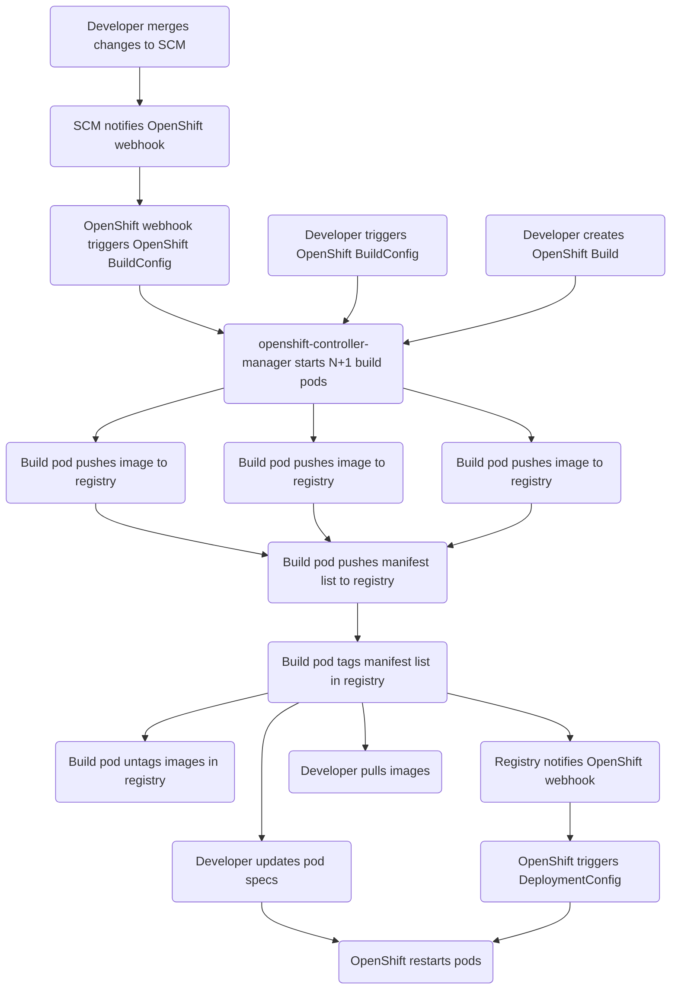

# Multi-architecture (heterogeneous) Builds

## Release Signoff Checklist

- [ ] Enhancement is `implementable`
- [ ] Design details are appropriately documented from clear requirements
- [ ] Test plan is defined
- [ ] Operational readiness criteria is defined
- [ ] Graduation criteria for tech preview and GA
- [ ] User-facing documentation is created in [openshift-docs](https://github.com/openshift/openshift-docs/)

## Summary

OpenShift 4.x's build controller currently creates one build pod for each Build
API object. The pod builds the image for the architecture of the node on which
it runs.

This proposal extends the build controller to use multiple pods to build images
for some or all of the architectures available in the cluster, and to build a
manifest list which catalogs those images.

## Motivation

* Customers expect to be able to build and run their own applications on their nodes, irrespective of whether or not a cluster has nodes of multiple architectures.

### User Stories

* As an enterprise customer, I want to be able to run my application workloads on ARM instead of — or in addition to — x86, so that I can spend less on compute resources.
* As an enterprise developer, I want to expend only minimal extra effort to make my application images available for both x86 and ARM architectures.
* As an enterprise developer, I want to expend only minimal extra effort to make it so that my application images are only built on specific architectures.
* As an administrator, I want to be able to add nodes of any architecture to my cluster with confidence that they will be fully utilized for running my applications, so that I can decide which architectures the nodes run based on my other requirements.

### Goals

* Provide users of Builds with a minimal — in cases where builds are based on images we provide, preferably zero — effort path to having their images ready to run on any node in their multi-architecture clusters.

### Non-Goals

* Building images for architectures for which the cluster has no running nodes.
* Building multi-arch images which depend on base images which are not multi-arch.

## Proposal

### openshift-controller-manager

Instead of creating one (1) pod to perform a build followed by an optional
push, create N+1 pods when building for N architectures.

The first N pods will build an ordinary image for their respective targets and,
if the build spec specifies an output location, push their images and update a
platform-specific build status field in the build resource.

The last pod will use functionality to be added to the openshift builder to
build a manifest list and push it to the output location.

### openshift-builder

The builder binary is currently invoked by multiple names to perform multiple
tasks in build pods.

We'll extend openshift-builder's `openshift-docker-build` and
`openshift-sti-build` commands to perform the build as they already do, with
two exceptions: if the build spec specifies a target platform, the build will
target that platform for the build, and the build status will be written to the
corresponding platform-specific status field in the Build object which owns the
build pod.

We'll extend openshift-builder by adding another command it can be invoked by
which will tell it to monitor the status of the other builder pods. If the
builder pods all complete successfully, and the build spec specifies an output
location, it will build and push a manifest list using the information gathered
from the build status information. As its final act, it will attempt to untag
the individual images from the registry.

Note: untagging should be friendlier to registries which perform garbage
collection, particularly for cases where the build fails on one or more
architectures, and as a result a manifest list is not pushed. It should also
reduce "noise" in the list of tags reported by registries which support listing
the tags in a repository.

### Workflow Description

#### Variation 1/3: SCM integrated
1. Application developer merges a PR to their repository's main branch.
1. The SCM platform notifies OpenShift via a webhook.
1. OpenShift has previously associated the webhook with triggering a BuildConfig.

#### Variation 2/3: not SCM integrated
1. Application developer manually triggers a BuildConfig.

#### Variation 3/3: not SCM integrated
1. Application developer creates a Build.

#### Common
1. The openshift-controller-manager starts N+1 build pods.
1. Platform-specific images are pushed to the registry.
1. The build completes, and a manifest list is pushed to the registry.
1. Platform-specific images are untagged from the registry.

#### Variation 1/3: no registry/DeploymentConfig integration
1. Application developer retrieves a pullable reference to the manifest list from the build status object and updates their pod specs.
1. Pods are restarted.

#### Variation 2/3: registry/DeploymentConfig integration
1. The registry notifies OpenShift of the newly pushed tag.
1. DeploymentConfigs which reference this tag in an ImageChangeTrigger cause the image to be re-pulled and pods to be restarted on affected nodes.

#### Variation 3/3: we're just here to build
1. Application developer retrieves a pullable reference to the manifest list from the build's status fields and pulls some subset of images from the registry from elsewhere.

### API Extensions

Build and BuildConfig objects (build.openshift.io/v1) will be extended to
include a target platform list. If set, the build controller will attempt the
build for the specified platforms. If the platform list is not set in the Build
or BuildConfig, the build controller should check for a list in its
OpenShiftControllerManagerConfig, encoded in the `config` configMap in the
`openshift-controller-manager` namespace. If that is also unset, the build
controller will attempt to build for all of the architectures it detects in the
cluster. The build controller will update the Build object to always include
the target platform list.

Build and BuildConfig objects (build.openshift.io/v1) will be extended to also
include a list of target platforms for which failures will not cause the build
to fail. A failed platform-specific build on any subset of the listed platforms
will not be considered a failure of the larger build attempt, but the manifest
list produced by the final build pod will not include images for platforms
whose builds failed.

BuildStatusOutput objects will be extended to include information which would
be needed in addition to the target platform when constructing an entry in a
manifest list which refers to the image described by the BuildStatusOutput.

Build object (build.openshift.io/v1) status fields will be extended to include
a list, keyed by target platform string, to a structure containing per-target
BuildStatus values.

### Implementation Details/Notes/Constraints [optional]

* Add a target platforms []string field to github.com/openshift/builder/vendor/github.com/openshift/api/build/v1.CommonSpec. If set, this field should be validated as having exactly either two or three non-empty fields separated by "/" characters, containing either a combination of OS/Architecture or OS/Architecture/Variant.
* Add a target-platforms-which-are-allowed-to-fail []string field to github.com/openshift/builder/vendor/github.com/openshift/api/build/v1.CommonSpec. The contents of this field should always be a subset of the contents of the target platforms list, if the target platforms list is set.
* Add a new annotation to supplement the "openshift.io/build.pod-name" annotation in the github.com/openshift/api/build/v1.Build which can be used to find all of the Build's pods.
* Extend BuildStatusOutput to a new struct (BuildStatusPlatformOutput?) which adds fields from github.com/opencontainers/image-spec/specs-go/v1.Platform and github.com/docker/distribution/manifest/manifestlist.PlatformSpec, deduplicated, for holding information that should be included in a manifest list.
* Extend BuildStatus to create a new type (BuildStatusPlatform?) which includes a platform specifier string, replacing its Output field with a BuildStatusPlatformOutput.
* Add a []BuildStatusPlatform field to github.com/openshift/api/build/v1.BuildStatus. The platform values in the structs will be used to index them when patching the structure.
* Ensure that github.com/openshift/client-go/build/clientset/versioned/typed/build/v1.builds.UpdateDetails() does not lose data if multiple client processes are calling it at roughly the same time.
* Teach openshift-builder to observe the target platforms list in the encoded Build structure it's given, to relay it down to the buildah library, and to update the appropriate BuildStatusPlatform and BuildStatusPlatformOutput values for the platform-specific it is performing. If the list is empty, it will instead build for the executing node's platform and update the overall build status.
* Implement the manifest bundling command for openshift-builder. Once all build pods have finished running, the BuildStatusPlatform slice's members' BuildStatusPlatformOutput will include references to the images which need to be in the produced manifest list, along with additional information which should be included to describe each entry in the manifest list.
* Ensure that the `openshift-controller-manager-images` configMap in the `openshift-controller-manager-operator` namespace references builder and deployer images using manifest lists and not architecture-specific images.
* Add an optional target platforms []string to github.com/openshift/api/openshiftcontrolplane/v1.BuildOverridesConfig.
* Add an optional "archNodeSelector" *bool to github.com/openshift/api/openshiftcontrolplane/v1.BuildOverridesConfig.
* Add an optional "manifestList" *bool to github.com/openshift/api/openshiftcontrolplane/v1.BuildOverridesConfig.
* Figure out where the platforms list for builds should come from if the configured BuildOverridesConfig doesn't have one.
* Teach openshift-controller-manager to launch, monitor, and when necessary cancel the N+1 pods, setting the target platform and output location differently in the encoded Build values it passes to the various platform-specific build pods, unless "manifestList" is explicitly disabled.
  * Build pods will gain a label which `oc logs` can use to select which of the build's pods it will read logs from.
  * If a node with the corresponding OS and architecture selector labels (e.g. "linux", "amd64") is not able to build for any requested variant (e.g. "", "v2", etc.), more refinement will be required.
  * Unless BuildOverridesConfig.archNodeSelector is explicitly disabled, each pod will have a "kubernetes.io/arch" value added to its "nodeSelector".
* Update `oc logs` updated Build and BuildConfig types. Update log viewing UX.
* Update `oc describe` for updated Build and BuildConfig types. Update build progress / status UX.
* Extend `oc new-app` to check the architectures of the images that the BuildConfig it's about to generate uses.

### Risks and Mitigations

* This proposal doesn't grant new privileges to any of the components involved, but it should still get a security review.
* Each pod will generate its own logs, so this will require updates to the UX to present them distinctly.
* Registries which don't allow untagging: ignore error results; we're only untagging to try to be nice.
* While we can dutifully mark a built image as e.g. linux/amd64 or linux/amd64/v2 when we're told to build one or the other, we're dependent on the build's Dockerfile and the commands it runs to actually produce binaries that are correct for the target platform variant.

### Drawbacks

* Limited to using architectures available on the cluster.
* Builds which use base images which are not available for all of the cluster's architectures will require manual configuration, either of the build controller to limit the target platforms for all builds, or of individual affected Builds or BuildConfigs to limit the target platforms for them.
* CI for multiple architectures adds failure points.
* CI for multiple architectures will necessarily cost more.
* CI for multiple architectures will necessarily take longer to complete.

## Design Details

### Open Questions [optional]

* If the openshift-controller-manager configuration doesn't include a list of target platforms, from where in the multi-arch cluster should that information be sourced?

### Test Plan

> **Note:** *Section not required until targeted at a release.*
>
> Consider the following in developing a test plan for this enhancement:
> - Will there be e2e and integration tests, in addition to unit tests?
> - How will it be tested in isolation vs with other components?
> - What additional testing is necessary to support managed OpenShift service-based offerings?
>
> No need to outline all of the test cases, just the general strategy. Anything
> that would count as tricky in the implementation and anything particularly
> challenging to test should be called out.
>
> All code is expected to have adequate tests (eventually with coverage
> expectations).

* A test pipeline should build and deploy a test image across nodes running on multiple architectures.

### Graduation Criteria

> **Note:** *Section not required until targeted at a release.*
>
> Define graduation milestones.
>
> These may be defined in terms of API maturity, or as something else. Initial proposal
> should keep this high-level with a focus on what signals will be looked at to
> determine graduation.
>
> Consider the following in developing the graduation criteria for this
> enhancement:
>
> - Maturity levels
>   - [`alpha`, `beta`, `stable` in upstream Kubernetes][maturity-levels]
>   - `Dev Preview`, `Tech Preview`, `GA` in OpenShift
> - [Deprecation policy][deprecation-policy]
>
> Clearly define what graduation means by either linking to the [API doc definition](https://kubernetes.io/docs/concepts/overview/kubernetes-api/#api-versioning),
> or by redefining what graduation means.
>
> In general, we try to use the same stages (alpha, beta, GA), regardless how the functionality is accessed.
>
> [maturity-levels]: https://git.k8s.io/community/contributors/devel/sig-architecture/api_changes.md#alpha-beta-and-stable-versions
> [deprecation-policy]: https://kubernetes.io/docs/reference/using-api/deprecation-policy/
>
> **If this is a user facing change requiring new or updated documentation in [openshift-docs](https://github.com/openshift/openshift-docs/),
> please be sure to include in the graduation criteria.**
>
> **Examples**: These are generalized examples to consider, in addition
> to the aforementioned [maturity levels][maturity-levels].

#### Dev Preview -> Tech Preview
>
> - Ability to utilize the enhancement end to end
> - End user documentation, relative API stability
> - Sufficient test coverage
> - Gather feedback from users rather than just developers
> - Enumerate service level indicators (SLIs), expose SLIs as metrics
> - Write symptoms-based alerts for the component(s)

#### Tech Preview -> GA
>
> - More testing (upgrade, downgrade, scale)
> - Sufficient time for feedback
> - Available by default
> - Backhaul SLI telemetry
> - Document SLOs for the component
> - Conduct load testing
> - User facing documentation created in [openshift-docs](https://github.com/openshift/openshift-docs/)
>
> **For non-optional features moving to GA, the graduation criteria must include
> end to end tests.**

#### Removing a deprecated feature

> - Announce deprecation and support policy of the existing feature
> - Deprecate the feature

### Upgrade / Downgrade Strategy

> If applicable, how will the component be upgraded and downgraded? Make sure this
> is in the test plan.
>
> Consider the following in developing an upgrade/downgrade strategy for this
> enhancement:
> - What changes (in invocations, configurations, API use, etc.) is an existing
>   cluster required to make on upgrade in order to keep previous behavior?
> - What changes (in invocations, configurations, API use, etc.) is an existing
>   cluster required to make on upgrade in order to make use of the enhancement?
>
> Upgrade expectations:
> - Each component should remain available for user requests and
>   workloads during upgrades. Ensure the components leverage best practices in handling [voluntary
>   disruption](https://kubernetes.io/docs/concepts/workloads/pods/disruptions/). Any exception to
>   this should be identified and discussed here.
> - Micro version upgrades - users should be able to skip forward versions within a
>   minor release stream without being required to pass through intermediate
>   versions - i.e. `x.y.N->x.y.N+2` should work without requiring `x.y.N->x.y.N+1`
>   as an intermediate step.
> - Minor version upgrades - you only need to support `x.N->x.N+1` upgrade
>   steps. So, for example, it is acceptable to require a user running 4.3 to
>   upgrade to 4.5 with a `4.3->4.4` step followed by a `4.4->4.5` step.
> - While an upgrade is in progress, new component versions should
>   continue to operate correctly in concert with older component
>   versions (aka "version skew"). For example, if a node is down, and
>   an operator is rolling out a daemonset, the old and new daemonset
>   pods must continue to work correctly even while the cluster remains
>   in this partially upgraded state for some time.
>
> Downgrade expectations:
> - If an `N->N+1` upgrade fails mid-way through, or if the `N+1` cluster is
>   misbehaving, it should be possible for the user to rollback to `N`. It is
>   acceptable to require some documented manual steps in order to fully restore
>   the downgraded cluster to its previous state. Examples of acceptable steps
>   include:
>   - Deleting any CVO-managed resources added by the new version. The
>     CVO does not currently delete resources that no longer exist in
>     the target version.

### Version Skew Strategy

* If an architecture-specific build is assigned to a node with an older version of the builder, the node will build the image for its local architecture, push the result to the output location, and store its own build status where the overall build status is intended to be stored.
  * The final build pod should be monitoring the status of pods that belong to the build object that owns the final build pod, and if they all succeeded but there are architecture-specific build status fields with no output values, it can deduce that this is what happened, and mark the overall build as having failed.
  * We could trigger this earlier by expecting `openshift-docker-builder` and `openshift-sti-builder` to start accepting the list of platforms to build for as CLI arguments.
* If the final build pod is assigned to a node with an older version of the builder, it will fail because the command the builder is invoked with will not be recognized.
* If the build controller which controls the build is older, the build will be assigned to a single node, which will build and push a single image, as happens now. The target architecture of the built image will match that of the node which runs the build pod.
* If the CRDs are not updated, the build controller's attempt to read or update the list of target platforms for the Build will fail before any build pods are created.

### Operational Aspects of API Extensions

> Describe the impact of API extensions (mentioned in the proposal section, i.e. CRDs,
> admission and conversion webhooks, aggregated API servers, finalizers) here in detail,
> especially how they impact the OCP system architecture and operational aspects.
>
> - For conversion/admission webhooks and aggregated apiservers: what are the SLIs (Service Level
>   Indicators) an administrator or support can use to determine the health of the API extensions
>
>   Examples (metrics, alerts, operator conditions)
>   - authentication-operator condition `APIServerDegraded=False`
>   - authentication-operator condition `APIServerAvailable=True`
>   - openshift-authentication/oauth-apiserver deployment and pods health
>
> - What impact do these API extensions have on existing SLIs (e.g. scalability, API throughput,
>   API availability)
>
>   Examples:
>   - Adds 1s to every pod update in the system, slowing down pod scheduling by 5s on average.
>   - Fails creation of ConfigMap in the system when the webhook is not available.
>   - Adds a dependency on the SDN service network for all resources, risking API availability in case
>     of SDN issues.
>   - Expected use-cases require less than 1000 instances of the CRD, not impacting
>     general API throughput.
>
> - How is the impact on existing SLIs to be measured and when (e.g. every release by QE, or
>   automatically in CI) and by whom (e.g. perf team; name the responsible person and let them review
>   this enhancement)

* Builds will interact with the API server more.
* Builds take longer. The time required for the image build to complete on the slowest builder, plus time waiting for the final pod to complete.

#### Failure Modes

> - Describe the possible failure modes of the API extensions.
> - Describe how a failure or behaviour of the extension will impact the overall cluster health
>   (e.g. which kube-controller-manager functionality will stop working), especially regarding
>   stability, availability, performance and security.
> - Describe which OCP teams are likely to be called upon in case of escalation with one of the failure modes
>   and add them as reviewers to this enhancement.

* If all builders for any one architecture become unavailable, all builds will ultimately fail.

#### Support Procedures

> Describe how to
> - detect the failure modes in a support situation, describe possible symptoms (events, metrics,
>   alerts, which log output in which component)
>
>   Examples:
>   - If the webhook is not running, kube-apiserver logs will show errors like "failed to call admission webhook xyz".
>   - Operator X will degrade with message "Failed to launch webhook server" and reason "WehhookServerFailed".
>   - The metric `webhook_admission_duration_seconds("openpolicyagent-admission", "mutating", "put", "false")`
>     will show >1s latency and alert `WebhookAdmissionLatencyHigh` will fire.
>
> - disable the API extension (e.g. remove MutatingWebhookConfiguration `xyz`, remove APIService `foo`)
>
>   - What consequences does it have on the cluster health?
>
>     Examples:
>     - Garbage collection in kube-controller-manager will stop working.
>     - Quota will be wrongly computed.
>     - Disabling/removing the CRD is not possible without removing the CR instances. Customer will lose data.
>       Disabling the conversion webhook will break garbage collection.
>
>   - What consequences does it have on existing, running workloads?
>
>     Examples:
>     - New namespaces won't get the finalizer "xyz" and hence might leak resource X
>       when deleted.
>     - SDN pod-to-pod routing will stop updating, potentially breaking pod-to-pod
>       communication after some minutes.
>
>   - What consequences does it have for newly created workloads?
>
>     Examples:
>     - New pods in namespace with Istio support will not get sidecars injected, breaking
>       their networking.
>
> - Does functionality fail gracefully and will work resume when re-enabled without risking
>   consistency?
>
>   Examples:
>   - The mutating admission webhook "xyz" has FailPolicy=Ignore and hence
>     will not block the creation or updates on objects when it fails. When the
>     webhook comes back online, there is a controller reconciling all objects, applying
>     labels that were not applied during admission webhook downtime.
>   - Namespaces deletion will not delete all objects in etcd, leading to zombie
>     objects when another namespace with the same name is created.

## Implementation History

## Alternatives

* Have the build controller generate N arch-specific Build objects for a BuildConfig, and a final custom-strategy Build which is told to monitor the N Builds and stitch their outputs together into a manifest list.
  * `oc start-build` would no longer be sufficient to retry a failed build.

## Infrastructure Needed [optional]

* We're going to want to add a smoke test, or reuse an existing test as one, in a multi-architecture CI cluster.
