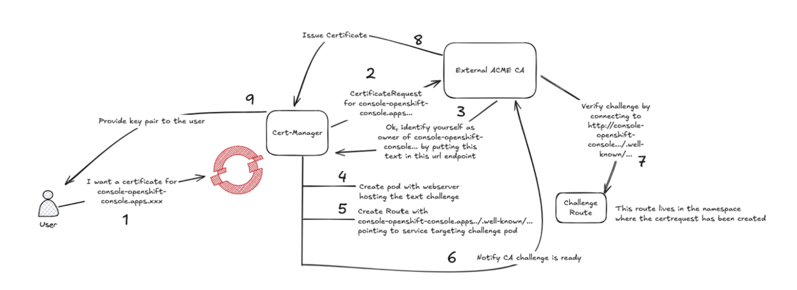

# HTTP01 Challenge Proxy for Cert Manager



## Summary

For baremetal platforms only.  Provide a way for cert-manager to complete http01 challenges against API endpoints (such as api.cluster.example.com) similar to the way it handles certificate challenges for other OpenShift Ingress endpoints.

## Motivation

Cert manager can be used to issue certificates for the OpenShift Container Platform (OCP) endpoints (e.g., console, downloads, oauth) using an external ACME Certificate Authority (CA). These endpoints are exposed via the OpenShift Ingress (`*.apps.cluster.example.com`), and this is a supported and functional configuration today.

However, cluster administrators often want to use Cert Manager to issue custom certificates for the API endpoint (`api.cluster.example.com`). Unlike other endpoints, this API endpoint is not exposed via the OpenShift Ingress. Depending on the OCP topology (e.g., SNO, MNO, Compact), it is exposed directly on the node or via a keepalive VIP. This lack of management by the OpenShift Ingress introduces challenges in obtaining certificates using an external ACME CA.

The gap arises due to how the ACME HTTP01 challenge works. The following scenarios illustrate the challenges:

1. **Standard Clusters**: The API VIP is hosted on the control plane nodes which do not host an OpenShift Router. The http01 challenge, which is directed at the API VIP (the IP where `api.cluster.example.com` DNS resolves), will not hit an OpenShift Router and thus not reach the challenge response pod started by Cert Manager.
2. **Compact Clusters**: The node hosting the API VIP may also host an OpenShift Router. If no router is present on the node hosting the VIP, the challenge will fail.
3. **SNO (Single Node OpenShift)**: The same nodes host both the ingress and API components. Both FQDNs (`api` and wildcard) resolve to the same IP, making the challenge feasible.

To address this gap, a small proxy was developed. This proxy runs on the cluster as a DaemonSet (control plane nodes) and then adds iptables rules to the nodes and ensures that connections reaching the API on port 80 are redirected to the OpenShift Ingress Routers. The proxy implementation creates a reverse proxy to the apps VIP and uses `nftables` to redirect traffic from `API:80` to `PROXY:8888`.

- **Proxy Code**: [GitHub Repository](https://github.com/mvazquezc/cert-mgr-http01-proxy/tree/main)
- **Deployment Manifest**: [Manifest Link](https://github.com/mvazquezc/cert-mgr-http01-proxy/blob/main/manifests/deploy-in-ocp.yaml)

This enhancement aims to provide a robust solution for managing certificates for the API endpoint in baremetal environments.

### User Stories

1. **As a cluster administrator**, I want to manage custom certificates for the API endpoint (`api.cluster.example.com`) using an external ACME CA, so that I can ensure secure communication for my cluster's API.
2. **As a cluster administrator on a baremetal platform**, I want a reliable solution to handle HTTP01 challenges for the API endpoint, even when the endpoint is not managed by OpenShift Ingress, so that I can avoid manual workarounds.
3. **As a developer**, I want a simple deployment mechanism for the HTTP01 challenge proxy, so that I can easily integrate it into my existing cluster setup.

### Goals

- Provide a reliable mechanism for Cert Manager to complete HTTP01 challenges for the API endpoint (`api.cluster.example.com`) in baremetal environments.
- Ensure compatibility with various OpenShift topologies, including Standard Clusters, Compact Clusters, and SNO.
- Minimize operational complexity by using a DaemonSet-based deployment and `nftables` for traffic redirection.

## Proposal

The HTTP01 Challenge Proxy will be implemented via DaemonSet running on the cluster. It will:

- Redirect HTTP traffic from the API endpoint (`api.cluster.example.com`) on port 80 to the OpenShift Ingress Routers.
- Use `nftables` for traffic redirection from `API:80` to `PROXY:8888`.
- Be deployed using a manifest that includes all necessary configurations.

The proxy will ensure compatibility with various OCP topologies, including SNO, MNO, and Compact clusters, addressing the challenges of HTTP01 validation for the API endpoint.

### API Extensions

A new CR type may be created and can be applied to clusters.  This new typed will be stored in the [openshift/api](https://github.com/openshift/api) repo.

Potential Example of a CR:

```
apiVersion: network.openshift.io/v1alpha1
kind: HTTP01ChallengeProxy
metadata:
  name: example-http01challengeproxy
  namespace: default
spec:
  # Add fields here to specify the desired state of the HTTP01ChallengeProxy
status:
  conditions:
    - type: Ready
      status: "True"
      lastTransitionTime: "2025-05-12T00:00:00Z"
      reason: "Initialized"
      message: "HTTP01ChallengeProxy is ready"
```

### Implementation Details/Notes/Constraints

- The proxy will be deployed as a DaemonSet to ensure it runs on all nodes which may host the API VIP in the cluster.
- The nftables rules will be added to the nodes. The proxy will listen on port 8888 and redirect traffic to the OpenShift Ingress Routers.
- The implementation relies on `nftables` for traffic redirection, which must be supported and enabled on the cluster nodes.
- The demo deployment manifest for the proxy is available [here](https://github.com/mvazquezc/cert-mgr-http01-proxy/blob/main/manifests/deploy-in-ocp.yaml).
- An example implementation can be found in this [repository](https://github.com/mvazquezc/cert-mgr-http01-proxy/tree/main).

### Design Details

- **Proxy Deployment**: The proxy will be deployed using a Kubernetes DaemonSet. The daemonset will implement an nftable rule via pod that runs to completion.
- **Traffic Redirection**: This will use `nftables` rules to redirect incoming traffic on `API:80` to `PROXY:8888`.
- **Security**: The proxy will only handle HTTP traffic for the HTTP01 challenge and will not interfere with other traffic or services.
- **Monitoring**: Logs and metrics will be exposed to help administrators monitor the proxy's behavior and troubleshoot issues.

### Drawbacks

1. **Dependency on nftables**: The solution relies on `nftables`, which may not be available or enabled on all environments.
2. **Additional Resource Usage**: Running the proxy as a DaemonSet introduces additional resource usage on the cluster nodes while the proxy pod is applying its nftable rules.
3. **Complexity**: The solution adds another component to the cluster, which may increase operational complexity.

### Alternatives (Not Implemented)

The alternatives were actually implemented if you look through the presentation [slides](https://docs.google.com/presentation/d/1mJ1pnsPiEwb-U5lHwhM2UkyRmkkLeYxj3cfE4F7dOx0/edit#slide=id.g547716335e_0_260) but the approaches are all listed below.

1. **RHACM Manages Cert Manager Deployment**: RHACM (Red Hat Advanced Cluster Management) manages the deployment of Cert Manager and certificates on the spokes using Policies. Each managed cluster runs its own Cert Manager instance. This approach decentralizes certificate management but requires Cert Manager to be deployed and maintained on each spoke cluster.

2. **Single Addon on the Hub**: A single addon runs on the hub and watches the spoke clusters' APIs for `Certificate` and `CertificateRequest` related events. When these APIs are created, updated, or deleted in the spoke, the addon syncs the contents back and forth between the hub and the spokes. This approach centralizes management but introduces additional complexity in syncing data.

3. **Cert Manager Controller per Spoke**: A Cert Manager controller is configured for each spoke cluster on the hub. These controllers run in the spoke cluster namespace and are configured to use the spoke’s `system:admin` kubeconfig. This approach allows centralized control but requires managing multiple controllers on the hub.

4. **Single Cert Manager Controller on the Hub**: A single Cert Manager controller runs on the hub. Certificates and `CertificateRequests` for each spoke cluster are created with data known beforehand (e.g., API, Ingress, CNFs). The resulting secrets are synced to the spokes via RHACM Policies. This approach simplifies the deployment but requires pre-configured data for each spoke.

More information about the investigation can be found [here](https://docs.google.com/presentation/d/1mJ1pnsPiEwb-U5lHwhM2UkyRmkkLeYxj3cfE4F7dOx0/edit#slide=id.g547716335e_0_260).

### Risks and Mitigations

1. **Proxy Failure**: If the proxy fails, HTTP01 challenges for the API endpoint will not succeed. Mitigation: Use health checks and monitoring to ensure the proxy is running correctly.
2. **Traffic Interference**: The proxy could inadvertently interfere with other traffic. Mitigation: Carefully scope the proxy's functionality to only handle HTTP01 challenge traffic.

### Implementation History

- **2025-03-28**: Enhancement proposal created.

### References

- [Cert Manager Expansion JIRA Epic](https://issues.redhat.com/browse/CNF-13731)
- [ACME HTTP01 Challenge](https://letsencrypt.org/docs/challenge-types/#http-01-challenge)
- [Proxy Code Repository](https://github.com/mvazquezc/cert-mgr-http01-proxy/tree/main)
- [Deployment Manifest](https://github.com/mvazquezc/cert-mgr-http01-proxy/blob/main/manifests/deploy-in-ocp.yaml)

### Non-Goals

- This enhancement does not aim to replace or modify the existing OpenShift Ingress functionality.
- It does not provide support for non-HTTP01 challenge types (e.g., DNS-01).
- It does not address certificate management for endpoints other than the API endpoint (`api.cluster.example.com`).
- It does not provide a solution for environments where `nftables` is not supported.

### Workflow Description

1. Cert Manager initiates an HTTP01 challenge for the API endpoint (`api.cluster.example.com`).
2. The HTTP01 challenge request is directed to the API VIP on port 80.
3. The HTTP01 Challenge Proxy intercepts the traffic using `nftables` and redirects it to the proxy pod on port 8888.
4. The proxy pod forwards the request to the OpenShift Ingress Router, which serves the challenge response from the Cert Manager challenge pod.
5. The ACME CA validates the challenge and issues the certificate for the API endpoint.

### Topology Considerations

- **Standard Clusters**: The API VIP is hosted on control plane nodes. The proxy ensures that HTTP01 challenges are redirected to the OpenShift Ingress Routers.
- **Compact Clusters**: The proxy handles scenarios where the API VIP node may or may not host an OpenShift Router, ensuring consistent challenge redirection.
- **SNO (Single Node OpenShift)**: The proxy is not strictly required in this topology, as the API and wildcard FQDNs resolve to the same IP. However, it can still be deployed for consistency.

#### Hypershift / Hosted Control Planes

This enhancement does not directly apply to Hypershift deployments, as the API endpoint management in Hypershift differs from baremetal environments. However, the proxy's design could be adapted for similar use cases in Hypershift if needed.

#### Standalone Clusters

For standalone clusters, the proxy ensures that HTTP01 challenges for the API endpoint are redirected to the OpenShift Ingress Routers, regardless of whether the API VIP node hosts a router.

#### Single-node Deployments or MicroShift

In SNO or MicroShift deployments, the proxy is not strictly required, as the API and wildcard FQDNs resolve to the same IP. However, deploying the proxy ensures consistency and simplifies certificate management.

## Test Plan

1. **Unit Tests**: Validate the proxy's functionality in isolation, including traffic redirection and error handling.
2. **Integration Tests**: Deploy the proxy in a test cluster and verify that HTTP01 challenges for the API endpoint succeed.
3. **Performance Tests**: Measure the proxy's impact on cluster performance and resource usage.
4. **Topology Tests**: Test the proxy in Standard Clusters, Compact Clusters, and SNO environments to ensure compatibility.

## Graduation Criteria

### Dev Preview -> Tech Preview

- The proxy is implemented and tested in development environments.
- Documentation is available for deploying and configuring the proxy.

### Tech Preview -> GA

- The proxy is deployed in production environments and successfully handles HTTP01 challenges for various OCP topologies.
- Performance and reliability meet production-grade requirements.

### Removing a deprecated feature

This enhancement does not deprecate any existing features.

## Upgrade / Downgrade Strategy

Updated versions of the proxy can be applied to the cluster similar to initial deployment

## Version Skew Strategy

Any changes to the proxy's behavior will be documented to ensure compatibility with older cluster versions.

## Operational Aspects of API Extensions

- **Monitoring**: Logs and metrics will be exposed to help administrators monitor the proxy's behavior and troubleshoot issues.
- **Resource Usage**: The proxy's resource requirements will be minimal, as it only handles HTTP01 challenge traffic.
- **Failure Recovery**: Health checks will ensure that the proxy is running correctly, and failed pods will be automatically restarted.

## Support Procedures

Support for the proxy will be provided through standard OpenShift support channels. Administrators can refer to the deployment documentation and logs for troubleshooting.
