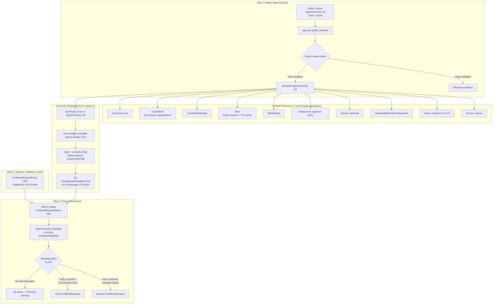

# Extend cert-manager-operator to manage approver-policy

## Summary

This enhancement describes the proposal to extend `cert-manager-operator` to deploy and manage the
[approver-policy](https://github.com/cert-manager/approver-policy) operand with a dedicated controller.
approver-policy is a CertificateRequest approver for cert-manager that enables fine-grained policy control
over which certificate requests are approved or denied based on `CertificateRequestPolicy` resources.

approver-policy will be managed as an operand by an additional controller in cert-manager-operator. The operand
will be installed in the `cert-manager` namespace. When deployed, it replaces cert-manager's built-in
CertificateRequest approver with a policy-driven approval workflow, enabling administrators to define
granular policies governing certificate issuance.

The cert-manager operator automatically handles the coordination between the
built-in auto-approver and approver-policy. When the user creates an `ApproverPolicy` CR and the
`approver-policy-controller` reports a successful reconciliation (operand running), the cert-manager
controller **automatically disables** the built-in CertificateRequest approver. No manual intervention is
needed. When the `ApproverPolicy` CR is deleted, operator-created resources are cleaned up and the built-in
approver is automatically re-enabled.

**Note:**
Throughout the document, the following terminology means:
- `approver-policy` is the operand managed by the cert-manager operator.
- `approver-policy-controller` is the dedicated controller in cert-manager operator managing the `approver-policy` operand deployment.
- `approverpolicies.operator.openshift.io` is the custom resource for interacting with `approver-policy-controller` to install,
  configure, and uninstall the `approver-policy` operand deployment.
- `CertificateRequestPolicy` is the upstream CRD (from `policy.cert-manager.io` API group) that defines approval policies.

## Motivation

Certificate policy enforcement is critical for enterprise security. By default, cert-manager's built-in
auto-approver approves CertificateRequests for its internal `Issuer` and `ClusterIssuer` signers; external
signers require explicit configuration. Without approver-policy, any user who can create a CertificateRequest
against those issuers can obtain a certificate without policy review — unacceptable in production environments
where issuance must follow organizational policies.

approver-policy solves this by:

1. **Policy-Based Approval**: Define `CertificateRequestPolicy` resources that specify what attributes (DNS names,
   IP addresses, key algorithms, durations, etc.) are allowed or required in certificate requests.
2. **RBAC Integration**: Policies are bound to users/groups via standard Kubernetes RBAC, so only authorized
   requestors can use specific policies.
3. **Issuer Scoping**: Policies can be scoped to specific issuers (by name, kind, and group), ensuring that
   only authorized issuers are used for certain types of certificates.
4. **Namespace Scoping**: Policies can target specific namespaces by name or label selector.
5. **CEL Validation**: Advanced validation rules using Common Expression Language (CEL) for fine-grained
   attribute validation beyond simple allow-lists.

The `cert-manager-operator` already manages `cert-manager`, `istio-csr`, and `trust-manager`. Extending it
to manage `approver-policy` provides a unified, operator-managed solution for certificate lifecycle
management, trust distribution, and policy enforcement on OpenShift.

### User Stories

- As an OpenShift administrator, I want to have an option to deploy approver-policy as a day-2 operation by
  simply creating a single CR, so that I can enforce certificate issuance policies across my cluster without
  any additional manual steps.
- As an OpenShift administrator, I want the cert-manager operator to automatically disable the built-in
  auto-approver when I deploy approver-policy, so that the transition is seamless and I don't risk a race
  condition between approvers.
- As an OpenShift administrator, I want to be able to configure which signer names approver-policy can
  approve or deny, so that I can integrate with external issuers.
- As an OpenShift security engineer, I want to define policies that restrict certificate attributes (DNS names,
  key sizes, durations, etc.) that can be requested, to enforce organizational security standards.
- As an OpenShift security engineer, I want to use RBAC to control which users and service accounts can
  request certificates matching specific policies.
- As an OpenShift administrator, I should be able to uninstall approver-policy when not required as a day-2
  operation by simply deleting the `ApproverPolicy` CR, which automatically cleans up all operator-created
  resources and re-enables the built-in cert-manager auto-approver.
- As an OpenShift security engineer, I want to be able to identify all artifacts created by approver-policy
  for better auditability.
- As an OpenShift SRE, I should be able to get detailed information as part of different status conditions and
  messages to identify reasons for failures.
- As an OpenShift SRE, I should be able to collect metrics for approver-policy for monitoring.

### Goals

- `cert-manager-operator` to be extended to manage `approver-policy` along with currently managed `cert-manager`,
  `istio-csr`, and `trust-manager`.
- New custom resource (CR) `approverpolicies.operator.openshift.io` to be made available to install and
  configure the approver-policy deployment.
- When the `ApproverPolicy` CR is created and the operand becomes ready, the cert-manager controller
  **automatically disables** the built-in CertificateRequest approver — no manual user action required.
- When the `ApproverPolicy` CR is deleted, all operator-created resources are cleaned up and the built-in
  CertificateRequest approver is **automatically re-enabled**.
- `AutoApproverDisabled` status field on the `CertManager` CR to surface the effective auto-approval state.
- approver-policy operand will always be deployed in the `cert-manager` namespace.
- The `CertificateRequestPolicy` CRD from upstream (`policy.cert-manager.io`) will be installed by OLM as
  part of the operator's bundle at operator installation time (see [CRD Management](#crd-management)).
- Support configurable signer names for approval scope.
- Dynamic RBAC configuration based on signer names.
- Provide trust-manager integration support via a new `approverPolicy` field on the `TrustManager` CR,
  enabling the operator to automatically create the `CertificateRequestPolicy` and RBAC resources required
  for trust-manager's webhook certificate to be approved by approver-policy.
- Release as TechPreview behind the operator's `ApproverPolicy` feature gate.

### Non-Goals

- Automatic cleanup of `CertificateRequestPolicy` resources **created by users** when the ApproverPolicy CR
  is deleted. Only operator-created resources (Deployment, ServiceAccount, RBAC, Services, etc.) are cleaned up.
- Managing or configuring the content of `CertificateRequestPolicy` resources. The operator only manages the
  approver-policy deployment; policy authoring is left to the cluster administrator.
- Plugin support for approver-policy. Only the built-in `allowed` and `constraints` evaluators will be available
  in the initial release.

### How approver-policy Works (Background)

This section provides essential background on cert-manager's approval mechanism and how approver-policy
integrates with it.

#### cert-manager's Two-Stage Issuance Flow

cert-manager has a two-stage process for issuing certificates:

1. **Admission** (Kubernetes API layer): Can the `CertificateRequest` resource be created?
2. **Approval** (cert-manager layer): Should this `CertificateRequest` be signed by the issuer?

A cert-manager issuer **will not sign** a CertificateRequest unless it has an `Approved` status
condition. By default, cert-manager's built-in auto-approver sets this condition on every request.
approver-policy replaces this with policy-based decisions.

```
User creates Certificate
        ↓
cert-manager creates CertificateRequest (namespace-scoped)
        ↓
  ┌─────────────────────┐
  │  APPROVAL STAGE     │  ← approver-policy operates here
  │                     │
  │  Approved? Denied?  │
  └─────┬─────────┬─────┘
        │         │
     Approved   Denied → Permanent failure (retried with exponential backoff)
        ↓
  Issuer signs certificate → Secret created
```

**Key properties of CertificateRequests:**

- All `spec` fields (including `request`, `issuerRef`, `usages`, `duration`, `isCA`, and managed
  annotations) are **immutable after creation**. They cannot be modified.
- A CertificateRequest is a one-shot resource — issuance is **not retried** on the same
  CertificateRequest. It is the parent controller's (e.g., Certificate controller) responsibility
  to create a new CertificateRequest for retries.
- A denied CertificateRequest is **terminally failed** — the `Denied` condition is permanent and
  immutable. Unlike a CertificateRequest that fails due to an issuer error (where the Certificate
  controller automatically deletes the failed CR and creates a new one with exponential backoff), a
  **denied CertificateRequest is never automatically deleted or recreated**. The Certificate
  controller will keep re-triggering issuance (with exponential backoff), but the request manager
  will not create a new CertificateRequest while the denied one still exists. To retry, the user
  must **manually delete the denied CertificateRequest** (after creating or correcting the
  applicable `CertificateRequestPolicy`).

**Default auto-approver scope:**

The built-in auto-approver **only** approves CertificateRequests referencing cert-manager's internal
issuer types: `cert-manager.io/Issuer` and `cert-manager.io/ClusterIssuer`. CertificateRequests
referencing external issuers are NOT auto-approved unless explicitly configured via `approveSignerNames`.

Ref: [CertificateRequest — Approval](https://cert-manager.io/docs/usage/certificaterequest/#approval)

This is provided as background context only. **The built-in auto-approver and approver-policy must not
run simultaneously.** Running both means the built-in approver
will auto-approve all requests to cert-manager's own issuers, completely bypassing any
`CertificateRequestPolicy` rules you define for those issuers.


#### How approver-policy Approves or Denies a CertificateRequest

approver-policy **patches the CertificateRequest's `.status.conditions`** using Server-Side Apply
with the field manager `"approver-policy"`. It sets one of:

- **Approved**: `condition.type=Approved, status=True, reason="policy.cert-manager.io"`
- **Denied**: `condition.type=Denied, status=True, reason="policy.cert-manager.io"` with a message
  explaining why (e.g., which policy fields were violated)
- **Unprocessed** (no matching policy): No status update — the CertificateRequest stays pending

approver-policy's ClusterRole has **cluster-wide** permissions on CertificateRequests:

```yaml
# Read all CertificateRequests
- apiGroups: ["cert-manager.io"]
  resources: ["certificaterequests"]
  verbs: ["list", "watch"]
# Patch their status (to set Approved/Denied conditions)
- apiGroups: ["cert-manager.io"]
  resources: ["certificaterequests/status"]
  verbs: ["patch"]
# Signer approval RBAC (required by cert-manager's webhook)
- apiGroups: ["cert-manager.io"]
  resources: ["signers"]
  verbs: ["approve"]
```

#### Protection Against Unauthorized Approval

cert-manager protects the Approved/Denied conditions at three levels:

1. **Signer RBAC (cert-manager's validating webhook)**: When anyone attempts to set Approved or Denied
   on a CertificateRequest, cert-manager's webhook checks whether the caller has the `approve` verb on
   the `signers` resource for the specific issuer referenced by that CertificateRequest. Without this
   RBAC, the status update is **rejected**. approver-policy has this RBAC via its ClusterRole; random
   users do not.

   The signer RBAC `resourceNames` follow a specific naming convention:
   ```
   # namespaced signers
   <signer-resource-name>.<signer-group>/<signer-namespace>.<signer-name>
   # cluster-scoped signers
   <signer-resource-name>.<signer-group>/<signer-name>
   # all signers of a resource type
   <signer-resource-name>.<signer-group>/*
   ```

   Important: the `approve` verb grants permission to set **both** Approved and Denied conditions.
   The RBAC **must** be granted at the cluster scope (ClusterRole + ClusterRoleBinding).

   Ref: [CertificateRequest — RBAC Syntax](https://cert-manager.io/docs/usage/certificaterequest/#rbac-syntax)

2. **Mutual Exclusivity**: The Approved and Denied conditions are **mutually exclusive** — a
   CertificateRequest cannot have both simultaneously. Both conditions can only have `status: True`.
   This is enforced by cert-manager's validating admission webhook.

3. **Immutability**: Once an Approved or Denied condition is set, it is **permanent and cannot be
   modified or removed**. cert-manager's webhook rejects any attempt to change an existing approval
   condition. 
   
   This means:
   - A user without `approve` signer RBAC → rejected by webhook
   - A user tries to approve after it's already denied → rejected (mutual exclusivity + immutability)
   - A user tries to remove an existing Approved condition → rejected (immutable)

#### Resource Scoping

- **CertificateRequest**: Namespace-scoped. Created in the same namespace as the `Certificate` resource.
- **CertificateRequestPolicy**: Cluster-scoped. Policies are defined globally and use selectors
  (`issuerRef`, `namespace`) to match against namespace-scoped CertificateRequests.

#### How approver-policy Identifies the Requesting Identity

cert-manager embeds **UserInfo fields** into every CertificateRequest at creation time:

- `spec.username` — the identity that created the CertificateRequest
- `spec.groups` — the groups of that identity
- `spec.uid` — the UID
- `spec.extra` — additional attributes

These fields are **set by cert-manager and are immutable** — the webhook rejects any modification.
When a `Certificate` resource triggers a CertificateRequest, `spec.username` is cert-manager's own
ServiceAccount (e.g., `system:serviceaccount:cert-manager:cert-manager`), not the end user who
created the Certificate.

approver-policy uses these fields to perform a **SubjectAccessReview** against the Kubernetes API,
asking: "Does user `{spec.username}` with groups `{spec.groups}` have the `use` verb on
`certificaterequestpolicies` resource named `{policy.Name}`?"

Only policies where the requesting identity has RBAC to `use` them are considered for evaluation.

Ref: `pkg/internal/approver/manager/predicate/predicate.go` — `RBACBound()` function.

#### Policy Evaluation: `allowed` vs `constraints`

A `CertificateRequestPolicy` has two evaluation sections that serve different purposes:

**`allowed`** — defines what attribute **values** are permitted in a request. approver-policy
decodes the base64-encoded PEM X.509 CSR from `spec.request` and inspects: CommonName, DNSNames,
IPAddresses, URIs, EmailAddresses, IsCA, Usages, and full Subject fields (Organization, Country,
OU, Locality, Province, StreetAddress, PostalCode, SerialNumber).

| Field in policy | Field in request  | Result                                 |
| --------------- | ----------------- | -------------------------------------- |
| Omitted         | Empty             | Allowed                                |
| Omitted         | Has a value       | **Denied** (attribute not allowed)     |
| Has values      | Empty             | Allowed (requesting less than allowed) |
| Has values      | Subset of allowed | Allowed                                |
| Has values      | Not a subset      | **Denied**                             |

The `required: true` flag flips the empty-request behavior: if a field is `required` and the
request omits it, the request is **denied**. Without `required`, omitting an attribute is always
allowed (the request is simply asking for less than the maximum). The `required` flag is not
available for `isCA` or `usages`.

String fields in `allowed` support **wildcard matching** with `*`.For example, `"*.example.com"` matches `"foo.example.com"` but not
`"fooexample.com"`. List fields (e.g., `dnsNames`, `usages`) permit requests that are a **subset**
of the allowed values.

Since v0.11.0, `allowed` fields also support **CEL validation rules** for advanced validation beyond
wildcards. CEL expressions receive `self` (the attribute value being validated) and `cr` (an object
with `namespace`, `name`, `username`, and `groups` fields of the CertificateRequest). For multi-valued
attributes, the validation runs once per value. Example:
```yaml
allowed:
  uris:
    validations:
      - rule: "self.startsWith('spiffe://cluster.local/ns/' + cr.namespace + '/sa/')"
        message: "SPIFFE ID must match the requesting namespace"
```

**`constraints`** — defines **bounds/limits** that the request must satisfy. Currently supports
`minDuration`, `maxDuration`, and `privateKey` (algorithm, minSize, maxSize). An omitted constraint
means **no restriction** on that attribute.

| Section       | Omitted field means        | Purpose                 |
| ------------- | -------------------------- | ----------------------- |
| `allowed`     | Attribute is **forbidden** | Define permitted values |
| `constraints` | **No restriction**         | Define bounds/limits    |

Both `allowed` and `constraints` must pass for a request to be approved by a given policy.

#### Policy Selectors

A `CertificateRequestPolicy` must define at least one selector (`issuerRef` or `namespace`), even if
set to `{}` (match all). If **both** selectors are defined, both must match for the policy to apply.

- **`issuerRef`**: Matches against the CertificateRequest's `spec.issuerRef` (name, kind, group).
  Supports wildcards. An empty `{}` matches all issuers.
- **`namespace`**: Matches against the namespace of the CertificateRequest. Supports `matchNames`
  (with wildcards) and `matchLabels` (standard Kubernetes label selector). An empty `{}` matches all
  namespaces.

#### Approval Decision Logic

```
For each CertificateRequest:
  1. List all CertificateRequestPolicies and filter through predicates:
     a. Policy is Ready (status condition)
     b. Policy selector.issuerRef matches request's issuerRef
     c. Policy selector.namespace matches request's namespace (if defined)
     d. Both selectors must match if both are defined
     e. Requesting identity (spec.username/groups) has RBAC to "use" the policy

  2. If no policies match → UNPROCESSED (stays pending, not approved, not denied)

  3. For each matching policy, run all evaluators (allowed + constraints):
     - If ANY policy permits → APPROVED (with message: "Approved by CertificateRequestPolicy: <name>")
     - If ALL matching policies deny → DENIED (with aggregated violation messages)
```

This is **deny-by-default**: no matching policy = no approval = no certificate issued. A
CertificateRequest that is neither approved nor denied (no matching policy) will **not be processed**
by cert-manager until it receives an approval or denial from some approver.

**Condition conventions**: The `Reason` field of Approved/Denied conditions identifies **who** set
the condition (e.g., `"policy.cert-manager.io"` for approver-policy). The `Message` field explains
**why** (e.g., the policy name that approved it, or the list of violations that caused denial).


## Proposal

### Design for Auto-disabling the Default Approver

This is the most critical design decision in this enhancement. cert-manager ships with a built-in CertificateRequest
approver that automatically approves all requests. When approver-policy is deployed alongside this built-in approver,
**both will race to process CertificateRequests**. If the built-in approver wins the race and sets `Approved=True`
first, the issuer will immediately sign the certificate — the `Denied` condition that approver-policy might
subsequently set is irrelevant at that point, since an approved CertificateRequest is already being processed.
This makes any `CertificateRequestPolicy` enforcement silently ineffective, with no visible error.

Per the [upstream documentation](https://cert-manager.io/docs/policy/approval/approver-policy/installation/):

> If the default approver is not disabled in cert-manager, approver-policy will race with cert-manager
> and policy will be ineffective.

#### Design Choice: Automatic Disable via ApproverPolicy CR Status Watch

Rather than requiring users to manually disable the built-in approver, the cert-manager controller **automatically disables the built-in approver** when the ApproverPolicy
CR reports a successful reconciliation.

**How it works:**

1. The user creates the `approverpolicies.operator.openshift.io` CR with name `cluster`.
2. Both the `cert-manager controller` and the `approver-policy-controller` watch the `ApproverPolicy` CR.
3. The `approver-policy-controller` deploys the operand (Deployment, RBAC, Services, etc.) and sets a
   `Ready=True` status condition on the `ApproverPolicy` CR when the operand is fully running and healthy.
4. The cert-manager controller, watching the `ApproverPolicy` CR, detects the `Ready=True` status and
   automatically:
   - Injects `--controllers=*,-certificaterequests-approver` into the cert-manager controller Deployment
     args, disabling only the built-in approver controller while keeping all other controllers functional.
   - **Deletes** the `cert-manager-controller-approve:cert-manager-io` ClusterRole and its ClusterRoleBinding.
     This is a capability-level guard: cert-manager's admission webhook enforces the `approve` verb on
     `signers` via SubjectAccessReview. Without this ClusterRole, the `cert-manager` ServiceAccount cannot
     approve CRs even if the controller flag were somehow reverted. The failure is an explicit RBAC error
     rather than a silent policy bypass.
   - Sets `AutoApproverDisabled=True` on the CertManager CR status.
5. The cert-manager controller pod restarts with the updated args.
6. From this point, **no CertificateRequests will be auto-approved** — approver-policy processes all
   CertificateRequests based on `CertificateRequestPolicy` resources.

Note: approver-policy has its own `approve` RBAC on `signers` (with no `resourceNames` restriction by
default), so removing cert-manager's ClusterRole has no impact on approver-policy's ability to approve CRs.

**Initial rollout safeguard and requeue behavior:**

The cert-manager controller gates the auto-disable on `ApproverPolicy` CR reporting a **fully successful
reconciliation** (`Ready=True`). This ensures:
- The built-in approver is not disabled until approver-policy is confirmed running and ready to process
  CertificateRequests, preventing a gap in certificate approval.
- If the `ApproverPolicy` CR exists but the operand fails to become ready, the built-in approver continues
  to function normally.

**Important controller-runtime detail:** Both the cert-manager controller and the approver-policy-controller
receive the `ApproverPolicy` CR creation event simultaneously. The approver-policy-controller typically
needs multiple reconciliation loops to deploy all resources and set `Ready=True`. Therefore:
- The cert-manager controller must **watch** the `ApproverPolicy` CR status changes, so that every status update
  on the `ApproverPolicy` CR re-triggers a reconciliation of the `CertManager` CR.
- When the cert-manager controller reconciles and finds `ApproverPolicy` CR present but `Ready=True` is
  not yet set, it **requeues** the event request rather than disabling the approver.
  The auto-disable happens only on the reconciliation loop where `Ready=True` is confirmed.

**Transition period RBAC safety:**

When the auto-disable is triggered, the cert-manager Deployment update is asynchronous (pod restart takes a
few seconds). During this rollout window, the RBAC deletion (step 4 above) provides an immediate hard
guard: the `cert-manager` ServiceAccount loses its `approve` RBAC capability the moment the ClusterRole is
deleted, even before the old pod terminates. Any CertificateRequest approval attempt by the old pod during
this window results in an explicit RBAC rejection from cert-manager's admission webhook.

**Atomicity of flag injection and ClusterRole deletion:**

Disabling the built-in approver requires two separate Kubernetes API calls:
1. Update the cert-manager Deployment (add `--controllers=*,-certificaterequests-approver`)
2. Delete the `cert-manager-controller-approve:cert-manager-io` ClusterRole and ClusterRoleBinding

These cannot be made truly atomic (no Kubernetes cross-resource transaction). The controller handles
each failure mode safely:

| Failure scenario                               | Effective security posture                                                                                                                                                           | Recovery                                          |
| ---------------------------------------------- | ------------------------------------------------------------------------------------------------------------------------------------------------------------------------------------ | ------------------------------------------------- |
| Deployment updated, ClusterRole deletion fails | cert-manager pod restarts without the approver controller (flag in effect); ClusterRole still present but irrelevant — the pod is no longer running the approver.                    | Next reconciliation retries ClusterRole deletion. |
| ClusterRole deleted, Deployment update fails   | Hard RBAC guard is immediately active — any approval attempt by the still-running pod is rejected by cert-manager's admission webhook with an explicit RBAC error. No silent bypass. | Next reconciliation retries Deployment update.    |

The `AutoApproverDisabled=True` status condition is only set on the CertManager CR **after both operations
succeed**. If either fails, the controller returns an error, which triggers an immediate retry. The
reconciler is idempotent — re-running either operation when it's already in the desired state is a
safe no-op — so partial failures are self-correcting on the next reconciliation loop.

**Persistence — one-way latch until ApproverPolicy CR deletion:**

Once `AutoApproverDisabled` is set to `True`, the cert-manager controller **keeps the auto-approver
disabled as long as the `ApproverPolicy` CR exists** — regardless of the operand's `Ready` state.
This is handled naturally by the idempotent reconciler:

- If the approver-policy operand has a **transient failure** (pod crash, brief NotReady), the reconciler
  re-runs on the next loop, sees the `ApproverPolicy` CR still exists, and ensures the Deployment flag and
  ClusterRole deletion are in the desired state. No re-enable happens.
- The only condition that re-enables auto-approval is `ApproverPolicy` CR `Not Found`.

**Reconciliation logic (pseudocode):**
```
func reconcile(certManagerCR):
  approverPolicy, err := Get(ApproverPolicyCR)

  if IsNotFound(err):
    // ApproverPolicy CR gone → re-enable
    enableAutoApprover()       // recreate ClusterRole/CRB, remove --controllers flag
    set(AutoApproverDisabled=False)
    return

  // ApproverPolicy CR exists → ensure auto-approver is disabled
  if approverPolicy.Status.Ready == True AND autoApproverCurrentlyEnabled():
    // First time Ready=True observed → trigger the disable
    disableAutoApprover()      // inject --controllers flag + delete ClusterRole/CRB (both must succeed)
    set(AutoApproverDisabled=True)
  else if autoApproverAlreadyDisabled():
    // Latch held: keep disabled (idempotent no-op if already in desired state)
    set(AutoApproverDisabled=True)
  else:
    // ApproverPolicy exists but not yet Ready=True — wait
    requeue()
```

> **Note on CertManager CR delete/recreate**: Deliberately deleting and recreating the CertManager CR
> while an `ApproverPolicy` CR is active is already a disruptive manual operation. The watch mechanism
>  ensures the cert-manager controller re-reconciles within seconds of
> the ApproverPolicy CR becoming `Ready=True` again, keeping the disable window negligibly short.

**Automatic cleanup and re-enablement on ApproverPolicy CR deletion:**

The `approver-policy-controller` uses a **finalizer** on the `ApproverPolicy` CR to guarantee cleanup
completes before the CR is fully deleted. This ensures the cert-manager controller only re-enables the
built-in approver *after* all operator-created resources are gone, preventing a window where both the
approver-policy Deployment and the built-in approver run simultaneously.

When the `ApproverPolicy` CR is deleted:
1. The `approver-policy-controller` detects the deletion, runs cleanup:
   deletes Deployment, ServiceAccount, ClusterRole, ClusterRoleBinding, Role, RoleBinding, Services,
   ValidatingWebhookConfiguration, and Secret.
2. After all resources are successfully deleted, the finalizer is removed and the `ApproverPolicy` CR
   is fully deleted (Get returns `Not Found`).
3. The cert-manager controller detects the `ApproverPolicy` CR is `Not Found` and automatically:
   - Removes `--controllers=*,-certificaterequests-approver` from the cert-manager Deployment args.
   - Recreates the `cert-manager-controller-approve:cert-manager-io` ClusterRole and ClusterRoleBinding.
   - Sets `AutoApproverDisabled=False` on the CertManager CR status.
4. The cert-manager controller pod restarts — the built-in approver is active again.

**Workflow — enabling approver-policy:**
```
Step 1: Deploy approver-policy
  oc apply -f approver-policy-cr.yaml
  → approver-policy-controller deploys the operand
  → When operand is Ready=True, cert-manager controller automatically:
      - Restarts with --controllers=*,-certificaterequests-approver
      - Deletes cert-manager-controller-approve:cert-manager-io ClusterRole and ClusterRoleBinding
      - Sets AutoApproverDisabled=True on CertManager CR status

Step 2: Create CertificateRequestPolicies
  oc apply -f my-policy.yaml
  → approver-policy evaluates future CertificateRequests against this policy
```

**Workflow — uninstalling approver-policy (restores auto-approval automatically):**
```
Step 1: Delete the ApproverPolicy CR
  oc delete approverpolicy cluster
  → approver-policy-controller cleans up all operator-created resources
  → cert-manager controller detects ApproverPolicy CR deletion and automatically:
      - Restores cert-manager Deployment args (removes --controllers=*,-certificaterequests-approver)
      - Recreates cert-manager-controller-approve:cert-manager-io ClusterRole and ClusterRoleBinding
      - Sets AutoApproverDisabled=False on CertManager CR status
```

The `AutoApproverDisabled` status condition provides an observable signal:
```bash
oc get certmanager cluster -o jsonpath='{.status.conditions[?(@.type=="AutoApproverDisabled")]}'
```

### Deploying approver-policy

`approver-policy` will be installed and managed by `cert-manager-operator`. A new custom resource is defined
to configure the `approver-policy` operand. The `approverpolicies.operator.openshift.io` CR can be added
day-2 to install `approver-policy` post the installation or upgrade of cert-manager operator on OpenShift
clusters.

Starting from cert-manager-operator v1.21.0, approver-policy will be available as Tech Preview. The feature
requires the operator's `ApproverPolicy` feature gate to be enabled.

A new controller will be added to `cert-manager-operator` to manage and maintain the `approver-policy`
deployment in the desired state. `approver-policy-controller` will make use of static manifest templates
for creating the resources required for successfully deploying `approver-policy`.

Each of the resources created for `approver-policy` deployment will have the below set of labels added:
* `app: cert-manager-approver-policy`
* `app.kubernetes.io/name: cert-manager-approver-policy`
* `app.kubernetes.io/instance: cert-manager-approver-policy`
* `app.kubernetes.io/version: "vX.Y.Z"`
* `app.kubernetes.io/managed-by: cert-manager-operator`
* `app.kubernetes.io/part-of: cert-manager-operator`

These labels aid in identifying and managing the `approver-policy` components within the cluster, thereby
facilitating operations like monitoring and resource discovery.

`approverpolicies.operator.openshift.io` CR object is a cluster-scoped singleton object. The singleton
pattern is enforced through two mechanisms:
- An XValidation rule in the CRD rejects any ApproverPolicy CR that is not named `cluster`
- The controller only reconciles ApproverPolicy CRs with the name `cluster`, ignoring any others

`approver-policy` will always be deployed in the `cert-manager` namespace.

Configurations made available in the spec of `approverpolicies.operator.openshift.io` CR are passed as
command line arguments to `approver-policy` and updating these configurations would cause a new rollout
of the `approver-policy` deployment.

A fork of [upstream approver-policy](https://github.com/cert-manager/approver-policy) will be created
[downstream](https://github.com/openshift/cert-manager-approver-policy) for downstream management.

### Workflow Description

The following diagram illustrates the end-to-end workflow for approver-policy deployment and policy enforcement:



- Installation of `approver-policy`
  - An OpenShift user creates the `approverpolicies.operator.openshift.io` CR with name `cluster`.
  - `approver-policy-controller` deploys `approver-policy` in the `cert-manager` namespace and sets
    `Ready=True` on the `ApproverPolicy` CR status when the operand is fully running.
  - The cert-manager controller watches the `ApproverPolicy` CR. Once `Ready=True` is detected, it
    automatically disables the built-in approver (injects the `--controllers` flag, deletes the approve
    ClusterRole/CRB, and sets `AutoApproverDisabled=True` on the CertManager CR status).

- Uninstallation of `approver-policy`
  - An OpenShift user deletes the `approverpolicies.operator.openshift.io` CR.
  - `approver-policy-controller` **cleans up all operator-created resources** (Deployment, ServiceAccount,
    RBAC, Services, ValidatingWebhookConfiguration, Secret).
  - The cert-manager controller detects the `ApproverPolicy` CR deletion (Get returns `Not Found`) and
    automatically re-enables the built-in approver (removes the `--controllers` flag, recreates the approve
    ClusterRole/CRB, sets `AutoApproverDisabled=False`).

### API Extensions

#### 1. Changes to Existing `CertManager` CR

A new `AutoApproverDisabled` status condition is added to `CertManagerStatus` to surface the **effective**
state of auto-approval in the running cluster:

```golang
// CertManagerStatus defines the observed state of CertManager.
type CertManagerStatus struct {
	apiv1.OperatorStatus `json:",inline"`
	// Conditions holds a list of status conditions for the CertManager resource.
	// +optional
	Conditions []metav1.Condition `json:"conditions,omitempty"`
}
```

| Condition type         | Status  | Reason                | Meaning                                                                                              |
| ---------------------- | ------- | --------------------- | ---------------------------------------------------------------------------------------------------- |
| `AutoApproverDisabled` | `True`  | `ApproverPolicyReady` | ApproverPolicy CR reported `Ready=True` — controller flag injected, approve ClusterRole/CRB removed  |
| `AutoApproverDisabled` | `False` | `AutoApprovalEnabled` | No `ApproverPolicy` CR found (or it has not yet reported `Ready=True`) — built-in approver is active |

The condition is set automatically by the cert-manager controller when it detects the `ApproverPolicy` CR
status. Once set to `True`, it stays `True` until the `ApproverPolicy` CR is deleted. This provides a
stable observable signal:
```bash
oc get certmanager cluster -o jsonpath='{.status.conditions[?(@.type=="AutoApproverDisabled")]}'
```

#### 2. Changes to Existing `TrustManager` CR

> **Context**: When the cert-manager operator automatically disables the built-in auto-approver (triggered
> by the `ApproverPolicy` CR becoming ready), trust-manager's webhook TLS certificate has no approver.
> The field below enables the operator to automatically create the required `CertificateRequestPolicy` and
> RBAC resources for trust-manager's webhook certificate. For the full problem description and controller
> behavior, see the [Interaction with Trust-Manager](#interaction-with-trust-manager) section.

A new `approverPolicy` field is added to `TrustManagerConfig` to support explicit integration with
approver-policy for trust-manager's webhook TLS certificate approval:

```golang
// TrustManagerConfig defines configuration specific to trust-manager.
type TrustManagerConfig struct {
	// ... existing fields ...

	// approverPolicy configures the integration with approver-policy for trust-manager's
	// webhook TLS certificate approval.
	//
	// When the cert-manager operator automatically disables the built-in auto-approver
	// (triggered by the ApproverPolicy CR becoming ready), trust-manager's webhook
	// CertificateRequest will have no approver. Setting this field to Enabled instructs
	// the trust-manager-controller to create a CertificateRequestPolicy, ClusterRole,
	// and ClusterRoleBinding that allow approver-policy to approve trust-manager's
	// webhook certificate.
	//
	// Resources are created or removed **solely** based on the value of this field:
	// - Disabled (default): no policy resources are created.
	// - Enabled: CertificateRequestPolicy + ClusterRole + ClusterRoleBinding are created.
	// - Flipped from Enabled to Disabled: those three resources are deleted.
	//
	// This field does not depend on ApproverPolicy CR status, approver-policy Deployment
	// availability, or approveSignerNames configuration.
	//
	// +kubebuilder:validation:Optional
	// +optional
	ApproverPolicy ApproverPolicyWebhookConfig `json:"approverPolicy,omitempty"`
}

// ApproverPolicyWebhookConfig configures the approver-policy integration for
// trust-manager's webhook TLS certificate.
type ApproverPolicyWebhookConfig struct {
	// enabled controls whether to create a CertificateRequestPolicy and RBAC
	// resources that allow approver-policy to approve trust-manager's webhook
	// TLS certificate.
	//
	// Enabled: The operator creates a CertificateRequestPolicy, ClusterRole, and
	// ClusterRoleBinding. The ClusterRoleBinding is bound to the cert-manager
	// ServiceAccount (always "cert-manager" in the "cert-manager" namespace — hardcoded
	// by the operator, not configurable).
	//
	// Disabled (default): No policy or RBAC resources are created. If this field is
	// flipped from Enabled to Disabled, any previously created CertificateRequestPolicy,
	// ClusterRole, and ClusterRoleBinding are deleted.
	//
	// Resources are managed solely based on this field value — no dependency on
	// ApproverPolicy CR status, Deployment availability, or approveSignerNames.
	//
	// +kubebuilder:default:="Disabled"
	// +kubebuilder:validation:Enum:=Enabled;Disabled
	// +optional
	Enabled ApproverPolicyWebhookPolicy `json:"enabled,omitempty"`
}

// ApproverPolicyWebhookPolicy defines the policy for the approver-policy webhook integration.
// +kubebuilder:validation:Enum:=Enabled;Disabled
type ApproverPolicyWebhookPolicy string

const (
	ApproverPolicyWebhookEnabled  ApproverPolicyWebhookPolicy = "Enabled"
	ApproverPolicyWebhookDisabled ApproverPolicyWebhookPolicy = "Disabled"
)
```

#### 3. New `ApproverPolicy` CR

Below new API `approverpolicies.operator.openshift.io` is introduced for managing approver-policy.

```golang
package v1alpha1

import (
	corev1 "k8s.io/api/core/v1"
	metav1 "k8s.io/apimachinery/pkg/apis/meta/v1"
)

// +k8s:deepcopy-gen:interfaces=k8s.io/apimachinery/pkg/runtime.Object
// +kubebuilder:object:root=true

// ApproverPolicyList is a list of ApproverPolicy objects.
type ApproverPolicyList struct {
	metav1.TypeMeta `json:",inline"`

	// metadata is the standard list's metadata.
	// More info: https://git.k8s.io/community/contributors/devel/sig-architecture/api-conventions.md#metadata
	metav1.ListMeta `json:"metadata"`
	Items           []ApproverPolicy `json:"items"`
}

// +genclient
// +genclient:nonNamespaced
// +k8s:deepcopy-gen:interfaces=k8s.io/apimachinery/pkg/runtime.Object
// +kubebuilder:object:root=true
// +kubebuilder:subresource:status
// +kubebuilder:resource:path=approverpolicies,scope=Cluster,categories={cert-manager-operator}
// +kubebuilder:printcolumn:name="Ready",type="string",JSONPath=".status.conditions[?(@.type=='Ready')].status"
// +kubebuilder:printcolumn:name="Message",type="string",JSONPath=".status.conditions[?(@.type=='Ready')].message"
// +kubebuilder:printcolumn:name="AGE",type="date",JSONPath=".metadata.creationTimestamp"
// +kubebuilder:metadata:labels={"app.kubernetes.io/name=approverpolicy", "app.kubernetes.io/part-of=cert-manager-operator"}

// ApproverPolicy describes the configuration and information about the managed approver-policy deployment.
// The name must be `cluster` to make ApproverPolicy a singleton, allowing only one instance per cluster.
//
// When an ApproverPolicy CR is created, approver-policy is deployed in the cert-manager namespace.
// The cert-manager operator automatically coordinates the transition: once the approver-policy operand
// is running and healthy (Ready=True), the cert-manager controller automatically disables the built-in
// CertificateRequest auto-approver to prevent racing conditions.
//
// When the ApproverPolicy CR is deleted, all operator-created resources are cleaned up and the
// built-in cert-manager auto-approver is automatically re-enabled.
//
// +kubebuilder:validation:XValidation:rule="self.metadata.name == 'cluster'",message="ApproverPolicy is a singleton, .metadata.name must be 'cluster'"
// +operator-sdk:csv:customresourcedefinitions:displayName="ApproverPolicy"
type ApproverPolicy struct {
	metav1.TypeMeta `json:",inline"`

	// metadata is the standard object's metadata.
	// More info: https://git.k8s.io/community/contributors/devel/sig-architecture/api-conventions.md#metadata
	metav1.ObjectMeta `json:"metadata,omitempty"`

	// spec is the specification of the desired behavior of the ApproverPolicy.
	// +kubebuilder:validation:Required
	// +required
	Spec ApproverPolicySpec `json:"spec"`

	// status is the most recently observed status of the ApproverPolicy.
	// +kubebuilder:validation:Optional
	// +optional
	Status ApproverPolicyStatus `json:"status,omitempty"`
}

// ApproverPolicySpec defines the desired state of ApproverPolicy.
// Note: approver-policy operand is always deployed in the cert-manager namespace.
type ApproverPolicySpec struct {
	// approverPolicyConfig configures the approver-policy operand's behavior.
	// +kubebuilder:validation:Required
	// +required
	ApproverPolicyConfig ApproverPolicyConfig `json:"approverPolicyConfig"`

	// controllerConfig configures the operator's behavior for resource creation.
	// +kubebuilder:validation:Optional
	// +optional
	ControllerConfig ApproverPolicyControllerConfig `json:"controllerConfig,omitempty"`
}

// ApproverPolicyConfig configures the approver-policy operand's behavior.
type ApproverPolicyConfig struct {
	// logLevel configures the verbosity of approver-policy logging.
	// +kubebuilder:default:=1
	// +kubebuilder:validation:Minimum:=1
	// +kubebuilder:validation:Maximum:=5
	// +kubebuilder:validation:Optional
	// +optional
	LogLevel int32 `json:"logLevel,omitempty"`

	// logFormat specifies the output format for approver-policy logging.
	// Supported formats are "text" and "json".
	// +kubebuilder:validation:Enum:="text";"json"
	// +kubebuilder:default:="text"
	// +kubebuilder:validation:Optional
	// +optional
	LogFormat string `json:"logFormat,omitempty"`

	// approveSignerNames is a list of signer names that approver-policy will be given
	// permission to approve and deny. CertificateRequests referencing these signer names
	// can be processed by approver-policy.
	//
	// When using approver-policy with external issuers, the external issuer signer names
	// MUST be included here so that approver-policy has permissions to approve and deny
	// CertificateRequests that reference them. If empty (default), approver-policy will have permission to
  // approve/deny CertificateRequests for ALL signers.
	//
	// This field can have a maximum of 50 entries.
	// Each entry can have a maximum of 253 characters.
	//
	// ref: https://cert-manager.io/docs/concepts/certificaterequest/#approval
	//
	// +listType=set
	// +kubebuilder:validation:MinItems:=0
	// +kubebuilder:validation:MaxItems:=50
	// +kubebuilder:validation:items:MinLength:=1
	// +kubebuilder:validation:items:MaxLength:=253
	// +kubebuilder:validation:Optional
	// +optional
	ApproveSignerNames []string `json:"approveSignerNames,omitempty"`

	// resources defines the compute resource requirements for the approver-policy pod.
	// ref: https://kubernetes.io/docs/concepts/configuration/manage-resources-containers/
	// +kubebuilder:validation:Optional
	// +optional
	Resources corev1.ResourceRequirements `json:"resources,omitempty"`

	// affinity defines scheduling constraints for the approver-policy pod.
	// ref: https://kubernetes.io/docs/concepts/scheduling-eviction/assign-pod-node/
	// +kubebuilder:validation:Optional
	// +optional
	Affinity *corev1.Affinity `json:"affinity,omitempty"`

	// tolerations allows the approver-policy pod to be scheduled on tainted nodes.
	// This field can have a maximum of 50 entries.
	// ref: https://kubernetes.io/docs/concepts/scheduling-eviction/taint-and-toleration/
	// +listType=atomic
	// +kubebuilder:validation:MinItems:=0
	// +kubebuilder:validation:MaxItems:=50
	// +kubebuilder:validation:Optional
	// +optional
	Tolerations []corev1.Toleration `json:"tolerations,omitempty"`

	// nodeSelector restricts which nodes the approver-policy pod can be scheduled on.
	// This field can have a maximum of 50 entries.
	// ref: https://kubernetes.io/docs/concepts/configuration/assign-pod-node/
	// +mapType=atomic
	// +kubebuilder:validation:MinProperties:=0
	// +kubebuilder:validation:MaxProperties:=50
	// +kubebuilder:validation:Optional
	// +optional
	NodeSelector map[string]string `json:"nodeSelector,omitempty"`
}

// ApproverPolicyControllerConfig configures the operator's behavior for
// creating approver-policy resources.
type ApproverPolicyControllerConfig struct {
	// labels to apply to all resources created for the approver-policy deployment.
	// These labels are in addition to the default labels added by the operator.
	// This field can have a maximum of 20 entries.
	// +mapType=granular
	// +kubebuilder:validation:MinProperties:=0
	// +kubebuilder:validation:MaxProperties:=20
	// +kubebuilder:validation:Optional
	// +optional
	Labels map[string]string `json:"labels,omitempty"`

	// annotations to apply to all resources created for the approver-policy deployment.
	// This field can have a maximum of 20 entries.
	// +mapType=granular
	// +kubebuilder:validation:MinProperties:=0
	// +kubebuilder:validation:MaxProperties:=20
	// +kubebuilder:validation:Optional
	// +optional
	Annotations map[string]string `json:"annotations,omitempty"`
}

// ApproverPolicyStatus defines the observed state of ApproverPolicy.
// The status is updated by the operator during each reconciliation.
type ApproverPolicyStatus struct {
	// conditions holds information about the current state of the approver-policy deployment.
	// Standard conditions include:
	// - Ready: True when approver-policy is fully operational
	// - Degraded: True when there's an issue affecting functionality
	// - Progressing: True when changes are being applied
	ConditionalStatus `json:",inline,omitempty"`

	// approverPolicyImage is the container image (name:tag) used for approver-policy.
	// This is populated from the RELATED_IMAGE_APPROVER_POLICY environment variable.
	ApproverPolicyImage string `json:"approverPolicyImage,omitempty"`
}
```

### Topology Considerations

#### Hypershift / Hosted Control Planes

None

#### Standalone Clusters

None

#### OpenShift Kubernetes Engine

None

#### Single-node Deployments or MicroShift

None

### Implementation Details/Notes/Constraints

#### Deployment Model

cert-manager-operator uses Helm charts provided by the approver-policy project to derive static manifests
for deploying the operand.

1. **Manifest Generation**: A script (`hack/update-approver-policy-manifests.sh`) renders the upstream
   Helm chart into static manifests, patches labels, and embeds them as bindata in the operator binary.

The generated manifests are split across two locations:
- `bindata/approver-policy/resources/` — all operand resources (ServiceAccount, RBAC, Deployment,
  Services, Secret, ValidatingWebhookConfiguration). These are applied by the
  approver-policy-controller when the `ApproverPolicy` CR is created.
- `config/crd/bases/` — the `CertificateRequestPolicy` CRD. This is included in the operator's OLM
  bundle and installed by OLM at operator installation time, consistent with how the `Bundle` CRD for
  trust-manager is handled.

2. **Runtime Customization**: When reconciling an ApproverPolicy CR, the controller:
   - Loads the static manifests from bindata
   - Modifies resources based on user-provided configuration in the ApproverPolicy CR (e.g., log level,
     signer names, scheduling, etc.)
   - Applies the customized resources to the cluster


> **Note on port discrepancy**: The Helm chart defaults `app.webhook.port` to `10250`, while the binary
> (`options.go`) defaults `--webhook-port` to `6443`. The operator uses Helm-derived manifests and explicitly
> passes `--webhook-port=10250` as a container arg, so the Helm chart value (`10250`) takes precedence.

#### Feature Gate Implementation

The approver-policy controller is gated behind the operator's feature gate for the Tech Preview release:

**Operator Feature Gate**: The cert-manager-operator defines an `ApproverPolicy` feature gate in its
feature gate configuration. This gate must be explicitly enabled.

#### Auto-Disable Auto-Approval Implementation

The cert-manager controller watches the `ApproverPolicy` CR. On each reconciliation:

- **ApproverPolicy CR `Not Found`**: Re-enable — recreate ClusterRole/CRB, remove `--controllers` flag,
  set `AutoApproverDisabled=False`.
- **ApproverPolicy CR exists, auto-approver already disabled** (idempotent): Keep disabled — no-op,
  ensure `AutoApproverDisabled=True`.
- **ApproverPolicy CR exists, auto-approver currently enabled, `Ready=True`**: Trigger disable —
  inject `--controllers` flag into Deployment and delete ClusterRole/CRB. Both operations must succeed
  before setting `AutoApproverDisabled=True`. If either fails, return an error to trigger an immediate
  retry on the next loop.
- **ApproverPolicy CR exists, auto-approver currently enabled, `Ready != True`**: **Requeue**
  (`ctrl.Result{Requeue: true}`). The `Watches()` trigger fires again when the ApproverPolicy CR status
  is updated.

#### Webhook TLS Management

approver-policy manages its own webhook TLS certificates using cert-manager's
[DynamicSource](https://pkg.go.dev/github.com/cert-manager/cert-manager/pkg/server/tls) CA provider.
This means:

1. approver-policy generates its own CA certificate and stores it in a Secret
   (`cert-manager-approver-policy-tls` in the `cert-manager` namespace).
2. The CA certificate is injected into the `ValidatingWebhookConfiguration` via the
   `cert-manager.io/inject-ca-from-secret` annotation.
3. Leaf certificates for the webhook server are derived from this CA.

This is different from trust-manager which uses a cert-manager `Certificate` and `Issuer` for its webhook TLS.
The operator creates the initial empty TLS Secret with the `cert-manager.io/allow-direct-injection: "true"`
annotation, and approver-policy handles the rest at runtime.

#### RBAC Configuration

The controller creates the following RBAC resources for approver-policy:

**Cluster-scoped resources:**
- `ClusterRole` (cert-manager-approver-policy): Permissions to list/watch CertificateRequestPolicies,
  patch CertificateRequestPolicy status, list/watch CertificateRequests, patch CertificateRequest status,
  approve signers (with optional resourceNames), list/watch RBAC resources, create events, create
  SubjectAccessReviews, and list/watch namespaces.
- `ClusterRoleBinding`: Binds ClusterRole to the ServiceAccount.

**Namespace-scoped resources (cert-manager namespace):**
- `Role` (cert-manager-approver-policy): Leader election (leases) and TLS secret management.
- `RoleBinding`: Binds Role to ServiceAccount.

**Dynamic ClusterRole Rules:**

The ClusterRole for approver-policy is dynamically configured based on the `approveSignerNames` configuration:

- **Default (approveSignerNames empty)**: The "approve" verb on "signers" resource has no `resourceNames`
  restriction, allowing approval for all signers.
- **approveSignerNames specified**: The "approve" verb on "signers" resource includes `resourceNames` listing
  only the specified signer names.

#### CRD Management

The `CertificateRequestPolicy` CRD (`policy.cert-manager.io_certificaterequestpolicies`) is a cluster-scoped
resource from the upstream `policy.cert-manager.io` API group. This CRD will be:

1. Placed in `config/crd/bases/` and included in the operator's OLM bundle.
2. Installed by OLM at operator installation time, before any `ApproverPolicy` CR is created.

This is consistent with how the `Bundle` CRD for trust-manager is handled — the CRD is bundled with
the operator and installed by OLM, while the approver-policy-controller is only responsible for
deploying the remaining operand resources (RBAC, Deployment, Services, etc.) from bindata when the
`ApproverPolicy` CR is created.

#### Manifests for installing approver-policy

Below are example static manifests used for creating required resources for installing approver-policy:

1. ServiceAccount
   ```yaml
   apiVersion: v1
   kind: ServiceAccount
   metadata:
     name: cert-manager-approver-policy
     namespace: cert-manager
     labels:
       app: cert-manager-approver-policy
       app.kubernetes.io/name: cert-manager-approver-policy
       app.kubernetes.io/instance: cert-manager-approver-policy
       app.kubernetes.io/managed-by: cert-manager-operator
       app.kubernetes.io/part-of: cert-manager-operator
   ```

2. ClusterRole
   ```yaml
   apiVersion: rbac.authorization.k8s.io/v1
   kind: ClusterRole
   metadata:
     name: cert-manager-approver-policy
     labels:
       app.kubernetes.io/name: cert-manager-approver-policy
       app.kubernetes.io/managed-by: cert-manager-operator
   rules:
     - apiGroups: ["policy.cert-manager.io"]
       resources: ["certificaterequestpolicies"]
       verbs: ["list", "watch"]
     - apiGroups: ["policy.cert-manager.io"]
       resources: ["certificaterequestpolicies/status"]
       verbs: ["patch"]
     - apiGroups: ["cert-manager.io"]
       resources: ["certificaterequests"]
       verbs: ["list", "watch"]
     - apiGroups: ["cert-manager.io"]
       resources: ["certificaterequests/status"]
       verbs: ["patch"]
     - apiGroups: ["cert-manager.io"]
       resources: ["signers"]
       verbs: ["approve"]
       # Dynamic: resourceNames added when approveSignerNames is specified
       # resourceNames:
       #   - "issuers.cert-manager.io/*"
       #   - "clusterissuers.cert-manager.io/*"
     - apiGroups: ["rbac.authorization.k8s.io"]
       resources: ["roles", "clusterroles", "rolebindings", "clusterrolebindings"]
       verbs: ["list", "watch"]
     - apiGroups: ["events.k8s.io"]
       resources: ["events"]
       verbs: ["create", "patch"]
     - apiGroups: ["authorization.k8s.io"]
       resources: ["subjectaccessreviews"]
       verbs: ["create"]
     - apiGroups: [""]
       resources: ["namespaces"]
       verbs: ["list", "watch"]
   ```

3. ClusterRoleBinding
   ```yaml
   apiVersion: rbac.authorization.k8s.io/v1
   kind: ClusterRoleBinding
   metadata:
     name: cert-manager-approver-policy
     labels:
       app.kubernetes.io/name: cert-manager-approver-policy
       app.kubernetes.io/managed-by: cert-manager-operator
   roleRef:
     apiGroup: rbac.authorization.k8s.io
     kind: ClusterRole
     name: cert-manager-approver-policy
   subjects:
     - kind: ServiceAccount
       name: cert-manager-approver-policy
       namespace: cert-manager
   ```

4. Role (leader election and TLS secret)
   ```yaml
   apiVersion: rbac.authorization.k8s.io/v1
   kind: Role
   metadata:
     name: cert-manager-approver-policy
     namespace: cert-manager
     labels:
       app.kubernetes.io/name: cert-manager-approver-policy
       app.kubernetes.io/managed-by: cert-manager-operator
   rules:
     - apiGroups: ["coordination.k8s.io"]
       resources: ["leases"]
       verbs: ["create"]
     - apiGroups: ["coordination.k8s.io"]
       resources: ["leases"]
       verbs: ["get", "update"]
       resourceNames: ["policy.cert-manager.io"]
     - apiGroups: [""]
       resources: ["secrets"]
       verbs: ["get", "list", "watch", "create", "update"]
       resourceNames: ["cert-manager-approver-policy-tls"]
   ```

5. RoleBinding
   ```yaml
   apiVersion: rbac.authorization.k8s.io/v1
   kind: RoleBinding
   metadata:
     name: cert-manager-approver-policy
     namespace: cert-manager
     labels:
       app.kubernetes.io/name: cert-manager-approver-policy
       app.kubernetes.io/managed-by: cert-manager-operator
   roleRef:
     apiGroup: rbac.authorization.k8s.io
     kind: Role
     name: cert-manager-approver-policy
   subjects:
     - kind: ServiceAccount
       name: cert-manager-approver-policy
       namespace: cert-manager
   ```

6. Deployment
   ```yaml
   apiVersion: apps/v1
   kind: Deployment
   metadata:
     name: cert-manager-approver-policy
     namespace: cert-manager
     labels:
       app: cert-manager-approver-policy
       app.kubernetes.io/name: cert-manager-approver-policy
       app.kubernetes.io/instance: cert-manager-approver-policy
       app.kubernetes.io/managed-by: cert-manager-operator
   spec:
     replicas: 1
     selector:
       matchLabels:
         app: cert-manager-approver-policy
     template:
       metadata:
         labels:
           app: cert-manager-approver-policy
           app.kubernetes.io/name: cert-manager-approver-policy
           app.kubernetes.io/instance: cert-manager-approver-policy
       spec:
         serviceAccountName: cert-manager-approver-policy
         securityContext:
           runAsNonRoot: true
           seccompProfile:
             type: RuntimeDefault
         nodeSelector:
           kubernetes.io/os: linux
         containers:
           - name: cert-manager-approver-policy
             image: quay.io/jetstack/cert-manager-approver-policy:vX.Y.Z
             imagePullPolicy: IfNotPresent
             ports:
               - name: webhook
                 containerPort: 10250
               - name: metrics
                 containerPort: 9402
               - name: healthcheck
                 containerPort: 6060
             readinessProbe:
               httpGet:
                 port: 6060
                 path: /readyz
               initialDelaySeconds: 3
               periodSeconds: 7
             args:
               - --log-format=text
               - --log-level=1
               - --metrics-bind-address=:9402
               - --readiness-probe-bind-address=:6060
               - --webhook-host=0.0.0.0
               - --webhook-port=10250
               - --webhook-service-name=cert-manager-approver-policy
               - --webhook-ca-secret-namespace=cert-manager
               - --webhook-ca-secret-name=cert-manager-approver-policy-tls
             resources: {}
             securityContext:
               allowPrivilegeEscalation: false
               capabilities:
                 drop:
                   - ALL
               readOnlyRootFilesystem: true
   ```

7. Service (webhook)
   ```yaml
   apiVersion: v1
   kind: Service
   metadata:
     name: cert-manager-approver-policy
     namespace: cert-manager
     labels:
       app: cert-manager-approver-policy
       app.kubernetes.io/name: cert-manager-approver-policy
       app.kubernetes.io/managed-by: cert-manager-operator
   spec:
     type: ClusterIP
     ports:
       - port: 443
         targetPort: 10250
         protocol: TCP
         name: webhook
     selector:
       app: cert-manager-approver-policy
   ```

8. ValidatingWebhookConfiguration
   ```yaml
   apiVersion: admissionregistration.k8s.io/v1
   kind: ValidatingWebhookConfiguration
   metadata:
     name: cert-manager-approver-policy
     labels:
       app: cert-manager-approver-policy
       app.kubernetes.io/name: cert-manager-approver-policy
       app.kubernetes.io/managed-by: cert-manager-operator
     annotations:
       cert-manager.io/inject-ca-from-secret: "cert-manager/cert-manager-approver-policy-tls"
   webhooks:
     - name: policy.cert-manager.io
       rules:
         - apiGroups: ["policy.cert-manager.io"]
           apiVersions: ["*"]
           operations: ["CREATE", "UPDATE"]
           resources: ["*/*"]
       admissionReviewVersions: ["v1", "v1beta1"]
       timeoutSeconds: 5
       failurePolicy: Fail
       sideEffects: None
       clientConfig:
         service:
           name: cert-manager-approver-policy
           namespace: cert-manager
           path: /validate-policy-cert-manager-io-v1alpha1-certificaterequestpolicy
   ```

9. Secret (webhook TLS CA - initially empty, managed by approver-policy at runtime)
   ```yaml
   apiVersion: v1
   kind: Secret
   metadata:
     name: cert-manager-approver-policy-tls
     namespace: cert-manager
     annotations:
       cert-manager.io/allow-direct-injection: "true"
     labels:
       app: cert-manager-approver-policy
       app.kubernetes.io/name: cert-manager-approver-policy
       app.kubernetes.io/managed-by: cert-manager-operator
   ```

10. Service (metrics)
    ```yaml
    apiVersion: v1
    kind: Service
    metadata:
      name: cert-manager-approver-policy-metrics
      namespace: cert-manager
      labels:
        app: cert-manager-approver-policy
        app.kubernetes.io/name: cert-manager-approver-policy
        app.kubernetes.io/managed-by: cert-manager-operator
    spec:
      type: ClusterIP
      ports:
        - port: 9402
          targetPort: 9402
          protocol: TCP
          name: metrics
      selector:
        app: cert-manager-approver-policy
    ```

### Risks and Mitigations

- **Race Condition During Transition**: When approver-policy becomes `Ready=True` and the cert-manager
  controller begins its rollout (to add `--controllers=*,-certificaterequests-approver`), there is a brief
  window during which the old cert-manager pod may still be running alongside the now-active approver-policy.
  - Mitigation: The RBAC deletion is immediate and synchronous — the `cert-manager-controller-approve:cert-manager-io`
    ClusterRole is deleted before the Deployment rollout completes. cert-manager's admission webhook enforces
    the `approve` verb via SubjectAccessReview on every approval attempt; without the ClusterRole, the old
    cert-manager pod's approval attempts are rejected with an explicit RBAC error rather than silently racing.

- **Certificate Issuance Gap During Transition**: Between when the cert-manager controller is updated
  (approver-policy ready → auto-approval disabled) and when the user creates `CertificateRequestPolicy`
  resources, new CertificateRequests will be pending.
  - Mitigation: The auto-disable is gated on `ApproverPolicy` `Ready=True`, so approver-policy is running
    before the built-in approver is disabled. Users should create `CertificateRequestPolicy` resources as
    soon as possible after deploying approver-policy. Documentation highlights this expected behavior.

- **Accidental ApproverPolicy CR Deletion Restores Auto-Approval**: If the `ApproverPolicy` CR is accidentally
  deleted, the built-in auto-approver is re-enabled, and all CertificateRequests are auto-approved until
  the CR is recreated.
  - Mitigation: The `AutoApproverDisabled` status field on the CertManager CR clearly shows the current state.
    RBAC restrictions on who can delete the `ApproverPolicy` CR should follow least-privilege principles.
    The transition from policy-enforced to auto-approved is visible in CertManager CR status.

- **Trust-Manager Webhook Certificate Pending When Auto-Approval Is Disabled**: trust-manager uses a
  cert-manager `Certificate` resource to provision its webhook TLS. When the built-in approver is
  automatically disabled (triggered by the `ApproverPolicy` CR), trust-manager's webhook `CertificateRequest`
  will have no approver unless the `approverPolicy` integration on the TrustManager CR is enabled. This blocks
  trust-manager's webhook from starting (new deployments) or renewing (existing deployments).
  - Mitigation: A new `approverPolicy` field on the TrustManager CR (defaulting to `Disabled`) allows users
    to enable automatic creation of the `CertificateRequestPolicy` and RBAC resources. When `approverPolicy.enabled`
    is set to `Enabled`, the trust-manager-controller creates the required resources regardless of the
    `ApproverPolicy` CR status — solely based on the field value. See the
    [Interaction with Trust-Manager](#interaction-with-trust-manager) section for full details.

### Interaction with Trust-Manager

This is a critical cross-operand concern that arises when both trust-manager and approver-policy are managed
by the cert-manager operator.

Ref: [trust-manager installation — approver-policy integration](https://cert-manager.io/docs/trust/trust-manager/installation/)

#### Background

The operator currently creates these resources for trust-manager's webhook TLS (in `bindata/trust-manager/resources/`):

1. **Issuer** (`trust-manager`, self-signed)
2. **Certificate** (`trust-manager`) — requests a certificate from the Issuer, which creates a `CertificateRequest`
3. The `CertificateRequest` is auto-approved by cert-manager's built-in approver → webhook TLS Secret is created


#### The Problem

When the cert-manager operator **automatically disables** the built-in approver (triggered by the
`ApproverPolicy` CR becoming ready):
- The built-in approver is disabled (`--controllers=*,-certificaterequests-approver`)
- trust-manager's `CertificateRequest` is never approved automatically
- The webhook TLS Secret is never created (or not renewed on expiry)

This affects both deployment ordering scenarios:

| Scenario                                                    | What happens                                                                                                                                                                                                  |
| ----------------------------------------------------------- | ------------------------------------------------------------------------------------------------------------------------------------------------------------------------------------------------------------- |
| trust-manager deployed **first**, approver-policy **later** | trust-manager works initially (built-in approver active), but when auto-approval is later disabled (ApproverPolicy CR created and ready), the renewal `CertificateRequest` won't be approved → webhook breaks |
| approver-policy deployed **first**, trust-manager **later** | trust-manager's initial `CertificateRequest` is never approved → deployment never becomes ready                                                                                                               |

#### Upstream Solution

Upstream trust-manager solves this with Helm chart flags:

```bash
helm upgrade trust-manager oci://quay.io/jetstack/charts/trust-manager \
  --install \
  --namespace cert-manager \
  --wait \
  --set app.webhook.tls.approverPolicy.enabled=true \
  --set app.webhook.tls.approverPolicy.certManagerNamespace=cert-manager \
  --set app.webhook.tls.approverPolicy.certManagerServiceAccount=cert-manager
```

When `enabled=true`, the Helm chart creates three additional resources:

1. **CertificateRequestPolicy** (`trust-manager-policy`):
   ```yaml
   apiVersion: policy.cert-manager.io/v1alpha1
   kind: CertificateRequestPolicy
   metadata:
     name: trust-manager-policy
   spec:
     allowed:
       commonName:
         value: "trust-manager.cert-manager.svc"
         required: true
       dnsNames:
         values: ["trust-manager.cert-manager.svc"]
         required: true
     selector:
       issuerRef:
         name: trust-manager
         kind: Issuer
         group: cert-manager.io
   ```

2. **ClusterRole** (`trust-manager-policy-role`):
   ```yaml
   rules:
     - apiGroups: ["policy.cert-manager.io"]
       resources: ["certificaterequestpolicies"]
       verbs: ["use"]
       resourceNames: ["trust-manager-policy"]
   ```

3. **ClusterRoleBinding** (`trust-manager-policy-binding`): Binds cert-manager's ServiceAccount to the
   ClusterRole, allowing it to "use" the `trust-manager-policy` CertificateRequestPolicy when creating
   CertificateRequests for trust-manager's webhook certificate.

**New bindata files (in `bindata/trust-manager/resources/`):**
- `certificaterequestpolicy_trust-manager-policy.yml`
- `clusterrole_trust-manager-policy-role.yml`
- `clusterrolebinding_trust-manager-policy-binding.yml`

#### Proposed Operator Handling: Explicit API Field on TrustManager CR

We use an **explicit API field** on the TrustManager CR. The trust-manager-controller creates or removes the
`CertificateRequestPolicy`, `ClusterRole`, and `ClusterRoleBinding` resources **solely based on the value of
this field** — no dependencies on the `ApproverPolicy` CR status, the approver-policy Deployment availability,
or `approveSignerNames` configuration.

The API definition for the new `approverPolicy` field on `TrustManagerConfig` is described in
[Changes to Existing TrustManager CR](#2-changes-to-existing-trustmanager-cr).

> **Note**: The upstream Helm chart exposes both `certManagerNamespace` and `certManagerServiceAccount`
> because users may vary their cert-manager installation. In our operator, cert-manager is **always**
> deployed in the `cert-manager` namespace with ServiceAccount named `cert-manager` (hardcoded in upstream
> bindata — see `cert-manager-sa.yaml` and `cert-manager-controller-approve-cert-manager-io-crb.yaml`).
> Both values are therefore hardcoded and not exposed through the API.

**Trust-manager-controller behavior matrix:**

| `approverPolicy.enabled`       | Controller behavior                                                                                                                                                                             |
| ------------------------------ | ----------------------------------------------------------------------------------------------------------------------------------------------------------------------------------------------- |
| `Disabled` (default)           | **No-op** — no policy resources are created or modified. If the built-in approver is also disabled (ApproverPolicy CR present), users must create `CertificateRequestPolicy` and RBAC manually. |
| `Enabled`                      | **Create** `CertificateRequestPolicy` + `ClusterRole` + `ClusterRoleBinding` (bound to `cert-manager` SA, hardcoded). Proceed with normal reconciliation.                                       |
| Flipped `Enabled` → `Disabled` | **Delete** `CertificateRequestPolicy` + `ClusterRole` + `ClusterRoleBinding`. No other action.                                                                                                  |

> The `ClusterRoleBinding` subject is always bound to `ServiceAccount: cert-manager` in namespace `cert-manager`
> — the fixed name used by the operator's cert-manager deployment (see `cert-manager-sa.yaml` bindata). This
> is not configurable.

**Why the trust-manager-controller owns this (not the approver-policy-controller):**
- trust-manager owns its own webhook TLS lifecycle end-to-end.
- No cross-controller dependency — each controller manages its own concerns independently.
- Resources are cleaned up naturally when the trust-manager CR is deleted.
- Follows the upstream pattern where these resources are part of the trust-manager Helm chart.
- The approver-policy-controller has no knowledge of trust-manager and does not need to.

**User workflow (with both approver-policy and trust-manager):**

```
Step 1: Deploy approver-policy
  oc apply -f approverpolicy-cr.yaml
  → approver-policy-controller deploys the operand
  → Once Ready=True, cert-manager controller automatically disables built-in approver

Step 2: Enable trust-manager approver-policy integration
  oc patch trustmanager cluster --type merge \
    -p '{"spec":{"trustManagerConfig":{"approverPolicy":{"enabled":"Enabled"}}}}'
  → trust-manager-controller creates CertificateRequestPolicy + ClusterRole + ClusterRoleBinding
  → trust-manager's webhook CertificateRequest is approved by approver-policy
```

> **Note**: Steps 1 and 2 can be performed in either order. The trust-manager-controller creates the
> policy resources as soon as `approverPolicy.enabled` is set to `Enabled`, regardless of whether
> approver-policy is deployed yet. However, trust-manager's webhook `CertificateRequest` will only be
> processed once approver-policy is actually running.

### Drawbacks

- **Coupling between two CRs**: Creating an `ApproverPolicy` CR has a side effect that is not
  visible on the `ApproverPolicy` CR itself — it silently changes the behavior of the unrelated
  `CertManager` CR (disabling its built-in auto-approver). An administrator inspecting only the
  `ApproverPolicy` CR would not necessarily realize it also altered cert-manager's approval behavior.
  This trades a small amount of discoverability for eliminating the manual, error-prone two-step
  workflow. The `AutoApproverDisabled` status condition on the `CertManager` CR is the primary mitigation,
  giving administrators an observable, documented signal for the effective state.


- **Cross-controller coordination complexity**: The cert-manager controller and `approver-policy-controller`
  must coordinate through CR status watches and finalizers rather than a single controller owning the
  entire lifecycle. This is harder to reason about and test than an explicit, single-resource field
  toggle, though it removes the burden from the end user.

## Design Details

### Open Questions [optional]

None

## Test Plan

- Verify approver-policy controller starts only when the operator's `ApproverPolicy` feature gate is enabled.
- **Auto-disable tests:**
  - Verify that when an `ApproverPolicy` CR is created and the operand becomes `Ready=True`, the cert-manager
    controller automatically restarts with `--controllers=*,-certificaterequests-approver`.
  - Verify that the `cert-manager-controller-approve:cert-manager-io` ClusterRole and its ClusterRoleBinding
    are **deleted** automatically when the `ApproverPolicy` CR reports `Ready=True`.
  - Verify that the `AutoApproverDisabled` status condition on the CertManager CR is set to `status=True,
    reason=ApproverPolicyReady` after auto-disable is triggered.
  - Verify that when the `ApproverPolicy` CR exists but has NOT yet reported `Ready=True` (e.g., operand
    still deploying), the built-in approver remains active and `AutoApproverDisabled=False`.
  - Verify that after `Ready=True` is reached once, the built-in approver remains disabled even if the
    ApproverPolicy operand has a transient failure (pod crash, brief NotReady) — `AutoApproverDisabled`
    must remain `True`.
  - Verify cert-manager's issuer controllers (CA, ACME, etc.) continue to sign certificates that are
    approved by approver-policy after the approve ClusterRole is removed — i.e., removing the ClusterRole
    has no impact on signing functionality.
- **Auto-re-enable tests (ApproverPolicy CR deletion):**
  - Verify that when the `ApproverPolicy` CR is deleted, all operator-created resources (Deployment,
    ServiceAccount, RBAC, Services, ValidatingWebhookConfiguration, Secret) are cleaned up.
  - Verify that cert-manager controller automatically re-enables the built-in approver (removes
    `--controllers=*,-certificaterequests-approver`, recreates approve ClusterRole/CRB) after `ApproverPolicy`
    CR deletion.
  - Verify that `AutoApproverDisabled` transitions to `status=False, reason=AutoApprovalEnabled` after
    `ApproverPolicy` CR deletion.
- **Atomicity tests (partial disable failure):**
  - Verify that if the Deployment update succeeds but the ClusterRole deletion fails (simulated transient
    error), the cert-manager controller retries on the next reconciliation and eventually completes both
    operations. `AutoApproverDisabled=True` must not be set until both succeed.
  - Verify that if the ClusterRole is deleted but the Deployment update fails, the RBAC guard is
    immediately active (approval attempts rejected by admission webhook) and the Deployment update is
    retried on the next loop.
- **Latch persistence test:**
  - Verify that after the latch is engaged (auto-approver disabled), a transient `Ready=False` on the
    ApproverPolicy CR (e.g., rolling update, pod crash) does NOT cause the cert-manager controller to
    re-enable auto-approval — `AutoApproverDisabled` must remain `True`.
- Enable `approver-policy-controller` by creating `approverpolicies.operator.openshift.io` CR and check the
  behavior with default approver-policy configuration.
- Enable `approver-policy-controller` by creating the `approverpolicies.operator.openshift.io` CR with
  permutations of configurations and validate the behavior:
  - Custom approveSignerNames
  - Common configurations: log levels and formats, resources, node selector, tolerations and affinity
- Test CertificateRequestPolicy functionality:
  - Create `CertificateRequestPolicy` resources with various allowed/constraints configurations
  - Verify that CertificateRequests matching a policy whose evaluators all pass are approved
  - Verify that CertificateRequests matching a policy whose evaluators deny are denied
  - Verify that CertificateRequests with **no matching policy** remain **pending** — no `Approved` or
    `Denied` condition is set (approver-policy takes no action; the CR stays unprocessed)
  - Verify RBAC-based policy binding works correctly
- Test denied CertificateRequest behavior:
  - Verify that a denied CertificateRequest is **not** automatically deleted or recreated by cert-manager
    (unlike a `Failed` CR, which is retried automatically).
  - Verify that after manually deleting the denied CertificateRequest and creating/correcting a matching
    `CertificateRequestPolicy`, a new CertificateRequest is created and approved.
- Test the full lifecycle:
  1. Create ApproverPolicy CR
  2. Wait for operand to become Ready=True
  3. Verify cert-manager auto-disables built-in approver and `AutoApproverDisabled=True`
  4. Create policies
  5. Verify policy enforcement
  6. Delete ApproverPolicy CR
  7. Verify all operator-created resources are cleaned up
  8. Verify cert-manager auto-enables built-in approver and `AutoApproverDisabled=False`
- **Trust-Manager interaction tests:**
  - **Behavior matrix tests:**
    - Verify that when `approverPolicy.enabled: Disabled` (default), no `CertificateRequestPolicy` or
      RBAC resources are created, regardless of `ApproverPolicy` CR state.
    - Verify that when `approverPolicy.enabled: Enabled`, the trust-manager-controller creates
      `CertificateRequestPolicy` + `ClusterRole` + `ClusterRoleBinding` — regardless of whether the
      `ApproverPolicy` CR exists or is ready.
    - Verify that when `approverPolicy.enabled` is flipped from `Enabled` to `Disabled`, the
      `CertificateRequestPolicy`, `ClusterRole`, and `ClusterRoleBinding` are removed.
  - **End-to-end approval flow:**
    - Verify that trust-manager's webhook certificate `CertificateRequest` is approved by approver-policy
      when `approverPolicy.enabled: Enabled` and approver-policy is running.
  - **Deployment ordering tests:**
    - trust-manager deployed first, then approver-policy deployed (auto-approval auto-disabled), then
      `approverPolicy.enabled: Enabled` set on TrustManager CR → webhook cert renewal works.
    - `approverPolicy.enabled: Enabled` set first on TrustManager CR, then approver-policy deployed →
      initial webhook cert approved once approver-policy is running.
  - Verify that the `ClusterRoleBinding` subject uses the cert-manager ServiceAccount
    (`cert-manager` in namespace `cert-manager`), which is the fixed name used by this operator.

## Graduation Criteria

### Dev Preview -> Tech Preview

N/A. The feature will be released directly as Tech Preview.

### Tech Preview

approver-policy will be available as Tech Preview starting from cert-manager-operator v1.21.0 release.

### Tech Preview -> GA

- Feature is enabled by default; feature available on all clusters.
- Complete end-user documentation.
- Complete UTs and e2e tests are present.
- Investigate NetworkPolicy requirements for approver-policy.

### Removing a deprecated feature

None.

## Upgrade / Downgrade Strategy

On upgrade:
- cert-manager-operator will have functionality to enable approver-policy and based on the administrator
  configuration, approver-policy will be deployed and available for usage.
- Existing clusters without an `ApproverPolicy` CR will continue to have auto-approval enabled — no
  behavior change on upgrade.

On downgrade:
- Operator downgrade is not supported.

## Version Skew Strategy

approver-policy will be supported for:
- cert-manager Operator v1.21.0+

## Operational Aspects of API Extensions

### Failure Modes

- **ApproverPolicy Operand Fails to Become Ready**: If the approver-policy operand cannot reach `Ready=True`, the cert-manager controller will not auto-disable the
  built-in approver. The `ApproverPolicy` CR status will show a `Degraded` condition describing the failure.
  The built-in approver continues to function during this period.

- **cert-manager Not Available**: If cert-manager is not installed or not running, approver-policy will
  not function correctly as it depends on cert-manager's CertificateRequest resources.

- **Webhook TLS Issues**: If the approver-policy webhook TLS CA Secret cannot be created or managed,
  the webhook will not be available and `CertificateRequestPolicy` creation/updates will fail.

- **Trust-Manager Webhook Certificate Blocked**: If an `ApproverPolicy` CR is present (causing the
  built-in approver to be disabled) but `approverPolicy.enabled` on the TrustManager CR is `Disabled`
  (default), trust-manager's webhook `CertificateRequest` will not be approved automatically. Users must
  either set `approverPolicy.enabled: Enabled` on the TrustManager CR or create the required
  `CertificateRequestPolicy` and RBAC out-of-band.


### Example Configurations

- Minimal valid ApproverPolicy CR (all operand settings use defaults):
  ```yaml
  apiVersion: operator.openshift.io/v1alpha1
  kind: ApproverPolicy
  metadata:
    name: cluster
  spec:
    approverPolicyConfig: {}
  ```

- Example ApproverPolicy CR with default signer names:
  ```yaml
  apiVersion: operator.openshift.io/v1alpha1
  kind: ApproverPolicy
  metadata:
    name: cluster
  spec:
    approverPolicyConfig:
      logLevel: 1
      logFormat: text
  ```

- Example ApproverPolicy CR with custom signer names (for external issuers):
  ```yaml
  apiVersion: operator.openshift.io/v1alpha1
  kind: ApproverPolicy
  metadata:
    name: cluster
  spec:
    approverPolicyConfig:
      logLevel: 1
      logFormat: text
      approveSignerNames:
        - "issuers.cert-manager.io/*"
        - "clusterissuers.cert-manager.io/*"
        - "googlecasclusterissuers.cas-issuer.jetstack.io/*"
        - "googlecasissuers.cas-issuer.jetstack.io/*"
  ```

- Example TrustManager CR with approver-policy integration enabled:
  ```yaml
  apiVersion: operator.openshift.io/v1alpha1
  kind: TrustManager
  metadata:
    name: cluster
  spec:
    trustManagerConfig:
      approverPolicy:
        enabled: Enabled
      # ... other fields ...
  ```

- Example CertificateRequestPolicy (created by users after approver-policy is deployed):
  ```yaml
  apiVersion: policy.cert-manager.io/v1alpha1
  kind: CertificateRequestPolicy
  metadata:
    name: allow-internal-certs
  spec:
    allowed:
      commonName:
        value: "*.internal.example.com"
      dnsNames:
        values:
          - "*.internal.example.com"
          - "*.svc.cluster.local"
        required: true
      usages:
        - digital signature
        - key encipherment
        - server auth
    constraints:
      minDuration: 1h
      maxDuration: 720h
      privateKey:
        algorithm: RSA
        minSize: 2048
    selector:
      issuerRef:
        name: "internal-ca"
        kind: "ClusterIssuer"
        group: "cert-manager.io"
      namespace:
        matchLabels:
          cert-policy: internal
  ```

## Support Procedures

- Listing all the resources created for installing the `approver-policy`
  ```bash
  oc get ClusterRoles,ClusterRoleBindings,Deployments,Roles,RoleBindings,Services,ServiceAccounts,ValidatingWebhookConfigurations,Secrets -l "app.kubernetes.io/name=cert-manager-approver-policy" -n cert-manager
  ```

- Checking ApproverPolicy status
  ```bash
  oc get approverpolicy cluster -o yaml
  ```

- Checking if auto-approval is disabled (AutoApproverDisabled status)
  ```bash
  oc get certmanager cluster -o jsonpath='{.status.conditions[?(@.type=="AutoApproverDisabled")]}'
  ```

- Listing all CertificateRequestPolicy resources
  ```bash
  oc get certificaterequestpolicies
  ```

- Checking CertificateRequest approval status
  ```bash
  oc get certificaterequests -A -o wide
  oc get certificaterequest <name> -n <namespace> -o jsonpath='{range .status.conditions[*]}{.type}{"="}{.status}{" reason="}{.reason}{" message="}{.message}{"\n"}{end}'
  oc describe certificaterequest <name> -n <namespace>
  ```

- **CertificateRequest denied** (`Denied=True`, `reason=policy.cert-manager.io`): A matching policy was found
  but `allowed`/`constraints` evaluation failed. Read the `message` on the `Denied` condition — it lists the
  policy violations. Update the `CertificateRequestPolicy` (or create a matching one), then **delete the
  denied CertificateRequest** to retry; denied conditions are immutable and cert-manager does not recreate
  the CR automatically.

- **CertificateRequest pending** (no `Approved` or `Denied` condition): approver-policy took no action.
  Work through these checks in order:
  1. **Matching policy exists?** Confirm a `CertificateRequestPolicy` selector matches the request's
     `spec.issuerRef` and namespace, and the policy `Ready` condition is `True`:
     ```bash
     oc get certificaterequestpolicies -o yaml
     oc get certificaterequest <name> -n <namespace> -o jsonpath='{.spec.issuerRef}{"\n"}'
     ```
  2. **Requesting identity has `use` access?** approver-policy only evaluates policies the request creator
     can `use`. Check `spec.username`/`spec.groups` on the CertificateRequest, then verify a ClusterRole
     (with `resourceNames` listing the policy name) grants `use` on
     `certificaterequestpolicies.policy.cert-manager.io` to that identity:
     ```bash
     oc get certificaterequest <name> -n <namespace> -o jsonpath='username={.spec.username} groups={.spec.groups}{"\n"}'
     oc get clusterrole,clusterrolebinding -o yaml | grep -A5 certificaterequestpolicies
     ```
  3. **approver-policy can approve this signer?** If `approveSignerNames` is set on the `ApproverPolicy` CR,
     the approver-policy ClusterRole `resourceNames` must include a signer name matching the request's
     issuer (e.g. `issuers.cert-manager.io/*` for namespace-scoped Issuers). A mismatch leaves the CR
     pending even when a policy matches — check approver-policy pod logs and CertificateRequest events:
     ```bash
     oc get approverpolicy cluster -o jsonpath='{.spec.approverPolicyConfig.approveSignerNames}{"\n"}'
     oc get events -n <namespace> --field-selector involvedObject.name=<certificaterequest-name>
     oc logs -n cert-manager deployment/cert-manager-approver-policy
     ```

## Implementation History

N/A

## Why Not Validating Admission Policy (VAP)?

VAP and MAP were evaluated as alternatives. While VAP uses CEL, it operates at a fundamentally
different layer and **cannot replace** approver-policy.

**Key reasons:**

1. **Different layer**: VAP operates at admission (can the resource be *created*?), not approval
   (should it be *signed*?). VAP cannot set the `Approved`/`Denied` conditions that cert-manager
   requires before signing — approver-policy can.

2. **Cannot parse CSR content**: The critical policy fields (DNS names, IPs, URIs, subject, key
   algorithm/size) are encoded inside a base64-encoded PEM X.509 CSR in `spec.request`. CEL cannot
   decode base64, strip PEM headers, or parse ASN.1/DER. The only fields VAP can see on a
   CertificateRequest are `isCA`, `usages`, `duration`, and `issuerRef`.

3. **Fail-open vs. fail-closed**: approver-policy denies by default (no matching policy = no
   approval). VAP passes through if no rule matches.

4. **Bypass risk with Certificate-level VAP**: Validating `Certificate` resources instead is
   trivially bypassed — users can create `CertificateRequest` directly, skipping `Certificate`
   entirely. approver-policy validates at the `CertificateRequest` level regardless of origin.

5. **No RBAC-based policy binding**: approver-policy binds policies to identities via the `use`
   verb on `certificaterequestpolicies`. VAP has no equivalent.

| Capability                                 | approver-policy | VAP                                  |
| ------------------------------------------ | --------------- | ------------------------------------ |
| Parse CSR content (DNS, IPs, subject, key) | **Yes**         | No                                   |
| Integrates with cert-manager approval flow | **Yes**         | No                                   |
| Safe-by-default (deny if no policy)        | **Yes**         | No (fail-open)                       |
| RBAC-based policy binding                  | **Yes**         | No                                   |
| Covers direct CertificateRequest creation  | **Yes**         | Only if targeting CertificateRequest |
| Requires extra component                   | Yes             | No (built-in)                        |

**VAP as complementary defense-in-depth**: VAP can still be useful as an *additional* layer — e.g.,
restricting which issuers a namespace can reference, or blocking invalid configurations early on
`Certificate` resources. This is additive and does not remove the need for approver-policy.

## Alternatives (Not Implemented)

- **Use Validating Admission Policy (VAP) instead of approver-policy**: See the "Why Not Validating
  Admission Policy (VAP)?" section above for the detailed analysis.

### Alternative: Explicit `disableAutoApproval` Field on CertManager CR (Previously Proposed Design)

> **Decision reference**: This approach was superseded following internal feedback in
> [PR #2067 comment](https://github.com/openshift/enhancements/pull/2067#issuecomment-5756948591).
> Decision was made on removing the manual `disableAutoApproval` step in favor of fully automatic
> coordination driven by the `ApproverPolicy` CR lifecycle.

The original design proposed adding a `disableAutoApproval` field to the `CertManager` CR spec to give
users explicit, auditable control over disabling the built-in approver. The design rationale and its
trade-offs are preserved here for historical context.

#### Design Summary

A new field `disableAutoApproval` was proposed to be added to the existing `CertManager` CR spec
(`certmanagers.operator.openshift.io`):

```golang
// +kubebuilder:default:="false"
// +kubebuilder:validation:Enum:="true";"false"
// +kubebuilder:validation:XValidation:rule="oldSelf != 'true' || self == 'true'",message="disableAutoApproval cannot be changed from 'true' to 'false' once set"
// +kubebuilder:validation:Optional
// +optional
DisableAutoApproval string `json:"disableAutoApproval,omitempty"`
```

**How it worked:**
1. User sets `disableAutoApproval: "true"` on the CertManager CR.
2. cert-manager controller restarts with `--controllers=*,-certificaterequests-approver`.
3. Operator deletes the `cert-manager-controller-approve:cert-manager-io` ClusterRole and ClusterRoleBinding.
4. User then creates the `ApproverPolicy` CR to deploy approver-policy.

The field was made **immutable once set to `"true"`** to prevent accidental re-enabling. To restore
auto-approval, users had to delete and recreate the CertManager CR.

**Four-layer defense mechanism** was also proposed to prevent re-enabling auto-approval while
approver-policy was active:
- **Layer 1 — CEL Immutability Guard**: `disableAutoApproval` is immutable once `"true"`.
- **Layer 2 — Continuous Validation in approver-policy-controller**: Detects if auto-approval is
  re-enabled and sets a `Degraded` condition on the `ApproverPolicy` CR.
- **Layer 3 — RBAC Removal**: Deletes the approve ClusterRole/CRB so cert-manager cannot approve
  CRs even if the controller flag were reverted.
- **Layer 4 — Soft-Disable Guard in cert-manager Reconciler**: On CertManager CR recreation, checks
  if the approver-policy Deployment still exists and keeps auto-approval disabled if so.

**Required user workflow (two-step):**
```
Step 1: Disable auto-approval
  oc patch certmanager cluster --type merge -p '{"spec":{"disableAutoApproval":"true"}}'

Step 2: Deploy approver-policy
  oc apply -f approver-policy-cr.yaml
```

**Workflow — restoring auto-approval:**
```
Step 1: Delete the ApproverPolicy CR (and wait for resources to be cleaned up)
Step 2: Delete and recreate the CertManager CR without disableAutoApproval: "true"
```

#### Why This Alternative Was Not Chosen

| Approach                                                          | Pros                                                                                                | Cons                                                                                                                                                  |
| ----------------------------------------------------------------- | --------------------------------------------------------------------------------------------------- | ----------------------------------------------------------------------------------------------------------------------------------------------------- |
| **A) `disableAutoApproval` on CertManager CR** (this alternative) | Explicit user control; auditable; decoupled from approver-policy lifecycle                          | Requires two-step process; extra manual step; risk of misconfiguration (approver-policy deployed before disabling); CertManager CR recreation to undo |
| **B) Auto-disable when ApproverPolicy CR is ready** (chosen)      | Single step; automatic; no risk of forgetting to disable; clean lifecycle tied to ApproverPolicy CR | Relies on controller coordination; auto-disable is a side effect of ApproverPolicy CR creation                                                        |

Option B was chosen (as documented in the current design) based on internal discussion that the manual
`disableAutoApproval` step creates unnecessary friction and risks for operators. The automatic approach
ties the auto-approver lifecycle directly to the `ApproverPolicy` CR lifecycle, making the intent clear:
deploying approver-policy means replacing the built-in approver.

## Infrastructure Needed [optional]

- [openshift/cert-manager-approver-policy](https://github.com/openshift/cert-manager-approver-policy) GitHub
  repository (forked from upstream).
- approver-policy container image published to the OpenShift registry.

