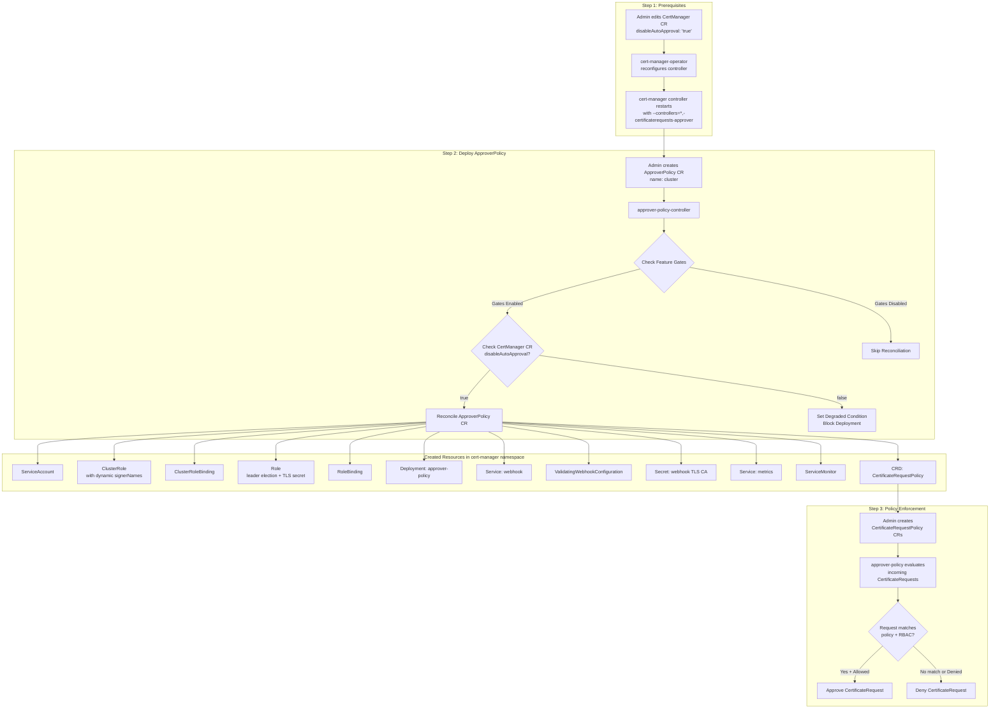

# Extend cert-manager-operator to manage approver-policy

## Summary

This enhancement describes the proposal to extend `cert-manager-operator` to deploy and manage the
[approver-policy](https://github.com/cert-manager/approver-policy) operand with a dedicated controller.
approver-policy is a CertificateRequest approver for cert-manager that enables fine-grained policy control
over which certificate requests are approved or denied based on `CertificateRequestPolicy` resources.

approver-policy will be managed as an operand by an additional controller in cert-manager-operator. The operand
will be installed in the `cert-manager` namespace. When deployed, it replaces cert-manager's built-in
CertificateRequest approver with a policy-driven approval workflow, enabling administrators to define
granular policies governing certificate issuance.

**Critical Prerequisite:** The cert-manager built-in auto-approver **must** be disabled before installing
approver-policy. If both approvers are active simultaneously, they will race and policy enforcement will be
ineffective. This enhancement introduces a `disableAutoApproval` field on the `CertManager` CR to provide
this capability.

**Note:**
Throughout the document, the following terminology means:
- `approver-policy` is the operand managed by the cert-manager operator.
- `approver-policy-controller` is the dedicated controller in cert-manager operator managing the `approver-policy` operand deployment.
- `approverpolicies.operator.openshift.io` is the custom resource for interacting with `approver-policy-controller` to install,
  configure, and uninstall the `approver-policy` operand deployment.
- `CertificateRequestPolicy` is the upstream CRD (from `policy.cert-manager.io` API group) that defines approval policies.

## Motivation

Certificate policy enforcement is critical for enterprise security. Without approver-policy, cert-manager
automatically approves all CertificateRequests, meaning any user with permission to create a CertificateRequest
can obtain any certificate from any configured issuer. This is unacceptable in production environments where
certificate issuance must follow organizational policies.

approver-policy solves this by:

1. **Policy-Based Approval**: Define `CertificateRequestPolicy` resources that specify what attributes (DNS names,
   IP addresses, key algorithms, durations, etc.) are allowed or required in certificate requests.
2. **RBAC Integration**: Policies are bound to users/groups via standard Kubernetes RBAC, so only authorized
   requestors can use specific policies.
3. **Issuer Scoping**: Policies can be scoped to specific issuers (by name, kind, and group), ensuring that
   only authorized issuers are used for certain types of certificates.
4. **Namespace Scoping**: Policies can target specific namespaces by name or label selector.
5. **CEL Validation**: Advanced validation rules using Common Expression Language (CEL) for fine-grained
   attribute validation beyond simple allow-lists.

The `cert-manager-operator` already manages `cert-manager`, `istio-csr`, and `trust-manager`. Extending it
to manage `approver-policy` provides a unified, operator-managed solution for certificate lifecycle
management, trust distribution, and policy enforcement on OpenShift.

### User Stories

- As an OpenShift administrator, I want to have an option to deploy approver-policy as a day-2 operation, so
  that I can enforce certificate issuance policies across my cluster.
- As an OpenShift administrator, I want to disable the built-in cert-manager auto-approver in a controlled
  manner before enabling approver-policy, to avoid racing conditions between approvers.
- As an OpenShift administrator, I want to be able to configure which signer names approver-policy can
  approve or deny, so that I can integrate with external issuers.
- As an OpenShift security engineer, I want to define policies that restrict certificate attributes (DNS names,
  key sizes, durations, etc.) that can be requested, to enforce organizational security standards.
- As an OpenShift security engineer, I want to use RBAC to control which users and service accounts can
  request certificates matching specific policies.
- As an OpenShift administrator, I should be able to uninstall approver-policy when not required as a day-2
  operation without disrupting the cert-manager installation. To restore auto-approval after uninstalling
  approver-policy, the CertManager CR must be deleted and recreated (since `disableAutoApproval` is immutable
  once set to `"true"`).
- As an OpenShift security engineer, I want to be able to identify all artifacts created by approver-policy
  for better auditability.
- As an OpenShift SRE, I should be able to get detailed information as part of different status conditions and
  messages to identify reasons for failures.
- As an OpenShift SRE, I should be able to collect metrics for approver-policy for monitoring.

### Goals

- `cert-manager-operator` to be extended to manage `approver-policy` along with currently managed `cert-manager`,
  `istio-csr`, and `trust-manager`.
- New custom resource (CR) `approverpolicies.operator.openshift.io` to be made available to install and
  configure the approver-policy deployment.
- New field `disableAutoApproval` on the existing `CertManager` CR to safely disable the built-in
  CertificateRequest approver before deploying approver-policy.
- approver-policy operand will always be deployed in the `cert-manager` namespace.
- The `CertificateRequestPolicy` CRD from upstream (`policy.cert-manager.io`) will be installed as part of
  the operand deployment.
- Support configurable signer names for approval scope.
- Dynamic RBAC configuration based on signer names.
- Provide trust-manager integration support via a new `approverPolicy` field on the `TrustManager` CR,
  enabling trust-manager's webhook certificate to be approved by approver-policy when auto-approval is disabled.
- Release as TechPreview behind the operator's `ApproverPolicy` feature gate.

### Non-Goals

- Removing the `approverpolicies.operator.openshift.io` CR object will not remove the `approver-policy`
  deployment or its associated resources (ServiceAccount, RBAC, Services, etc.). Deleting the CR will only stop
  the reconciliation of the resources created for the operand installation. This limitation will be re-evaluated
  in future releases.
- Automatic cleanup of `CertificateRequestPolicy` resources created by users when the ApproverPolicy CR is deleted.
- Automatic re-enabling of the built-in cert-manager auto-approver when approver-policy is uninstalled. The
  `disableAutoApproval` field is immutable once set to `"true"`. To restore auto-approval, users must delete
  and recreate the CertManager CR.
- Managing or configuring the content of `CertificateRequestPolicy` resources. The operator only manages the
  approver-policy deployment; policy authoring is left to the cluster administrator.
- Plugin support for approver-policy. Only the built-in `allowed` and `constraints` evaluators will be available
  in the initial release.

### How approver-policy Works (Background)

This section provides essential background on cert-manager's approval mechanism and how approver-policy
integrates with it.

#### cert-manager's Two-Stage Issuance Flow

cert-manager has a two-stage process for issuing certificates:

1. **Admission** (Kubernetes API layer): Can the `CertificateRequest` resource be created?
2. **Approval** (cert-manager layer): Should this `CertificateRequest` be signed by the issuer?

A cert-manager issuer **will not sign** a CertificateRequest unless it has an `Approved` status
condition. By default, cert-manager's built-in auto-approver sets this condition on every request.
approver-policy replaces this with policy-based decisions.

```
User creates Certificate
        ↓
cert-manager creates CertificateRequest (namespace-scoped)
        ↓
  ┌─────────────────────┐
  │  APPROVAL STAGE     │  ← approver-policy operates here
  │                     │
  │  Approved? Denied?  │
  └─────┬─────────┬─────┘
        │         │
     Approved   Denied → Permanent failure (retried with exponential backoff)
        ↓
  Issuer signs certificate → Secret created
```

**Key properties of CertificateRequests:**

- All `spec` fields (including `request`, `issuerRef`, `usages`, `duration`, `isCA`, and managed
  annotations) are **immutable after creation**. They cannot be modified.
- A CertificateRequest is a one-shot resource — issuance is **not retried** on the same
  CertificateRequest. It is the parent controller's (e.g., Certificate controller) responsibility
  to create a new CertificateRequest for retries.
- A denied CertificateRequest is **terminally failed**. If it was created for a Certificate, the
  Certificate controller retries with exponential backoff by creating a new CertificateRequest.

**Default auto-approver scope:**

The built-in auto-approver **only** approves CertificateRequests referencing cert-manager's internal
issuer types: `cert-manager.io/Issuer` and `cert-manager.io/ClusterIssuer`. CertificateRequests
referencing external issuers are NOT auto-approved unless explicitly configured via `approveSignerNames`.

Ref: [CertificateRequest — Approval](https://cert-manager.io/docs/usage/certificaterequest/#approval)


#### How approver-policy Approves or Denies a CertificateRequest

approver-policy **patches the CertificateRequest's `.status.conditions`** using Server-Side Apply
with the field manager `"approver-policy"`. It sets one of:

- **Approved**: `condition.type=Approved, status=True, reason="policy.cert-manager.io"`
- **Denied**: `condition.type=Denied, status=True, reason="policy.cert-manager.io"` with a message
  explaining why (e.g., which policy fields were violated)
- **Unprocessed** (no matching policy): No status update — the CertificateRequest stays pending

approver-policy's ClusterRole has **cluster-wide** permissions on CertificateRequests:

```yaml
# Read all CertificateRequests
- apiGroups: ["cert-manager.io"]
  resources: ["certificaterequests"]
  verbs: ["list", "watch"]
# Patch their status (to set Approved/Denied conditions)
- apiGroups: ["cert-manager.io"]
  resources: ["certificaterequests/status"]
  verbs: ["patch"]
# Signer approval RBAC (required by cert-manager's webhook)
- apiGroups: ["cert-manager.io"]
  resources: ["signers"]
  verbs: ["approve"]
```

#### Protection Against Unauthorized Approval

cert-manager protects the Approved/Denied conditions at three levels:

1. **Signer RBAC (cert-manager's validating webhook)**: When anyone attempts to set Approved or Denied
   on a CertificateRequest, cert-manager's webhook checks whether the caller has the `approve` verb on
   the `signers` resource for the specific issuer referenced by that CertificateRequest. Without this
   RBAC, the status update is **rejected**. approver-policy has this RBAC via its ClusterRole; random
   users do not.

   The signer RBAC `resourceNames` follow a specific naming convention:
   ```
   # namespaced signers
   <signer-resource-name>.<signer-group>/<signer-namespace>.<signer-name>
   # cluster-scoped signers
   <signer-resource-name>.<signer-group>/<signer-name>
   # all signers of a resource type
   <signer-resource-name>.<signer-group>/*
   ```

   Important: the `approve` verb grants permission to set **both** Approved and Denied conditions.
   The RBAC **must** be granted at the cluster scope (ClusterRole + ClusterRoleBinding).

   Ref: [CertificateRequest — RBAC Syntax](https://cert-manager.io/docs/usage/certificaterequest/#rbac-syntax)

2. **Mutual Exclusivity**: The Approved and Denied conditions are **mutually exclusive** — a
   CertificateRequest cannot have both simultaneously. Both conditions can only have `status: True`.
   This is enforced by cert-manager's validating admission webhook.

3. **Immutability**: Once an Approved or Denied condition is set, it is **permanent and cannot be
   modified or removed**. cert-manager's webhook rejects any attempt to change an existing approval
   condition. 
   
   This means:
   - A user without `approve` signer RBAC → rejected by webhook
   - A user tries to approve after it's already denied → rejected (mutual exclusivity + immutability)
   - A user tries to remove an existing Approved condition → rejected (immutable)

#### Resource Scoping

- **CertificateRequest**: Namespace-scoped. Created in the same namespace as the `Certificate` resource.
- **CertificateRequestPolicy**: Cluster-scoped. Policies are defined globally and use selectors
  (`issuerRef`, `namespace`) to match against namespace-scoped CertificateRequests.

#### How approver-policy Identifies the Requesting Identity

cert-manager embeds **UserInfo fields** into every CertificateRequest at creation time:

- `spec.username` — the identity that created the CertificateRequest
- `spec.groups` — the groups of that identity
- `spec.uid` — the UID
- `spec.extra` — additional attributes

These fields are **set by cert-manager and are immutable** — the webhook rejects any modification.
When a `Certificate` resource triggers a CertificateRequest, `spec.username` is cert-manager's own
ServiceAccount (e.g., `system:serviceaccount:cert-manager:cert-manager`), not the end user who
created the Certificate.

approver-policy uses these fields to perform a **SubjectAccessReview** against the Kubernetes API,
asking: "Does user `{spec.username}` with groups `{spec.groups}` have the `use` verb on
`certificaterequestpolicies` resource named `{policy.Name}`?"

Only policies where the requesting identity has RBAC to `use` them are considered for evaluation.

Ref: `pkg/internal/approver/manager/predicate/predicate.go` — `RBACBound()` function.

#### Policy Evaluation: `allowed` vs `constraints`

A `CertificateRequestPolicy` has two evaluation sections that serve different purposes:

**`allowed`** — defines what attribute **values** are permitted in a request. approver-policy
decodes the base64-encoded PEM X.509 CSR from `spec.request` and inspects: CommonName, DNSNames,
IPAddresses, URIs, EmailAddresses, IsCA, Usages, and full Subject fields (Organization, Country,
OU, Locality, Province, StreetAddress, PostalCode, SerialNumber).

| Field in policy | Field in request  | Result                                 |
| --------------- | ----------------- | -------------------------------------- |
| Omitted         | Empty             | Allowed                                |
| Omitted         | Has a value       | **Denied** (attribute not allowed)     |
| Has values      | Empty             | Allowed (requesting less than allowed) |
| Has values      | Subset of allowed | Allowed                                |
| Has values      | Not a subset      | **Denied**                             |

The `required: true` flag flips the empty-request behavior: if a field is `required` and the
request omits it, the request is **denied**. Without `required`, omitting an attribute is always
allowed (the request is simply asking for less than the maximum). The `required` flag is not
available for `isCA` or `usages`.

String fields in `allowed` support **wildcard matching** with `*`.For example, `"*.example.com"` matches `"foo.example.com"` but not
`"fooexample.com"`. List fields (e.g., `dnsNames`, `usages`) permit requests that are a **subset**
of the allowed values.

Since v0.11.0, `allowed` fields also support **CEL validation rules** for advanced validation beyond
wildcards. CEL expressions receive `self` (the attribute value being validated) and `cr` (an object
with `namespace`, `name`, `username`, and `groups` fields of the CertificateRequest). For multi-valued
attributes, the validation runs once per value. Example:
```yaml
allowed:
  uris:
    validations:
      - rule: "self.startsWith('spiffe://cluster.local/ns/' + cr.namespace + '/sa/')"
        message: "SPIFFE ID must match the requesting namespace"
```

**`constraints`** — defines **bounds/limits** that the request must satisfy. Currently supports
`minDuration`, `maxDuration`, and `privateKey` (algorithm, minSize, maxSize). An omitted constraint
means **no restriction** on that attribute.

| Section       | Omitted field means        | Purpose                 |
| ------------- | -------------------------- | ----------------------- |
| `allowed`     | Attribute is **forbidden** | Define permitted values |
| `constraints` | **No restriction**         | Define bounds/limits    |

Both `allowed` and `constraints` must pass for a request to be approved by a given policy.

#### Policy Selectors

A `CertificateRequestPolicy` must define at least one selector (`issuerRef` or `namespace`), even if
set to `{}` (match all). If **both** selectors are defined, both must match for the policy to apply.

- **`issuerRef`**: Matches against the CertificateRequest's `spec.issuerRef` (name, kind, group).
  Supports wildcards. An empty `{}` matches all issuers.
- **`namespace`**: Matches against the namespace of the CertificateRequest. Supports `matchNames`
  (with wildcards) and `matchLabels` (standard Kubernetes label selector). An empty `{}` matches all
  namespaces.

#### Approval Decision Logic

```
For each CertificateRequest:
  1. List all CertificateRequestPolicies and filter through predicates:
     a. Policy is Ready (status condition)
     b. Policy selector.issuerRef matches request's issuerRef
     c. Policy selector.namespace matches request's namespace (if defined)
     d. Both selectors must match if both are defined
     e. Requesting identity (spec.username/groups) has RBAC to "use" the policy

  2. If no policies match → UNPROCESSED (stays pending, not approved, not denied)

  3. For each matching policy, run all evaluators (allowed + constraints):
     - If ANY policy permits → APPROVED (with message: "Approved by CertificateRequestPolicy: <name>")
     - If ALL matching policies deny → DENIED (with aggregated violation messages)
```

This is **deny-by-default**: no matching policy = no approval = no certificate issued. A
CertificateRequest that is neither approved nor denied (no matching policy) will **not be processed**
by cert-manager until it receives an approval or denial from some approver.

**Condition conventions**: The `Reason` field of Approved/Denied conditions identifies **who** set
the condition (e.g., `"policy.cert-manager.io"` for approver-policy). The `Message` field explains
**why** (e.g., the policy name that approved it, or the list of violations that caused denial).


## Proposal

### Design for Disabling the Default Approver

This is the most critical design decision in this enhancement. cert-manager ships with a built-in CertificateRequest
approver that automatically approves all requests. When approver-policy is deployed alongside this built-in approver,
**both will race to process CertificateRequests**, making policy enforcement ineffective.

Per the [upstream documentation](https://cert-manager.io/docs/policy/approval/approver-policy/installation/):

> If the default approver is not disabled in cert-manager, approver-policy will race with cert-manager
> and policy will be ineffective.

#### Design Choice: Explicit `disableAutoApproval` Field on CertManager CR

A new field `disableAutoApproval` will be added to the existing `CertManager` CR spec
(`certmanagers.operator.openshift.io`). This field gives users explicit, auditable control over disabling
the built-in approver.

**How it works:**
1. When `disableAutoApproval` is set to `"true"`, the operator injects `--controllers=*,-certificaterequests-approver`
   into the cert-manager controller deployment args. This disables only the built-in approver while keeping all
   other cert-manager controllers functional.
2. The cert-manager controller pod restarts with the updated args.
3. From this point, **no CertificateRequests will be auto-approved** — an external approver (like approver-policy)
   must be deployed to approve them.

**Why this design:**

| Alternative                                             | Pros                                                                                                          | Cons                                                                                                                     |
| ------------------------------------------------------- | ------------------------------------------------------------------------------------------------------------- | ------------------------------------------------------------------------------------------------------------------------ |
| **A) `disableAutoApproval` on CertManager CR** (chosen) | Explicit user control; auditable; decoupled from approver-policy lifecycle; prevents accidental policy bypass | Requires two-step process (disable auto-approval, then deploy approver-policy)                                           |
| **B) Auto-disable when ApproverPolicy CR created**      | One-step; automatic                                                                                           | Hidden side-effect; cross-resource dependency; hard to debug if cert-manager restarts unexpectedly; reversing is complex |

Option A is chosen because:
- **Safety**: The two-step process ensures users understand the implications — disabling auto-approval
  stops all certificate issuance until an external approver is in place.
- **Explicitness**: The field is clearly documented and auditable in the CertManager CR.
- **Decoupling**: The cert-manager configuration is independent of the approver-policy lifecycle.

**Workflow:**
```
Step 1: Disable auto-approval
  oc patch certmanager cluster --type merge -p '{"spec":{"disableAutoApproval":"true"}}'
  → cert-manager controller restarts with --controllers=*,-certificaterequests-approver

Step 2: Deploy approver-policy
  oc apply -f approver-policy-cr.yaml
  → approver-policy-controller deploys the operand

Step 3: Create CertificateRequestPolicies
  oc apply -f my-policy.yaml
  → approver-policy evaluates future CertificateRequests against this policy
```

**Safety Enforcement in ApproverPolicy Controller:**

The `approver-policy-controller` will check the `CertManager` CR before deploying the operand:
- If `disableAutoApproval` is NOT `"true"`, the controller will set a `Degraded` condition on the
  `ApproverPolicy` CR with a message.
- The controller will **not deploy** the approver-policy operand until auto-approval is disabled. This
  prevents the race condition entirely.

#### Preventing Re-enabling Auto-Approval (Two-Layer Defense)

A critical edge case is: **what happens if a user re-enables auto-approval after approver-policy is already
deployed?** If allowed, the built-in cert-manager approver would restart and race with approver-policy again,
silently bypassing all `CertificateRequestPolicy` rules. This is especially dangerous because there is no
visible error — CertificateRequests appear to work normally, but policies are being bypassed.

To prevent this, we implement a **two-layer defense**:

**Layer 1 — CEL Immutability Guard (Preventive):**

The `disableAutoApproval` field is made **immutable once set to `"true"`** using a CEL validation rule on the
CertManager CRD

```go
// +kubebuilder:validation:XValidation:rule="oldSelf != 'true' || self == 'true'",message="disableAutoApproval cannot be changed from 'true' to 'false' once set"
```

This means:
- The Kubernetes API server **rejects** any update that attempts to change `disableAutoApproval` from `"true"` to
  `"false"`. The race condition can never happen through a normal API update.
- If a user truly needs to re-enable auto-approval (e.g., after fully removing approver-policy and cleaning up
  all resources), they must **delete and recreate the CertManager CR**. This intentional friction prevents
  accidental security degradation.
- This is consistent with the existing `defaultNetworkPolicy` field which uses the same immutability pattern:
  `"defaultNetworkPolicy cannot be changed from 'true' to 'false' once set"`.

**Layer 2 — Continuous Validation in approver-policy-controller (Detective):**

As a defense-in-depth measure, the `approver-policy-controller` **continuously watches** the `CertManager` CR
during every reconciliation loop. Even with the CEL guard, there are edge cases where auto-approval could be
re-enabled (e.g., CertManager CR deleted and recreated without the field, or manual etcd manipulation):

- On each reconciliation, the controller checks `CertManager` CR's `disableAutoApproval` value.
- If `disableAutoApproval` is not `"true"`, the controller:
  1. Sets a `Degraded` condition on the `ApproverPolicy` CR
  2. Sets the `Ready` condition to `False` to clearly indicate the operand is not functioning correctly.
  3. The approver-policy deployment **remains running** (not torn down) but the status clearly indicates
     the problem, allowing the user to fix the CertManager CR without re-deploying.


### Deploying approver-policy

`approver-policy` will be installed and managed by `cert-manager-operator`. A new custom resource is defined
to configure the `approver-policy` operand. The `approverpolicies.operator.openshift.io` CR can be added
day-2 to install `approver-policy` post the installation or upgrade of cert-manager operator on OpenShift
clusters.

Starting from cert-manager-operator v1.21.0, approver-policy will be available as Tech Preview. The feature
requires the operator's `ApproverPolicy` feature gate to be enabled.

A new controller will be added to `cert-manager-operator` to manage and maintain the `approver-policy`
deployment in the desired state. `approver-policy-controller` will make use of static manifest templates
for creating the resources required for successfully deploying `approver-policy`.

Each of the resources created for `approver-policy` deployment will have the below set of labels added:
* `app: cert-manager-approver-policy`
* `app.kubernetes.io/name: cert-manager-approver-policy`
* `app.kubernetes.io/instance: cert-manager-approver-policy`
* `app.kubernetes.io/version: "vX.Y.Z"`
* `app.kubernetes.io/managed-by: cert-manager-operator`
* `app.kubernetes.io/part-of: cert-manager-operator`

These labels aid in identifying and managing the `approver-policy` components within the cluster, thereby
facilitating operations like monitoring and resource discovery.

`approverpolicies.operator.openshift.io` CR object is a cluster-scoped singleton object. The singleton
pattern is enforced through two mechanisms:
- An XValidation rule in the CRD rejects any ApproverPolicy CR that is not named `cluster`
- The controller only reconciles ApproverPolicy CRs with the name `cluster`, ignoring any others

`approver-policy` will always be deployed in the `cert-manager` namespace.

Configurations made available in the spec of `approverpolicies.operator.openshift.io` CR are passed as
command line arguments to `approver-policy` and updating these configurations would cause a new rollout
of the `approver-policy` deployment.

A fork of [upstream approver-policy](https://github.com/cert-manager/approver-policy) will be created
[downstream](https://github.com/openshift/cert-manager-approver-policy) for downstream management.

### Workflow Description

The following diagram illustrates the end-to-end workflow for approver-policy deployment and policy enforcement:



- Installation of `approver-policy`
  - An OpenShift user first sets `disableAutoApproval: "true"` on the `CertManager` CR named `cluster`.
  - The cert-manager operator reconfigures the cert-manager controller to disable the built-in approver.
  - The user then creates the `approverpolicies.operator.openshift.io` CR with name `cluster`.
  - `approver-policy-controller` validates that auto-approval is disabled, then deploys `approver-policy`
    in the `cert-manager` namespace.

- Uninstallation of `approver-policy`
  - An OpenShift user deletes the `approverpolicies.operator.openshift.io` CR.
  - `approver-policy-controller` will not uninstall `approver-policy`, but will only stop reconciling the
    Kubernetes resources created for installing the operand. Please refer to the `Non-Goals` section for
    more details.
  - **Important**: After removing approver-policy, the user must ensure another external approver is in place,
    or delete and recreate the CertManager CR to restore auto-approval (since `disableAutoApproval` is
    immutable once set to `"true"` and cannot be changed back to `"false"` via an API update).

### API Extensions

#### 1. Changes to Existing `CertManager` CR

A new field `disableAutoApproval` is added to the `CertManagerSpec`:

```golang
// CertManagerSpec defines the desired state of CertManager.
type CertManagerSpec struct {
	apiv1.OperatorSpec `json:",inline"`

	// ... existing fields ...

	// DisableAutoApproval when set to "true", disables the built-in CertificateRequest
	// approver in the cert-manager controller. This is required when using an external
	// approver like approver-policy to prevent racing conditions between approvers.
	//
	// WARNING: When this is set to "true" and no external approver (such as approver-policy)
	// is deployed, ALL CertificateRequests will remain in a pending/unapproved state and
	// no certificates will be issued.
	//
	// Valid values are: "true" or "false" (default: "false", auto-approval enabled).
	//
	// This field is immutable once set to "true". Disabling auto-approval
	// is a security-critical action — re-enabling it while an external approver (like
	// approver-policy) is active would cause both approvers to race, silently bypassing all
	// certificate issuance policies. Users should carefully plan their approval strategy
	// before enabling this field. To re-enable auto-approval after removing the external
	// approver, the CertManager CR must be deleted and recreated.
	//
	//
	// +kubebuilder:default:="false"
	// +kubebuilder:validation:Enum:="true";"false"
	// +kubebuilder:validation:XValidation:rule="oldSelf != 'true' || self == 'true'",message="disableAutoApproval cannot be changed from 'true' to 'false' once set"
	// +kubebuilder:validation:Optional
	// +optional
	DisableAutoApproval string `json:"disableAutoApproval,omitempty"`
}
```

#### 2. Changes to Existing `TrustManager` CR

> **Context**: When the built-in cert-manager auto-approver is disabled (required for approver-policy),
> trust-manager's webhook TLS certificate has no approver. The field below
> enables explicit integration between trust-manager and approver-policy to resolve this. For the full
> problem description, rationale, and controller behavior, see the
> [Interaction with Trust-Manager](#interaction-with-trust-manager) section.

A new `approverPolicy` field is added to `TrustManagerConfig` to support explicit integration with
approver-policy for trust-manager's webhook TLS certificate approval:

```golang
// TrustManagerConfig defines configuration specific to trust-manager.
type TrustManagerConfig struct {
	// ... existing fields ...

	// approverPolicy configures the integration with approver-policy for trust-manager's
	// webhook TLS certificate approval.
	//
	// When the built-in cert-manager auto-approver is disabled (via disableAutoApproval
	// on the CertManager CR), trust-manager's webhook CertificateRequest will have no
	// approver. Enabling this field creates a CertificateRequestPolicy and associated
	// RBAC that allows approver-policy to approve trust-manager's webhook certificate
	// automatically.
	//
	// Prerequisites for enabling this field:
	// 1. The CertManager CR must have disableAutoApproval set to "true"
	// 2. The ApproverPolicy CR must be created (approver-policy operand must be deployed)
	//
	// If disableAutoApproval is "true" but this field is not enabled, the trust-manager
	// controller will set a Degraded condition because the webhook certificate cannot be
	// approved without either the built-in approver or an approver-policy integration.
	//
	// If this field is enabled but the ApproverPolicy operand is not yet deployed,
	// the controller will set a Degraded condition until approver-policy becomes available.
	//
	// +kubebuilder:validation:Optional
	// +optional
	ApproverPolicy ApproverPolicyWebhookConfig `json:"approverPolicy,omitempty"`
}

// ApproverPolicyWebhookConfig configures the approver-policy integration for
// trust-manager's webhook TLS certificate.
type ApproverPolicyWebhookConfig struct {
	// enabled controls whether to create a CertificateRequestPolicy and RBAC
	// resources that allow approver-policy to approve trust-manager's webhook
	// TLS certificate.
	//
	// Prerequisites for enabling:
	// 1. CertManager CR must have disableAutoApproval: "true"
	// 2. ApproverPolicy CR must be created (approver-policy operand deployed)
	//
	// +kubebuilder:default:="Disabled"
	// +kubebuilder:validation:Enum:=Enabled;Disabled
	// +optional
	Enabled ApproverPolicyWebhookPolicy `json:"enabled,omitempty"`

	// certManagerServiceAccount is the name of cert-manager's ServiceAccount
	// that will be granted permission to use the CertificateRequestPolicy.
	// This is the ServiceAccount that cert-manager uses when creating
	// CertificateRequests for trust-manager's webhook certificate.
	// Defaults to "cert-manager".
	// +kubebuilder:default:="cert-manager"
	// +kubebuilder:validation:MinLength:=1
	// +kubebuilder:validation:MaxLength:=253
	// +kubebuilder:validation:Optional
	// +optional
	CertManagerServiceAccount string `json:"certManagerServiceAccount,omitempty"`
}

// ApproverPolicyWebhookPolicy defines the policy for the approver-policy webhook integration.
// +kubebuilder:validation:Enum:=Enabled;Disabled
type ApproverPolicyWebhookPolicy string

const (
	ApproverPolicyWebhookEnabled  ApproverPolicyWebhookPolicy = "Enabled"
	ApproverPolicyWebhookDisabled ApproverPolicyWebhookPolicy = "Disabled"
)
```

#### 3. New `ApproverPolicy` CR

Below new API `approverpolicies.operator.openshift.io` is introduced for managing approver-policy.

```golang
package v1alpha1

import (
	corev1 "k8s.io/api/core/v1"
	metav1 "k8s.io/apimachinery/pkg/apis/meta/v1"
)

// +k8s:deepcopy-gen:interfaces=k8s.io/apimachinery/pkg/runtime.Object
// +kubebuilder:object:root=true

// ApproverPolicyList is a list of ApproverPolicy objects.
type ApproverPolicyList struct {
	metav1.TypeMeta `json:",inline"`

	// metadata is the standard list's metadata.
	// More info: https://git.k8s.io/community/contributors/devel/sig-architecture/api-conventions.md#metadata
	metav1.ListMeta `json:"metadata"`
	Items           []ApproverPolicy `json:"items"`
}

// +genclient
// +genclient:nonNamespaced
// +k8s:deepcopy-gen:interfaces=k8s.io/apimachinery/pkg/runtime.Object
// +kubebuilder:object:root=true
// +kubebuilder:subresource:status
// +kubebuilder:resource:path=approverpolicies,scope=Cluster,categories={cert-manager-operator}
// +kubebuilder:printcolumn:name="Ready",type="string",JSONPath=".status.conditions[?(@.type=='Ready')].status"
// +kubebuilder:printcolumn:name="Message",type="string",JSONPath=".status.conditions[?(@.type=='Ready')].message"
// +kubebuilder:printcolumn:name="AGE",type="date",JSONPath=".metadata.creationTimestamp"
// +kubebuilder:metadata:labels={"app.kubernetes.io/name=approverpolicy", "app.kubernetes.io/part-of=cert-manager-operator"}

// ApproverPolicy describes the configuration and information about the managed approver-policy deployment.
// The name must be `cluster` to make ApproverPolicy a singleton, allowing only one instance per cluster.
//
// When an ApproverPolicy is created, approver-policy is deployed in the cert-manager namespace.
//
// IMPORTANT: Before creating this CR, the built-in cert-manager auto-approver MUST be disabled by setting
// `disableAutoApproval: "true"` on the CertManager CR named "cluster". Without this, approver-policy will
// race with cert-manager's built-in approver and policy enforcement will be ineffective.
//
// +kubebuilder:validation:XValidation:rule="self.metadata.name == 'cluster'",message="ApproverPolicy is a singleton, .metadata.name must be 'cluster'"
// +operator-sdk:csv:customresourcedefinitions:displayName="ApproverPolicy"
type ApproverPolicy struct {
	metav1.TypeMeta `json:",inline"`

	// metadata is the standard object's metadata.
	// More info: https://git.k8s.io/community/contributors/devel/sig-architecture/api-conventions.md#metadata
	metav1.ObjectMeta `json:"metadata,omitempty"`

	// spec is the specification of the desired behavior of the ApproverPolicy.
	// +kubebuilder:validation:Required
	// +required
	Spec ApproverPolicySpec `json:"spec"`

	// status is the most recently observed status of the ApproverPolicy.
	// +kubebuilder:validation:Optional
	// +optional
	Status ApproverPolicyStatus `json:"status,omitempty"`
}

// ApproverPolicySpec defines the desired state of ApproverPolicy.
// Note: approver-policy operand is always deployed in the cert-manager namespace.
type ApproverPolicySpec struct {
	// approverPolicyConfig configures the approver-policy operand's behavior.
	// +kubebuilder:validation:Required
	// +required
	ApproverPolicyConfig ApproverPolicyConfig `json:"approverPolicyConfig"`

	// controllerConfig configures the operator's behavior for resource creation.
	// +kubebuilder:validation:Optional
	// +optional
	ControllerConfig ApproverPolicyControllerConfig `json:"controllerConfig,omitempty"`
}

// ApproverPolicyConfig configures the approver-policy operand's behavior.
type ApproverPolicyConfig struct {
	// logLevel configures the verbosity of approver-policy logging.
	// +kubebuilder:default:=1
	// +kubebuilder:validation:Minimum:=1
	// +kubebuilder:validation:Maximum:=5
	// +kubebuilder:validation:Optional
	// +optional
	LogLevel int32 `json:"logLevel,omitempty"`

	// logFormat specifies the output format for approver-policy logging.
	// Supported formats are "text" and "json".
	// +kubebuilder:validation:Enum:="text";"json"
	// +kubebuilder:default:="text"
	// +kubebuilder:validation:Optional
	// +optional
	LogFormat string `json:"logFormat,omitempty"`

	// approveSignerNames is a list of signer names that approver-policy will be given
	// permission to approve and deny. CertificateRequests referencing these signer names
	// can be processed by approver-policy.
	//
	// When using approver-policy with external issuers, the external issuer signer names
	// MUST be included here so that approver-policy has permissions to approve and deny
	// CertificateRequests that reference them. If empty (default), approver-policy will have permission to
  // approve/deny CertificateRequests for ALL signers.
	//
	// This field can have a maximum of 50 entries.
	// Each entry can have a maximum of 253 characters.
	//
	// ref: https://cert-manager.io/docs/concepts/certificaterequest/#approval
	//
	// +listType=set
	// +kubebuilder:validation:MinItems:=0
	// +kubebuilder:validation:MaxItems:=50
	// +kubebuilder:validation:items:MinLength:=1
	// +kubebuilder:validation:items:MaxLength:=253
	// +kubebuilder:validation:Optional
	// +optional
	ApproveSignerNames []string `json:"approveSignerNames,omitempty"`

	// resources defines the compute resource requirements for the approver-policy pod.
	// ref: https://kubernetes.io/docs/concepts/configuration/manage-resources-containers/
	// +kubebuilder:validation:Optional
	// +optional
	Resources corev1.ResourceRequirements `json:"resources,omitempty"`

	// affinity defines scheduling constraints for the approver-policy pod.
	// ref: https://kubernetes.io/docs/concepts/scheduling-eviction/assign-pod-node/
	// +kubebuilder:validation:Optional
	// +optional
	Affinity *corev1.Affinity `json:"affinity,omitempty"`

	// tolerations allows the approver-policy pod to be scheduled on tainted nodes.
	// This field can have a maximum of 50 entries.
	// ref: https://kubernetes.io/docs/concepts/scheduling-eviction/taint-and-toleration/
	// +listType=atomic
	// +kubebuilder:validation:MinItems:=0
	// +kubebuilder:validation:MaxItems:=50
	// +kubebuilder:validation:Optional
	// +optional
	Tolerations []corev1.Toleration `json:"tolerations,omitempty"`

	// nodeSelector restricts which nodes the approver-policy pod can be scheduled on.
	// This field can have a maximum of 50 entries.
	// ref: https://kubernetes.io/docs/concepts/configuration/assign-pod-node/
	// +mapType=atomic
	// +kubebuilder:validation:MinProperties:=0
	// +kubebuilder:validation:MaxProperties:=50
	// +kubebuilder:validation:Optional
	// +optional
	NodeSelector map[string]string `json:"nodeSelector,omitempty"`
}

// ApproverPolicyControllerConfig configures the operator's behavior for
// creating approver-policy resources.
type ApproverPolicyControllerConfig struct {
	// labels to apply to all resources created for the approver-policy deployment.
	// These labels are in addition to the default labels added by the operator.
	// This field can have a maximum of 20 entries.
	// +mapType=granular
	// +kubebuilder:validation:MinProperties:=0
	// +kubebuilder:validation:MaxProperties:=20
	// +kubebuilder:validation:Optional
	// +optional
	Labels map[string]string `json:"labels,omitempty"`

	// annotations to apply to all resources created for the approver-policy deployment.
	// This field can have a maximum of 20 entries.
	// +mapType=granular
	// +kubebuilder:validation:MinProperties:=0
	// +kubebuilder:validation:MaxProperties:=20
	// +kubebuilder:validation:Optional
	// +optional
	Annotations map[string]string `json:"annotations,omitempty"`
}

// ApproverPolicyStatus defines the observed state of ApproverPolicy.
// The status is updated by the operator during each reconciliation.
type ApproverPolicyStatus struct {
	// conditions holds information about the current state of the approver-policy deployment.
	// Standard conditions include:
	// - Ready: True when approver-policy is fully operational
	// - Degraded: True when there's an issue affecting functionality
	// - Progressing: True when changes are being applied
	ConditionalStatus `json:",inline,omitempty"`

	// approverPolicyImage is the container image (name:tag) used for approver-policy.
	// This is populated from the RELATED_IMAGE_APPROVER_POLICY environment variable.
	ApproverPolicyImage string `json:"approverPolicyImage,omitempty"`
}
```

### Topology Considerations

#### Hypershift / Hosted Control Planes

None

#### Standalone Clusters

None

#### OpenShift Kubernetes Engine

None

#### Single-node Deployments or MicroShift

None

### Implementation Details/Notes/Constraints

#### Deployment Model

cert-manager-operator uses Helm charts provided by the approver-policy project to derive static manifests
for deploying the operand.

1. **Manifest Generation**: A script (`hack/update-approver-policy-manifests.sh`) renders the upstream
   Helm chart into static manifests, patches labels, and embeds them as bindata in the operator binary.

The generated manifests are stored in `bindata/approver-policy/resources/`

2. **Runtime Customization**: When reconciling an ApproverPolicy CR, the controller:
   - Loads the static manifests from bindata
   - Modifies resources based on user-provided configuration in the ApproverPolicy CR (e.g., log level,
     signer names, scheduling, etc.)
   - Applies the customized resources to the cluster


> **Note on port discrepancy**: The Helm chart defaults `app.webhook.port` to `10250`, while the binary
> (`options.go`) defaults `--webhook-port` to `6443`. The operator uses Helm-derived manifests and explicitly
> passes `--webhook-port=10250` as a container arg, so the Helm chart value (`10250`) takes precedence.

#### Feature Gate Implementation

The approver-policy controller is gated behind the operator's feature gate for the Tech Preview release:

**Operator Feature Gate**: The cert-manager-operator defines an `ApproverPolicy` feature gate in its
feature gate configuration. This gate must be explicitly enabled.

#### DisableAutoApproval Implementation

When `disableAutoApproval: "true"` is set on the CertManager CR, the cert-manager operator's deployment
reconciliation adds `--controllers=*,-certificaterequests-approver` to the cert-manager controller
deployment args via a deployment hook (`withDisableAutoApprovalHook`). This disables only the built-in
approver controller while keeping all other cert-manager controllers functional. The cert-manager
controller pod restarts with the updated args.

#### Webhook TLS Management

approver-policy manages its own webhook TLS certificates using cert-manager's
[DynamicSource](https://pkg.go.dev/github.com/cert-manager/cert-manager/pkg/server/tls) CA provider.
This means:

1. approver-policy generates its own CA certificate and stores it in a Secret
   (`cert-manager-approver-policy-tls` in the `cert-manager` namespace).
2. The CA certificate is injected into the `ValidatingWebhookConfiguration` via the
   `cert-manager.io/inject-ca-from-secret` annotation.
3. Leaf certificates for the webhook server are derived from this CA.

This is different from trust-manager which uses a cert-manager `Certificate` and `Issuer` for its webhook TLS.
The operator creates the initial empty TLS Secret with the `cert-manager.io/allow-direct-injection: "true"`
annotation, and approver-policy handles the rest at runtime.

#### RBAC Configuration

The controller creates the following RBAC resources for approver-policy:

**Cluster-scoped resources:**
- `ClusterRole` (cert-manager-approver-policy): Permissions to list/watch CertificateRequestPolicies,
  patch CertificateRequestPolicy status, list/watch CertificateRequests, patch CertificateRequest status,
  approve signers (with optional resourceNames), list/watch RBAC resources, create events, create
  SubjectAccessReviews, and list/watch namespaces.
- `ClusterRoleBinding`: Binds ClusterRole to the ServiceAccount.

**Namespace-scoped resources (cert-manager namespace):**
- `Role` (cert-manager-approver-policy): Leader election (leases) and TLS secret management.
- `RoleBinding`: Binds Role to ServiceAccount.

**Dynamic ClusterRole Rules:**

The ClusterRole for approver-policy is dynamically configured based on the `approveSignerNames` configuration:

- **Default (approveSignerNames empty)**: The "approve" verb on "signers" resource has no `resourceNames`
  restriction, allowing approval for all signers.
- **approveSignerNames specified**: The "approve" verb on "signers" resource includes `resourceNames` listing
  only the specified signer names.

#### CRD Management

The `CertificateRequestPolicy` CRD (`policy.cert-manager.io_certificaterequestpolicies`) is a cluster-scoped
resource from the upstream `policy.cert-manager.io` API group. This CRD will be:

1. Included in the operator's bindata alongside the other approver-policy manifests.
2. Applied to the cluster when the ApproverPolicy CR is created.

#### Manifests for installing approver-policy

Below are example static manifests used for creating required resources for installing approver-policy:

1. ServiceAccount
   ```yaml
   apiVersion: v1
   kind: ServiceAccount
   metadata:
     name: cert-manager-approver-policy
     namespace: cert-manager
     labels:
       app: cert-manager-approver-policy
       app.kubernetes.io/name: cert-manager-approver-policy
       app.kubernetes.io/instance: cert-manager-approver-policy
       app.kubernetes.io/managed-by: cert-manager-operator
       app.kubernetes.io/part-of: cert-manager-operator
   ```

2. ClusterRole
   ```yaml
   apiVersion: rbac.authorization.k8s.io/v1
   kind: ClusterRole
   metadata:
     name: cert-manager-approver-policy
     labels:
       app.kubernetes.io/name: cert-manager-approver-policy
       app.kubernetes.io/managed-by: cert-manager-operator
   rules:
     - apiGroups: ["policy.cert-manager.io"]
       resources: ["certificaterequestpolicies"]
       verbs: ["list", "watch"]
     - apiGroups: ["policy.cert-manager.io"]
       resources: ["certificaterequestpolicies/status"]
       verbs: ["patch"]
     - apiGroups: ["cert-manager.io"]
       resources: ["certificaterequests"]
       verbs: ["list", "watch"]
     - apiGroups: ["cert-manager.io"]
       resources: ["certificaterequests/status"]
       verbs: ["patch"]
     - apiGroups: ["cert-manager.io"]
       resources: ["signers"]
       verbs: ["approve"]
       # Dynamic: resourceNames added when approveSignerNames is specified
       # resourceNames:
       #   - "issuers.cert-manager.io/*"
       #   - "clusterissuers.cert-manager.io/*"
     - apiGroups: ["rbac.authorization.k8s.io"]
       resources: ["roles", "clusterroles", "rolebindings", "clusterrolebindings"]
       verbs: ["list", "watch"]
     - apiGroups: ["events.k8s.io"]
       resources: ["events"]
       verbs: ["create", "patch"]
     - apiGroups: ["authorization.k8s.io"]
       resources: ["subjectaccessreviews"]
       verbs: ["create"]
     - apiGroups: [""]
       resources: ["namespaces"]
       verbs: ["list", "watch"]
   ```

3. ClusterRoleBinding
   ```yaml
   apiVersion: rbac.authorization.k8s.io/v1
   kind: ClusterRoleBinding
   metadata:
     name: cert-manager-approver-policy
     labels:
       app.kubernetes.io/name: cert-manager-approver-policy
       app.kubernetes.io/managed-by: cert-manager-operator
   roleRef:
     apiGroup: rbac.authorization.k8s.io
     kind: ClusterRole
     name: cert-manager-approver-policy
   subjects:
     - kind: ServiceAccount
       name: cert-manager-approver-policy
       namespace: cert-manager
   ```

4. Role (leader election and TLS secret)
   ```yaml
   apiVersion: rbac.authorization.k8s.io/v1
   kind: Role
   metadata:
     name: cert-manager-approver-policy
     namespace: cert-manager
     labels:
       app.kubernetes.io/name: cert-manager-approver-policy
       app.kubernetes.io/managed-by: cert-manager-operator
   rules:
     - apiGroups: ["coordination.k8s.io"]
       resources: ["leases"]
       verbs: ["create"]
     - apiGroups: ["coordination.k8s.io"]
       resources: ["leases"]
       verbs: ["get", "update"]
       resourceNames: ["policy.cert-manager.io"]
     - apiGroups: [""]
       resources: ["secrets"]
       verbs: ["get", "list", "watch", "create", "update"]
       resourceNames: ["cert-manager-approver-policy-tls"]
   ```

5. RoleBinding
   ```yaml
   apiVersion: rbac.authorization.k8s.io/v1
   kind: RoleBinding
   metadata:
     name: cert-manager-approver-policy
     namespace: cert-manager
     labels:
       app.kubernetes.io/name: cert-manager-approver-policy
       app.kubernetes.io/managed-by: cert-manager-operator
   roleRef:
     apiGroup: rbac.authorization.k8s.io
     kind: Role
     name: cert-manager-approver-policy
   subjects:
     - kind: ServiceAccount
       name: cert-manager-approver-policy
       namespace: cert-manager
   ```

6. Deployment
   ```yaml
   apiVersion: apps/v1
   kind: Deployment
   metadata:
     name: cert-manager-approver-policy
     namespace: cert-manager
     labels:
       app: cert-manager-approver-policy
       app.kubernetes.io/name: cert-manager-approver-policy
       app.kubernetes.io/instance: cert-manager-approver-policy
       app.kubernetes.io/managed-by: cert-manager-operator
   spec:
     replicas: 1
     selector:
       matchLabels:
         app: cert-manager-approver-policy
     template:
       metadata:
         labels:
           app: cert-manager-approver-policy
           app.kubernetes.io/name: cert-manager-approver-policy
           app.kubernetes.io/instance: cert-manager-approver-policy
       spec:
         serviceAccountName: cert-manager-approver-policy
         securityContext:
           runAsNonRoot: true
           seccompProfile:
             type: RuntimeDefault
         nodeSelector:
           kubernetes.io/os: linux
         containers:
           - name: cert-manager-approver-policy
             image: quay.io/jetstack/cert-manager-approver-policy:vX.Y.Z
             imagePullPolicy: IfNotPresent
             ports:
               - name: webhook
                 containerPort: 10250
               - name: metrics
                 containerPort: 9402
               - name: healthcheck
                 containerPort: 6060
             readinessProbe:
               httpGet:
                 port: 6060
                 path: /readyz
               initialDelaySeconds: 3
               periodSeconds: 7
             args:
               - --log-format=text
               - --log-level=1
               - --metrics-bind-address=:9402
               - --readiness-probe-bind-address=:6060
               - --webhook-host=0.0.0.0
               - --webhook-port=10250
               - --webhook-service-name=cert-manager-approver-policy
               - --webhook-ca-secret-namespace=cert-manager
               - --webhook-ca-secret-name=cert-manager-approver-policy-tls
             resources: {}
             securityContext:
               allowPrivilegeEscalation: false
               capabilities:
                 drop:
                   - ALL
               readOnlyRootFilesystem: true
   ```

7. Service (webhook)
   ```yaml
   apiVersion: v1
   kind: Service
   metadata:
     name: cert-manager-approver-policy
     namespace: cert-manager
     labels:
       app: cert-manager-approver-policy
       app.kubernetes.io/name: cert-manager-approver-policy
       app.kubernetes.io/managed-by: cert-manager-operator
   spec:
     type: ClusterIP
     ports:
       - port: 443
         targetPort: 10250
         protocol: TCP
         name: webhook
     selector:
       app: cert-manager-approver-policy
   ```

8. ValidatingWebhookConfiguration
   ```yaml
   apiVersion: admissionregistration.k8s.io/v1
   kind: ValidatingWebhookConfiguration
   metadata:
     name: cert-manager-approver-policy
     labels:
       app: cert-manager-approver-policy
       app.kubernetes.io/name: cert-manager-approver-policy
       app.kubernetes.io/managed-by: cert-manager-operator
     annotations:
       cert-manager.io/inject-ca-from-secret: "cert-manager/cert-manager-approver-policy-tls"
   webhooks:
     - name: policy.cert-manager.io
       rules:
         - apiGroups: ["policy.cert-manager.io"]
           apiVersions: ["*"]
           operations: ["CREATE", "UPDATE"]
           resources: ["*/*"]
       admissionReviewVersions: ["v1", "v1beta1"]
       timeoutSeconds: 5
       failurePolicy: Fail
       sideEffects: None
       clientConfig:
         service:
           name: cert-manager-approver-policy
           namespace: cert-manager
           path: /validate-policy-cert-manager-io-v1alpha1-certificaterequestpolicy
   ```

9. Secret (webhook TLS CA - initially empty, managed by approver-policy at runtime)
   ```yaml
   apiVersion: v1
   kind: Secret
   metadata:
     name: cert-manager-approver-policy-tls
     namespace: cert-manager
     annotations:
       cert-manager.io/allow-direct-injection: "true"
     labels:
       app: cert-manager-approver-policy
       app.kubernetes.io/name: cert-manager-approver-policy
       app.kubernetes.io/managed-by: cert-manager-operator
   ```

10. Service (metrics)
    ```yaml
    apiVersion: v1
    kind: Service
    metadata:
      name: cert-manager-approver-policy-metrics
      namespace: cert-manager
      labels:
        app: cert-manager-approver-policy
        app.kubernetes.io/name: cert-manager-approver-policy
        app.kubernetes.io/managed-by: cert-manager-operator
    spec:
      type: ClusterIP
      ports:
        - port: 9402
          targetPort: 9402
          protocol: TCP
          name: metrics
      selector:
        app: cert-manager-approver-policy
    ```

11. ServiceMonitor
    ```yaml
    apiVersion: monitoring.coreos.com/v1
    kind: ServiceMonitor
    metadata:
      name: cert-manager-approver-policy
      namespace: cert-manager
      labels:
        app: cert-manager-approver-policy
        app.kubernetes.io/name: cert-manager-approver-policy
        app.kubernetes.io/managed-by: cert-manager-operator
        prometheus: default
    spec:
      jobLabel: cert-manager-approver-policy
      selector:
        matchLabels:
          app: cert-manager-approver-policy
      namespaceSelector:
        matchNames:
          - cert-manager
      endpoints:
        - port: metrics
          path: /metrics
          interval: 10s
          scrapeTimeout: 5s
    ```

### Risks and Mitigations

- **Race Condition with Built-in Approver**: If `disableAutoApproval` is not set to `"true"` on the CertManager
  CR before deploying approver-policy, both approvers will race to process CertificateRequests and policy
  enforcement will be ineffective.
  - Mitigation: The approver-policy-controller checks the CertManager CR and blocks deployment with a `Degraded`
    condition if auto-approval is not disabled. Clear documentation and status messages guide the user.

- **Certificate Issuance Stops When Auto-Approval Disabled**: When `disableAutoApproval` is set to `"true"` and
  no external approver is deployed, ALL CertificateRequests will remain unapproved and no certificates will be
  issued. This could disrupt existing workloads.
  - Mitigation: Clear warning in the API documentation and status conditions. Users should only disable
    auto-approval when they are ready to deploy approver-policy and have prepared `CertificateRequestPolicy`
    resources.

- **Re-enabling Auto-Approval While Approver-Policy Is Active**: If auto-approval is re-enabled while
  approver-policy is still deployed, both approvers race and policy enforcement is silently bypassed.
  - Mitigation: **Two-layer defense** — (1) CEL immutability guard on `disableAutoApproval` prevents changing
    it from `"true"` to `"false"` via API updates (same pattern as `defaultNetworkPolicy`), and (2) the
    approver-policy-controller continuously validates the CertManager CR and sets a `Degraded` condition if
    auto-approval is detected as enabled. See [Preventing Re-enabling Auto-Approval](#preventing-re-enabling-auto-approval-two-layer-defense) section for details.

- **Re-enabling Auto-Approval After Removing Approver-Policy**: Since `disableAutoApproval` is immutable once
  set to `"true"`, a user who removes approver-policy and wants to return to auto-approval must delete and
  recreate the CertManager CR. This causes a brief disruption to cert-manager.
  - Mitigation: Documentation clearly states the required steps. The CertManager CR recreation is intentional
    friction to prevent accidental security degradation. All cert-manager configuration (overrideArgs, network
    policies, etc.) should be re-applied when recreating the CR.

- **Trust-Manager Webhook Certificate Blocked When Auto-Approval Is Disabled**: trust-manager uses a cert-manager
  `Certificate` resource to provision its webhook TLS. When `disableAutoApproval: "true"` is set, the built-in
  approver is disabled, and trust-manager's webhook `CertificateRequest` will have no approver. This blocks
  trust-manager's webhook from starting (new deployments) or renewing (existing deployments).
  - Mitigation: A new `approverPolicy` field on the TrustManager CR allows users to explicitly enable the
    creation of a `CertificateRequestPolicy` and RBAC resources for trust-manager's webhook certificate.
    The trust-manager-controller validates all three preconditions (auto-approval disabled, field enabled,
    approver-policy deployed) and degrades with clear messages if any are missing. See the
    [Interaction with Trust-Manager](#interaction-with-trust-manager) section for full details.

### Interaction with Trust-Manager

This is a critical cross-operand concern that arises when both trust-manager and approver-policy are managed
by the cert-manager operator.

Ref: [trust-manager installation — approver-policy integration](https://cert-manager.io/docs/trust/trust-manager/installation/)

#### Background

The operator currently creates these resources for trust-manager's webhook TLS (in `bindata/trust-manager/resources/`):

1. **Issuer** (`trust-manager`, self-signed)
2. **Certificate** (`trust-manager`) — requests a certificate from the Issuer, which creates a `CertificateRequest`
3. The `CertificateRequest` is auto-approved by cert-manager's built-in approver → webhook TLS Secret is created


#### The Problem

When `disableAutoApproval: "true"` is set on the CertManager CR:
- The built-in approver is disabled (`--controllers=*,-certificaterequests-approver`)
- trust-manager's `CertificateRequest` is never approved
- The webhook TLS Secret is never created (or not renewed on expiry)

This affects both deployment ordering scenarios:

| Scenario                                                    | What happens                                                                                                                                                                                                  |
| ----------------------------------------------------------- | ------------------------------------------------------------------------------------------------------------------------------------------------------------------------------------------------------------- |
| trust-manager deployed **first**, approver-policy **later** | trust-manager works initially (built-in approver active), but when auto-approval is later disabled and the webhook cert expires, the renewal `CertificateRequest` won't be approved → webhook breaks silently |
| approver-policy deployed **first**, trust-manager **later** | trust-manager's initial `CertificateRequest` is never approved → deployment never becomes ready                                                                                                               |

#### Upstream Solution

Upstream trust-manager solves this with Helm chart flags:

```bash
helm upgrade trust-manager oci://quay.io/jetstack/charts/trust-manager \
  --install \
  --namespace cert-manager \
  --wait \
  --set app.webhook.tls.approverPolicy.enabled=true \
  --set app.webhook.tls.approverPolicy.certManagerNamespace=cert-manager \
  --set app.webhook.tls.approverPolicy.certManagerServiceAccount=cert-manager
```

When `enabled=true`, the Helm chart creates three additional resources:

1. **CertificateRequestPolicy** (`trust-manager-policy`):
   ```yaml
   apiVersion: policy.cert-manager.io/v1alpha1
   kind: CertificateRequestPolicy
   metadata:
     name: trust-manager-policy
   spec:
     allowed:
       commonName:
         value: "trust-manager.cert-manager.svc"
         required: true
       dnsNames:
         values: ["trust-manager.cert-manager.svc"]
         required: true
     selector:
       issuerRef:
         name: trust-manager
         kind: Issuer
         group: cert-manager.io
   ```

2. **ClusterRole** (`trust-manager-policy-role`):
   ```yaml
   rules:
     - apiGroups: ["policy.cert-manager.io"]
       resources: ["certificaterequestpolicies"]
       verbs: ["use"]
       resourceNames: ["trust-manager-policy"]
   ```

3. **ClusterRoleBinding** (`trust-manager-policy-binding`): Binds cert-manager's ServiceAccount to the
   ClusterRole, allowing it to "use" the `trust-manager-policy` CertificateRequestPolicy when creating
   CertificateRequests for trust-manager's webhook certificate.

**New bindata files (in `bindata/trust-manager/resources/`):**
- `certificaterequestpolicy_trust-manager-policy.yml`
- `clusterrole_trust-manager-policy-role.yml`
- `clusterrolebinding_trust-manager-policy-binding.yml`

#### Proposed Operator Handling: Explicit API Field on TrustManager CR

Rather than having the trust-manager-controller automatically detect the `disableAutoApproval` state and
create resources implicitly (which would require a cross-resource watch), we use an **explicit API field**
on the TrustManager CR.

The API definition for the new `approverPolicy` field on `TrustManagerConfig` is described in
[Changes to Existing TrustManager CR](#2-changes-to-existing-trustmanager-cr).

> **Note**: The upstream Helm chart exposes `certManagerNamespace` because users may install cert-manager
> in any namespace. In our operator, cert-manager is always deployed in the `cert-manager` namespace, so
> this value is hardcoded and not exposed through the API.

**Trust-manager-controller validation matrix:**

The trust-manager-controller validates three preconditions during each reconciliation:

| `disableAutoApproval` | `approverPolicy.enabled` | CertificateRequestPolicy CRD exists? | Controller behavior                                                                                                                                                                                                                                    |
| --------------------- | ------------------------ | ------------------------------------ | ------------------------------------------------------------------------------------------------------------------------------------------------------------------------------------------------------------------------------------------------------ |
| `"false"` / empty     | any                      | any                                  | **Normal** — built-in approver handles webhook cert. Clean up policy resources if they exist from a previous configuration.                                                                                                                            |
| `"true"`              | `Disabled`               | any                                  | **Degrade**: `"Auto-approval is disabled on CertManager CR but approverPolicy integration is not enabled. Enable spec.trustManagerConfig.approverPolicy.enabled on the TrustManager CR, or trust-manager's webhook certificate will not be approved."` |
| `"true"`              | `Enabled`                | No                                   | **Degrade**: `"approverPolicy integration is enabled but approver-policy is not installed (CertificateRequestPolicy CRD not found). Deploy the ApproverPolicy CR first."`                                                                              |
| `"true"`              | `Enabled`                | Yes                                  | **Create** CertificateRequestPolicy + ClusterRole + ClusterRoleBinding. Proceed with normal reconciliation.                                                                                                                                            |


**Why the trust-manager-controller owns this (not the approver-policy-controller):**
- trust-manager owns its own webhook TLS lifecycle end-to-end
- No cross-controller dependency — each controller manages its own concerns independently
- Resources are cleaned up naturally when trust-manager CR is deleted
- Follows the upstream pattern where these resources are part of the trust-manager Helm chart
- The approver-policy-controller has no knowledge of trust-manager and does not need to

**Required user workflow (explicit 3-step ordering):**

```
Step 1: Disable auto-approval
  oc patch certmanager cluster --type merge -p '{"spec":{"disableAutoApproval":"true"}}'

Step 2: Deploy approver-policy
  oc apply -f approverpolicy-cr.yaml

Step 3: Enable trust-manager approver-policy integration
  oc patch trustmanager cluster --type merge \
    -p '{"spec":{"trustManagerConfig":{"approverPolicy":{"enabled":"Enabled"}}}}'
```

### Drawbacks

None

## Design Details

### Open Questions [optional]

None

## Test Plan

- Verify approver-policy controller starts only when the operator's `ApproverPolicy` feature gate is enabled.
- Verify that setting `disableAutoApproval: "true"` on the CertManager CR causes the cert-manager controller
  to restart with `--controllers=*,-certificaterequests-approver`.
- Verify that creating an ApproverPolicy CR when `disableAutoApproval` is NOT `"true"` results in a `Degraded`
  condition and no deployment.
- Enable `approver-policy-controller` by creating `approverpolicies.operator.openshift.io` CR and check the
  behavior with default approver-policy configuration.
- Enable `approver-policy-controller` by creating the `approverpolicies.operator.openshift.io` CR with
  permutations of configurations and validate the behavior:
  - Custom approveSignerNames
  - Common configurations: log levels and formats, resources, node selector, tolerations and affinity
- Test CertificateRequestPolicy functionality:
  - Create `CertificateRequestPolicy` resources with various allowed/constraints configurations
  - Verify that CertificateRequests matching policies are approved
  - Verify that CertificateRequests NOT matching any policy are denied
  - Verify RBAC-based policy binding works correctly
- Test the full lifecycle:
  1. Disable auto-approval on CertManager CR
  2. Deploy approver-policy
  3. Create policies
  4. Verify policy enforcement
  5. Delete ApproverPolicy CR
  6. Delete and recreate CertManager CR (without `disableAutoApproval: "true"`) to restore auto-approval
- **Trust-Manager interaction tests:**
  - **Validation matrix tests (all four combinations):**
    - Verify that when `disableAutoApproval` is `"false"`, trust-manager operates normally regardless
      of `approverPolicy.enabled`. Policy resources are cleaned up
      if they exist from a previous configuration.
    - Verify that when `disableAutoApproval: "true"` and `approverPolicy.enabled: Disabled`, the trust-manager-controller
      sets a Degraded condition with a clear message instructing the user to enable the field.
    - Verify that when `disableAutoApproval: "true"` and `approverPolicy.enabled: Enabled` but the
      `CertificateRequestPolicy` CRD does NOT exist, the controller sets a Degraded condition with a clear
      message instructing the user to deploy the ApproverPolicy CR first.
    - Verify that when `disableAutoApproval: "true"`, `approverPolicy.enabled: Enabled`, and the CRD exists,
      the controller creates `CertificateRequestPolicy` + ClusterRole + ClusterRoleBinding.
  - **End-to-end approval flow:**
    - Verify that trust-manager's webhook certificate `CertificateRequest` is approved by approver-policy
      when all three preconditions are met.
  - **Deployment ordering tests:**
    - trust-manager deployed first, then auto-approval disabled and approver-policy deployed, then
      `approverPolicy.enabled: Enabled` set on TrustManager CR → webhook cert renewal works.
    - approver-policy deployed first (auto-approval disabled), then trust-manager deployed with
      `approverPolicy.enabled: Enabled` → initial webhook cert approved.
  - **Cleanup tests:**
    - Verify that when `disableAutoApproval` is changed back (via CR delete/recreate) and `approverPolicy.enabled`
      is set to `Disabled`, the `CertificateRequestPolicy` and RBAC resources are cleaned up.
  - **certManagerServiceAccount field tests:**
    - Verify that the `ClusterRoleBinding` subject uses the value from `approverPolicy.certManagerServiceAccount`
      (default: `cert-manager`).

## Graduation Criteria

### Dev Preview -> Tech Preview

N/A. The feature will be released directly as Tech Preview.

### Tech Preview

approver-policy will be available as Tech Preview starting from cert-manager-operator v1.21.0 release.

### Tech Preview -> GA

- Feature is enabled by default; feature available on all clusters.
- Complete end-user documentation.
- Complete UTs and e2e tests are present.

### Removing a deprecated feature

None.

## Upgrade / Downgrade Strategy

On upgrade:
- cert-manager-operator will have functionality to enable approver-policy and based on the administrator
  configuration, approver-policy will be deployed and available for usage.
- The `disableAutoApproval` field on CertManager CR is backward compatible — existing CertManager CRs without
  this field will continue to have auto-approval enabled (default behavior).

On downgrade:
- Operator downgrade is not supported.

## Version Skew Strategy

approver-policy will be supported for:
- cert-manager Operator v1.21.0+

## Operational Aspects of API Extensions

### Failure Modes

- **cert-manager Auto-Approval Not Disabled**: If the configured `CertManager` CR does not have
  `disableAutoApproval: "true"`, the ApproverPolicy status will show a Degraded condition and the
  operand will not be deployed.

- **cert-manager Not Available**: If cert-manager is not installed or not running, approver-policy will
  not function correctly as it depends on cert-manager's CertificateRequest resources.

- **Webhook TLS Issues**: If the approver-policy webhook TLS CA Secret cannot be created or managed,
  the webhook will not be available and `CertificateRequestPolicy` creation/updates will fail.

- **Trust-Manager Webhook Certificate Blocked**: If `disableAutoApproval: "true"` is set on the
  CertManager CR but the user has not enabled `approverPolicy.enabled: Enabled` on the TrustManager CR,
  trust-manager will degrade.


### Example Configurations

- Example ApproverPolicy CR with default signer names:
  ```yaml
  apiVersion: operator.openshift.io/v1alpha1
  kind: ApproverPolicy
  metadata:
    name: cluster
  spec:
    approverPolicyConfig:
      logLevel: 1
      logFormat: text
  ```

- Example ApproverPolicy CR with custom signer names (for external issuers):
  ```yaml
  apiVersion: operator.openshift.io/v1alpha1
  kind: ApproverPolicy
  metadata:
    name: cluster
  spec:
    approverPolicyConfig:
      logLevel: 1
      logFormat: text
      approveSignerNames:
        - "issuers.cert-manager.io/*"
        - "clusterissuers.cert-manager.io/*"
        - "googlecasclusterissuers.cas-issuer.jetstack.io/*"
        - "googlecasissuers.cas-issuer.jetstack.io/*"
  ```

- Example CertManager CR with auto-approval disabled:
  ```yaml
  apiVersion: operator.openshift.io/v1alpha1
  kind: CertManager
  metadata:
    name: cluster
  spec:
    disableAutoApproval: "true"
    # ... other fields ...
  ```

- Example TrustManager CR with approver-policy integration enabled:
  ```yaml
  apiVersion: operator.openshift.io/v1alpha1
  kind: TrustManager
  metadata:
    name: cluster
  spec:
    trustManagerConfig:
      approverPolicy:
        enabled: Enabled
        certManagerServiceAccount: cert-manager  # default
      # ... other fields ...
  ```

- Example CertificateRequestPolicy (created by users after approver-policy is deployed):
  ```yaml
  apiVersion: policy.cert-manager.io/v1alpha1
  kind: CertificateRequestPolicy
  metadata:
    name: allow-internal-certs
  spec:
    allowed:
      commonName:
        value: "*.internal.example.com"
      dnsNames:
        values:
          - "*.internal.example.com"
          - "*.svc.cluster.local"
        required: true
      usages:
        - digital signature
        - key encipherment
        - server auth
    constraints:
      minDuration: 1h
      maxDuration: 720h
      privateKey:
        algorithm: RSA
        minSize: 2048
    selector:
      issuerRef:
        name: "internal-ca"
        kind: "ClusterIssuer"
        group: "cert-manager.io"
      namespace:
        matchLabels:
          cert-policy: internal
  ```

## Support Procedures

- Listing all the resources created for installing the `approver-policy`
  ```bash
  oc get ClusterRoles,ClusterRoleBindings,Deployments,Roles,RoleBindings,Services,ServiceAccounts,ValidatingWebhookConfigurations,Secrets,ServiceMonitors -l "app.kubernetes.io/name=cert-manager-approver-policy" -n cert-manager
  ```

- Checking ApproverPolicy status
  ```bash
  oc get approverpolicy cluster -o yaml
  ```

- Checking if auto-approval is disabled
  ```bash
  oc get certmanager cluster -o jsonpath='{.spec.disableAutoApproval}'
  ```

- Listing all CertificateRequestPolicy resources
  ```bash
  oc get certificaterequestpolicies
  ```

- Checking CertificateRequest approval status
  ```bash
  oc get certificaterequests -A -o wide
  ```

## Implementation History

N/A

## Why Not Validating Admission Policy (VAP)?

VAP and MAP were evaluated as alternatives. While VAP uses CEL, it operates at a fundamentally
different layer and **cannot replace** approver-policy.

**Key reasons:**

1. **Different layer**: VAP operates at admission (can the resource be *created*?), not approval
   (should it be *signed*?). VAP cannot set the `Approved`/`Denied` conditions that cert-manager
   requires before signing — approver-policy can.

2. **Cannot parse CSR content**: The critical policy fields (DNS names, IPs, URIs, subject, key
   algorithm/size) are encoded inside a base64-encoded PEM X.509 CSR in `spec.request`. CEL cannot
   decode base64, strip PEM headers, or parse ASN.1/DER. The only fields VAP can see on a
   CertificateRequest are `isCA`, `usages`, `duration`, and `issuerRef`.

3. **Fail-open vs. fail-closed**: approver-policy denies by default (no matching policy = no
   approval). VAP passes through if no rule matches.

4. **Bypass risk with Certificate-level VAP**: Validating `Certificate` resources instead is
   trivially bypassed — users can create `CertificateRequest` directly, skipping `Certificate`
   entirely. approver-policy validates at the `CertificateRequest` level regardless of origin.

5. **No RBAC-based policy binding**: approver-policy binds policies to identities via the `use`
   verb on `certificaterequestpolicies`. VAP has no equivalent.

| Capability                                 | approver-policy | VAP                                  |
| ------------------------------------------ | --------------- | ------------------------------------ |
| Parse CSR content (DNS, IPs, subject, key) | **Yes**         | No                                   |
| Integrates with cert-manager approval flow | **Yes**         | No                                   |
| Safe-by-default (deny if no policy)        | **Yes**         | No (fail-open)                       |
| RBAC-based policy binding                  | **Yes**         | No                                   |
| Covers direct CertificateRequest creation  | **Yes**         | Only if targeting CertificateRequest |
| Requires extra component                   | Yes             | No (built-in)                        |

**VAP as complementary defense-in-depth**: VAP can still be useful as an *additional* layer — e.g.,
restricting which issuers a namespace can reference, or blocking invalid configurations early on
`Certificate` resources. This is additive and does not remove the need for approver-policy.

## Alternatives (Not Implemented)

- **Use Validating Admission Policy (VAP) instead of approver-policy**: See the "Why Not Validating
  Admission Policy (VAP)?" section above for the detailed analysis.

- **Auto-disable auto-approval when ApproverPolicy CR is created**: This was considered but rejected because
  it introduces a hidden side-effect that modifies the CertManager resource without explicit user action. This
  could be surprising and difficult to debug, especially if cert-manager restarts unexpectedly. The explicit
  `disableAutoApproval` field provides better auditability and control.

- **Keep `disableAutoApproval` mutable (allow toggling back to `"false"`)**: This was considered to allow
  operational flexibility (e.g., removing approver-policy without recreating the CertManager CR). However,
  this creates a dangerous security gap — a user could accidentally re-enable auto-approval while
  approver-policy is active, silently bypassing all certificate policies. The immutability pattern (same as
  `defaultNetworkPolicy`) was chosen because security-critical settings should not be easily reversible.
  The friction of recreating the CertManager CR is an acceptable trade-off for preventing silent policy bypass.

## Infrastructure Needed [optional]

- [openshift/cert-manager-approver-policy](https://github.com/openshift/cert-manager-approver-policy) GitHub
  repository (forked from upstream).
- approver-policy container image published to the OpenShift registry.

