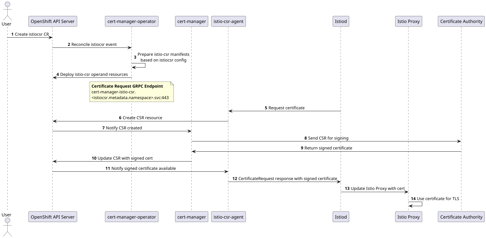

# Extend cert-manager-operator to manage istio-csr.

## Summary

This enhancement describes the proposal to extend cert-manager-operator to deploy and manage the `istio-csr` agent with
a dedicated controller. `OpenShift Service Mesh` facilitates the security of both intra-cluster and external service
communications through mTLS. istio-csr is an agent that allows Istio workload and control plane components to be secured
using cert-manager. It is responsible for receiving certificate signing requests for all members of the Istio mesh, and
signing them through cert-manager. cert-manager enables obtaining certificates from [various](https://docs.openshift.com/container-platform/4.15/security/cert_manager_operator/index.html#cert-manager-issuer-types_cert-manager-operator-about) certificate authorities
and also ensures the validity of certificates by renewing them before they expire. `OpenShift Service Mesh` secures
intra-cluster and external service connections with TLS encryption. `cert-manager` can be used to obtain the required
certificates through custom resources `issuer` and `clusterissuer`. And `istio-csr` is the agent that simplifies the
process of obtaining the certificates from the `cert-manager` for `OpenShift Service Mesh`. `cert-manager-operator`
manages `cert-manager` and extending the operator to manage `istio-csr` agent will help the users to use all the solutions
mentioned above effectively and easily.

**Note:**
Throughout the document, the following terminology means.
- `istio-csr` agent is the operand managed by the cert-manager operator.
- `istio-csr-controller` is the dedicated controller in cert-manager operator managing the `istio-csr` agent deployment.
- `istiocsr.operator.openshift.io` is the custom resource for interacting with `istio-csr-controller` to install, configure
  and uninstall the `istio-csr` agent deployment.

## Motivation

Customers intend to use certificates issued by their own certificate authority rather than self-signed certificates,
which are the default configuration for OSSM in production. This is achieved by using cert-manager as the certificate
manager, requiring integration with OSSM so that certificate requests are signed and issued through cert-manager.

### User Stories

- As an OpenShift user, I want to have an option to dynamically deploy `istio-csr` agent, so that it can be used only
  when required by creating the custom resource.
- As an OpenShift user, I want to have an option to dynamically configure `istio-csr` agent, so that only the required
  features can be enabled by updating the custom resource.
- As an OpenShift user, I should be able to remove `istio-csr` agent when not required by removing the custom resource,
  and controller should clean up all resources created for the `istio-csr` agent deployment.
- As an OpenShift user, I should be able to install `istio-csr` agent in the upgrade cluster where istiod control plane
  is active and should be able to update the certificate endpoint to `istio-csr` agent endpoint.
- As an OpenShift user, I want to have an option to dynamically enable monitoring for the `istio-csr` project and
  to use the OpenShift monitoring solution when required.

### Goals

- `cert-manager-operator` to be extended to manage `istio-csr` agent along with currently managed `cert-manager`.
- New custom resource(CR) `istiocsr.operator.openshift.io` to be made available to install, configure and uninstall deployment.

### Non-Goals

- `istio-csr` agent can be used only with supported version of `OpenShift Service Mesh`. Please refer `Version Skew Strategy`
  section for more details.

## Proposal

`istio-csr` agent will be installed and managed by `cert-manager-operator`. A new custom resource is defined to configure
the `istio-csr` agent. The `istiocsr.operator.openshift.io` CR can be added day2 to install `istio-csr` agent post the
installation or upgrade of cert-manager operator on the existing OpenShift clusters.

A new controller will be added to `cert-manager-operator` to manage and maintain the `istio-csr` agent deployment in
desired state which can be monitored by user through the status sub-resource of the new custom resource.

`istio-csr` agent controller will make use of static manifest templates for creating below resources required for
successfully deploying `istio-csr` agent. Please refer `Implementation Details/Notes/Constraints` section for more details.
* `certificate.cert-manager.io`
* `clusterissuer.cert-manager.io`
* `issuer.cert-manager.io`
* `clusterrole.rbac.authorization.k8s.io`
* `clusterrolebinding.rbac.authorization.k8s.io`
* `deployment`
* `service`
* `servicemonitor.monitoring.coreos.com`
* `namespace`
* `role.rbac.authorization.k8s.io`
* `rolebinding.rbac.authorization.k8s.io`
* `serviceaccount`

Each of the resource created for `istio-csr` agent deployment will have below set of labels added.
* `app: cert-manager-istio-csr`
* `app.kubernetes.io/name: cert-manager-istio-csr`
* `app.kubernetes.io/instance: cert-manager-istio-csr`
* `app.kubernetes.io/version: "v0.14.2"`
* `app.kubernetes.io/managed-by: cert-manager-operator`
* `app.kubernetes.io/part-of: cert-manager-operator`

These labels adhere to Kubernetes and OpenShift conventions, aiding in identifying, categorizing, and managing the
`istio-csr` components within the cluster environment, thereby facilitating operations like monitoring and resource discovery.

Refer below links for more information on the labels used
- [Guidelines for Labels and Annotations for OpenShift applications](https://github.com/redhat-developer/app-labels/blob/master/labels-annotation-for-openshift.adoc)
- [Well-Known Labels, Annotations and Taints](https://kubernetes.io/docs/reference/labels-annotations-taints/)

`istiocsr.operator.openshift.io` CR object is a singleton object and is enforced in CRD to have the name as `default`.
`istio-csr` agent will be deployed in the namespace where the CR object is created.

Configurations made available in the spec of `istiocsr.operator.openshift.io` CR are passed as command line arguments to
`istio-csr` agent and updating these configurations would cause new rollout of the `istio-csr` agent deployment, which
means a new pod will be created and old pod will terminate resulting in `istio-csr` agent restart.
All configurations can be updated on-demand, except for below which can be configured only once during or after creating `istiocsr.operator.openshift.io`
CR, which is enforced in the CRD using CEL validations.
- `.spec.istioCSRConfig.certmanager.issuerRef`
- `.spec.istioCSRConfig.istiodTLSConfig.privateKeySize`
- `.spec.istioCSRConfig.server.certificateKeySize`
- `.spec.istioCSRConfig.server.signatureAlgorithm`
- `.spec.istioCSRConfig.istio.revisions`
- `.spec.istioCSRConfig.istio.namespace`

`istiocsr.operator.openshift.io` CR status sub-resource will be used for updating the status of the `istio-csr` agent
installation, any error encountered while creating the required resources or the reconciling the state.

A fork of [upstream](https://github.com/cert-manager/istio-csr) `istio-csr` will be created [downstream](https://github.com/openshift/cert-manager-istio-csr)
for better version management.

### Workflow Description

- Installation of `istio-csr` agent
  - An OpenShift user creates the `istiocsr.operator.openshift.io` CR.
  - `istio-csr-controller` based on the configuration in `istiocsr.operator.openshift.io` CR, installs `istio-csr` agent
    in the CR created namespace.

.

- Uninstallation of `istio-csr` agent
  - An OpenShift user deletes the `istiocsr.operator.openshift.io` CR.
  - `istio-csr-controller` will remove all the resources created for installing `istio-csr` agent.

.

### API Extensions

Below new API `istiocsrs.operator.openshift.io` is introduced for managing istio-csr.
```golang
package v1alpha1

// +k8s:deepcopy-gen:interfaces=k8s.io/apimachinery/pkg/runtime.Object
// +kubebuilder:object:root=true

// IstioCSRList is a list of IstioCSR objects.
type IstioCSRList struct {
	metav1.TypeMeta `json:",inline"`

	// metadata is the standard list's metadata.
	// More info: https://git.k8s.io/community/contributors/devel/sig-architecture/api-conventions.md#metadata
	metav1.ListMeta `json:"metadata"`
	Items           []IstioCSR `json:"items"`
}

// +genclient
// +k8s:deepcopy-gen:interfaces=k8s.io/apimachinery/pkg/runtime.Object
// +kubebuilder:object:root=true
// +kubebuilder:subresource:status
// +kubebuilder:resource:path=istiocsrs,scope=Namespaced,categories={cert-manager-operator, istio-csr, istiocsr},shortName=istiocsr;icsr
// +kubebuilder:printcolumn:name="GRPC Endpoint",type="string",JSONPath=".status.istioCSRGRPCEndpoint"
// +kubebuilder:printcolumn:name="Ready",type="string",JSONPath=".status.conditions[?(@.type=='Ready')].status"
// +kubebuilder:printcolumn:name="Message",type="string",JSONPath=".status.conditions[?(@.type=='Ready')].message"
// +kubebuilder:printcolumn:name="AGE",type="date",JSONPath=".metadata.creationTimestamp"
// +kubebuilder:metadata:labels={"app.kubernetes.io/name=istiocsr", "app.kubernetes.io/part-of=cert-manager-operator"}

// IstioCSR describes the configuration and information about the managed istio-csr
// agent. The name must be `default` to make IstioCSR a singleton that is, to
// allow only one instance of IstioCSR per namespace.
//
// When an IstioCSR is created, istio-csr agent is deployed in the IstioCSR
// created namespace.
//
// +kubebuilder:validation:XValidation:rule="self.metadata.name == 'default'",message="istiocsr is a singleton, .metadata.name must be 'default'"
// +operator-sdk:csv:customresourcedefinitions:displayName="IstioCSR"
type IstioCSR struct {
	metav1.TypeMeta `json:",inline"`

	// metadata is the standard object's metadata.
	// More info: https://git.k8s.io/community/contributors/devel/sig-architecture/api-conventions.md#metadata
	metav1.ObjectMeta `json:"metadata,omitempty"`

	// spec is the specification of the desired behavior of the IstioCSR.
	// +kubebuilder:validation:Required
	// +required
	Spec IstioCSRSpec `json:"spec"`

	// status is the most recently observed status of the IstioCSR.
	// +kubebuilder:validation:Optional
	// +optional
	Status IstioCSRStatus `json:"status,omitempty"`
}

// IstioCSRSpec is the specification of the desired behavior of the IstioCSR.
type IstioCSRSpec struct {
	// istioCSRConfig configures the istio-csr agent's behavior.
	// +kubebuilder:validation:Required
	// +required
	IstioCSRConfig IstioCSRConfig `json:"istioCSRConfig"`

	// controllerConfig configures the controller for setting up defaults to
	// enable the istio-csr agent.
	// +kubebuilder:validation:Optional
	// +optional
	ControllerConfig *ControllerConfig `json:"controllerConfig,omitempty"`

	// cleanupOnDeletion indicates that the operator should remove all resources
	// created for the istio-csr agent installation, including the cert-manager `Certificate`
	// resource created for obtaining a certificate for istiod using the configured issuer.
	// This field is immutable once set.
	// +kubebuilder:validation:XValidation:rule="self == oldSelf",message="cleanupOnDeletion is immutable once set"
	// +kubebuilder:validation:Enum:="true";"false"
	// +kubebuilder:default:="false"
	// +kubebuilder:validation:Optional
	// +optional
	CleanupOnDeletion string `json:"cleanupOnDeletion,omitempty"`
}

// IstioCSRConfig configures the istio-csr agent's behavior.
type IstioCSRConfig struct {
	// logLevel supports a value range as per [Kubernetes logging guidelines](https://github.com/kubernetes/community/blob/master/contributors/devel/sig-instrumentation/logging.md#what-method-to-use).
	// +kubebuilder:default:=1
	// +kubebuilder:validation:Minimum:=1
	// +kubebuilder:validation:Maximum:=5
	// +kubebuilder:validation:Optional
	// +optional
	LogLevel int32 `json:"logLevel,omitempty"`

	// logFormat specifies the output format for istio-csr agent logging.
	// Supported log formats are text and json.
	// +kubebuilder:validation:Enum:="text";"json"
	// +kubebuilder:default:="text"
	// +kubebuilder:validation:Optional
	// +optional
	LogFormat string `json:"logFormat,omitempty"`

	// Istio-csr creates a ConfigMap named `istio-ca-root-cert` containing the root CA certificate, which the Istio data
	// plane uses to verify server certificates. Its default behavior is to create and monitor ConfigMaps in all namespaces.
	// The istioDataPlaneNamespaceSelector restricts the namespaces where the ConfigMap is created by using label selectors,
	// such as maistra.io/member-of=istio-system. This selector is also attached to all desired namespaces that are part of
	// the data plane. istioDataPlaneNamespaceSelector must not exceed 4096 characters.
	// +kubebuilder:example:="maistra.io/member-of=istio-system"
	// +kubebuilder:validation:MinLength:=0
	// +kubebuilder:validation:MaxLength:=4096
	// +kubebuilder:validation:Optional
	// +optional
	IstioDataPlaneNamespaceSelector string `json:"istioDataPlaneNamespaceSelector,omitempty"`

	// certManager is for configuring cert-manager specifics.
	// +kubebuilder:validation:Required
	// +required
	CertManager CertManagerConfig `json:"certManager"`

	// istiodTLSConfig is for configuring istiod certificate specifics.
	// +kubebuilder:validation:Required
	// +required
	IstiodTLSConfig IstiodTLSConfig `json:"istiodTLSConfig"`

	// server is for configuring the server endpoint used by istio
	// for obtaining the certificates.
	// +kubebuilder:validation:Optional
	// +optional
	Server *ServerConfig `json:"server,omitempty"`

	// istio is for configuring the istio specifics.
	// +kubebuilder:validation:Required
	// +required
	Istio IstioConfig `json:"istio"`

	// resources is for defining the resource requirements.
	// Cannot be updated.
	// ref: https://kubernetes.io/docs/concepts/configuration/manage-resources-containers/
	// +kubebuilder:validation:Optional
	// +optional
	Resources corev1.ResourceRequirements `json:"resources,omitempty"`

	// affinity is for setting scheduling affinity rules.
	// ref: https://kubernetes.io/docs/concepts/scheduling-eviction/assign-pod-node/
	// +kubebuilder:validation:Optional
	// +optional
	Affinity *corev1.Affinity `json:"affinity,omitempty"`

	// tolerations is for setting the pod tolerations.
	// tolerations can have a maximum of 10 entries.
	// ref: https://kubernetes.io/docs/concepts/scheduling-eviction/taint-and-toleration/
	// +listType=atomic
	// +kubebuilder:validation:MinItems:=0
	// +kubebuilder:validation:MaxItems:=10
	// +kubebuilder:validation:Optional
	// +optional
	Tolerations []corev1.Toleration `json:"tolerations,omitempty"`

	// nodeSelector is for defining the scheduling criteria using node labels.
	// nodeSelector can have a maximum of 10 entries.
	// ref: https://kubernetes.io/docs/concepts/configuration/assign-pod-node/
	// +mapType=atomic
	// +kubebuilder:validation:MinProperties:=0
	// +kubebuilder:validation:MaxProperties:=10
	// +kubebuilder:validation:Optional
	// +optional
	NodeSelector map[string]string `json:"nodeSelector,omitempty"`
}

// CertManagerConfig is for configuring cert-manager specifics.
// +kubebuilder:validation:XValidation:rule="!has(oldSelf.issuerRef) && !has(self.issuerRef) || has(oldSelf.issuerRef) && has(self.issuerRef)",message="issuerRef may only be configured during creation"
type CertManagerConfig struct {
	// issuerRef contains details of the referenced object used for obtaining certificates. When
	// `issuerRef.Kind` is `Issuer`, it must exist in the `.spec.istioCSRConfig.istio.namespace`.
	// This field is immutable once set.
	// +kubebuilder:validation:XValidation:rule="self == oldSelf",message="issuerRef is immutable once set"
	// +kubebuilder:validation:XValidation:rule="self.kind.lowerAscii() == 'issuer' || self.kind.lowerAscii() == 'clusterissuer'",message="kind must be either 'Issuer' or 'ClusterIssuer'"
	// +kubebuilder:validation:XValidation:rule="self.group.lowerAscii() == 'cert-manager.io'",message="group must be 'cert-manager.io'"
	// +kubebuilder:validation:Required
	// +required
	IssuerRef certmanagerv1.ObjectReference `json:"issuerRef"`

	// istioCACertificate when provided, the operator will use the CA certificate from the specified ConfigMap. If empty, the operator will
	// automatically extract the CA certificate from the Secret containing the istiod certificate obtained from cert-manager.
	// +kubebuilder:validation:Optional
	// +optional
	IstioCACertificate *ConfigMapReference `json:"istioCACertificate,omitempty"`
}

// IstiodTLSConfig is for configuring istiod certificate specifics.
// +kubebuilder:validation:XValidation:rule="!has(oldSelf.privateKeyAlgorithm) && !has(self.privateKeyAlgorithm) || has(oldSelf.privateKeyAlgorithm) && has(self.privateKeyAlgorithm)",message="privateKeyAlgorithm may only be configured during creation"
// +kubebuilder:validation:XValidation:rule="!has(oldSelf.privateKeySize) && !has(self.privateKeySize) || has(oldSelf.privateKeySize) && has(self.privateKeySize)",message="privateKeySize may only be configured during creation"
type IstiodTLSConfig struct {
	// commonName is the common name to be set in the cert-manager.io Certificate created for istiod.
	// The commonName will be of the form istiod.<istio_namespace>.svc when not set.
	// The commonName must not exceed 64 characters.
	// +kubebuilder:validation:MinLength:=0
	// +kubebuilder:validation:MaxLength:=64
	// +kubebuilder:example:="istiod.istio-system.svc"
	// +kubebuilder:validation:Optional
	// +optional
	CommonName string `json:"commonName,omitempty"`

	// trustDomain is the Istio cluster's trust domain, which will also be used for deriving
	// the SPIFFE URI. trustDomain must not exceed 63 characters.
	// +kubebuilder:validation:MinLength:=1
	// +kubebuilder:validation:MaxLength:=63
	// +kubebuilder:validation:Required
	// +required
	TrustDomain string `json:"trustDomain"`

	// certificateDNSNames contains the additional DNS names to be added to the istiod certificate SAN.
	// This field can have a maximum of 25 entries.
	// +kubebuilder:validation:MinItems:=0
	// +kubebuilder:validation:MaxItems:=25
	// +listType=set
	// +kubebuilder:validation:Optional
	// +optional
	CertificateDNSNames []string `json:"certificateDNSNames,omitempty"`

	// certificateDuration is the validity period for the istio-csr and istiod certificates.
	// +kubebuilder:default:="1h"
	// +kubebuilder:validation:Optional
	// +optional
	CertificateDuration *metav1.Duration `json:"certificateDuration,omitempty"`

	// certificateRenewBefore is the time before expiry to renew the istio-csr and istiod certificates.
	// before expiry.
	// +kubebuilder:default:="30m"
	// +kubebuilder:validation:Optional
	// +optional
	CertificateRenewBefore *metav1.Duration `json:"certificateRenewBefore,omitempty"`

	// privateKeySize is the key size for the istio-csr and istiod certificates. Allowed values when privateKeyAlgorithm
	// is RSA are 2048, 4096, 8192; and for ECDSA, they are 256, 384. This field is immutable once set.
	// +kubebuilder:validation:Enum:=256;384;2048;4096;8192
	// +kubebuilder:default:=2048
	// +kubebuilder:validation:XValidation:rule="oldSelf == 0 || self == oldSelf",message="privateKeySize is immutable once set"
	// +kubebuilder:validation:Optional
	// +optional
	PrivateKeySize int32 `json:"privateKeySize,omitempty"`

	// privateKeyAlgorithm is the algorithm to use when generating private keys. Allowed values are RSA, and ECDSA.
	// This field is immutable once set.
	// +kubebuilder:default:="RSA"
	// +kubebuilder:validation:Enum:="RSA";"ECDSA"
	// +kubebuilder:validation:XValidation:rule="oldSelf == '' || self == oldSelf",message="privateKeyAlgorithm is immutable once set"
	// +kubebuilder:validation:Optional
	// +optional
	PrivateKeyAlgorithm string `json:"privateKeyAlgorithm,omitempty"`

	// MaxCertificateDuration is the maximum validity duration that can be
	// requested for a certificate.
	// +kubebuilder:default:="1h"
	// +kubebuilder:validation:Optional
	// +optional
	MaxCertificateDuration *metav1.Duration `json:"maxCertificateDuration,omitempty"`
}

// ServerConfig is for configuring the server endpoint used by istio
// for obtaining the certificates.
type ServerConfig struct {
	// clusterID is the Istio cluster ID used to verify incoming CSRs.
	// +kubebuilder:default:="Kubernetes"
	// +kubebuilder:validation:MinLength:=0
	// +kubebuilder:validation:MaxLength:=253
	// +kubebuilder:validation:Optional
	// +optional
	ClusterID string `json:"clusterID,omitempty"`

	// port to serve the istio-csr gRPC service.
	// +kubebuilder:default:=443
	// +kubebuilder:validation:Minimum:=1
	// +kubebuilder:validation:Maximum:=65535
	// +kubebuilder:validation:XValidation:rule="oldSelf == 0 || self == oldSelf",message="port is immutable once set"
	// +kubebuilder:validation:Optional
	// +optional
	Port int32 `json:"port,omitempty"`
}

// IstioConfig is for configuring the istio specifics.
type IstioConfig struct {
	// revisions are the Istio revisions that are currently installed in the cluster.
	// Changing this field will modify the DNS names that will be requested for the
	// istiod certificate. This field is immutable once set and can have a maximum of 10 entries.
	// +listType=set
	// +kubebuilder:default:={"default"}
	// +kubebuilder:validation:XValidation:rule="self.all(x, x in oldSelf) && oldSelf.all(x, x in self)",message="revisions is immutable once set"
	// +kubebuilder:validation:MinItems=0
	// +kubebuilder:validation:MaxItems=10
	// +kubebuilder:validation:Optional
	// +optional
	Revisions []string `json:"revisions,omitempty"`

	// namespace of the Istio control plane.
	// +kubebuilder:validation:XValidation:rule="self == oldSelf",message="namespace is immutable once set"
	// +kubebuilder:validation:MinLength:=1
	// +kubebuilder:validation:MaxLength:=253
	// +kubebuilder:validation:Required
	// +required
	Namespace string `json:"namespace"`
}

// ControllerConfig configures the controller for setting up defaults to
// enable the istio-csr agent.
type ControllerConfig struct {
	// labels to apply to all resources created for the istio-csr agent deployment.
	// This field can have a maximum of 20 entries.
	// +mapType=granular
	// +kubebuilder:validation:MinProperties:=0
	// +kubebuilder:validation:MaxProperties:=20
	// +kubebuilder:validation:Optional
	// +optional
	Labels map[string]string `json:"labels,omitempty"`
}

// IstioCSRStatus is the most recently observed status of the IstioCSR.
type IstioCSRStatus struct {
	// conditions holds information about the current state of the istio-csr agent deployment.
	ConditionalStatus `json:",inline,omitempty"`

	// istioCSRImage is the name of the image and the tag used for deploying istio-csr.
	IstioCSRImage string `json:"istioCSRImage,omitempty"`

	// istioCSRGRPCEndpoint is the service endpoint of istio-csr, made available for users
	// to configure in the istiod config to enable Istio to use istio-csr for certificate requests.
	IstioCSRGRPCEndpoint string `json:"istioCSRGRPCEndpoint,omitempty"`

	// serviceAccount created by the controller for the istio-csr agent.
	ServiceAccount string `json:"serviceAccount,omitempty"`

	// clusterRole created by the controller for the istio-csr agent.
	ClusterRole string `json:"clusterRole,omitempty"`

	// clusterRoleBinding created by the controller for the istio-csr agent.
	ClusterRoleBinding string `json:"clusterRoleBinding,omitempty"`
}

type ConditionalStatus struct {
	// conditions holds information about the current state of the istio-csr agent deployment.
	// +patchMergeKey=type
	// +patchStrategy=merge
	// +listType=map
	// +listMapKey=type
	Conditions []metav1.Condition `json:"conditions,omitempty"`
}

// ConfigMapReference holds the details of a configmap.
type ConfigMapReference struct {
	// name of the ConfigMap.
	// +kubebuilder:validation:MinLength:=1
	// +kubebuilder:validation:MaxLength:=253
	// +kubebuilder:validation:Pattern:=^[a-z0-9]([-a-z0-9]*[a-z0-9])?(\.[a-z0-9]([-a-z0-9]*[a-z0-9])?)*$
	// +kubebuilder:validation:Required
	// +required
	Name string `json:"name"`

	// namespace in which the ConfigMap exists. If empty, ConfigMap will be looked up in IstioCSR created namespace.
	// +kubebuilder:validation:MinLength:=1
	// +kubebuilder:validation:MaxLength:=63
	// +kubebuilder:validation:Pattern:=^[a-z0-9]([-a-z0-9]*[a-z0-9])?$
	// +kubebuilder:validation:Optional
	// +optional
	Namespace string `json:"namespace,omitempty"`

	// key name holding the required data.
	// +kubebuilder:validation:MinLength:=1
	// +kubebuilder:validation:MaxLength:=253
	// +kubebuilder:validation:Pattern:=^[-._a-zA-Z0-9]+$
	// +kubebuilder:validation:Required
	// +required
	Key string `json:"key"`
}
```

### Topology Considerations

#### Hypershift / Hosted Control Planes

None

#### Standalone Clusters

None

#### Single-node Deployments or MicroShift

None

### Implementation Details/Notes/Constraints

#### New API changes for GA release

Below new fields are added in `istiocsrs.operator.openshift.io` to support functionality not included in TP and also
based on user feedback.
- `spec.istioCSRConfig.istioDataPlaneNamespaceSelector` - `istio-csr` agent by default creates a configmap with the
  CA certificate used for signing the istio server certificate and is required by the proxies in the data plane to verify
  the server certificate to enable mTLS. `istio-csr` agent just creates and updates the configmap `istio-ca-root-cert`
  and does not delete/removes it. Creating the configmap in all namespaces would not be required for and namespaces created
  for OpenShift control plane like `kube-system`, and those starting `openshift` can be excluded. `istioDataPlaneNamespaceSelector`
  helps in filtering the namespaces. Please refer `Risks and Mitigations` section for other details.
- `spec.istioCSRConfig.certManager.istioCACertificate` - In the TP release, operator was extracting the CA certificate
  from the configured self-signed issuer and was making it available in the container using volumes. But for issuer types
  like vault, venafi, the CA certificate used is not available in issuer. `istioCACertificate` allows configuring the configmap
  which contains the CA certificate used for signing the istiod server certificates, and it will be made available to `istio-csr`
  using volumes, after basic validations like certificate is indeed CA and the CA attribute in certificates `Basic Constraints`
  section it set to true and was used for signing the istiod server certificate. When `istioCACertificate` is not provided
  operator instead of looking in the configured `Issuer/ClusterIssuer` will instead look in the secret containing the
  certificates obtained from cert-manager for istiod server. The `Certificate` object having the specifics of the istiod
  server certificate is managed by operator. Please refer `Risks and Mitigations` section for other details.
  Use case reference: https://issues.redhat.com/browse/CM-564
- `spec.istioCSRConfig.server.clusterID` - The `clusterID` field is used to configure the Istiod cluster ID. This ensures
  that only certificate signing requests (CSRs) from the matching Istio control plane are allowed.

Validations for fields in the `istiocsrs.operator.openshift.io` API are updated with minimum and maximum limits to
restrict the values that can be configured, preventing users from setting arbitrarily large data that could cause
system instability.
For below fields, the lower and upper bounds have been set based on what could be considered as reasonable, as there is
no defined standard. And can be updated in future based on user feedback.
- `spec.istioCSRConfig.istioDataPlaneNamespaceSelector` is for setting a label selector to filter the namespaces
  where `isito-csr` should create the config containing the istiod CA certificate. An upper limit of `4096` is fixed allowing
  to configure up to 10 namespaces considering the limitations on the label selectors and when equality operators are used.
- `spec.istioCSRConfig.tolerations` and `spec.istioCSRConfig.nodeSelector` fields are allowed to max of `10` entries.
- `spec.istioCSRConfig.istio.revisions` field has upper bound limit of `10`.
- `spec.controllerConfig.labels` field allows to configure a maximum of `20` labels to be attached to all the resources created
  by the operator to deploy `istio-csr` agent.

#### Operator uninstallation or `istiocsrs.operator.openshift.io` instance deletion.

Operator will remove all the resources created for installing `istio-csr` agent when `spec.cleanupOnDeletion` is enabled.

#### Manifests for installing `istio-csr` agent.

Below are the example static manifests used for creating required resources for installing `istio-csr` agent.
1. Service for creating istio-csr grpc server, for serving CertificateRequests endpoint.
   ```yaml
   apiVersion: v1
   kind: Service
   metadata:
     name: cert-manager-istio-csr
     namespace: cert-manager
     labels:
       app: cert-manager-istio-csr
       app.kubernetes.io/name: cert-manager-istio-csr
       app.kubernetes.io/instance: cert-manager-istio-csr
       app.kubernetes.io/version: v0.14.2
       app.kubernetes.io/managed-by: cert-manager-operator
   spec:
     type: ClusterIP
     ports:
       - port: 443
         targetPort: 6443
         protocol: TCP
         name: web
     selector:
       app: cert-manager-istio-csr
   ```

2. ServiceAccount required by the agent, which will be associated with the required ClusterRole and
   Roles in next step.
   ```yaml
   apiVersion: v1
   kind: ServiceAccount
   metadata:
     labels:
       app.kubernetes.io/name: cert-manager-istio-csr
       app.kubernetes.io/instance: cert-manager-istio-csr
       app.kubernetes.io/version: v0.14.2
       app.kubernetes.io/managed-by: cert-manager-operator
     name: cert-manager-istio-csr
     namespace: cert-manager
   ```

3. ClusterRoles and Roles required by istio-csr.
   ```yaml
   ## required for creating ConfigMap with the CA in selected namespaces
   ## by istio-csr agent.
   kind: ClusterRole
   apiVersion: rbac.authorization.k8s.io/v1
   metadata:
     labels:
       app.kubernetes.io/name: cert-manager-istio-csr
       app.kubernetes.io/instance: cert-manager-istio-csr
       app.kubernetes.io/version: v0.14.2
       app.kubernetes.io/managed-by: cert-manager-operator
     name: cert-manager-istio-csr
   rules:
     - apiGroups:
         - ""
       resources:
         - configmaps
       verbs:
         - get
         - list
         - create
         - update
         - watch
     - apiGroups:
         - ""
       resources:
         - namespaces
       verbs:
         - get
         - list
         - watch
     - apiGroups:
         - authentication.k8s.io
       resources:
         - tokenreviews
       verbs:
         - create
   ```

   ```yaml
   kind: ClusterRoleBinding
   apiVersion: rbac.authorization.k8s.io/v1
   metadata:
     labels:
       app.kubernetes.io/name: cert-manager-istio-csr
       app.kubernetes.io/instance: cert-manager-istio-csr
       app.kubernetes.io/version: v0.14.2
       app.kubernetes.io/managed-by: cert-manager-operator
     name: cert-manager-istio-csr
   roleRef:
     apiGroup: rbac.authorization.k8s.io
     kind: ClusterRole
     name: cert-manager-istio-csr
   subjects:
     - kind: ServiceAccount
       name: cert-manager-istio-csr
       namespace: cert-manager
   ```

   ```yaml
   ## required for creating CertificateRequests.
   kind: Role
   apiVersion: rbac.authorization.k8s.io/v1
   metadata:
     labels:
       app.kubernetes.io/name: cert-manager-istio-csr
       app.kubernetes.io/instance: cert-manager-istio-csr
       app.kubernetes.io/version: v0.14.2
       app.kubernetes.io/managed-by: cert-manager-operator
     name: cert-manager-istio-csr
     namespace: istio-system
   rules:
     - apiGroups:
         - cert-manager.io
       resources:
         - certificaterequests
       verbs:
         - get
         - list
         - create
         - update
         - delete
         - watch
     - apiGroups:
         - ""
       resources:
         - events
       verbs:
         - create
   ```

   ```yaml
   kind: RoleBinding
   apiVersion: rbac.authorization.k8s.io/v1
   metadata:
     name: cert-manager-istio-csr
     namespace: istio-system
     labels:
       app.kubernetes.io/name: cert-manager-istio-csr
       app.kubernetes.io/instance: cert-manager-istio-csr
       app.kubernetes.io/version: v0.14.2
       app.kubernetes.io/managed-by: cert-manager-operator
   roleRef:
     apiGroup: rbac.authorization.k8s.io
     kind: Role
     name: cert-manager-istio-csr
   subjects:
     - kind: ServiceAccount
       name: cert-manager-istio-csr
       namespace: cert-manager
   ```

   ```yaml
   kind: Role
   apiVersion: rbac.authorization.k8s.io/v1
   metadata:
     labels:
       app.kubernetes.io/name: cert-manager-istio-csr
       app.kubernetes.io/instance: cert-manager-istio-csr
       app.kubernetes.io/version: v0.14.2
       app.kubernetes.io/managed-by: cert-manager-operator
     name: cert-manager-istio-csr-leases
     namespace: istio-system
   rules:
     - apiGroups:
         - coordination.k8s.io
       resources:
         - leases
       verbs:
         - get
         - create
         - update
         - watch
         - list
     - apiGroups:
         - ""
       resources:
         - events
       verbs:
         - create
   ```

   ```yaml
   kind: RoleBinding
   apiVersion: rbac.authorization.k8s.io/v1
   metadata:
     name: cert-manager-istio-csr-leases
     namespace: istio-system
     labels:
       app.kubernetes.io/name: cert-manager-istio-csr
       app.kubernetes.io/instance: cert-manager-istio-csr
       app.kubernetes.io/version: v0.14.2
       app.kubernetes.io/managed-by: cert-manager-operator
   roleRef:
     apiGroup: rbac.authorization.k8s.io
     kind: Role
     name: cert-manager-istio-csr-leases
   subjects:
     - kind: ServiceAccount
       name: cert-manager-istio-csr
       namespace: cert-manager
   ```

4. Certificate required by the istiod.
   ```yaml
   ## certificate required by the istiod.
   apiVersion: cert-manager.io/v1
   kind: Certificate
   metadata:
     name: istiod
     namespace: istio-system
     labels:
       app.kubernetes.io/name: cert-manager-istio-csr
       app.kubernetes.io/instance: cert-manager-istio-csr
       app.kubernetes.io/version: v0.14.2
       app.kubernetes.io/managed-by: cert-manager-operator
   spec:
     commonName: istiod.istio-system.svc
     dnsNames:
       - istiod.istio-system.svc
     uris:
       - spiffe://cluster.local/ns/istio-system/sa/istiod-service-account
     secretName: istiod-tls
     duration: 1h
     renewBefore: 30m
     privateKey:
       rotationPolicy: Always
       algorithm: RSA
       size: 2048
     revisionHistoryLimit: 1
     issuerRef:
       name: istio-ca
       kind: Issuer
       group: cert-manager.io
   ```

5. istio-csr deployment.
   ```yaml
   apiVersion: apps/v1
   kind: Deployment
   metadata:
     name: cert-manager-istio-csr
     namespace: cert-manager
     labels:
       app.kubernetes.io/name: cert-manager-istio-csr
       app.kubernetes.io/instance: cert-manager-istio-csr
       app.kubernetes.io/version: v0.14.2
       app.kubernetes.io/managed-by: cert-manager-operator
   spec:
     replicas: 1
     selector:
       matchLabels:
         app: cert-manager-istio-csr
     template:
       metadata:
         labels:
           app: cert-manager-istio-csr
           app.kubernetes.io/name: cert-manager-istio-csr
           app.kubernetes.io/instance: cert-manager-istio-csr
           app.kubernetes.io/version: v0.14.2
       spec:
         serviceAccountName: cert-manager-istio-csr
         nodeSelector:
           kubernetes.io/os: linux
         containers:
           - name: cert-manager-istio-csr
             image: quay.io/jetstack/cert-manager-istio-csr:v0.14.2
             imagePullPolicy: IfNotPresent
             ports:
               - containerPort: 6443
               - containerPort: 9402
             readinessProbe:
               httpGet:
                 port: 6060
                 path: /readyz
               initialDelaySeconds: 3
               periodSeconds: 7
             args:
               - --log-level=1
               - --log-format=text
               - --metrics-port=9402
               - --readiness-probe-port=6060
               - --readiness-probe-path=/readyz
               - --certificate-namespace=istio-system
               - --issuer-enabled=true
               - --issuer-name=istio-ca
               - --issuer-kind=Issuer
               - --issuer-group=cert-manager.io
               - --preserve-certificate-requests=false
               - --root-ca-file=
               - --serving-certificate-dns-names=cert-manager-istio-csr.cert-manager.svc
               - --serving-certificate-duration=1h
               - --trust-domain=cluster.local
               - --cluster-id=Kubernetes
               - --max-client-certificate-duration=1h
               - --serving-address=0.0.0.0:6443
               - --serving-certificate-key-size=2048
               - --serving-signature-algorithm=RSA
               - --enable-client-cert-authenticator=false
               - --leader-election-namespace=istio-system
               - --disable-kubernetes-client-rate-limiter=false
               - --runtime-issuance-config-map-name=
               - --runtime-issuance-config-map-namespace=cert-manager
               - --istiod-cert-enabled=false
               - --istiod-cert-name=istiod-dynamic
               - --istiod-cert-namespace=istio-system
               - --istiod-cert-duration=1h
               - --istiod-cert-renew-before=30m
               - --istiod-cert-key-algorithm=RSA
               - --istiod-cert-key-size=2048
               - --istiod-cert-additional-dns-names=
               - --istiod-cert-istio-revisions=default
             resources: {}
             securityContext:
               allowPrivilegeEscalation: false
               capabilities:
                 drop:
                   - ALL
               readOnlyRootFilesystem: true
               runAsNonRoot: true
               seccompProfile:
                 type: RuntimeDefault
   ```

### Risks and Mitigations

- An OpenShift administrator configuring `istiocsr.operator.openshift.io` CR object could configure insecure certificate
signature algorithm, certificate key size or certificate validity to be too long which could cause vulnerability.
  - These configurations could be validated and can be overridden with default values.
- `istio-csr` agents creates the configmap `istio-ca-root-cert` with the CA certificate used for signing the istio server
  certificates. And istio also creates the same configmap when it's configured to obtain certificates from `istio-csr`. Due
  to both `istio` and `istio-csr` creating the configmap with same name for same purpose below issues can occur
  - When multiple istio instance are installed, and not all configured to use `istio-csr` for certificate needs, conflict
    will happen with both trying to update the CA certificate configmaps.
  - Mitigation is to make use the namespace filtering `spec.istioCSRConfig.istioDataPlaneNamespaceSelector` in `istiocsrs.operator.openshift.io`
    and the equivalent in `istio` to avoid the conflict. When using `spec.istioCSRConfig.istioDataPlaneNamespaceSelector`
    one should be mindful to label the namespaces to not overlap with multiple instances of istio.
- When the `spec.istioCSRConfig.istioDataPlaneNamespaceSelector` is updated or added later after `istiocsr.operator.openshift.io` creation,
  and in this scenario where namespaces matched by the earlier selector are excluded, the `istio-ca-root-cert` ConfigMaps in these
  excluded requires manual cleanup.
- If the `spec.istioCSRConfig.istioDataPlaneNamespaceSelector` is updated or added after `istiocsr.operator.openshift.io` creation, and
  the revised selector no longer includes namespaces that were previously targeted, then the `istio-ca-root-cert` ConfigMaps within
  those excluded namespaces will require manual cleanup.
- When user wants to delete `istiocsrs.operator.openshift.io` or uninstall cert-manager-operator, must make sure the `istio-csr`
  service is not configured in any istio instances for certificate needs. If deleted without proper checks
  - Fetching certificates for new members of mesh would fail, as the endpoint would not be available.
  - The configmap `istio-ca-root-cert` would not be updated whenever the CA has been updated and would degrade
    functionalities of multiple services part of the mesh.

### Drawbacks

None

## Design Details

## Open Questions [optional]

None

## Test Plan

- Enable `istio-csr-controller` by creating `istiocsr.operator.openshift.io` CR and check the behavior with default
  istio-csr configuration.
- Enable `istio-csr-controller` by creating the `istiocsr.operator.openshift.io` CR with permutations of configurations
  and validate the behavior.
- Upgrade/downgrade testing
  - Scenarios mentioned in the section Upgrade / Downgrade Strategy has expected behavior.
- Sufficient time for feedback from the QE.
- The feature is available by default and does not have any specific featureGate defined.

## Graduation Criteria

### Dev Preview -> Tech Preview

- Feature available for end-to-end usage.
- Complete end user documentation.
- UTs and e2e tests are present.
- Gather feedback from the users.

### Tech Preview -> GA

- Feature is enabled by default, with option to disable.
- Feature available for end-to-end usage.
- Complete end user documentation.
- UTs and e2e tests are present.

### Removing a deprecated feature

None.

## Upgrade / Downgrade Strategy

On upgrade:
- cert-manager-operator will have functionality to enable istio-csr agent and based
  on the administrator configuration, agent will be deployed and available for usage
  with Service Mesh.
- Enabling istio-csr when Service Mesh was already deployed before upgrade is not
  [supported](https://cert-manager.io/docs/usage/istio-csr/#installing-istio-csr-after-istio) but can be made possible by following certain steps. Please refer 
  `Operational Aspects of API Extensions` section for more details.

## Version Skew Strategy

Istio-csr will be supported for OpenShift Service Mesh Operator 2.4+, Istio v1.10+, cert-manager Operator v1.3+ and cert-manager v1.3+.

## Operational Aspects of API Extensions

- Re-configuring `OpenShift Service Mesh` to use `istio-csr` for obtaining certificates. This is the scenario where
  `OpenShift Service Mesh` is already installed on the cluster and `istio-csr` is being installed after.
  - `OpenShift Service Mesh v2`
    ```bash
    istioctl install -y -f - <<EOF
    apiVersion: install.istio.io/v1alpha1
    kind: IstioOperator
    spec:
      values:
        global:
          # Change certificate provider to cert-manager istio agent for istio agent
          caAddress: cert-manager-istio-csr.cert-manager.svc:443
      components:
        pilot:
          k8s:
            env:
              # Disable istiod CA Sever functionality
            - name: ENABLE_CA_SERVER
              value: "false"
    EOF    
    ```    

    ```bash
    oc delete secrets -n istio-system istio-ca-secret
    ```

  - `OpenShift Service Mesh v3`
    ```bash
    oc patch istios.operator.istio.io default -n istio-system --type "json" -p '[
    {"op":"add","path":"/spec/values/global/caAddress","value":"cert-manager-istio-csr.istio-system.svc:443"},
    {"op":"add","path":"/spec/values/meshConfig/ca/address","value":"cert-manager-istio-csr.istio-system.svc:443"},
    {"op":"add","path":"/spec/values/pilot/env/ENABLE_CA_SERVER","value":"false"}]'
    ```

    ```bash
    oc delete secrets -n istio-system istio-ca-secret
    ```

- Listing all the resources created for installing the `istio-csr` agent
  ```bash
  oc get Certificates,ClusterRoles,ClusterRoleBindings,Deployments,Roles,RoleBindings,Services,ServiceAccounts -l "app=cert-manager-istio-csr" -n <istio-csr-installed-namespace>
  ```

- Listing all the `OpenShift Service Mesh` instances configured to use `istio-csr` for certificate needs
  - `OpenShift Service Mesh v2`
    ```bash
    oc get servicemeshcontrolplanes.maistra.io -A -o custom-columns=NAMESPACE:.metadata.namespace,NAME:.metadata.name --no-headers | while read namespace name; do value=$(oc get servicemeshcontrolplanes.maistra.io $name -n $namespace -o jsonpath='{.spec.security.certificateAuthority.cert-manager.address}'); echo "servicemeshcontrolplanes.maistra.io $namespace/$name - $value"; done
    ```
  - `OpenShift Service Mesh v3`
    ```bash
    for resource in $(oc get istios.sailoperator.io -o name -A); do value=$(oc get $resource -o jsonpath='{.spec.values.global.caAddress}'); if [[ -n "$value" ]]; then echo "$resource - $value"; fi; done;
    ```

## Support Procedures

None

## Alternatives (Not Implemented)

- Instead of having `cert-manager-operator` manage `istio-csr`, having `istio-csr` itself as a product was
considered. But since `istio-csr` is an agent dependent on `cert-manager` for obtaining the certificates
and the configurations supported are specific to service mesh, approach described in this proposal was
considered to be logical.
- When `istiocsr.operator.openshift.io` is deleted instead of asking user to manually check if any istiod
is configured to use `istio-csr` agent for certificate needs, option to use validatingwebhook was
considered. But since this would add dependency on the operator managing istiod, instead the OpenShift docs
will have the steps to check the configuration and decision to proceed is left to user.

## Infrastructure Needed [optional]

None.
