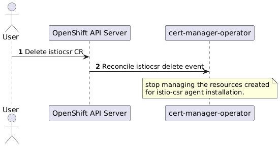

# Extend cert-manager-operator to manage istio-csr.

## Summary

This enhancement describes the proposal to extend cert-manager-operator to deploy and manage the `istio-csr` agent with
a dedicated controller. `OpenShift Service Mesh` facilitates the security of both intra-cluster and external service
communications through mTLS. istio-csr is an agent that allows Istio workload and control plane components to be secured
using cert-manager. It is responsible for receiving certificate signing requests for all members of the Istio mesh, and
signing them through cert-manager. cert-manager enables obtaining certificates from [various](https://docs.openshift.com/container-platform/4.15/security/cert_manager_operator/index.html#cert-manager-issuer-types_cert-manager-operator-about) certificate authorities
and also ensures the validity of certificates by renewing them before they expire. `OpenShift Service Mesh` secures
intra-cluster and external service connections with TLS encryption. `cert-manager` can be used to obtain the required
certificates through custom resources `issuer` and `clusterissuer`. And `istio-csr` is the agent that simplifies the
process of obtaining the certificates from the `cert-manager` for `OpenShift Service Mesh`. `cert-manager-operator`
manages `cert-manager` and extending the operator to manage `istio-csr` agent will help the users to use all the solutions
mentioned above effectively and easily.

## Motivation

Customers intend to use certificates issued by their own certificate authority rather than self-signed certificates,
which are the default configuration for OSSM in production. This is achieved by using cert-manager as the certificate
manager, requiring integration with OSSM so that certificate requests are signed and issued through cert-manager.

### User Stories

- As an OpenShift user, I want to have an option to dynamically deploy `istio-csr` agent, so that it can be used only
  when required by creating the custom resource.
- As an OpenShift user, I want to have an option to dynamically configure `istio-csr` agent, so that only the required
  features can be enabled by updating the custom resource.
- As an OpenShift user, I should be able to remove `istio-csr` agent when not required by removing the custom resource,
  and controller should cleanup all resources created for the `istio-csr` agent deployment.
- As an OpenShift user, I should be able to install `istio-csr` agent in the upgrade cluster where istiod control plane
  is active and should be able to update the certificate endpoint to `istio-csr` agent endpoint.
- As an OpenShift user, I want to have an option to dynamically enable monitoring for the `istio-csr` project and
  to use the OpenShift monitoring solution when required.

### Goals

- `cert-manager-operator` to be extended to manage `istio-csr` agent along with currently managed `cert-manager`.
- New custom resource(CR) `istiocsr` to be made available to install, configure and uninstall deployment.

### Non-Goals

- `istio-csr` agent can be used only with supported version of `OpenShift Service Mesh`. Please refer `Version Skew Strategy`
  section for more details.

## Proposal

**Note:**
Throughout the document, the following terminology means.
- `istio-csr` agent is the operand managed by the cert-manager operator.
- `istio-csr` controller is the dedicated controller in cert-manager operator managing the `istio-csr` agent deployment.
- `istiocsr` custom resource is for interacting with `istio-csr` controller to install, configure and uninstall the
  `istio-csr` agent deployment.

`istio-csr` agent will be installed and managed by `cert-manager-operator`. A new custom resource is defined to configure
the `istio-csr` agent. The `istiocsr` CR can be added day2 to install `istio-csr` agent post the  installation or upgrade
of cert-manager operator on the existing OpenShift clusters.

A new controller will be added to `cert-manager-operator` to manage and maintain the `istio-csr` agent deployment in
desired state which can be monitored by user through the status sub-resource of the new custom resource.

`istio-csr` agent controller will make use of static manifest templates for creating below resources required for
successfully deploying `istio-csr` agent. Please refer `Implementation Details/Notes/Constraints` section for more details.
* `certificate.cert-manager.io`
* `clusterissuer.cert-manager.io`
* `issuer.cert-manager.io`
* `clusterrole.rbac.authorization.k8s.io`
* `clusterrolebinding.rbac.authorization.k8s.io`
* `deployment`
* `service`
* `servicemonitor.monitoring.coreos.com`
* `namespace`
* `role.rbac.authorization.k8s.io`
* `rolebinding.rbac.authorization.k8s.io`
* `serviceaccount`

Each of the resource created for `istio-csr` agent deployment will have below set of labels added.
* `app: cert-manager-istio-csr`
* `app.kubernetes.io/name: cert-manager-istio-csr`
* `app.kubernetes.io/instance: cert-manager-istio-csr`
* `app.kubernetes.io/version: "v0.12.0"`
* `app.kubernetes.io/managed-by: cert-manager-operator`
* `app.kubernetes.io/part-of: cert-manager-operator`

Refer below links for more information on the labels used
- [Guidelines for Labels and Annotations for OpenShift applications](https://github.com/redhat-developer/app-labels/blob/master/labels-annotation-for-openshift.adoc)
- [Well-Known Labels, Annotations and Taints](https://kubernetes.io/docs/reference/labels-annotations-taints/)

`istiocsr` CR object is a singleton object and is enforced in CRD to have the name as `default`. `istio-csr` agent will
be deployed in the namespace where the CR object is created.

Configurations made available in the spec of `istiocsr` CR are passed as command line arguments to `istio-csr` agent and
updating these configurations would cause new rollout of the `istio-csr` agent deployment, which means a new pod will be
created and old pod will terminate resulting in `istio-csr` agent restart.
All configurations can be updated on-demand, except for below which can be configured only while creating the `istiocsr`
CR, which is enforced in the CRD using CEL validations.
- `.spec.istioCSRConfig.certmanager.issuerRef`
- `.spec.istioCSRConfig.istiodTLSConfig.privateKeySize`
- `.spec.istioCSRConfig.server.certificateKeySize`
- `.spec.istioCSRConfig.server.signatureAlgorithm`
- `.spec.istioCSRConfig.istio.revisions`
- `.spec.istioCSRConfig.istio.namespace`

When an OpenShift user deletes `istiocsr` CR object, `istio-csr` controller will stop managing all the resources created
for installing `istio-csr` agent and user will manually clean up the resources. Please refer `Operational Aspects of API Extensions`
section for command to list all the resources.

`istiocsr` CR status sub-resource will be used for updating the status of the `istio-csr` agent installation, any error
encountered while creating the required resources or the reconciling the state.

A fork of [upstream](https://github.com/cert-manager/istio-csr) `istio-csr` will be created [downstream](https://github.com/openshift/cert-manager-istio-csr)
for better version management.

### Workflow Description

- Enable `istio-csr` controller
  - An OpenShift user enables `istio-csr` controller by creating the `istiocsr` CR.
  - `istio-csr` controller based on the configuration in `istiocsr` CR, deploys `istio-csr` agent in the CR created
    namespace.

.

- Disable `istio-csr` controller
  - An OpenShift user disables `istio-csr` controller by deleting the `istiocsr` CR.

.

### API Extensions

Below new API `istiocsrs.operator.openshift.io` is introduced for managing istio-csr.
```golang
package v1alpha1

// +genclient
// +k8s:deepcopy-gen:interfaces=k8s.io/apimachinery/pkg/runtime.Object
// +kubebuilder:subresource:status

// IstioCSR describes configuration and information about the managed istio-csr
// agent. The name must be `default`.
//
// When an IstioCSR is created, a new deployment is created which manages the
// istio-csr agent and keeps it in the desired state.
// +kubebuilder:object:root=true
// +kubebuilder:printcolumn:name="Age",type="date",JSONPath=".metadata.creationTimestamp"
// +kubebuilder:validation:XValidation:rule="self.metadata.name == 'default'",message="istiocsr is a singleton, .metadata.name must be 'default'"
type IstioCSR struct {
	metav1.TypeMeta `json:",inline"`

	// metadata is the standard object's metadata.
	// More info: https://git.k8s.io/community/contributors/devel/sig-architecture/api-conventions.md#metadata
	metav1.ObjectMeta `json:"metadata,omitempty"`

	// spec is the specification of the desired behavior of the IstioCSR.
	Spec IstioCSRSpec `json:"spec,omitempty"`

	// status is the most recently observed status of the IstioCSR.
	Status IstioCSRStatus `json:"status,omitempty"`
}

// IstioCSRSpec is the specification of the desired behavior of the IstioCSR.
type IstioCSRSpec struct {
	// istioCSRConfig is for configuring the istio-csr agent behavior.
	IstioCSRConfig *IstioCSRConfig `json:"istioCSRConfig,omitempty"`

	// controllerConfig is for configuring the controller for setting up
	// defaults to enable istio-csr agent.
	ControllerConfig *ControllerConfig `json:"controllerConfig,omitempty"`
}

// IstioCSRConfig is for configuring the istio-csr agent behavior.
type IstioCSRConfig struct {
	// logLevel is for setting verbosity of istio-csr agent logging.
	// Supported log levels: 1-5.
	// +kubebuilder:default:=1
	// +kubebuilder:validation:Minimum:=1
	// +kubebuilder:validation:Maximum:=5
	// +optional
	LogLevel int32 `json:"logLevel,omitempty"`

	// logFormat is for specifying the output format of istio-csr agent logging.
	// Support log formats are text and json.
	// +kubebuilder:default:=text
	// +optional
	LogFormat string `json:"logFormat,omitempty"`

	// certmanager is for configuring cert-manager specifics.
	// +required
	CertManager *CertManagerConfig `json:"certmanager,omitempty"`

	// istiodTLSConfig is for configuring istiod certificate specifics.
	// +required
	IstiodTLSConfig *IstiodTLSConfig `json:"istiodTLSConfig,omitempty"`

	// server is for configuring the server endpoint used by istio
	// for obtaining the certificates.
	// +optional
	Server *ServerConfig `json:"server,omitempty"`

	// istio is for configuring the istio specifics.
	Istio *IstioConfig `json:"istio,omitempty"`

	// Resources is for defining the resource requirements.
	// ref: https://kubernetes.io/docs/concepts/configuration/manage-resources-containers/
	// +optional
	Resources corev1.ResourceRequirements `json:"resources,omitempty"`

	// Affinity is for setting scheduling affinity rules.
	// ref: https://kubernetes.io/docs/concepts/scheduling-eviction/assign-pod-node/
	// +optional
	Affinity *corev1.Affinity `json:"affinity,omitempty"`

	// Tolerations is for setting the pod tolerations.
	// ref: https://kubernetes.io/docs/concepts/scheduling-eviction/taint-and-toleration/
	// +optional
	Tolerations []corev1.Toleration `json:"tolerations,omitempty"`

	// NodeSelector is for defining the scheduling criteria using node labels.
	// ref: https://kubernetes.io/docs/concepts/configuration/assign-pod-node/
	// +optional
	NodeSelector map[string]string `json:"nodeSelector,omitempty"`
}

// CertManagerConfig is for configuring cert-manager specifics.
type CertManagerConfig struct {
	// issuerRef contains details to the referenced object used for
	// obtaining the certificates.
	// When unset operator will create Issuer in the configured istio's
	// namespace.
	// +kubebuilder:validation:XValidation:rule="oldSelf == '' || self == oldSelf",message="issuerRef is immutable once set"
	// +required
	IssuerRef certmanagerv1.ObjectReference `json:"issuerRef,omitempty"`
}

// IstiodTLSConfig is for configuring certificate specifics.
type IstiodTLSConfig struct {
	// TrustDomain is the cluster's trust domain.
	// +required
	TrustDomain string `json:"trustDomain,omitempty"`

	// RootCAFile is for setting the file location containing the root CA which is
	// present in the configured IssuerRef. File should be made available using the
	// Volume and VolumeMount options.
	// +optional
	RootCAFile string `json:"rootCAFile,omitempty"`

	// CertificateDNSNames contains DNS names to be added to the certificate SAN.
	// +required
	CertificateDNSNames []string `json:"certificateDNSNames,omitempty"`

	// certificateDuration is the istio's certificate validity period.
	// +kubebuilder:default:="1h"
	// +optional
	CertificateDuration time.Duration `json:"certificateDuration,omitempty"`

	// certificateRenewBefore is the ahead time to renew the istio's certificate before
	// expiry.
	// +kubebuilder:default:="30m"
	// +optional
	CertificateRenewBefore time.Duration `json:"certificateRenewBefore,omitempty"`

	// privateKeySize is the key size to be for RSAKey.
	// +kubebuilder:validation:XValidation:rule="oldSelf == '' || self == oldSelf",message="privateKeySize is immutable once set"
	// +kubebuilder:default:=2048
	// +optional
	PrivateKeySize int32 `json:"privateKeySize,omitempty"`
}

// ServerConfig is for configuring the server endpoint used by istio
// for obtaining the certificates.
type ServerConfig struct {
	// Address to serve istio-csr gRPC service.
	// +kubebuilder:default:="0.0.0.0"
	// +optional
	Address string `json:"address,omitempty"`

	// Port to serve istio-csr gRPC service.
	// +kubebuilder:default:="6443"
	// +optional
	Port string `json:"port,omitempty"`

	// CertificateKeySize is the server's serving certificate's key size.
	// +kubebuilder:default:=2048
	// +kubebuilder:validation:XValidation:rule="oldSelf == '' || self == oldSelf",message="certificateKeySize is immutable once set"
	// +optional
	CertificateKeySize int32 `json:"certificateKeySize,omitempty"`

	// SignatureAlgorithm is the signature algorithm to use when generating
	// private keys. At present only RSA and ECDSA are supported.
	// +kubebuilder:default:="RSA"
	// +kubebuilder:validation:Enum:="RSA";"ECDSA"
	// +kubebuilder:validation:XValidation:rule="oldSelf == '' || self == oldSelf",message="signatureAlgorithm is immutable once set"
	// +optional
	SignatureAlgorithm string `json:"signatureAlgorithm,omitempty"`

	// MaxCertificateDuration is the maximum validity duration that can be
	// requested for a certificate.
	// +kubebuilder:default:="1h"
	// +optional
	MaxCertificateDuration time.Duration `json:"certificateDuration,omitempty"`
}

// IstioConfig is for configuring the istio specifics.
type IstioConfig struct {
	// Revisions are the istio revisions that are currently installed in the cluster.
	// Changing this field will modify the DNS names that will be requested for
	// the istiod certificate.
	// +kubebuilder:default:=["default"]
	// +kubebuilder:validation:XValidation:rule="oldSelf == '' || self == oldSelf",message="revisions is immutable once set"
	// +optional
	Revisions []string `json:"revisions,omitempty"`

	// namespace of the istio control-plane. In the same namespace issuer will be created
	// used for obtaining the serving certificates.
	// +kubebuilder:validation:XValidation:rule="oldSelf == '' || self == oldSelf",message="namespace is immutable once set"
	// +required
	Namespace string `json:"namespace,omitempty"`
}

// ControllerConfig is for configuring the controller for setting up
// defaults to enable istio-csr agent.
type ControllerConfig struct {
	// labels to apply to all resources created for istio-csr agent deployment.
	Labels map[string]string `json:"labels,omitempty"`
}

// IstioCSRStatus is the most recently observed status of the IstioCSR.
type IstioCSRStatus struct {
	// conditions holds information of the current state of the istio-csr agent deployment.
	Conditions *metav1.Condition `json:"conditions,omitempty"`

	// istioCSRImage is the name of the image and the tag used for deploying istio-csr.
	IstioCSRImage string `json:"istioCSRImage,omitempty"`

	// istioCSRGRPCEndpoint is the service endpoint of istio-csr made available for user
	// to configure the same in istiod config to enable istio to use istio-csr for
	// certificate requests.
	IstioCSRGRPCEndpoint string `json:"istioCSRGRPCEndpoint,omitempty"`

	// serviceAccount created by the controller for the istio-csr agent.
	ServiceAccount string `json:"serviceAccount,omitempty"`

	// clusterRoleBinding created by the controller for the istio-csr agent.
	ClusterRoleBinding string `json:"clusterRoleBinding,omitempty"`
}
```

### Topology Considerations

#### Hypershift / Hosted Control Planes

None

#### Standalone Clusters

None

#### Single-node Deployments or MicroShift

None

### Implementation Details/Notes/Constraints

Below are the example static manifests used for creating required resources for installing `istio-csr` agent.
1. Service for creating istio-csr grpc server, for serving CertificateRequests endpoint.
   ```yaml
   apiVersion: v1
   kind: Service
   metadata:
     name: cert-manager-istio-csr
     namespace: istio-system
     labels:
       app: cert-manager-istio-csr
   spec:
     type: ClusterIP
     ports:
     - port: 443
       targetPort: 6443
       protocol: TCP
       name: grpc
     selector:
       app: cert-manager-istio-csr
   ```

2. ServiceAccount required by the agent, which will be associated with the required ClusterRole and
   Roles in next step.
   ```yaml
   apiVersion: v1
   kind: ServiceAccount
   metadata:
     labels:
       app: cert-manager-istio-csr
     name: cert-manager-istio-csr
     namespace: istio-system
   ```

3. ClusterRoles and Roles required by istio-csr.
   ```yaml
   ## required for creating ConfigMap with the CA in selected namespaces
   ## by istio-csr agent.
   kind: ClusterRole
   apiVersion: rbac.authorization.k8s.io/v1
   metadata:
     name: cert-manager-istio-csr
     labels:
       app: cert-manager-istio-csr
   rules:
   - apiGroups:
     - ""
     resources:
     - "configmaps"
     verbs: ["get", "list", "create", "update", "watch"]
   - apiGroups:
     - ""
     resources:
     - "namespaces"
     verbs: ["get", "list", "watch"]
   - apiGroups:
     - "authentication.k8s.io"
     resources:
     - "tokenreviews"
     verbs:
     - "create"
   ```

   ```yaml
   kind: ClusterRoleBinding
   apiVersion: rbac.authorization.k8s.io/v1
   metadata:
     labels:
       app: cert-manager-istio-csr
     generateName: cert-manager-istio-csr-
   roleRef:
     apiGroup: rbac.authorization.k8s.io
     kind: ClusterRole
     name: cert-manager-istio-csr
   subjects:
   - kind: ServiceAccount
     name: cert-manager-istio-csr
     namespace: istio-system
   ```

   ```yaml
   ## required for creating CertificateRequests.
   kind: Role
   apiVersion: rbac.authorization.k8s.io/v1
   metadata:
     name: cert-manager-istio-csr
     namespace: istio-system
     labels:
       app: cert-manager-istio-csr
   rules:
   - apiGroups:
     - "cert-manager.io"
     resources:
     - "certificaterequests"
     verbs:
     - "get"
     - "list"
     - "create"
     - "update"
     - "delete"
     - "watch"
   - apiGroups: [""]
     resources: ["events"]
     verbs: ["create"]
   ```

   ```yaml
   kind: RoleBinding
   apiVersion: rbac.authorization.k8s.io/v1
   metadata:
     name: cert-manager-istio-csr
     namespace: istio-system
     labels:
       app: cert-manager-istio-csr
   roleRef:
     apiGroup: rbac.authorization.k8s.io
     kind: Role
     name: cert-manager-istio-csr
   subjects:
   - kind: ServiceAccount
     name: cert-manager-istio-csr
     namespace: istio-system
   ```

   ```yaml
   kind: Role
   apiVersion: rbac.authorization.k8s.io/v1
   metadata:
     labels:
       app: cert-manager-istio-csr
     name: cert-manager-istio-csr-leases
     namespace: istio-system
   rules:
   - apiGroups:
     - "coordination.k8s.io"
     resources:
     - "leases"
     verbs:
     - "get"
     - "create"
     - "update"
     - "watch"
     - "list"
   ```

   ```yaml
   kind: RoleBinding
   apiVersion: rbac.authorization.k8s.io/v1
   metadata:
     name: cert-manager-istio-csr-leases
     namespace: istio-system
     labels:
       app: cert-manager-istio-csr
   roleRef:
     apiGroup: rbac.authorization.k8s.io
     kind: Role
     name: cert-manager-istio-csr-leases
   subjects:
   - kind: ServiceAccount
     name: cert-manager-istio-csr
     namespace: istio-system
   ```

4. Certificate required by the istiod.
   ```yaml
   ## certificate required by the istiod.
   apiVersion: cert-manager.io/v1
   kind: Certificate
   metadata:
     name: istiod
     namespace: istio-system
     labels:
       app: cert-manager-istio-csr
   spec:
     commonName: istiod.istio-system.svc
     dnsNames:
     - istiod-basic.istio-system.svc
     uris:
     - spiffe://cluster.local/ns/istio-system/sa/istiod-service-account
     secretName: istiod-tls
     duration: 1h
     renewBefore: 30m
     privateKey:
       rotationPolicy: Always
       algorithm: RSA
       size: 2048
     revisionHistoryLimit: 1
     issuerRef:
       name: istio-csr-issuer
       kind: Issuer
       group: cert-manager.io
   ```

5. istio-csr deployment.
   ```yaml
   apiVersion: apps/v1
   kind: Deployment
   metadata:
     name: cert-manager-istio-csr
     namespace: istio-system
     labels:
       app: cert-manager-istio-csr
   spec:
     replicas: 1
     selector:
       matchLabels:
         app: cert-manager-istio-csr
     template:
       metadata:
         labels:
           app: cert-manager-istio-csr
       spec:
         serviceAccountName: cert-manager-istio-csr
         containers:
         - name: cert-manager-istio-csr
           image: "quay.io/jetstack/cert-manager-istio-csr:v0.7.1"
           imagePullPolicy: IfNotPresent
           ports:
           - containerPort: 6443
           - containerPort: 9402
           readinessProbe:
             httpGet:
               port: 6060
               path: /readyz
             initialDelaySeconds: 3
             periodSeconds: 7
           command: ["cert-manager-istio-csr"]
           args:
             - "--log-level=1"
             - "--metrics-port=9402"
             - "--readiness-probe-path=/readyz"
             - "--readiness-probe-port=6060"

             # cert-manager
             - "--certificate-namespace=istio-system"
             - "--issuer-group=cert-manager.io"
             - "--issuer-kind=Issuer"
             - "--issuer-name=istio-csr-issuer"
             - "--preserve-certificate-requests=false"

             # AdditionalAnnotations

             # tls
             - "--root-ca-file=/var/run/secrets/istio-csr/ca.crt"
             - "--serving-certificate-dns-names=cert-manager-istio-csr.istio-system.svc"
             - "--serving-certificate-duration=1h"
             - "--serving-certificate-key-size=2048"
             - "--serving-signature-algorithm=RSA"
             - "--trust-domain=cluster.local"

             # server
             - "--max-client-certificate-duration=1h"
             - "--serving-address=0.0.0.0:6443"

             # controller
             - "--configmap-namespace-selector=maistra.io/member-of=istio-system"
             - "--leader-election-namespace=istio-system"
           volumeMounts:
             - mountPath: /var/run/secrets/istio-csr
               name: root-ca
         volumes:
         - name: root-ca
           secret:
             secretName: istio-csr-ca
   ```

### Risks and Mitigations

An OpenShift administrator configuring `istiocsr` CR object could configure insecure certificate signature algorithm,
certificate key size or certificate validity to be too long which could cause vulnerability.
  - These configurations could be validated and can be overridden with default values.

### Drawbacks

None

## Design Details

## Open Questions [optional]

None

## Test Plan

- Enable `istio-csr` controller by creating `istiocsr` CR and check the behavior with default istio-csr configuration.
- Enable `istio-csr` controller by creating the `istiocsr` CR with permutations of configurations and validate the behavior.
- Upgrade/downgrade testing
  - Scenarios mentioned in the section Upgrade / Downgrade Strategy has expected behavior.
- Sufficient time for feedback from the QE.
- The feature is available by default and does not have any specific featureGate defined.

## Graduation Criteria

### Dev Preview -> Tech Preview

- Feature available for end-to-end usage.
- Complete end user documentation.
- UTs and e2e tests are present.
- Gather feedback from the users.

### Tech Preview -> GA

N/A. This feature is for Dev Preview, until decided for GA.

### Removing a deprecated feature

None.

## Upgrade / Downgrade Strategy

On upgrade:
- cert-manager-operator will have functionality to enable istio-csr agent and based
  on the administrator configuration, agent will be deployed and available for usage
  with Service Mesh.
- Enabling istio-csr when Service Mesh was already deployed before upgrade is not
  [supported](https://cert-manager.io/docs/usage/istio-csr/#installing-istio-csr-after-istio) but can be made possible by following certain steps. Please refer 
  `Operational Aspects of API Extensions` section for more details..

## Version Skew Strategy

Istio-csr will be supported for OpenShift Service Mesh Operator 2.4+, Istio v1.10+, cert-manager Operator v1.3+ and cert-manager v1.3+.

## Operational Aspects of API Extensions

- Re-configuring `OpenShift Service Mesh` to use `istio-csr` for obtaining certificates. This is the scenario where
  `OpenShift Service Mesh` is already installed on the cluster and `istio-csr` is being installed after.
  - `OpenShift Service Mesh v2`
    ```bash
    istioctl install -y -f - <<EOF
    apiVersion: install.istio.io/v1alpha1
    kind: IstioOperator
    spec:
      values:
        global:
          # Change certificate provider to cert-manager istio agent for istio agent
          caAddress: cert-manager-istio-csr.cert-manager.svc:443
      components:
        pilot:
          k8s:
            env:
              # Disable istiod CA Sever functionality
            - name: ENABLE_CA_SERVER
              value: "false"
    EOF    
    ```    

    ```bash
    oc delete secrets -n istio-system istio-ca-secret
    ```

  - `OpenShift Service Mesh v3`
    ```bash
    oc patch istios.operator.istio.io default -n istio-system --type "json" -p '[
    {"op":"add","path":"/spec/values/global/caAddress","value":"cert-manager-istio-csr.istio-system.svc:443"},
    {"op":"add","path":"/spec/values/meshConfig/ca/address","value":"cert-manager-istio-csr.istio-system.svc:443"},
    {"op":"add","path":"/spec/values/pilot/env/ENABLE_CA_SERVER","value":"false"}]'
    ```

    ```bash
    oc delete secrets -n istio-system istio-ca-secret
    ```

- Listing all the resources created for installing the `istio-csr` agent
  ```bash
  oc get all -l "app=cert-manager-istio-csr,app.kubernetes.io/name=cert-manager-istio-csr" -A
  ```

## Support Procedures

None

## Alternatives

Instead of having `cert-manager-operator` manage `istio-csr`, having `istio-csr` itself as a product was
considered. But since `istio-csr` is an agent dependent on `cert-manager` for obtaining the certificates
and the configurations supported are specific to service mesh, approach described in this proposal was
considered to be logical.

## Infrastructure Needed [optional]

None.
