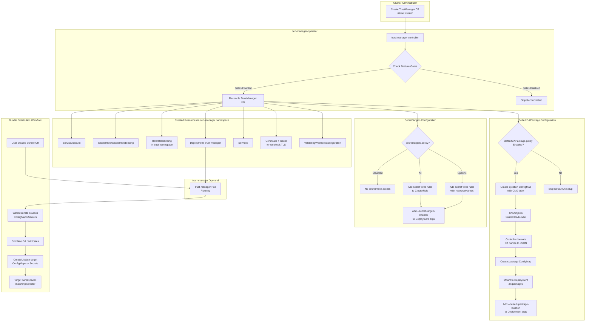

# Extend cert-manager-operator to manage trust-manager

## Summary

This enhancement describes the proposal to extend `cert-manager-operator` to deploy and manage the [trust-manager](https://github.com/cert-manager/trust-manager) 
operand with a dedicated controller. trust-manager provides a way to manage trust bundles in Kubernetes and OpenShift 
clusters. It takes a list of trusted certificate sources and combines them into a bundle which applications can trust directly.

trust-manager will be managed as an operand by an additional controller in cert-manager-operator. The operand will be 
installed in the `cert-manager` namespace and allows to maintain a consistent set of trusted 
CA certificates that can be consumed by workloads running on the cluster.

**Note:**
Throughout the document, the following terminology means:
- `trust-manager` is the operand managed by the cert-manager operator.
- `trust-manager-controller` is the dedicated controller in cert-manager operator managing the `trust-manager` operand deployment.
- `trustmanagers.operator.openshift.io` is the custom resource for interacting with `trust-manager-controller` to install, 
  configure, and uninstall the `trust-manager` operand deployment.
- `Bundle` is the CRD that defines trust bundle sources and distribution targets.

## Motivation

Customers require a consistent and reliable way to distribute CA certificates across their OpenShift clusters. 
Without trust-manager, administrators need to manually manage CA certificate distribution, which is error-prone and 
difficult to maintain at scale.

trust-manager uses a cluster-scoped `Bundle` CRD where administrators define sources (ConfigMaps, Secrets, inline 
certificates, or default CAs) and targets (ConfigMaps or Secrets in namespaces matching a label selector). 
trust-manager automatically creates and updates targets when sources change or new matching namespaces are created.

trust-manager solves this by providing:

1. **Centralized Trust Management**: Define trust bundles once and distribute them cluster-wide.
2. **Multiple Source Support**: Aggregate CA certificates from ConfigMaps, Secrets, and public trust bundles.
3. **Automatic Updates**: When source certificates change, trust-manager automatically updates all targets.
4. **Namespace Targeting**: Distribute bundles to specific namespaces based on labels.

The `cert-manager-operator` already manages `cert-manager` and `istio-csr`. Extending it to manage `trust-manager` 
provides a unified solution for certificate lifecycle management and trust distribution on OpenShift.

### User Stories

- As an OpenShift administrator, I want to have an option to deploy trust-manager as a day-2 operation, so that I can 
  distribute CA certificates across my cluster.
- As an OpenShift administrator, I want to be able to configure trust-manager, so that only required features can be enabled.
- As an OpenShift administrator, I want to enable trust-manager to write trust bundles to Secrets in addition to ConfigMaps 
  for applications that require secrets.
- As an OpenShift administrator, I want to use OpenShift's trusted CA bundle as the default CA package, so that trust-manager uses certificates appropriate for my cluster.
- As an OpenShift administrator, I want to filter expired certificates from trust bundles to ensure only valid certificates 
  are distributed.
- As an OpenShift administrator, I want to configure a custom trust namespace where trust sources (ConfigMaps/Secrets) 
  are stored, separate from the operand namespace (`cert-manager`).
- As an OpenShift security engineer, I want to be able to identify all artifacts created by cert-manager-operator for better auditability.
- As an OpenShift SRE, I should be able to get detailed information as part of different status conditions and messages 
  to identify the reasons for failures.
- As an OpenShift SRE, I should be able to collect metrics for trust-manager for monitoring.
- As a MicroShift administrator, I want to use trust-manager to manage CA bundles on my MicroShift cluster.

### Goals

- `cert-manager-operator` to be extended to manage `trust-manager` along with currently managed `cert-manager` and `istio-csr`.
- New custom resource (CR) `trustmanagers.operator.openshift.io` to be made available to install and configure 
  the trust-manager deployment.
- Provide OpenShift-native integration for the default CA package using CNO's trusted CA bundle injection instead of the 
  upstream Debian-based approach.
- trust-manager operand will always be deployed in the `cert-manager` namespace.
- Support configurable trust namespace (where trust sources are read from), with the operator creating the namespace if 
  it doesn't exist.
- Dynamic RBAC configuration based on `secretTargets` settings to control secret write permissions.
- Support both OpenShift and MicroShift platforms.
- Release as TechPreview with dual feature gate mechanism (operator feature gate + OpenShift FeatureSet).

### Non-Goals

- Removing the `trustmanagers.operator.openshift.io` CR object will not 
  remove the `trust-manager` deployment or its associated resources (ServiceAccount, RBAC, Services, etc.). Deleting 
  the CR will only stop the reconciliation of the resources created for the operand installation. 
  
   - This limitation will be re-evaluated in future releases.

- Automatic cleanup of `Bundle` resources created by users when the TrustManager CR is deleted.

- Automatic deletion of the trust namespace when the TrustManager CR is deleted or updated with a new namespace.

- Automatic cleanup of Configmaps created to support `DefaultCAPackage` option, when this field is toggled or TrustManager CR is deleted.

- For TechPreview, the `targetNamespaces` option will not be configurable. This option controls which namespaces 
  trust-manager has RBAC permissions to write Bundle targets to. By default, trust-manager can write to all namespaces.
  
  Users can still use `namespaceSelector` in Bundle CRs to filter target namespaces, but cannot restrict the 
  RBAC-level permissions. This option may be evaluated for GA release.


## Proposal

`trust-manager` will be installed and managed by `cert-manager-operator`. A new custom resource is defined to configure 
the `trust-manager` operand. The `trustmanagers.operator.openshift.io` CR can be added day-2 to install `trust-manager` 
post the installation or upgrade of cert-manager operator on OpenShift clusters.

Starting from cert-manager-operator v1.19.0, trust-manager will be available as 
Tech Preview. The feature requires both the operator's `TrustManager` feature gate to be enabled AND the OpenShift 
cluster to be configured with a TechPreview-compatible feature set (`TechPreviewNoUpgrade`, `DevPreviewNoUpgrade`, 
or `CustomNoUpgrade`). On clusters with the default feature set, the trust-manager feature will not be available.

The feature is supported on both OpenShift and MicroShift. On MicroShift, the OpenShift 
FeatureSet gating is not enforced, and users can enable trust-manager using only the operator feature gate.

A new controller will be added to `cert-manager-operator` to manage and maintain the `trust-manager` deployment in the 
desired state. `trust-manager-controller` will make use of static manifest templates for creating the resources required for successfully 
deploying `trust-manager`. Please refer to the [Implementation Details/Notes/Constraints](#implementation-detailsnotesconstraints) section for more details:

Each of the resources created for `trust-manager` deployment will have the below set of labels added:
* `app: cert-manager-trust-manager`
* `app.kubernetes.io/name: cert-manager-trust-manager`
* `app.kubernetes.io/instance: cert-manager-trust-manager`
* `app.kubernetes.io/version: "v0.20.3"`
* `app.kubernetes.io/managed-by: cert-manager-operator`
* `app.kubernetes.io/part-of: cert-manager-operator`

These labels aids in identifying and managing the 
`trust-manager` components within the cluster, thereby facilitating operations like monitoring and resource discovery.

`trustmanagers.operator.openshift.io` CR object is a cluster-scoped singleton object. The singleton pattern is enforced 
through two mechanisms:

  - An XValidation rule in the CRD rejects any TrustManager CR that is not named `cluster`
  - The controller only reconciles TrustManager CRs with the name `cluster`, ignoring any others


`trust-manager` will always be deployed in the `cert-manager` namespace.

Configurations made available in the spec of `trustmanagers.operator.openshift.io` CR are passed as command line arguments 
to `trust-manager` and updating these configurations would cause a new rollout of the `trust-manager` deployment.


A fork of [upstream trust-manager](https://github.com/cert-manager/trust-manager) will be created 
[downstream](https://github.com/openshift/cert-manager-trust-manager) for downstream management.

### Workflow Description

The following diagram illustrates the end-to-end workflow for trust-manager deployment and trust bundle distribution:




- Installation of `trust-manager`
  - An OpenShift user creates the `trustmanagers.operator.openshift.io` CR with name `cluster`.
  - `trust-manager-controller` based on the configuration in `trustmanagers.operator.openshift.io` CR, installs `trust-manager` 
    in the `cert-manager` namespace.
  - If `defaultCAPackage.policy` is `Enabled`:
    1. Controller creates a ConfigMap with label `config.openshift.io/inject-trusted-cabundle: true`
    2. CNO detects this label and injects the cluster's trusted CA bundle into the ConfigMap
    3. Controller reads and formats the CA bundle into trust-manager's expected JSON format
    4. Controller creates a package ConfigMap and mounts it to the trust-manager deployment
    5. trust-manager starts with `--default-package-location` pointing to the package

- Uninstallation of `trust-manager`
  - An OpenShift user deletes the `trustmanagers.operator.openshift.io` CR.
  - `trust-manager-controller` will not uninstall `trust-manager`, but will only stop reconciling the Kubernetes resources 
    created for installing the operand. Please refer to the `Non-Goals` section for more details.

### API Extensions

Below new API `trustmanagers.operator.openshift.io` is introduced for managing trust-manager.

```golang
package v1alpha1

import (
	corev1 "k8s.io/api/core/v1"
	metav1 "k8s.io/apimachinery/pkg/apis/meta/v1"
)

// +k8s:deepcopy-gen:interfaces=k8s.io/apimachinery/pkg/runtime.Object
// +kubebuilder:object:root=true

// TrustManagerList is a list of TrustManager objects.
type TrustManagerList struct {
	metav1.TypeMeta `json:",inline"`

	// metadata is the standard list's metadata.
	// More info: https://git.k8s.io/community/contributors/devel/sig-architecture/api-conventions.md#metadata
	metav1.ListMeta `json:"metadata"`
	Items           []TrustManager `json:"items"`
}

// +genclient
// +genclient:nonNamespaced
// +k8s:deepcopy-gen:interfaces=k8s.io/apimachinery/pkg/runtime.Object
// +kubebuilder:object:root=true
// +kubebuilder:subresource:status
// +kubebuilder:resource:path=trustmanagers,scope=Cluster,categories={cert-manager-operator}
// +kubebuilder:printcolumn:name="Ready",type="string",JSONPath=".status.conditions[?(@.type=='Ready')].status"
// +kubebuilder:printcolumn:name="Message",type="string",JSONPath=".status.conditions[?(@.type=='Ready')].message"
// +kubebuilder:printcolumn:name="AGE",type="date",JSONPath=".metadata.creationTimestamp"
// +kubebuilder:metadata:labels={"app.kubernetes.io/name=trustmanager", "app.kubernetes.io/part-of=cert-manager-operator"}

// TrustManager describes the configuration and information about the managed trust-manager deployment.
// The name must be `cluster` to make TrustManager a singleton, allowing only one instance per cluster.
//
// When a TrustManager is created, trust-manager is deployed in the cert-manager namespace.
//
// +kubebuilder:validation:XValidation:rule="self.metadata.name == 'cluster'",message="TrustManager is a singleton, .metadata.name must be 'cluster'"
// +operator-sdk:csv:customresourcedefinitions:displayName="TrustManager"
type TrustManager struct {
	metav1.TypeMeta `json:",inline"`

	// metadata is the standard object's metadata.
	// More info: https://git.k8s.io/community/contributors/devel/sig-architecture/api-conventions.md#metadata
	metav1.ObjectMeta `json:"metadata,omitempty"`

	// spec is the specification of the desired behavior of the TrustManager.
	// +kubebuilder:validation:Required
	// +required
	Spec TrustManagerSpec `json:"spec"`

	// status is the most recently observed status of the TrustManager.
	// +kubebuilder:validation:Optional
	// +optional
	Status TrustManagerStatus `json:"status,omitempty"`
}

// TrustManagerSpec defines the desired state of TrustManager.
// Note: trust-manager operand is always deployed in the cert-manager namespace.
type TrustManagerSpec struct {
	// trustManagerConfig configures the trust-manager operand's behavior.
	// +kubebuilder:validation:Required
	// +required
	TrustManagerConfig TrustManagerConfig `json:"trustManagerConfig"`

	// controllerConfig configures the operator's behavior for resource creation.
	// +kubebuilder:validation:Optional
	// +optional
	ControllerConfig TrustManagerControllerConfig `json:"controllerConfig,omitempty"`
}

// TrustManagerConfig configures the trust-manager operand's behavior.
type TrustManagerConfig struct {
	// logLevel configures the verbosity of trust-manager logging.
	// Follows [Kubernetes logging guidelines](https://github.com/kubernetes/community/blob/master/contributors/devel/sig-instrumentation/logging.md#what-method-to-use).
	// +kubebuilder:default:=1
	// +kubebuilder:validation:Minimum:=1
	// +kubebuilder:validation:Maximum:=5
	// +kubebuilder:validation:Optional
	// +optional
	LogLevel int32 `json:"logLevel,omitempty"`

	// logFormat specifies the output format for trust-manager logging.
	// Supported formats are "text" and "json".
	// +kubebuilder:validation:Enum:="text";"json"
	// +kubebuilder:default:="text"
	// +kubebuilder:validation:Optional
	// +optional
	LogFormat string `json:"logFormat,omitempty"`

	// trustNamespace is the namespace where trust-manager looks for trust sources
	// (ConfigMaps and Secrets containing CA certificates).
	// Defaults to "cert-manager" if not specified.
	// This field can have a maximum of 63 characters.
	// +kubebuilder:default:="cert-manager"
	// +kubebuilder:validation:MinLength:=1
	// +kubebuilder:validation:MaxLength:=63
	// +kubebuilder:validation:Optional
	// +optional
	TrustNamespace string `json:"trustNamespace,omitempty"`

	// secretTargets configures whether trust-manager can write trust bundles to Secrets.
	// +kubebuilder:validation:Optional
	// +optional
	SecretTargets SecretTargetsConfig `json:"secretTargets,omitempty"`

	// filterExpiredCertificates controls whether trust-manager filters out
	// expired certificates from trust bundles before distributing them.
	// When set to "Enabled", expired certificates are removed from bundles.
	// When set to "Disabled", expired certificates are included (default behavior).
	// +kubebuilder:default:="Disabled"
	// +kubebuilder:validation:Optional
	// +optional
	FilterExpiredCertificates FilterExpiredCertificatesPolicy `json:"filterExpiredCertificates,omitempty"`

	// defaultCAPackage configures the default CA package for trust-manager.
	// When enabled, the operator will use OpenShift's trusted CA bundle injection mechanism.
	// +kubebuilder:validation:Optional
	// +optional
	DefaultCAPackage DefaultCAPackageConfig `json:"defaultCAPackage,omitempty"`

	// resources defines the compute resource requirements for the trust-manager pod.
	// ref: https://kubernetes.io/docs/concepts/configuration/manage-resources-containers/
	// +kubebuilder:validation:Optional
	// +optional
	Resources corev1.ResourceRequirements `json:"resources,omitempty"`

	// affinity defines scheduling constraints for the trust-manager pod.
	// ref: https://kubernetes.io/docs/concepts/scheduling-eviction/assign-pod-node/
	// +kubebuilder:validation:Optional
	// +optional
	Affinity *corev1.Affinity `json:"affinity,omitempty"`

	// tolerations allows the trust-manager pod to be scheduled on tainted nodes.
	// ref: https://kubernetes.io/docs/concepts/scheduling-eviction/taint-and-toleration/
	// +listType=atomic
	// +kubebuilder:validation:MinItems:=0
	// +kubebuilder:validation:Optional
	// +optional
	Tolerations []corev1.Toleration `json:"tolerations,omitempty"`

	// nodeSelector restricts which nodes the trust-manager pod can be scheduled on.
	// ref: https://kubernetes.io/docs/concepts/configuration/assign-pod-node/
	// +mapType=atomic
	// +kubebuilder:validation:MinProperties:=0
	// +kubebuilder:validation:Optional
	// +optional
	NodeSelector map[string]string `json:"nodeSelector,omitempty"`
}

// SecretTargetsConfig configures whether and how trust-manager can write
// trust bundles to Secrets.
//
// +kubebuilder:validation:XValidation:rule="self.policy != 'Specific' || (has(self.authorizedSecrets) && size(self.authorizedSecrets) > 0)",message="authorizedSecrets must not be empty when policy is Specific"
// +kubebuilder:validation:XValidation:rule="self.policy == 'Specific' || !has(self.authorizedSecrets) || size(self.authorizedSecrets) == 0",message="authorizedSecrets must be empty when policy is not Specific"
type SecretTargetsConfig struct {
	// policy controls whether and how trust-manager can write trust bundles to Secrets.
	// Allowed values are "Disabled", "All", or "Specific".
	// "Disabled" means trust-manager cannot write trust bundles to Secrets (default behavior).
	// "All" grants trust-manager permission to create and update ALL secrets across all namespaces.
	// "Specific" grants trust-manager permission to create and update only the secrets listed in authorizedSecrets.
	// +kubebuilder:default:="Disabled"
	// +kubebuilder:validation:Optional
	// +optional
	Policy SecretTargetsPolicy `json:"policy,omitempty"`

	// authorizedSecrets is a list of specific secret names that trust-manager
	// is authorized to create and update. This field is only valid when policy is "Specific".
	// +listType=set
	// +kubebuilder:validation:MinItems:=0
	// +kubebuilder:validation:items:MinLength:=1
	// +kubebuilder:validation:Optional
	// +optional
	AuthorizedSecrets []string `json:"authorizedSecrets,omitempty"`
}

// DefaultCAPackageConfig configures the default CA package feature for trust-manager.
type DefaultCAPackageConfig struct {
	// policy controls whether the default CA package feature is enabled.
	// When set to "Enabled", the operator will inject OpenShift's trusted CA bundle
	// into trust-manager, enabling the "useDefaultCAs: true" source in Bundle resources.
	// When set to "Disabled", no default CA package is configured and Bundles cannot use useDefaultCAs (default behavior).
	// +kubebuilder:default:="Disabled"
	// +kubebuilder:validation:Optional
	// +optional
	Policy DefaultCAPackagePolicy `json:"policy,omitempty"`
}

// TrustManagerControllerConfig configures the operator's behavior for
// creating trust-manager resources.
type TrustManagerControllerConfig struct {
	// labels to apply to all resources created for the trust-manager deployment.
	// +mapType=granular
	// +kubebuilder:validation:MinProperties:=0
	// +kubebuilder:validation:Optional
	// +optional
	Labels map[string]string `json:"labels,omitempty"`

	// annotations to apply to all resources created for the trust-manager deployment.
	// +mapType=granular
	// +kubebuilder:validation:MinProperties:=0
	// +kubebuilder:validation:Optional
	// +optional
	Annotations map[string]string `json:"annotations,omitempty"`
}

// FilterExpiredCertificatesPolicy defines the policy for filtering expired certificates.
// +kubebuilder:validation:Enum:=Enabled;Disabled
type FilterExpiredCertificatesPolicy string

const (
	// FilterExpiredCertificatesPolicyEnabled filters out expired certificates from bundles.
	FilterExpiredCertificatesPolicyEnabled FilterExpiredCertificatesPolicy = "Enabled"
	// FilterExpiredCertificatesPolicyDisabled includes expired certificates in bundles.
	FilterExpiredCertificatesPolicyDisabled FilterExpiredCertificatesPolicy = "Disabled"
)

// SecretTargetsPolicy defines the policy for writing trust bundles to Secrets.
// +kubebuilder:validation:Enum:=Disabled;All;Specific
type SecretTargetsPolicy string

const (
	// SecretTargetsPolicyDisabled means trust-manager cannot write trust bundles to Secrets.
	SecretTargetsPolicyDisabled SecretTargetsPolicy = "Disabled"
	// SecretTargetsPolicyAll grants trust-manager permission to write to ALL secrets.
	SecretTargetsPolicyAll SecretTargetsPolicy = "All"
	// SecretTargetsPolicySpecific grants trust-manager permission to write to specific secrets only.
	SecretTargetsPolicySpecific SecretTargetsPolicy = "Specific"
)

// DefaultCAPackagePolicy defines the policy for the default CA package feature.
// +kubebuilder:validation:Enum:=Enabled;Disabled
type DefaultCAPackagePolicy string

const (
	// DefaultCAPackagePolicyEnabled enables the default CA package feature.
	DefaultCAPackagePolicyEnabled DefaultCAPackagePolicy = "Enabled"
	// DefaultCAPackagePolicyDisabled disables the default CA package feature.
	DefaultCAPackagePolicyDisabled DefaultCAPackagePolicy = "Disabled"
)

// TrustManagerStatus defines the observed state of TrustManager.
type TrustManagerStatus struct {
	// conditions holds information about the current state of the trust-manager deployment.
	ConditionalStatus `json:",inline,omitempty"`

	// trustManagerImage is the container image (name:tag) used for trust-manager.
	TrustManagerImage string `json:"trustManagerImage,omitempty"`

	// trustNamespace is the namespace where trust-manager looks for trust sources.
	TrustNamespace string `json:"trustNamespace,omitempty"`

	// secretTargetsPolicy indicates the current secret targets policy.
	SecretTargetsPolicy SecretTargetsPolicy `json:"secretTargetsPolicy,omitempty"`

	// defaultCAPackagePolicy indicates the current default CA package policy.
	DefaultCAPackagePolicy DefaultCAPackagePolicy `json:"defaultCAPackagePolicy,omitempty"`
}
```

### Topology Considerations

#### Hypershift / Hosted Control Planes

None

#### Standalone Clusters

None

#### OpenShift Kubernetes Engine

None

#### Single-node Deployments or MicroShift

None

### Implementation Details/Notes/Constraints

#### Deployment Model

cert-manager-operator uses Helm charts provided by the trust-manager project to derive static manifests for deploying 
the operand. The deployment model follows this approach:

1. **Manifest Generation**: The operator maintains a script (`hack/update-trust-manager-manifests.sh`) that:
   - Downloads the trust-manager Helm chart from the upstream repository
   - Renders the chart with specific configuration options using `helm template`
   - Patches the manifests to update labels (e.g., `app.kubernetes.io/managed-by: cert-manager-operator`)
   - Removes Helm-specific metadata (e.g., `helm.sh/chart` labels)
   - Splits the combined manifest into individual resource files
   - Stores the manifests as bindata embedded in the operator binary

   ```bash
   # Example: Generating manifests from Helm chart
   helm template trust-manager cert-manager/trust-manager -n trust-manager \
     --version "${TRUST_MANAGER_VERSION}" \
     --set defaultPackage.enabled=false \
     > manifests.yaml
   ```
   
   **Note**: The `app.targetNamespaces` option is not set, allowing trust-manager to write Bundle targets to all 
   namespaces by default. This may be evaluated for configurability in future releases.

The generated manifests are stored in `bindata/trust-manager/resources/`

2. **Runtime Customization**: When reconciling a TrustManager CR, the controller:
   - Loads the static manifests from bindata
   - Modifies resources based on user-provided configuration in the TrustManager CR (e.g. log level, 
     trust namespace, secret targets etc.)
   - Applies the customized resources to the cluster

#### Feature Gate Implementation

The trust-manager controller is gated behind two mechanisms for the Tech Preview release:

1. **Operator Feature Gate**: The cert-manager-operator defines a `TrustManager` feature gate in its feature gate 
   configuration. This gate must be explicitly enabled.

2. **OpenShift FeatureSet Check**: Before starting the trust-manager controller, the operator reads the cluster's 
   feature set from `featuregates.config.openshift.io/cluster`. The controller will only start if the cluster 
   is configured with one of the following feature sets:
   - `TechPreviewNoUpgrade`
   - `DevPreviewNoUpgrade`  
   - `CustomNoUpgrade`
   
   **Note**: This OpenShift FeatureSet gating is only enforced on OpenShift clusters. On MicroShift, the 
   FeatureSet restriction is not enforced, and the feature can be enabled using only the operator feature gate.

#### DefaultCAPackage Implementation

The DefaultCAPackage configuration replaces the upstream Debian-based init container 
approach.

1. **Injection ConfigMap**: The controller creates a ConfigMap named `trust-manager-default-ca-injection` with the 
   label `config.openshift.io/inject-trusted-cabundle: true`. CNO monitors for this label and injects 
   the cluster's trusted CA bundle into the `ca-bundle.crt` key.

2. **Package Formatting**: The controller reads the injected CA bundle and formats it into trust-manager's expected 
   JSON format:
   ```json
   {
     "name": "cert-manager-package-openshift",
     "bundle": "-----BEGIN CERTIFICATE-----\n...",
     "version": "<configmap-resource-version>"
   }
   ```

3. **Package ConfigMap**: The controller creates a second ConfigMap named `trust-manager-default-ca-package` containing 
   the formatted JSON package.

4. **Volume Mount**: The package ConfigMap is mounted to the trust-manager deployment at `/packages`, and the 
   `--default-package-location=/packages/cert-manager-package-openshift.json` argument is added.

5. **Automatic Updates**: When CNO updates the injected CA bundle, 
   the controller detects the change via ConfigMap watch, reformats the package, and updates the package ConfigMap. 
   
   [TODO: Testing required]: The trust-manager pod will need to be restarted to pick up the new package.

#### RBAC Configuration

The controller creates the following RBAC resources for trust-manager:

**Cluster-scoped resources:**
- `ClusterRole` (trust-manager): Permissions to manage Bundles, ConfigMaps across the cluster
- `ClusterRoleBinding`: Binds ClusterRole to the ServiceAccount

**Namespace-scoped resources:**
- `Role` (trust-manager): Read access to secrets in the **trust namespace**
- `RoleBinding` (trust-manager): Binds Role to ServiceAccount in the trust namespace
- `Role` (trust-manager:leaderelection): Leader election permissions in the **operand namespace** (cert-manager)
- `RoleBinding` (trust-manager:leaderelection): Binds Role to ServiceAccount in operand namespace

**Trust Namespace Handling:**

The trust namespace (`spec.trustManagerConfig.trustNamespace`) can be different from the operand namespace 
(cert-manager). When a different trust namespace is configured:
1. The operator creates the trust namespace if it doesn't exist
2. The `trust-manager` Role and RoleBinding are created in the trust namespace (for secret access)
3. The leader election Role and RoleBinding remain in the operand namespace (cert-manager)
4. The ServiceAccount subject in all RoleBindings always references the operand namespace

**Dynamic ClusterRole Rules:**

The ClusterRole for trust-manager is dynamically configured based on the `secretTargets` configuration:

- **Default (secretTargets.policy: Disabled)**: Read-only access to secrets, read-write access to configmaps
- **secretTargets.policy: Specific**: Additional rules to create/update specific secret names listed in authorizedSecrets
- **secretTargets.policy: All**: Full create/update access to all secrets

#### Manifests for installing trust-manager

Below are example static manifests used for creating required resources for installing trust-manager:

1. ServiceAccount
   ```yaml
   apiVersion: v1
   kind: ServiceAccount
   metadata:
     name: trust-manager
     namespace: cert-manager
     labels:
       app: trust-manager
       app.kubernetes.io/name: trust-manager
       app.kubernetes.io/managed-by: cert-manager-operator
   ```

2. ClusterRole
   ```yaml
   apiVersion: rbac.authorization.k8s.io/v1
   kind: ClusterRole
   metadata:
     name: trust-manager
     labels:
       app: trust-manager
       app.kubernetes.io/name: trust-manager
       app.kubernetes.io/managed-by: cert-manager-operator
   rules:
     - apiGroups: ["trust.cert-manager.io"]
       resources: ["bundles"]
       verbs: ["get", "list", "watch"]
     - apiGroups: ["trust.cert-manager.io"]
       resources: ["bundles/finalizers"]
       verbs: ["update"]
     - apiGroups: ["trust.cert-manager.io"]
       resources: ["bundles/status"]
       verbs: ["patch"]
     - apiGroups: [""]
       resources: ["configmaps"]
       verbs: ["get", "list", "create", "update", "patch", "watch", "delete"]
     - apiGroups: [""]
       resources: ["namespaces"]
       verbs: ["get", "list", "watch"]
     - apiGroups: [""]
       resources: ["events"]
       verbs: ["create", "patch"]
    # Secret read access (when secretTargets.policy is All or Specific)
    - apiGroups: [""]
      resources: ["secrets"]
      verbs: ["get", "list", "watch"]
    # Secret write access (when secretTargets.policy is All or Specific)
     # - apiGroups: [""]
     #   resources: ["secrets"]
     #   resourceNames: ["specific-secret-names"]  # when policy is Specific; omit resourceNames when policy is All
     #   verbs: ["create", "update", "patch", "delete"]
   ```

3. Role (trust-manager) - Created in trust namespace for reading secrets
   ```yaml
   apiVersion: rbac.authorization.k8s.io/v1
   kind: Role
   metadata:
     name: trust-manager
     namespace: cert-manager  # Or configured trustNamespace
     labels:
       app.kubernetes.io/name: trust-manager
       app.kubernetes.io/managed-by: cert-manager-operator
   rules:
     - apiGroups: [""]
       resources: ["secrets"]
       verbs: ["get", "list", "watch"]
   ```

4. Role (trust-manager:leaderelection) - Created in operand namespace (cert-manager)
   ```yaml
   apiVersion: rbac.authorization.k8s.io/v1
   kind: Role
   metadata:
     name: trust-manager:leaderelection
     namespace: cert-manager
     labels:
       app.kubernetes.io/name: trust-manager
       app.kubernetes.io/managed-by: cert-manager-operator
   rules:
     - apiGroups: ["coordination.k8s.io"]
       resources: ["leases"]
       verbs: ["get", "create", "update", "watch", "list"]
   ```

5. Deployment
   ```yaml
   apiVersion: apps/v1
   kind: Deployment
   metadata:
     name: trust-manager
     namespace: cert-manager
     labels:
       app: trust-manager
       app.kubernetes.io/name: trust-manager
       app.kubernetes.io/managed-by: cert-manager-operator
   spec:
     replicas: 1
     selector:
       matchLabels:
         app: trust-manager
     template:
       metadata:
         labels:
           app: trust-manager
       spec:
         serviceAccountName: trust-manager
         containers:
           - name: trust-manager
             image: quay.io/jetstack/trust-manager:v0.20.3
            args:
              - --log-format=text
              - --log-level=1
              - --metrics-port=9402
              - --readiness-probe-port=6060
              - --readiness-probe-path=/readyz
              - --trust-namespace=cert-manager
              - --webhook-host=0.0.0.0
              - --webhook-port=6443
              - --webhook-certificate-dir=/tls
              # Added when secretTargets.policy is All or Specific
              # - --secret-targets-enabled=true
              # Added when defaultCAPackage.policy is Enabled
              # - --default-package-location=/packages/cert-manager-package-openshift.json
             ports:
               - containerPort: 6443
               - containerPort: 9402
             readinessProbe:
               httpGet:
                 port: 6060
                 path: /readyz
             volumeMounts:
               - name: tls
                 mountPath: /tls
                 readOnly: true
              # Added when defaultCAPackage.policy is Enabled
              # - name: default-ca-package
              #   mountPath: /packages
              #   readOnly: true
         volumes:
           - name: tls
             secret:
               secretName: trust-manager-tls
          # Added when defaultCAPackage.policy is Enabled
          # - name: default-ca-package
          #   configMap:
          #     name: trust-manager-default-ca-package
   ```

6. Certificate (for webhook TLS)
   ```yaml
   apiVersion: cert-manager.io/v1
   kind: Certificate
   metadata:
     name: trust-manager
     namespace: cert-manager
     labels:
       app: trust-manager
       app.kubernetes.io/name: trust-manager
       app.kubernetes.io/managed-by: cert-manager-operator
   spec:
     commonName: "trust-manager.cert-manager.svc"
     dnsNames:
       - "trust-manager.cert-manager.svc"
     secretName: trust-manager-tls
     revisionHistoryLimit: 1
     issuerRef:
       name: trust-manager
       kind: Issuer
       group: cert-manager.io
   ```

7. ValidatingWebhookConfiguration
   ```yaml
   apiVersion: admissionregistration.k8s.io/v1
   kind: ValidatingWebhookConfiguration
   metadata:
     name: trust-manager
     annotations:
       cert-manager.io/inject-ca-from: cert-manager/trust-manager
   webhooks:
     - name: trust.cert-manager.io
       clientConfig:
         service:
           name: trust-manager
           namespace: cert-manager
           path: /validate-trust-cert-manager-io-v1alpha1-bundle
       rules:
         - apiGroups: ["trust.cert-manager.io"]
           apiVersions: ["v1alpha1"]
           operations: ["CREATE", "UPDATE"]
           resources: ["bundles"]
       admissionReviewVersions: ["v1"]
       sideEffects: None
   ```

### Risks and Mitigations


- **DefaultCAPackage Dependency on CNO**: The DefaultCAPackage option depends on CNO's CA bundle 
  injection. If CNO is not functioning correctly, the CA bundle won't be injected, and trust-manager will fail to 
  start when `defaultCAPackage.policy` is `Enabled`.
  - Mitigation: The controller implements a requeue mechanism that waits for CNO to inject the CA bundle before 
    proceeding with the deployment. Status conditions clearly indicate when waiting for CNO injection.


- **Upcoming Bundle API Deprecation**: The upstream trust-manager project is planning to deprecate the current 
  cluster-scoped `Bundle` custom resource (`v1alpha1`) and introduce a new `ClusterBundle` CRD in `v1alpha2`. 
  Additionally, `Bundle` may be re-introduced in `v1` as a **namespace-scoped** resource (as opposed to the current 
  cluster-scoped type). This restructuring is intended to properly support both cluster and namespace scoped 
  resources with appropriate access controls.
  
  **Impact**:
  - Users who create `Bundle` resources may need to migrate to `ClusterBundle` or the new namespace-scoped `Bundle`
  - Helm chart values may change, leading to changes in downstream CRD values.
  
  **References**:
  - [Announcement: trust-manager ClusterBundle Future](https://cert-manager.io/announcements/2025/09/05/trust-manager-clusterbundle-future/)
  - [Design: Rename Bundle to ClusterBundle](https://github.com/cert-manager/trust-manager/blob/main/design/20241124-rename-bunde-to-clusterbundle.md)
  
  - Mitigation: 
    - Monitor upstream changes and plan for API migration in future operator releases when both `Bundle` and `ClusterBundle` CRDs become available.

### Drawbacks

None

## Design Details

### Open Questions [optional]

None

## Test Plan

- Verify trust-manager controller starts only when both operator feature gate is enabled AND cluster has 
  TechPreview-compatible feature set (TechPreviewNoUpgrade, DevPreviewNoUpgrade, or CustomNoUpgrade).
- **MicroShift**: Verify trust-manager controller starts on MicroShift when only the operator feature gate is 
  enabled (FeatureSet gating is not enforced on MicroShift).
- Enable `trust-manager-controller` by creating `trustmanagers.operator.openshift.io` CR and check the behavior with 
  default trust-manager configuration.
- Enable `trust-manager-controller` by creating the `trustmanagers.operator.openshift.io` CR with permutations of 
  configurations and validate the behavior:
  - Custom trust namespace
  - Secret targets policy (Disabled/All/Specific)
  - DefaultCAPackage policy (Enabled/Disabled)
  - FilterExpiredCertificates policy (Enabled/Disabled)
  - Common configurations: log levels and formats, resources, node selector, tolerations and affinity
- Test Bundle CRD functionality:
  - Create Bundle resources with various sources (ConfigMap, Secret, InLine)
  - Test `useDefaultCAs` source when `defaultCAPackage.policy` is `Enabled`
  - Verify target ConfigMaps/Secrets are created and updated correctly

## Graduation Criteria

### Dev Preview -> Tech Preview

N/A. The feature will be released directly as Tech Preview.

### Tech Preview

Trust-manager will be available as Tech Preview starting from cert-manager-operator v1.19.0 release.

### Tech Preview -> GA

- Feature is enabled by default. OpenShift FeatureSet dependency removed; feature available on all clusters.
- Complete end-user documentation.
- Complete UTs and e2e tests are present.
- Evaluate adding `targetNamespaces` configuration to restrict which namespaces trust-manager can write Bundle 
  targets to (currently defaults to all namespaces).
- Address upstream `Bundle` to `ClusterBundle` API migration if applicable (see Risks section for details).
- Direct upgrade from Tech Preview to GA is not supported; users should perform a fresh operator installation.

### Removing a deprecated feature

None.

## Upgrade / Downgrade Strategy

On upgrade:
- cert-manager-operator will have functionality to enable trust-manager and based on the administrator configuration, 
  trust-manager will be deployed and available for usage.

On downgrade:
- Operator downgrade is not supported.

## Version Skew Strategy

trust-manager will be supported for:
- cert-manager Operator v1.19.0+


## Operational Aspects of API Extensions

### Failure Modes

- **CNO Not Injecting CA Bundle**: If CNO fails to inject the CA bundle when `defaultCAPackage.policy` is `Enabled`, 
  the TrustManager status will show a condition indicating it's waiting for CNO injection. The controller will 
  requeue until the bundle is available.

- **cert-manager Not Available**: If cert-manager is not installed or the issuer is not available, the webhook 
  certificate will fail to be issued, and trust-manager will not start. The status condition will indicate the failure.


## Support Procedures

- Listing all the resources created for installing the `trust-manager`
  ```bash
  # Resources in cert-manager namespace (operand namespace)
  oc get Certificates,Issuers,ClusterRoles,ClusterRoleBindings,Deployments,Roles,RoleBindings,Services,ServiceAccounts,ValidatingWebhookConfigurations,ConfigMaps -l "app.kubernetes.io/name=cert-manager-trust-manager" -n cert-manager
  
  # If trust namespace is different from cert-manager, also check for Role/RoleBinding there
  # oc get Roles,RoleBindings -l "app.kubernetes.io/name=cert-manager-trust-manager" -n <trust-namespace>
  ```

- Checking TrustManager status
  ```bash
  oc get trustmanager cluster -o yaml
  ```

- Listing all Bundle resources
  ```bash
  oc get Bundle -A
  ```

- Example TrustManager CR with `defaultCAPackage.policy: Enabled`
  ```yaml
  apiVersion: operator.openshift.io/v1alpha1
  kind: TrustManager
  metadata:
    name: cluster
  spec:
    trustManagerConfig:
      logLevel: 1
      logFormat: text
      trustNamespace: cert-manager
      defaultCAPackage:
        policy: Enabled
      filterExpiredCertificates: Enabled
  ```


- Example Bundle with multiple sources and namespace selector
  ```yaml
  apiVersion: trust.cert-manager.io/v1alpha1
  kind: Bundle
  metadata:
    name: my-org-trust-bundle
  spec:
    sources:
      # Include default OpenShift CA certificates
      - useDefaultCAs: true
      # Include CA from a ConfigMap in trust namespace (cert-manager)
      - configMap:
          name: "my-org-ca"
          key: "ca.crt"
      # Include CA from a Secret in trust namespace
      - secret:
          name: "internal-ca"
          key: "tls.crt"
      # Include inline CA certificate
      - inLine: |
          -----BEGIN CERTIFICATE-----
          MIIFazCCA1OgAwIBAgIUe...
          -----END CERTIFICATE-----
    target:
      configMap:
        key: "trust-bundle.pem"
      # Only create in namespaces with this label
      namespaceSelector:
        matchLabels:
          trust-bundle-injection: enabled
  ```
  This Bundle will create a ConfigMap named `my-org-trust-bundle` containing the combined CA certificates 
  in every namespace that has the label `trust-bundle-injection: enabled`.

## Implementation History

N/A

## Alternatives (Not Implemented)


- Kubernetes ClusterTrustBundle : https://github.com/kubernetes/enhancements/tree/master/keps/sig-auth/3257-cluster-trust-bundles

## Infrastructure Needed [optional]

- [openshift/cert-manager-trust-manager](https://github.com/openshift/cert-manager-trust-manager) GitHub repository (forked from upstream).
- trust-manager container image published to the OpenShift registry.
