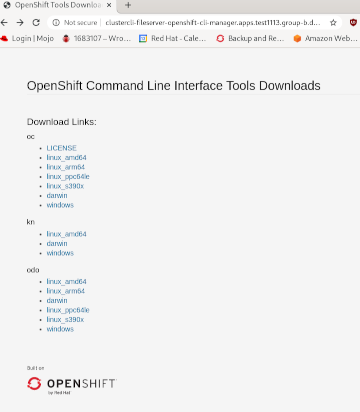

# Supported CLI Management

## Release Signoff Checklist

- [ ] Enhancement is `implementable`
- [ ] Design details are appropriately documented from clear requirements
- [ ] Test plan is defined
- [ ] Graduation criteria for dev preview, tech preview, GA
- [ ] User-facing documentation is created in [openshift-docs](https://github.com/openshift/openshift-docs/)

## Summary

This proposal is describing the mechanism for how authors of a Command Line Interface (CLI) such as oc, kubectl, odo, istio, tekton, or knative,
can deliver tools to OpenShift clusters.  A feature is needed to manage various CLIs available for OpenShift and related services.  The goal is for
 a connected user to discover, install, and upgrade tools that are compatible with the current cluster version easily and from a single location.

Each component is responsible for building and publishing its artifacts and registering information regarding supplied binaries.
Currently, that location is [index of /pub/openshift-v4/clients](https://mirror.openshift.com/pub/openshift-v4/clients/),
and this makes it difficult for disconnected installations to mirror them.  

`oc` will retrieve binaries from images that package a CLI's artifacts. Currently, we provide disconnected environments 
cli-artifacts and oc download links that do not require anything outside the cluster.  The goal is to provide the same for other
binaries/tools/CLIs. Also, these artifacts will be accessible via `oc` as well as through the console via a fileserver.

`oc` will provide the mechanism to provide, list, install, and upgrade OpenShift supported CLIs compatible with   
a connected cluster. Through a ClusterCLI [Custom Resource](https://kubernetes.io/docs/concepts/extend-kubernetes/api-extension/custom-resources/),
each CLI will provide necessary information about its provided artifacts, including its description and location within the image.  The ClusterCLIs
for oc, helm, and odo custom resources as well as a CRD controller to manage these will serve as a reference consumer implementation for other CLIs to 
follow. Currently. the `cli-artifacts` image stream in the `openshift namespace` is shipped with the release payload. This is where the artifacts
for `oc` will be extracted from. If other CLIs choose to offer artifacts in this way, they can opt in by supplying an artifacts image to be
shipped with the release payload.

_For this proposal "ClusterCLI" is assumed the name of a CR that will store metadata and information about each CLI_

## Motivation

As more services are created on top of OpenShift, more CLIs are introduced to simplify interaction with these services.
Some current examples are oc, kubectl, odo, istio, tekton, and knative.  It is difficult for users to discover what tools exist, 
where to download them from and which version they should download.  We need to simplify as much as possible the interaction
of services on OpenShift.  We need a mechanism for providing and consuming tools that is simple to add on to as new CLIs are 
developed from a variety of sources - and this should be specific for each cluster and available with disconnected installs.

## Requirements:

1. No new form of binary distribution or binary creation will be proposed, because we have an existing structure at Red Hat.
RPMs or images are the only options, and images must be deployed by the RH pipeline via operators. This proposal is for delivering
CLIs via images, because this will enable offering CLIs offline through mirroring.
2. CLI owners must be able to easily distribute their binaries.
3. The version of the CLI a user is offered is appropriate for the version of the CLI controller installed on the cluster.
4. CLI experiences that do not have a CR controller need to be distributed via a controller because of requirement 1.
5. Arbitrary binaries not delivered by an in-cluster controller are not important or relevant because of requirement 1 and 2.
Anyone who wants such tools can download them outside of this mechanism.
6. Users must continue to have the option to download binaries from either the central location where artifacts are published or from the console.
7. CLI author requirements:
    - provide CLI image containing binaries
    - ClusterCLI Custom Resource that describes the binaries (location within the image, metadata, description)
    - registering and managing a ClusterCLI Custom Resource through a CRD controller. A reference controller will be created for core CLIs, 
    `oc, odo, and helm` (those currently available as consoleclidownloads), for easy onboarding.  
8. `oc` changes:
    - reading metadata from CR and extracting the binaries from the CLI images to local disk (disconnected)
9. Index with same artifacts as [index of /pub/openshift-v4/clients](https://mirror.openshift.com/pub/openshift-v4/clients/).  This
already exists, and may be used to build CLI images, or a comparable index published through Red Hat. 

### Goals

Each component wishing to provide customers with their binaries will build and publish artifacts via an official channel to a central index.
Each component wishing to provide customers with binaries will create a clustercli custom resource to provide an image name and the file path 
within that image for the binaries. Also a controller to manage that custom resource may be added (to at least ensure that CR exists? or not). 
The CLIs currently offered via console-cli-downloads will be included in the reference implementation of this enhancement.
`oc` will gather clusterclis from the cluster, and also the fileserver will offer the binaries via the console by mounting the binaries 
from the location/image in each custom resource.

Possible routes for supplying CLI binaries:    

1.  Central index that has links to where artifacts are stored.  This is what we have now with
[the ConsoleCLIDownload CRD](https://github.com/openshift/api/blob/master/console/v1/0000_10_consoleclidownload.crd.yaml).
Currently, a user can run `oc get consoleclidownloads oc-cli-downloads -o yaml` or `oc get consoleclidownloads odo-cli-downloads -o yaml` 
to get a download link for `odo` or `oc`.  A new `oc` command will also enable installing binaries on the user's system, 
in the $HOME directory, that are known compatible with a cluster's version.  The challenge is that we need a mechanism that works in disconnected environments.
Also, this has created a burden of maintenance for the console team.  Furthermore, we want to offer a mechanism that other CLI authors can leverage to deliver tools in-cluster. 
CLI-manager will replace the current consoleclidownloads mechanism and will extend its function.  CLIs will continue to be available from the console.

2.  Central repository where all artifacts are stored - [index of /pub/openshift-v4/clients](https://mirror.openshift.com/pub/openshift-v4/clients/)
currently is where crc, oc, ocp-dev-preview, ocp, odo, and serverless artifacts are published.  This is currently how OpenShift CLIs are published.  The ConsoleCLIDownloads
CRs reference this index.  The challenge is offering these in disconnected environments and automating the download and extraction of the artifacts.  

3.  Images for each CLI, with an extract mechanism for each CLI image, similar to how we currently 
`oc adm release extract --command oc` and `oc image extract`.   A Custom Resource for each CLI would provide information about each CLI and its image.
In disconnected, the images will be available through a mirrored local registry.  The logic for `oc image extract` can be re-used and extended for extracting the CLIs. 
    * CLI owners build images to package artifacts similar to [this example](https://github.com/sallyom/clustercli/tree/master/hack/cli-images) or [oc cli-artifacts](https://github.com/openshift/oc/blob/master/images/cli-artifacts/Dockerfile.rhel)
    * CLIs would be managed by users through extending the oc commands we currently have to extract `oc` and `openshift-install` binaries from the release payload.
    This would provide the function we need, but looking to the future there is an upstream effort we can use while also providing 
    a mechanism that the Kubernetes community as a whole can utilize.  This effort is `krew` noted below in Option 4. Also, users will continue to have the option of installing
    artifacts from the console downloads route (the route may be updated to be owned and managed by the cli-manager CRD controller). 

4.  CLIs could be installed in a similar manner to plugins through [krew](https://github.com/kubernetes-sigs/krew).  CLI images would serve the artifacts to enable disconnected downloads, and OpenShift CLIs will be available as 
[krew plugins](https://github.com/kubernetes-sigs/krew-index/tree/master/plugins).
    * Krew and Krew plugins are upstream projects that Kubernetes users are already familiar with
    * A Krew-compatible index can provide available CLIs and plugins for a cluster (similar to the current index) and can also provide an easy mechanism for installing through `oc plugin`.  
    * An openshift-krew-index with supported artifacts could hold information about CLIs supported by OpenShift. However, with `krew index add https://someother-third-party-index` 
    we won't limit cluster-admins from adding their own index with whatever plugins they want.  Only the openshift-krew-index will be supported.

Initial implementation will be with Option 3. Future implementation can combine 3 and 4. Each OpenShift CLI will publish artifacts, for example, [index of /pub/openshift-v4/clients](https://mirror.openshift.com/pub/openshift-v4/clients/)
and also create an image similar to this but that also includes sha256sum files: [example cli-artifacts image](https://github.com/openshift/oc/blob/master/images/cli-artifacts/Dockerfile.rhel).  CLI artifacts are packaged in images.

Users will continue to have the option to download binaries from either the central location where artifacts are published or from the console.  
This proposal adds the mechanism to install from images built from the same artifacts using `oc`. All options will offer the same binaries, 
ensured through sha256 signatures.  

For the initial implementation, supported CLIs will create ClusterCLI custom resources.  The CLI will be installed to a user's home directory with
the same logic as `oc image extract` and from each CLI's artifacts image (see oc, cli-artifacts image for reference).  
Through mirrored images and ImageContentSourcePolicy, CLIs will be available to disconnected environments. Currently, the console provides
oc binaries by running a webserver pod in the console namespace with a route.  The cli-manager will take over running this webserver, this will
be included in the CRD controller that will create the core ClusterCLI custom resources (oc, odo, and helm, the 3 CLIs currently available 
through the consoleclidownloads mechansism).

### Non-Goals

* `oc clustercli` will not build or serve the binaries.  It will know where to find them.
* This proposal is not concerned with _which_ binaries will be managed.  This proposal is meant to determine the mechanism only.  Consumers and publishers are clients of the mechanism. 
* `oc clustercli` will not create or update the ClusterCLI Custom Resources, that will be managed by individual CLIs. However, the CLIs that are 
currently available as `consoleclidownloads`, `oc, odo, and helm`, will be included in the reference implementation of this enhancement.

## Proposal

### User Stories

#### Story 1

As a user, I want a CLI manager for various CLIs available for OpenShift and related services so that I can discover, install and list them
The user will invoke the following commands:

* `oc clustercli list` will access the connected OpenShift cluster, if connected,  and will retrieve information about available CLIs (clusterCLI CRs)
* `oc clustercli install odo` will install `odo` to a user's home directory, as a standalone binary.

##### example:
```
$ oc clustercli list
NAME                 DESC                        LATEST       INSTALLED
-----                -----                       -----        -----
kubectl              Kubernetes CLI              1.15         1.13
oc                   OpenShift CLI               4.4          4.3
odo                  OpenShift Developer CLI     1.0          Not Installed
kn                   Knative CLI                 1.0          Not Installed
tkn                  Tekton CLI                  1.0          Not Installed

```

#### Story 2

As a user, I want to access various CLIs from the OpenShift Console Web Terminal so that I can use the
services available in the cluster. The CLIs versions should match the those of the operators deployed 
on the cluster.

Currently, users can access `consoleclidownloads` custom resources for helm, oc, and odo either from oc with `oc get consoleclidownloads` or through
the `downloads -n openshift-console` route. This access will still be available, through the updated ClusterCLI custom resources. The ClusterCLI custom
resources can also be accessed through the console by searching for `ClusterCLIs` as you would any other resource. The CLI versions that are compatible
with a given release payload will in this way be available to the Console Web Terminal. CLI artifacts will continue to be served via a webserver for users to download
from a route as they are today with the console downloads route. Today, only oc binaries are available with the console downloads route. The other consolclidownloads
custom resources offer the external links to the user. Other CLIs can provide an artifact image to be shipped with the release payload if they wish to offer binaries 
served in this way from an imagestream located within the cluster registry. The CLIS currently available as `consoleclidownloads`, `oc, helm, and odo`, will be
included in the reference implementation of this enhancement.

The deployment of the cli-manager will include a fileserver, so CLIs will be accessible through the console like so:  

## Design Detals

Each CLI will provide an image.
Each CLI is responsible for creating a CR to hold metadata.  The CR will serve to deliver the metadata and description
of its deliverable binary.  Initially, CRs will be accessed using `oc clustercli` command, and `oc clustercli install <cli>` will extract the binary to a user's home directory.
Users will install OpenShift tools that are known compatible with each cluster version through `oc clustercli`.    

A CLI must provide a ClusterCLI CR.  The result of this proposal will be:
* ClusterCLI Custom Resource Definition
* an index with artifacts same as [index of /pub/openshift-v4/clients](https://mirror.openshift.com/pub/openshift-v4/clients/) with added listing of CLI images
* mechanism to manage CLIs via ClusterCLI CRs and CLI images
* a reference consumer implementation, a CRD controller to manage supported CLIs that will serve artifacts from CLI artifact image streams. Other CLIs (odo, tkn, kn)
can follow

#### references
- [Krew: kubectl plugin manager](https://github.com/kubernetes-sigs/krew) - manages kubectl plugins from 
an [index](https://github.com/kubernetes-sigs/krew-index) of all known krew plugins.
    
- ["Uc" PoC by Hiram](https://github.com/chirino/uc) - manages Kubernetes CLI clients with an online catalog of releases.  Installs to a user's
home directory, $HOME/.uc/cache  and when the cluster version does not match a known version, will install latest (well 'latest' known for uc oc
atm is 3.11)

[example/sketch of ClusterCLI controller that will populate 3 test CRs, oc, odo, and kn and serve artifacts via deployment](https://github.com/sallyom/clustercli).

_notes on macOS binaries_       
[Signing binaries for macOS Catalina](https://developer.apple.com/news/?id=09032019a)    
[related to above, Go toolchain issue with macOS Catalina](https://github.com/golang/go/issues/34986)    

## Version Skew Strategy

- CLIs are expected to be backwards compatible.  When working with multiple clusters, it's expected that CLI versions will work across cluster versions.
If this is not the case, CLI owners will provide that information in the Custom Resource description.  
- A cluster will supply known-good versions of supported CLIs through cli-manager for a particular cluster, but the expectation is that a CLI version
will be good for multiple cluster versions, and that it is rare for an admin of multiple clusters to require different versions of a single CLI.

## Infrastructure Needed

- CRD controller - for installing ClusterCLI CRD
- CRD and API [example](https://github.com/sallyom/api/blob/add-clustercli/config/v1/0000_03_config-operator_01_clustercli.crd.yaml)
- ClusterCLI controller example to ease each CLI's onboarding. [example](https://github.com/sallyom/clustercli/blob/master/pkg/controller/clustercli/controller.go)
- each CLI publish an image to package artifacts [example](https://github.com/openshift/oc/blob/master/images/cli-artifacts/Dockerfile.rhel) 
