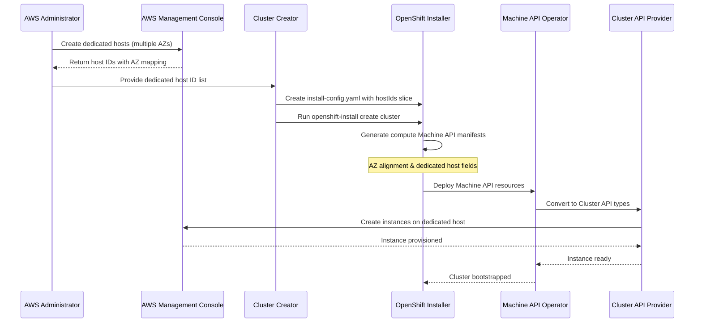
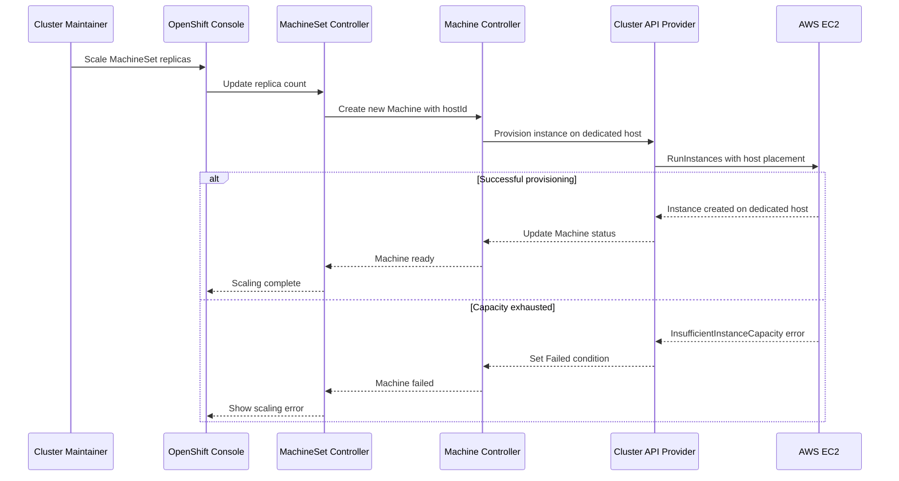
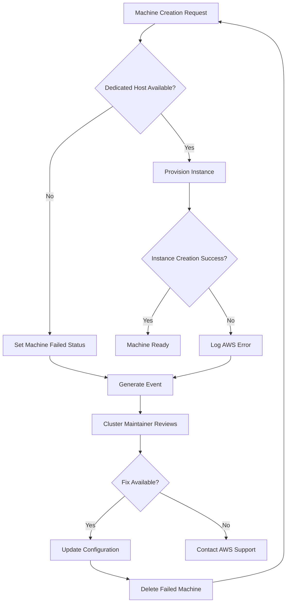

# Installing and Scaling Clusters on Dedicated Hosts in AWS

## Summary

This enhancement proposal outlines the work required to enable OpenShift to deploy and scale compute nodes onto pre-allocated dedicated AWS hosts. This leverages existing AWS infrastructure, focusing on the automated deployment process and integrating OpenShift's node management capabilities with these hosts. The goal is to provide a simplified deployment and management experience for users who already have dedicated hosts set up.

This enhancement covers the initial phase of dedicated host support using pre-allocated hosts. A future phase will add support for dynamic dedicated host allocation, where OpenShift can automatically provision dedicated hosts as needed (see [upstream dynamic allocation PR](https://github.com/kubernetes-sigs/cluster-api-provider-aws/pull/5631)).

## Motivation

### User Stories

1. As an administrator, I want to install OpenShift compute nodes on dedicated AWS hosts so my workloads are isolated from other tenants.

2. As an administrator, I need relevant conditions, events, and/or alerts to ensure I can diagnose compute node deployments on dedicated hosts.

3. As an administrator, I want to scale my OpenShift cluster by adding or removing compute nodes on dedicated hosts with machine API and/or CAPI.

### Goals

- Enable OpenShift to install compute nodes on pre-existing, dedicated AWS hosts.
- Enable OpenShift to scale compute nodes on pre-existing, dedicated AWS hosts.
- Provide meaningful conditions, events, and/or alerts for compute node deployments on dedicated hosts.

### Non-Goals

- Deploying or otherwise managing dedicated hosts on AWS (this will be addressed in a future phase with dynamic dedicated host allocation).

## Proposal

Upstream support for dedicated hosts has been added [upstream](https://github.com/kubernetes-sigs/cluster-api-provider-aws/pull/5548). This PR introduced support for dedicated hosts in the AWS provider. The OpenShift installer and machine management components will be updated to support dedicated hosts, with Machine API types being converted to Cluster API types through conversion code.

Changes to the OpenShift installer will include:
- Introduce fields for dedicated hosts in the [installer compute machinePool for AWS](https://github.com/openshift/installer/blob/main/pkg/types/aws/machinepool.go) to accept a slice of host IDs.
- Update the manifest generation logic to include dedicated hosts when generating Machine API manifests for compute nodes only.
- Implement availability zone alignment logic to ensure dedicated host AZs match the AZs of generated compute MachineSets.

Changes to the machine management components will include:
- Introduce fields for dedicated hosts in the [machine API](https://github.com/openshift/api/blob/master/machine/v1beta1/types_awsprovider.go#L12).
- Implement conversion code in the Machine API Operator to translate Machine API dedicated host fields to Cluster API equivalents during cluster bootstrap.
- The actual dedicated host provisioning will be handled by the underlying Cluster API provider.

### Workflow Description

#### Initial Setup and Cluster Installation

**AWS administrator** is a human user responsible for deploying dedicated hosts.
1. The AWS administrator logs into the AWS Management Console
2. The AWS administrator creates a dedicated host in the desired availability zone
3. The AWS administrator provides the dedicated host ID to the cluster creator

**cluster creator** is a human user responsible for deploying a cluster.
1. The cluster creator creates a new install-config.yaml file
2. The cluster creator specifies a slice of dedicated host IDs in the install-config.yaml file in the compute machine pool
3. The cluster creator runs the `openshift-install create cluster` command to deploy the cluster



If any errors are encountered, the installer should log a descriptive error message and exit. The cluster creator should be able to troubleshoot the issue by reviewing the logs and retrying the deployment.

#### Day 2 Operations and Scaling

**cluster maintainer** is a human user responsible for day 2 operations on the cluster.
1. The cluster maintainer logs into the OpenShift web console to scale up or down nodes in a machine set
2. The cluster maintainer updates the MachineSet replica count or creates new MachineSets with dedicated host configuration



#### Error Handling and Recovery



If any errors are encountered, the machine API controller should log a descriptive error message and set a condition on the impacted machine(s). The cluster maintainer should be able to troubleshoot the issue by reviewing the logs and conditions.

### API Extensions

In the upstream Cluster API, fields have been introduced to add support for dedicated hosts:

```go
	// HostID specifies the Dedicated Host on which the instance should be launched.
	// +optional
	HostID *string `json:"hostId,omitempty"`

	// HostAffinity specifies the dedicated host affinity setting for the instance.
	// When affinity is set to Host, an instance launched onto a specific host always restarts on the same host if stopped.
	// +optional
	// +kubebuilder:validation:Enum:=Default;Host
	HostAffinity *string `json:"hostAffinity,omitempty"`
```

Likewise, the OpenShift Machine API will be updated to include these fields in the [AWS machine provider spec](https://github.com/openshift/api/blob/master/machine/v1beta1/types_awsprovider.go). Conversion code will translate these Machine API fields to the corresponding Cluster API fields during machine reconciliation.

**Install-config.yaml Schema Extension:**
The installer's compute machine pool configuration will be extended to accept dedicated host IDs:

```yaml
compute:
- name: worker
  platform:
    aws:
      type: m5.large
      dedicatedHosts:
        hostIds:
          - "h-1234567890abcdef0"  # us-east-1a
          - "h-0987654321fedcba1"  # us-east-1b
          - "h-abcdef1234567890"   # us-east-1c
        hostAffinity: "host"  # optional, defaults to "host"
```

The installer will validate that:
- All provided host IDs exist and are in the correct region
- Host AZs align with the cluster's configured AZs
- Host instance families are compatible with the specified instance type 

### Topology Considerations

In general, this feature should be transparent to OpenShift components aside from honoring and/or propagating the dedicated host configuration
to [cluster|machine] API.

#### Hypershift / Hosted Control Planes

#### Standalone Clusters

#### Single-node Deployments or MicroShift

### Implementation Details/Notes/Constraints

**Conversion Architecture:**
The implementation follows OpenShift's standard pattern where the installer generates Machine API manifests, and the Machine API Operator handles conversion to Cluster API during cluster bootstrap:

1. **Installer Flow**: Installer reads dedicated host configuration from install-config.yaml and generates Machine API manifests with dedicated host fields
2. **Bootstrap Conversion**: Machine API Operator performs conversion from Machine API types to Cluster API types during cluster startup
3. **Runtime Operation**: Cluster API provider handles actual AWS dedicated host placement

**Key Implementation Details:**
- **Compute Nodes Only**: Dedicated host support is limited to compute nodes; control plane nodes will use standard EC2 instances
- **No Actuator Changes**: The Machine API actuator is not involved in conversion logic
- **Operator-Level Conversion**: Machine API Operator contains the translation logic between Machine API and Cluster API dedicated host fields
- **Bootstrap Timing**: Conversion happens once during cluster bootstrap, not on every machine reconciliation
- **AZ Alignment**: Installer must query AWS to determine dedicated host AZs and match them with compute MachineSet AZs

**Key Constraints:**
- **Host Management**: OpenShift will not manage dedicated host lifecycle (creation/deletion) - only placement of instances
- **Capacity Planning**: Users must ensure adequate capacity on specified dedicated hosts before scaling
- **Cross-AZ Limitations**: Dedicated hosts are AZ-specific, requiring careful MachineSet placement planning
- **Instance Type Matching**: Instance types must be compatible with the dedicated host's hardware configuration

**Integration Points:**
- **Installer**: Generates Machine API manifests with dedicated host configurations from install-config.yaml
- **Machine API Operator**: Performs one-time conversion from Machine API to Cluster API types during bootstrap
- **Cluster API Provider**: Handles actual AWS API calls for dedicated host placement

### Risks and Mitigations

What are the risks of this proposal and how do we mitigate. Think broadly. For
example, consider both security and how this will impact the larger OKD
ecosystem.

How will security be reviewed and by whom?

How will UX be reviewed and by whom?

Consider including folks that also work outside your immediate sub-project.

### Drawbacks

N/A

## Alternatives (Not Implemented)

### Dynamic Dedicated Host Allocation

An alternative approach would be to implement dynamic dedicated host allocation, where OpenShift automatically provisions dedicated hosts as needed rather than requiring pre-allocated hosts. This capability is being developed [upstream](https://github.com/kubernetes-sigs/cluster-api-provider-aws/pull/5631) and will be considered for a future phase of this enhancement.

**Benefits of Dynamic Allocation:**
- Eliminates need for manual host pre-provisioning
- Provides 1:1 instance-to-host mapping automatically
- Simplifies capacity planning and management

**Reasons for Deferring:**
- Pre-allocated host support provides immediate value for existing infrastructure
- Dynamic allocation requires additional complexity in lifecycle management
- Allows for gaining operational experience with dedicated hosts before adding automation

## Open Questions [optional]

## Test Plan

**Note:** *Section not required until targeted at a release.*

- At least 5 new e2e tests will be created and run during the Tech Preview and feature gate promotion period.

## Graduation Criteria

**Note:** *Section not required until targeted at a release.*

Define graduation milestones.

These may be defined in terms of API maturity, or as something else. Initial proposal
should keep this high-level with a focus on what signals will be looked at to
determine graduation.

Consider the following in developing the graduation criteria for this
enhancement:

- Maturity levels
  - [`alpha`, `beta`, `stable` in upstream Kubernetes][maturity-levels]
  - `Dev Preview`, `Tech Preview`, `GA` in OpenShift
- [Deprecation policy][deprecation-policy]

Clearly define what graduation means by either linking to the [API doc definition](https://kubernetes.io/docs/concepts/overview/kubernetes-api/#api-versioning),
or by redefining what graduation means.

In general, we try to use the same stages (alpha, beta, GA), regardless how the functionality is accessed.

[maturity-levels]: https://git.k8s.io/community/contributors/devel/sig-architecture/api_changes.md#alpha-beta-and-stable-versions
[deprecation-policy]: https://kubernetes.io/docs/reference/using-api/deprecation-policy/

**If this is a user facing change requiring new or updated documentation in [openshift-docs](https://github.com/openshift/openshift-docs/),
please be sure to include in the graduation criteria.**

**Examples**: These are generalized examples to consider, in addition
to the aforementioned [maturity levels][maturity-levels].

### Dev Preview -> Tech Preview

**Target Release: OpenShift 4.21**

- Ability to utilize the enhancement end to end
- End user documentation, relative API stability
- Sufficient test coverage
- Gather feedback from users rather than just developers
- Enumerate service level indicators (SLIs), expose SLIs as metrics
- Write symptoms-based alerts for the component(s)

### Tech Preview -> GA

- More testing (upgrade, downgrade, scale)
- Sufficient time for feedback
- Available by default
- Backhaul SLI telemetry
- Document SLOs for the component
- Conduct load testing
- User facing documentation created in [openshift-docs](https://github.com/openshift/openshift-docs/)

**For non-optional features moving to GA, the graduation criteria must include
end to end tests.**

### Removing a deprecated feature

- Announce deprecation and support policy of the existing feature
- Deprecate the feature

## Upgrade / Downgrade Strategy

N/A

## Version Skew Strategy

N/A


## Operational Aspects of API Extensions

This enhancement introduces API extensions to the Machine API to support AWS dedicated hosts. The changes are additive and do not introduce new webhooks, aggregated API servers, or finalizers.

### API Extension Impact Analysis

**Machine API Extensions:**
- Adds two optional fields (`hostId` and `hostAffinity`) to the `AWSMachineProviderSpec`
- These are optional fields that do not affect existing machine provisioning when unspecified
- No impact on API throughput or availability as no new API servers or webhooks are introduced

**Service Level Indicators (SLIs):**
- **machine-api-operator condition**: `Available=True` indicates the controller can process dedicated host configurations
- **machine-api-operator condition**: `Degraded=False` ensures machine reconciliation including dedicated host placement is functioning
- **machine-api-controllers deployment**: Pod health indicates ability to reconcile machines with dedicated host specifications

### Impact on Existing SLIs

**Scalability Impact:**
- Minimal impact: dedicated host fields are processed during existing machine reconciliation cycles
- No additional API calls to AWS beyond existing instance creation workflow
- Expected use cases involve fewer than 100 machines per cluster on dedicated hosts

**API Throughput:**
- No impact on general API throughput as changes are within existing Machine API resource types
- Dedicated host validation adds <10ms to machine creation/update operations

**Performance Measurement:**
- Machine API performance metrics will include dedicated host provisioning times
- QE team will validate performance during Tech Preview testing cycles
- CI automation will measure machine provisioning latency including dedicated host scenarios

### Failure Modes and Impact

**Possible Failure Modes:**
1. **Invalid dedicated host ID**: Machine creation fails with clear error message
2. **Dedicated host unavailable**: AWS returns capacity errors, machine remains in failed state
3. **Dedicated host affinity mismatch**: Instance placement fails, triggers machine replacement

**Cluster Health Impact:**
- Failed machines on dedicated hosts do not impact other cluster machines
- Machine API controller continues processing non-dedicated host machines normally
- No impact on kube-controller-manager or core Kubernetes functionality

**Escalation Teams:**
- **Primary**: Cloud Integration team (machine API, installer)
- **Secondary**: Cluster Infrastructure team (for broader machine API issues)
- **AWS Support**: For dedicated host capacity or configuration issues

## Support Procedures

### Detecting Failure Modes

**Machine Creation Failures:**
- **Symptoms**: Machine remains in "Provisioning" or "Failed" phase
- **Events**: Machine events show "FailedCreate" with AWS error details
- **Logs**: machine-api-controllers logs contain AWS API error responses
- **Metrics**: `machine_api_machine_creation_failed_total` metric increases

**Example log entries:**
```
level=error msg="error creating machine" machine=worker-us-east-1a-12345 error="InvalidHostID.NotFound: The specified dedicated host ID 'h-1234567890abcdef0' does not exist"
```

**Dedicated Host Capacity Issues:**
- **Symptoms**: Multiple machines fail to provision simultaneously
- **Events**: "InsufficientInstanceCapacity" in machine events
- **Logs**: AWS capacity errors in machine-api-controllers
- **Alerts**: Custom alert on dedicated host capacity exhaustion

**Machine API Controller Issues:**
- **Symptoms**: machine-api-operator condition `Degraded=True`
- **Events**: Operator events indicate controller restart or configuration issues
- **Logs**: machine-api-operator logs show reconciliation failures
- **Metrics**: `machine_api_controller_reconcile_errors_total` increases

### Disabling Dedicated Host Functionality

**Method**: Remove `hostId` and `hostAffinity` fields from MachineSet specifications

**Cluster Health Impact:**
- No impact on cluster health as dedicated host fields are optional
- Existing machines on dedicated hosts continue to function normally
- New machines will provision on standard shared infrastructure

**Impact on Existing Workloads:**
- Workloads on existing dedicated host machines continue running normally
- No disruption to pod scheduling or execution
- Existing machine lifecycle operations (reboot, replacement) continue working

**Impact on New Workloads:**
- New machines scale using standard EC2 instances instead of dedicated hosts
- Workloads requiring dedicated host isolation may not meet compliance requirements
- No functional impact on application deployment or execution

### Graceful Failure and Recovery

**Failure Behavior:**
- Dedicated host validation failures result in clear error messages
- Failed machines do not impact other machine operations
- Machine API controller continues processing other machine requests

**Recovery Process:**
- Fix dedicated host configuration (correct host ID, ensure capacity)
- Delete failed machines to trigger reprovisioning
- New machines will provision successfully with corrected configuration
- No manual intervention required for existing workloads

**Consistency Guarantees:**
- Machine API ensures eventual consistency of desired vs actual machine state
- Failed machines are automatically replaced when MachineSet scaling occurs
- No risk of inconsistent cluster state during dedicated host issues

## Infrastructure Needed

### AWS Infrastructure Requirements

**Dedicated Hosts for Testing:**
- **Development**: 2 dedicated hosts in us-east-1 for development and unit testing
- **CI/E2E Testing**: 4 dedicated hosts across 2 availability zones for automated testing
- **QE Validation**: 6 dedicated hosts for comprehensive Tech Preview validation

**Host Specifications:**
- **Instance Family**: m5.large (minimum viable for OpenShift nodes)
- **Placement Groups**: Configured for availability zone distribution
- **Host Affinity**: Both "default" and "host" affinity configurations for testing

**AWS Account Setup:**
- Dedicated testing AWS account with appropriate service limits
- IAM roles with EC2 dedicated host management permissions
- Cost monitoring and alerts for dedicated host usage

### CI/CD Infrastructure

**OpenShift CI Integration:**
- New CI job definitions for dedicated host scenarios
- Test infrastructure provisioning automation
- Cleanup automation to manage dedicated host costs

**Development Environment:**
- AWS development account access for enhancement contributors
- Documentation for local testing setup with dedicated hosts
- Mock/simulation capabilities for unit testing without live AWS resources

### Testing Infrastructure Components

**E2E Test Suite:**
- Automated provisioning/deprovisioning of dedicated hosts
- Machine API validation tests for dedicated host configurations
- Installer integration tests with dedicated host install-config options
- Upgrade/downgrade scenarios with mixed dedicated/standard infrastructure

**Monitoring and Observability:**
- Dedicated host utilization metrics collection
- Performance benchmarking infrastructure for dedicated vs standard hosts