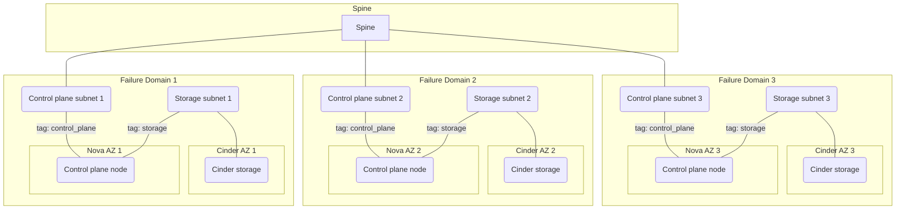

To get started with this template:
1. **Pick a domain.** Find the appropriate domain to discuss your enhancement.
1. **Make a copy of this template.** Copy this template into the directory for
   the domain.
1. **Fill out the "overview" sections.** This includes the Summary and
   Motivation sections. These should be easy and explain why the community
   should desire this enhancement.
1. **Create a PR.** Assign it to folks with expertise in that domain to help
   sponsor the process.
1. **Merge after reaching consensus.** Merge when there is consensus
   that the design is complete and all reviewer questions have been
   answered so that work can begin.  Come back and update the document
   if important details (API field names, workflow, etc.) change
   during code review.
1. **Keep all required headers.** If a section does not apply to an
   enhancement, explain why but do not remove the section. This part
   of the process is enforced by the linter CI job.

See ../README.md for background behind these instructions.

Start by filling out the header with the metadata for this enhancement.

# OpenStack Failure Domains

## Summary

OpenStack deployments do not have a single implementation of failure domains,
but instead define availability zones individually for each service, e.g. Nova
(compute), Neutron (network), and Cinder (storage). OpenShift is capable of
deploying its control plane across multiple failure domains, but for OpenStack
this is currently limited to compute availability zones. This enhancement
proposes a unified definition of failure domains for an OpenStack deployment
covering all supported availability zone types, and defines how OpenShift will
use them when deploying the control plane.

An example deployment with 3 failure domains is shown below:



## Motivation

This section is for explicitly listing the motivation, goals and non-goals of
this proposal. Describe why the change is important and the benefits to users.

### User Stories

* As an administrator, I want to ensure my control plane is resilient to the
  failure of a single compute availability zone.
* As an administrator, I want to ensure my control plane is resilient to the
  failure of a single storage availability zone.
* As an administrator, I want to deploy my control plane across multiple
  independent L2 networks.
* As an administrator, when I implement failure domains for an OpenStack service
  that did not previously have them, I want to be able to automatically redeploy
  my control plane in a running cluster to take advantage of them.
* As an administrator, when I modify a failure domain within my OpenStack
  deployment, I want to be able to automatically redeploy my control plane to
  take advantage of the change.
* As an administrator who does not use failure domains, I do not want to
  change any of my existing configuration or tooling due to this change.
* As a developer of Control Plane MachineSet, I want to know unambiguously what
  failure domain specification was used for a given Machine so I can ensure the
  Machine is redeployed if required.
* As a developer in the Shift on Stack team, I want to ensure that the OpenShift
  definition of OpenStack failure domains is consistent with the
  cluster-api-provider-openstack definition of OpenStack failure domains.

### Goals

* Define a unified failure domain specification for use by machines.
* Integrate this into the installer.
* Ensure this can be integrated into Control Plane MachineSet.

### Non-Goals

* Integration with Control Plane MachineSet.

## Proposal

We will create a new `OpenStackFailureDomain` type defining a set of Machine
properties which together ensure the Machine is deployed to a specific,
consistent failure domain. These properties will be merged into the Machine
definition by the machine provisioner, which may be either the installer or the
machine controller.

```go
type OpenStackFailureDomain struct {
    // ComputeAvailabilityZone is the name of a valid nova availability zone
    // +optional
    ComputeAvailabilityZone string `json:"computeAvailabilityZone,omitempty"`

    // StorageAvailabilityZone is the name of a valid cinder availability zone
    // +optional
    StorageAvailabilityZone string `json:"storageAvailabilityZone,omitempty"`

    // Ports defines a set of ports and their attached networks. These will be prepended to any another ports attached to the server.
    // +optional
    Ports []PortOpts `json:"ports,omitempty"`
}
```

This same struct will be referenced:
* In the installer's InstallConfig for the initial creation of control plane servers and the creation of relevant manifests.
* In OpenStackProviderSpec for the creation of a machine using a specific failure domain.
* In CPMS, for the managed balancing of control plane machines across failure domains.

Leaving any of these fields as their zero value will cause it to be ignored when provisioning the machine. This means a failure domain can define any combination of these fields.

`ComputeAvailabilityZone` will set the Nova availability zone of the created server. It will be an error to specify [`AvailabilityZone`](https://github.com/openshift/api/blob/54592eea55395af31e82fa9a605eb45523115454/machine/v1alpha1/types_openstack.go#L67-L69) on a Machine with a failure domain that specifies `ComputeAvailabilityZone`.

`StorageAvailabilityZone` will set the Cinder availability zone of any volume attached during initial machine creation. This is currently limited to a root volume, but may be extended to include additional volumes in the future. It will be an error to specify [`Zone`](https://github.com/openshift/api/blob/54592eea55395af31e82fa9a605eb45523115454/machine/v1alpha1/types_openstack.go#L358-L360) on a volume attached to a Machine with a failure domain that specifies `StorageAvailabilityZone`.

`Ports` will be used to define a set of port to be attached to all Machines in a failure domain. They use the existing [`PortOpts`](https://github.com/openshift/api/blob/54592eea55395af31e82fa9a605eb45523115454/machine/v1alpha1/types_openstack.go#L283-L333) struct to define ports with all currently supported properties and attachments with the same semantics. Note specifically that the network or subnet a port will attach to must already exist. Unlike `ComputeAvailabilityZone` and `StorageAvailabilityZone` it will be allowed to specify this field on both the failure domain and the Machine. If both are defined they will be merged by putting the failure domain ports first.

### Installer

The installer is directly reponsible for initial creation of the control plane servers. It is only indirectly responsible for creation of workers through the creation of the appropriate manifests.

We will add a `FailureDomains` field to [OpenStack MachinePool](https://github.com/openshift/installer/blob/dbbc890fa40bd49aa761fb03612415e964c9eaf2/pkg/types/openstack/machinepool.go#L5-L35). The semantics of this field will be identical to the semantics of the existing `Zones` field expanded to be complete failure domains. These semantics are described in the comment below. We will document `Zones` as being deprecated, but have no immediate plans to remove it.

```go
    // FailureDomains defines a set of failure domains to be used by this
    // MachinePool. For the control plane, machines will be balanced between
    // these failure domains. For workers the installer will create a seperate
    // MachineSet for each defined failure domain. If empty, failure domains
    // will not be used and a single worker MachineSet will be created.
    //
    // It is an error to define both zones and failureDomains.
    // +optional
    FailureDomains []OpenStackFailureDomain `json:"failureDomains,omitempty"`
```

By default, the Installer creates a subnet where to attach servers that do not have a Failure domain, or servers in Failure domains that do not specify Ports. The `MachinesSubnet` option in install-config can be used to set an existing subnet as the default subnet for machines instead.

_Note that in deployments where all the servers are assigned to Failure domains, and where all these Failure domains have Ports specified, the default subnet for machines may remain empty. To prevent the Installer from creating a subnet, set `MachinesSubnet` in install-config to an existing subnet._

### OpenStackProviderSpec

OpenStackProviderSpec includes a copy of the failure domain. This means that a higher level orchestrator, e.g. the installer when creating multiple MachineSets, or CPMS when creating Machines in different failure domains, only needs to do a simple copy. The Machine controller will validate and merge the FailureDomain with the rest of the MachineSpec at server creation time.

```go
    // The OpenStackFailureDomain used to create the server.
    FailureDomains OpenStackFailureDomain `json:"failureDomains,omitempty"`
```

### Control Plane MachineSet

The full details of integration with Control Plane MachineSet are out of scope of this enhancement. However, we must ensure this enhancement is compatible with future integration with CPMS.

Our primary concern is to ensure we can implement [InjectFailureDomain and ExtractFailureDomain from ProviderConfig](https://github.com/openshift/cluster-control-plane-machine-set-operator/blob/7f66c3455bda9b23ad063eafd4c797541e358d6d/pkg/machineproviders/providers/openshift/machine/v1beta1/providerconfig/providerconfig.go#L51-L59):

```go
  type ProviderConfig interface {
    // InjectFailureDomain is used to inject a failure domain into the ProviderConfig.
    // The returned ProviderConfig will be a copy of the current ProviderConfig with
    // the new failure domain injected.
    InjectFailureDomain(failuredomain.FailureDomain) (ProviderConfig, error)

    // ExtractFailureDomain is used to extract a failure domain from the ProviderConfig.
    ExtractFailureDomain() failuredomain.FailureDomain
```

We can always do this unambiguously because we store the entire failure domain in the ProviderSpec.

### Workflow Description

#### Create a new cluster with control plane and worker failure domains

An OpenStack cloud has 3 failure domains: az1, az2, and az3. Each of these has corresponding Nova(compute) and Cinder(storage) availability zones of the same name. Additionally each failure domain contains a pre-created provider network with a subnet.

The user wants to create a control plane with 3 nodes with each node in a different failure domain, and 6 workers distributed evenly across the same 3 failure domains.

The user creates an install config containing the following:

```yaml
platform:
  openstack:
    machinesSubnet: 31ad4088-7e52-48da-9df5-35e70da438f6
controlPlane:
  name: control-plane
  platform:
    openstack:
      type: m1.large
      rootVolume:
        size: 50
        type: gold
      failureDomains:
      - computeAvailabilityZone: az1
        storageAvailabilityZone: az1
        ports:
        - networkID: 4a270cf8-f5f9-4a09-8cfc-d39d77aa2ba1
          fixedIPs:
          - subnetID: 31ad4088-7e52-48da-9df5-35e70da438f6
          tags:
          - "control-plane"
      - computeAvailabilityZone: az2
        storageAvailabilityZone: az2
        ports:
        - networkID: dbc8664c-feee-4168-854b-75f8eb8eb258
          fixedIPs:
          - subnetID: c23f88c0-910a-4d4a-9ca6-9a11a0d71f40
          tags:
          - "control-plane"
      - computeAvailabilityZone: az3
        storageAvailabilityZone: az3
        ports:
        - networkID: a996c932-2aa1-4095-a40e-765bf844fcb4
          fixedIPs:
          - subnetID: 61d376b0-3714-4549-b017-3a5e0007f07c
          tags:
          - "control-plane"
  replicas: 3
compute:
- name: worker
  platform:
    openstack:
      type: m1.large
      rootVolume:
        size: 50
        type: silver
      failureDomains:
      - computeAvailabilityZone: az1
        storageAvailabilityZone: az1
        ports:
        - networkID: 4a270cf8-f5f9-4a09-8cfc-d39d77aa2ba1
          fixedIPs:
          - subnetID: 31ad4088-7e52-48da-9df5-35e70da438f6
          tags:
          - "control-plane"
      - computeAvailabilityZone: az2
        storageAvailabilityZone: az2
        ports:
        - networkID: dbc8664c-feee-4168-854b-75f8eb8eb258
          fixedIPs:
          - subnetID: c23f88c0-910a-4d4a-9ca6-9a11a0d71f40
          tags:
          - "control-plane"
      - computeAvailabilityZone: az3
        storageAvailabilityZone: az3
        ports:
        - networkID: a996c932-2aa1-4095-a40e-765bf844fcb4
          fixedIPs:
          - subnetID: 61d376b0-3714-4549-b017-3a5e0007f07c
          tags:
          - "control-plane"
  replicas: 6
```

Note that by specifying `machinesSubnet` the installer will not create a default control plane network. Any future workers created without explicit ports will be attached to this subnet.

The created Machines will contain the relevant failure domain in full in their `OpenStackProviderSpec`, e.g.:

```yaml
  ...
  flavor: m1.large
  rootVolume:
    volumeType: gold
    size: 50
  failureDomain:
    computeAvailabilityZone: az1
    storageAvailabilityZone: az1
    ports:
    - networkID: 4a270cf8-f5f9-4a09-8cfc-d39d77aa2ba1
      fixedIPs:
      - subnetID: 31ad4088-7e52-48da-9df5-35e70da438f6
      tags:
      - "control-plane"
```

#### Upgrade an existing cluster to use control plane failure domains

This is not supported until we integrate with Control Plane MachineSet.

#### Upgrade an existing cluster to use worker failure domains

Note that there is currently little reason to do this. The only functionality we currently have for distributing workers across failure domains is in the installer, so not relevent to an existing cluster. However, the user would do this by creating a new MachineSet with a template containing the failure domain definition. e.g.:

```yaml
spec:
  ...
  replicas: 5
  template:
    ...
    spec:
      providerSpec:
        value:
          apiVersion: openstackproviderconfig.openshift.io/v1alpha1
          kind: OpenstackProviderSpec
          ...
          flavor: m1.large
          image: rhcos
          failureDomain:
            computeAvailabilityZone: az1
            ports:
            - networkID: 4a270cf8-f5f9-4a09-8cfc-d39d77aa2ba1
              fixedIPs:
              - subnetID: 31ad4088-7e52-48da-9df5-35e70da438f6
              tags:
              - "control-plane"
```

#### Variation [optional]

A failure domain with only compute availability zones:

```yaml
failureDomain:
  computeAvailabilityZone: az1
```

A failure domain with only storage availability zones:

```yaml
failureDomain:
  storageAvailabilityZone: az1
```

A failure domain with only network ports:

```yaml
failureDomain:
  ports:
  - networkID: 4a270cf8-f5f9-4a09-8cfc-d39d77aa2ba1
    fixedIPs:
    - subnetID: 31ad4088-7e52-48da-9df5-35e70da438f6
    tags:
    - "control-plane"
```

A failure domain defining both control plane and storage network ports:

```yaml
failureDomain:
  ports:
  - networkID: 4a270cf8-f5f9-4a09-8cfc-d39d77aa2ba1
    fixedIPs:
    - subnetID: 31ad4088-7e52-48da-9df5-35e70da438f6
    tags:
    - "control-plane"
  - networkID: deb137b1-8ea4-4674-ab46-4cdaaa27637d
    fixedIPs:
    - subnetID: e5cb5138-8427-4cbe-ac10-bcf86b7b0db0
    tags:
    - "storage"
```

An empty failure domain is valid, but probably not very useful:

```yaml
failureDomain:
```

### API Extensions

We change 2 APIs:

* [OpenStack `MachinePool`](https://github.com/openshift/installer/blob/dbbc890fa40bd49aa761fb03612415e964c9eaf2/pkg/types/openstack/machinepool.go#L5-L35) as described in [the Installer section](#installer).
* [`OpenStackProviderSpec`](https://github.com/openshift/api/blob/54592eea55395af31e82fa9a605eb45523115454/machine/v1alpha1/types_openstack.go#L30-L107) as described in [the `OpenStackProviderSpec` section](#openstackproviderspec).

In both cases we are strictly adding new functionality rather than modifying existing behaviour.

OpenStack `MachinePool` is referenced in both the `compute` and `controlPlane` sections of install-config with behaviour defined above.

`OpenStackProviderSpec` is not strictly directly referenced by any CRD as it is only ever embedded as a Raw value. However, being embedded in the `MachineSpec` it is effectively referenced by `Machine` and `MachineSet`. It does not modify the behaviour of any component other than `machine-api-provider-openstack` (the OpenStack machine controller) as described above.

Integration with Control Plane MachineSet will require a modification to that API. However, while it is planned it is not yet defined.

### Implementation Details/Notes/Constraints

We will implement this behaviour in upstream CAPO first. Critically the points of similarity will be:

* The OpenStackFailureDomain struct will be identical in OpenShift and CAPO. To ensure the independence of the OpenShift API we will have a copy rather than a reference, but the intention will be for them to remain in lock step.
* CAPO will have a complete copy of the failure domain in the OpenStackMachineSpec analogous to the copy of the failure domain in OpenStackProviderSpec.

The intention is that in CAPO the machine controller will substitute failure domain values into machine spec prior to calling the server creation function shared with MAPO. Therefore MAPO will also have to do this failure domain substitution.

Note that the above is subject to change due to upstream review.

### Risks and Mitigations

None yet.

### Drawbacks

Keeping copies of failure domains everywhere is safe, but clunky. In particular, having copies of failure domains in both compute and control-plane in install-config is not ergonomic.

The implementation of this feature in CAPI is problematic because failure domains are referenced by name and mutable. This presents a problem with MachineDeployment if the referenced failure domain is updated because there is no API change which MachineDeployment will notice. The same is true of Machines deployed in the control plane. The risk is that fixing this in CAPI may result in a significantly different API for failure domains which we may have to adapt to in order to continue reusing code. The risk of this is probably low.

## Design Details

### Open Questions [optional]

None.

### Test Plan

**Note:** *Section not required until targeted at a release.*

Consider the following in developing a test plan for this enhancement:
- Will there be e2e and integration tests, in addition to unit tests?
- How will it be tested in isolation vs with other components?
- What additional testing is necessary to support managed OpenShift service-based offerings?

No need to outline all of the test cases, just the general strategy. Anything
that would count as tricky in the implementation and anything particularly
challenging to test should be called out.

All code is expected to have adequate tests (eventually with coverage
expectations).

### Graduation Criteria

**Note:** *Section not required until targeted at a release.*

Define graduation milestones.

These may be defined in terms of API maturity, or as something else. Initial proposal
should keep this high-level with a focus on what signals will be looked at to
determine graduation.

Consider the following in developing the graduation criteria for this
enhancement:

- Maturity levels
  - [`alpha`, `beta`, `stable` in upstream Kubernetes][maturity-levels]
  - `Dev Preview`, `Tech Preview`, `GA` in OpenShift
- [Deprecation policy][deprecation-policy]

Clearly define what graduation means by either linking to the [API doc definition](https://kubernetes.io/docs/concepts/overview/kubernetes-api/#api-versioning),
or by redefining what graduation means.

In general, we try to use the same stages (alpha, beta, GA), regardless how the functionality is accessed.

[maturity-levels]: https://git.k8s.io/community/contributors/devel/sig-architecture/api_changes.md#alpha-beta-and-stable-versions
[deprecation-policy]: https://kubernetes.io/docs/reference/using-api/deprecation-policy/

**If this is a user facing change requiring new or updated documentation in [openshift-docs](https://github.com/openshift/openshift-docs/),
please be sure to include in the graduation criteria.**

**Examples**: These are generalized examples to consider, in addition
to the aforementioned [maturity levels][maturity-levels].

#### Dev Preview -> Tech Preview

- 

- Ability to utilize the enhancement end to end
- End user documentation, relative API stability
- Sufficient test coverage
- Gather feedback from users rather than just developers
- Enumerate service level indicators (SLIs), expose SLIs as metrics
- Write symptoms-based alerts for the component(s)

#### Tech Preview -> GA

- More testing (upgrade, downgrade, scale)
- Sufficient time for feedback
- Available by default
- Backhaul SLI telemetry
- Document SLOs for the component
- Conduct load testing
- User facing documentation created in [openshift-docs](https://github.com/openshift/openshift-docs/)

**For non-optional features moving to GA, the graduation criteria must include
end to end tests.**

#### Removing a deprecated feature

- Announce deprecation and support policy of the existing feature
- Deprecate the feature

### Upgrade / Downgrade Strategy

If applicable, how will the component be upgraded and downgraded? Make sure this
is in the test plan.

Consider the following in developing an upgrade/downgrade strategy for this
enhancement:
- What changes (in invocations, configurations, API use, etc.) is an existing
  cluster required to make on upgrade in order to keep previous behavior?
- What changes (in invocations, configurations, API use, etc.) is an existing
  cluster required to make on upgrade in order to make use of the enhancement?

Upgrade expectations:
- Each component should remain available for user requests and
  workloads during upgrades. Ensure the components leverage best practices in handling [voluntary
  disruption](https://kubernetes.io/docs/concepts/workloads/pods/disruptions/). Any exception to
  this should be identified and discussed here.
- Micro version upgrades - users should be able to skip forward versions within a
  minor release stream without being required to pass through intermediate
  versions - i.e. `x.y.N->x.y.N+2` should work without requiring `x.y.N->x.y.N+1`
  as an intermediate step.
- Minor version upgrades - you only need to support `x.N->x.N+1` upgrade
  steps. So, for example, it is acceptable to require a user running 4.3 to
  upgrade to 4.5 with a `4.3->4.4` step followed by a `4.4->4.5` step.
- While an upgrade is in progress, new component versions should
  continue to operate correctly in concert with older component
  versions (aka "version skew"). For example, if a node is down, and
  an operator is rolling out a daemonset, the old and new daemonset
  pods must continue to work correctly even while the cluster remains
  in this partially upgraded state for some time.

Downgrade expectations:
- If an `N->N+1` upgrade fails mid-way through, or if the `N+1` cluster is
  misbehaving, it should be possible for the user to rollback to `N`. It is
  acceptable to require some documented manual steps in order to fully restore
  the downgraded cluster to its previous state. Examples of acceptable steps
  include:
  - Deleting any CVO-managed resources added by the new version. The
    CVO does not currently delete resources that no longer exist in
    the target version.

### Version Skew Strategy

How will the component handle version skew with other components?
What are the guarantees? Make sure this is in the test plan.

Consider the following in developing a version skew strategy for this
enhancement:
- During an upgrade, we will always have skew among components, how will this impact your work?
- Does this enhancement involve coordinating behavior in the control plane and
  in the kubelet? How does an n-2 kubelet without this feature available behave
  when this feature is used?
- Will any other components on the node change? For example, changes to CSI, CRI
  or CNI may require updating that component before the kubelet.

### Operational Aspects of API Extensions

Describe the impact of API extensions (mentioned in the proposal section, i.e. CRDs,
admission and conversion webhooks, aggregated API servers, finalizers) here in detail,
especially how they impact the OCP system architecture and operational aspects.

- For conversion/admission webhooks and aggregated apiservers: what are the SLIs (Service Level
  Indicators) an administrator or support can use to determine the health of the API extensions

  Examples (metrics, alerts, operator conditions)
  - authentication-operator condition `APIServerDegraded=False`
  - authentication-operator condition `APIServerAvailable=True`
  - openshift-authentication/oauth-apiserver deployment and pods health

- What impact do these API extensions have on existing SLIs (e.g. scalability, API throughput,
  API availability)

  Examples:
  - Adds 1s to every pod update in the system, slowing down pod scheduling by 5s on average.
  - Fails creation of ConfigMap in the system when the webhook is not available.
  - Adds a dependency on the SDN service network for all resources, risking API availability in case
    of SDN issues.
  - Expected use-cases require less than 1000 instances of the CRD, not impacting
    general API throughput.

- How is the impact on existing SLIs to be measured and when (e.g. every release by QE, or
  automatically in CI) and by whom (e.g. perf team; name the responsible person and let them review
  this enhancement)

#### Failure Modes

- Describe the possible failure modes of the API extensions.
- Describe how a failure or behaviour of the extension will impact the overall cluster health
  (e.g. which kube-controller-manager functionality will stop working), especially regarding
  stability, availability, performance and security.
- Describe which OCP teams are likely to be called upon in case of escalation with one of the failure modes
  and add them as reviewers to this enhancement.

#### Support Procedures

Describe how to
- detect the failure modes in a support situation, describe possible symptoms (events, metrics,
  alerts, which log output in which component)

  Examples:
  - If the webhook is not running, kube-apiserver logs will show errors like "failed to call admission webhook xyz".
  - Operator X will degrade with message "Failed to launch webhook server" and reason "WehhookServerFailed".
  - The metric `webhook_admission_duration_seconds("openpolicyagent-admission", "mutating", "put", "false")`
    will show >1s latency and alert `WebhookAdmissionLatencyHigh` will fire.

- disable the API extension (e.g. remove MutatingWebhookConfiguration `xyz`, remove APIService `foo`)

  - What consequences does it have on the cluster health?

    Examples:
    - Garbage collection in kube-controller-manager will stop working.
    - Quota will be wrongly computed.
    - Disabling/removing the CRD is not possible without removing the CR instances. Customer will lose data.
      Disabling the conversion webhook will break garbage collection.

  - What consequences does it have on existing, running workloads?

    Examples:
    - New namespaces won't get the finalizer "xyz" and hence might leak resource X
      when deleted.
    - SDN pod-to-pod routing will stop updating, potentially breaking pod-to-pod
      communication after some minutes.

  - What consequences does it have for newly created workloads?

    Examples:
    - New pods in namespace with Istio support will not get sidecars injected, breaking
      their networking.

- Does functionality fail gracefully and will work resume when re-enabled without risking
  consistency?

  Examples:
  - The mutating admission webhook "xyz" has FailPolicy=Ignore and hence
    will not block the creation or updates on objects when it fails. When the
    webhook comes back online, there is a controller reconciling all objects, applying
    labels that were not applied during admission webhook downtime.
  - Namespaces deletion will not delete all objects in etcd, leading to zombie
    objects when another namespace with the same name is created.

## Implementation History

Major milestones in the life cycle of a proposal should be tracked in `Implementation
History`.

## Alternatives

Similar to the `Drawbacks` section the `Alternatives` section is used to
highlight and record other possible approaches to delivering the value proposed
by an enhancement.

## Infrastructure Needed [optional]

Use this section if you need things from the project. Examples include a new
subproject, repos requested, github details, and/or testing infrastructure.

Listing these here allows the community to get the process for these resources
started right away.
