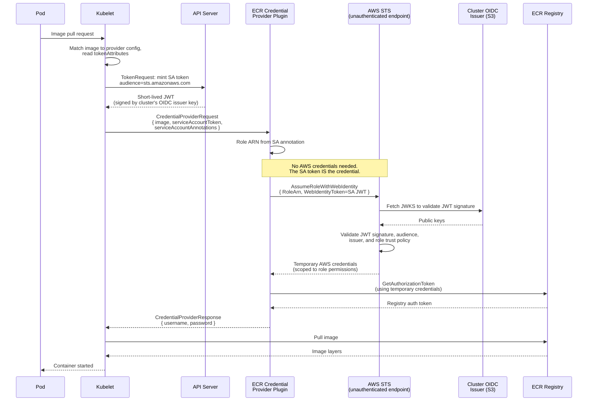
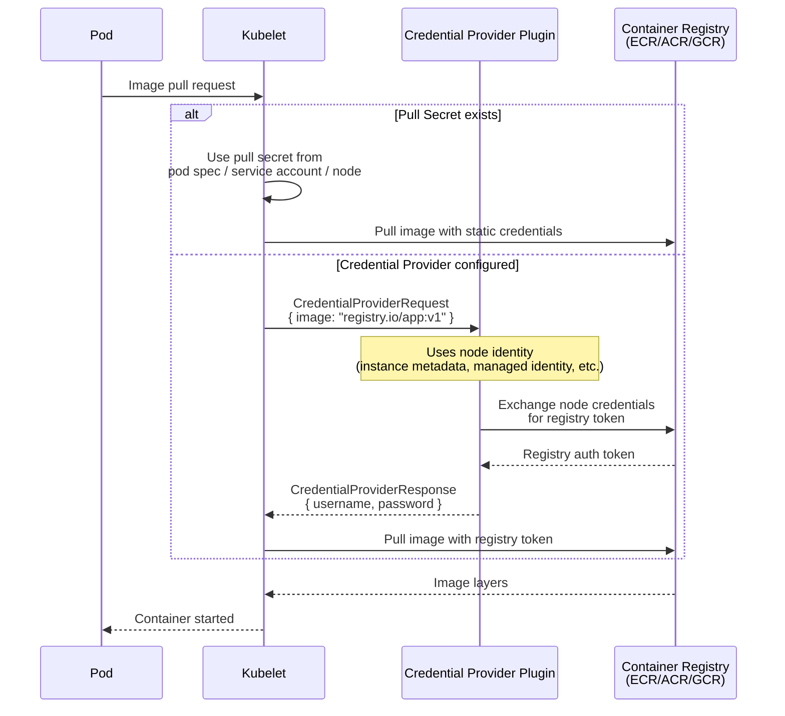
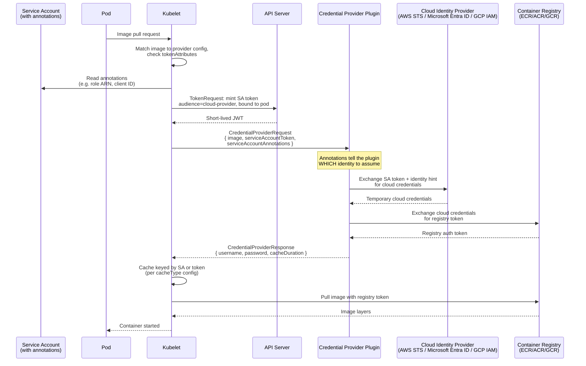

# Projected Service Account Tokens for Kubelet Image Credential Providers

## Summary

Enable per-workload identity for container image pulls in OpenShift by adopting KEP-4412 (Projected Service Account Tokens for Kubelet Image Credential Providers). Today, all pods on a node share the node's cloud identity (EC2 instance profile, Azure managed identity, or GCP service account) for image pulls, or rely on long-lived pull secrets. KEP-4412 allows the kubelet to project a short-lived service account token and pass it, along with service account annotations, to credential provider plugins, enabling plugins to exchange workload-specific identity for registry credentials.

This enhancement proposes the least work required for OpenShift to adopt KEP-4412: additive enablement across all three cloud credential providers (ECR, ACR, GCR), shipping sensible default configurations via the Machine Config Operator (MCO), and providing a mechanism for cluster administrators to customize the configuration. The adoption is purely additive: workloads that opt in get per-workload identity, everything else continues to work as today. This is also a prerequisite for the longer-term goal of removing install-time node identity provisioning, which is described in this document but scoped as separate follow-on work.

## Motivation

Currently, image pull credentials in OpenShift come from one of two sources:

1. **Node identity** — the credential provider plugin uses the node's cloud credentials (EC2 instance profile, Azure managed identity, or GCP service account attached to the VM). Every pod on the node gets the same registry access regardless of its own identity. Note: "service account" in the cloud provider context (e.g. GCP service account, Azure managed identity) refers to a VM-level cloud identity, not a Kubernetes service account. This document uses "service account" without a cloud prefix to mean a Kubernetes service account.
2. **Pull secrets** — long-lived, hard to rotate, often shared cluster-wide, and a frequent source of security audit findings.

Neither approach supports fine-grained, per-workload access control for image pulls. 

KEP-4412 (Kubernetes v1.33 alpha, solves this by allowing the kubelet to mint a short-lived service account token bound to the pod and pass it to the credential provider plugin, along with filtered annotations from the pod's service account. The plugin can then exchange the token for workload-specific cloud credentials and use those to authenticate to the registry.

### User Stories

* As a cluster administrator, I want workloads to pull images using their own identity so that I can enforce least-privilege access to container registries without managing pull secrets.

* As a security engineer, I want to eliminate long-lived pull secrets from the cluster so that I can reduce the attack surface and satisfy compliance requirements around credential rotation.

* As a platform engineer running a multi-tenant cluster, I want different teams' workloads to pull from different registries (or different repositories within a registry) based on their service account identity, so that I can enforce tenant isolation at the image pull layer.

* As a cluster administrator, I want the credential provider configuration to ship with sensible defaults but be customizable, so that I can adapt it to my organization's cloud identity setup without maintaining my own MCO overrides from scratch.

* As a security-conscious customer, I want the installer to not provision a default node identity for image pulls, so that I can reduce the blast radius of node compromise and use day-2 provisioned credentials instead of install-time baked-in identity.

### Goals

- Enable per-workload identity for image pulls on AWS (ECR), Azure (ACR), and GCP (GCR/Artifact Registry).
- Ship default `tokenAttributes` configuration for each cloud provider via MCO.
- Ensure backward compatibility: clusters without the feature gate enabled, or pods without service accounts / annotations, continue to work.
- Provide a supported mechanism for cluster administrators to customize credential provider configuration (annotation keys, audiences, etc.).
- Work upstream to make annotation keys configurable rather than hardcoded in each plugin, avoiding OpenShift carry patches.

#### Out of scope but enabled by this work

- **Removing install-time node identity from the installer.** KEP-4412 adoption is a prerequisite for this work. See [Removing node identity from install](#removing-node-identity-from-install) for the proposed approach.
- **Removing the ROSA ECR token refresh shim.** ROSA currently works around the lack of credential provider support by injecting a Python script via MachineConfig as a systemd unit on a 4h timer to fetch ECR tokens. KEP-4412 replaces this with the kubelet's native credential provider framework. See [ARO-24037](https://redhat.atlassian.net/browse/ARO-24037).

### Non-Goals

- Implementing a new CRD or operator for credential provider configuration management. If MachineConfig overrides are sufficient, we should use them.

## Proposal

### Overview

The work spans three areas:

1. **Credential provider plugins** (cloud-provider-aws, cloud-provider-azure, cloud-provider-gcp): Implement or complete KEP-4412 support in each plugin, ensuring annotation keys are configurable.
2. **MCO templates** (machine-config-operator): Add `tokenAttributes` to the shipped credential provider configs with sensible defaults per cloud provider.
3. **Upstream contributions**: Make annotation keys configurable in each plugin to avoid OpenShift carry patches.

The following section covers how the underlying token mechanism works, since the rest of the proposal builds on it.

#### Background: how TokenRequest works

KEP-4412 depends on the Kubernetes [TokenRequest API](https://kubernetes.io/docs/reference/access-authn-authz/service-accounts-admin/), which allows the kubelet to mint short-lived, audience-scoped [service account tokens](https://kubernetes.io/docs/concepts/security/service-accounts/) on behalf of a pod. Key properties:

- **Every pod has a service account.** Kubernetes auto-creates a `default` service account in every namespace and binds it to pods that don't specify one. The kubelet can call `TokenRequest` for any pod's service account.
- **Tokens are minted before image pull.** The pod object exists in etcd and is bound to its service account at creation time. The kubelet calls `TokenRequest` while the pod is still `Pending`, so the token does not depend on the container image being pulled first.
- **Tokens are short-lived and audience-scoped.** Each token includes an `aud` (audience) claim that tells the consumer (e.g. AWS STS, Microsoft Entra ID) "this token was minted for you." Tokens expire (default 1 hour) and the kubelet rotates them automatically.
- **No cloud credentials are involved.** The kubelet authenticates to the API server using its own client certificate (set up during node TLS bootstrapping). The API server signs the token with the cluster's OIDC issuer key. The token exchange endpoint (AWS STS, Microsoft Entra ID, or GCP IAM) validates the token against the cluster's OIDC issuer public keys, so no instance profile, managed identity, or GCP service account on the node is needed.

**How does the cloud provider trust these tokens?** OpenShift clusters with Workload Identity / STS mode enabled have an OIDC issuer, a publicly accessible endpoint (hosted on S3, Azure blob storage, or GCS) that publishes the cluster's public signing keys. During cluster install, `ccoctl` (or the installer) registers this OIDC issuer with the cloud provider as a trusted identity provider. When a credential provider plugin presents a service account token to the cloud (e.g. via `AssumeRoleWithWebIdentity`), the cloud fetches the cluster's public keys from the OIDC issuer, verifies the token's signature, and checks that the token's audience and subject match the IAM role's trust policy. This is standard OIDC federation — the cluster is just another OIDC identity provider from the cloud's perspective.

For more background, see the [Kubernetes v1.33 blog post](https://kubernetes.io/blog/2025/05/07/kubernetes-v1-33-wi-for-image-pulls/) and [v1.34 beta graduation announcement](https://kubernetes.io/blog/2025/09/03/kubernetes-v1-34-sa-tokens-image-pulls-beta/). OpenShift's existing [bound service account token documentation](https://docs.redhat.com/en/documentation/openshift_container_platform/4.9/html/authentication_and_authorization/bound-service-account-tokens) covers the underlying mechanism.

#### What KEP-4412 adoption looks like

KEP-4412 adoption is additive. It requires an OIDC issuer (i.e. WI/STS mode clusters, including ROSA and ARO):

- Enable `tokenAttributes` in the MCO-shipped credential provider configs
- To opt in, a cluster administrator annotates a **Kubernetes ServiceAccount object** with the cloud identity to use for image pulls (e.g. an IAM role ARN, an Entra ID client ID). Every pod bound to that service account inherits the identity. The kubelet reads the annotations from the ServiceAccount, mints a short-lived token, and passes both to the credential provider plugin.
- Pods whose service account has no annotations continue to use their current pull mechanism (node identity or pull secrets)
- Nothing changes for workloads that don't opt in

This does not by itself remove install-time node identity, but it is a necessary stepping stone. Once KEP-4412 is adopted, the credential provider plugin infrastructure is in place for follow-on work to replace node identity with CCO-provisioned credentials — see [Removing node identity from install](#removing-node-identity-from-install).

### How it works: ECR reference flow

This section shows the full KEP-4412 flow using ECR as the reference. The same pattern applies to ACR and GCR (with differences noted in [Current state of each provider](#current-state-of-each-provider)).



To grant a workload its own cloud identity for image pulls, a cluster administrator (or their templating/GitOps tooling) annotates the workload's **Kubernetes service account**, not the pod. The kubelet reads annotations from the service account object and passes them to the credential provider plugin, which uses them to determine which cloud identity to assume. The cloud identity referenced by the annotation must already exist and have the appropriate permissions (e.g. an IAM role with ECR pull permissions, or an Entra ID app registration with AcrPull) — provisioned either manually or via a CredentialsRequest. Workloads without these annotations continue to use node identity as they do today.


| Scenario | Identity used | How |
|----------|--------------|-----|
| Pod with service account annotation | Per-workload role from annotation | Service account token + annotation role ARN → `AssumeRoleWithWebIdentity` |
| Pod without annotation | Node identity (instance profile) | No annotation → no token sent → default AWS credential chain |

See [ECR reference implementation](#ecr-reference-implementation) and [ACR reference implementation](#acr-reference-implementation) below for the full kubelet config and service account YAML for each provider.

### Current state of each provider

| Provider | Repo | KEP-4412 implemented? | Annotation keys | Notes |
|----------|------|-----------------------|-----------------|-------|
| ECR | cloud-provider-aws | Yes | `eks.amazonaws.com/ecr-role-arn` (hardcoded, optional) | Uses AWS Security Token Service (STS) `AssumeRoleWithWebIdentity`. Falls back to node identity if no token. Annotation key is EKS-specific. |
| ACR | cloud-provider-azure | Yes ([PR #9907](https://github.com/kubernetes-sigs/cloud-provider-azure/pull/9907)) | `kubernetes.azure.com/acr-client-id`, `kubernetes.azure.com/acr-tenant-id` (hardcoded, **required**) | Uses Workload Identity Federation via `ClientAssertionCredential`. Falls back to managed identity if no token. |
| GCR | cloud-provider-gcp | No | N/A | Not implemented upstream. Opportunity to shape from the start. |

#### ACR implementation detail

The upstream ACR plugin (`pkg/credentialprovider/azure_credentials.go`, `NewAcrProvider`) has two auth paths relevant to OpenShift:

- **Workload Identity Federation**: When `request.ServiceAccountToken` is non-empty. Uses `azidentity.NewClientAssertionCredential` with the SA token as the client assertion. Requires both `kubernetes.azure.com/acr-client-id` and `kubernetes.azure.com/acr-tenant-id` from annotations — missing either is a hard error.
- **Managed Identity** (fallback): When no SA token is present. Uses `cloud.conf` (`useManagedIdentityExtension`, `userAssignedIdentityID`).

Annotation keys are hardcoded in `pkg/credentialprovider/consts.go` with an AKS-specific prefix (`kubernetes.azure.com`), same configurability problem as ECR.

Key difference from ECR: annotations are **required**, not optional. This means for the kubelet config:
```yaml
tokenAttributes:
  serviceAccountTokenAudience: "api://AzureADTokenExchange"
  cacheType: "ServiceAccount"
  requireServiceAccount: false
  requiredServiceAccountAnnotationKeys:
    - "kubernetes.azure.com/acr-client-id"
    - "kubernetes.azure.com/acr-tenant-id"
```
Using `requiredServiceAccountAnnotationKeys` means the kubelet won't invoke the plugin with a token for service accounts missing either annotation — those pods fall through to managed identity. This is clean behavior for OpenShift: annotate service accounts that need per-workload ACR access, everything else uses the node/managed identity path.

### Credential provider config delivery (MCO)

Credential provider configs are currently shipped as static inline files in MCO templates:

- `templates/common/aws/files/etc-kubernetes-credential-providers-ecr-credential-provider.yaml`
- `templates/common/azure/files/etc-kubernetes-credential-providers-acr-credential-provider.yaml`
- `templates/common/gcp/files/etc-kubernetes-credential-providers-gcr-credential-provider.yaml`

These land on nodes at `/etc/kubernetes/credential-providers/<provider>.yaml`.

Today's configs contain only `matchImages`, `defaultCacheDuration`, `apiVersion`, and optional `args`. There is no `tokenAttributes` and no mechanism for admin customization beyond writing a MachineConfig that replaces the file.

### Workflow Description

#### How it works today (node identity)



#### How it works with KEP-4412 (per-workload identity)



### API Extensions

None. This enhancement does not introduce new Custom Resource Definitions or modify the OpenShift API surface. The `tokenAttributes` field is part of the upstream kubelet `CredentialProviderConfig` API.

### Topology Considerations

#### Hypershift / Hosted Control Planes

In HyperShift, credential provider configs are delivered via CAPZ-generated ignition, not MCO. The `tokenAttributes` configuration would need to be plumbed through HyperShift's config generation for worker nodes (VMSS managed by CAPZ). See [OCPSTRAT-2951](https://redhat.atlassian.net/browse/OCPSTRAT-2951) for the current VM-managed-identity approach being pursued for ARO HCP, and [ARO-20731](https://redhat.atlassian.net/browse/ARO-20731) / [ARO-24037](https://redhat.atlassian.net/browse/ARO-24037) for the customer-facing asks driving this work.

#### Standalone Clusters

This is the primary target topology.

#### Single-node Deployments or MicroShift

The feature adds no new controllers or operators. The only resource impact is the additional TokenRequest API call per image pull.

MicroShift: TBD

#### OpenShift Kubernetes Engine

TBD — needs input from OKE team.

### Implementation Details/Notes/Constraints

#### Upstream work required

1. **ECR (cloud-provider-aws)**: Make the annotation key configurable via args or environment variable. Currently hardcoded to `eks.amazonaws.com/ecr-role-arn` — EKS-specific, not usable for OpenShift without a carry patch.
2. **ACR (cloud-provider-azure)**: KEP-4412 support is already merged ([PR #9907](https://github.com/kubernetes-sigs/cloud-provider-azure/pull/9907)). Annotation keys (`kubernetes.azure.com/acr-client-id`, `kubernetes.azure.com/acr-tenant-id`) are hardcoded in `pkg/credentialprovider/consts.go` — need the same configurability fix as ECR.
3. **GCR (cloud-provider-gcp)**: Implement KEP-4412 support from scratch. Opportunity to establish the configurable-annotation-key pattern from the start.

#### MCO changes

Add `tokenAttributes` to the shipped credential provider configs. The feature gate and config changes ship in the same z-release, so there is no version skew concern — we control both sides.

#### ECR reference implementation

Service account:
```yaml
apiVersion: v1
kind: ServiceAccount
metadata:
  name: my-app
  annotations:
    eks.amazonaws.com/ecr-role-arn: "arn:aws:iam::123456789012:role/my-app-ecr-role"
```

The plugin (`cloud-provider-aws/cmd/ecr-credential-provider/main.go`, `buildCredentialsProvider`):
1. Checks `request.ServiceAccountToken` — if empty, returns nil (falls back to node identity)
2. Reads IAM role ARN from `request.ServiceAccountAnnotations` (annotation key currently hardcoded)
3. Falls back to `AWS_ECR_ROLE_ARN` environment variable if annotation absent
4. Calls AWS Security Token Service `AssumeRoleWithWebIdentity` with the service account token as the web identity token
5. Returns temporary IAM credentials used for the ECR `GetAuthorizationToken` call

Kubelet config:
```yaml
tokenAttributes:
  serviceAccountTokenAudience: "sts.amazonaws.com"
  cacheType: "ServiceAccount"
  requireServiceAccount: false
  optionalServiceAccountAnnotationKeys:
    - "eks.amazonaws.com/ecr-role-arn"
```

`requireServiceAccount: false` ensures static pods and pods without service accounts still fall back to node identity.

#### ACR reference implementation

Service account:
```yaml
apiVersion: v1
kind: ServiceAccount
metadata:
  name: my-app
  annotations:
    kubernetes.azure.com/acr-client-id: "00000000-0000-0000-0000-000000000000"
    kubernetes.azure.com/acr-tenant-id: "00000000-0000-0000-0000-000000000000"
```

The plugin (`cloud-provider-azure/pkg/credentialprovider/azure_credentials.go`, `getServiceAccountTokenCredential`):
1. Checks `request.ServiceAccountToken` — if empty, falls back to managed identity via `cloud.conf`
2. Reads `kubernetes.azure.com/acr-client-id` and `kubernetes.azure.com/acr-tenant-id` from `request.ServiceAccountAnnotations` — **both required**, hard error if missing
3. Creates an `azidentity.ClientAssertionCredential` using the service account token as the client assertion
4. Microsoft Entra ID validates the token against the cluster's OIDC issuer and returns an access token
5. The plugin exchanges the access token for an ACR refresh token via the ACR token exchange endpoint

Kubelet config:
```yaml
tokenAttributes:
  serviceAccountTokenAudience: "api://AzureADTokenExchange"
  cacheType: "ServiceAccount"
  requireServiceAccount: false
  requiredServiceAccountAnnotationKeys:
    - "kubernetes.azure.com/acr-client-id"
    - "kubernetes.azure.com/acr-tenant-id"
```

Key differences from ECR:
- **Two annotations required** (client ID and tenant ID) vs one optional annotation for ECR
- **No environment variable fallback** — if annotations are missing, the kubelet won't send a token at all (because `requiredServiceAccountAnnotationKeys` is used). The plugin falls through to managed identity.
- The service account token is used as a **client assertion** (OAuth2 client credentials flow) rather than a **web identity token** (STS federation). Both are OIDC-based but the token exchange endpoints differ.

#### Annotation key convention

The upstream ask is making annotation keys configurable — not proposing specific keys upstream. Once configurability lands, OpenShift chooses its own defaults independently.

TBD — need to decide on OpenShift annotation keys for each provider. This is user-facing UX and we want reviewer input. Options:
- Per-provider annotations: `openshift.io/ecr-role-arn`, `openshift.io/acr-client-id`, `openshift.io/gcr-service-account`
- A single generic OpenShift annotation that each plugin interprets
- Accept the upstream vendor-specific keys as-is (requires no carry, but ties OpenShift UX to EKS/AKS conventions)

If upstream rejects the configurability ask, we either carry a patch or accept the upstream keys.

#### Admin customization

Cluster administrators need a way to override the default `tokenAttributes` (e.g. to set custom annotation keys, change the audience). MachineConfig overrides that replace the credential provider config file are the most likely mechanism.

This is customer-facing UX — needs good documentation with worked examples showing how to write a MachineConfig that overrides the default credential provider config.

### Risks and Mitigations

| Risk | Mitigation |
|------|------------|
| Upstream rejects configurable annotation key proposals | Fall back to OpenShift carry patches (undesirable but functional) |
| ACR has two auth paths (identity bindings vs standard Workload Identity Federation) and OpenShift only needs one | Ignore the AKS identity bindings path entirely — only the standard `ClientAssertionCredential` path is relevant for OpenShift |
| KEP-4412 only works on WI/STS clusters (requires OIDC issuer) | Document as prerequisite. Per-workload identity is most valuable on clusters already using workload identity. Removing node identity on non-WI clusters is addressed separately via static credential support. |

### Drawbacks

- Adds complexity to credential provider configuration that most users won't need immediately.
- Requires upstream contributions across three different cloud provider repos with different maintainer groups and review cadences.

## Removing node identity from install

KEP-4412 adoption (above) enables per-workload identity but does not by itself remove the install-time node identity. This is a related but separate concern, and one that customers and the installer team are asking for.

Today, credential provider plugins only support two credential sources: IMDS (node identity) and SA token exchange (KEP-4412, requires OIDC). Neither allows replacing node identity across all OCP clusters.

The preferred direction is upstream work to allow credential provider plugins to accept a static credential (e.g. a GCP service account key, AWS access key pair) via config file or environment variable. This would allow:

- CCO (mint mode) provisions a scoped credential for image pulls
- MCO ships a CredentialsRequest declaring the credential requirement, following the same pattern used by other OpenShift operators (e.g. the image-registry operator, the ingress operator)
- MCO templates the provisioned credential into the credential provider config
- No token exchange, no OIDC issuer required, no node identity required
- CCO manages the credential lifecycle, including rotation

This is complementary to KEP-4412: WI/STS clusters get per-workload identity via KEP-4412 AND can remove node identity via static credentials. Non-WI clusters can remove node identity without needing an OIDC issuer.

This requires upstream changes to the credential provider plugins. The upstream work benefits the broader Kubernetes ecosystem, not just OpenShift — any distribution that wants to decouple image pulls from node identity needs the same capability. CCO credential rotation in mint mode may also need additional work.

An alternative approach is to use KEP-4412's token exchange for the default identity as well (see [Alternatives](#alternatives-not-implemented)). This is viable on WI/STS clusters where the ECR plugin already supports an `AWS_ECR_ROLE_ARN` environment variable fallback, but it requires an OIDC issuer on every cluster and does not have equivalent support in the ACR or GCR plugins.

## Alternatives (Not Implemented)

- **Pull secrets only**: Status quo. Does not meet security requirements for credential rotation and per-workload scoping.
- **Azure VM-level Managed Identity for ACR**: Attaches a User-Assigned Managed Identity to the VM via MachineSet. Works, but all pods on the node share the same ACR access and it requires manual day-2 MachineConfig/MachineSet patching. KEP-4412 is preferred because it enables per-workload scoping without VM-level identity changes. See [OCPSTRAT-2951](https://redhat.atlassian.net/browse/OCPSTRAT-2951), [OCPCLOUD-2950](https://redhat.atlassian.net/browse/OCPCLOUD-2950), [full analysis](https://docs.google.com/document/d/1EEUoRscXpmFg0r23LcCdjazfzEnQPLvNZ6Dk5K59Mv4/edit?tab=t.0).
- **Token exchange for default identity (KEP-4412 + CCO)**: On WI/STS clusters, the ECR plugin's `AWS_ECR_ROLE_ARN` environment variable fallback enables using token exchange for pods without annotations, with the CCO provisioning the default role. This produces three tiers: per-workload identity (annotation), CCO-provisioned default (env var fallback), and node identity (static pods only). This is viable on WI/STS clusters and may be pursued in parallel with the static credential approach. ECR already supports this today; ACR and GCR would need equivalent env var fallback support upstream. The limitation is that it requires an OIDC issuer, so it does not cover non-WI clusters.

## Open Questions

1. **Static credential support in credential providers**: Credential provider plugins currently only support IMDS (node identity) or SA token exchange (KEP-4412). What upstream changes are needed to allow plugins to accept a static credential (service account key, access key pair) via config file or environment variable? This is the key blocker for removing node identity across all OCP clusters (see [Removing node identity from install](#removing-node-identity-from-install)).
2. **Annotation key convention**: Once annotation keys are configurable upstream, what keys should OpenShift use as defaults? Per-provider (e.g. `openshift.io/ecr-role-arn`) or a single generic annotation?
3. **MCO override UX**: Is MachineConfig overlay sufficient for admin customization of `tokenAttributes`?
4. **HyperShift delivery**: How are credential provider configs delivered to guest cluster nodes in HyperShift?
5. **Pull secret vs credential provider precedence**: The default CredentialProviderConfig uses a wildcard match (e.g. `*.azurecr.io`). If one ACR uses a pull secret and another uses the credential provider, what is the precedence behavior? Expectation is pull secret takes priority, but needs validation. See [ARO-24037](https://redhat.atlassian.net/browse/ARO-24037).
6. **Non-managed-identity clusters**: Can clusters not deployed with managed identities (e.g. classic ARO) use this feature? KEP-4412 should enable this since it uses SA tokens rather than VM-level identity, but needs validation. See [ARO-20731](https://redhat.atlassian.net/browse/ARO-20731).
7. **OIDC issuer prerequisite**: KEP-4412's token exchange requires the cluster to have an OIDC issuer (set up in STS / Workload Identity mode). Is this the default for all OCP clusters, or only for managed services (ROSA, ARO) and clusters explicitly configured for STS/WI? If not universal, this feature only works on clusters with an OIDC issuer, which needs to be documented as a prerequisite.
8. **Zero egress and credential provider binary availability at boot**: Since RHCOS became layered in 4.19, the credential provider binaries (`ecr-credential-provider`, `acr-credential-provider`, etc.) were moved from the CoreOS layer to the node layer. The CoreOS layer (RHEL 9.6 + components common across all OCP versions) is what's used at initial boot; the node layer (components versioned with each OCP release) is applied afterward. In zero egress environments, this creates a chicken-and-egg problem: pulling the node layer images requires credential providers, but the credential provider binaries aren't available until the node layer is installed. ROSA currently works around this with a Python script on a systemd timer rather than using credential providers at all. This will also affect Azure (ARO) zero egress deployments. How do we solve image pulls at boot time when the credential provider binaries aren't yet on disk? See [ROSA zero egress config](https://gitlab.cee.redhat.com/service/uhc-clusters-service/-/blob/master/configs/zero-egress/zero-egress-config.yaml).

## Test Plan

TBD — not required until targeted at a release.

## Graduation Criteria

### Dev Preview -> Tech Preview

- KEP-4412 support implemented in all three credential provider plugins (ECR, ACR, GCR)
- MCO ships default `tokenAttributes` configuration for at least one cloud provider
- End-to-end test demonstrating per-workload image pull with service account token
- Annotation keys configurable upstream (or carry patches in place)

### Tech Preview -> GA

- Decision on timeline for removing install-time node identity provisioning (separate effort, see [Removing node identity from install](#removing-node-identity-from-install))
- User-facing documentation in openshift-docs

### Removing a deprecated feature

N/A — new feature, nothing being deprecated.

## Upgrade / Downgrade Strategy

- **Upgrade**: Additive — `tokenAttributes` and the feature gate ship in the same z-release. Existing workloads continue to use their current pull mechanism (node identity or pull secrets) unless explicitly configured with service account annotations.
- **Downgrade**: Not applicable, OpenShift 4 does not support cluster version downgrade.

## Version Skew Strategy

Not expected to be an issue — the feature gate, MCO config changes, and plugin updates all ship in the same z-release. We should not encounter a state where the kubelet has the feature gate without the updated plugin, or vice versa. Open to reviewer input if there are edge cases we're missing.

## Operational Aspects of API Extensions

N/A — no API extensions introduced.

## Support Procedures

<!-- TBD — fill in when design / UX is finalised -->

## Infrastructure Needed

None.
