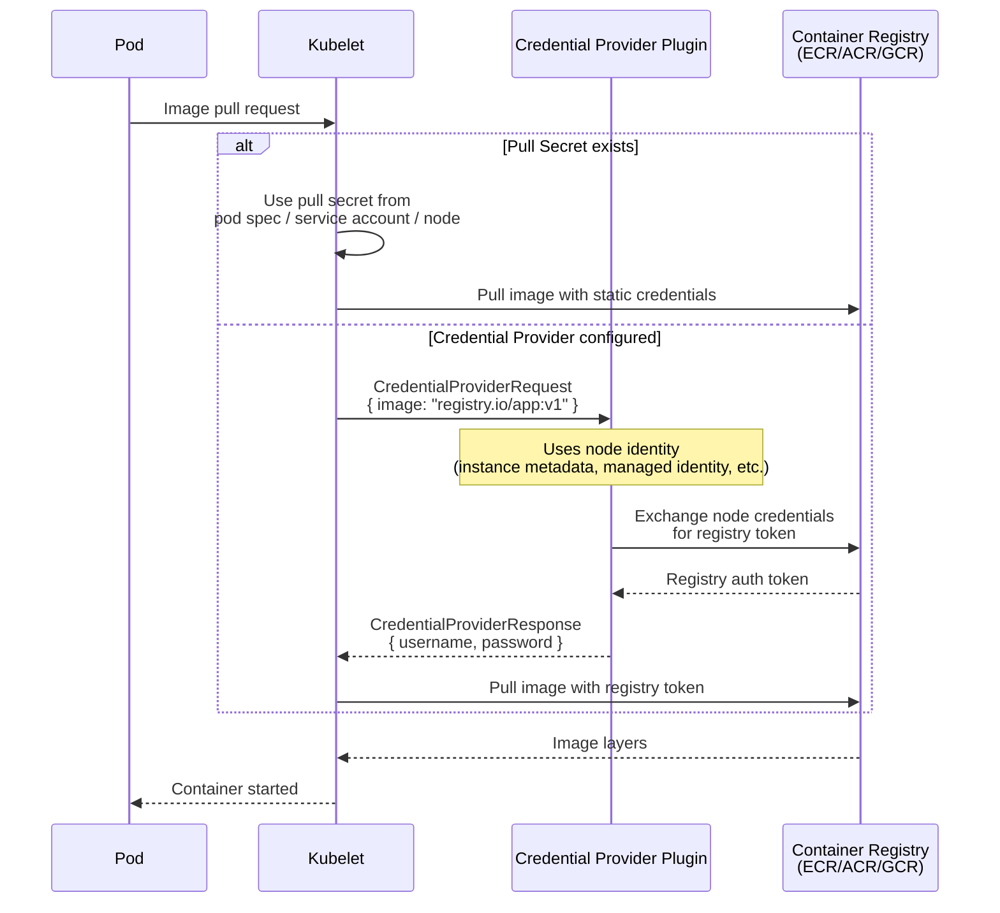
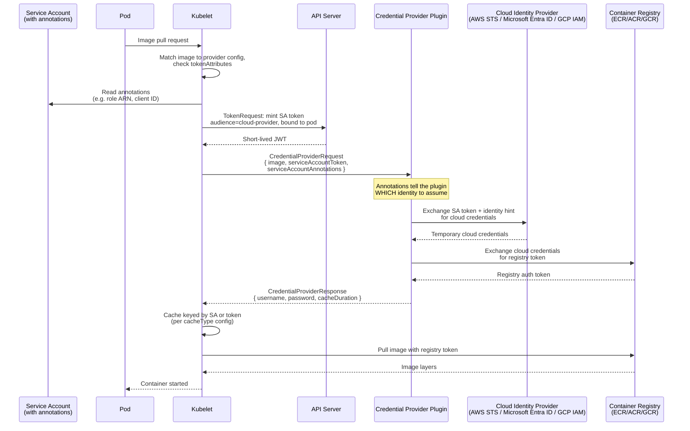

# Projected Service Account Tokens for Kubelet Image Credential Providers

## Summary

Enable per-workload identity for container image pulls in OpenShift by adopting KEP-4412 (Projected Service Account Tokens for Kubelet Image Credential Providers). Today, all pods on a node share the node's cloud identity for image pulls, or rely on long-lived pull secrets. KEP-4412 allows the kubelet to project a short-lived service account token and pass it — along with service account annotations — to credential provider plugins, enabling plugins to exchange workload-specific identity for registry credentials. This enhancement covers adopting KEP-4412 across all three cloud credential providers (ECR, ACR, GCR), shipping sensible default configurations via the Machine Config Operator (MCO), and providing a mechanism for cluster administrators to customize the configuration.

## Motivation

Currently, image pull credentials in OpenShift come from one of two sources:

1. **Node identity** — the credential provider plugin uses the node's cloud credentials (EC2 instance profile, Azure managed identity, GCP service account). Every pod on the node gets the same registry access regardless of its own identity.
2. **Pull secrets** — long-lived, hard to rotate, often shared cluster-wide, and a frequent source of security audit findings.

Neither approach supports fine-grained, per-workload access control for image pulls. 

KEP-4412 (Kubernetes v1.33 alpha, feature gate `KubeletServiceAccountTokenForCredentialProviders`) solves this by allowing the kubelet to mint a short-lived service account token bound to the pod and pass it to the credential provider plugin, along with filtered annotations from the pod's service account. The plugin can then exchange the token for workload-specific cloud credentials and use those to authenticate to the registry.

### User Stories

* As a cluster administrator, I want workloads to pull images using their own identity so that I can enforce least-privilege access to container registries without managing pull secrets.

* As a security engineer, I want to eliminate long-lived pull secrets from the cluster so that I can reduce the attack surface and satisfy compliance requirements around credential rotation.

* As a platform engineer running a multi-tenant cluster, I want different teams' workloads to pull from different registries (or different repositories within a registry) based on their service account identity, so that I can enforce tenant isolation at the image pull layer.

* As a cluster administrator, I want the credential provider configuration to ship with sensible defaults but be customizable, so that I can adapt it to my organization's cloud identity setup without maintaining my own MCO overrides from scratch.

* As a security-conscious customer, I want the installer to not provision a default node identity for image pulls, so that I can reduce the blast radius of node compromise and use day-2 provisioned credentials instead of install-time baked-in identity.

### Goals

- Enable per-workload identity for image pulls on AWS (ECR), Azure (ACR), and GCP (GCR/Artifact Registry).
- Ship default `tokenAttributes` configuration for each cloud provider via MCO.
- Ensure backward compatibility: clusters without the feature gate enabled, or pods without service accounts / annotations, continue to work. Investigate whether CredentialsRequest-provisioned credentials can replace node identity as the fallback default.
- Provide a supported mechanism for cluster administrators to customize credential provider configuration (annotation keys, audiences, etc.).
- Work upstream to make annotation keys configurable rather than hardcoded in each plugin, avoiding OpenShift carry patches.

#### Out of scope but enabled by this work

- **Removing install-time pull secrets / node identity from the installer.** KEP-4412 adoption unblocks this by enabling CredentialsRequest-provisioned, day-2 credentials as the default image pull mechanism. The installer work itself is a separate effort but this enhancement is a prerequisite.
- **Removing the ROSA ACR token refresh shim.** ROSA currently works around the lack of credential provider support by injecting a Python script via MachineConfig as a systemd unit on a 4h timer to fetch ACR tokens. KEP-4412 replaces this with the kubelet's native credential provider framework. See [ARO-24037](https://redhat.atlassian.net/browse/ARO-24037).

### Non-Goals

- Implementing a new CRD or operator for credential provider configuration management. If MachineConfig overrides are sufficient, we should use them.

## Proposal

### Overview

The work spans three areas:

1. **Credential provider plugins** (cloud-provider-aws, cloud-provider-azure, cloud-provider-gcp): Implement or complete KEP-4412 support in each plugin, ensuring annotation keys are configurable.
2. **MCO templates** (machine-config-operator): Add `tokenAttributes` to the shipped credential provider configs with sensible defaults per cloud provider.
3. **Upstream contributions**: Make annotation keys configurable in each plugin to avoid OpenShift carry patches.

#### Two paths: keep or remove node identity

There are two ways to adopt KEP-4412 in OpenShift, with meaningfully different scope and security posture:

**Path 1: Keep node identity as the default fallback**
- Enable `tokenAttributes` in the MCO-shipped credential provider configs
- Pods with service account annotations get per-workload identity (the new feature)
- Pods without annotations fall back to node identity as they do today
- The installer continues to provision node-level cloud identity at install time

This is less work — it's purely additive. The per-workload identity feature is available for workloads that opt in, and nothing changes for workloads that don't. But it doesn't address the customer and installer team request to remove install-time node identity provisioning, and every pod on the node still has implicit access to the node's cloud identity.

**Path 2: Replace node identity with a CredentialsRequest-provisioned default**
- Enable `tokenAttributes` as above
- The Cloud Credential Operator provisions a default registry pull identity day-2 (e.g. an IAM role for ECR, a managed identity for ACR, a GCP service account for GCR)
- The MCO templates that identity into the credential provider config (e.g. via environment variable or config file)
- Pods with service account annotations get per-workload identity
- Pods without annotations get the CCO-provisioned default identity via the service account token + environment variable fallback
- The installer no longer provisions node-level cloud identity for image pulls

This is more work. The ECR plugin already supports this via the `AWS_ECR_ROLE_ARN` environment variable fallback — when a service account token is present but no annotation exists, the plugin uses the environment variable as the role ARN and calls `AssumeRoleWithWebIdentity`. The Cloud Credential Operator can provision this role, and the MCO can template its ARN into the credential provider config. No node identity needed.

**ACR and GCR do not have this fallback mechanism today.** ACR hard-fails without annotations; GCR has no KEP-4412 implementation at all. Upstream work is needed to add equivalent environment variable or config-file fallbacks for default identity on Azure and GCP before path 2 is viable on those platforms.

Path 2 is the preferred direction — it addresses the security concerns and unblocks the installer team. But path 1 can ship first as an incremental step while the upstream fallback work for ACR and GCR is in progress.

### CredentialsRequest-provisioned default identity (Path 2 mechanism)

Today, when no service account token or annotation is present, each plugin falls back to node identity (EC2 instance profile, Azure managed identity, GCP service account). This means the installer must provision a node-level cloud identity with registry pull permissions at install time — which is the security concern customers are raising.

KEP-4412 combined with the existing environment variable fallback in the ECR plugin enables a model where the Cloud Credential Operator provisions the default pull identity day-2, removing it from the install path entirely. With `tokenAttributes` set and `AWS_ECR_ROLE_ARN` templated by the MCO:

```yaml
providers:
  - name: ecr-credential-provider
    matchImages:
      - "*.dkr.ecr.*.amazonaws.com"
    defaultCacheDuration: "12h"
    apiVersion: credentialprovider.kubelet.k8s.io/v1
    env:
      - name: AWS_ECR_ROLE_ARN
        value: "<CCO-provisioned-role-arn>"
    tokenAttributes:
      serviceAccountTokenAudience: "sts.amazonaws.com"
      cacheType: "ServiceAccount"
      requireServiceAccount: false
      optionalServiceAccountAnnotationKeys:
        - "eks.amazonaws.com/ecr-role-arn"
```

This produces three tiers of access:

| Scenario | Identity used | How |
|----------|--------------|-----|
| Pod with service account annotation | Per-workload role from annotation | Service account token + annotation role ARN → `AssumeRoleWithWebIdentity` |
| Pod with service account, no annotation | CCO-provisioned default role | Service account token + `AWS_ECR_ROLE_ARN` env var → `AssumeRoleWithWebIdentity` |
| Static pod / no service account | Node identity (instance profile) | No token → plugin returns nil → default AWS credential chain |

The CCO-provisioned role's trust policy accepts tokens from any service account in the cluster's OIDC issuer, scoped to ECR pull only — narrower than an instance profile but broader than a per-workload role. Static pods are the only case that still needs node identity, but they typically use the cluster pull secret.

**For ACR and GCR**: the same pattern requires each plugin to support an environment variable or config-file fallback for default identity. ACR currently does not — both annotations are required with no fallback. This is upstream work we need to drive (or carry).

### Current state of each provider

| Provider | Repo | KEP-4412 implemented? | Annotation keys | Notes |
|----------|------|-----------------------|-----------------|-------|
| ECR | cloud-provider-aws | Yes | `eks.amazonaws.com/ecr-role-arn` (hardcoded, optional) | Uses AWS Security Token Service (STS) `AssumeRoleWithWebIdentity`. Falls back to node identity if no token. Annotation key is EKS-specific. |
| ACR | cloud-provider-azure | Yes ([PR #9907](https://github.com/kubernetes-sigs/cloud-provider-azure/pull/9907)) | `kubernetes.azure.com/acr-client-id`, `kubernetes.azure.com/acr-tenant-id` (hardcoded, **required**) | Uses Workload Identity Federation via `ClientAssertionCredential`. Falls back to managed identity if no token. |
| GCR | cloud-provider-gcp | No | N/A | Not implemented upstream. Opportunity to shape from the start. |

#### ACR implementation detail

The upstream ACR plugin (`pkg/credentialprovider/azure_credentials.go`, `NewAcrProvider`) has two auth paths relevant to OpenShift:

- **Workload Identity Federation**: When `request.ServiceAccountToken` is non-empty. Uses `azidentity.NewClientAssertionCredential` with the SA token as the client assertion. Requires both `kubernetes.azure.com/acr-client-id` and `kubernetes.azure.com/acr-tenant-id` from annotations — missing either is a hard error.
- **Managed Identity** (fallback): When no SA token is present. Uses `cloud.conf` (`useManagedIdentityExtension`, `userAssignedIdentityID`).

Annotation keys are hardcoded in `pkg/credentialprovider/consts.go` with an AKS-specific prefix (`kubernetes.azure.com`) — same configurability problem as ECR.

Key difference from ECR: annotations are **required**, not optional. This means for the kubelet config:
```yaml
tokenAttributes:
  serviceAccountTokenAudience: "api://AzureADTokenExchange"
  cacheType: "ServiceAccount"
  requireServiceAccount: false
  requiredServiceAccountAnnotationKeys:
    - "kubernetes.azure.com/acr-client-id"
    - "kubernetes.azure.com/acr-tenant-id"
```
Using `requiredServiceAccountAnnotationKeys` means the kubelet won't invoke the plugin with a token for service accounts missing either annotation — those pods fall through to managed identity. This is clean behavior for OpenShift: annotate service accounts that need per-workload ACR access, everything else uses the node/managed identity path.

### Credential provider config delivery (MCO)

Credential provider configs are currently shipped as static inline files in MCO templates:

- `templates/common/aws/files/etc-kubernetes-credential-providers-ecr-credential-provider.yaml`
- `templates/common/azure/files/etc-kubernetes-credential-providers-acr-credential-provider.yaml`
- `templates/common/gcp/files/etc-kubernetes-credential-providers-gcr-credential-provider.yaml`

These land on nodes at `/etc/kubernetes/credential-providers/<provider>.yaml`.

Today's configs contain only `matchImages`, `defaultCacheDuration`, `apiVersion`, and optional `args`. There is no `tokenAttributes` and no mechanism for admin customization beyond writing a MachineConfig that replaces the file.

### Workflow Description

#### How it works today (node identity)



#### How it works with KEP-4412 (per-workload identity)



### API Extensions

None. This enhancement does not introduce new Custom Resource Definitions or modify the OpenShift API surface. The `tokenAttributes` field is part of the upstream kubelet `CredentialProviderConfig` API.

### Topology Considerations

#### Hypershift / Hosted Control Planes

In HyperShift, credential provider configs are delivered via CAPZ-generated ignition, not MCO. The `tokenAttributes` configuration would need to be plumbed through HyperShift's config generation for worker nodes (VMSS managed by CAPZ). See [OCPSTRAT-2951](https://redhat.atlassian.net/browse/OCPSTRAT-2951) for the current VM-managed-identity approach being pursued for ARO HCP, and [ARO-20731](https://redhat.atlassian.net/browse/ARO-20731) / [ARO-24037](https://redhat.atlassian.net/browse/ARO-24037) for the customer-facing asks driving this work.

#### Standalone Clusters

This is the primary target topology.

#### Single-node Deployments or MicroShift

The feature adds no new controllers or operators. The only resource impact is the additional TokenRequest API call per image pull.

MicroShift: TBD

#### OpenShift Kubernetes Engine

Not sure.

### Implementation Details/Notes/Constraints

#### Upstream work required

1. **ECR (cloud-provider-aws)**: Make the annotation key configurable via args or environment variable. Currently hardcoded to `eks.amazonaws.com/ecr-role-arn` — EKS-specific, not usable for OpenShift without a carry patch.
2. **ACR (cloud-provider-azure)**: KEP-4412 support is already merged ([PR #9907](https://github.com/kubernetes-sigs/cloud-provider-azure/pull/9907)). Annotation keys (`kubernetes.azure.com/acr-client-id`, `kubernetes.azure.com/acr-tenant-id`) are hardcoded in `pkg/credentialprovider/consts.go` — need the same configurability fix as ECR.
3. **GCR (cloud-provider-gcp)**: Implement KEP-4412 support from scratch. Opportunity to establish the configurable-annotation-key pattern from the start.

#### MCO changes

Add `tokenAttributes` to the shipped credential provider configs. The feature gate and config changes ship in the same z-release, so there is no version skew concern — we control both sides.

#### ECR reference implementation

Service account:
```yaml
apiVersion: v1
kind: ServiceAccount
metadata:
  name: my-app
  annotations:
    eks.amazonaws.com/ecr-role-arn: "arn:aws:iam::123456789012:role/my-app-ecr-role"
```

The plugin (`cloud-provider-aws/cmd/ecr-credential-provider/main.go`, `buildCredentialsProvider`):
1. Checks `request.ServiceAccountToken` — if empty, returns nil (falls back to node identity)
2. Reads IAM role ARN from `request.ServiceAccountAnnotations` (annotation key currently hardcoded)
3. Falls back to `AWS_ECR_ROLE_ARN` environment variable if annotation absent
4. Calls AWS Security Token Service `AssumeRoleWithWebIdentity` with the service account token as the web identity token
5. Returns temporary IAM credentials used for the ECR `GetAuthorizationToken` call

Kubelet config:
```yaml
tokenAttributes:
  serviceAccountTokenAudience: "sts.amazonaws.com"
  cacheType: "ServiceAccount"
  requireServiceAccount: false
  optionalServiceAccountAnnotationKeys:
    - "eks.amazonaws.com/ecr-role-arn"
```

`requireServiceAccount: false` ensures static pods and pods without service accounts still fall back to node identity.

#### ACR reference implementation

Service account:
```yaml
apiVersion: v1
kind: ServiceAccount
metadata:
  name: my-app
  annotations:
    kubernetes.azure.com/acr-client-id: "00000000-0000-0000-0000-000000000000"
    kubernetes.azure.com/acr-tenant-id: "00000000-0000-0000-0000-000000000000"
```

The plugin (`cloud-provider-azure/pkg/credentialprovider/azure_credentials.go`, `getServiceAccountTokenCredential`):
1. Checks `request.ServiceAccountToken` — if empty, falls back to managed identity via `cloud.conf`
2. Reads `kubernetes.azure.com/acr-client-id` and `kubernetes.azure.com/acr-tenant-id` from `request.ServiceAccountAnnotations` — **both required**, hard error if missing
3. Creates an `azidentity.ClientAssertionCredential` using the service account token as the client assertion
4. Microsoft Entra ID validates the token against the cluster's OIDC issuer and returns an access token
5. The plugin exchanges the access token for an ACR refresh token via the ACR token exchange endpoint

Kubelet config:
```yaml
tokenAttributes:
  serviceAccountTokenAudience: "api://AzureADTokenExchange"
  cacheType: "ServiceAccount"
  requireServiceAccount: false
  requiredServiceAccountAnnotationKeys:
    - "kubernetes.azure.com/acr-client-id"
    - "kubernetes.azure.com/acr-tenant-id"
```

Key differences from ECR:
- **Two annotations required** (client ID and tenant ID) vs one optional annotation for ECR
- **No environment variable fallback** — if annotations are missing, the kubelet won't send a token at all (because `requiredServiceAccountAnnotationKeys` is used). The plugin falls through to managed identity.
- The service account token is used as a **client assertion** (OAuth2 client credentials flow) rather than a **web identity token** (STS federation). Both are OIDC-based but the token exchange endpoints differ.

#### Annotation key convention

The upstream ask is making annotation keys configurable — not proposing specific keys upstream. Once configurability lands, OpenShift chooses its own defaults independently.

TBD — need to decide on OpenShift annotation keys for each provider. This is user-facing UX and we want reviewer input. Options:
- Per-provider annotations: `openshift.io/ecr-role-arn`, `openshift.io/acr-client-id`, `openshift.io/gcr-service-account`
- A single generic OpenShift annotation that each plugin interprets
- Accept the upstream vendor-specific keys as-is (requires no carry, but ties OpenShift UX to EKS/AKS conventions)

If upstream rejects the configurability ask, we either carry a patch or accept the upstream keys.

#### Admin customization

Cluster administrators need a way to override the default `tokenAttributes` (e.g. to set custom annotation keys, change the audience). MachineConfig overrides that replace the credential provider config file are the most likely mechanism.

This is customer-facing UX — needs good documentation with worked examples showing how to write a MachineConfig that overrides the default credential provider config.

### Risks and Mitigations

| Risk | Mitigation |
|------|------------|
| Upstream rejects configurable annotation key proposals | Fall back to OpenShift carry patches (undesirable but functional) |
| ACR has two auth paths (identity bindings vs standard Workload Identity Federation) and OpenShift only needs one | Ignore the AKS identity bindings path entirely — only the standard `ClientAssertionCredential` path is relevant for OpenShift |
| Breaking existing image pulls during rollout — clusters upgrading may lose access if node identity is removed before CredentialsRequest fallback is in place | Ship CredentialsRequest-provisioned default identity in the same release as `tokenAttributes` enablement. Pods with any service account (including default) get the CCO-provisioned role via environment variable fallback. Node identity only needed for static pods. |
| ACR/GCR plugins lack environment variable fallback for default identity (unlike ECR) | Drive upstream work to add default fallback mechanism to ACR and GCR plugins, or carry patches |

### Drawbacks

- Adds complexity to credential provider configuration that most users won't need immediately.
- Requires upstream contributions across three different cloud provider repos with different maintainer groups and review cadences.

## Alternatives (Not Implemented)

- **Pull secrets only**: Status quo. Does not meet security requirements for credential rotation and per-workload scoping.
- **Azure VM-level Managed Identity for ACR**: Attaches a User-Assigned Managed Identity to the VM via MachineSet. Works, but all pods on the node share the same ACR access and it requires manual day-2 MachineConfig/MachineSet patching. KEP-4412 is preferred because it enables per-workload scoping without VM-level identity changes. See [OCPSTRAT-2951](https://redhat.atlassian.net/browse/OCPSTRAT-2951), [OCPCLOUD-2950](https://redhat.atlassian.net/browse/OCPCLOUD-2950), [full analysis](https://docs.google.com/document/d/1EEUoRscXpmFg0r23LcCdjazfzEnQPLvNZ6Dk5K59Mv4/edit?tab=t.0).

## Open Questions

1. **Default identity fallback for ACR and GCR**: The ECR plugin has an environment variable fallback (`AWS_ECR_ROLE_ARN`) that enables a CredentialsRequest-provisioned default identity without node identity. ACR and GCR do not have equivalent fallback mechanisms. What upstream changes are needed to support a CCO-provisioned default identity on Azure and GCP?
2. **Annotation key convention**: Once annotation keys are configurable upstream, what keys should OpenShift use as defaults? Per-provider (e.g. `openshift.io/ecr-role-arn`) or a single generic annotation?
3. **MCO override UX**: Is MachineConfig overlay sufficient for admin customization of `tokenAttributes`?
4. **HyperShift delivery**: How are credential provider configs delivered to guest cluster nodes in HyperShift?
5. **Pull secret vs credential provider precedence**: The default CredentialProviderConfig uses a wildcard match (e.g. `*.azurecr.io`). If one ACR uses a pull secret and another uses the credential provider, what is the precedence behavior? See [ARO-24037](https://redhat.atlassian.net/browse/ARO-24037).
6. **Non-managed-identity clusters**: Can clusters not deployed with managed identities (e.g. classic ARO) use this feature? KEP-4412 should enable this since it uses SA tokens rather than VM-level identity, but needs validation. See [ARO-20731](https://redhat.atlassian.net/browse/ARO-20731).

## Test Plan

TBD — not required until targeted at a release.

## Graduation Criteria

### Dev Preview -> Tech Preview

- KEP-4412 support implemented in all three credential provider plugins (ECR, ACR, GCR)
- MCO ships default `tokenAttributes` configuration for at least one cloud provider
- End-to-end test demonstrating per-workload image pull with service account token
- Annotation keys configurable upstream (or carry patches in place)

### Tech Preview -> GA

- Upstream feature gate is beta and enabled by default as of Kubernetes v1.34
- Decision on whether GA includes deprecation of install-time node identity provisioning for image pulls, or whether that remains a follow-up
- User-facing documentation in openshift-docs

### Removing a deprecated feature

N/A — new feature, nothing being deprecated.

## Upgrade / Downgrade Strategy

- **Upgrade**: Additive — `tokenAttributes` and the feature gate ship in the same z-release. The CredentialsRequest-provisioned default identity (via environment variable fallback) means upgraded clusters don't silently depend on install-time provisioned node identity. Existing workloads continue to pull images via the CCO-provisioned default role without any service account annotation changes.
- **Downgrade**: Open question. If we remove install-time node identity provisioning, downgrading to a version without `tokenAttributes` support would leave no default pull credentials. This may make downgrade unsupportable once node identity is removed — needs further discussion.

## Version Skew Strategy

Not expected to be an issue — the feature gate, MCO config changes, and plugin updates all ship in the same z-release. We should not encounter a state where the kubelet has the feature gate without the updated plugin, or vice versa. Open to reviewer input if there are edge cases we're missing.

## Operational Aspects of API Extensions

N/A — no API extensions introduced.

## Support Procedures

<!-- TBD — fill in when design / UX is finalised -->

## Infrastructure Needed

None.
