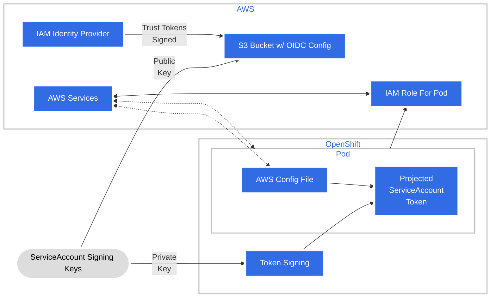

# Tokenized Authentication for Red Hat Operators on Cloud Providers

## Release Signoff Checklist

- [ ] Enhancement is `implementable`
- [ ] Design details are appropriately documented from clear requirements
- [ ] Test plan is defined
- [ ] Graduation criteria for dev preview, tech preview, GA
- [ ] User-facing documentation is created in [openshift-docs](https://github.com/openshift/openshift-docs/)

## Summary

Many Cloud Providers offer services that allow authentication via Temporary Access Tokens (TAT).

For example, Amazon Web Services (AWS) Secure Token Service (STS) allows you to request temporary limited-privilege
credentials. A concrete example is write permission on an S3 bucket on AWS. STS is supported on all the major cloud
providers where OpenShift is deployed.

Currently, several Red Hat operators provide detailed instructions for how to use the operator on clusters where 
Cloud Credential Operator (CCO) is in Manual Mode, a mode where CCO is not capable of provisioning credentials on its 
own. The process has manual operations performed by the customer that are inconsistent across layered product operators.

This enhancement seeks to bring a unified set of standards and tooling to the process of enabling an
operator to access cloud provider resources using TAT, and improve the UX for consumers of these operators.

## Motivation

Several Red Hat operators have normal operating modes where they assure their operands have required cloud 
resources to perform properly. Most often, these operators use the Cloud Credential Operator's CredentialsRequest API in
Mint mode to automatically create the IAM user and credentials required for the operator to 
authenticate with the Cloud Provider.

In Manual mode or more generally on clusters that support TAT (CCO not necessarily installed), an admin installing an 
operator is required to:

Extract the CredentialsRequest from the operator's image or codebase in order to know what IAM role is appropriate for 
the operator to assume
if using the [Cloud Credential Operator Utility](https://github.com/openshift/cloud-credential-operator/blob/master/docs/ccoctl.md), `ccoctl`:
1. Find and download a compatible `ccoctl` binary
2. Accept that `ccoctl` requires elevated privileges to create roles with necessary permissions.
3. Use `ccoctl` to create the IAM Role
4. Use `ccoctl` to create the secret with the credentials expected by the operator

This enhancement seeks to unify this process across operators so users of several of them have the same experience and
similar steps to perform. We aim to automate and reduce those steps as much as possible to make installing operators
(via OLM) simpler on clusters where TAT authentication is supported.

For an example of how operators are currently navigating accessing cloud resources today, see the AWS STS install 
instructions for the AWS EFS CSI Driver Operator (https://docs.openshift.com/container-platform/4.11/storage/container_storage_interface/persistent-storage-csi-aws-efs.html#efs-sts_persistent-storage-csi-aws-efs)

### User Stories

* As a cluster admin, I want to know which OLM Operators are safe to install because they will not be interacting with
  the Cloud Provider on a cluster that only supports TAT authentication with the Cloud Provider
* As a cluster admin, I want to know which OLM Operators support tokenized authentication for my cloud, so that I can
  provide token-based access for cloud resources for them.
* As a cluster admin of a cluster using tokenized cloud auth, I want to know what's required to install and upgrade OLM 
 Operators whenever those operators manage resources that authenticate against my cloud so they can function properly
* As a cluster admin, I want the experience of TAT authentication to be as similar as possible from one Cloud Provider 
  to the other, so that I can minimize Cloud Specific knowledge and focus more on OpenShift.
* As an Operator developer, I want to have a standard framework to define tokenized authentication requirements and
  consume them, per supported cloud, so that my operator will work on token-based authentication clusters.
* As an Operator Hub browser, I want to know which operators support tokenized cloud auth and on which clouds so I can
  see only a filtered list of operators that will work on the given cluster.
* As an Operator Hub browser, I want to be informed / reminded in the UI that the cluster only supports TAT 
  authentication with the Cloud Provider, so that I don't confuse the cluster with one that will try to mint long lived
  credentials.
* As an Operator Hub browser, I want to be able to easily provide what's required to the OLM operators I install through
  the UI.
* As the HyperShift team, where CCO is not installed so the only supported authentication mode is via TAT, I want the
  Red Hat branded operators that must reach the Cloud Provider API, to be enabled to work with TAT credentials in a
  consistent, and automated fashion so that customer can use those operators as easily as possible, driving the use of
  layered products. This means adding CCO, with the changes proposed here, to Manual mode to HyperShift.

### Goals

Allow OLM installed operators to access cloud provider resources as seamlessly as possible when being installed, used 
and updated on STS enabled clusters.

While providing the above goal, allow for multi-tenancy. In this sense multi-tenancy means that an operator may
enable its operands to communicate with the cloud provider instead of communicating with the cloud itself. Operands 
would use the same set of credentials as the operator. The operator will need to maintain its own logic to minimize 
conflicts when sharing credentials with operands.

Operator authors have a way to notify, guide, and assist OLM Operator admins in providing the required cloud provider
credentials matched to their permission needs for install and update.

Ideally, a solution here will work in both HyperShift (TAT always) and non-HyperShift(but TAT-enabled) clusters.

### Non-Goals

In-payload/CVO-managed operators are not included in this proposal, they are pre-provisioned for TAT enabled clusters
(at least for HyperShift)

Bring Your Own Credentials (BYOC) where an operator can manage and distribute credentials to its operands are out of
scope.

Sharing a set of credentials between all operands to aid multi-tenancy.

## Proposal

**Cloud Credential Operator (CCO) changes**: Adds a token-aware mode, while nominally set in "Manual" mode, CCO will
look for CredentialRequests with ProviderSpecs containing TAT information (like ARN values for AWS, etc) when:

```bash
# infrastructure platform is AWS
$ oc get infrastructure cluster -o jsonpath --template '{ .status.platform }'
AWS

# credentialsMode is "Manual"
$ oc get cloudcredential cluster -o jsonpath --template '{ .spec.credentialsMode }'
Manual

# serviceAccountIssuer is non empty
$ oc get authentication cluster -o jsonpath --template='{ .spec.serviceAccountIssuer }'
abutcher-oidc.s3.us-east-1.amazonaws.com
```

This will operate in the following manner: HyperShift/Rosa adding an updated CCO with these token-aware changes.

CCO's token-aware mode will work by adding, for example for STS, a "role-arn"-type field on operator added 
CredentialsRequest objects. This is a new API field on the CredentialsRequest spec. When CCO acquires a 
CredentialsRequest it will create a Secret (as today mostly) with new functionality: Adding to the Secret a path to the
projected ServiceAccount token (static for OCP) and a roleARN (from the new field on the CredentialsRequest).

CCO with the changes anticipated here, operating in Manual mode, will continue to ignore CredentialsRequests that do not
contain the new STS related fields and as these are new fields, existing clusters won't have CredentialsRequests with 
those fields already.

Validation of CredentialsRequest by this new token-aware CCO? Maybe. Currently, CCO gets some permissions under ROSA
(unused), could expand these permissions to include tools like AWS's Policy Simulator such that it could validate a role
has permissions, and with this CCO could be the alerting mechanism for a changed CredentialsRequest without sufficient 
permissions.

CCO should consider adding the above, three-part test as a utility function exposed in the API.

**HyperShift changes**: Include Cloud Credential Operator with token-aware mode (see above). Allows for processing of 
CredentialsRequest objects added by operators.

**OperatorHub and Console changes**: Allow for input from user of additional fields during install depending on the 
Cloud Provider which will result in ENV variables on the Subscription object that are required in the 
CredentialsRequests created by the Operator. Setting the Subscription config.ENV will allow UX for the information 
needed by CCO or webhook, for input of the cloud credentials while not having to change the Subscription API.
CLI Users will need to add the following to their subscription:

```yaml
kind: Subscription
metadata:
 name: ...
spec:
  config:
    env:
    - name: ROLEARN
      value: "<role ARN >"
```

Show in OperatorHub that the cluster is in a mode that supports token-based authentication by reading the 
`.spec.serviceAccountIssuer` from the Authentication CR, `.status.platformStatus.type` from the Infrastructure CR,
`.spec.credentialsMode` from the CloudCredentials CR.

Show that the operator is enabled for Token-based use by reading the [CSV](https://olm.operatorframework.io/docs/concepts/crds/clusterserviceversion/) annotation provided by the operator author.

Generate a manual ack for operator upgrade when cloud resources are involved. This can be determined by parsing the 
Subscription objects. Ensures admin signs off that cloud resources are provisioned and working as intended before an 
operator upgrade. This could be by setting the default subscription mode to Manual in the UI for operators that support 
TAT.

**Operator team changes**: Follow new guidelines for allowing for the operator to work on token auth 
enabled cluster. New guidelines would include the following to use CCO has detected cluster is using time-based tokens:

- Changing CSV to add CredentialRequest RBAC
- If loading the CredentialRequests from a yaml, place it into a discoverable location in the codebase
- Add a bundle annotation claiming token-based authentication support
- Add a script in the operator description to help set up the correct role
- (Optional) Add the projected ServiceAccount volume to the Deployment embedded in the CSV;
- handle the Secret themselves (like today’s CCO Mint mode, read and use the credentials in the Secret whose name they 
  know from the CredentialsRequest and is in the same Namespace)
- Add structure to controller code to be resilient to missing cloud credentials / not crash.

### Workflow Description

This diagram shows the steps a user will need to take in the proposed flow (specific to STS):


Making a layered operator ready to work on an STS enabled cluster will involve the following steps:

Operator installation under the proposed system:
1. user goes to console and starts operator install
2. console detects token-based (STS) cluster, and token-based-supporting operator
3. console prompts user to create roles+supply ARN-type string
4. console creates subscription with ARN-type string embedded as a spec.config.env
5. operator deployment is created with ARN-type string in env
6. operator creates `CredentialsRequest` including the ARN-type string
7. Cloud Credential Operator populates Secret based on `CredentialsRequest`
8. operator loads Secret, makes cloud service requests


For the operator author team:
- Add code to create a CredentialRequests (it will not be stored in the bundle 
as part of this EP)
- Add "role-arn"-type fields to the CredentialRequests
- Add eventing to report status on a CR to indicate lacking STS credentials for fully operational deploy or update.

For the Cloud Credential Operator:
- Allow detection that a cluster is using time-based tokens and create a Secret containing the ARN + token path per 
 cloud platform.

For Operator Administrator:
- Supply cloud credentials for STS (ARN ID, etc) in the known location.

For OperatorHub, Console:
- Prompt for missing credentials that prevent fully operational install on STS cluster. Same for upgrades.
- Badge indicating "STS enabled" (this is a naming suggestion to avoid implying that non-badged operators not needing
 cloud provider resource access would not work) operators.

This graph shows the system as it needs to work (AWS only), not the proposed solution workflow:


### API Extensions

Added to the CredentialsRequest API 

We outline this change using the AWS specific change, but other cloud provider specs will follow a similar pattern:
Adding to the `spec.ProviderSpec` field ([ref](https://github.com/openshift/cloud-credential-operator/blob/38e7f96bf73036924abcb1352222c17704e4b2e0/pkg/apis/cloudcredential/v1/types_credentialsrequest.go#L53-L55)),<br>
where `spec.ProviderSpec` would be an `AWSProviderSpec` ([ref](https://github.com/openshift/cloud-credential-operator/blob/38e7f96bf73036924abcb1352222c17704e4b2e0/pkg/apis/cloudcredential/v1/types_aws.go#L27-L31)) for AWS-directed TAT.<p>
CredentialsRequests:
```go
type CredentialsRequestSpec struct {
...

// ProviderSpec contains the cloud provider specific credentials specification.
// +kubebuilder:pruning:PreserveUnknownFields
ProviderSpec *runtime.RawExtension `json:"providerSpec,omitempty"`

...
// cloudTokenPath is the path where the Kubernetes ServiceAccount token (JSON Web Token) is mounted
// on the deployment for the workload requesting a credentials secret.
// The presence of this field in combination with fields such as spec.providerSpec.stsIAMRoleARN
// indicate that CCO should broker creation of a credentials secret containing fields necessary for
// token based authentication methods such as with the AWS Secure Token Service (STS).
// +optional
CloudTokenPath string `json:"cloudTokenPath,omitempty"`
```

To see how this relates back to what, for instance, AWS or Azure, need to have for their SDKs to allow access to cloud resources:

The AWS STS credentials secret looks like this and CloudTokenPath ultimately ends up in the Secret CCO generates as the web_identity_token_file the AWS SDK expects.
```text
apiVersion: v1
stringData:
  credentials: |-
    [default]
    role_arn = <role ARN>
    web_identity_token_file = <path to mounted service account token such /var/run/secrets/openshift/serviceaccount/token>
kind: Secret
type: Opaque
```

Similarly, the Azure credentials secret CCO generates contains an `azure_federated_token_file` field.
```text
apiVersion: v1
data:
  azure_client_id: <client id>
  azure_federated_token_file: <path to mounted service account token such as /var/run/secrets/openshift/serviceaccount/token>
  azure_region: <region>
  azure_subscription_id: <subscription id>
  azure_tenant_id: <tenant id>
kind: Secret
type: Opaque
```

and `ProviderSpec` in the AWS case would include the following:

```go
type AWSProviderSpec struct {
...
// STSRoleARN is the Amazon Resource Name (ARN) of an IAM Role which was created manually for the associated
// CredentialsRequest.
// The presence of an STSRoleARN within the AWSProviderSpec initiates creation of a secret containing IAM
// Role details necessary for assuming the IAM Role via Amazon's Secure Token Service.
// +optional
STSIAMRoleARN string `json:"stsIAMRoleARN,omitempty"`
}
```

On AWS STS, the `STSIAMRoleARN` would be something like:
`arn:aws:iam::269733383066:role/newstscluster-openshift-logging-role-name`<br>
This provides the role information linked by policy to access various cloud resources.

### Risks and Mitigations

### Drawbacks

## Design Details

We have two PoC items:<br>
How CCO changes might be implemented: https://github.com/openshift/cloud-credential-operator/pull/525

How Cluster Logging Operator can be changed to work with this modified CCO: 
https://github.com/gallettilance/cluster-logging-operator/tree/sts

### Test Plan

Consider the following in developing a test plan for this enhancement:
- CCO should add unit tests for the new manner of working when in Manual mode but the 3-way test indicates running on
  a TAT enabled cluster.
- CCO should add e2e tests for the new manner of working when in Manual mode but the 3-way test indicates running on
  a TAT enabled cluster.
- CI will need to add a TAT mode for various cloud providers as a base for the e2e tests.
- A "canary" operator should be fielded in CI with e2e tests such that we have signal on breaking changes in TAT enabled
  clusters.

### Graduation Criteria

#### Tech Preview -> GA
This feature will be introduced as part of the TechPreviewNoUpgrade featureset affecting the Cloud Credential Operator, Console, and OLM. It is expected to graduate to GA within the same release upon successfully demonstrating e2e test pass rate meets or exceeds OCP baselines.

If the feature remains `TechPreviewNoUpgrade` OLM operators which had been updated assuming this feature is available should continue to provide admin documentation sufficient to manually enable TAT.
#### Removing a deprecated feature
#### Support Procedures

### Upgrade / Downgrade Strategy

### Version Skew Strategy

### Operational Aspects of API Extensions

Should be none. If the new fields on CredentialsRequest are missing, cloud resources will be unavailable for an 
operator, but there should be no other impacts.

#### Failure Modes

If the Secrets created by CCO on the added CredentialsRequest fields contemplated in this EP are missing, operators should wait the Secrets to appear. If
after a timeout period, the fields are not present, the operator should write events about the lack of access to cloud 
resources to the status of an appropriate resource to let admins know there are missing credentials.

## Implementation History

Not implemented yet.

## Alternatives
- Leverage CredentialsRequest after Operator Installation

1. Browse catalog, select Logging Operator
2. If the cluster is TAT emit big red info box "After installation you must grant cloud access by running `ccoctl process -n openshift-logging` <br>
or optionally `ccoctl process --offline -n openshift-logging`
3. Install Operator
4. Operator creates CredReq
5. Operator reports failed / progressing state, whatever is most clear that it's awaiting creds
6. 
  a. Cluster Admin automatically grants permissions `ccoctl process -n openshift-logging` .status.RoleARN, .status.GCPRole, .status.AzureRole populated automatically
  b. 1. Cluster Admin hands off permissions requirements `ccoctl process -n openshift-logging --offline`, generates cloud native permissions doc, forwards to IAM Admin
       2. IAM Admin applies permissions, returns RoleARN, GCPRole, AzureRole to Cluster Admin
       3. Cluster Admin actuates CredRequest via `ccoctl -n openshift-logging bind-role S3Access ARN:blahblahblah:blah` setting .status.RoleARN
 7. CCO does the rest
 
This would set the stage for other statuses to be reported via the CredentialsRequest like "RoleOutOfSync". Not clear how we get from here to OLM inhibiting upgrades on changes though. 
This has the benefit that permissions are recorded in one structured authoritative location. Though perhaps if a goal is to ensure the required permissions are known prior to installation, perhaps external to the cluster, this becomes harder.

This could be implemented by with chanes to Pod Identity Webhook (Deployed on classic ROSA, ROSA on HyperShift, 
standard OCP and HyperShift)

Will work by annotating the ServiceAccount triggering the projection of the service account tokens into pods created for
the operator (same method and resultant actions as: https://github.com/openshift/hypershift/pull/1351) the README here
gives an AWS specific example: https://github.com/openshift/aws-pod-identity-webhook)

Possibly some changes to logic for Pod Identity Webhooks as needed for fine-grained credential
management to allow for multi-tenancy (see definition earlier). Also, need to add pod identity webhooks targeting other
cloud providers and change the annotations to more generic naming.

## Infrastructure Needed

TAT (STS on AWS for instance) base for CI e2e tests.