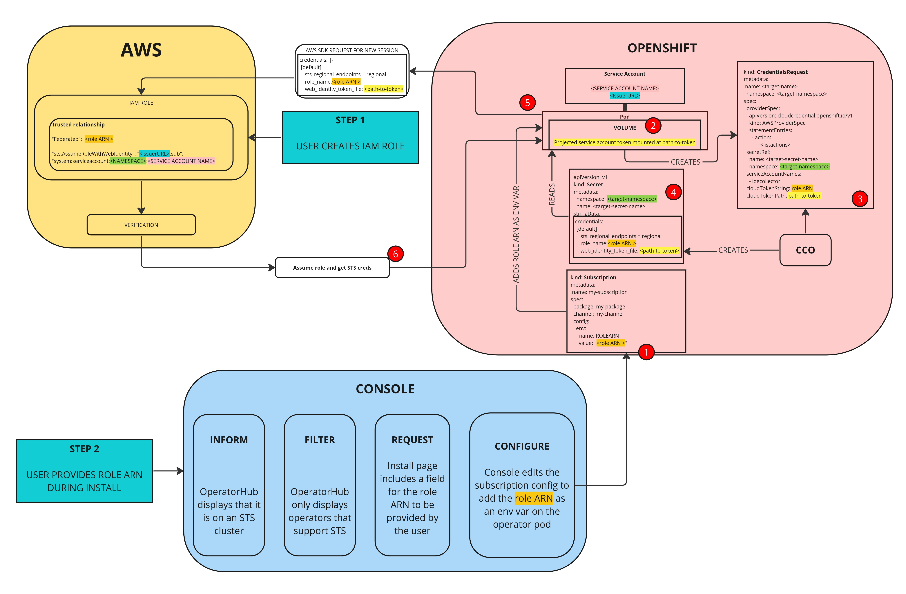

# Tokenized Authentication for Red Hat Operators on Cloud Providers

## Release Signoff Checklist

- [ ] Enhancement is `implementable`
- [ ] Design details are appropriately documented from clear requirements
- [ ] Test plan is defined
- [ ] Graduation criteria for dev preview, tech preview, GA
- [ ] User-facing documentation is created in [openshift-docs](https://github.com/openshift/openshift-docs/)

## Summary

Many Cloud Providers offer services that allow authentication via Temporary Access Tokens (TAT).

For example, Amazon Web Services (AWS) Secure Token Service (STS) allows you to request temporary limited-privilege
credentials. A concrete example is write permission on an S3 bucket on AWS. STS is supported on all the major cloud
providers where OpenShift is deployed.

Currently, several Red Hat operators provide detailed instructions for how to use the operator on clusters where CCO is
in Manual Mode. The process is designed to have manual operations performed by the customer that are inconsistent across
layered product operators.

This enhancement seeks to bring a unified set of standards and tooling to the process of enabling an
operator to access cloud provider resources using TAT, and improve the UX for consumers of these operators. 

## Motivation

Several Red Hat operators have normal operating modes where they assure their operands have required cloud 
resources to perform properly. In Mint Mode, CCO will automatically create the IAM roles and credentials required for 
the operator to assume the role and authenticate with the Cloud Provider.

In Manual mode or more generally on clusters that support TAT (CCO not necessarily installed), an admin installing an 
operator is required to:

Extract the CredentialsRequest from the operator's image or codebase in order to know what IAM role is appropriate for 
the operator to assume
xIf using the Cloud Credential Utility, `ccoclt`:
1. Find and download a compatible `ccoclt` binary
2. Accept that `ccoclt` is a binary you downloaded that has god-mode access to your Cloud Provider
3. Use `ccoclt` to create the IAM Role
4. Use `ccoclt` to create the secret with the credentials expected by the operator in mint mode

Here is a diagram for how this works on AWS:


This enhancement seeks to unify this process across operators so users of several of them have the same experience and
similar steps to perform. We aim to automate and reduce those steps as much as possible to make installing operators
(via OLM) simpler on clusters where TAT authentication is supported.

### User Stories

* As a cluster admin, I want to know which OLM Operators are safe to install because they will not be interacting with
  the Cloud Provider on a cluster that only supports TAT authentication with the Cloud Provider
* As a cluster admin, I want to know which OLM Operators support tokenized authentication for my cloud, so that I can
  provide token-based access for cloud resources for them.
* As a cluster admin of a cluster using tokenized cloud auth, I want to know what's required to install and upgrade OLM 
  Operators whenever those operators manage resources that authenticate against my cloud so they can function properly
* As a cluster admin, I want the experience of TAT authentication to be as similar as possible from one Cloud Provider 
  to the other, so that I can minimize Cloud Specific knowledge and focus more on OpenShift.
* As an Operator developer, I want to have a standard framework to define tokenized authentication requirements and
  consume them, per supported cloud, so that my operator will work on token-based authentication clusters.
* As an Operator Hub browser, I want to know which operators support tokenized cloud auth and on which clouds so I can
  see only a filtered list of operators that will work on the given cluster.
* As an Operator Hub browser, I want to be informed / reminded in the UI that the cluster only supports TAT 
  authentication with the Cloud Provider, so that I don't confuse the cluster with one that will try to mint long lived
  credentials.
* As an Operator Hub browser, I want to be able to easily provide what's required to the OLM operators I install through
  the UI.
* As the HyperShift team, where CCO is not installed so the only supported authentication mode is via TAT, I want the
  Red Hat branded operators that must reach the Cloud Provider API, to be enabled to work with TAT credentials in a
  consistent, and automated fashion so that customer can use those operators as easily as possible, driving the use of
  layered products.

### Goals

Allow Day-2 Operators to access cloud provider resources as seamlessly as possible when being installed, used and
updated on STS enabled clusters.

While providing the above goal, allow for multi-tenancy. In this sense multi-tenancy means that an operator may
enable its operands to communicate with the cloud provider instead of communicating with the cloud itself. Operands 
would use the same set of credentials as the operator. The operator will need to maintain its own logic to minimize 
conflicts when sharing credentials with operands.

Operator authors have a way to notify, guide, and assist Day-2 Operator admins in providing the required cloud provider
credentials matched to their permission needs for install and update.

Ideally, a solution here will work in both HyperShift (TAT always) and non-HyperShift clusters.

### Non-Goals

Day 1 operators are not included in this proposal, they are pre-provisioned for TAT enabled clusters (at least 
for HyperShift)

Bring Your Own Credentials (BYOC) where an operator can manage and distribute credentials to its operands are out of
scope.


## Proposal

**Cloud Credential Operator (CCO) changes**: Adds a token-aware mode, while nominally set in "Manual" mode, CCO will
look for and process CredentialRequests referenced in Operator CRs when:

```bash
# infrastructure platform is AWS
$ oc get infrastructure cluster -o jsonpath --template '{ .status.platform }'
AWS

# credentialsMode is "Manual"
$ oc get cloudcredential cluster -o jsonpath --template '{ .spec.credentialsMode }'
Manual

# serviceAccountIssuer is non empty
$ oc get authentication cluster -o jsonpath --template='{ .spec.serviceAccountIssuer }'
abutcher-oidc.s3.us-east-1.amazonaws.com
```

This will operate in one of two ways depending on which other parts of this EP for other components are adopted: 
specifically HyperShift/Rosa adding CCO with these token-aware changes or continuing with the current support for the 
pod identity webhook.

CCO's token-aware mode will work by adding, for example for STS, a "role-arn"-type field on operator added 
CredentialsRequest objects. This is a new API field on the CredentialsRequest spec. When CCO acquires a 
CredentialsRequest it will create a Secret (as today mostly) with new functionality: Adding to the Secret a path to the
projected ServiceAccount token (static for OCP) and a roleARN (from the new field on the CredentialsRequest).

Validation of CredentialsRequest by this new token-aware CCO? Maybe. Currently, CCO gets some permissions under ROSA
(unused), could expand these permissions to include tools like AWS's Policy Simulator such that it could validate a role
has permissions, and with this CCO could be the alerting mechanism for a changed CredentialsRequest without sufficient 
permissions.

**HyperShift changes**: Include Cloud Credential Operator with token-aware mode (see above). Allows for processing of 
CredentialsRequest objects added by operators.

**OperatorHub and Console changes**: Allow for input from user of additional fields during install depending on the 
Cloud Provider which will result in ENV variables on the Subscription object that are required in the 
CredentialsRequests created by the Operator. Setting the Subscription config.ENV will allow UX for the information 
needed by CCO or webhook, for input of the cloud credentials while not having to change the Subscription API.

Show in OperatorHub that the cluster is in a mode that supports token-based authentication by reading the 
`.spec.serviceAccountIssuer` from the Authentication CR, `.spec.platformSpec.type` from the Infrastructure CR,
`.spec.credentialsMode` from the CloudCredentials CR.

Show that the operator is enabled for Token-based use by reading the CSV annotation provided by the operator author.

Generate a manual ack for operator upgrade when cloud resources are involved. This can be determined by parsing the 
Subscription objects. Ensures admin signs off that cloud resources are provisioned and working as intended before an 
operator upgrade. This could be by setting the default subscription mode to Manual in the UI for operators that support 
TAT.

**Operator team / Operator SDK changes**: Follow new guidelines for allowing for the operator to work on token auth 
enabled cluster. New guidelines would include the following to use CCO Token mode:

- changing CRD to add CredentialRequest references and putting those referenced
- CredentialRequests into a defined directory in the bundle
- Add a bundle annotation claiming token-based authentication support
- Add a bundle annotation indicating which permissions are required
- add the projected ServiceAccount volume to the Deployment embedded in the CSV;
- handle the Secret themselves (like today’s CCO Mint mode, read and use the credentials in the Secret whose name they 
  know from the CredentialsRequest and is in the same Namespace)
- Guidance to operator authors to structure controller code to alert on missing cloud credentials, not crash.

SDK to support this new template. SDK to validate and in particular: alert on any permission changes between operator
versions.

### Workflow Description

This diagram shows the steps a user will need to take in the proposed flow (specific to STS):



Making a layered operator ready to work on an STS enabled cluster will involve the following steps:

Operator installation under the proposed system:
1. user goes to console and starts operator install
2. console detects token-based (STS) cluster, and token-based-supporting operator
3. console prompts user to create roles+supply ARN-type string
4. console creates subscription with ARN-type string embedded as a spec.config.env
5. operator deployment is created with ARN-type string in env
6. operator creates `CredentialsRequest` including the ARN-type string
7. Cloud Credential Operator populates Secret based on `CredentialsRequest`
8. operator loads Secret, makes cloud service requests


For the operator author team:
- Add CredentialRequests to the bundle, known location;
- Add "role-arn"-type fields to the CredentialRequests
- Add references to the CredentialRequests in the CRD spec;
- Use SDK to validate bundle to catch permission changes or mis-configuration
- Add eventing to report status on a CR to indicate lacking STS credentials for fully operational deploy or update.

For the Cloud Credential Operator:
- Add a Token mode that will watch for CredentialRequests (as per mint mode) and then resolve time-based tokens
  per cloud platform. 
- Make Secret resource available for the operator via pod identity webhook. 
- Pod identity webhook logic to account for per-operand tenancy permissions.

For Operator Administrator:
- Supply cloud credentials for STS (ARN ID, etc) in the known location and change CR to reflect this.

For OperatorHub, Console:
- Prompt for missing credentials that prevent fully operational install on STS cluster. Same for upgrades.
- Badge indicating STS enabled operators (including operators that don't need cloud credentials)

This graph shows the system as it needs to work (AWS only), not the proposed solution workflow:


#### Variation [optional]

If the cluster creator uses a standing desk, in step 1 above they can
stand instead of sitting down.

### API Extensions

"Role-ARN-like" field added CCO CredentialsRequest API (name not finalized yet, ARN is AWS specific)
This field allows CCO to ...


### Implementation Details/Notes/Constraints [optional]

What are the caveats to the implementation? What are some important details that
didn't come across above. Go in to as much detail as necessary here. This might
be a good place to talk about core concepts and how they relate.

### Risks and Mitigations

What are the risks of this proposal and how do we mitigate. Think broadly. For
example, consider both security and how this will impact the larger OKD
ecosystem.

How will security be reviewed and by whom?

How will UX be reviewed and by whom?

Consider including folks that also work outside your immediate sub-project.

### Drawbacks

The idea is to find the best form of an argument why this enhancement should
_not_ be implemented.  

What trade-offs (technical/efficiency cost, user experience, flexibility, 
supportability, etc) must be made in order to implement this? What are the reasons
we might not want to undertake this proposal, and how do we overcome them?  

Does this proposal implement a behavior that's new/unique/novel? Is it poorly
aligned with existing user expectations?  Will it be a significant maintenance
burden?  Is it likely to be superceded by something else in the near future?


## Design Details

### Open Questions [optional]

This is where to call out areas of the design that require closure before deciding
to implement the design.  For instance,
 > 1. This requires exposing previously private resources which contain sensitive
  information.  Can we do this?

### Test Plan

**Note:** *Section not required until targeted at a release.*

Consider the following in developing a test plan for this enhancement:
- Will there be e2e and integration tests, in addition to unit tests?
- How will it be tested in isolation vs with other components?
- What additional testing is necessary to support managed OpenShift service-based offerings?

No need to outline all of the test cases, just the general strategy. Anything
that would count as tricky in the implementation and anything particularly
challenging to test should be called out.

All code is expected to have adequate tests (eventually with coverage
expectations).

### Graduation Criteria

**Note:** *Section not required until targeted at a release.*

Define graduation milestones.

These may be defined in terms of API maturity, or as something else. Initial proposal
should keep this high-level with a focus on what signals will be looked at to
determine graduation.

Consider the following in developing the graduation criteria for this
enhancement:

- Maturity levels
  - [`alpha`, `beta`, `stable` in upstream Kubernetes][maturity-levels]
  - `Dev Preview`, `Tech Preview`, `GA` in OpenShift
- [Deprecation policy][deprecation-policy]

Clearly define what graduation means by either linking to the [API doc definition](https://kubernetes.io/docs/concepts/overview/kubernetes-api/#api-versioning),
or by redefining what graduation means.

In general, we try to use the same stages (alpha, beta, GA), regardless how the functionality is accessed.

[maturity-levels]: https://git.k8s.io/community/contributors/devel/sig-architecture/api_changes.md#alpha-beta-and-stable-versions
[deprecation-policy]: https://kubernetes.io/docs/reference/using-api/deprecation-policy/

**If this is a user facing change requiring new or updated documentation in [openshift-docs](https://github.com/openshift/openshift-docs/),
please be sure to include in the graduation criteria.**

**Examples**: These are generalized examples to consider, in addition
to the aforementioned [maturity levels][maturity-levels].

#### Dev Preview -> Tech Preview

- Ability to utilize the enhancement end to end
- End user documentation, relative API stability
- Sufficient test coverage
- Gather feedback from users rather than just developers
- Enumerate service level indicators (SLIs), expose SLIs as metrics
- Write symptoms-based alerts for the component(s)

#### Tech Preview -> GA

- More testing (upgrade, downgrade, scale)
- Sufficient time for feedback
- Available by default
- Backhaul SLI telemetry
- Document SLOs for the component
- Conduct load testing
- User facing documentation created in [openshift-docs](https://github.com/openshift/openshift-docs/)

**For non-optional features moving to GA, the graduation criteria must include
end to end tests.**

#### Removing a deprecated feature

- Announce deprecation and support policy of the existing feature
- Deprecate the feature

### Upgrade / Downgrade Strategy

If applicable, how will the component be upgraded and downgraded? Make sure this
is in the test plan.

Consider the following in developing an upgrade/downgrade strategy for this
enhancement:
- What changes (in invocations, configurations, API use, etc.) is an existing
  cluster required to make on upgrade in order to keep previous behavior?
- What changes (in invocations, configurations, API use, etc.) is an existing
  cluster required to make on upgrade in order to make use of the enhancement?

Upgrade expectations:
- Each component should remain available for user requests and
  workloads during upgrades. Ensure the components leverage best practices in handling [voluntary
  disruption](https://kubernetes.io/docs/concepts/workloads/pods/disruptions/). Any exception to
  this should be identified and discussed here.
- Micro version upgrades - users should be able to skip forward versions within a
  minor release stream without being required to pass through intermediate
  versions - i.e. `x.y.N->x.y.N+2` should work without requiring `x.y.N->x.y.N+1`
  as an intermediate step.
- Minor version upgrades - you only need to support `x.N->x.N+1` upgrade
  steps. So, for example, it is acceptable to require a user running 4.3 to
  upgrade to 4.5 with a `4.3->4.4` step followed by a `4.4->4.5` step.
- While an upgrade is in progress, new component versions should
  continue to operate correctly in concert with older component
  versions (aka "version skew"). For example, if a node is down, and
  an operator is rolling out a daemonset, the old and new daemonset
  pods must continue to work correctly even while the cluster remains
  in this partially upgraded state for some time.

Downgrade expectations:
- If an `N->N+1` upgrade fails mid-way through, or if the `N+1` cluster is
  misbehaving, it should be possible for the user to rollback to `N`. It is
  acceptable to require some documented manual steps in order to fully restore
  the downgraded cluster to its previous state. Examples of acceptable steps
  include:
  - Deleting any CVO-managed resources added by the new version. The
    CVO does not currently delete resources that no longer exist in
    the target version.

### Version Skew Strategy

How will the component handle version skew with other components?
What are the guarantees? Make sure this is in the test plan.

Consider the following in developing a version skew strategy for this
enhancement:
- During an upgrade, we will always have skew among components, how will this impact your work?
- Does this enhancement involve coordinating behavior in the control plane and
  in the kubelet? How does an n-2 kubelet without this feature available behave
  when this feature is used?
- Will any other components on the node change? For example, changes to CSI, CRI
  or CNI may require updating that component before the kubelet.

### Operational Aspects of API Extensions

Describe the impact of API extensions (mentioned in the proposal section, i.e. CRDs,
admission and conversion webhooks, aggregated API servers, finalizers) here in detail,
especially how they impact the OCP system architecture and operational aspects.

- For conversion/admission webhooks and aggregated apiservers: what are the SLIs (Service Level
  Indicators) an administrator or support can use to determine the health of the API extensions

  Examples (metrics, alerts, operator conditions)
  - authentication-operator condition `APIServerDegraded=False`
  - authentication-operator condition `APIServerAvailable=True`
  - openshift-authentication/oauth-apiserver deployment and pods health

- What impact do these API extensions have on existing SLIs (e.g. scalability, API throughput,
  API availability)

  Examples:
  - Adds 1s to every pod update in the system, slowing down pod scheduling by 5s on average.
  - Fails creation of ConfigMap in the system when the webhook is not available.
  - Adds a dependency on the SDN service network for all resources, risking API availability in case
    of SDN issues.
  - Expected use-cases require less than 1000 instances of the CRD, not impacting
    general API throughput.

- How is the impact on existing SLIs to be measured and when (e.g. every release by QE, or
  automatically in CI) and by whom (e.g. perf team; name the responsible person and let them review
  this enhancement)

#### Failure Modes

- Describe the possible failure modes of the API extensions.
- Describe how a failure or behaviour of the extension will impact the overall cluster health
  (e.g. which kube-controller-manager functionality will stop working), especially regarding
  stability, availability, performance and security.
- Describe which OCP teams are likely to be called upon in case of escalation with one of the failure modes
  and add them as reviewers to this enhancement.

#### Support Procedures

Describe how to
- detect the failure modes in a support situation, describe possible symptoms (events, metrics,
  alerts, which log output in which component)

  Examples:
  - If the webhook is not running, kube-apiserver logs will show errors like "failed to call admission webhook xyz".
  - Operator X will degrade with message "Failed to launch webhook server" and reason "WehhookServerFailed".
  - The metric `webhook_admission_duration_seconds("openpolicyagent-admission", "mutating", "put", "false")`
    will show >1s latency and alert `WebhookAdmissionLatencyHigh` will fire.

- disable the API extension (e.g. remove MutatingWebhookConfiguration `xyz`, remove APIService `foo`)

  - What consequences does it have on the cluster health?

    Examples:
    - Garbage collection in kube-controller-manager will stop working.
    - Quota will be wrongly computed.
    - Disabling/removing the CRD is not possible without removing the CR instances. Customer will lose data.
      Disabling the conversion webhook will break garbage collection.

  - What consequences does it have on existing, running workloads?

    Examples:
    - New namespaces won't get the finalizer "xyz" and hence might leak resource X
      when deleted.
    - SDN pod-to-pod routing will stop updating, potentially breaking pod-to-pod
      communication after some minutes.

  - What consequences does it have for newly created workloads?

    Examples:
    - New pods in namespace with Istio support will not get sidecars injected, breaking
      their networking.

- Does functionality fail gracefully and will work resume when re-enabled without risking
  consistency?

  Examples:
  - The mutating admission webhook "xyz" has FailPolicy=Ignore and hence
    will not block the creation or updates on objects when it fails. When the
    webhook comes back online, there is a controller reconciling all objects, applying
    labels that were not applied during admission webhook downtime.
  - Namespaces deletion will not delete all objects in etcd, leading to zombie
    objects when another namespace with the same name is created.

## Implementation History

Major milestones in the life cycle of a proposal should be tracked in `Implementation
History`.

## Alternatives

This could be implemented by with chanes to Pod Identity Webhook (Deployed on classic ROSA, ROSA on HyperShift, 
standard OCP and Hypershift)

Will work by annotating the ServiceAccount triggering the projection of the service account tokens into pods created for
the operator (same method and resultant actions as: https://github.com/openshift/hypershift/pull/1351) the README here
gives an AWS specific example: https://github.com/openshift/aws-pod-identity-webhook)

Possibly some changes to logic for Pod Identity Webhooks as needed for fine-grained credential
management to allow for multi-tenancy (see definition earlier). Also, need to add pod identity webhooks targeting other
cloud providers and change the annotations to more generic naming.

## Infrastructure Needed [optional]

Use this section if you need things from the project. Examples include a new
subproject, repos requested, github details, and/or testing infrastructure.

Listing these here allows the community to get the process for these resources
started right away.

[1] https://docs.openshift.com/container-platform/4.11/storage/container_storage_interface/persistent-storage-csi-aws-efs.html#efs-sts_persistent-storage-csi-aws-efs
