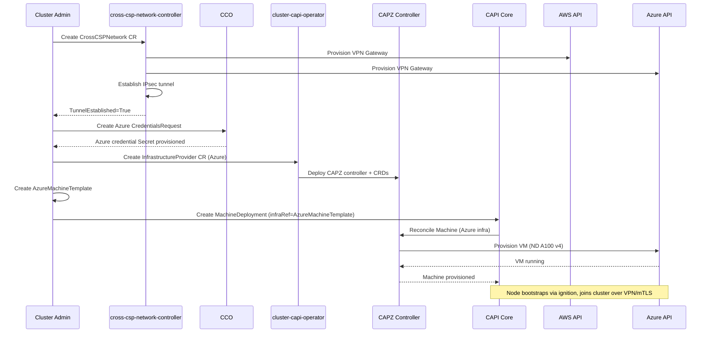

# Cross-CSP Worker Nodes via CAPI Multi-Provider

## Summary

This enhancement enables an OpenShift cluster installed on one Cloud Service
Provider (CSP) to provision and manage worker nodes on a different CSP using
Cluster API (CAPI) multi-provider controllers. For example, an AWS-installed
cluster could add managed Azure GPU worker nodes Day-2 by deploying CAPZ
(Cluster API Provider Azure) alongside the existing CAPA (Cluster API Provider
AWS). This builds on the ongoing MAPI-to-CAPI migration, RFE-7030 (multi-cloud
CCO identity), and OCPSTRAT-2650 (mixed-platform workers in standalone OCP) to
deliver native, managed cross-CSP worker provisioning without requiring a second
cluster or HyperShift.

## Motivation

OpenShift clusters are currently single-CSP: the platform chosen at install time
determines the machine management, cloud credential, and cloud controller
integrations for all nodes. This constraint forces customers who need specialized
resources from a different CSP (e.g., GPU instances) to deploy a separate cluster
and use multi-cluster networking (Submariner, Service Connect) to bridge them --
an approach that adds significant operational overhead and cost.

The immediate driver is a FedRAMP High (IL5) customer operating in AWS GovCloud
who needs NVIDIA A100 80GB GPUs for AI workloads. These GPUs are unavailable in
GovCloud (4-6 week lead time) but immediately available in Azure Government
(ND A100 v4 series). The customer has mTLS connectivity between their AWS and
Azure IL5 enclaves and wants to add a single managed Azure GPU worker to their
existing AWS cluster rather than standing up an entire second cluster.

This is not an isolated use case. GPU and accelerator scarcity across CSP regions
is a growing industry-wide constraint, particularly in government and regulated
sectors where region availability is limited. Multiple RFEs signal demand for
mixed-platform worker capabilities (RFE-5538, RFE-8658, RFE-7780, RFE-7030).

### User Stories

* As a cluster administrator with an AWS OpenShift cluster, I want to add Azure
  worker nodes with GPU resources so that I can run AI workloads using hardware
  that is unavailable in my primary CSP region.

* As a platform operator, I want to manage cross-CSP worker node lifecycle
  (scale up, scale down, replace) through the same CAPI MachineDeployment
  interface I use for my primary CSP workers so that I do not need separate
  tooling for each cloud.

* As a security engineer in a FedRAMP High environment, I want cross-CSP worker
  nodes to use cloud-native identity (workload identity federation) for their
  respective CSP so that I do not need to distribute long-lived credentials
  across cloud boundaries.

* As a support engineer, I want cross-CSP worker nodes to be clearly
  identifiable in cluster state (node labels, machine objects, conditions) so
  that I can diagnose platform-specific issues without ambiguity about which
  CSP a node belongs to.

### Goals

1. Enable Day-2 addition of managed worker nodes from a secondary CSP to a
   standalone OpenShift cluster installed on a primary CSP, starting with
   AWS (primary) + Azure (secondary).
2. Use CAPI multi-provider architecture (CAPA + CAPZ coexisting) for machine
   lifecycle management of cross-CSP workers.
3. Support CCO-managed cloud credentials for the secondary CSP via RFE-7030
   multi-cloud workload identity.
4. Provide a clear operational model: cross-CSP workers are visible in the
   cluster as managed machines with appropriate platform labels and conditions.
5. Define a phased graduation path from CCM-less mode (Dev Preview) through
   full managed lifecycle (GA).
6. Provide optional automated cross-CSP network provisioning via a standalone
   operator with a pluggable driver model, starting with IPsec VPN (AWS VPN
   Gateway + Azure VPN Gateway). Customers with pre-existing connectivity
   may opt out.

### Non-Goals

1. **Cross-CSP control plane HA**: This enhancement does not address running
   control plane components across multiple CSPs.
2. **HyperShift-specific changes**: While HyperShift has parallel work on
   mixed-platform NodePools (RFE-8658), this enhancement targets standalone
   OCP clusters.
3. **Storage replication**: Cross-CSP persistent storage replication or
   migration is out of scope. Cross-CSP workers use CSP-native storage (e.g.,
   Azure Disk CSI) or local storage.
4. **Arbitrary CSP combinations at GA**: Initial implementation targets
   AWS + Azure. Other combinations (GCP + AWS, etc.) follow the same
   architecture but are not committed in the first phase.

Note: Cross-CSP network provisioning IS in scope via the optional
cross-csp-network-controller (see Proposal). Customers with pre-existing
connectivity (enterprise WAN, Direct Connect, ExpressRoute, or manually
configured VPN) may bypass the controller by annotating their
`InfrastructureProvider` CR with
`cross-csp.openshift.io/network-managed-externally: "true"`.

## Proposal

The proposal leverages three converging platform capabilities to decompose what
was previously assessed as a "platform rewrite" into incremental extensions:

1. **CAPI Multi-Provider (machine management)**: The MAPI-to-CAPI migration
   (OCP 4.22+) replaces the monolithic Machine API with modular CAPI providers.
   CAPI's architecture allows multiple infrastructure providers (e.g., CAPA and
   CAPZ) to run as independent controllers in the same cluster. This is the
   core enabler -- no "MachineConfig translation" or custom bridging operator
   is needed because each CAPI provider natively manages its own cloud's
   machine templates.

2. **CCO Multi-Cloud Identity (cloud credentials)**: RFE-7030 (In Refinement,
   Critical) is scoping multi-cloud workload identity, allowing pods to use
   identity features from multiple CSPs. This directly provides the "dual CCO
   credentials" capability.

3. **CCM-less Worker Mode (cloud controller)**: OCPSTRAT-2650 (In Progress,
   Critical) validates that an OCP cluster can accept workers that do not have
   a corresponding Cloud Controller Manager. Cross-CSP workers initially
   operate in CCM-less mode (similar to bare metal workers on a vSphere
   cluster), with per-platform CCM as a future enhancement.

### Cross-CSP Network Operator

A standalone cross-csp-network-controller provides optional automated
provisioning of the cross-CSP network path. It uses a pluggable driver model
to support multiple tunnel technologies while maintaining a single operational
interface.

**CRD: `CrossCSPNetwork`**

```yaml
apiVersion: infrastructure.openshift.io/v1alpha1
kind: CrossCSPNetwork
metadata:
  name: azure-link
  namespace: openshift-cross-csp-network
spec:
  driver: IPsecVPN    # IPsecVPN | WireGuard | DirectConnect
  primaryCSP:
    platform: AWS
    vpcID: vpc-0abc123def456
    region: us-gov-west-1
    subnetCIDRs:
      - 10.0.0.0/16
  secondaryCSP:
    platform: Azure
    subscriptionID: "..."
    resourceGroup: cross-csp-rg
    vnetName: gpu-workers-vnet
    region: usgovvirginia
    subnetCIDRs:
      - 10.1.0.0/16
  tunnel:
    authentication: psk          # psk | certificate
    routeExchange: static        # static | bgp
    pskRotationInterval: 24h
  credentialsRef:
    primary:
      name: aws-cross-csp-creds
    secondary:
      name: azure-cross-csp-creds
status:
  conditions:
    - type: TunnelEstablished
      status: "True"
      lastTransitionTime: "2026-06-26T10:00:00Z"
    - type: LatencyAcceptable
      status: "True"
      message: "RTT 23ms, packet loss 0.01%"
  tunnelEndpoints:
    primary: 203.0.113.10
    secondary: 198.51.100.20
  metrics:
    latencyMs: 23
    packetLossPct: 0.01
    uptimePct: 99.97
```

**Controller behavior**:

1. Validates credentials for both CSPs.
2. Provisions a VPN Gateway in the primary CSP (e.g., AWS VPN Gateway in the
   cluster VPC).
3. Provisions a VPN Gateway in the secondary CSP (e.g., Azure VPN Gateway in
   the target VNet).
4. Establishes IPsec IKEv2 tunnel between the gateways with the configured
   authentication method.
5. Configures route tables on both sides for cross-CSP subnet reachability.
6. Enters steady-state health monitoring: measures RTT and packet loss via
   ICMP probes every 30 seconds, reports via status conditions and Prometheus
   metrics (`cross_csp_network_latency_ms`, `cross_csp_network_packet_loss`,
   `cross_csp_network_tunnel_up`).
7. Handles PSK rotation on the configured interval with zero-downtime rekeying
   (establishes new SA before tearing down old one).

**Driver interface**:

The controller delegates CSP-specific operations to a `NetworkDriver` interface:

- `IPsecVPNDriver`: Provisions cloud-managed VPN gateways (AWS VPN Gateway +
  Azure VPN Gateway). Highest compatibility, moderate cost (~$176/mo combined),
  20-45 minute provisioning time.
- `WireGuardDriver` (Phase 2): Deploys WireGuard tunnels on existing cluster
  nodes. Zero gateway cost, sub-minute establishment, but requires a node with
  a public IP or load balancer on each side.
- `DirectConnectDriver` (GA): Orchestrates AWS Direct Connect + Azure
  ExpressRoute for production-grade private circuits. Highest bandwidth and
  lowest latency, but requires physical circuit provisioning (days/weeks).

**Integration with CAPI flow**:

The `cluster-capi-operator` checks for a `CrossCSPNetwork` resource with
`TunnelEstablished=True` before marking a secondary `InfrastructureProvider`
as ready. This is a soft gate: administrators who manage connectivity
externally annotate the `InfrastructureProvider` with
`cross-csp.openshift.io/network-managed-externally: "true"` to bypass the
check.

### Workflow Description

**Actors**:
- **cluster administrator**: Human user responsible for operating the OCP
  cluster and managing its infrastructure.
- **cross-csp-network-controller**: Provisions and monitors the cross-CSP
  network tunnel (VPN/WireGuard/DirectConnect).
- **CAPI core controller**: Reconciles Machine, MachineSet, and
  MachineDeployment resources.
- **CAPA controller**: CAPI infrastructure provider for AWS (installed at
  cluster creation).
- **CAPZ controller**: CAPI infrastructure provider for Azure (installed
  Day-2).
- **CCO**: Cloud Credential Operator, managing credential requests for both
  CSPs.

**Prerequisites**:
- OpenShift cluster installed on AWS with CAPI-managed machines (OCP 4.22+).
- Azure subscription with appropriate RBAC permissions for CAPZ and (if using
  the cross-csp-network-controller) VPN Gateway provisioning.

**Day-2 Workflow**:

1. The cluster administrator creates a `CrossCSPNetwork` CR specifying the
   Azure VNet CIDR, region, and driver type (default: `IPsecVPN`). The
   cross-csp-network-controller provisions VPN Gateways on both CSPs,
   establishes the IPsec tunnel, and configures route tables. The controller
   reports `TunnelEstablished=True` when the tunnel is active and verified.
   (Skip this step if using pre-existing connectivity with the external
   management annotation.)

2. The cluster administrator creates a `CredentialsRequest` for Azure,
   specifying the Azure subscription, tenant, and workload identity
   configuration. CCO provisions the corresponding Secret.

3. The cluster administrator installs the CAPZ infrastructure provider
   via the cluster-capi-operator by creating an `InfrastructureProvider`
   CR for Azure. The cluster-capi-operator deploys the CAPZ controller
   and its CRDs.

4. The cluster administrator creates an `AzureMachineTemplate` specifying
   the desired Azure VM configuration (e.g., `Standard_ND96asr_v4` for
   A100 GPUs), the Azure region, resource group, VNet/subnet, and
   references the Azure credential Secret.

5. The cluster administrator creates a CAPI `MachineDeployment` with:
   - `spec.template.spec.infrastructureRef` pointing to the
     `AzureMachineTemplate`
   - `spec.template.spec.bootstrap` referencing a bootstrap config that
     includes the cluster's kubeconfig endpoint and CA bundle
   - Node labels indicating the secondary CSP (e.g.,
     `node.openshift.io/cloud-provider=azure`)

6. The CAPI core controller creates `Machine` resources. CAPZ provisions
   Azure VMs in the specified region/VNet. The VMs bootstrap using the
   standard ignition/cloud-init flow, joining the cluster as worker nodes.

7. The kubelet on the Azure worker connects to the API server over the
   cross-CSP network link (provisioned in step 1). The node registers with
   `platform: External` (or a new platform annotation) and operates
   without an Azure CCM (CCM-less mode, per OCPSTRAT-2650 pattern).

8. The cluster administrator scales the MachineDeployment replicas to
   manage the Azure worker pool. CAPZ handles provisioning and
   deprovisioning natively.



### API Extensions

**New CRDs**: None. This enhancement uses existing CAPI CRDs
(`MachineDeployment`, `Machine`, `AzureMachineTemplate`) and existing CCO CRDs
(`CredentialsRequest`).

**Modified Resources**:

- **`InfrastructureProvider` CR** (cluster-capi-operator): Must support
  installing a secondary CAPI infrastructure provider (CAPZ) on a cluster
  where a different primary provider (CAPA) is already active. The
  cluster-capi-operator currently installs providers based on the cluster's
  platform; this needs to support explicit additional provider installation.

- **`Infrastructure` CR** (`config.openshift.io/v1`): May need a
  `status.secondaryPlatforms` field or equivalent to signal that the cluster
  has cross-CSP workers, enabling other operators (monitoring, alerting,
  support tools) to account for the heterogeneous topology.

- **Node labels**: Cross-CSP worker nodes carry
  `node.openshift.io/cloud-provider=<secondary-csp>` to distinguish them
  from primary-CSP workers in scheduling, monitoring, and support workflows.

### Topology Considerations

#### Hypershift / Hosted Control Planes

This enhancement does not modify HyperShift. HyperShift has parallel work on
mixed-platform NodePools (RFE-8658, Approved) which addresses a similar use
case within the HCP architecture. The standalone OCP approach described here
and the HyperShift approach are complementary but independent.

#### Standalone Clusters

This is the primary target topology. The enhancement applies to standalone
OCP clusters installed via IPI or assisted installer on a supported CSP, with
CAPI-managed machines (OCP 4.22+).

#### Single-node Deployments or MicroShift

Not applicable. Single-node deployments do not add worker nodes, and MicroShift
does not use CAPI or CCO. No changes to SNO or MicroShift resource consumption.

#### OpenShift Kubernetes Engine

This enhancement depends on CAPI, CCO, and cluster-capi-operator, all of which
are part of the OCP payload. OKE includes the same machine management stack, so
cross-CSP workers would function identically on OKE once the prerequisite
capabilities are available.

### Implementation Details/Notes/Constraints

**Phased Implementation**:

| Phase | Scope | Dependencies | Target |
|-------|-------|-------------|--------|
| 1 | CCM-less cross-CSP workers via CAPI multi-provider | MAPI-to-CAPI migration (GA), OCPSTRAT-2650 (CCM-less pattern) | Dev Preview |
| 2 | CCO multi-cloud credential management | RFE-7030 (multi-cloud workload identity) | Tech Preview |
| 3 | Per-platform CCM for secondary CSP workers, CSI integration | New work | GA |

**Phase 1 constraints**:
- Cross-CSP workers operate as `platform: External` or `platform: None`,
  similar to bare metal workers on a vSphere cluster (OCPSTRAT-2650 pattern).
- No Azure CCM means: no Azure-specific node lifecycle events (e.g., Azure
  Scheduled Events), no automatic node address discovery from Azure metadata.
  Node addresses are set by the kubelet from the VM's network configuration.
- Azure Disk CSI is not available in Phase 1. Workers use local NVMe storage
  (ND A100 v4 has local NVMe SSDs) or NFS/external storage.
- The customer is responsible for network connectivity (VPN/mTLS) between CSPs.

**Phase 2 additions**:
- CCO provisions and rotates Azure workload identity credentials alongside
  AWS credentials.
- CredentialsRequests from Azure-specific operators (CSI driver, etc.) are
  fulfilled by CCO.

**Phase 3 additions**:
- A per-platform CCM instance runs for Azure workers, providing full node
  lifecycle management, load balancer integration, and route management for
  the Azure subnet.
- Azure Disk CSI driver deployed and targeted to Azure worker nodes via node
  affinity.

**Key technical constraint**: The cluster's `Infrastructure` CR
(`spec.platformStatus`) is set at install time and is immutable. Cross-CSP
support must not require changing the primary platform type. Secondary CSP
information is conveyed through separate mechanisms (CAPI provider CRs, node
labels, optional `status.secondaryPlatforms`).

### Risks and Mitigations

| Risk | Impact | Mitigation |
|------|--------|------------|
| Cross-CSP network latency affects kubelet heartbeats | Node flapping, pod evictions | Tune `--node-status-update-frequency` and node lease duration for cross-CSP workers; document minimum network requirements |
| Credential scope expansion (cluster now has credentials for two CSPs) | Increased blast radius if credentials are compromised | Use workload identity (short-lived tokens) per RFE-7030; enforce least-privilege RBAC per CSP |
| Support matrix complexity (N x M CSP combinations) | Increased QE and support burden | Limit GA to specific CSP pairs (AWS+Azure first); use feature gate to control availability |
| CCM-less mode limitations confuse users | Unexpected behavior (no Azure-aware node management) | Clear documentation, distinctive node labels, conditions on Machine objects indicating CCM-less mode |
| CAPI provider version skew between CAPA and CAPZ | Incompatible API versions | Pin CAPI providers to compatible versions in cluster-capi-operator; test version matrix in CI |

### Drawbacks

- **Increased operational complexity**: Cluster administrators must understand
  two CSP ecosystems (networking, IAM, instance types) to operate cross-CSP
  workers effectively. This is inherent to the use case.

- **Support surface expansion**: Red Hat support must be prepared to
  troubleshoot issues that span two CSP boundaries (e.g., "is this a network
  issue between AWS and Azure, or a kubelet issue?"). Clear labeling and
  conditions on cross-CSP nodes mitigate but do not eliminate this.

- **Phased GA means early adopters have limitations**: Phase 1 (Dev Preview)
  lacks CCM and CSI for the secondary CSP. Customers adopting early must
  accept these limitations and plan to upgrade through phases.

- **VPN Gateway cost**: The IPsecVPN driver provisions managed VPN Gateways on
  both CSPs (AWS VPN Gateway ~$36/mo + Azure VPN Gateway VpnGw1 ~$140/mo =
  ~$176/mo combined). Mitigation: the WireGuard driver (Phase 2) eliminates
  gateway cost entirely by running tunnels on existing cluster nodes.
  Documentation will include cost comparison across driver types.

- **Tunnel establishment latency**: Cloud-managed VPN Gateway provisioning
  takes 20-45 minutes on both AWS and Azure. The total time from
  CrossCSPNetwork CR creation to TunnelEstablished=True is approximately
  30-50 minutes. Mitigation: documentation advises pre-provisioning the
  network before the cross-CSP worker Day-2 operation; the WireGuard driver
  establishes tunnels in under 60 seconds.

- **PSK rotation and key management**: IPsec tunnels using pre-shared keys
  require periodic rotation to maintain security posture. The controller
  handles this automatically using zero-downtime rekeying (new SA established
  before old SA is torn down), but if the controller is unavailable during a
  rotation window, the tunnel continues operating with the existing key until
  the controller recovers.

## Open Questions

1. **CCM per-platform feasibility**: Can multiple CCM instances coexist in a
   single cluster, each scoped to a subset of nodes by label selector? The
   upstream `--node-selector` flag on cloud-controller-manager may enable this,
   but it has not been validated in OCP.

2. **CSI cross-CSP constraints**: When Azure Disk CSI is deployed for
   cross-CSP workers, how does the storage operator handle having two CSI
   drivers for different clouds? Are there conflicts in the CSIDriver or
   StorageClass resources?

3. **Infrastructure CR signaling**: Is `status.secondaryPlatforms` the right
   mechanism, or should cross-CSP state be conveyed entirely through CAPI
   provider CRs and node labels? The former requires an openshift/api change;
   the latter avoids it but may be less discoverable.

4. **Network validation** [RESOLVED]: The cross-csp-network-controller
   validates connectivity and reports status via CrossCSPNetwork conditions.
   The cluster-capi-operator gates secondary InfrastructureProvider readiness
   on `TunnelEstablished=True`. Administrators using externally-managed
   connectivity bypass this gate via annotation. This provides automated
   pre-flight validation without requiring it for all topologies.

5. **Upgrade path**: When upgrading from OCP 4.x to 4.y, how are secondary
   CAPI providers upgraded? Does the cluster-capi-operator manage CAPZ
   lifecycle in lockstep with CAPA, or independently?

## Alternatives (Not Implemented)

### Multi-cluster with Submariner / Service Connect

Deploy a separate OCP cluster on the secondary CSP and connect it to the
primary cluster using Submariner or Red Hat Service Connect. This is the
currently supported approach.

**Why not chosen**: The customer explicitly rejected this as "overkill" for
adding a single GPU worker node. It requires a full control plane on the
secondary CSP, doubles operational overhead, and does not provide a single
cluster identity for workload scheduling.

### Agent-based unmanaged worker nodes

Use the agent-based installer to create an Azure VM manually, generate a
discovery ISO, and join it to the cluster as a `platform: None` worker.

**Why not chosen**: This does not provide managed machine lifecycle (no
MachineDeployment scaling, no automated replacement on failure), no CCO
credential management, and no CSI integration. The customer explicitly
asked for managed provisioning from the OCP console/API. This approach
can serve as an interim workaround but does not satisfy the RFE.

### HyperShift with mixed-platform NodePools

Use HyperShift (Hosted Control Planes) which has approved work (RFE-8658)
to support mixed Agent + KubeVirt NodePools in a single HostedCluster.

**Why not chosen**: The customer is not interested in HyperShift. Their
existing cluster is standalone OCP, and migrating to HyperShift to solve
a Day-2 GPU provisioning problem is disproportionate. Additionally,
RFE-8658 targets Agent + KubeVirt, not cross-CSP IPI NodePools.

## Test Plan

**Unit tests**:
- cluster-capi-operator: Verify that `InfrastructureProvider` CR for a
  secondary provider (CAPZ) is correctly reconciled when the cluster's
  primary platform is AWS.
- CCO: Verify that `CredentialsRequest` for Azure is fulfilled on an
  AWS-platform cluster (RFE-7030 scope).
- cross-csp-network-controller: Driver interface contract tests verifying
  each driver implementation (IPsecVPN, WireGuard) correctly implements
  Provision, Teardown, HealthCheck, and RotateCredentials operations.
- cross-csp-network-controller: IPsec configuration generation tests
  verifying correct IKEv2 parameters, PSK handling, and route table entries
  for AWS + Azure combinations.

**Integration tests**:
- Deploy CAPA + CAPZ controllers in the same cluster and verify both can
  independently reconcile their respective Machine resources without
  CRD conflicts or controller interference.
- Verify that a CAPZ-provisioned VM successfully bootstraps and joins an
  AWS-installed cluster when network connectivity is available.
- cross-csp-network-controller: Provision and teardown VPN Gateways on both
  AWS and Azure using real cloud APIs (with test credentials and isolated
  VPC/VNet). Verify route table configuration and tunnel establishment.
- cross-csp-network-controller: PSK rotation under active traffic — verify
  zero packet loss during rekeying operation.

**e2e tests**:
- Full cross-CSP provisioning flow: create CrossCSPNetwork CR (tunnel
  establishment), create Azure CredentialsRequest, install CAPZ provider,
  create AzureMachineTemplate, create MachineDeployment, verify node joins,
  run a workload, scale down, teardown tunnel.
- Negative test: verify graceful failure when cross-CSP network connectivity
  is unavailable (CAPZ provisions VM but node does not join; Machine enters
  appropriate condition). Verify cross-csp-network-controller reports
  TunnelEstablished=False with diagnostic message.
- Tunnel failure recovery: simulate tunnel drop (delete VPN connection),
  verify controller detects failure within 60 seconds, re-establishes tunnel,
  and node recovers without manual intervention.
- Upgrade test: verify cross-CSP workers and active tunnels survive a cluster
  upgrade from 4.N to 4.N+1 with both CAPI providers and network controller
  upgraded.
- Bypass test: verify that clusters with
  `cross-csp.openshift.io/network-managed-externally: "true"` annotation
  successfully provision cross-CSP workers without requiring a
  CrossCSPNetwork CR.

**CI infrastructure**: Requires a CI environment with both AWS and Azure
credentials. The cross-csp-network-controller provisions VPN connectivity
as part of the test flow (no pre-configured VPN needed). GPU instance tests
reserved for periodic jobs using cheaper instance types for functional
validation.

## Graduation Criteria

### Dev Preview -> Tech Preview

- Cross-CSP workers can be provisioned and join the cluster via CAPI
  multi-provider (CAPA + CAPZ).
- CCM-less mode is functional for secondary CSP workers.
- cluster-capi-operator supports installing secondary infrastructure providers.
- cross-csp-network-controller with IPsecVPN driver provisions and monitors
  VPN Gateways on AWS + Azure, reports TunnelEstablished status.
- End-to-end documentation for the Day-2 workflow (including network setup).
- Basic e2e test coverage for the provisioning flow including tunnel
  establishment.
- Feature gated behind a TechPreviewNoUpgrade feature gate.

### Tech Preview -> GA

- CCO multi-cloud identity (RFE-7030) is integrated and functional.
- Per-platform CCM for secondary CSP workers.
- Azure Disk CSI available for cross-CSP workers.
- cross-csp-network-controller WireGuard driver available (zero-cost
  alternative to VPN Gateway).
- cross-csp-network-controller DirectConnect/ExpressRoute driver available
  for production-grade private circuits.
- Automatic failover between tunnel types when primary path degrades.
- Upgrade/downgrade testing across minor versions with cross-CSP workers
  and active tunnels.
- Load testing with realistic cross-CSP network latency profiles.
- User-facing documentation in [openshift-docs](https://github.com/openshift/openshift-docs/).
- Support procedures documented for cross-CSP failure modes (including
  network-specific failure scenarios).
- Telemetry: SLIs for cross-CSP node health, join latency, heartbeat
  reliability, tunnel uptime, latency, and packet loss.

### Removing a deprecated feature

Not applicable (new feature).

## Upgrade / Downgrade Strategy

This enhancement is additive and does not change behavior for existing
single-CSP clusters.

**Upgrade**: When upgrading from a version without cross-CSP support to one
with it, no automatic changes occur. Cross-CSP workers are only created when
the administrator explicitly installs a secondary CAPI provider and creates
cross-CSP MachineDeployments.

**Upgrade with existing cross-CSP workers**: The cluster-capi-operator must
upgrade the secondary CAPI provider (CAPZ) alongside the primary provider
(CAPA) during a cluster upgrade. Existing cross-CSP workers continue
operating during the upgrade. The CAPZ controller restart during upgrade
does not affect running Azure VMs (CAPI is declarative and reconciles
to desired state).

**Downgrade**: If a cluster with cross-CSP workers is downgraded to a version
that does not support the secondary CAPI provider, the CAPZ controller
and its CRDs would be removed by CVO. The Azure VMs would continue running
but become unmanaged (orphaned). Documentation must warn administrators to
drain and remove cross-CSP workers before downgrading.

## Version Skew Strategy

- CAPA and CAPZ are independent controllers with independent version
  lifecycles. They share CAPI core CRDs but do not interact directly.
  Version skew between CAPA and CAPZ is managed by the
  cluster-capi-operator, which pins both to compatible CAPI core versions.

- During an upgrade, CAPA and CAPZ may briefly run different versions. This
  is safe because each provider only reconciles its own infrastructure
  resources (`AWSMachine` vs `AzureMachine`).

- Cross-CSP worker kubelets follow the standard n-2 kubelet version skew
  policy relative to the API server. No additional skew considerations
  beyond what exists for single-CSP workers.

## Operational Aspects of API Extensions

The `InfrastructureProvider` CR extension (supporting secondary providers)
does not introduce webhooks or aggregated API servers. It is a configuration
resource reconciled by the cluster-capi-operator.

- **SLI**: cluster-capi-operator condition
  `SecondaryProviderAvailable=True/False` indicates whether the secondary
  CAPI provider is healthy.
- **Impact on existing SLIs**: Minimal. Adding a secondary CAPI provider
  adds one controller deployment and its CRDs. Expected CRD instance count
  is low (tens of Machines, not thousands).
- **Failure modes**: If CAPZ controller is unavailable, new Azure Machine
  provisioning fails but existing Azure workers continue running. The
  cluster-capi-operator reports the condition. Primary CSP (CAPA) operations
  are unaffected.
- **Escalation**: Cluster Infrastructure team for CAPI provider issues;
  CCO team for credential issues; Networking team for cross-CSP connectivity
  issues.

## Support Procedures

**Detecting cross-CSP issues**:
- Nodes with label `node.openshift.io/cloud-provider=azure` on an AWS cluster
  indicate cross-CSP workers.
- Machine objects with `spec.infrastructureRef.kind=AzureMachine` alongside
  `AWSMachine` objects confirm the topology.
- CAPZ controller logs (`openshift-cluster-api` namespace) show Azure API
  interactions.

**Common failure scenarios**:

1. **Cross-CSP node not joining**: Check network connectivity between Azure
   VNet and AWS VPC. Verify the bootstrap ignition endpoint is reachable from
   the Azure subnet. Check CAPZ controller logs for VM provisioning status.

2. **Cross-CSP node flapping**: Check network latency and packet loss between
   CSPs. Adjust `--node-status-update-frequency` if latency exceeds 100ms
   sustained. Check node lease renewal in `kube-node-lease` namespace.

3. **Azure credential expiry**: Check CCO logs for credential rotation
   failures. Verify the Azure workload identity federation configuration.
   Check the `CredentialsRequest` status conditions.

**Disabling cross-CSP workers**:
- Scale MachineDeployments with Azure infraRef to 0 replicas.
- Delete the `InfrastructureProvider` CR for Azure to remove CAPZ controller.
- Azure VMs are terminated by CAPZ during scale-down. If CAPZ is removed
  before scale-down, Azure VMs become orphaned and must be cleaned up
  manually in the Azure portal.

## Infrastructure Needed

- CI environment with dual-CSP credentials (AWS + Azure) and pre-configured
  VPN/peering for cross-CSP e2e testing.
- Azure subscription with quota for GPU instances (ND A100 v4 or equivalent)
  in CI, or a cheaper instance type for functional testing with GPU tests
  reserved for periodic jobs.
