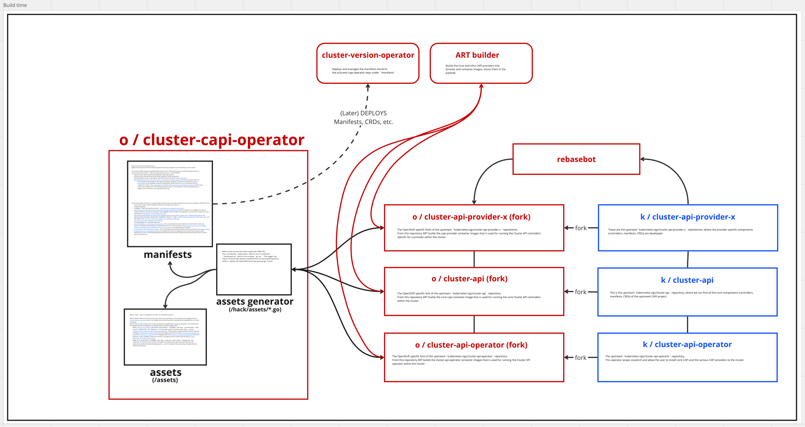
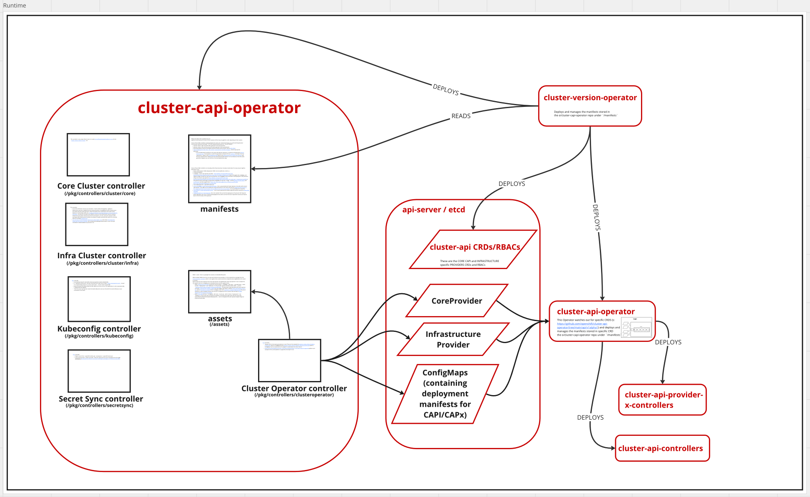
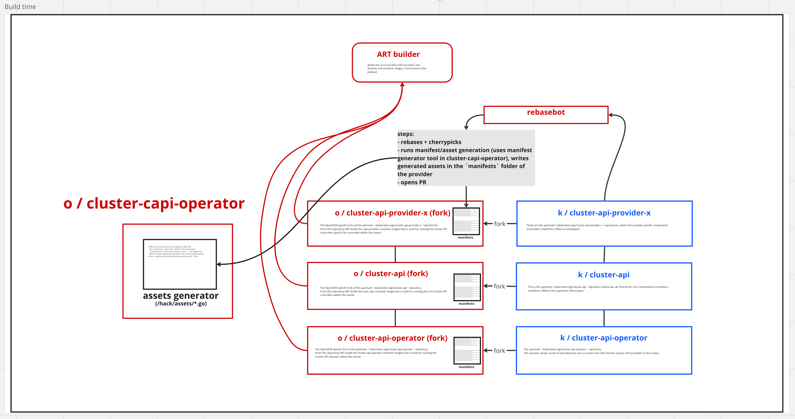
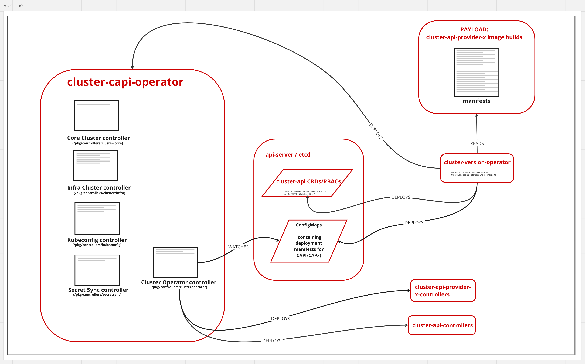

# Installing Cluster API components in OpenShift

## Summary

This enhancement describes how we (the Cluster Infrastructure team) intend to rework the current flow for the installation of Cluster API components in OpenShift, at the moment only available in Tech Preview, by addressing some of the criticalities of the current implementation, leveraging some of the lessons learned since the first Tech Preview release.

The focus areas of this refactor are mainly around reducing complexity of the architecture and improving the development, stability and maintainability of Standalone Cluster API on OpenShift by preventing payload breakage due to non atomic repository merges, while maintaining the functionality provided up until now.

## Motivation

The current setup, wiring and installation of Cluster API on OpenShift has several criticalities in both, the complexity of its architecture and the way in which the system comes together within an OpenShift payload.

To understand these issues we need to take a look at the architecture of the system that is currently implemented in Tech Preview.

The system operates in two separate phases: the build time phase, where the manifests and other assets are fetched and customized, and the runtime phase, where operators take over and manage the installation of the CAPI providers and ancillary components.

### Build time

The flow starts with a periodic ProwJob that launches a [RebaseBot](https://github.com/openshift-eng/rebasebot) rebase to update the OpenShift Org's Cluster API Providers forks with the latest available stable release.
If the bot detects a new release it creates a Pull Request (PR) on the fork that starts a new branch from the new stable release as the base and cherry-picks the OpenShift specific commits on top of that.

The PR is then checked by CI jobs and reviewed by the team, ending up merging in the main branch.

At this point the ART builders build the various providers code into an image that later makes it into to the payload.

Later at an arbitrary time, independent from these previous steps, a team member checks out the `openshift/cluster-capi-operator` repository, they bump the cluster-api core and providers dependencies in the various go modules present in the repository ([see](https://github.com/openshift/cluster-capi-operator/blob/504be5bee927f7c1d0265b82054049283699b988/go.mod#L24-L27)),
they update the [providers-list.yaml](https://github.com/openshift/cluster-capi-operator/blob/504be5bee927f7c1d0265b82054049283699b988/providers-list.yaml#L1-L20) and then they launch a tool, called the asset generator ([see](https://github.com/openshift/cluster-capi-operator/tree/b99156eb090d7eb76151809754bb7b85d14d9fb6/hack/assets)).
This tool, reads from the `providers-list.yaml` and `cluster-api-operator.yaml` files the desired providers and their location (usually the under the `openshift` org.),
fetches their `metadata.yaml` (a clusterctl metadata file) and their kustomize configuration, runs a kustomization and some further manifest transformations and finally dumps some generated manifests under the `/manifests` folder
(on which the content is later applied by the Cluster Version Operator) and some other under the `/assets` folder.

The team member then opens a PR that goes through the usual flow and gets merged into main.
Lastly the ART builder builds the repository into an image that is, independently from the other CAPI providers images, embedded in the payload.

_Note: during the build of the image, in the `go build` step, the content `/assets` folder is stored in the
binary as an embedded filesystem, which is going to be available the later at runtime._

### Runtime

The flow picks up again at cluster runtime.
During boostrap the CVO (Cluster Version Operator) reads the content of the `/manifests` folder in the `cluster-capi-operator` image and deploys the manifests for the following components:
- cluster-api core CRDs/RBAC
- cluster-api providers CRDs/RBAC
- cluster-api-operator (upstream component) specific CRDs/RBAC
- cluster-capi-operator (deployment + webhooks)
- cluster-api-operator (upstream component) (deployment + webhooks)

Once the cluster-capi-operator is deployed, its main process starts up, and loads the assets from the embedded filesystem.

These files are YAML manifests containing the Custom Resources specific to the Cluster API Operator (Core Provider, InfrastructureProvider, Configmaps containing deployment manifests), the upstream operator for deploying Cluster API on the cluster.

These manifests once loaded, are templated with the container image references built for the payload and applied to the cluster.

The upstream Cluster API Operator, which is watching the api server for these resources, detects the new Custom Resources applied and initiates the fetching of the CAPI providers as specified in the CRs provided. Once fetched and validated the operator proceeds with installing the providers in the cluster, by deploying the core and provider specific CAPI controllers.

This flow, while functional, poses two main challenges to the development and usage of the system.

**Complexity**.
The system has significant complexity to it, due to the sheer amount of components and their dependencies.
This can be seen by looking at what it takes to deploy a Cluster API Provider.
The Cluster Version Operator (CVO) deploys two Second Level Operators, the OpenShift-specific cluster-capi-operator, and the upstream cluster-api-operator.
At build time we generate and embed specific Custom Resources and the manifests ConfigMap defined for the upstream operator within the Openshift-specific operator,
we template them, apply them, and let the upstream operator pick those up, act on them by unpacking the locally available ConfgMap, from which the CAPI providers manifests get unnested and deployed.

**Development and Payload Stability**.
The development of this complex system, as previously described, has various steps to it and happens across various repositories, where multiple PRs need to merge before a provider change/bump can actually completely land on an OpenShift payload as a feature.
The problem with this is that the various PRs that it takes to land a provider rebase, for example, cannot be merged atomically, but will land at separate stages once they are reviewed, approved, their CI is green and the merge bot decides it's time for them to be merged.
This can lead to payload breakages when a provider image build is not backward compatible with the previous version's manifests (Deployment/CRDs/RBACs), which in the current stage are deployed by CVO from an image build of the `cluster-capi-operator`, and not from the mentioned `cluster-api-provider-x`.

### User Stories

As an administrator I want to _have a CAPI-on-OpenShift architecture as minimally complicated as possible_ so that I can _easily understand what is going on and debug potential issues on my cluster_.

As an administrator I want to _have a CAPI-on-OpenShift architecture as minimally complicated as possible_ so that I can _extend my cluster by deploying a custom provider_.

As an OpenShift engineer I want to _have a CAPI-on-OpenShift architecture as minimally complicated as possible_ so that I can _more easily maintain and extend it_.

As an OpenShift engineer I want to _have a way to atomically apply a change to any provider_ so that I can avoid _payload breakages_.

As an OpenShift engineer I want to _have a way to load and customize provider manifests before applying them_ so that I can _template the manifests payload with image references and other runtime tweaks_.

As an OpenShift engineer I want to _have a way to load and customize provider manifests before applying them_ so that I can _future proof the system_ to be able to give users a way to selectively deploy one or more providers, even ones that are not matching the running platform.

### Goals

This proposal seeks to refactor OpenShift manifest generation to live in provider repositories & apply cloud platform information dynamically at runtime.  It will have succeeded when developers can update code and manifests for a Cluster API provider within one repository, and when users can selectively deploy providers at runtime.

### Non-Goals

This proposal does not seek to completely redesign the existing Cluster API implementation within OpenShift

This proposal does not seek to complete rewrite the [existing asset/manifest generation tools](https://github.com/openshift/cluster-capi-operator/tree/main/hack/assets) or switch to something like [kustomize](https://kustomize.io/). The existing tools work well enough at the moment, and will only require small changes to enable our goals.
Reworking these tools or switching to another is a task for later. More details on this in the [Alternatives section](#alternatives)

This proposal does not seek to allow installing multiple infrastructure CAPI providers. Although we want to design things in a way so that we do not inhibit this being implemented in the future.

## Proposal

Considering the two challenges previously described we need to address the two following problems:
- **Complexity** - mainly caused by the presence of two operators in the system and the number of input transformations it takes to feed them and produce the desired output
- **Development and Payload Stability** - mainly caused by having manifests for the Cluster API providers deployed from one repository (openshift/cluster-capi-operator) and the actual code for those providers deployed from the providers repositories (openshift/cluster-api-provider-x) endangering the payload stability

### Proposal 1: Improving Dev Ex + Payload Stability

In order to **improve the developer experience and stability of the feature** in the system, we are proposing to **move the asset/manifest generation for the Cluster API providers as a step that happens in the provider repositories during their rebase**,
then write the resulting manifests embedded in a well known ConfigMap (a.k.a. "transport ConfigMap") in the `/openshift/manifests` folder of the repositories, to then let the Cluster Version Operator (CVO) deploy it at cluster bootstrap.
The `openshift/cluster-capi-operator` will then be instructed on which ConfigMaps to look out for, it will fetch them, extract the nested manifests and apply them directly to the cluster.

This change will consist of 3 steps:
1. Extension of the Rebase Bot (https://github.com/openshift-eng/rebasebot) to include Lifecycle Hooks. These hooks introduce the ability to add extra steps during rebases, which will allow for the asset generation step to run before the creation of the Pull Request (tracked by https://issues.redhat.com/browse/OCPCLOUD-2153)
2. Renaming of the CAPI Asset/Manifest generator from `assets` (generator) to `manifest-gen`, as it won't need to generate go embeddable assets anymore, but only manifests that will be referenced and applied by CVO
3. Referencing and invocation of the [CAPI Assets/Manifest generator](https://github.com/openshift/cluster-capi-operator/tree/main/hack/assets) at CAPI Provider Forks rebase time, within the RebaseBot Lifecycle Hooks, as a step during the provider rebase.

### Proposal 2: Reducing Complexity

In order to **reduce the complexity** in the system we are proposing to **get rid of the upstream cluster-api operator** ([kubernetes-sigs/cluster-api-operator](https://github.com/kubernetes-sigs/cluster-api-operator)).
We plan to replace the responsibility of this component, which at the moment is responsible for reading, fetching and installing the desired providers in cluster, by implementing them directly in the downstream `openshift/cluster-capi-operator`.

This change will consist of 3 steps:
1. Removal of the upstream [cluster-api-operator](https://github.com/kubernetes-sigs/cluster-api-operator) manifest/CRs generation steps from the asset/manifest generator in (https://github.com/openshift/cluster-capi-operator/tree/main/hack/assets), as this component is removed from the system
2. Removal of the Cluster Operator controller (which at the moment loads and applies cluster-api-operator CRs)
3. Introduction of a new controller within the downstream [cluster-capi-operator](https://github.com/openshift/cluster-capi-operator), called CAPI Installer controller, which is going to be responsible for replacing the duties previously carried out by the Cluster Operator controller + cluster-api-operator, in the following way:
    - detection of the current Infrastructure platform the clutster is running on
    - loading of the desired CAPI provider manifests at runtime by fetching the relevant transport ConfigMaps (the core and the infrastructure specific one) containing them
    - extraction of the CAPI provider manifests (CRDs, RBACs, Deployments, Webhooks, Services, ...) from the fetched transport ConfigMaps
    - injection of the templated values in such manifests (e.g. ART container images references)
    - order aware direct apply (through client-go) of the resulting CAPI providers manifests at runtime
    - continuous tracking of the provider ConfigMaps and reconciliation of the applied CAPI components

### Workflow Description

As such here is the new proposed workflow to develop and integrate a Cluster API provider into OpenShift:

1. (To be done once) A Cluster API (CAPI) provider repository has to be created in the OpenShift org. The provider should be a syncable fork of an upstream CAPI provider and should adhere to the [`clusterctl` Provider Contract](https://cluster-api.sigs.k8s.io/clusterctl/provider-contract). The repository must then be configured to end up being build and included in the OpenShift payload.
1. A Periodics Job on the Prow CI runs at regular intervals and launches the [Rebase Bot](https://github.com/openshift-eng/rebasebot). The bot performs a syncronization of the commits from a point release of the upstream repository corresponding to the fork by creating a rebasing the existing main branch and stacking the carried patches on top of the branch.
1. Once the main branch has been rebased locally, the Rebase Bot invokes the relevant Lifecycle Hook (e.g. post-rebase) an executes the corresponding command defined for this stage, set to be the manifests generation tool (which resides in the [Cluster CAPI Operator](https://github.com/openshift/cluster-capi-operator) repository, and it is imported in the provider as a tool),
which generates the manifests for the CAPI Provider (CRDs, RBACs, Deployments, Webhooks, Services, ...), it embeds them into the transport ConfigMap, and dumps them to the `/openshift/manifests` folder in the Provider source tree.
1. The Rebase Bot then proceeds creating a Pull Request (PR) containing the rebase changes to the main branch and the generated manifests. The PR then gets reviewed and merged into the main branch.
1. Shortly after, the Provider's repository gets built by the ART builders and ends up being included into the payload. Also the transport ConfigMap(s) end up being embedded in the payload.
1. Once the payload is installed and a new cluster is created the CVO kicks in and applies the manifests embedded introduced by the CAPI Provider repository and embedded in the payload. This results in the creation of the transport ConfigMap(s) in the APIServer. At this point the CVO also launches the [Cluster CAPI Operator](https://github.com/openshift/cluster-capi-operator).
1. The Cluster CAPI Operator controllers start up. The _CAPI Installer controller_ loads the Infrastructure object's platform from the APIServer.
1. In Parallel the other Cluster CAPI Operator controllers perform their usual duties (Syncing of the user-data-secret from MAPI to CAPI namespace, Kubeconfig generation fro CAPI, Setting Infrastructure Cluster to be externally managed and ready, setting of the `ControlPlaneInitializedCondition` to `true`)
1. The Cluster CAPI Operator's _CAPI Installer controller_ fetches the transport ConfigMaps: the core "cluster-api" one and the infrastructure one, according to the loaded platform. It extracts the manifests from the ConfigMaps and performs an order aware apply of them to the APIServer.
These transport ConfigMaps are constantly watched, also at later stages of the controller execution, and the controller reacts upon changes, keeping the desired state in the ConfigMaps in sync with the actual state in the cluster.
1. The Cluster API Provider controllers start up at this point, and are ready to accept CAPI specific CRs (Cluster, InfraCluster, MachineDeployment, MachineSet, ...)

### API Extensions

Even though there is no formal API Extension to OpenShift in this case,
we are introducing an interface which the cluster-capi-operator will implement to fetch the previously described CAPI provider ("transport") ConfigMaps.
The various CAPI providers respositories, infact, via the manifest generator tool, will produce the provider ConfigMaps which follow the upstream [_clusterctl Provider Contract - Components YAML file_] contract
(see [here](https://github.com/kubernetes-sigs/cluster-api/blob/a36712e28bf5d54e398ea84cb3e20102c0499426/docs/book/src/clusterctl/provider-contract.md?plain=1#L157-L162)), which will end up being created on the cluster.

The cluster-capi-operator will later be able to fetch the relevant provider's ConfigMap by filtering the ConfigMaps by namespace and on the well known `cluster.x-k8s.io/provider` label [defined in the above contract](https://github.com/kubernetes-sigs/cluster-api/blob/a36712e28bf5d54e398ea84cb3e20102c0499426/docs/book/src/clusterctl/provider-contract.md?plain=1#L240-L242).

The operator will also be able to keep track of the provider's components by putting a watch on them leveraging the same `cluster.x-k8s.io/provider` label.

### Implementation Details/Notes/Constraints [optional]

We already started a POC implementation of these proposals.
Currently developing on a feature branch on the cluster-capi-operator [here](https://github.com/openshift/cluster-capi-operator/pull/121) and on one of the cluster-api providers to pioneer the efforts, [here](https://github.com/openshift/cluster-api-provider-aws/pull/471).

### Risks and Mitigations

A risk of using transport ConfigMaps to produce and load CAPI providers components is the hard limit on the ConfigMap size in Kubernetes.
In fact Kubernetes has a maximum size of 1MiB for a ConfigMap. If the manifest exceeds this size, Kubernetes will throw an error on manifest creation.
To mitigate this we can address this from two angles:
- early prevention of this issue by checking the size of the ConfigMap before writing it to disk by the manifest generator, and erroring if that exceeds the maximum allowed size
- in the future, if this issue arises, leverage the same mechanism the upstream cluster-api-operator uses and compress/decompress the ConfigMap (see the [upstream specification](https://github.com/kubernetes-sigs/cluster-api-operator/blob/93989812d7d15f3b5dd1930bef9e0208b7301cee/docs/README.md?plain=1#L693-L729) for more details)

### Drawbacks

- Not  using CVO to manage the entirety of the CAPI providers installation means there's an extra layer of operator management within the OpenShift cluster. That said this is not an uncommon pattern, but rather it is the norm when it comes to perform custom deploying behaviour in OpenShift. See for example MAO, CCMO, CSO, CNO.
- Not using Upstream Cluster API Operator (which uses the default clusterctl contract) to apply the CAPI providers might require extra downstream work in the future to adapt the manifests before applying them if their format/assumptions change. Worth noting here that clusterctl currently handles API storage version changes,
which will now need to be handled differently. Within OpenShift we can make use of the [kube-storage-version-migrator-operator](https://github.com/openshift/cluster-kube-storage-version-migrator-operator) crafting a [migration request](https://github.com/kubernetes-sigs/kube-storage-version-migrator/blob/60dee538334c2366994c2323c0db5db8ab4d2838/pkg/apis/migration/v1alpha1/types.go#L30)
to easily handle one off migrations of CAPI CRDs storage version, later tombstoning the migration request manifest.

## Design Details

### Open Questions

N/A - All addressed up until now.

### Test Plan

We plan to rely on the [existing E2Es](https://github.com/openshift/cluster-capi-operator/tree/main/e2e) which already cover the use cases we for the components we are refactoring. We plan to revisit them and add more where necessary.

### Graduation Criteria
#### Dev Preview -> Tech Preview
N/A

#### Tech Preview -> GA
N/A

#### Removing a deprecated feature
N/A

### Upgrade / Downgrade Strategy

This will be covered in a further enhancement about CAPI lifecycle on OpenShift.

### Version Skew Strategy

This will be covered in a further enhancement about CAPI lifecycle on OpenShift.

### Operational Aspects of API Extensions
N/A

#### Failure Modes
- Failure of generating the manifests at build time
  - This would result in a Rebase Bot step failure, resulting in a missing rebase PR
  - the Periodic Prow Job will be retried on failure. Also we already have a notification mechanism in place in the RebaseBot, that will alert us on Slack on failures and their related reasons
- Failure of applying the CAPI providers contained in the transport ConfigMaps.
  - This would be logged as an error by the CAPI Installer controller and it would likely set the Cluster-CAPI-Operator as Degraded after a number of failed attempts.
  - CAPI would not be available for the cluster, and it would be impossible to provision machines

#### Support Procedures

To detect the failure modes in a support situation, admins can look at the cluster-capi-operator logs, and at its status and conditions during operations.

## Implementation History

* [Upstream cluster-api-operator introduction enhancement](https://github.com/kubernetes-sigs/cluster-api/blob/main/docs/proposals/20201020-capi-provider-operator.md)
* CAPI on OCP enhancements from the past:
  * [Cluster API Integration](https://github.com/openshift/enhancements/blob/master/enhancements/machine-api/cluster-api-integration.md)

## Alternatives

* **Extend CVO capabilities to selectively deploy CAPI providers manifests**
  * *PROs*: this would allow us to directly apply the CAPI manifests from the CAPI providers repositories `/manifests` folder by leveraging CVO capabilities
  * *CONs*: this would need to expand the scope of CVO as it will require it to have knowledge of platform(s) the cluster is running on, and would still have the caveat of not being able to deploy multiple providers that are not strictly matching the platform the cluster is running on (i.e. missing desired providers-list)

* **Handling of multiple/custom CAPI providers**
  Installing multiple CAPI infrastructure providers to be able to launch MachineSets on a different cloud provider than the one set in the `Infrastructure` Object status, has been considered a non-goal for this enhancement.
  We don't want to tackle this now, as part of this work, as it would be a non neglegible task to take on that is not justified by any immediate business needs.
  Although this is an option that we don't want to completely inhibit as a potential future enhancement.
  In the future, if desirable, this can be implemented by exposing a new Custom Resource owned by the cluster-capi-operator, which instructs the operator on what providers to deploy.

* **Perform the CAPI providers apply to the cluster, through the clusterctl pkg library**
  * *PROs*: it would ensure compatibility with the clusterctl ecosystem and format/contract
  * *CONs*: it would require a lot of extra complexity (~500 more LOC) and dependencies to achieve a similar result

* **Replacing Existing Asset Generation With Kustomize**

  All of the changes that our existing tool makes could be done with kustomize. The existing Go code even [uses kustomize to download and build the base YAML files](https://github.com/openshift/cluster-capi-operator/blob/main/hack/assets/customizations.go#L311).
  Moving to kustomize would require, roughly, the following changes:
  - The common customization code currently existing could be deleted
  - Each provider would have a `kustomization.yaml` file that defines the current [provider URL](https://github.com/openshift/cluster-capi-operator/blob/main/hack/assets/providers.go#L107) as a `resource`. This would be the "base" of the customizations.
  - A kustomize [component](https://kubectl.docs.kubernetes.io/guides/config_management/components/) would be written defining the common labels and annotations needed. This would likely reside within `cluster-capi-operator`, since it is not specific to any one provider.
	    - These could be written as [commonLabels](https://kubectl.docs.kubernetes.io/references/kustomize/kustomization/commonlabels/) within each `kustomization.yaml` file, but doing so means repeating the label values in each repository, which could be error-prone.
  - Any changes that are currently written in the Go code would need to be reimplemented as kustomize [patches](https://kubectl.docs.kubernetes.io/references/kustomize/kustomization/patches/).
	    - An exception is container images, which have the [image](https://kubectl.docs.kubernetes.io/references/kustomize/kustomization/images/) convenience feature.
  - The rebase bot would run `kustomize build` to generate the assets when needed.

  These changes are not large or onerous; however, doing so also does not add significant value to the development process.

  The move to kustomize in order to eliminate maintaining the current custom asset generation code should likely be done at some point. However, it is not necessary in order to gain benefits from this proposal.
