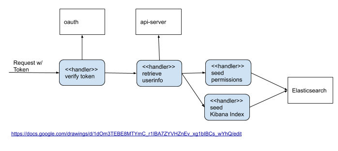

# cluster-logging-elasticsearch-proxy

## Release Signoff Checklist

- [ ] Enhancement is `implementable`
- [ ] Design details are appropriately documented from clear requirements
- [ ] Test plan is defined
- [ ] Graduation criteria for dev preview, tech preview, GA
- [ ] User-facing documentation is created in [openshift-docs](https://github.com/openshift/openshift-docs/)

## Summary

The `elasticsearch-proxy` is a component that fronts Elasticsearch
deployments for OpenShift Logging and is a replacement to the existing
plugin `openshift-elasticsearch-plugin`. It provides authentication
and authorization to control access to Elasticsearch.  Additionally,
it handles logic specific to OpenShift logging to control access to
stored data.  This is also the component that provides multi-tenancy
access for Kibana, which allows regular users to see logs only from
namespaces to which they belong, and allows admins to see logs from
all namespaces and infrastructure/system logs.

## Motivation

The primary motivation for migrating logic to a component external to
Elasticsearch deployments is to allow the development team to more
quickly adopt newer releases of Elasticsearch.  This migration is
proposed to coincide with forthcoming Elasticsearch v5 to v6 upgrade
work.  The proxy will interface to the Elasticsearch cluster via its
REST API which has shown to more stable then the plugin API.  The team
has completed two major upgrades and the
`openshift-elasticsearch-plugin` has shown to be specifically
challenging to move to later versions.  Moving the multi-tenant
functionality into the proxy and out of a plugin will additionally
allow us to take advantage of several other community plugins without
needing to modify them to our needs.

### Goals

The goals of this proposal are:

* Provide a functional, "drop-in" replacement to the `openshift-elasticsearch-plugin` that supports Elasticsearch v6
* Simplify the building and releasing of OpenShift Logging multi-tenant functionality

We will be successful when our regression tests confirm the `elasticsearch-proxy` provides the same functionality as `openshift-elasticsearch-plugin`

### Non-Goals

## Proposal

### Implementation Details

The basic design of the proxy is to utilize a chain-or-responsibility to isolate specific aspects of the workflow:

* Authorization and authentication - Utilize the bearer token provided with the request to ensure the request originates with a recognized OpenShift token
* User info - Fetch information about a user (e.g. name, roles) to allow dynamic generation of permissions in ElasticSearch
* Kibana Seeding - Populate a user's index to facilitate their ability to query logs

### Dependencies
* [opendistro-for-elasticsearch Security](https://github.com/opendistro-for-elasticsearch/security) - An opensource security plugin that provides RBAC for ElasticSearch

### Risks and Mitigations

The current risks to this proposal is that it relies upon `opendistro`
to control security.  `opendistro` is a derivative of
[SearchGuard](https://github.com/floragunncom/search-guard) whose
organization is currently in a legal dispute with Elastic.co.  There
are concerns this dispute could eventually affect `opendistro` which
would make this proposal in its current design unimplementable. There
are no other alternatives to `opendistro`.

We could mitigate this issue by:
* Introducing a log retrieval API to retrieve logs instead of relying upon Kibana and Elasticsearch query syntax
* Removing Kibana support for non-administration users

This would force users to utilize an API we control and allow us to restrict searches and results to project for which a user has access.  The existing design defers that logic to the ACL functionality provided by `opendistro`

## Design Details

### Test Plan

* Unit test coverage
* Regression test functionality versus Previous Releases
* Test a user's Kibana Index is upgraded with no loss of data

### Graduation Criteria

#### GA

GA release means there is no difference between the `elasticsearch-proxy` and `openshift-elasticsearch-plugin` from the perspective of a user of OpenShift Logging

- Full Regression testing

### Upgrade / Downgrade Strategy
* Upgrading will bring this component along with a new version of Elasticsearch for which it is designed to work
* Downgrading major versions of Elasticsearch is not supported.

### Version Skew Strategy

There should be no issues with Version Skew as it is deployed in conjunction with our upgraded Elasticsearch version.

## Implementation History

| release|Description|
|---|---|
| 4.3 | GA Release to support Elasticsearch v6.x

## Drawbacks

The drawback to not implementing this feature is we are unable to support migration to Elasticsearch 6.x and the current multi-tenant featurs of OpenShift Logging

## Alternatives

Alternatively we can spend more effort trying to migrate the existing plugin to v6

## Infrastructure Needed

* GitHub repository: https://github.com/openshift/elasticsearch-proxy
