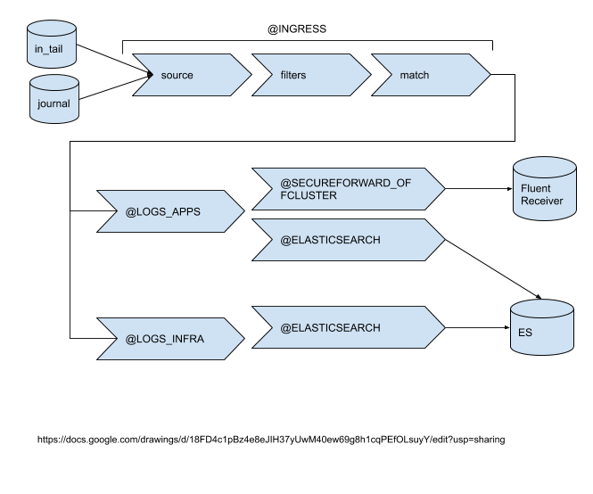

# cluster-logging-log-forwarding

## Release Signoff Checklist

- [ ] Enhancement is `implementable`
- [ ] Design details are appropriately documented from clear requirements
- [ ] Test plan is defined
- [ ] Graduation criteria for dev preview, tech preview, GA
- [ ] User-facing documentation is created in [openshift/docs]

## Summary

The purpose of log forwarding is to provide a declarative way by which adopters of cluster logging can ship
container and node logs to destinations that are not necessarily managed by the OKD cluster logging infrastructure.
Destinations are either on or off cluster endpoints such as the cluster logging provided Elasticsearch, an organization's Kafka message bus, or other log aggregation solutions (e.g. Splunk, Graylog).

## Motivation

Organizations desire to reuse their existing enterprise log solutions to store container logs.  Providing a declarative mechanism by which administrators define a log destination simplifies their operational burden.  They are able to take advantage of log collection infrastructure with minimal configuration changes. The cluster logging stack is able to deploy a collector to each OKD node that is configured with the necessary permissions to collect the logs, add container metadata (e.g. labels) and ship them to the specified endpoint.


### Goals
The specific goals of this proposal are:

* Provide an API that identifies log sources and their desired forwarding outputs.
* Send logs to an Elasticsearch cluster not managed by the cluster logging infrastructure
* Send logs to a fluentd instance not managed by the cluster logging infrastructure via fluentd's `forward` protocol
* Allow deployment of log forwarding without deploying the entirety of the cluster logging infrastructure (e.g. Kibana, Elasticsearch)
* Support TLS between the collector and destination if so configured
* Use the same log forwarding logic to write logs to a specified output or to the default storage managed by cluster logging (e.g. Elasticsearch).

We will be successful when:

* an administrator is able to deploy their own log aggregation service
* specifies this service in log forwarding configuration
* the service receives logs from a OKD cluster logging deployed collection agent  

### Non-Goals

* Log forwarding intends to be opinionated about the source of log messages; it will explicitly define what constitutes "application logs" or "infrastructure logs". 
It will not allow configuration of additional sources without further design considerations and how those sources may impact the collecting agent. Log forwarding is not 
intended to provide a complex routing solution as one might achieve by using a custom collector configuration or a messaging solution (e.g. kafka).
* It is not a goal for the tech-preview to support log forwarding outputs other then the ones identified for the goals. Admins can forward to their own fluentd via `forward` 
and then configure that fluentd to forward to any number of specific logstore outputs
* It is not a goal to provide secure storage for audit logs. If the deployer chooses to enable audit log forwarding, they need to make sure that the endpoint is compliant with governmental regulations and secure. The OpenShift logging Elasticsearch does not comply with those regulations.

## Proposal

Log forwarding will provide a declarative way to specify the outputs for specific types of logs using a 'pipeline'.  A 'pipeline' defines simple routing for one source to one or more outputs. The source of logs are opinionated and well defined by cluster logging. The initial source types are as follows:

* `logs.app` - Container logs generated by user applications running on the platform, excluding infrastructure container applications
* `logs.infra` - Logs generated by both infrastructure components running on the platform and OKD nodes (e.g. journal logs).  "Infra" applications are defined as any pods which run in namespaces: `openshift*`, `kube*`, `default`.
* `logs.audit` - Logs generated by the nodes' auditd (/var/log/audit/audit.log), audit logs from the kubeapi-server and the openshift-apiserver. This will not be forwarded by default.

Future types may be:
* `events.kubernetes` - Kubernetes events

There are no assumptions regarding whether or not an endpoint is deployed on or off cluster.  Endpoints off-cluster may require adminstrators to perform additional actions in order for logs to be forwarded (e.g. secret creation, opening port, enable global proxy configuration) 
Following is the list of supported endpoint types for this proposal:

* Elasticsearch (v6.x)
* Fluent `forward`

### User Stories

#### As an OKD admin, I want to deploy only a collector, and have it ship logs off-cluster to my own aggregation solution

This is a typical example of organizations that desires to re-use their existing enterprise log solution.  We will succeeded if we are able to write logs to their logging service.

#### As an OKD admin, I want to aggregate application logs on-cluster and infra logs off-cluster

This is an example of an OKD cluster hosting solution where several organizations are each provided with a dedicated cluster.  The organization requires access to application container logs but the host requires access to the infra structure logs.

#### As an OKD admin, I need to forward my audit logs to a secure SIEM that meets government regulations

This is often required for industries such as the US public sector, healthcare or financials. The logs will be forwarded to a government approved SIEM through secure means (mutual TLS).

### Implementation Details

#### Assumptions

* A pipeline shall support at least one output.
* A pipeline may support multiple outputs.
* Outputs that require secrets which are not created by the cluster-logging-operator shall be created and managed by the administrator of the endpoint
* Secrets shall have keys of: `tls.crt`, `tls.key`, `ca-bundler.crt` which point to the respective certificates for which they represent. Secrets shall have the key `shared_key` for use when using `forward` in a secure manner
* The operator will only support a single instance of log forwarding named `instance` for at least the tech preview release
* Log forwarding is enabled for tech preview when the instance of `clusterloggging` is annotated with: `clusterlogging.openshift.io/logforwardingtechpreview: enabled`

#### Security
* A pipeline may support TLS configuration by declaring a secret. Secrets must contain keys: `tls.crt`, `tls.key`, `ca-bundler.crt`
* The secret must exist in the `openshift-logging` namespace
* Endpoints defined without a secret will use unsecure communication and must explicitly declare `insecure: true` in the output specifification

#### Log Message Routing
* Undeclared source types (e.g. `logs.infra`) will be dropped if they are not defined in `spec.pipelines` entry
* Declared source types are routed to the specified output

For example, If you have specified a pipeline for `logs.app` sources, but did not specify one for `logs.infra`, then `logs.infra` will be dropped


### Risks and Mitigations

## Design Details

The `cluster-logging-operator` will use the forwarding API to generate a collector configuration and mount any secrets into the collector pod.

### API Specification
The log forwarding API:

```
apiVersion: "logging.openshift.io/v1alpha1"
kind: "LogForwarding"
spec:
  disableDefaultForwarding: true
  outputs:
   - type: “elasticsearch”
     name: elasticsearch
     endpoint: elasticsearch.svc.messaging.cluster.local
     secrets:
        name: elasticsearch
   - type: “forward”
     name: secureforward-offcluster
     endpoint: https://secureforward.offcluster.com:9200
     secrets:
        name: secureforward
   - type: “elasticsearch”
     name: elasticsearch-insecure
     endpoint: elasticsearch-insecure.svc.messaging.cluster.local
     insecure: true
  pipelines:
   - name: container-logs
     inputSource: logs.app
     outputRefs:
     - elasticsearch
     - secureforward-offcluster
   - name: infra-logs
     inputSource: logs.infra:
     outputRefs:
     - elasticsearch-insecure
   - name: audit-logs
     inputSource: logs.audit
     outputRefs:
     - secureforward-offcluster
```

The generated collector configuration is something like the following. **Note:** the source definitions from prior releases remain unchanged:

```
# source definitions
<source>
  @type tail
  @label @CONCAT
  <label @CONCAT>
    <filter kubernetes.**>
      @type concat
      key log
      partial_key logtag
      partial_value P
      separator \'\'
    </filter>
    <match kubernetes.**>
      @type relabel
      @label @INGRESS
    </match>
  </label>
</source>
 
# INGRESS
<label @INGRESS>
  ... #current @INGRESS config

    <match output_ops_tag journal.** system.var.log** mux.ops audit.log**   %OCP_FLUENTD_TAGS%>
      @type relabel
      @label @_LOGS_INFRA
    </match>
    <match kubernetes.**>
      @type relabel
      @label @_LOGS_APP
    </match>
</label>

<label @_LOGS_APP>
  <match **>
     @type copy
     <store>
        @type relabel
        @label @CONTAINER_LOGS
     </store>
  </match>
</label>

<label @_LOGS_INFRA>
  <match **>
     @type copy
     <store>
        @type relabel
        @label @INFRA_LOGS
     </store>
  </match>
</label>

# match outputs are generated based on defined pipeline endpoints
<label @CONTAINER_LOGS>
  <match **>
     @type copy
     #store section for each endpoint type
     <store>
       @type relabel
       @label @SECUREFORWARD_OFFCLUSTER
     </store>
     <store>
       @type relabel
       @label @ELASTICSEARCH
     </store>
 </match>
</label>

<label @CONTAINER_LOGS>
  <match **>
     @type copy
     #store section for each endpoint type
     <store>
       @type relabel
       @label @ELASTICSEARCH_INSECURE
     </store>
 </match>
</label>
 
#specific pipeline endpoint
<label @ELASTICSEARCH>
  <match retry_elasticsearch>
     @type copy
     <store>
       @type elasticsearch
       @id elasticsearch
       client_key /var/run/ocp-collector/secrets/elasticsearch/key
       client_cert /var/run/ocp-collector/secrets/elasticsearch/cert
       ca_file /var/run/ocp-collector/secrets/elasticsearch/cacert
       <buffer>
		@type file
		path '/var/lib/fluentd/elasticsearch'
       </buffer>
     </store>
  </match>
  <match **>
     @type copy
     <store>
       @type elasticsearch
       @id elasticsearch
       client_key /var/run/ocp-collector/secrets/elasticsearch/key
       client_cert /var/run/ocp-collector/secrets/elasticsearch/cert
       ca_file /var/run/ocp-collector/secrets/elasticsearch/cacert
       retry_tag "retry_elasticsearch"
     </store>
 </match>
</label>
<label @SECUREFORWARD_OFFCLUSTER>
   ...
</label>
```

Following is a diagram which identifies the workflow of a message through fluentd as captured by the above configuration.



### Cluster Logging Operator
* The operator generates output configuration for the collector
* The operator specifies in the collector daemonset the secrets needed to communicate to each endpoint:

   `/var/run/ocp-collector/secrets/<secretName>/{tls.crt,tls.key,ca-bundle.crt}`

    where:

    * `secretName` is the name of a secret in the `openshift-logging` namespace.
    * `tls.crt`, `tls.key`, `ca-bundle.crt` are files in the secret


#### Collector
* The collectors will be modified to be remove endpoint config specific logic from the start script ; configuration is assumed to be correct and used as provided by the `cluster-logging-operator`
* Extract all configuration into the collector configuration.
* Extract the `run.sh` script from the collector image and mount into the deployed pod

### Test Plan
#### Unit testing
* Log forwarding will add unit tests to provide adequate coverage for all changes
* BDD unit testing will be added to unit testing to make tests goals more explicit,  readable, and obvious
#### Integration and E2E tests
* Test no regressions after upgrade when log forwarding exists
* Tests to verify there are no regressions in functionality between pre and post logforwarding feature
* Tests to verify log forwarding is writing logs to an Elasticsearch instance not managed by cluster logging
* Tests to verify log forwarding is writing logs to an Elasticsearch instance managed by cluster logging
* Tests to verify log forwarding is writing logs to a Fluentd instance via `forward` that is not managed by cluster logging

### Graduation Criteria

##### Tech Preview

* Log forwarding is only enabled when annotated with: `clusterlogging.openshift.io/logforwardingtechpreview: enabled`
* Ability to store logs to the cluster managed log aggregator without defining log forwarding (e.g. status quo)
* Explicitly define and document log sources and their meanings (e.g. `logs.apps`, `logs.infra`)
* Explicitly define supported outputs (e.g. `elasticsearch`, `fluentd`)
- End user documentation, relative API stability
- Sufficient test coverage
- Gather feedback from users rather than just developers

##### Tech Preview -> GA 

- More testing (upgrade, downgrade, scale)
- Sufficient time for feedback
- Available by default without tech preview annotation
- Concrete API
- Additional supported outputs (e.g. `Splunk`, `Graylog`, `kafka`)
- Support for SRE usecase: As an administrator of a dedicated cluster, I need to allow dedicated-admins to configure the destination of container logs (logs.apps) separately from infra logs so they are prevented from modifying where infra logs (logs.infra) are forwarded
- Modify API to support: include and exclude of logs

### Upgrade / Downgrade Strategy

#### Upgrade
Upgrades should be seamless to users of cluster logging deployments managed by the `cluster-logging-operator`.  Admins who make no changes will see no difference after upgrade when this feature is deployed.

Upon upgrade, the `cluster-logging-operator` will continue to route `logs.infra` and `logs.app` logs to the internal logstore if:

* `spec.logstore` is defined


The `cluster-logging-operator` will honor the `LogForwarding` resource named `instance` if it exists and the `ClusterLogging` resource named `instance` is properly annotated.


#### Downgrade
Downgrades should be discouraged unless we know for certain the Elasticsearch version managed by cluster logging is the same version.  There is risk that Elasticsearch may have migrated data that is unreadable by an older version.


### Version Skew Strategy

Version skew is not relevant to cluster logging because it is deployed as an OLM managed operator.  Component versions are set in a versioned operator deployment.

## Implementation History

| release|Description|
|---|---|
|4.3| **Tech Preview** - Initial release supporting `Elasticsearch` and Fluentd `forward` 

## Drawbacks
Drawbacks to providing this enhancement are:
* Increased exposure to issues being raised by customers for things outside the control of the cluster logging team
  * What happens when the customer managed endpoint is down?  How well does the collector handle the back pressure? When do logs get dropped because they can not be shipped
* Setting customer expectations of the capabilities of log forwarding and guarantees (e.g. rates, delivery, reliability, message loss)

## Alternatives

Provide a recipe for customer's to deploy their own log collector to move the responsibility to the customer.

## Infrastructure Needed
* Future target endpoints may require special infrastructure or licencing to properly test.  For example, Splunk is destination requested by many users but is a licensed product.  The free dev tier may not provide sufficient capacity to fully test
