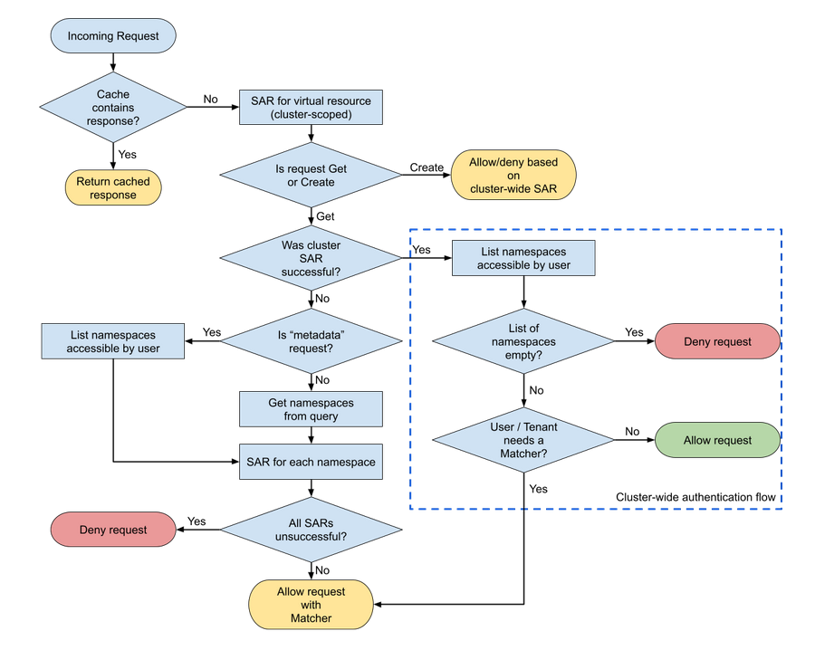

# Openshift Logging: Fine grained access to logs

## Summary

This enhancement proposal seeks to outline the solution for a more fine grained access to LokiStack logs on OpenShift Container Platform 4, ie, have the ability as the cluster administrator to grant access to logs on a namespace basis.

The proposal provides an overview of the changes required to achieve this goal as well as some implementation details.

## Motivation

In enterprise environments, where OpenShift is used across different legal entities, it's common to have central teams that support the application teams in the respective entities. Support teams are granted access to view kubernetes resources, however, as some applications may log sensitive data, support teams should not have access to logs by default.

Currently, access to logs in LokiStack is granted when a user has access to the given namespace or when the user is part of a specific cluster-admin Group. And even though OpenShift Container Platform 4 does allow to configure RBAC to address this issue, LokiStack does not, and therefore grants access to logs to people that should not see them.

This enhancement proposal presents a solution that enables cluster admins to have a more fine grained control over who accesses what logs.

### User Stories

* As a cluster admin, I want to deny a user from viewing logs from pods in a namespace in which they have access. This is mostly for legal reason.

* As a cluster admin, I want to deny a user with cluster admin like privileges access to application logs, on a namespace basis or cluster wide. This is done due to legal and data protection constrains.

### Goals

* Cluster admins can grant and revoke access of the workload logs of specific namespaces to users.
* Cluster admins can grant and revoke access of the workload logs of specific namespaces to users with elevated privileges.
* Access should be managed using OpenShift RBAC in order to be consistent with how permissions are managed elsewhere.

### Non-Goals

* Prevent users with elevated privileges from escalating their privileges to access application logs that they are not supposed to have access to. 

## Assumptions

This proposal assumes that the existing virtual resource `logs` (API group `loki.grafana.com`) is extended to be used on a namespace basis. This would be achieved by implementing a new authorization workflow for requests in `opa-openshift`, by using namespaced `SubjectAccessReview` (SAR) API calls.

Here's what the new authorization workflow would look like:




## Proposal

Use the `ClusterLogging` custom resource definition managed by the Cluster Logging Operator to enable/disable the fine grained access to logs for the LokiStack logstore. This will be achieved by adding a new field to the CRD called `advancedLogsAccess`. This new field is a boolean with a default value of false.

* Using the new SAR implementation, we can simply use RBAC configurations to achieve our goals:

  1. For the first use case, where we have non-admin users, the proposed solution is to create a group for application log readers called `log-reader-group`, and grant this group the ability to read application logs by binding it to the existing ClusterRole `logging-application-logs-reader`. The cluster admin can then either add a user to the `log-reader-group` thus granting access to application logs on all namespace where they have access, or create a role binding to the user on each namespace they want to grant access to logs on.

  2. For the second use case, where we have users with admin like privileges, the proposed solution is to create a new group called `restricted-cluster-admin-group`. This group has all the permissions a cluster admin has, except for application logs. We can then grant this group access to application logs on specific namespace by binding it to `logging-application-logs-reader` on the desired namespace. 

### Workflow Description

1. The cluster administrator enables fine grained logs access in the `ClusterLogging` resource:

```yaml
apiVersion: logging.openshift.io/v1
kind: ClusterLogging
metadata:
  name: instance
  namespace: openshift-logging
spec:
  logStore:
    type: lokistack
    lokistack:
      name: lokistack-dev
      advancedLogsAccess: true
  ...
```

2. The Cluster Logging Operator (CLO) deletes the `logging-all-authenticated-application-logs-reader` ClusterRoleBinding. This binding allows all authenticated users to see application logs in namespace where they have access.

3. The CLO then creates a new empty group `log-reader-group` and binds it to `logging-application-logs-reader`:

```yaml
apiVersion: user.openshift.io/v1
kind: Group
metadata:
  name: log-reader-group
users:
```
The group contains no users. The cluster admin can then add users to the group by editing it manually.

```yaml
apiVersion: rbac.authorization.k8s.io/v1
kind: ClusterRoleBinding
metadata:
  name: logging-application-logs-reader-binding
roleRef:
  apiGroup: rbac.authorization.k8s.io
  kind: ClusterRole
  name: logging-application-logs-reader
subjects:
- kind: Group
  name: log-reader-group
  apiGroup: rbac.authorization.k8s.io
```

4. The operator also creates a new ClusterRole called `restricted-cluster-admin` and binds it to a new group `restricted-cluster-admin-group`. `restricted-cluster-admin` grants access to all api objects except for logs:

```yaml
kind: ClusterRole
apiVersion: rbac.authorization.k8s.io/v1
metadata:
  name: restricted-cluster-admin
rules:
- apiGroups:
  - ''
  - 'admissionregistration.k8s.io/v1'
  - 'apiextensions.k8s.io/v1'
  - 'apiregistration.k8s.io/v1'
  - 'apiserver.openshift.io/v1'
  - 'apps.openshift.io/v1'
  - 'authentication.k8s.io/v1'
  - 'authorization.k8s.io/v1'
  - ...
  resources:
  - '*'
  verbs:
  - '*'
```

```yaml
apiVersion: user.openshift.io/v1
kind: Group
metadata:
  name: restricted-cluster-admin-group
users:
```
The group contains no users. The cluster admin can then add users to the group by editing it manually.

```yaml
apiVersion: rbac.authorization.k8s.io/v1
kind: ClusterRoleBinding
metadata:
  name: restricted-cluster-admin-binding
roleRef:
  apiGroup: rbac.authorization.k8s.io
  kind: ClusterRole
  name: restricted-cluster-admin
subjects:
- kind: Group
  name: restricted-cluster-admin-group
  apiGroup: rbac.authorization.k8s.io
```

Now the cluster admin can allow access to specific namespaces to the `restricted-cluster-admin-group` (or to a specific user in the group) by creating a RoleBinding with the `logging-application-logs-reader`, e.g.
```yaml
apiVersion: rbac.authorization.k8s.io/v1
kind: RoleBinding
metadata:
  name: special-perm-restricted-cluster-admin-binding
  namespace: desired-namespace
roleRef:
  apiGroup: rbac.authorization.k8s.io
  kind: ClusterRole
  name: logging-application-logs-reader
subjects:
- kind: Group # or User
  name: restricted-cluster-admin-group # or the User's name
  apiGroup: rbac.authorization.k8s.io
```

All of the RBAC resources created will not be managed by the operator, as they are created for user convenience only. Further RBAC configuration can be used by the admin.
This will also allow the cluster admins to have control over how and when they are used. 

### API Extensions

We will be modifying the `ClusterLogging` CRD managed by the Cluster Logging Operator by adding a new field to the CRD called `advancedLogsAccess`. This new field is a boolean with a default value of false.
This new field will be used to enable/disable the fine grained access to logs for the LokiStack logstore.

### Implementation Details/Notes/Constraints 

Here's the modification for the `ClusterLogging` CRD:

```go
// LokiStackStoreSpec is used to set up cluster-logging to use a LokiStack as logging storage.
// It points to an existing LokiStack in the same namespace.
type LokiStackStoreSpec struct {
	// Name of the LokiStack resource.
	//
	// +required
	Name string `json:"name"`

	// Enable fine grained control over access to logs.
	//
	// +nullable
	// +optional
	AdvancedLogsAccess bool `json:"advancedLogsAccess"`
}
```

Here's an example of a `ClusterLogging` definition with advanced logs access enabled:

```yaml
apiVersion: logging.openshift.io/v1
kind: ClusterLogging
metadata:
  name: instance
  namespace: openshift-logging
spec:
  managementState: Managed
  logStore:
    type: lokistack
    lokistack:
      name: lokistack-dev
      advancedLogsAccess: true
  collection:
    type: vector
```

### Risks and Mitigations

- Privilege escalation, ie, a restricted cluster admin being able to grant themselves the ability to access logs they should not be able to access via an RBAC modification, is something cluster admins should be aware of and manage themselves.

Other risks TBD.

### Drawbacks

This proposition assumes that once the advanced logs access is enabled and RBAC resources are created by the operator, the resources are no longer managed by the operator. This means that the remaining responsibilities, such as keeping the list of rules in `restricted-cluster-admin` up to date, will fall onto the cluster admins.

Other drawbacks TBD.


## Design Details

### Open Questions

1. When the advanced logs access is enabled and then disabled, should the operator clean up the RBAC resources or should that be the responsibility of the cluster admin.


## Alternatives

* The operator doesn't create the RBAC resources listed above, and instead just deletes the `logging-all-authenticated-application-logs-reader` ClusterRoleBinding. Then the admin has the responsibility of creating the necessary RBAC resources in order to properly configure access to logs.
