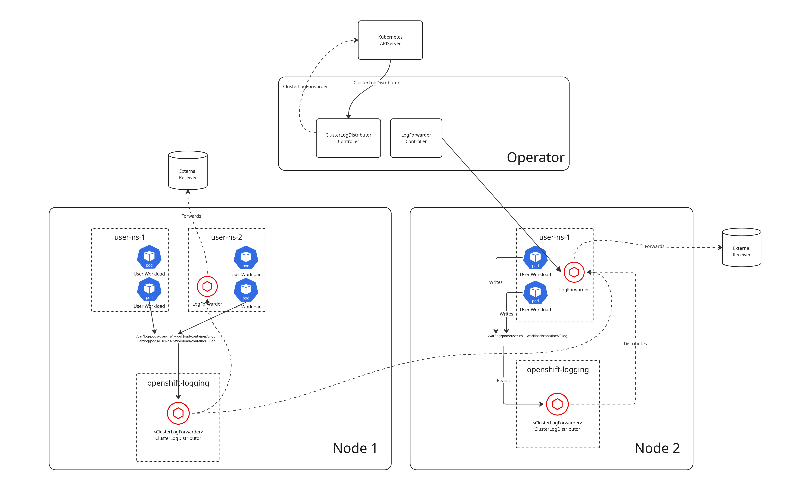

# Namespaced Log Collection and Forwarding

## Summary

This enhancement proposes introducing log collection and forwarding administration at the namespace level so project administrators do not need cluster level permissions and minimal engagement with cluster administrators.


## Motivation

OpenShift has evolved to offer cluster deployments with alternate models (i.e. HCP) that separate responsibilities to varying levels of administration. Additionally, we support customers who resell OpenShift as a service and manage namespaces as a completely multi-tenant offering.  These scenarios will benefit from a solution that allows project administrators to manage their own log collection and forwarding configurations with reduced engagement with cluster administrators.


### User Stories


* As a project administrator, I want to configure log collection and forwarding without the need for cluster level permissions, so that I am not dependent upon a cluster administrator
* As a project administrator, I want log collection workloads to not disrupt my other project workloads if log collection has issues
* As a project administrator, I want log forwarding workloads to be limited to the set of nodes where my project workloads are deployed
* As a cluster administrator, I want log collection from individual namespaces to be isolated from other namespaces, so I am confident I am meeting multi-tenant security requirements 


### Goals
* A comparable API to ClusterLogForwarder that isolates log forwarding workload deployments to individual namespaces
* Secure collection of logs isolated by namespace down to the node level
* Administrative control at the namespace level that is not dependent upon cluster level permissions
* Log collection workloads that are independent of user workloads


### Non-Goals
* Event collection and forwarding
* Guaranteed log collection with no logs lost
* Replacement of **ClusterLogForwarder**
* Additional metrics and alerts to the cluster metrics service


## Proposal

This enhancement proposes to:

* Introduce a namespaced **LogForwarder** API that is administered by the project administrator
* Introduce a **ClusterLogDistributor** API that is administered by a cluster administrator that deploys a service to collect and forward logs to namespaced **LogForwarders**
* Deploy a receiver and log forwarder as a deployment, with supporting resources, to satisfy the **LogForwarder** specification.
* Deploy a **ClusterLogForwarder** to satisfy the **ClusterLogDistributor** specifications
* Define a ruleset which matches **LogForwarders** with **ClusterLogDistributors**

# Workflow Description

* The **operator** is the workload that manages log collection agents spec'd by **ClusterLogDistributors** and log forwarding agents spec'd by **LogForwarders**
* **Cluster administrator** is a human responsible for administering the operator which deploys log collection agents
* **Project administrator** is a human responsible for administering **LogForwarders** for their namespace

1. The cluster administrator deploys the operator to monitor all namespaces if it is not already deployed
1. The cluster administrator creates **ClusterLogDistributors** to service **LogForwarders**
1. The operator creates a **ClusterLogForwarder** for each **ClusterLogDistributor**
1. The operator deploys log collection agents for each **ClusterLogForwarder**
1. The project administrator creates output secrets to allow log forwarders to forward logs to the spec'd outputs
1. The project administrator creates a **LogForwarder** to receive user workloads logs from an assigned **ClusterLogDistributor**
1. The operator assigns a **ClusterLogDistributor** to service one or more **LogForwarder**s
1. The operator deploys a log receiver and forwarder according to the **LogForwarder** spec
1. The operator updates the configuration of **ClusterLogForwarder** for each **ClusterLogDistributor** to collect and distribute logs to **LogForwarders**


### API Extensions

This proposal adds new custom resources:

```yaml
apiVersion: "observability.openshift.io/v1beta1"
kind: ClusterLogDistributor
spec:
  managementState:          # enum: Managed,Unmanaged
  collector:                # optional
    resources:              # optional: corev1.ResourceRequirements
    networkPolicy:          # optional: obsv1.NetworkPolicy
    tolerations:
    nodeSelector:
  priority:                 # the priority of this distributor in relation to others. larger is higher priority
  collectionPolicy:
    container:              # only collects container logs
      namespaceMatchLabels: # map[string]string namespace labels to evaluate when collecting logs
      includes:             # optional array of namespace/container specs to include that support wild cards 
      - namespace:
        container:
      excludes:             # optional array of namespace/container specs to exclude that support wild cards
      - namespace:
        container:
```

```yaml
apiVersion: "observability.openshift.io/v1beta1"
kind: LogForwarder
spec:
  forwarder:              # optional: obsv1.CollectorSpec
    resources:            # optional: corev1.ResourceRequirements
    networkPolicy:        # optional: obsv1.NetworkPolicy
  input:
    collectionPolicy:     # optional
      distributionClass:  # string: additional info to consider when evaluating ClusterLogDistributors
    container:            # optional: Unless otherwise defined collect all container logs
      selector:           # optional: metav1.LabelSelector
      includes: []        # optional: containers to include. supports wild cards
      excludes: []        # optional: containers to exclude. supports wild cards
  outputs: []             # obsv1.OutputSpec
  serviceAccount:         # optional: the name of the service account to use
    name:
```

### Topology Considerations


#### Hypershift / Hosted Control Planes


Realization of this design may facilitate HCP use of Red Hat provided log collection and forwarding.  HCP has expressed the requirement to restrict log collection workloads to nodes which are hosting specific workloads.  The current architecture relies upon daemonsets which can result in deploying collectors which are doing no work.  This design may additionally allow delegating log forwarding to guest cluster administrators and minimizing HCP service level administrator responsibilities.


#### Standalone Clusters


#### Single-node Deployments or MicroShift


### Implementation Details/Notes/Constraints

* The operator uses the **ClusterLogDistributor** spec to create a **ClusterLogForwarder** dedicated to collecting logs and forwarding them to receivers created when a project administrator defines a **LogForwarder**.
* A **ClusterLogDistributor** services **LogForwarders** that match its collection policy
* A **ClusterLogDistributor** is configured with a dedicated set of source,transforms, and sink for each **LogForwarder** it services   
* One forwarder pod is deployed to each project namespace where the user's workload is also deployed.  Namespace administrators manage log forwarding resources without needing additional permissions. 
* Logs events processed by this design distribute and forward logs encoded to adhere to OTEL

This design eliminates fair share concerns that exist with **ClusterLogForwarders** by introducing dedicated sources, transforms and sinks to each **LogForwarder**. It separates the log collection and forwarding workload from the user workloads so that misconfiguration and resource allocations do not affect the user workloads.  The challenges with this design will be to ensure **ClusterLogDistributors** are properly resourced and that monitoring and alerting exists for administrators to realize when the deployment needs attention. 

An general overview of the components involved and the final deployment are shown below:



### Risks and Mitigations

The primary risk this design introduces is the separation of responsibilities for log collection and forwarding. Currently, a cluster administrator is responsible for defining which sources are collected, how they are transformed, and where they are forwarded.  This design separates those responsibilities by allowing the project administrator to define the destination for logs but delegates the collection to a central distributor.  It is possible that if the central distributor becomes misconfigured that it distributes logs from one namespace to the forwarder in another.  This is a potential security issue if the cluster is being utilized for truly independent multi-tenant business units.

This risk can be mitigated in several ways:

* Adding config to **LogForwarders** that drops logs which do not match its namespace
* Documentation to describe how **LogForwarders** are matched to **ClusterLogDistributors** so cluster administrators can devise a satisfactory deployment topology
* Certificates?? Request Parameter?


### Drawbacks

The drawback to this design is that project administrators do not have autonomous control over their log collection and forwarding needs.  They are dependent on a cluster service that needs to be highly available.

## Alternatives (Not Implemented)

### API-server Option

### Side-Car Option
Monitor the pods in the same namespace as the LogForwarder and inject a container to collect logs for the pod's containers.
This option negates both the concerns of fair share and scheduling on the same node as the deployment because it would be deployed as part of the user workload.  The primary reasons to avoid this solution are any need to update the configuration that requires a restart, any misconfiguration or under resourcing of the collector container which could cause it to error or be killed by the scheduler also could affect the workload whose logs are being collected.  This solution has the 
potential of adding a significant number of containers to the cluster for the sole purpose of log collection.


## Open Questions [optional]


* Do we only offer the OTEL data model and if so, should we consider using the otelcollector in lieu of vector?
  * At a minimum the OTEL data model will be utilized.  OTEL collector should be considered though it will require more implementation work since we have to create the config generator.
* Does it make sense to distribute an alternate compilation, distribution, and operator package (i.e. log-forwarder-operator) of the cluster-logging-operator?
* How do we provide useful collector metrics?
  * The only solution is to deploy user metrics and distribute dashboards and alerts for integration.  This may be an opportunity to "promote" adoption of other parts of the Red Hat observability stack.
* How do we handle bad configs/reloads/alerting/status?
* Where does buffering and tuning fit into this model? Buffer at CLD? LF?
  * Consider adding feature for **LogForwarders** to spec buffering.
* Do we need to add restrictions to forwarding to LokiStack or internal lokistack?
  * Writing to inernal LokiStack requires explicit 'write' permissions.  This means we can defer to
  the cluster administrator to enforce by using RBAC


## Test Plan


## Graduation Criteria

### Dev Preview -> Tech Preview

### Tech Preview -> GA

### Removing a deprecated feature

## Upgrade / Downgrade Strategy

## Version Skew Strategy

## Operational Aspects of API Extensions

## Support Procedures

## Infrastructure Needed [optional]
