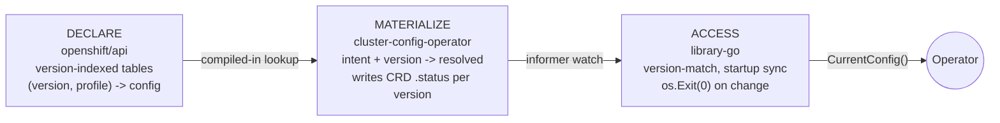

# Versioned Config Access

## Summary

OpenShift has multiple configuration domains where the platform must resolve
intent-based administrator choices into concrete values that differ by cluster
version: feature gates, TLS security profiles, and PKI certificate profiles.
Each domain needs the same three capabilities: version-indexed declaration,
CRD-status materialization, and a library-go accessor with startup
synchronization and change notification. Today only feature gates implement
the full pattern; TLS profiles use a static Go map with no version indexing,
and PKI profiles have a CRD but no status subresource or accessor.

This enhancement extracts the common three-layer pattern into a generic
`VersionedConfigAccess[T]` interface in library-go. The result is shared
infrastructure (~150 lines) that gives every version-sensitive configuration
domain consistent startup synchronization, version-match resolution, and
change detection.

## Motivation

Three configuration domains in OpenShift share the same fundamental problem:
an administrator selects an intent-based profile (a FeatureSet, a TLS profile
type, or a PKI management mode), and the platform must resolve that intent into
concrete configuration values appropriate for the cluster's current version.
Each domain needs the same three capabilities:

1. **Declare** version-indexed defaults compiled into openshift/api
2. **Materialize** resolved configuration into CRD status so operators can observe it
3. **Access** the resolved configuration in library-go with startup sync and change notification

Feature gates already implement all three layers. The `FeatureGateAccess`
interface in library-go provides startup synchronization via
`InitialFeatureGatesObserved()`, current-value retrieval via
`CurrentFeatureGates()`, and change handling (defaulting to `os.Exit(0)`) via
`SetChangeHandler`. The FeatureGate CRD status contains version-indexed
entries (`[]FeatureGateDetails` keyed by `version`), and the
cluster-config-operator materializes these from the compiled-in declaration
tables in `features/features.go`.

TLS profiles lack all three layers. The `var TLSProfiles` map in
`config/v1/types_tlssecurityprofile.go` is a static, unversioned lookup table.
When cipher suites need to change across OCP versions (for example, adding
post-quantum groups like X25519MLKEM768), the only option is to modify the
compiled-in map for all versions simultaneously. There is no CRD status showing
what "Intermediate" resolves to on a given cluster, no version-indexed table,
and no accessor in library-go.

PKI profiles are partway there. The `PKI` CRD in `config/v1alpha1/types_pki.go`
has a spec with management modes (Unmanaged, Default, Custom), but no status
subresource with version-indexed resolved profiles, no accessor in library-go,
and operators must implement their own pull-based configuration resolution with
no startup synchronization guarantees.

Each domain independently reinvents or fails to implement the same three-layer
pattern. This enhancement unifies the infrastructure so that existing and future
domains get version resolution, startup sync, and change detection for free.

Beyond consistency, the materialize/access pattern eliminates a coordination
bottleneck: **operators no longer need to revendor openshift/api to pick up
changed defaults.** Today, when the static `var TLSProfiles` map changes in
openshift/api, every operator that vendors openshift/api must be bumped to
compile in the new values. With this pattern, only cluster-config-operator
revendors openshift/api (it runs the materializer); all other operators receive
the updated values at runtime through their informer watch on CRD status. A
cipher suite change that previously required coordinated bumps across dozens
of repositories becomes a single PR to openshift/api plus a cluster-config-operator
revendor.

### User Stories

* As a platform developer adding a new version-sensitive configuration domain,
  I want to use a standard generic accessor from library-go, so that I get
  startup synchronization, version-match resolution, and change notification
  without reimplementing the pattern from scratch.

* As a platform developer maintaining an operator that consumes version-sensitive
  configuration, I want a consistent interface across all configuration domains,
  so that I do not need to learn a different startup and change-notification
  pattern for each domain.

* As an SRE investigating an issue during a version-skewed upgrade, I want both
  the old and new operator versions to find their respective configuration
  entries in CRD status, so that operators at different versions do not conflict
  or use incorrect configuration values during the upgrade window.

### Goals

1. Provide a generic `VersionedConfigAccess[T]` interface in library-go that
   handles version-match resolution, startup synchronization, and change
   notification for any type `T`.
2. Define the three-layer pattern (declare/materialize/access) as a standard
   recipe that any version-sensitive configuration domain can follow.
3. Provide a `NewHardcodedConfigAccess[T]` constructor for unit tests and
   components that do not run in a cluster.
4. Document sparse version tables with floor-based lookup so that domain
   implementers understand how the materializer resolves versions.

### Non-Goals

1. Implementing any specific domain mapping (feature gates, TLS, PKI) in this
   enhancement. Each domain is covered by its own enhancement:
   - [FeatureGate Versioned Config](featuregate-versioned-config.md)
   - [TLS Versioned Config](tls-versioned-config.md)
   - [PKI Versioned Config](pki-versioned-config.md)
2. Introducing a new shared "ClusterDefaults" CRD. Each domain keeps its own
   CRD boundary.
3. Changing any admin-facing API for selecting profiles. This enhancement is
   about the resolution and delivery mechanism, not the selection API.
4. Modifying MicroShift. MicroShift does not use `FeatureGateAccess` or
   library-go operator patterns and is out of scope.

## Proposal

This proposal introduces a three-layer pattern for version-sensitive
configuration and extracts it into shared library-go infrastructure. The core
insight is that **profile selection happens at materialization time, not access
time.** The CRD status contains only the resolved configuration for the
cluster's chosen profile, indexed by version. The accessor's job is narrow:
find the entry matching the operator's version, cache it, and notify on changes.



Planned consumers of this framework are documented in separate enhancements:

- **Feature gates** (refactor onto the generic):
  [FeatureGate Versioned Config](featuregate-versioned-config.md)
- **TLS profiles** (new version-indexed profiles):
  [TLS Versioned Config](tls-versioned-config.md)
- **PKI profiles** (new version-indexed profiles):
  [PKI Versioned Config](pki-versioned-config.md)

### Workflow Description

**platform developer** is an OpenShift engineer integrating a version-sensitive
configuration domain.

**cluster-config-operator** is the controller responsible for materializing
resolved configuration into CRD status.

**consuming operator** is any OpenShift operator that needs version-resolved
configuration at startup.

#### Adding a New Version-Sensitive Domain

1. The platform developer defines a version-indexed declaration table in
   openshift/api, mapping `(version, profile)` pairs to resolved configuration
   values of type `T`.
2. The platform developer adds a materializer controller (~100 lines) to
   cluster-config-operator that reads the CRD spec (the admin's intent), looks
   up the declaration table, and writes resolved entries into CRD status keyed
   by version.
3. The platform developer defines a domain-specific wrapper type (e.g.,
   `TLSProfileAccess`) that instantiates `VersionedConfigAccess[T]` with the
   appropriate `StatusExtractor[T]` and `EqualityFunc[T]`.
4. Consuming operators instantiate the wrapper, call `Run(ctx)`, wait on
   `InitialConfigObserved()`, then call `CurrentConfig()` to get the resolved
   value. Changes trigger the change handler (default: `os.Exit(0)`).

#### Version Skew During Upgrade

1. A cluster begins upgrading from version N to N+1. The CRD status contains
   entries for both versions.
2. An operator still running at version N finds its entry and uses the
   configuration appropriate for N.
3. A newly rolled-out operator at version N+1 finds its entry and uses the
   configuration appropriate for N+1.
4. Both operators function correctly with their version-appropriate
   configuration throughout the upgrade window.
5. After all operators converge on N+1, the N entry is eventually pruned
   from status.

### API Extensions

This enhancement adds no API extensions. It is purely a library-go
infrastructure package. Domain-specific CRD status changes are documented in
the respective domain enhancements
([TLS](tls-versioned-config.md), [PKI](pki-versioned-config.md)).

### Topology Considerations

#### Hypershift / Hosted Control Planes

In Hypershift, control plane components run in the management cluster at a
potentially different version than data plane components in the guest cluster.
The version-indexed status model handles this naturally:

- **Management cluster operators** read entries matching the hosted control
  plane version from the management cluster's CRD status.
- **Guest cluster operators** read entries matching the guest cluster version
  from the guest cluster's CRD status.
- Each cluster materializes its own status independently, so version skew
  between management and guest clusters does not cause conflicts.

The accessor's `desiredVersion` parameter handles this: each operator provides
its own version, and the accessor finds the matching entry. This is exactly how
`FeatureGateAccess` works in Hypershift today.

#### Standalone Clusters

Fully applicable. Standalone clusters are the primary deployment model for this
enhancement.

#### Single-node Deployments or MicroShift

**SNO**: No additional resource consumption beyond a standard cluster. The
accessor watches existing CRD informers that are already running. No new
controllers are deployed to the node; the materializer runs in
cluster-config-operator which is already present.

**MicroShift**: Out of scope. MicroShift does not use `FeatureGateAccess` or
the library-go operator framework. MicroShift components that need
version-specific configuration handle it through their own mechanisms.

### Implementation Details/Notes/Constraints

#### Generic Interface

The core of this enhancement is a generic accessor interface in library-go,
parameterized by the resolved configuration type `T`:

```go
package versionedconfig

// VersionedConfigAccess provides version-matched, change-notifying access
// to a configuration value of type T that is stored as version-indexed
// entries in a CRD status.
type VersionedConfigAccess[T any] interface {
    // SetChangeHandler sets the function called when the resolved config
    // changes. Must be called before Run. The default handler calls
    // os.Exit(0), which causes the operator to restart and pick up the
    // new configuration. On the first observation, the change handler is
    // called with the zero value of T as the previous value.
    SetChangeHandler(fn func(previous, current T))

    // Run starts watching the CRD informer for changes. Blocks until ctx
    // is cancelled.
    Run(ctx context.Context)

    // InitialConfigObserved returns a channel that is closed once the
    // version-matched configuration has been observed for the first time.
    InitialConfigObserved() <-chan struct{}

    // AreInitialConfigObserved returns true if the initial config has been
    // observed.
    AreInitialConfigObserved() bool

    // CurrentConfig returns the current version-matched configuration.
    // Returns an error if the config has not yet been observed.
    CurrentConfig() (T, error)
}
```

Supporting types:

```go
// VersionedEntry pairs a version string with a configuration value.
type VersionedEntry[T any] struct {
    Version string
    Config  T
}

// StatusExtractor extracts version-indexed entries from a CRD object.
// Each domain provides its own extractor that knows how to read its
// CRD status shape.
type StatusExtractor[T any] func(obj runtime.Object) ([]VersionedEntry[T], error)

// EqualityFunc compares two configuration values for equality.
// Used to determine whether a change handler should fire.
type EqualityFunc[T any] func(a, b T) bool
```

Constructor:

```go
// NewVersionedConfigAccess creates a new accessor. Parameters:
//   - desiredVersion: the version this operator wants (from ClusterOperator status)
//   - missingVersionMarker: stub version; if equal to desiredVersion, the
//     accessor derives the best version from ClusterVersion status
//   - clusterVersionInformer: used to derive version when desiredVersion equals
//     missingVersionMarker
//   - configInformer: the informer for the CRD containing version-indexed status
//   - resourceName: the name of the CRD singleton (typically "cluster")
//   - extract: domain-specific function to read version-indexed entries from status
//   - equal: domain-specific equality comparison
//   - recorder: event recorder for observability
func NewVersionedConfigAccess[T any](
    desiredVersion, missingVersionMarker string,
    clusterVersionInformer, configInformer cache.SharedIndexInformer,
    resourceName string,
    extract StatusExtractor[T],
    equal EqualityFunc[T],
    recorder events.Recorder,
) VersionedConfigAccess[T]

// NewHardcodedConfigAccess returns a VersionedConfigAccess that always
// returns the given config value. Useful for unit tests and components
// that do not run in a cluster (e.g., the installer).
func NewHardcodedConfigAccess[T any](config T) VersionedConfigAccess[T]
```

#### Why T Is Data, Not a Query Interface

`T` is a plain data type, not a query interface. Each domain adds its own query
semantics on top. For feature gates, the `FeatureGate` interface provides
methods like `Enabled(name)` with panic-on-unknown semantics. For PKI, a
`ResolveCertificateConfig` chain resolves category overrides. For TLS,
consumers apply OpenSSL-to-IANA cipher name conversion after reading the
resolved profile data.

This separation keeps the generic accessor simple (it only needs to compare and
cache `T` values) while allowing each domain to layer rich query semantics on
top without polluting the shared interface.

#### Version Resolution Details

The accessor implements the same version-matching logic currently in
`featuresFromFeatureGate`: iterate over status entries, find the one whose
`Version` matches the operator's `desiredVersion`, return it. If no exact match
exists, return an error (the operator will retry; the materializer has not yet
written the entry for this version).

When `desiredVersion == missingVersionMarker` (a common case during initial
operator startup before the operator knows its version), the accessor derives
the version from `ClusterVersion.status.desired.version` or the most recent
history entry, exactly as the current `FeatureGateAccess` implementation does
in `syncHandler`.

#### Sparse Version Tables and Floor-Based Lookup

Not every version needs an entry in the declaration table. The materializer
uses floor-based resolution: for a requested version `V`, it finds the highest
`MinVersion` entry that is less than or equal to `V`. This means that if a
domain's configuration changes in 4.22, only a `MinVersion: "4.22"` entry is
needed; all versions from 4.18 through 4.21 automatically resolve to the 4.18
entry.

This is a property of the **materializer**, not the accessor. The accessor
always does exact version matching on the status entries. The materializer is
responsible for writing an entry for every version that the cluster knows about,
even if multiple versions resolve to the same configuration.

### Risks and Mitigations

**Risk: Go generics requirement increases minimum toolchain version.**
Mitigation: library-go already requires Go 1.22+, which supports generics. No
additional toolchain version bump is needed.

**Risk: The generic abstraction is insufficiently flexible for future domains.**
Mitigation: The interface is intentionally minimal (five methods). Domains that
need richer semantics add them in their wrapper types, not in the generic.
Feature gates, TLS, and PKI all fit this model cleanly, providing confidence
that the abstraction level is correct.

**Risk: Adoption friction if the pattern is perceived as over-engineered.**
Mitigation: The FeatureGate refactor (see
[featuregate-versioned-config.md](featuregate-versioned-config.md)) validates
the generic in production using the most battle-tested domain. Demonstrating
the pattern with a zero-behavioral-change refactor reduces skepticism.

### Drawbacks

The primary argument against this enhancement is that the three domains are
dissimilar enough that a shared generic adds complexity without proportional
benefit. Feature gates are a list of names, TLS profiles are cipher specs, and
PKI profiles are key algorithm configs. The counter-argument is that the
**infrastructure** (version matching, startup sync, change detection) is
identical across all three; only the payload type `T` differs. The ~150 lines
of shared generic code replace ~300 lines of domain-specific implementation
per domain, and eliminates the risk of each domain making subtly different
choices about startup synchronization and change handling.

## Design Details

### Open Questions

1. What is the retention policy for old version entries in CRD status? The
   materializer should prune entries for versions no longer present in
   ClusterVersion status, but the exact cleanup timing needs definition.

### Test Plan

#### Unit Tests

- **Version matching**: Test exact match, missing version error, multiple
  entries with correct selection.
- **Missing version marker fallback**: Test that when `desiredVersion` equals
  `missingVersionMarker`, the accessor correctly derives the version from
  ClusterVersion status.
- **Change detection**: Test that the change handler fires when the
  configuration value changes and does not fire when it remains equal.
- **InitialConfigObserved channel**: Test that the channel is closed after first
  successful observation and that `CurrentConfig()` returns an error before
  observation.
- **NewHardcodedConfigAccess**: Test that it immediately returns the given
  value, that `InitialConfigObserved()` is already closed, and that
  `CurrentConfig()` never errors.

#### Integration Tests

No integration tests are needed for the generic accessor itself, since it is
purely a library. Domain-specific integration tests are covered by the
respective domain enhancements.

#### End-to-End Tests

N/A for the generic accessor. End-to-end validation occurs through the domain
enhancements.

### Graduation Criteria

The generic accessor is internal library-go infrastructure with no API surface.
It ships as GA from the start, validated by its own unit tests and by the
FeatureGate refactor (see
[featuregate-versioned-config.md](featuregate-versioned-config.md)).

#### Dev Preview -> Tech Preview

N/A. The generic accessor is not a user-facing feature.

#### Tech Preview -> GA

N/A. The generic accessor ships as GA immediately.

#### Removing a deprecated feature

N/A. No features are deprecated by this enhancement.

### Upgrade / Downgrade Strategy

N/A. The generic accessor is a library-go package with no runtime state. It
does not affect upgrade or downgrade behavior. Domain-specific upgrade and
downgrade considerations are documented in their respective enhancements.

### Version Skew Strategy

The version-indexed status model is designed specifically for version skew
during upgrades. The key invariants are:

1. **Status contains entries for all active versions.** The materializer writes
   an entry for every version present in `ClusterVersion.status.history` and
   `ClusterVersion.status.desired.version`. During an upgrade, this includes
   both the old and new versions.

2. **Operators match on their own version.** Each operator provides its
   `desiredVersion` to the accessor, which finds the matching entry. An
   operator at version 4.21 reads the 4.21 entry; an operator at version 4.22
   reads the 4.22 entry. They never interfere with each other.

3. **The materializer runs ahead of operators.** Because cluster-config-operator
   is updated early in the upgrade process (before most other operators), the
   status entries for the new version are available before operators at the new
   version start looking for them.

4. **Missing version entries cause controlled startup delays, not crashes.** If
   an operator starts before its version entry is available in status, the
   accessor's `InitialConfigObserved` channel blocks. The operator's standard
   timeout (typically 1 minute) converts this into a clear error. The
   materializer will eventually write the entry, and the operator will proceed.

### Operational Aspects of API Extensions

N/A. This enhancement adds no API extensions. It is purely a library-go
package. Domain-specific operational aspects are documented in their respective
enhancements.

#### Failure Modes

N/A for the generic library. See domain-specific enhancements for failure modes
related to materializers and CRD status.

#### Support Procedures

N/A for the generic library. See domain-specific enhancements for support
procedures related to specific configuration domains.

## Implementation History

N/A. This enhancement is newly proposed.

## Alternatives

### Shared "ClusterDefaults" CRD

Instead of adding status to each domain's existing CRD, a single
`ClusterDefaults` CRD could hold all version-indexed configuration. This was
rejected for three reasons:

1. **Different RBAC audiences.** FeatureGates are cluster infrastructure;
   TLS profiles involve the security team; PKI profiles are managed by
   certificate administrators. A single CRD conflates these access control
   boundaries.
2. **Different lifecycle requirements.** FeatureGate status is managed by
   cluster-config-operator. TLS status logically belongs to the APIServer
   object. PKI is behind a feature gate. Their CRDs evolve on different
   timelines.
3. **Watch amplification.** Operators that only need TLS configuration would
   receive spurious watch events from FeatureGate and PKI changes. Using
   domain-specific CRDs lets operators watch only what they need.

### Name: "Versioned Config Access" vs Alternatives

Several alternative names were considered:

- **"Versioned Configuration Profiles"** emphasizes the declaration layer but
  obscures the accessor pattern that operators interact with.
- **"Version-Indexed Cluster Defaults"** emphasizes the materialization layer
  and is too implementation-focused.
- **"Cluster Configuration Resolution"** is accurate but generic; it does not
  convey the version-indexing or accessor aspects.
- **"Profile-Based Configuration Resolution"** conflates "profile" (the
  admin-facing concept) with the infrastructure pattern.

"Versioned Config Access" was chosen because it names the artifact that
operators interact with daily: the `VersionedConfigAccess[T]` interface in
library-go. The full pattern (declare/materialize/access) is important for
implementers but secondary for consumers. Platform developers will `import
versionedconfig` and call `NewVersionedConfigAccess`; the name should match
that import path and type name.

## Infrastructure Needed

No new subprojects, repositories, or testing infrastructure needed. All changes
are to the existing repository:

- **openshift/library-go**: New `pkg/operator/versionedconfig/` package for the
  generic accessor.
