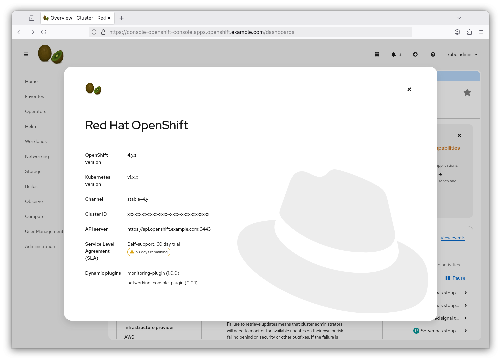
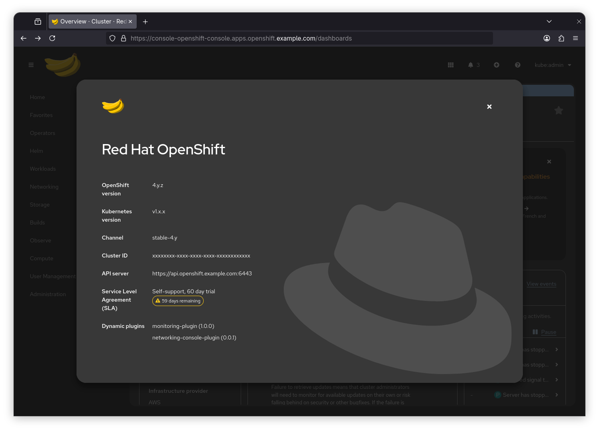

# Console Customization Logos

## Summary

The OpenShift Container Platform (OCP) web console was upgraded to PatternFly 6. In PatternFly 6, the masthead color changes based on light or dark theme mode. As a result, a single custom logo may not be suitable for both theme modes.

This proposal is to add the ability to specify custom logos to support light and dark theme modes for the masthead and favicon in the Console UI.





## Background info

The OpenShift Container Platform (OCP) web console was upgraded to PatternFly 6. In PatternFly 6, the masthead color changes based on light or dark theme mode. As a result, a single custom logo may not be suitable for both theme modes.

To address this, we need to allow users to add custom logos compatible with light and dark theme modes for both the masthead and favicon. This ensures that the logos are always visible and aesthetically pleasing, regardless of the theme mode.

The custom logos feature will enable users to specify different logos for the masthead and favicon based on the theme mode. This will involve exposing a new API to support custom logos for both light and dark theme modes.

## Motivation

The existing OKD and OpenShift logos are designed for a dark masthead background and include white text, making them ineffective in a light theme mode. To ensure logos remain visible and visually appealing in both light and dark theme modes, users need the ability to add custom logos for the masthead and favicon that adapt to the theme mode. To support this, a new API endpoint will be introduced, allowing users to specify different logos for light and dark theme modes.

### User Stories

* As an OpenShift web console user, I want to be able to add different custom logos for light and dark theme modes in the masthead and favicon.

### Goals

This feature will allow users to add custom logos for the masthead and favicon that are compatible with both light and dark theme modes in the OpenShift web console.

### Non-Goals

This feature does not aim to address other customization aspects of the web console outside of logos.

## Proposal

The proposal introduces a new API schema that allows users to configure custom logos for the masthead and favicon. The configuration will support specifying separate logos for light and dark theme modes, ensuring compatibility with the PatternFly 6 theme switching.

### API Design Details

The configuration for custom logos will include support for both masthead and favicon types with separate files for light and dark theme modes. The following schema will be used:

#### Console Customization Logo API Schema

#### ConsoleCustomization
- **Fields**:
  - `logos`: A list of custom logos for the console UI.
  - `customLogoFile`: Deprecated field for a single custom logo.

#### Logo
- **Fields**:
  - `type`: Specifies the type of logo (`Masthead` or `Favicon`).
  - `themes`: A list of themes for the logo, each specifying a mode and source.

#### LogoType
- **Description**: Specifies the type of logo for the console UI.
- **Values**: `"Masthead"`, `"Favicon"`

#### Theme
- **Fields**:
  - `mode`: Specifies the theme mode (`Dark` or `Light`).
  - `source`: Specifies the file reference source for the logo.

#### ThemeMode
- **Description**: Specifies the theme mode for the console UI.
- **Values**: `"Dark"`, `"Light"`

#### SourceType
- **Description**: Defines the source type of the file reference.
- **Values**: `"ConfigMap"`


#### FileReferenceSource
- **Fields**:
  - `from`: Specifies the source type of the file reference (e.g., `ConfigMap`).
  - `configMap`: Contains the ConfigMap name and key for the logo file.

#### ConfigMapFileReference
- **Fields**:
  - `name`: The name of the ConfigMap containing the custom logo file.
  - `key`: The key inside the ConfigMap that references the logo file.


#### Example Configuration

```yaml
logos:
  - type: Masthead
    themes:
      - mode: Light
        source:
          from: ConfigMap
          configMap:
            name: custom-logos-config
            key: masthead-light-logo.svg
      - mode: Dark
        source:
          from: ConfigMap
          configMap:
            name: custom-logos-config
            key: masthead-dark-logo.svg
  - type: Favicon
    themes:
      - mode: Light
        source:
          from: ConfigMap
          configMap:
            name: custom-logos-config
            key: favicon-light-logo.png
      - mode: Dark
        source:
          from: ConfigMap
          configMap:
            name: custom-logos-config
            key: favicon-dark-logo.png
```

### Workflow Description

├── spec
│   ├── customization
│       ├── logos
│           ├── type
│           ├── themes
│               ├── mode
│               ├── source
│                   ├── from
│                   ├── configMap
│                       ├── name
│                       ├── key
└── ...

### API Extensions
NA

### Risks and Mitigations

1. Each of the Console supported theme modes can be configured individually by setting either the Light or Dark theme mode. If a theme is not specified, the default OpenShift logo will be displayed for that theme.

2. Users might experience confusion with the introduction of new logo configuration options. The previous method, represented by `CustomLogo`, will be deprecated. Provide comprehensive documentation to guide users through the transition, including clear instructions about the changes and their benefits.

### Drawbacks
N/A

### Attributes Description

#### ConsoleCustomization
- `logos`: A list of custom logos used to replace the OpenShift Masthead and Favicon logos in the console UI. Only one of `logos` or `customLogoFile` can be set at a time. Each logos type must appear only once in the list, and there must be at least one entry and no more than two entries.

#### Logo
- `type`: Specifies the type of the logo for the console UI. Allowed values are `Masthead` and `Favicon`. 
  - `Masthead`: The logo is displayed in the masthead and about modal of the console UI.
  - `Favicon`: The logo is used as the favicon of the console UI.
- `themes`: A list of themes for the logo. Each theme must have a unique mode (`Light` or `Dark`) and a source field. If a theme is not specified, the default OpenShift logo will be displayed for that theme.

#### Theme
- `mode`: Specifies the theme mode for the logo. Allowed values are:
  - `Light`: The logo is used when the console UI is in light mode.
  - `Dark`: The logo is used when the console UI is in dark mode.
- `source`: Specifies the file reference source for the logo. This is a required field that references a ConfigMap name and key containing the custom logo file in the `openshift-config` namespace.

#### FileReferenceSource
- `from`: Specifies the source type of the file reference. Allowed value is `ConfigMap`.
- `configMap`: Contains the ConfigMap sourcing details, such as the name of the ConfigMap and the key for the file. The ConfigMap must exist in the `openshift-config` namespace.

#### ConfigMapFileReference
- `name`: The name of the ConfigMap containing the custom logo file. Must consist of lowercase alphanumeric characters, `-`, or `.`, and must start and end with an alphanumeric character. Maximum length is 253 characters.
- `key`: The key inside the ConfigMap that references the logo file. Must consist of alphanumeric characters, dashes (`-`), underscores (`_`), and periods (`.`). Must end with a valid file extension (2 to 5 letters) and have a maximum length of 253 characters.


## Test Plan

Provide tests as part of the console logos implementation and verify that they are shown in the UI. The following tests will be added:
 - Unit tests for API
 - Unit and E2E tests for console-operator
 - E2E tests for console

## Graduation Criteria
N/A

### Dev Preview -> Tech Preview
N/A

### Tech Preview -> GA
N/A

### Removing a deprecated feature
N/A

## Upgrade / Downgrade Strategy
N/A

## Version Skew Strategy
N/A

## Operational Aspects of API Extensions
N/A

### Deprecated Feature

The current custom logo field in `customization.customLogo` is deprecated. Users are encouraged to transition to the new custom logos configuration that supports light and dark theme modes for the masthead and favicon.

### Topology Considerations
N/A

#### Hypershift / Hosted Control Planes
N/A

#### Standalone Clusters
N/A

#### Single-node Deployments or MicroShift
N/A

## Support Procedures
N/A

### Implementation Details/Notes/Constraints

#### New API Field

A new field named `logos` will be incorporated into the ConsoleCustomization API. This field is designed to support the definition of multiple custom logos. Each logo can be linked to a specific theme mode (either Light or Dark) and a logo type (Masthead or Favicon). As part of this update, the existing `customLogoFile` field will be deprecated, transitioning completely to the new logo configuration approach.

#### Logo Sourcing

The custom logos will be retrieved from ConfigMaps located within the `openshift-config` namespace. The logos could be placed in a single ConfigMap with associated keys, or each logo could have an associated ConfigMap name and key, which will point to the specific logo file within that ConfigMap. This structured configuration will ensure that the appropriate logos are displayed depending on the current theme mode of the console.

#### Console-Operator Management

The application of these custom logos will be overseen by the console-operator, which is responsible for reading the configuration settings. It will ensure that the specified logos are correctly applied to the console's user interface. Should there be any theme mode that does not have a custom logo defined, the console will revert to using the default OpenShift logos.

#### Steps to Implement This Feature

1. **Introduce the New Logos Field**: Add the `logos` field into the ConsoleCustomization API schema to facilitate the new logo configurations.
   
2. **Deprecate Existing Field**: Phase out the older `customLogoFile` field as users transition to the new `logos` configuration.
   
3. **Update the Console-Operator**: Modify the console-operator to support the interpretation and application of the new configuration settings.

4. **Documentation**: Develop comprehensive documentation that outlines how users can transition to the new configuration, including examples and best practices for setting up custom logos.
   
5. **Testing**: Implement a robust suite of unit and end-to-end tests to validate the functionality of the new logo configurations across various scenarios.

By implementing these changes, custom logos will be effectively displayed within the masthead and favicon areas of the OpenShift Console. Users will have the flexibility to configure logos through the new `logos` field, fully supporting both light and dark theme modes, thereby enhancing the overall brand identity within the console environment.


## Alternatives (Not Implemented)
N/A
