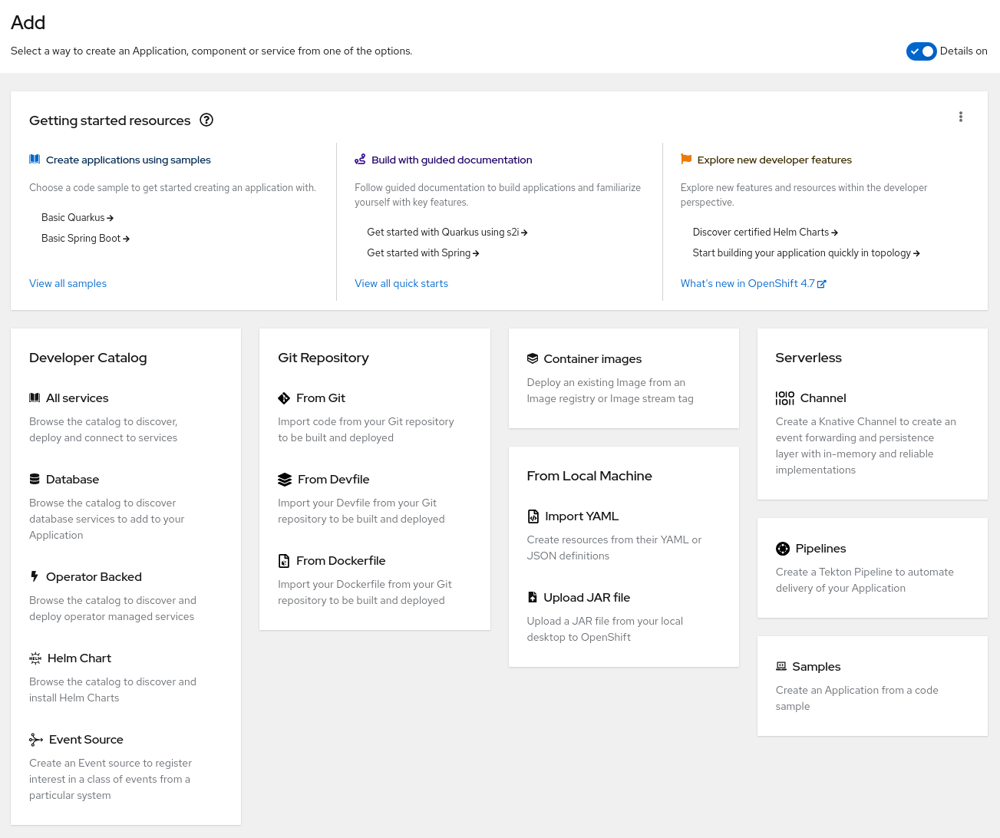

# Customize Add Page

## Release Signoff Checklist

- [x] Enhancement is `implementable`
- [x] Design details are appropriately documented from clear requirements
- [x] Test plan is defined
- [ ] Graduation criteria for dev preview, tech preview, GA
- [ ] User-facing documentation is created in [openshift-docs](https://github.com/openshift/openshift-docs/)

## Motivation

The OpenShift Developer Console provides many ways to import applications and services. Customers who use only some of these action want to hide the unused actions from the add page.

## Summary

Cluster admins want to customize the add page of the OpenShift Developer Console.

This list contains a long list of actions, some of them depends on installed operators like the OpenShift Pipelines Operator, the OpenShift Serverless Operator, and others.



### Goals

- Add a customization parameter to allow cluster admins to hide actions from the add page.
- Provide a list of available actions so that the admin can hide them.

### Non-Goals

- Introducing a UI to configure this without a yaml editor.

## Proposal

### Extending the Console CRD

Similar to [Customize Developer Catalog Categories](./catalog-categories.md) we extend the existing `operator.openshift.io/v1` / `Console` CRD. It provides already a `spec.customization` area where we can hide actions from the add page.

The cluster admin can disable actions by ID. This ensures that later installed operators can show new actions without requiring the admin enable them manually.

A final YAML should look like this one:

```yaml
apiVersion: operator.openshift.io/v1
kind: Console
metadata:
  name: cluster
  ...
spec:
  customization:
    brand: online
    addPage:
      disabledActions:
      - devcatalog/databases
      - devcatalog/helmcharts
      - devcatalog/operatorbacked
      - devcatalog/virtualmachinetemplates
      - devcatalog/managedservices
      - fromgit
      - fromdevfile
      - fromdockerfile
      - containerimage
      - importyaml
      - uploadajar
      - knative.openshift.io/eventsource
      - knative.openshift.io/channel
      - tekton.dev/pipelines
  ...
```

### Provide a code snippet in YAML editor

The admin needs to know the current available actions to hide them. We don't want to provide the defaults in the CR so that we can change these defaults later without migrating the customer data.

To provide the default values close to the editor, the console will provide a code snippets in the sidebar of the YAML editor when editing the `Console` operator config. The snippets should include the IDs of all actions.

### User Stories

#### Story 1

As a cluster admin, I want to customize the add page. The admin needs to know the current list of available actions. The admin can configure a list of actions which should not be shown on the add page.

#### Story 2

As a user, I don't want to see any actions on the add page which are hidden by the cluster admin. Empty groups should not be displayed.

### Risks and Mitigations

#### How we handle upgrade

**Mitigation**: The cluster admin can provide a list of actions which should not shown to the users. All features which are not defined in that list will be shown after an upgrade.

**Drawback** If the cluster admin installs a new OpenShift upgrade, the customized add page will contain new or unexpected actions.

## Open Questions

- [x] Should we save a list of enabled actions instead of a list of ids which should not be shown?

For example:

```yaml
spec:
  customization:
    addPage:
      actions:
      - databases
      - helmcharts
      - ...
  ...
```

Answer:

> No. Customers requested to hide some unnecessary actions and add their own actions to the add page. Product management expected that it's easier for them to define a negative list, so that new actions will be shown automatically if an operator is installed.

- [x] Should we also allow the cluster admin to hide complete groups?

Answer:

> No. Groups are shown based on whether an action is present or not. It's fine that the admin needs to disable new actions after a cluster upgrade.

- [x] Should we save which actions are already configured by the cluster admin?

If we save a list of shown and hidden actions, it may be easier later to show an admin the information which new actions are available after an upgrade or when a new operator is installed.

For example:

```yaml
spec:
  customization:
    addPage:
      actions:
        databases: true
        helmcharts: false
  ...
```

After installing the OpenShift Pipelines Operator an upcoming UI could show the information that there is a new action `pipelines` because this key is not defined in the yaml yet.

Answer:

> No. This is not required at the moment and we will consider such requirements again when we will provide an UI for the admin in the future.

### Test Plan

Testing will be carried out with the usual Console unit and e2e test suites.

### Graduation Criteria

None

### Version Skew Strategy

None, console is the only consumer of this configuration.

## Alternatives
