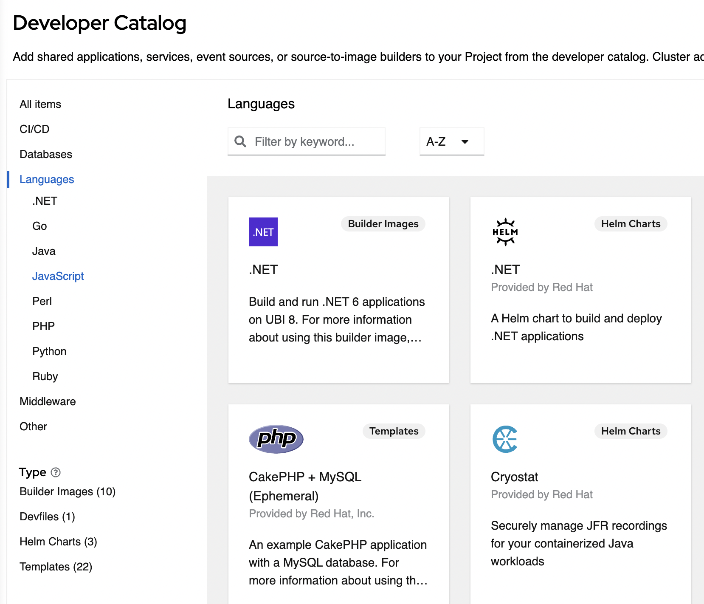

# Customize Catalogs

## Summary

The OpenShift Console provides a "Developer Catalog" which enables 
the user to create apps and services based on Operator backed services, helm charts, templates, etc.

Cluster administrators can provide additional catalog types 
via console plugins, for example by installing an operator. 
These catalog types extend the catalog with additional 
items and are also available as "sub-catalogs".

Some customers want to hide specific types from 
the catalog or the sub-catalog to streamline their 
development process without uninstalling a complete operator or disabling the complete console plugin.

In the developer catalog the sub-catalogs are shown as types. 
The developer catalog shows items from all sub-catalogs.
When user selects a sub-catalog, they can see a list of 
available items from this sub-catalog to install.

This enhancement allows cluster admins to selectively 
disable a sub-catalog and all links to the specific sub-catalog. 
The developer catalog will also hide any of the items from this sub-catalog.


 
## Motivation

The developer catalog can be extended by plugins and 
also dynamically by installing a console plugin or an operator.

Some customers want to align their development process and 
have teams that support other development teams with their work.
For this cluster administrators want to hide developer sub-catalog (types) 
without disabling a full console plugin, for example by uninstalling an operator.
By hiding for example "Service Backed operators", "Helm", etc. 
they can still install them via the CLI, see their resources in the topology, 
but don't show them in the add from developer catalog flow.

### User Stories

#### Story 1

Customer wants to display only their own customized and validated 
templates on the dev console but they can't change the default devfiles currently.

As a cluster admin, I want to hide Developer catalog for all users.
For example for customers who has their own way to 
install workloads, services, etc. without the developer catalog.

#### Story 2

Customer wants to display only their own customized and validated 
templates on the dev console but they can't change the default devfiles currently.

As a cluster admin, I want to hide certain sub-catalogs (types) for all users.
For example for customers who don't want to use Helm charts, 
or another sub-catalog without disabling Helm support in the whole developer console.

#### Story 3

Customer wants to display only their own customized and validated 
templates on the dev console.

As a cluster admin, I want to enable certain sub-catalogs (types) for all users.

### Goals

- Allow cluster admins to hide the developer catalog or certain sub-catalogs (types).
- Allow cluster admins to enable certain sub-catalogs (types) for users.
- Provide information to admins about sub-catalogs (types) they can hide from users.

### Non-Goals

- Allow cluster admins to customize categories or hide individual items.

## Proposal

We can extend the existing `operator.openshift.io/v1` / `Console CRD`. 
We can add `spec.customization.developerCatalog.types.state` suggests types are `Enabled` or `Disabled`,
`spec.customization.developerCatalog.types.disabled` which lists types to hide and 
`spec.customization.developerCatalog.types.enabled` which lists types to show.

### Workflow Description

To enable the types:

```text
├── spec
│   ├── customization
|       ├── developerCatalog
|           ├── types
|               ├── state
|               ├── enabled
|                   └──
└── ...
```

To disable the types:

```text
├── spec
│   ├── customization
|       ├── developerCatalog
|           ├── types
|               ├── state
|               ├── disabled
|                   └──
└── ...
```

Each catalog conforms to the following schema:

// +optional
- `types: object` , defines the types to enable or disable.

// +optional
- `state: Enabled|Disabled` , union discriminator suggests types are `Enabled` or `Disabled`. Default value is `Enabled`.

// +optional
- `disabled: string[]` , defines a list of types to hide. 

// +optional
- `enabled: string[]` , defines a list of types to enable. 

If the `state` is `Enabled` and `enabled` list is empty, all the types will be shown.
If the `state` id `Enabled` and `enabled` list is non-empty, only the `enabled` list items will be shown.
If the `state` is `Disabled` and `disabled` list is empty, all the types will be hidden.
If the `state` id `Disabled` and `disabled` list is non-empty, only the `disabled` list items will be hidden.

To disable the complete developer catalog then in `disabled` all the available types
should be listed or make the `disabled` list empty for `state: Disabled`.

Types will vary based on the operator installed.

### API Extensions

Extend the existing `operator.openshift.io/v1` / `Console CRD` by adding `spec.customization.developerCatalog.types.state` 
suggests types are `Enabled` or `Disabled`,
`spec.customization.developerCatalog.types.disabled` which lists types to hide and 
`spec.customization.developerCatalog.types.enabled` which lists types to show.

So the example yaml should look like this one:

To disable some specific types (sub-catalogs):

```yaml
apiVersion: operator.openshift.io/v1
kind: Console
metadata: 
  name: cluster
  ...
spec: 
  customization:
    developerCatalog:
      types:
        state: Disabled
        disabled: 
          - Devfile
          - HelmChart
  ...
```

To enable some specific types (sub-catalogs):

```yaml
apiVersion: operator.openshift.io/v1
kind: Console
metadata: 
  name: cluster
  ...
spec: 
  customization:
    developerCatalog:
      types:
        state: Enabled
        enabled: 
          - Devfile
          - HelmChart
  ...
```

To enable the complete Developer Catalog and all types (sub-catalogs):

```yaml
apiVersion: operator.openshift.io/v1
kind: Console
metadata: 
  name: cluster
  ...
spec: 
  customization:
    developerCatalog:
      types:
        state: Enabled
        enabled: [] // Enabling no specific type means that all types are enabled
  ...
```

To disable the complete Developer Catalog and all types (sub-catalogs):

```yaml
apiVersion: operator.openshift.io/v1
kind: Console
metadata: 
  name: cluster
  ...
spec: 
  customization:
    developerCatalog:
      types:
        state: Disabled
        disabled: [] // Disabling no specific type means that all types are disabled
  ...
```

A `ConsoleYAMLSample` snippet will be provided for disabling types in the console YAML editor.

### Risks and Mitigations

**Save disabled**: Saving just the disabled types would 
show (expected or unexpected) new type if a new operator is installed.

`spec.customization.developerCatalog.types.enabled` can be used to mitigate this
by mentioning the types to be enabled so that the new type will not be shown to the 
user until customization. 

### Drawbacks

N/A

## Design Details

Sub-catalogs (types) could be added dynamically by console plugins, 
for example when installing an operator.

The type is an identifier specified within the extension list of a dynamic plugin.

We will provide a configuration UI and a yaml snippet in the 
console to provide a list of these dynamic available sub-catalogs / types.

### Test Plan

- If sub-catalog(s) is `disabled`, then all links to the sub-catalog(s) 
from the add page, topology actions, empty states, quick search, and the catalog itself should be hidden
- If sub-catalog(s) is `enabled`, then all links to the remaining sub-catalog(s) which are not mentioned in the list
should be hidden
- If `disabled` is empty list, complete developer catalog should be hidden.
- The sub-catalog should show `Not found` if the user opens the sub-catalog directly
- The feature should not be hidden if a sub-catalog option is disabled
- If all the available sub-catalogs are disabled, then complete Developer catalog should be hidden.

### Graduation Criteria

This will be released directly to GA.

#### Dev Preview -> Tech Preview

N/A

#### Tech Preview -> GA

N/A

#### Removing a deprecated feature

N/A

### Upgrade / Downgrade Strategy

**Upgrade**: If there are no customization details available, the default developer catalog and types will be visible. 

**Downgrade**: Will not look for customization details. The default developer catalog and types will be visible.

### Version Skew Strategy

None, console is the only consumer of this configuration.

### Operational Aspects of API Extensions

N/A

#### Failure Modes

N/A

#### Support Procedures

N/A

## Implementation History

N/A

## Alternatives

N/A