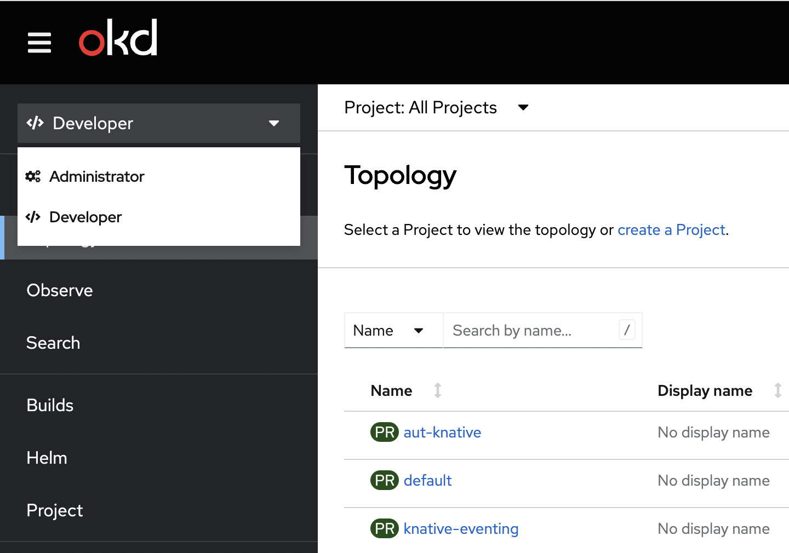

# Customize Perspectives 

## Summary

OpenShift Container Platform (OCP) web console provides two perspectives: Administrator and Developer. 
The Developer perspective provides workflows specific to developer use cases 
like create, deploy and monitor applications, while Administrator perspective 
is responsible for managing the cluster resources, users, and projects.

This document provides details about how cluster administrator 
can hide user perspectives. 



## Motivation

Cluster administrator wants to hide the "Administrator" perspective 
from non-privileged and to hide the "Developer" 
perspective for all users.

Currently all users have access to all perspectives and this might confuse some developers.

New perspectives could be added by the customer so they want to hide the default perspectives. 

### User Stories

#### Story 1

As a cluster admin, I want to hide "Administrator" perspective 
from all non-privileged users so that non-privileged users
cannot access "Administrator" perspective for managing the cluster resources, 
users, and projects. Non-privileged users are users that cannot get
all `namespaces` (based on RBAC check)

#### Story 2

As a cluster admin, I want to hide "Developer" perspective
for all users because the customers can add own perspectives and may be not interested in developer perspective.

#### Story 3

As a cluster admin, I want to hide any perspective contributed by a plugin.
A plugin can add multiple features to the console, the users are may be interested 
in other features of the plugin but not the perspective.

It might be also interesting for a customer to show this new perspective
only to users with specific permissions.

Additional perspectives can be dynamically added with the 
[Perspective extension](https://github.com/openshift/console/blob/master/frontend/packages/console-dynamic-plugin-sdk/src/extensions/perspectives.ts).

#### Story 4

As a cluster admin, I want to disable the guided tour of a perspective.
The main purpose for that in [RFE-3883](https://issues.redhat.com/browse/RFE-3883) was to show an alternative guided tour to the user.

### Goals

- Allow cluster admins to hide the user perspectives.
- Provide a way that cluster admins can do this based on resource permissions (RBAC).
- Enable them to disable just the default guided tour.

### Non-Goals

- Validating the console resource in the operator and inform the cluster admins with an error because the operator
doesn't know the available perspectives provided by the console plugins.
- Allow cluster admins to customize the navigation menu along with perspectives for users or groups. Checkout `pinned-resources.md` for that customization option.

## Proposal

We can extend the existing `operator.openshift.io/v1` / `Console` CRD. 
We can add 
`spec.customization.perspectives` which can have list of customization details.

### Workflow Description

To disable perspective for users with limited permissions we need a list of options with a perspective id and the required permissions.

```text
├── Spec
│   ├── customization
|       ├── perspectives 
|           ├── id
|           ├── visibility
|               ├── state
|               ├── accessReview
|                   ├── required
|                       ├── group
|                       ├── resource
|                       ├── verb
└── ...
```

```text
├── Spec
│   ├── customization
|       ├── perspectives 
|           ├── id
|           ├── visibility
|               ├── state
|               ├── accessReview
|                   ├── required
|                   |   ├── group
|                   |   ├── resource
|                   |   ├── verb
|                   ├── missing
|                       ├── group
|                       ├── resource
|                       ├── verb
└── ...
```

Each perspective conforms to the following schema:

- `id: string` , defines the id of perspective to disable. Incorrect or unknown ids will be ignored.
- `visibility: object` , defines the state of perspective along with access review checks if needed for that perspective.
   - `state: Enabled/Disabled/AccessReview` , defines the perspective is enabled or disabled or access review check is required.
   - `accessReview: object`, defines required and missing access review checks.
      - `required: authV1.ResourceAttributes[]` , defines a list of permission checks. The perspective will only be shown when all checks are successful.
      - `missing: authV1.ResourceAttributes[]` , defines a list of permission checks. The perspective will only be shown when at least one check fails.

      `required` and  `missing` can work together esp. in the case where you 
      want to show another perspective to users without specific permissions.

   If `state: AccessReview`, either of `required` or  `missing` should be present.

   For example, a plugin or customer adds a new `Monitoring` perspective, which works only with specific permissions.

   The admin can then define that this perspective is shown with some `required` permissions.

   But to show another limited `Monitoring` (same name, different ID!) perspective to all the others, 
   the admin can define a `missing` check so that the users without access to 
   specific resources see it - but the users with access to the first `Monitoring` perspective doesn't see both.

- `guidedTour: Enabled/Disabled` , defines if the guided tour of this perspective will be shown (`Enabled`) or not (`Disabled`).

### API Extensions

Extend the existing `operator.openshift.io/v1` / `Console` CRD to add `spec.customization.perspectives` which can have list of customization details.

So the final yaml should look like this one:

```yaml
apiVersion: operator.openshift.io/v1
kind: Console
metadata: 
  name: cluster
  ...
spec:
  customization:
    perspectives:
      - id: admin
        visibility: 
          state: AccessReview
          accessReview: 
            required:
              - group: rbac.authorization.k8s.io
                resource: clusterroles
                verb: list
      - id: dev
        visibility:
          state: Disabled
```

Example yaml based on resource permission:

```yaml
apiVersion: operator.openshift.io/v1
kind: Console
metadata: 
  name: cluster
  ...
spec:
  customization:
    perspectives:
      - id: admin
        visibility:
          state: AccessReview
          accessReview:
            required:
              - group: rbac.authorization.k8s.io
                resource: clusterroles
                verb: list
      - id: minimal-custom-admin
        visibility:
          state: AccessReview
          accessReview:
            missing:
              - group: rbac.authorization.k8s.io
                resource: clusterroles
                verb: list
```

Example yaml to disable the guided tours:

```yaml
apiVersion: operator.openshift.io/v1
kind: Console
metadata: 
  name: cluster
  ...
spec:
  customization:
    perspectives:
      - id: admin
        guidedTour: Disabled
      - id: dev
        guidedTour: Disabled
```

### Risks and Mitigations

**Default perspective**: When all the perspectives are hidden from a user or for all users, we always show Admin perspective by default and if admin has to 
revert back the changes, admin will update the yaml by removing specific perspective details. 

### Drawbacks

N/A

## Design Details

N/A

### Test Plan

- For users or groups, if a perspective is hidden, then that perspective should not appear 
in perspective switcher dropdown in OCP console.
- For users or groups, if all perspectives are hidden(this scenario will not happen, but considering 
the edge case), then by default "Administrator" perspective will be shown.
- If a plugin adds new perspective, then that perspective will be shown to users or groups
until customization happens.

### Graduation Criteria

This will be released directly to GA.

#### Dev Preview -> Tech Preview

N/A

#### Tech Preview -> GA

N/A

#### Removing a deprecated feature

N/A

### Upgrade / Downgrade Strategy

**Upgrade**: If there is no customization details available, by default all perspectives will be visible. 

**Downgrade**: Will not look for customization details, by default all perspectives will be visible.

### Version Skew Strategy

None, console is the only consumer of this configuration.

### Operational Aspects of API Extensions

N/A
#### Failure Modes

N/A
#### Support Procedures

N/A

## Implementation History

N/A

## Alternatives

- Allow the admin to define a list of enabled perspectives for users or groups.
- Enable plugins to specify required permissions for their perspectives.
- Other yaml options we can consider to customize perspectives:

**YAML Option 1** – Minimal version that just allow the cluster admin to 
disable one or more perspectives. This is similar to hide 
quick starts and items from the add page.

```yaml
spec:
  customization:
    perspectives:
      disabled:
        - admin
        - dev
```

But this doesn’t support additional permission checks.

**YAML Option 2** – To disable perspective for developers with limited 
permissions we need a list of options with a perspective id and the 
required permissions. For example to disable the admin for users 
with limited permissions and dev for anyone.

```yaml
spec:
  customization:
    perspectives:
      disabled:
        - id: admin
          required:
            - kind: namespaces
              verb: list
        - id: dev
```

**YAML Option 3** – Alternative we can use an object 
structure where the perspective id is used as key:

```yaml
spec:
  customization:
    perspectives:
      admin:
        required:
          - kind: namespaces
            verb: list
      dev:
        state: Enabled/Disabled
```

The inverted permission check to show an alternative 
perspective could be also easily added here:

```yaml
spec:
  customization:
    perspectives:
      admin:
        required:
          - kind: namespaces
            verb: list
      minimal-custom-admin:
        missing:
          - kind: namespaces
            verb: list
```
