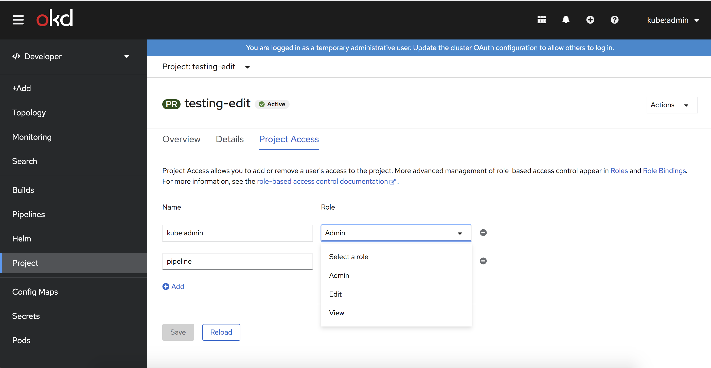

# Customize Project Access Roles

## Release Signoff Checklist

- [x] Enhancement is `implementable`
- [x] Design details are appropriately documented from clear requirements
- [x] Test plan is defined
- [ ] Graduation criteria for dev preview, tech preview, GA
- [ ] User-facing documentation is created in [openshift-docs](https://github.com/openshift/openshift-docs/)

## Motivation

Customers with customized roles want to provide easy access for their project admins to restrict access within a project.

OpenShift Console 3.11 allowed customers to customize the list of roles visible in the membership page. This enhancement will provide equivalent functionality in 4.x.

## Summary

Cluster admins want to give project admins only access to a customized list of predefined roles to force compliance rules or provide more options.

The OpenShift Developer Console provides a simple way to share access to the currently selected project. This change will only affect the project page in the developer perspective. Users can be assigned here to specific roles on the project access tab. Currently only the roles "Admin", "Edit" and "View" are selectable.

The `console.openshift.io/display-name` annotation of a `ClusterRole` can be used as label if it is defined.



### Goals

- Add configuration options to allow cluster admins to customize the project access roles.
- Provide a list of default values to the admin.

### Non-Goals

- Introducing a UI to configure this project access roles without a YAML editor.

## Proposal

### Extending the Console CRD

Similar to [Customize Developer Catalog Categories](./catalog-categories.md) we extend the existing `operator.openshift.io/v1` / `Console` CRD. It provides already a `spec.customization` area where we can add a list of roles.

The list of roles should link to `rbac.authorization.k8s.io/v1` `ClusterRole` by name:

```yaml
apiVersion: operator.openshift.io/v1
kind: Console
metadata:
  name: cluster
  ...
spec:
  customization:
    brand: online
    projectAccess:
      availableClusterRoles:
      - admin
      - edit
      - view
  ...
```

### Provide a code snippet in YAML editor

The admin needs to know the current default roles to customize them. We don't want to provide the default roles in the CR so that we can change these defaults later without migrating the customer data.

To provide the default values close to the editor, the console will provide a code snippet in the sidebar of the YAML editor when editing the `Console` operator config.

### User Stories

#### Story 1

As a cluster admin, I want to customize (add, update or remove) some of the Developer Console project access roles. The cluster admin needs to know the current list of roles.

#### Story 2

As a project admin, I want use the customized roles to give other users access to the current project.

### Risks and Mitigations

#### How we handle upgrade

**Mitigation**: We keep the default values as part of the console code, so that without customization the console always shows the default roles. If the default values are changed, the admin needs to merge the new values with their customization manually. The benefit of this is that we will never modify an already customized list.

**Drawback** As soon as the admin customizes the roles, a cluster update will not add new default roles or drop none-existing roles.

## Open Questions

- [x] Should we provide a way that roles could show a label (visible label in the select or dropdown for the user) instead of just the resource name.

For example:

```yaml
apiVersion: operator.openshift.io/v1
kind: Console
metadata:
  name: cluster
  ...
spec:
  customization:
    brand: online
    projectAccess:
      availableClusterRoles:
      - name: admin
        label: Admin
      - name: edit
        label: Edit
      - name: custom-role-name
        label: "My custom role"
  ...
```

Answer:

> We can use the `console.openshift.io/display-name` annotation of a `ClusterRole` to show a label.

- [x] Should allow the admin to link `Role` or `ClusterRole`? Should this support other namespaces then the current?

For example:

```yaml
apiVersion: operator.openshift.io/v1
kind: Console
metadata:
  name: cluster
  ...
spec:
  customization:
    brand: online
    projectAccess:
      availableClusterRoles:
      - kind: ClusterRole
        name: admin
      - kind: ClusterRole
        name: edit
      - kind: Role
        namespace: another-namespace
        name: custom-role-name
  ...
```

Answer:

> We limit this to `ClusterRole` for now since Roles with the same names in different namespaces can have totally different permission. The cluster admin can't know what these will be when configuring the option. Also there is no way in the current UI to differentiate between Role and ClusterRole, so as a project admin you won't know exactly what permission you're granting.

### Test Plan

Testing will be carried out with the usual Console unit and e2e test suites.

### Graduation Criteria

None

### Version Skew Strategy

None, console is the only consumer of this configuration.

## Alternatives

- Store specific resource references to Role or ClusterRole. See Open Question 1
- Store a back-reference as label in Roles and ClusterRoles, like: `openshift.io/project-access-role: true`
- Introduce a new CRD.
