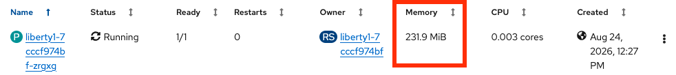

# Show Pod Memory RSS

## Summary

The OpenShift Container Platform (OCP) web console shows a "Memory" column for pods that maps to `container_memory_working_set_bytes`. This Working Set Size (WSS) is useful but it includes active file cache and reclaimable kernel slab on Linux, both of which are reclaimable if needed, and this may cause user confusion and concern about potential memory leaks and sizing.

This proposal is to rename the "Memory" column to "Memory (WSS)" and add an additional column "Memory (RSS)" on Linux that maps to `container_memory_rss` that is the anonymous Resident Set Size (RSS). The RSS column is not added for Windows pods.



## Background info

The following is my understanding of the issue and should be reviewed and verified by the relevant experts. The following applies to Linux and not Windows.

By clicking a pod in the OpenShift Container Platform (OCP) web console, then clicking Metrics and then clicking on the Memory plot, the PromQL defaults to `sum(container_memory_working_set_bytes{pod='...',namespace='...',container='',}) BY (pod, namespace)` which uses `container_memory_working_set_bytes`.

The Working Set Size (WSS) statistic comes from [Google's cAdvisor](https://github.com/google/cadvisor/blob/release-v0.55/container/libcontainer/handler.go#L853C1-L861C3) which takes the total memory usage of the pod and subtracts inactive file cache:

```
workingSet := ret.Memory.Usage
if v, ok := s.MemoryStats.Stats[inactiveFileKeyName]; ok {
  ret.Memory.TotalInactiveFile = v
  if workingSet < v {
    workingSet = 0
  } else {
    workingSet -= v
  }
}
```

Where `Memory.Usage` comes from cgroups [V1 = memory.usage_in_bytes](https://github.com/opencontainers/cgroups/blob/v0.0.6/fs/memory.go#L212) or [V2 = memory.current](https://github.com/opencontainers/cgroups/blob/main/fs2/memory.go#L143).

The available raw memory breakdown may be displayed with the memory.stat pseudo-file inside any container in a pod (this checks both cgroups [V1](https://docs.kernel.org/admin-guide/cgroup-v1/memory.html) and [V2](https://docs.kernel.org/admin-guide/cgroup-v2.html)):

```
cat /sys/fs/cgroup/*/*/memory.stat /sys/fs/cgroup/memory.stat 2>/dev/null
```

"rss" (cgroups V1) and "anon" (cgroups V2) include the anonymous memory allocated by programs that we normally think of as mostly driving RSS.

Therefore, WSS includes active file cache, reclaimable kernel slab, and lots of other things. This isn't exactly obvious, but it is mentioned in the [documentation of cAdvisor](https://pkg.go.dev/github.com/google/cadvisor@v0.55.0/info/v1#MemoryStats):

```
// The amount of working set memory, this includes recently accessed memory,
// dirty memory, and kernel memory. Working set is <= "usage".
// Units: Bytes.
WorkingSet uint64 `json:"working_set"`
```

This may be surprising to users because active file cache and reclaimable kernel slab are reclaimable if needed. If "Memory" is continuously growing, this may mean that active file cache is increasing over time, which wouldn't be too surprising if the processes do heavy file I/O. This would be completely benign in the context of whether or not the Linux OOM killer will kill the pod. It might be an actual program memory leak which will lead to the Linux OOM killer. Or it might first be benign active file cache growth which then hits the container limit totally benignly, but then, over time, is reclaimed and replaced by an actual anonymous memory leak. The user wouldn't even notice this until the Linux OOM Killer kills the process because the WSS would probably stay roughly the same as file cache is swapped with active anonymous memory.

## Motivation

User confusion about potential memory leaks and difficulty differentiating RSS versus active file cache and reclaimable slab.

### User Stories

* As an OpenShift web console user, I want to be able to understand pod memory usage as far as its working set (including active file cache, reclaimable slab, etc.) as well as anonymous resident set size.

### Goals

This feature will allow users to understand pod working set size and anonymous resident set size in the OpenShift web console.

### Non-Goals

This feature does not aim to address potential users confusion around [the use of WSS in node pressure eviction](https://kubernetes.io/docs/concepts/scheduling-eviction/node-pressure-eviction/#active-file-memory-is-not-considered-as-available-memory) which is a related but separate topic.

## Proposal

The proposal is to change the "Memory" column to "Memory (WSS)" and add another column "Memory (RSS)" on Linux to show `container_memory_rss`. The RSS column is not added for Windows pods.

### API Design Details

Unknown

### API Extensions

N/A

### Risks and Mitigations

1. None

### Drawbacks

N/A

## Test Plan

The following tests will be added:
 - On Linux, verify the data for the two columns each come from the relevant Prometheus statistics.
 - On Windows, verify there is no additional RSS column.

## Graduation Criteria

N/A

### Dev Preview -> Tech Preview

N/A

### Tech Preview -> GA

N/A

### Removing a deprecated feature

N/A

## Upgrade / Downgrade Strategy

N/A

## Version Skew Strategy

N/A

## Operational Aspects of API Extensions

N/A

### Deprecated Feature

N/A

### Topology Considerations

N/A

#### Hypershift / Hosted Control Planes

N/A

#### Standalone Clusters

N/A

#### Single-node Deployments or MicroShift

N/A

## Support Procedures

N/A

### Implementation Details/Notes/Constraints

#### Steps to Implement This Feature

Unknown

## Alternatives (Not Implemented)

N/A
