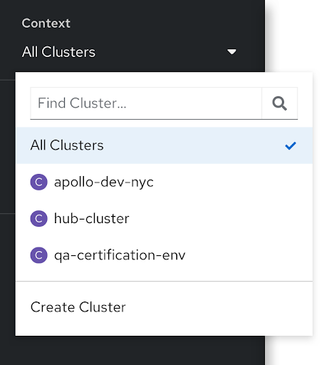
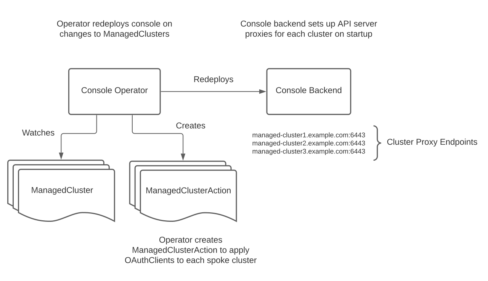

# Multi-cluster Console

## Release Signoff Checklist

- [x] Enhancement is `implementable`
- [x] Design details are appropriately documented from clear requirements
- [ ] Test plan is defined
- [ ] Operational readiness criteria is defined
- [x] Graduation criteria for dev preview, tech preview, GA
- [ ] User-facing documentation is created in [openshift-docs](https://github.com/openshift/openshift-docs/)

## Summary

OpenShift console is currently a single-cluster console. Today, users who work
in environments with multiple clusters must switch between consoles for each
cluster. We want to make OpenShift console multi-cluster aware. Users should be
able to visit one console running on the hub cluster and easily switch between
spoke clusters in the fleet without leaving that console or logging in again.

Additionally, we want to integrate the OpenShift and ACM consoles so that they
are a single console under a single URL. This hybrid console will have an "All
clusters" perspective that contains the ACM multi-cluster views. Selecting a
cluster from the cluster dropdown will drill down into the traditional
OpenShift console views for that cluster.

## Motivation

To provide a single web console that lets users interact will all clusters in
the fleet.

### Goals

* The OpenShift console will have a cluster selector that allows you to view
  resources for any cluster in the fleet.
* Users will be able to create and edit resources on spoke clusters from the
  console running on the hub.
* The console will support viewing metrics for workloads running on spoke
  clusters.
* Console will support single sign-on (SSO) to avoid logins every time a user
  switches clusters.

### Non-Goals

* For now, we do not plan to remove the OpenShift console from the release
  payload. Admins can disable the local console on spoke clusters using the
  existing `spec.managementState` property in the console operator config.
* This enhancement does not cover the implementation details of the SSO operator.

## Proposal

### Feature Gate

To enable the multi-cluster console integration, administrators will need to
enable the `CustomNoUpgrade`
[feature gate](https://docs.openshift.com/container-platform/4.8/nodes/clusters/nodes-cluster-enabling-features.html)
and the `MultiClusterConsole` feature.

```yaml
apiVersion: config.openshift.io/v1
kind: FeatureGate
metadata:
  name: cluster
spec:
  customNoUpgrade:
    enabled:
    - MultiClusterConsole
  featureSet: CustomNoUpgrade
```

### Cluster Selector

A cluster selector will be added to the OpenShift console navigation bar. This
selector functions like the project bar in the console masthead except it
controls the cluster context rather than simply the project context.



When multi-cluster is enabled, the hub console is capable of connecting to the
API server on any of the spoke clusters in the fleet. API requests from the
frontend go to the console backend, which in turn proxies each request to the
public API server URL for the selected cluster. The console backend reads the
`X-Cluster` request header set by the frontend to determine the cluster to
route the request to.


The various console hooks and utilities that make requests to the API server
will be updated to read the current cluster from the Redux store and include
the right `X-Cluster` header. This lets us implement multi-cluster without
needing to update every page and component that makes API requests. The
utilities the will automatically add the `X-Cluster` header include

* The `useK8sWatchResource` and `useK8sWatchResources` hooks
* The `Firehose` component
* The `k8s{Get,Create,Update,Patch,Delete}` functions

The console operator watches the `ManagedCluster` custom resources created by
ACM to determine what clusters are in the fleet. It reads the [API server
public URL and CA file](https://issues.redhat.com/browse/ACM-786) for each
`ManagedCluster`, and passes them to the console backend as configuration using
the existing `console-config` config map in the `openshift-console` namespace.
On startup, the console backend will set up a proxy to each of the clusters in
the fleet. When the `ManagedCluster` list changes, the console operator will
update the console configuration, triggering a new rollout of console.



### Authentication

The OpenShift console backend must support authentication challenges from each
of the clusters in the fleet. The backend discovers the OAuth endpoints for
each `ManagedCluster` through the `/.well-known/oauth-authorization-server`
endpoint and sets up separate authenticators for each cluster. The user's
access token for each spoke cluster is be stored in a separate cookie that
includes the cluster name, `openshift-session-token-<cluster-name>`.

The console operator will read the CA file for the spoke cluster OAuth servers
using a `ManagedClusterView` and pass the correct CA file to console backend as
part of the multi-cluster config. For 4.9 clusters, this is available in the
`oauth-serving-cert` config map in the `openshift-config-managed` namespace:

```yaml
apiVersion: view.open-cluster-management.io/v1beta1
kind: ManagedClusterView
metadata:
  name: get-oauth-serving-cert
  namespace: cluster1
spec:
  scope:
    resource: configmaps
    name: oauth-serving-cert
    namespace: openshift-config-managed
```

For 4.8 and earlier, the console operator will need to use the
`default-ingress-cert` from the `openshift-config-managed` namespace.

```yaml
apiVersion: view.open-cluster-management.io/v1beta1
kind: ManagedClusterView
metadata:
  name: get-default-ingress-cert
  namespace: cluster1
spec:
  scope:
    resource: configmaps
    name: default-ingress-cert
    namespace: openshift-config-managed
```

A separate [SSO operator](https://issues.redhat.com/browse/ACM-779) is being
developed that will allow us to avoid a login prompt when switching clusters.
The user will still have a separate access token on each cluster that the
console backend tracks, however.

### Monitoring

In the initial tech preview implementation, OpenShift console will talk
directly to the monitoring endpoints exposed as routes on each of the spoke
clusters. This is required as ACM Observability does not track the workload
metrics we need on the hub cluster. This assumes the hub cluster will be able
to connect to the monitoring endpoints on the spokes.

To discover the monitoring endpoints, the console operator will create a
`ManagedClusterView` resource in the namespace for each spoke cluster.

```yaml
apiVersion: view.open-cluster-management.io/v1beta1
kind: ManagedClusterView
metadata:
  name: get-monitoring-endpoints
  namespace: cluster1
spec:
  scope:
    resource: configmaps
    name: monitoring-shared-config
    namespace: openshift-config-managed
```

The operator will then read the monitoring URLs from the config map in the
`status.result` stanza of the `ManagedClusterView`.

Similarly, the console operator will read the default ingress certificate for
the routes using a `ManagedClusterView`.

```yaml
apiVersion: view.open-cluster-management.io/v1beta1
kind: ManagedClusterView
metadata:
  name: get-default-ingress-cert
  namespace: cluster1
spec:
  scope:
    resource: configmaps
    name: default-ingress-cert
    namespace: openshift-config-managed
```

The console backend will use the CA bundle from this config map when proxying
requests to the monitoring endpoints.

Long term, we'd like to explore collecting workload metrics on the hub cluster.
Console will then be able to talk to the `thanos-querier` on the hub to get all
metrics without needing to make requests to the monitoring endpoints on each
spoke cluster.

### Console URLs

Console resource URLs will be updated to
[include the cluster name in the URL](https://issues.redhat.com/browse/CONSOLE-2831).
Currently, a resource path to the pods details page looks like

```html
/k8s/ns/openshift-console/pods/console-fd5694f75-vdmn2
```

This will be updated to include the cluster in the path

```html
/cluster/local-cluster/k8s/ns/openshift-console/pods/console-fd5694f75-vdmn2
```

When the console sees a URL without the cluster segment in its path, it will
assume the current cluster context and add a React Router redirect to update
the URL to include the cluster name. This allows any links in the console that
do not get updated to continue to work.

### User Settings

[User Settings](user-settings.md) are stored as JSON in config maps in the
`openshift-console-user-settings` namespace. In a multi-cluster environment, we
will continue to use these config maps and always store the user settings on
the hub. Most user settings are not specific a particular cluster.

For settings that are cluster-specific, they will need to be set by cluster
name under a `cluster-settings` stanza in the settings JSON. For example,

```json
{
  "cluster-settings": {
    "local-cluster": {
      "console.lastNamespace": "my-namespace"
    }
  }
}
```

### User Stories

See [Hybrid Console personas, use cases, and principles](https://docs.google.com/document/d/1-UodIqKYIsOaIYVNYNqpGWu7PnRvtml_nn1EpvnsSVo/edit#).

### Implementation Details/Notes/Constraints [optional]

* This proposal assumes the console backend running on the hub cluster will be
  able to make network requests to public endpoints like the API server on each
  spoke cluster.
* Dynamic plugins will only be loaded from the hub cluster. If a dynamic plugin
  is added by an operator on a spoke, it will not be loaded by the
  multi-cluster console on the hub. We'll need additional exploration to see if
  loading dynamic plugins from a spoke can be supported.
* The console service account will not have special permissions on the spoke
  clusters. This means a few features like cloud shell that require special
  access will need to be disabled for multi-cluster.

### Risks and Mitigations

This is a significant architectural change to OpenShift console, and the
enhancement proposal makes assumptions about whether the console backend on a
hub cluster can reach public endpoints on various clusters in the fleet. Some
capabilities like cloud shell require special privileges from the console
service account, which won't work in a multi-cluster environment.

We are mitigating these risks by initially offering this as a tech preview as we
collect feedback and work through technical limitations.

## Design Details

### Open Questions [optional]

1. Will the console running on the hub always be able to talk to public API
   endpoints on the spoke cluster?
1. What is our long-term approach to multi-cluster metrics? Will workload
   metrics from all clusters the fleet be available from Thanos on the hub
   cluster?
1. Do we need to be able to load dynamic plugins from spoke clusters?

### Test Plan

For the tech preview, we will need to rely on unit tests for multi-cluster
capability. openshift/console CI currently is not set up to provision a real
multi-cluster environment.

End-to-end tests that cover multi-cluster scenarios will be a GA graduation
requirement.

### Graduation Criteria

We will initially deliver this as a tech preview.

#### Dev Preview -> Tech Preview

N/A

#### Tech Preview -> GA

- More testing (upgrade, downgrade, scale)
- Sufficient time for feedback
- Available by default when ACM is installed
- Ability to connect to non-OpenShift clusters in the fleet
- End-to-end tests

#### Removing a deprecated feature

N/A

### Upgrade / Downgrade Strategy

This feature is a tech preview that requires a feature gate to use. The
cluster cannot be upgraded when the feature gate is enabled.

This section will be updated when we prepare to graduate to GA.

### Version Skew Strategy

The OpenShift console running on the hub cluster needs to be able to talk to
clusters at different OpenShift versions. It's not feasible or desirable to
require all clusters in the fleet to run at the same version. Version skew is
handled through API discovery and feature detection which console already does
today. Console re-runs discovery when the selected cluster changes and only
shows navigation items for resources that exist on the current cluster. Console
will either need to use the lowest common denominator when selecting API
versions for resource or will need to handle a range of versions if newer
features are required.

## Implementation History

* 4.8 proof of concept: [CONSOLE-2529](https://issues.redhat.com/browse/CONSOLE-2529)

## Drawbacks

This proposal does not make the concept of clusters transparent to the user and
users cannot view resources across clusters on a single page. We should
evaluate how this relates to [KCP](https://github.com/kcp-dev/kcp) and
[transparent multi-cluster](https://github.com/kcp-dev/kcp/blob/main/docs/investigations/transparent-multi-cluster.md).

## Alternatives

An alternative is for the OpenShift console to query the ACM search index to
show resource details from different clusters in the fleet. This would allow
console to show resources from more than one cluster in the same view. The data
would be read-only, however, and might be stale. It would also require
significant rework to the existing console views that were written for k8s APIs.

## Infrastructure Needed [optional]

We will need to work with the test platform and ACM teams on testing
infrastructure for multi-cluster e2e tests.
