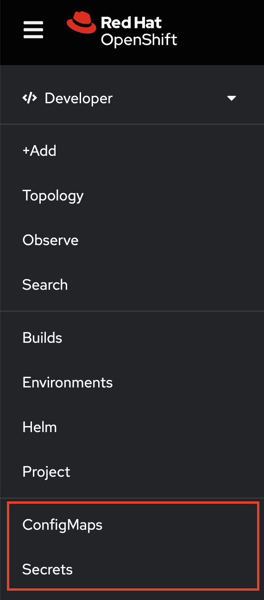

# Define pre-pinned resources

## Summary

The Developer perspective on the OpenShift Console provides pinned resources on the navigation which enables the user to go to the resource’s list page with a single click.

Some customers want to provide defaults for those pre-pinned resources for all users.

On the Developer perspective navigation, users can see the default pinned resources if they have not customized these pinned resources. Cluster admins have no way to set these default pinned resources for their users. Users can change their pinned resources on their own. The user-pinned resources are saved in the user settings (as-per user-settings ConfigMap).

This enhancement allows cluster admins to define pre-pinned resources for new users and users who have not customized their navigation items. Users should still be able to change these defaults and customize the pinned resources on their own. New changes from a cluster admin after a user customize their own pinned resources do not have to be shown.



## Motivation

Some customers want to provide default pre-pinned resources for all users.

### User Stories

#### Story 1

Customer wants to customize the developer perspective navigation by providing pre-pinned resources to users who do not have their navigation items customized.

As a cluster admin, I want to provide default pre-pinned resources for all users so that the developers who donot have their navigation items customized will see these default pinned resources.

### Goals

- Allow cluster admins to define default pre-pinned resources on the Developer perspective navigation

### Non-Goals

N/A

## Proposal

We can extend the existing `operator.openshift.io/v1` / `Console CRD`.
We can add `spec.customization.perspectives.pinnedResources` which lists default pre-pinned resources

### Workflow Description

To add default pre-pinned resources:

```text
├── spec
│   ├── customization
|       ├── perspectives
|           ├── id
|           ├── ...
|           ├── pinnedResources
|               └── group
                └── version
                └── resource
└── ...
```

Each perspective conforms to the following schema :

- `pinnedResources: operatorv1.PinnedResourceReference[]` , defines a list of pinned resources. The default pinned resources are contributed by the console UI extension plugin.  
- `group: string` , defines the group of the resource.
- `version: string` , defines the version of the resource.
- `resource: string` , defines the type of the resource. It is the plural form of the resource kind in lowercase.

If the `pinnedResources` list is empty, the default pinned resources contributed by the console UI extension plugin will be shown.
If the `pinnedResources` list is non-empty, only the listed items will be shown if the user hasn't already customized the navigation items.
If the `group`, `version` and `resource` combination is not recognized by the cluster, then the resource will be ignored and will not be pinned on the navigation.

Note: The Developer perspective (id="dev") supports pinned resources at the moment and the entries can be checked via CEL validation.


### API Extensions

Extend the existing `operator.openshift.io/v1` / `Console CRD` by adding `spec.customization.perspectives.pinnedResources`

So the example YAML should look like this:

To set default pre-pinned resources

```yaml
apiVersion: operator.openshift.io/v1
kind: Console
metadata:
  name: cluster
  ...
spec:
  customization:
    perspectives:
    - id: 'dev'
      ...
      pinnedResources:
      - group: apps
        version: v1
        resource: deployments
      - group: ""
        version: v1
        resource: configmaps
    - ...
  ...
```

### Risks and Mitigations

**Risk 1:** A cluster admin configures a combination of API/Group/Version which is not recognized by the cluster.
Mitigation: Missing combination of group, version and resource will not be shown to the users. The console customization form can show the cluster-admin with a warning.

**Risk 2:** After a cluster is upgraded, a previously valid combination of API/Group/Version might be invalid
Mitigation: Missing combination of group, version and resource will not be shown to users. The cluster admin interface can show them with a warning.

**Risk 3:** Currently, also if the user have not customized the pinned resources, the default settings are saved in user settings. After the update we can not determinate if the user touched them or not.
Mitigation: Default pinned resources will not be saved in the user-settings config map until the user changes them manually (Add/Remove/Reorder).

### Drawbacks

N/A

## Design Details

The list of available Kubernetes resources could be read via `kubectl api-resources`.
The console will also provide a configuration UI and a YAML snippet that will list the available resources that can be pinned to the navigation.

### Test Plan

- If no pinnedResources are defined, then default pinned resources that are contributed by console plugin extension should be visible to users who do not have their navigation items customized
- If pinnedResources is an empty list, then default pinned resources that are contributed by console plugin extension should be visible to users who do not have their navigation items customized
- If the pinnedResources list is non-empty, then users who do not have their navigation customized should see the pinned resources defined in the customization

### Graduation Criteria

This will be released directly to GA.

#### Dev Preview -> Tech Preview

N/A

#### Tech Preview -> GA

N/A

#### Removing a deprecated feature

N/A

### Upgrade / Downgrade Strategy

**Upgrade**: If there are no customization details available, the default pinned resources contributed by the console UI extension plugin will be visible.

**Downgrade**: Will not look for customization details. The default pinned resources contributed by the console UI extension plugin will be visible.

### Version Skew Strategy

No, the console is the only consumer of this configuration.

### Operational Aspects of API Extensions

N/A

#### Failure Modes

N/A

#### Support Procedures

N/A

## Implementation History

N/A

## Alternatives

N/A
