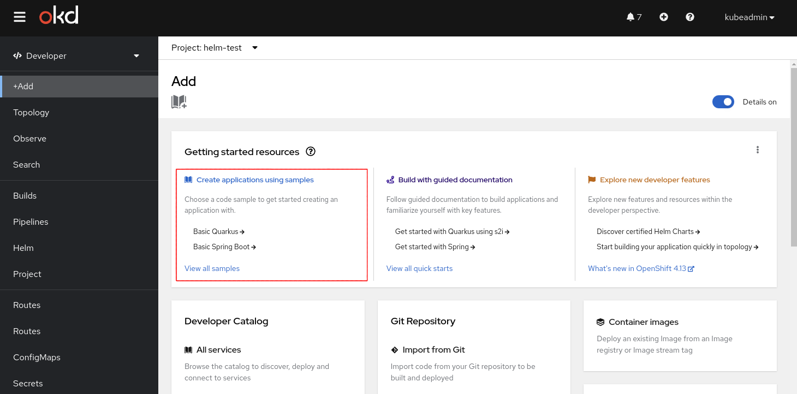
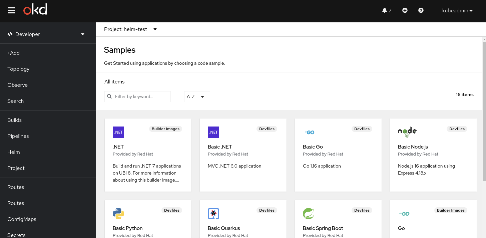
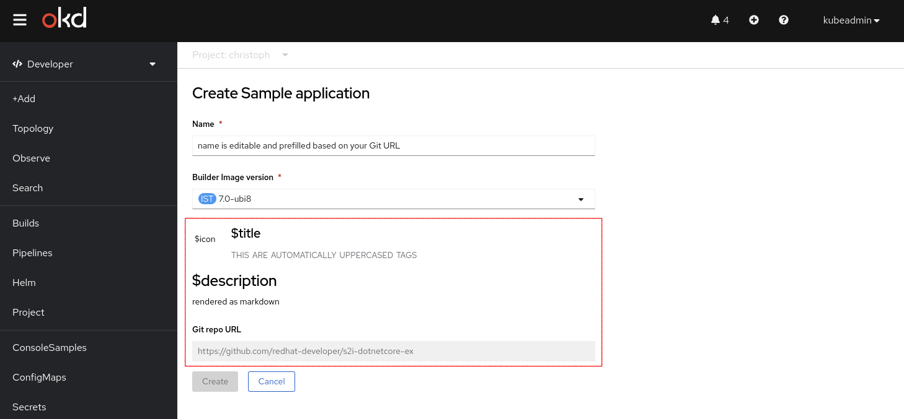

# Samples

## Summary

The Developer Console contains a sample list that helps users initialize workloads and play with features like the "Import from Git" flow.

Until 4.13, the [samples-operator](https://github.com/openshift/cluster-samples-operator) and the external Devfile registry ([registry.devfile.io](https://registry.devfile.io/viewer?types=sample)) provide these samples.

A `ConsoleSample` CRD will allow other teams, operators, and customers to add additional samples to the console.

## Background info

The samples are one of the main entry points to create a Kubernetes resource from the Developer perspective:



The user can select one of the many samples:



When the user selects a sample to import an application from a Git repository:



Currently, this opens a form to import a git repository. Other sample types aren't supported at the moment.

## Motivation

Creating a `ConsoleSample` CRD will promote the samples feature in the Developer Console to an extendable feature similar to [Quick Starts](https://github.com/openshift/enhancements/blob/master/enhancements/console/quick-starts.md). This makes it much easier for other teams to provide their own samples, for example with their operator.

Samples are no longer tied to the exact OpenShift version and could be updated with the operator. Also customers can add their own samples if needed.

This will also allow us to migrate from the (deprecated) [samples-operator](https://github.com/openshift/cluster-samples-operator) to a simple custom resource in the future and to add other sample types in the future.

### User Stories

* As an OpenShift Serverless product manager, I want to provide additional samples that are tied to an operator version, not an OpenShift release, so that these sample are compatible with the operator version and are only visible to the user if the operator is installed.
* As a cluster administrator, I want to add additional samples to the Developer Console sample catalog, so that I can showcase features of the web console to my developers.

### Goals

1. This feature should allow other teams to provide their Developer Console samples without applying them to the sample-operator or the console-operator.

### Non-Goals

1. We don't want to turn off the support for the (deprecated) [samples-operator](https://github.com/openshift/cluster-samples-operator) right now. The console will not provide any samples on its own (in 4.14), but it might be an option to migrate these samples in the future.
2. A way to hide installed samples. Operators creating a sample resource should have a way to opt out of their samples.
3. Localization/translation support for samples is defered.

## Proposal

### Workflow Description

The Console Operator will provide a cluster-wide `ConsoleSample` CRD.

Other operators like the OpenShift Serverless operator will install their own `ConsoleSample` CRs.

The web console will automatically load all `ConsoleSample` CRs and show them in the sample catalog.

Users can select one of samples and follow the import flows to create a demo application.

### API Extensions

The console operator automatically installs a new `ConsoleSample` CRD.

### Risks and Mitigations

#### The OpenShift Console is optional and could be disabled

Other operators should expect that the `ConsoleSample` CRD is unavailable like the other `Console*` CRDs.

### Drawbacks

Another extra (but specific) custom resource just for console samples.

## Design Details

An "Import from Git" example of how we have it today as part of the Builder Images annotation:

```yaml
apiVersion: console.openshift.io/v1
kind: ConsoleSample
metadata:
  name: java-sample
spec:
  title: Java
  abstract: Build and run Java applications using Maven and OpenJDK.
  description: |
    # About this sample
    Build and run Java applications using Maven and OpenJDK.
    # Links
    * [Sample repository](https://github.com/jboss-openshift/openshift-quickstarts)
  icon: data:image;base64,base64 encoded image
  type: Source to Image
  provider: Red Hat
  tags:
  - java
  - jboss
  - openjdk
  source:
    type: GitImport
    gitImport:
      url: https://github.com/jboss-openshift/openshift-quickstarts
```

An "Import container image" example:

```yaml
apiVersion: console.openshift.io/v1
kind: ConsoleSample
metadata:
  name: minimal-ubi-container
spec:
  title: Minimal UBI container
  abstract: Test the minimal Red Hat Universal Base Image (UBI).
  description: |
    # About this sample
    The Red Hat Universal Base Image is free to deploy on Red Hat or non-Red Hat platforms
    and freely redistributable...
  icon: data:image;base64,base64 encoded image
  type: UBI Container
  provider: Red Hat
  source:
    type: ContainerImport
    containerImport:
      image: registry.access.redhat.com/ubi8/ubi-minimal:8.8-860
```

### Attributes

The following constraints are checked in the [openshift/api change](https://github.com/openshift/api/pull/1503) as well:

1. `title` is the display name of the sample. It is required and can have a maximum length of **50** characters.
2. `abstract` is a short teaser the sample. It is required and can have a maximum length of **100** characters.

   Currently, the abstract is shown on the sample card tile below the title and provider
3. `description` is required and can have a maximum length of **4096** characters.
   It is a README.md-like content for additional information, links, pre-conditions, and other instructions.
   It will be rendered as **Markdown** so that it can contain line breaks, links, and other simple formatting.
4. `icon` is an optional base64 encoded image and shown beside the sample title.
   The format must follow the [data: URL format](https://developer.mozilla.org/en-US/docs/Web/HTTP/Basics_of_HTTP/Data_URLs).

   `data:[<mediatype>][;base64],<base64 encoded image>`

   For example:

   `data:image;base64,` plus the base64 encoded SVG image.

   Vector images can also be used. SVG icons must start with:

   `data:image/svg+xml;base64,` plus the base64 encoded SVG image.

   All sample catalog icons will be shown on a white background (also when the dark theme is used).
   The web console ensures that different aspect radios work correctly.
   Currently, the surface of the icon is at most 40x100px.

5. `type` is an optional label to group multiple samples. It can have a maximum length of **20** characters.

   Currently, the type is shown a badge on the sample card tile in the top right corner (see screenshot above).

   Recommendation is a **singular term** that groups samples like "Builder Image", "Devfile" or "Serverless Function".

6. `provider` is an optional label to honor who provides the sample. It can have a maximum length of **20** characters.

   A provider can be a company like "Red Hat" or an organization like "CNCF" or "Knative".

   Currently, the provider is only shown on the sample card tile below the title with the prefix "Provided by " (see screenshot above).

7. `tags` are optional.

   Tags can be used to search for samples in the samples catalog.

   They will be also displayed on the samples details page.

### Source types

The `source` attribute is an union type and will support only two `type`s in 4.14:

1. `GitImport` provides information to import an application from a Git repository.
2. `ContainerImport` provides information to import a container image.

Other types will be ignored by the web console so that it is possible that operators install `type`s and downgrade the cluster when other source types are supported in the future.

#### `GitImport`

All previously supported samples opens a simplified "Import from Git" flow and prefill the Git repository.

When a `GitImport` sample is selected, the same form will be opened and prefilled.

1. The Git `url` is required.
2. An optional Git `revision` to clone a specific branch, tag or commit SHA, etc.
3. An optional `contextDir`, a subfolder in the repo to build the component.

There is no other attribute supported at the moment. It supports only public Git repositories.

```yaml
  source:
    type: GitImport
    gitImport:
      url: https://github.com/openshift-dev-console/nodejs-sample
      revision: main # optional
      contextDir: /backend # optional
```

#### `ContainerImport`

When the user selects a `ContainerImport` sample, the **"Add"** > **"Container images"** page will be opened
and the given container image is prefilled as "Image name from external registry".

Other options like the Resource type (Deployment, DeploymentConfig or Serverless Deployment) will
be selected based on the cluster defaults and the user preferences.

```yaml
  source:
    type: ContainerImport
    containerImport:
      image: registry.access.redhat.com/ubi8/ubi-minimal:8.8-860
```

### Test Plan

Provide e2e tests as part of the console that adds a `ConsoleSample` and verify that it was shown in the UI.

### Graduation Criteria

This feature will be released directly as GA.

The Knative/Serverless team and operator might be the first user of this resource.

#### Dev Preview -> Tech Preview

N/A

This feature should be released directly as GA.

The risk is low since this CRD will not consumed by any operator and similar to existing console CRDs like `ConsoleQuickStart`.

#### Tech Preview -> GA

N/A

This feature should be released directly as GA.

The risk is low since this CRD will not consumed by any operator and similar to existing console CRDs like `ConsoleQuickStart`.

#### Removing a deprecated feature

N/A

### Upgrade / Downgrade Strategy

The console-operator will install the CRD on an upgrade.

Other operators should install the sample resources then automatically.

A downgraded (old) console version will ignore the sample resources.

### Version Skew Strategy

The CRD can be extended with new sample metadata or types in the future.

The web console is the only consumer of this configuration for now and handles the resources just in the frontend. The console operator will not consume or update the sample resources.

Other operators will create and maintain their samples as cluster wide resources.

### Operational Aspects of API Extensions

N/A

#### Failure Modes

N/A

#### Support Procedures

N/A

## Implementation History

* Initial version

## Alternatives

### Add annotations to the Builder images

The console shows samples already for some "Builder Images". For this, the annotation of some ImageStreams was used. It might be possible to add additional annotations to this ImageStreams.

```diff
  kind: ImageStream
  metadata:
    name: java
    annotations:
      samplesRepo: https://github.com/jboss-openshift/openshift-quickstarts
+     serverlessFunctionSampleRepo: https://github.com/knative/...
+     serverlessFunctionSampleTitle: Java Serverless function sample
+     serverlessFunctionSampleDescription: ...
```

### Multiple samples in one sample resource

The CRD could provide multiple samples in one custom resource.
In an initial code review, we decided that a single sample per resource
is more aligned with other custom resources.

```yaml
apiVersion: console.openshift.io/v1
kind: ConsoleSample
metadata:
  name: java-samples
spec:
  samples:
    - type: gitimport
      title: Java
      description:  Build and run Java applications using Maven and OpenJDK.
      provider: Red Hat
      tags:
      - java
      - jboss
      - openjdk
      gitimport:
        url: https://github.com/jboss-openshift/openshift-quickstarts
```

### Using OpenShift Templates

An [OpenShift Template](https://docs.openshift.com/container-platform/4.13/openshift_images/using-templates.html) are also example of how to start application running on OpenShift Container Platform.

The web console supports OpenShift templates. They are also shown in the "Developer Catalog". But the template focuses on creating Kubernetes resources instead of delivering web console features like the git import.
