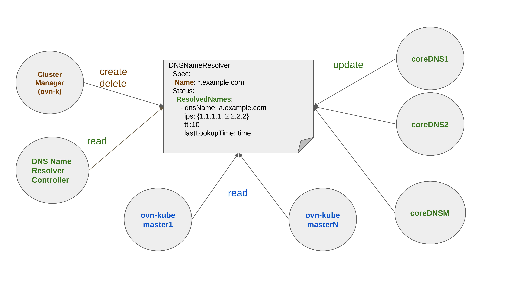

# Improve CoreDNS Integration with EgressFirewall

## Summary

This enhancement improves the integration of CoreDNS with EgressFirewall. With this improved
integration, EgressFirewall will be able to better support DNS names whose associated IP addresses change
and also will be able to provide support for wildcard DNS names.

NOTE: Doing DNS-based denies may have security issues. If a DNS rule denies access to only "example.com", then a proxy
can be set upon some host outside the cluster that will redirect connections to "example.com", and bypass the firewall
rule that way. The only reasonable way to use DNS-based firewall rules is to have a "deny all" rule and add DNS-based allow
exceptions on top of that. Considering this, henceforth only allow rule scenarios have been used in this enhancement
proposal.

## Motivation

Currently, EgressFirewall (OVN-K master) does a DNS lookup of a DNS name based on a default time-to-live (TTL) or the
TTL of the previous lookup (as explained [here](https://docs.openshift.com/container-platform/4.12/networking/ovn_kubernetes_network_provider/configuring-egress-firewall-ovn.html#domain-name-server-resolution_configuring-egress-firewall-ovn)).
OVN-K master then updates the underlying `AddressSet` for the DNS name
referenced by the corresponding ACL rule of the EgressFirewall rule containing the DNS name. However,
if a pod, belonging to the same namespace as that of the EgressFirewall, does a DNS lookup and gets a
different response than the OVN-K master has, then the pod will be incorrectly denied access to
the host. With the current implementation of EgressFirewall, to avoid such a scenario OVN-K master has to
spend way too much time doing DNS lookups to ensure any changes in the IP addresses are not missed or else
the firewall will possibly get out of sync. Thus, the integration between CoreDNS and EgressFirewall needs
to be improved to avoid such a scenario.

If an administrator wants to specifically allow access to all subdomains of some domain then
currently the administrator has to add all the subdomains in the EgressFirewall rules. This becomes
difficult when subdomains are added/removed as each one has to be added/removed individually
from the EgressFirewall rules. Currently, wildcard DNS names are not supported in EgressFirewall. However,
even if the support is added to EgressFirewall to accept wildcard DNS names, the integration between CoreDNS
and EgressFirewall needs to be improved for fully supporting it. A simple DNS lookup of a wildcard DNS name will
not be enough to get the IP addresses of all the subdomains of the wildcard DNS name as each subdomain may have a corresponding
`A` or `AAAA` record. Additionally, the DNS lookup of the wildcard DNS name may also fail to fetch any IP if no `A` or
`AAAA` record exists for the DNS name.

### User Stories

* As an OpenShift cluster administrator, I want to add regular DNS names to EgressFirewall rules, so that I can allow
access to them even if the IP addresses associated with the corresponding DNS records change. 
* As an OpenShift cluster administrator, I want to add wildcard DNS names to EgressFirewall rules, so that I can
allow access to all the subdomains belonging to the wildcard DNS names.

### Goals

* Support allowing access to DNS names even if the IP addresses associated with them changes
* Support usage of wildcard DNS names in EgressFirewall rules.

### Non-Goals

* Support additional DNS resolution functionality in the new CoreDNS plugin. The new plugin will only inspect the
response of DNS resolution by the other existing plugins.
* Support denying of DNS lookups in the new CoreDNS plugin. The new plugin will not stop the DNS lookup itself and will not
respond with a `REFUSED`/`NXDOMAIN` response code if a EgressFirewall rule denies access to the specific DNS name being queried for.

## Proposal

This enhancement proposes to introduce a new CoreDNS [external plugin](https://coredns.io/explugins/) (`ocp_dnsnameresolver`) and a new Custom Resource
(`DNSNameResolver`) to improve the integration of CoreDNS with EgressFirewall. This proposal takes the OVN Interconnect (OVN-IC)
architecture into consideration where there are (possibly) multiple OVN-K masters and a centralized OVN-K cluster manager. The OVN-K cluster manager will
create a `DNSNameResolver` CR for each unique DNS name (both regular and wildcard DNS names) used in
the EgressFirewall rules. The same DNS name may appear in multiple EgressFirewall rules, but only a single `DNSNameResolver` CR object will be used
for a unique DNS name. This CR will be used to store the DNS name along with the current IP addresses, the corresponding
TTL, and the last lookup time. The `DNSNameResolver` CR is meant for communication between
CoreDNS and OVN-K master(s).

The new plugin will inspect each DNS lookup and the corresponding response for the DNS lookup from other
plugins. If the DNS name in the query matches any `DNSNameResolver` CR(s) (regular or wildcard or both), then the
plugin will update the `.status` of the matching `DNSNameResolver` CR(s) with the DNS name along with the IP addresses,
the corresponding TTL, and the last lookup time. The OVN-K master(s) will watch the `DNSNameResolver`
CRs. Whenever the IP addresses are updated for a `DNSNameResolver` CR, the OVN-K master(s) will update the underlying `AddressSet`
referenced by the ACL rule(s) for the corresponding EgressFirewall rule(s).

A new controller (`DNSNameResolver` controller) will keep track of the next lookup time (TTL + last lookup time)
for each regular DNS name and send a DNS lookup
query to CoreDNS when the minimum TTL expires. However, for a wildcard DNS name a DNS lookup cannot be only performed
on the DNS name as it will not return the IP addresses of all the subdomains. The DNS lookup of the wildcard DNS name may fail to return
any IP address as well. If the lookup for the wildcard DNS name fails, then it will retried using the default TTL (30 minutes). If the lookup
succeeds then the details will be added to the `.status` of the corresponding CR. Thus, the lookups will be performed on the DNS names which
are updated in the `.status` of the corresponding wildcard `DNSNameResolver` CRs. When a lookup fails consistently over time, the record will
be pruned as described in the [DNS lookup failure](#dns-lookup-failure) subsection under the [Workflow Description](#workflow-description).

The following `DNSNameResolver` CRD will be added to the `network.openshift.io` api-group.

````go
// DNSNameResolver stores the DNS name resolution information of a DNS name. It can be enabled by the TechPreviewNoUpgrade feature set.
// It can also be enabled by the feature gate DNSNameResolver when using CustomNoUpgrade feature set.
type DNSNameResolver struct {
	metav1.TypeMeta `json:",inline"`

	// metadata is the standard object's metadata.
	// More info: https://git.k8s.io/community/contributors/devel/sig-architecture/api-conventions.md#metadata
	metav1.ObjectMeta `json:"metadata,omitempty"`

	// spec is the specification of the desired behavior of the DNSNameResolver.
	// +kubebuilder:validation:Required
	Spec DNSNameResolverSpec `json:"spec"`
	// status is the most recently observed status of the DNSNameResolver.
	// +optional
	Status DNSNameResolverStatus `json:"status,omitempty"`
}

// DNSNameResolverSpec is a desired state description of DNSNameResolver.
type DNSNameResolverSpec struct {
	// name is the DNS name for which the DNS name resolution information will be stored.
	// For a regular DNS name, only the DNS name resolution information of the regular DNS
	// name will be stored. For a wildcard DNS name, the DNS name resolution information
	// of all the DNS names, that matches the wildcard DNS name, will be stored.
	// For a wildcard DNS name, the '*' will match only one label. Additionally, only a single
	// '*' can be used at the beginning of the wildcard DNS name. For example, '*.example.com.'
	// will match 'sub1.example.com.' but won't match 'sub2.sub1.example.com.'
	// +kubebuilder:validation:Required
	// +kubebuilder:validation:Pattern=^(\*\.)?([A-Za-z0-9]([-A-Za-z0-9]*[A-Za-z0-9])?\.)*[A-Za-z0-9]([-A-Za-z0-9]*[A-Za-z0-9])?\.$
	// +kubebuilder:validation:MaxLength=254
	// +kubebuilder:validation:XValidation:rule="self == oldSelf",message="spec.name is immutable"
	Name string `json:"name"`
}

// DNSNameResolverStatus defines the observed status of DNSNameResolver.
type DNSNameResolverStatus struct {
	// resolvedNames contains a list of matching DNS names and their corresponding IP addresses
	// along with their TTL and last DNS lookup times.
	// +listType=map
	// +listMapKey=dnsName
	// +patchMergeKey=dnsName
	// +patchStrategy=merge
	// +optional
	ResolvedNames []DNSNameResolverStatusItem `json:"resolvedNames,omitempty" patchStrategy:"merge" patchMergeKey:"dnsName"`
}

// DNSNameResolverStatusItem describes the details of a resolved DNS name.
type DNSNameResolverStatusItem struct {
	// conditions provide information about the state of the DNS name.
	// Known .status.conditions.type is: "Degraded"
	// +optional
	// +listType=map
	// +listMapKey=type
	Conditions []metav1.Condition `json:"conditions,omitempty"`
	// dnsName is the resolved DNS name matching the name field of DNSNameResolverSpec. This field can
	// store both regular and wildcard DNS names which match the spec.name field. When the spec.name
	// field contains a regular DNS name, this field will store the same regular DNS name after it is
	// successfully resolved. When the spec.name field contains a wildcard DNS name, each resolvedName.dnsName
	// will store the regular DNS names which match the wildcard DNS name and have been successfully resolved.
	// If the wildcard DNS name can also be successfully resolved, then this field will store the wildcard
	// DNS name as well.
	// +kubebuilder:validation:Required
	// +kubebuilder:validation:Pattern=^(\*\.)?([A-Za-z0-9]([-A-Za-z0-9]*[A-Za-z0-9])?\.)*[A-Za-z0-9]([-A-Za-z0-9]*[A-Za-z0-9])?\.$
	// +kubebuilder:validation:MaxLength=254
	DNSName string `json:"dnsName"`
	// resolvedAddresses gives the list of associated IP addresses and their corresponding TTLs and last
	// lookup times for the dnsName.
	// +kubebuilder:validation:Required
	// +listType=map
	// +listMapKey=ip
	ResolvedAddresses []DNSNameResolverInfo `json:"resolvedAddresses"`
	// resolutionFailures keeps the count of how many consecutive times the DNS resolution failed
	// for the dnsName. If the DNS resolution succeeds then the field will be set to zero. Upon
	// every failure, the value of the field will be incremented by one. The details about the DNS
	// name will be removed, if the value of resolutionFailures reaches 5 and the TTL of all the
	// associated IP addresses have expired.
	ResolutionFailures int32 `json:"resolutionFailures,omitempty"`
}

type DNSNameResolverInfo struct {
	// ip is an IP address associated with the dnsName. The validity of the IP address expires after
	// lastLookupTime + ttlSeconds. To refresh the information a DNS lookup will be performed on the
	// expiration of the IP address's validity. If the information is not refreshed then it will be
	// removed with a grace period after the expiration of the IP address's validity.
	// +kubebuilder:validation:Required
	IP string `json:"ip"`
	// ttlSeconds is the time-to-live value of the IP address. The validity of the IP address expires after
	// lastLookupTime + ttlSeconds. On a successful DNS lookup the value of this field will be updated with
	// the current time-to-live value. If the information is not refreshed then it will be removed with a
	// grace period after the expiration of the IP address's validity.
	// +kubebuilder:validation:Required
	TTLSeconds int32 `json:"ttlSeconds"`
	// lastLookupTime is the timestamp when the last DNS lookup was completed successfully. The validity of
	// the IP address expires after lastLookupTime + ttlSeconds. The value of this field will be updated to
	// the current time on a successful DNS lookup. If the information is not refreshed then it will be
	// removed with a grace period after the expiration of the IP address's validity.
	// +kubebuilder:validation:Required
	LastLookupTime *metav1.Time `json:"lastLookupTime"`
}
````

### Workflow Description

The workflows for the different components related to DNSNameResolver events are explained in this section. The workflow
for those events is shown in the following diagram with an example `DNSNameResolver` CR:



#### Workflow of OVN-K cluster manager

The following pseudocode explains the workflow of the OVN-K cluster manager:
```shell
watch(EgressFirewall)

if match(event.type, "create"):

	for each rule in obj.egress:
		if rule.to.dnsName != ""  && check_dns_name_resolver_exists(rule.to.dnsName) == false:
			create_dns_name_resolver(rule.to.dnsName)

if match(event.type, "update"):

	for each rule in old_obj.egress:
		if rule.to.dnsName != "" && check_dns_name_used_in_egress_firewall(rule.to.dnsName, new_obj) == false
			&& check_dns_name_used_in_any_egress_firewall(rule.to.dnsName) == false:
			delete_dns_name_resolver(rule.to.dnsName)

	for each rule in new_obj.egress:
		if rule.to.dnsName != "" && check_dns_name_used_in_egress_firewall(rule.to.dnsName, old_obj) == false
			&& check_dns_name_resolver_exists(rule.to.dnsName) == false:
			create_dns_name_resolver(rule.to.dnsName)

else if match(event.type, "delete"):

	for each rule in obj.egress:
		if rule.to.dnsName != "" && check_dns_name_used_in_any_egress_firewall(rule.to.dnsName) == false:
			delete_dns_name_resolver(rule.to.dnsName)
```

* The OVN-K cluster manager will watch for events related to `EgressFirewall` objects.
* When an OpenShift cluster administrator creates/updates an EgressFirewall resource for a namespace and adds rule(s) containing DNS name(s),
the cluster manager will receive the create/update event.
* The OVN-K cluster manager will create corresponding `DNSNameResolver` CRs for each of the DNS names in the EgressFirewall rules, if not
already created. Each CR will be created in the `openshift-ovn-kubernetes` namespace. The name of the CR will be assigned using a hash
function (similar to the ComputeHash [here](https://github.com/openshift/kubernetes/blob/master/pkg/controller/controller_utils.go#L1157-L1172))
prefixed by `dns-`. The input to the hash function will be the DNS name. The `.spec.name` field of the CR will be set to the DNS name along with a trailing period.
The trailing period is added because DNS servers store DNS names with a trailing period. Thus, to make it consistent, and also for ease of matching,
the `spec.name` will be set with a trailing period.
* When an OpenShift cluster administrator deletes an EgressFirewall resource for a namespace containing rule(s) for DNS name(s)
OR updates an EgressFirewall resource for a namespace and deletes rule(s) containing DNS name(s), the cluster manager will receive the delete/update event.
* The cluster manager will then check if the same DNS names are also used in the EgressFirewall rules in other namespaces. If the
DNS names are not used, then the cluster manager will delete the corresponding `DNSNameResolver` CRs.

#### Workflow of `DNSNameResolver` controller

The following pseudocode explains the workflow of the `DNSNameResolver` controller:
```shell
watch(DNSNameResolver)
run_dns_resolution_in_background()

if match(event.type, "create") || match(event.type, "update"):

	if check_dns_name_added(obj.spec.name) == false:
		add_and_resolve_dns_name(obj.spec.name)

	for each resolvedName in obj.status.resolvedNames:
		ensure_dns_name_added(resolvedName)
	
	if removal_of_ips_required(obj):
		update_dns_resolver(obj)
		return

	remaining_time_till_grace_period, is_expiring = grace_period_expires_after(obj)

	if is_expiring:
		reconcile_event_after(remaining_time_till_grace_period)
		return

else if match(event.type, "delete"):

	if is_wildcard(obj.spec.name) == true
		|| (is_wildcard(obj.spec.name) == false && match_wildcard_dns_name(obj.spec.name) == false):
		delete_dns_name(obj.spec.name)

	if is_wildcard(obj.spec.name) == true:
		for each resolvedName in obj.status.resolvedNames:
			if resolvedName.dnsName != obj.spec.name && match_regular_dns_name(resolvedName.dnsName) == false:
				delete_dns_name(obj.spec.name)
```
* The `DNSNameResolver` controller will run dns resolution of DNS names in the background which will refresh the `.status` field of the `DNSNameResolver`
CRs upon expiration of the validity of the corresponding IP addresses associated to the resolved names. As the CoreDNS pods are configured using the upstream
nameservers present in the node host's `/etc/resolv.conf` file, the upstream nameservers for different CoreDNS pods may serve different IP addresses (possibly
with different TTLs) for the same DNS name. Thus, while refreshing the information of a DNS name, the DNS lookup requests are sent to a maximum of 5 randomly
chosen CoreDNS pods to get as many different associated IP addresses for the DNS name as possible. However, if the DNS name is associated with only one IP
address or if the DNS name is being looked up for the first time, then it will be sent to only one randomly chosen CoreDNS pod.
* The `DNSNameResolver` controller will watch for the events related to `DNSNameResolver` CRs.
* After it receives the create/update events, it will perform DNS lookup for each of the DNS names corresponding to the `DNSNameResolver` CRs,
if the details of the DNS names are not already added.
* The `DNSNameResolver` controller will store the regular DNS name matching the `.spec.name` field of a `DNSNameResolver` CR and the
corresponding current IP addresses along with the the TTL and the last lookup time for each IP address. Using the TTL and last lookup time of all the associated
IP addresses of a DNS name, a next lookup time for the DNS name is also stored. Based on the next lookup time, the controller will perform DNS
lookups to get the latest IP addresses and TTL information. The DNS lookup will be intercepted by the `ocp_dnsnameresolver` plugin and will enforce an
update of the `.status` of the CR.
* The controller will also store the wildcard DNS name which matches the `.spec.name` field of a `DNSNameResolver` CR. If the DNS lookup is
successful for the wildcard DNS name, then the DNS name will be stored with the corresponding current IP addresses along with the TTL and the last lookup time
for each IP address. If the DNS lookup is not successful, then it will be retried after a default TTL (30 minutes). The `DNSNameResolver` controller will
also store the regular DNS names, matching the wildcard DNS name's `.status.resolvedNames[*].dnsName` field, with the corresponding current IP addresses along
with the TTL and the last time to lookup for each IP address. Using the TTL and last lookup time of all the associated IP addresses of a DNS name, a next lookup
time for the DNS name is also stored. Based on the next lookup time, the controller will follow the same method as that of the regular DNS names to get the
latest IP addresses and TTL information.
* The controller will also check if any IP address is needed to be removed from the `.status` field. The validity of any IP address expires after the
corresponding next lookup time (TTL + last lookup time). However, the IP address may still be in use. Thus, a grace period of 5 seconds is provided for
each IP address and on expiration of the grace period the IP address will be removed. If any IP address satisfies this condition then it is removed from
the `.status` of the `DNSNameResolver` CR and the object is updated.
* If the validity (TTL + last lookup time) of any of the IP addresses have expired, but the grace period of 5 seconds is still not over, then the same event
will be reconciled after the grace period has expired. This is done so that during the next reconcile the IP addresses can be removed from the `.status` of the
`DNSNameResolver` CR.
* On receiving the delete event, the `DNSNameResolver` controller will remove the details stored regarding the `DNSNameResolver` CRs.
* If the deleted event is for a `DNSNameResolver` corresponding to a regular DNS name, the `DNSNameResolver` controller will remove the details of a regular DNS
name, if it doesn't match a `DNSNameResolver` CR corresponding to a  wildcard DNS name.
* If the deleted event is for a `DNSNameResolver` corresponding to a wildcard DNS name, the `DNSNameResolver` controller will remove the details of a wildcard DNS
name. It will also remove the details of the regular DNS names added to the `.status` of the CR, if each of them doesn't match a `DNSNameResolver` CR corresponding
to a  wildcard DNS name.

#### Workflow of `ocp_dnsnameresolver` CoreDNS plugin

The following pseudocodes explain the workflow of the `ocp_dnsnameresolver` CoreDNS plugin:

##### Watch
```shell
watch(DNSNameResolver)

if match(event.type, "create"):

	if is_wildcard(obj.spec.name) == true:
		add_wildcard_dns_name(obj.spec.name)
	else
		add_regular_dns_name(obj.spec.name)

else if match(event.type, "delete"):

	if is_wildcard(obj.spec.name) == true:
		delete_wildcard_dns_name(obj.spec.name)
	else
		delete_regular_dns_name(obj.spec.name)
```

* The `ocp_dnsnameresolver` CoreDNS plugin will watch for the events related to `DNSNameResolver` CRs and will store the DNS name along
with the corresponding CR name.
* On receiving the delete event, the `ocp_dnsnameresolver` plugin will remove the details stored regarding the `DNSNameResolver` CRs.

##### DNS lookup interception

```shell
response = get_response_from_plugin_chain(dnsName)

if match_regular_dns_name(dnsName) == false || match_wildcard_dns_name(dnsName) == false:
	return response

if resolution_failed(response) == false:

	ips, ttls = get_ips_and_ttls(response)
	for each ttl in ttls {
		if ttl = 0:
			ttl = min_ttl
	}
	
	if match_regular_dns_name(dnsName) == true:
		objName = get_regular_dns_name_resolver_name(dnsName)
		update_dns_resolver_success(objName, dnsName, ips, ttls, response)
	
	if match_wildcard_dns_name(dnsName) == true:
		objName = get_wildcard_dns_name_resolver_name(dnsName)
		update_dns_resolver_success(objName, dnsName, ips, ttls, response)

else
  	
	if match_regular_dns_name(dnsName) == true:
		objName = get_regular_dns_name_resolver_name(dnsName)
		update_dns_resolver_failure(objName, dnsName, response)
	
	if match_wildcard_dns_name(dnsName) == true:
		objName = get_wildcard_dns_name_resolver_name(dnsName)
		update_dns_resolver_failure(objName, dnsName, response)

return response
```

* The `ocp_dnsnameresolver` CoreDNS plugin will intercept the request and the response for the DNS lookups from all the pods. If the DNS name matches
any of the `DNSNameResolver` CRs, then the plugin will update the corresponding `.status`. 
* The plugin gets the response of a DNS lookup from other plugins and checks the response code returned. 
* If it is a success response code, then the plugin checks whether the DNS lookup matches any `DNSNameResolver` CR belonging to a regular DNS name
or a wildcard DNS name or both (in the case of a regular DNS name lookup). The IP addresses and the corresponding TTLs are obtained. If the
TTL value is zero then it is set to a minimum TTL value of 5 seconds. This is done to avoid immediate DNS lookups by the `DNSNameResolver`
controller for the same DNS names. If any of the `DNSNameResolver` CRs match, then the plugin proceeds with the update process of the `.status` of the
`DNSNameResolver` CR when the DNS lookup is successful.
* If it is a failure response code, then the plugin checks whether the DNS lookup matches any `DNSNameResolver` CR belonging to a regular DNS name
or a wildcard DNS name or both (in the case of a regular DNS name lookup). If any of the `DNSNameResolver` CRs match, then the plugin proceeds with
the update process of the `.status` of the `DNSNameResolver` CR when the DNS lookup is unsuccessful.
* The plugin then returns the same response received from the other plugins.

##### Successful DNS lookup

```shell
update_dns_resolver_success(objName, dnsName, ips, ttls, response):
	obj = get_dns_name_resolver(objName)
	for each resolvedName in obj.status.resolvedNames:
		
		if resolvedName.dnsName == dnsName:
			if is_wildcard(dnsName):
				wildcardResolvedName = resolvedName
			unmatched_ips = []
			unmatched_ttls = []
			for each ip, ttl in (ips, ttls):
				index, matched = matches_any_ip(resolvedName.info, ip)
				if matched:
					if match_next_lookup_time(resolvedName.info[index].ttlSeconds, resolvedName.info[index].lastLookupTime, ttl):
						skip_update_of_resolvedName_info
					else
						resolvedName.info[index].ttlSeconds = ttl
						resolvedName.info[index].lastLookupTime = now()
				else
					add_ip(unmatched_ips, ip)
					add_ttl(unmatched_ttls, ttl)
			if has_ips_and_ttls(unmatched_ips, unmatched_ttls) {
				add_dns_info(resolvedName.info, unmatched_ips, unmatched_ttls)
			}
			resolvedName.resolutionFailures = 0
			cond = condition{type: "Degraded", status: false, reason: success_reason(response), message: success_message(response)}
			add_condition(resolvedName.conditions, cond)

		else if is_wildcard(obj.spec.name) && resolvedName.dnsName == obj.spec.name && is_regular(dnsName)
			&& resolvedName_info_ips_contain_all_ips_and_match_next_lookup_times(resolvedName.info, ips, ttls, now()):
			skip_update_of_resolvedName
		
		else if is_wildcard(dnsName)
			&& resolvedName_info_ips_contain_all_ips_and_match_next_lookup_times(
				wildcardResolvedName.info, resolvedName.info[*].ip, resolvedName.info[*].ttlSeconds, resolvedName.info[*].lastLookTime):
			remove(obj.status.resolvedNames, resolvedName)
	
	update_status_dns_name_resolver(obj)
```

* If a regular DNS name in the lookup matches with a `DNSNameResolver` CR corresponding to a regular DNS name, then the `.status` of
the `DNSNameResolver` CR will be updated with the DNS name and the corresponding current IP addresses along with the TTL and the current time
as the last lookup time for each IP address.
* If a regular DNS name in the lookup matches with a `DNSNameResolver` CR corresponding to a wildcard DNS name, then the `.status` of
the `DNSNameResolver` CR will not be updated, if the set of IP addresses received in the response is a subset of the wildcard DNS name's associated
IP addresses and the corresponding next lookup times of each IP address match. Otherwise, the plugin will update the `.status` with the regular
DNS name and the corresponding current IP addresses along with the TTL and the current time as the last lookup time for each IP address.
* If the DNS lookup is for a wildcard DNS name and it matches with the `DNSNameResolver` CR corresponding to the wildcard DNS name,
then the `ocp_dnsnameresolver` plugin will update the `.status` of the corresponding `DNSNameResolver` CR with the wildcard DNS name
and the corresponding current IP addresses along with the TTL and the current time as the last lookup time for each IP address.
* If the set of associated IP addresses of any other regular DNS name is a subset of the wildcard DNS name's associated IP addresses and the corresponding
next lookup time (TTL + last lookup time) of each IP address match, then the details of the regular DNS name will be removed.
* However, the updates will take place if there is a change in the next lookup time (TTL + last lookup time) for the existing IP addresses
or if the current IP addresses are different from the existing IP addresses. For the latter, the current IP addresses are added to the existing
IP addresses of the DNS name. This will take care of the scenario where different CoreDNS pods get different subsets of the IP addresses in the
response to the DNS lookup of the same DNS name.
* Additionally, the exact matching of the next lookup time may never be successful. If the existing next lookup time of a DNS name lies
within a threshold value (say 1 second) of the new lookup time, specifically lies in the range defined by
`[new lookup time - threshold duration, new lookup time + threshold duration]`, then they are considered as same.
* The `Degraded` condition of the DNS name will be set to `false` along with the success reason and message. The `resolutionFailures` field for
the DNS name will be set to 0.

##### DNS lookup failure

```shell
update_dns_resolver_failure(objName, dnsName, response):
	obj = get_dns_name_resolver(objName)
	for each resolvedName in obj.status.resolvedNames:
		if resolvedName.dnsName == dnsName:
			if resolvedName.resolutionFailures >= 5 && has_ttl_expired(resolvedName.resolvedAddresses) == true:
				remove(obj.status.resolvedNames, resolvedName)
			else
				for each dns_info in resolvedName.info:
					if matches_next_lookup_time(dns_info.ttlSeconds, dns_info.lastLookupTime, now()):
						dns_info.ttlSeconds = min_ttl
						dns_info.lastLookupTime = now()
				resolvedName.resolutionFailures = resolvedName.resolutionFailures + 1
				cond = condition{type: "Degraded", status: true, reason: failure_reason(response), message: failure_message(response)}
				add_condition(resolvedName.conditions, cond)
	
	update_status_dns_name_resolver(obj)
```

* If a DNS name (regular or wildcard) matches a `DNSNameResolver` CR, then the corresponding resolved name field in the `.status` will be updated.
* If the corresponding `resolutionFailures` field has reached a threshold value of 5 and TTL of all associated IP addresses have expired, then the
details of the DNS name will be removed from the
`.status` of the `DNSNameResolver` CR.
* Otherwise, the `ttlSeconds` field will be set to the minimum TTL value of 5 seconds and the `lastLookupTime` time will be set to the current time
for each IP address whose next lookup time matches the current time. The `resolutionFailures` will be incremented by one. Additionally, the `Degraded`
condition of the DNS name will be set to `true` along with the failure reason and message.


#### Workflow of OVN-K master(s)

The following pseudocode explains the workflow of the OVN-K master(s):
```shell
watch(DNSNameResolver)

if match(event.type, "create") || match(event.type, "update"):

	ensure_address_set(obj.spec.name)

	ips = []
	for each resolvedName in obj.status.resolvedNames:
		add_ips(ips, resolvedName.ips)

	set_ips_of_address_set(obj.spec.name, ips)

else if match(event.type, "delete"):

  	destroy_address_set(obj.spec.name)
```

* The OVN-K master(s) will watch for the events related to the `DNSNameResolver` CRs.
* When the OVN-K master(s) receive(s) the create/update events, the master(s) will get the IP addresses related to the corresponding DNS name
from the `.status` of the `DNSNameResolver` CR. The the OVN-K master(s) will then update the `AddressSet` for the DNS name, which is linked
with the ACL rule(s) for the corresponding EgressFirewall rule(s).
* When the OVN-K master(s) receive(s) the delete events, the OVN-K master(s) will delete the ACL rule(s) corresponding to the EgressFirewall
rule(s) containing the DNS name(s).  The OVN-K master(s) will also delete the corresponding `AddressSet` for the corresponding DNS name.


#### Variation [optional]


### API Extensions

The validation of [`DNSName`](https://github.com/ovn-org/ovn-kubernetes/blob/master/go-controller/pkg/crd/egressfirewall/v1/types.go#L74-L76) field in
`EgressFirewallDestination` will be updated to accept wildcard DNS names as well. It will be updated from `^([A-Za-z0-9-]+\.)*[A-Za-z0-9-]+\.?$` which
accepts only regular DNS names to `^(\*\.)?([A-Za-z0-9]([-A-Za-z0-9]*[A-Za-z0-9])?\.)*[A-Za-z0-9]([-A-Za-z0-9]*[A-Za-z0-9])?\.?$`. This updated regex
also validates that a label in a DNS name does not start or end with a `-`.

````go
// EgressFirewallDestination is the endpoint that traffic is either allowed or denied to
type EgressFirewallDestination struct {
	// ..

	// dnsName is the domain name to allow/deny traffic to. If this is set, cidrSelector must be unset.
	// For a wildcard DNS name, the '*' will match only one label. Additionally, only a single '*' can be
	// used at the beginning of the wildcard DNS name. For example, '*.example.com' will match 'sub1.example.com'
	// but won't match 'sub2.sub1.example.com'
	// +kubebuilder:validation:Pattern=^(\*\.)?([A-Za-z0-9]([-A-Za-z0-9]*[A-Za-z0-9])?\.)*[A-Za-z0-9]([-A-Za-z0-9]*[A-Za-z0-9])?\.?$
	DNSName string `json:"dnsName,omitempty"`
	// ..
}
````
The details of the `DNSNameResolver` CRD can be found in the [Proposal](#proposal) section.


### Implementation Details/Notes/Constraints

The implementation changes needed for the proposed enhancement are documented in this section for each of the components.

#### Cluster DNS Operator

Cluster DNS Operator will deploy CoreDNS with the `ocp_dnsnameresolver` plugin enabled by adding it to the corefile. For the EgressFirewall rules to
apply consistently, even for DNS names that are resolved by custom upstream nameservers, it will be added to all server blocks in the corefile. As the
plugin will watch and update the `DNSNameResolver` CRs in the `network.openshift.io` api-group, proper RBAC permissions will be needed
to be added to the `ClusterRole` for CoreDNS.

The new `DNSNameResolver` controller will be added to the Cluster DNS Operator. The controller will watch the `DNSNameResolver` CRs,
and will send DNS lookup requests for the `spec.name` field. It will also re-resolve the `status.resolvedNames[*].dnsName` fields based on the
corresponding next lookup time (TTL + last lookup time).

For wildcard DNS names, the controller will query for the DNS names that get added to the `.status` of the corresponding `DNSNameResolver` CR,
including the wildcard DNS name, even if it doesn't get added to the `.status`.

The controller will also remove the IP addresses whose validity has expired from the `.status` field. However, the removal will happen after a
grace period of 5 seconds post the validity expiration.

#### CoreDNS

The new external plugin `ocp_dnsnameresolver` will be added to a new github repository. The plugin will be enabled by adding its details in the `plugin.cfg` file
of the CoreDNS repository. As the plugin will inspect the DNS lookup queries and response from other plugins, it needs to be added before the other plugins
(namely `forward` plugin) which takes care of the DNS lookups for the DNS names external to the cluster.

The `ocp_dnsnameresolver` plugin will watch the `DNSNameResolver` CRs and whenever there is a DNS lookup which matches one of the `DNSNameResolver`
CRs (either regular or wildcard DNS names or both), then it will update the `.status` of the `DNSNameResolver` CR(s) if there's any change
in the corresponding IP addresses and/or the next lookup time information (TTL + last lookup time). The process is explained in the [Workflow Description](#workflow-description) section.

`SharedIndexInformer` will be used for tracking events related to `DNSNameResolver` CRs. The details about the regular and wildcard DNS names will be stored
in two separate maps by the plugin. Whenever there is a DNS lookup, if there is no `DNSNameResolver` CRs created, then the `ocp_dnsnameresolver` plugin will just
send the received response to the lookup. A DNS name will be checked for a match in both the maps. If there is no match then also the plugin will just send the
received response to the lookup. However, when a match is found (in either of the maps or in both), then the corresponding `DNSNameResolver` CR is updated
with the current IP addresses along with the corresponding TTL and current time as the last lookup time, if the same information is not already available.

The plugin will ensure that the list of the DNS names to lookup for a wildcard DNS name does not become stale if a DNS name belonging its subdomain is removed.
To achieve this a retry counter (`resolutionFailures`) will be used for the DNS name lookups. If the lookup fails for a DNS name listed in the `.status` of a
`DNSNameResolver` CR for 5 times, then the DNS name will be removed from the `.status` by the plugin. However, the DNS lookup will
only fail if the corresponding wildcard DNS name does not have an `A` or `AAAA` record. Otherwise, the response will be same as the IP addresses associated with
the `A` or `AAAA` record of the wildcard DNS name.

#### OVN-K cluster manager

Add the support of a new flag `--enable-dns-name-resolver` to configure the use of `DNSNameResolver` CRD with OVN-K.

For every unique DNS name used in EgressFirewall rules, OVN-K cluster manager will create a corresponding `DNSNameResolver` CR.
The name of the CR will be assigned using a hash function (similar to the ComputeHash
[here](https://github.com/openshift/kubernetes/blob/master/pkg/controller/controller_utils.go#L1157-L1172))
prefixed by `dns-`. The input to the hash function will be the DNS name. It will also delete a `DNSNameResolver` CR, when all the rules containing
the corresponding DNS name are deleted.

#### OVN-K master(s)

Add the support of a new flag `--enable-dns-name-resolver` to configure the use of `DNSNameResolver` CRD with OVN-K.

The OVN-K master(s) will watch the `DNSNameResolver` CRs. Whenever the `.status` of the CRs will be updated with new IP addresses and corresponding
TTL information for a DNS name, OVN-K master(s) will update the `AddressSet` mapped to the DNS name. This `AddressSet` will be linked
to the ACL rule(s) for the EgressFirewall rule(s) in which the DNS name is used. This will ensure that the latest IP addresses are always updated in
the `AddressSets`.

#### Cluster Network Operator

To add the support of `DNSNameResolver` CRD in OVN-K, add the flag `--enable-dns-name-resolver` to the corresponding OVN-K pods.


### Risks and Mitigations

* The `DNSNameResolver` CR will be created by OVN-K Cluster manager whenever a new DNS name is used in a EgressFirewall rule. The CR will be deleted
when the corresponding DNS name is not used in any of the EgressFirewall rules. The `DNSNameResolver` CR should not be modified (created or deleted or
updated) by a user. Doing so may lead to undesired behavior of EgressFirewall.
* During the upgrade process if the OVN-K cluster manager and master pods are upgraded first and then the Cluster DNS operator and the CoreDNS pods, the
EgressFirewall functionality may break. The details can be found in [Upgrade / Downgrade Strategy](#upgrade--downgrade-strategy) section

### Drawbacks

* Whenever there's a change in the IP addresses or the next lookup time (TTL + last lookup time) for a DNS name, the additional step of updating the
related `DNSNameResolver` CRs will be executed. This will add some delay to the DNS lookup process. However, this will only
happen whenever there's a change in the DNS information.
* For wildcard DNS names, it is not possible to pre-emptively find out the matching regular DNS names which have DNS records in the upstream nameservers.
For these regular DNS names the first lookup may originate from a workload pod, in which case the pod may
see an initial delay until the underlying ACL rules are updated with the corresponding IP addresses. However, this will happen only for the first DNS lookup
of a particular DNS name by any pod. Subsequently, it will be handled by the `DNSNameResolver` controller to keep the IP addresses updated.


## Design Details

### Open Questions [optional]

### Test Plan

* This enhancement will be tested through e2e tests by adding EgressFirewall rules containing regular DNS names
and wildcard DNS names. The tests will be added to the `openshift/origin` repository.
* Testing the feature where IP addresses are changed may be a little bit tricky as this will probably include
creation of DNS records and then changing the IP addresses of the DNS records through the e2e tests.

### Graduation Criteria

This feature will initially be released as Tech Preview only.

#### Dev Preview -> Tech Preview

N.A. This feature will go directly to Tech Preview.

#### Tech Preview -> GA (Future work)

* Incorporate the feedback received on the Tech Preview version.
* OpenShift documentation is needed to be updated.
* UTs and e2e tests need to cover all the edge case scenarios.

#### Removing a deprecated feature


### Upgrade / Downgrade Strategy

Upgrade expectations:
* On upgrade, the OVN-K cluster manager will create the corresponding `DNSNameResolver` CRs for each DNS name in the
existing EgressFirewall resources. The `DNSNameResolver` controller will start the DNS lookups for the `DNSNameResolver` CRs
and the `ocp_dnsnameresolver` plugin will also start updating the `.status` fields of the `DNSNameResolver` CRs. The scenarios arising
out of the order of the update of the various components are discussed in [Version Skew Strategy](#version-skew-strategy)

Downgrade expectations:
* On downgrade, the `DNSNameResolver` CRs may still remain. However, these CRs would not have any impact on how
EgressFirewall ACL rules are implemented in the downgraded cluster. Deleting the CR Definition of `DNSNameResolver`
from the cluster would remove all the `DNSNameResolver` CRs.

### Version Skew Strategy

The following 2 scenarios may occur during the upgrade process:
* Scenario 1: The Cluster DNS operator and the CoreDNS pods are upgraded first and then the OVN-K cluster manager and master pods.

  In this scenario, the `ocp_dnsnameresolver` CoreDNS plugin will start inspecting each DNS lookup before the `DNSNameResolver`
  CRs are created by the OVN-K cluster manager. The plugin will just respond with the response received from other plugins for
  the DNS lookups. As OVN-K master will be continuing the DNS lookups for DNS names with expired TTLs, CoreDNS will
  also be responding with the corresponding IP addresses and the TTLs, and the EgressFirewall functionality will still continue to work as before
  the start of the upgrade.

* Scenario 2: The OVN-K cluster manager and master pods are upgraded first and then the Cluster DNS operator and the CoreDNS pods.

  In this scenario, the OVN-K cluster manager will create `DNSNameResolver` CRs for each unique DNS name used in EgressFirewall rules.
  However, as the Cluster DNS operator and the CoreDNS pods are still not upgraded, CoreDNS pods will not run the
  `ocp_dnsnameresolver` plugin. Thus, the EgressFirewall functionality will be broken in this scenario.

### Operational Aspects of API Extensions


#### Failure Modes


#### Support Procedures


## Implementation History


## Alternatives

The following solutions are alternatives for the proposed solution.

### [The existing system](https://docs.openshift.com/container-platform/4.12/networking/ovn_kubernetes_network_provider/configuring-egress-firewall-ovn.html#domain-name-server-resolution_configuring-egress-firewall-ovn)

In the existing system, OVN-K polls for each DNS name used in EgressFirewall rules based on the corresponding TTL. When there is a change in the
associated IP addresses then the `AddressSet` corresponding to each DNS name is updated.

#### Pros of the existing system

* Works well for regular DNS names with infrequent IP changes.

#### Cons of the existing system

* Wildcard DNS names are not supported.
* EgressFirewall rules with DNS names with frequent IP change may not be properly enforced.

### SOCKS or HTTP proxy

Users/customers can use a SOCKS or HTTP proxy for DNS requests. The proxy can be configured to allow or deny DNS names.

#### Pros of SOCKS or HTTP proxy

* Works well for DNS names with frequent IP changes.

#### Cons of SOCKS or HTTP proxy

* Not part of core OpenShift services.
* Less transparent for clients.


### Modify DNS response

The new CoreDNS plugin not only snoops on the DNS requests, but modifies the response based on the EgressFirewall rules. If a client requests for
a denied DNS name then the DNS response with `REFUSED` error code.

#### Pros of modifying DNS response

* Works well for DNS names with frequent IP changes.

#### Cons of modifying DNS response

* As mentioned previously, deny rules for DNS names have some problems.
* If only allow rules are supported, then all the DNS requests for names which are not mentioned in the allow rules should be sent a response with
`REFUSED` error code. This may not be obvious for the users.
* If client uses different DNS resolver then this will not work.


### [DNS Flow](https://github.com/freedge/dnsflow)

DNS Flow uses [dnstap](https://coredns.io/plugins/dnstap/) CoreDNS plugin to mirror all the DNS traffic to the `dnsflow` DaemonSet. Every 10 seconds, a
`dnsflow` pod lists the pod IP addresses for a namespace and maps the DNS name, used in the EgressFirewall allow rule for that namespace, to all the
pod IP addresses for that namespace. If the DNS name is used in the EgressFirewall allow rule for other namespaces, then all pod IP addresses of those namespaces
will also be mapped to the DNS name. When the DNS name in the DNS traffic matches the DNS name in an EgressFirewall allow rule then ovs allow rule
is added by the `dnsflow` pod by directly calling ovs-ofctl.

#### Pros of DNS Flow

* Works well for DNS names with frequent IP changes.

#### Cons of DNS Flow

* Additional delay is added due to receiving the DNS traffic through a socket connection on a separate pod.
* The pod IP addresses and EgressFirewall allow rules are checked every 10 seconds. Any changes in between will not be reflected in the ovs rules immediately.
* The existing ovs rules are not removed if an EgressFirewall allow rule is removed.

### [Cilium](https://docs.cilium.io/en/latest/security/policy/language/#dns-based)

A Cilium agent runs on each node and a DNS Proxy is provided in each agent. The proxy records the IP addresses related to Egress DNS policies and uses
them to enforce the DNS policies. The Cilium agent also [re-resolves](https://github.com/cilium/cilium/blob/HEAD/pkg/policy/api/egress.go#L137-L161)
the DNS names on a short interval of time (5 seconds) ignoring their TTL. The IP addresses are used in the underlying rules for the Egress policies. Only DNS
allow rules are supported by Cilium.


#### Pros of Cilium

* Works well for DNS names with frequent IP changes.
* Wildcard DNS names are supported. 

#### Cons of Cilium

* Additional delay added for sending the DNS traffic to the DNS proxy on the Cilium agent for recording the IP addresses related to Egress DNS policies.
* Other limitations are mentioned [here](https://github.com/cilium/cilium/blob/HEAD/pkg/policy/api/egress.go#L151-L158)


### gRPC connection between OVN-K and CoreDNS

Communication between OVN-K master and CoreDNS happens over a gRPC connection rather than the proposed `DNSNameResolver` CR. Whenever there's a DNS
lookup for a DNS Name which is used in an EgressFirewall rule and the IP addresses associated with DNS name changes, then CoreDNS sends this information to the
OVN-K master. After the underlying ACL rules are updated the OVN-K master responds to the same CoreDNS pod with an OK message. Then the CoreDNS
pod responds to the original DNS lookup request.

#### Pros of gRPC connection between OVN-K and CoreDNS

* Works well for DNS names with frequent IP changes.
* Wildcard DNS names are supported. 

#### Cons of gRPC connection between OVN-K and CoreDNS

* The `DNSNameResolver` CR works as a common knowledge base for the CoreDNS pods and OVN-K master. Without it, the CoreDNS pods and OVN-K have to
independently store the same information. Since a DNS lookup request is handled by one CoreDNS pod, the updated IP information will only be available to
that CoreDNS pod. Thus there should be a way for the CoreDNS pods to share this information amongst each other.
* If the CoreDNS pods does not store the IP information of the DNS names, then whenever there is a DNS lookup for a DNS name used in an EgressFirewall rule,
the IP information will always be needed to be sent to OVN-K master. This will add delay to all the DNS lookups of the DNS names used in EgressFirewall rules.

## Infrastructure Needed [optional]

