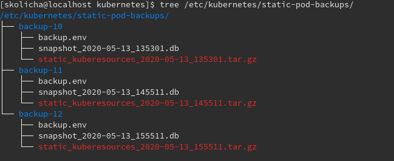

# automated-cluster-backups

## Release Signoff Checklist

- [ ] Enhancement is `implementable`
- [ ] Design details are appropriately documented from clear requirements
- [ ] Test plan is defined
- [ ] Graduation criteria for dev preview, tech preview, GA
- [ ] User-facing documentation is created in [openshift-docs](https://github.com/openshift/openshift-docs/)

## Summary
A periodic backup taken automatically will allow the user to restore from the most recent backup when cluster gets into
unexpected quorum loss or other unrecoverable data loss situations.

## Motivation
The current cluster backup procedure requires SSH and manual user commands from a node which are unsafe and error prone.
Customers are recommended to avoid sshing to nodes. Requiring an ssh session on a host (master) to take a backup goes
against recommendations with SSH. In addition,

The immediate need for automated backups is to provide a path to upgrade from 4.4 to 4.5, with the knowledge that if the
upgrade fails for some reason, there is no easy path to rollback, as the etcd version 3.4.x (used in OCP 4.5) is 
incompatible with the etcd version of 3.3.x (used in 4.4.x). Since restoring a backup is the safest way to rollback, it 
is important to have automated periodical backups to protect the users from unexpected data loss in such scenarios.

## Goals

1.  Automatic periodic backups and automatic pruning
1.  Make most recent backups readily available
1.  Eliminate SSH requirement

## Non-Goals

*  Automated restoration is not considered for this enhancement.

## Currently Supported Functionality 

Currently the scripts available support the following functionality:
### Cluster Backup 
Takes a snapshot of cluster’s etcd data along with static-pod-resources at the time of the backup. 

### Cluster Restore 
Restores the etcd data from a backup snapshot. It also restores the static pod resources while deleting all the newer
revisions.

## Proposal

### A new container is added to etcd static pod to run automated backups. 
The objectives of the new container are:
1.  On all etcd static pods, run a subcommand of cluster-etcd-operator to produce automated backups.
1. On all masters it creates a new backup revision `/etc/kubernetes/static-pod-backups/backup-N`.
1. On all masters it write `/etc/kubernetes/static-pod-backups/backup-N/backup.env` file containing 3 environmental
   variables `CREATED`, `OCP_VERSION`, `ETCD_REVISION` along with REVISION numbers for all other static pods.
1. On all masters take an etcd snapshot `etcdctl snapshot save
    /etc/kubernetes/static-pod-backups/backup-N/snapshot<date-time-string>.db`.
1. On all masters copy all static pod resources  to `/etc/kubernetes/static-pod-backups/backup-N/`.
1. On all masters symbolically link the directory `/etc/kubernetes/static-pod-backups/latest-backup` with the directory
   containing the most recent `/etc/kubernetes/static-pod-manifests/backup-N` directory.
1.  Also be responsible for pruning older backups to keep no more than X number of backups.

## User Stories [optional]

### Security

Your clusters backup data is as secure as your cluster. If someone were to root the system they would have direct
access to all data.

### Availability

Your data is as resilient as your cluster. We make N copies of your data so in the case of failure you dont have to
worry about your last backup location.

### Recovery Automation

If the cluster were to lose quorum and every master is seeded with data required to restore. Automation of recovery
tasks becomes easier.

## Implementation Plan

1. Create a subcommand to cluster-etcd-operator to run as a container in the etcd static pod.
2. It runs in an auto-pilot mode without requiring the addition of any new OpenShift API (for 4.4)
3. In future releases, cluster-etcd-operator will subsume this functionality with a backup controller (4.6+).

## Implementation Details/Notes/Constraints

*  Add a subcommand to `cluster-etcd-operator`
    * The subcommand could look basically like any other controller, using a sync loop driven by a workqueue, but instead
    of the queue being pushed by k8s informers, a timer ticker enqueues the sync events
    * The sync function attempts to find the backup for the current hour and create if doesn't already exist
    * On successful backup, prune the backups to keep them to be less than or equal to the allowed number of backups.
*  Change the etcd spec `etcd-pod.yaml` to run the subcommand as a separate container.

## Risks and Mitigations

* Performance impact

  Taking snapshots are disk intensive, and can impact the performance of the etcd member. If all the members take
  snapshot at the same time, it could trigger a leader election possibly causing cluster-wide failures to access etcd.
* Disks running out of space

  If they backups are not pruned properly, they could overfill the disk.
* Future changes to this sidecar container spec will require a new etcd pod revision
* Resource requirements of the backup controller are conflated with the requirements for etcd
* Health/liveness checks of the backup controller are conflated with etcd within the pod

## Design Details

## Test Plan

## Graduation Criteria

## Upgrade / Downgrade Strategy

## Version Skew Strategy

## Implementation History

## Drawbacks

## Alternatives
* A controller that deploys a CronJob or StatefulSet in 4.4.z and removes in 4.5.
* An upgrade process that takes a backup before attempting to initiate the upgrade process.
## Infrastructure Needed [optional]

### New github projects:

### New images built:

