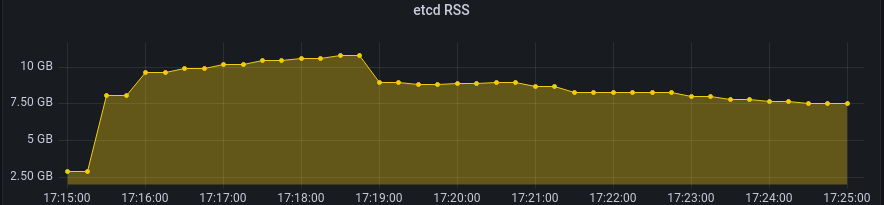
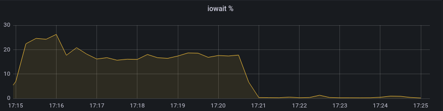
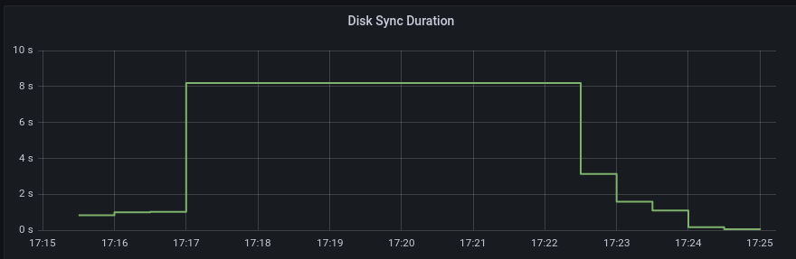

# Scaling etcd with Raft Learners

## Release Signoff Checklist

- [X] Enhancement is `implementable`
- [ ] Design details are appropriately documented from clear requirements
- [ ] Test plan is defined
- [ ] Operational readiness criteria is defined
- [ ] Graduation criteria for dev preview, tech preview, GA
- [ ] User-facing documentation is created in
  [openshift-docs](https://github.com/openshift/openshift-docs/)

## Summary

Over time as clusters live longer and workloads grow the ability to scale the control-plane and replace failed nodes
becomes a critical part of the admins maintenance overhead. Today the `cluster-etcd-operator` manages scaling up of
the etcd cluster. To provide the foundation for initiatives such as scale down and vertical control plane scaling[1].
The `cluster-etcd-operator` must ensure proper safety mechanisms exist to adjust membership of the etcd cluster.

Introduced in etcd v3.4 the raft learner[2] provides mitigations which reduces quorum and
stability issues during scaling. A learner is essentially an etcd member which is non voting thus can not impact 
quorum but like other members will receive log replications from the leader.

This enhancement proposes:
- Replacing the default scale up performed by the cluster-etcd-operator to use raft learners.
- Deprecation and removal of the current `discover-etcd-initial-cluster`[3] command and replacing its
functionality with the existing `etcdenvvar` controller.
- Add node selector to PDB deployment allowing the etcd-operator to prescribe a 1:1 relationship of etcd member and  
quorum-guard pod.
- Adding a flag to etcd which allows runtime configuration of maximum learners in cluster (--max-learners). Today the 
max is 1.
- Add new method to library-go static pod controllers `WithNodeFilter()` which provides the ability for the 
etcd-operator to have more granular control over static-pod scaling. 

POC: Functional proof of concept: https://github.com/openshift/cluster-etcd-operator/pull/682

[1] https://issues.redhat.com/browse/OCPPLAN-5712

[2] https://etcd.io/docs/v3.4/learning/design-learner/

[3] https://github.com/openshift/etcd/blob/openshift-4.10/openshift-tools/pkg/discover-etcd-initial-cluster/initial-cluster.go

## Motivation

Great demand exists to provide flexible automated scaling of the control-plane in the same way the worker
nodes do today.

### Goals

- provide safe scale up of etcd cluster using raft learners.
- add observability to allow admin to clearly diagnose scaling failure.
- reduce divergence from upstream etcd by removing `discover-etcd-initial-cluster`.

### Non-Goals

- implement scale down logic for the `cluster-etcd-operator`

## Proposal

### User Stories

1. As a cluster-admin I want to easily and safely vertically scale the control-plane without fear of quorum loss. 

2. As a cluster-admin I want to be able to replace failed control-place nodes without a deep understanding of etcd.

### Monitoring Dashboard

We add new metric figures to the etcd dashboard in the console:

1. include membership status over time `is_leader`, `is_learner` and `has_leader`.

### etcd Endpoints Controller

The `etcd Endpoints Controller` populates the etcd-endpoints configmap which is consumed by the etcd endpoints 
config observer[1] and used to populate the apiserver `storageConfig`. Today this controller loops control-plane 
nodes and blindly adds the InternalIP of the node to the list.

In order for operator to have full control over membership the controller will move to asking etcd directly 
via `MemberList`. This allows for only pending or existing etcd members to be reported as endpoints. While the 
endpoint at the time of publishing could be a learner or unstarted the client balancer will ensure service. 

A small change to the format of the key is also proposed to provide the cluster with more details on the member 
without asking etcd directly. Today the key is base64 encoded value (IP). This value is not currently used at all. 
The proposal replaces the existing key format with the hex string etcd Member ID. The Member ID is unique per 
cluster unlike the peerURL. This information can be useful in understanding "was this etcd member replaced/removed?".

Current format of endpoints ConfigMap. <base64(InternalIP)>: InternalIP 
```yaml
data:
  MTAuMC4xODUuMTYx: 10.0.185.161
  MTAuMC4xODUuMjEy: 10.0.185.212
  MTAuMC4xOTkuMjM1: 10.0.199.235
```

Proposed format of endpoints `<etcd member ID>: InternalIP`
```yaml
data:
  13c8677970c567e2: 10.0.185.161,
  85d0b011227abdc2: 10.0.185.212,
  867988777c0cacfc: 10.0.199.235,
```

[1] https://github.com/openshift/library-go/blob/release-4.10/pkg/operator/configobserver/etcd/observe_etcd_endpoints.go

### library-go Static Pod: Node Filter

`InstallerController` manages scheduling of installer pods and ensuring the state for those pods exists for each 
new revision. Today every control-plane node in the cluster is scheduled for every revision. etcd-operator needs 
more control over the etcd pods. As described in the changes to the `QuorumGaurdController` the etcd operator will 
explicitly describe the nodes which should be used by the installer controller. To facilitate this functionality a 
new configuration method `WithNodeFilter(nodeFilterFn func(ctx context.Context) (map[string]bool, error)) 
*InstallerController`. 
This method will return a map of all control-plane node hostnames with a boolean value if they should be included in 
the revision or not.

The nodeFilterFn map for `cluster-etcd-operator` will be populated by the etcd-endpoints ConfigMap.

`NodeController` populates the revision status of the nodes. This controller will also gain access to `nodeFilterFn`
to ensure proper status.

POC: Functional proof of concept: https://github.com/openshift/library-go/pull/1231

##### Current NodeController Statuses
| Name      |
| ----------- |
| MasterNodeRemoved |
| MasterNodeObserved | 
| MasterNodesReady | 

##### Proposed New NodeController Status
| Name      |
| ----------- |
| MasterNodesOmitted |

### etcd ENV Var Controller

The etcd ENV Var Controller populates etcd runtime configuration which is later consumed by the `target config 
controller`. 

`ETCD_INITIAL_CLUSTER` ENV variable is a critical part of etcd scaling process. Before a member has joined the cluster
and received a snapshot from the leader including the cluster membership details from the member bucket the new etcd
member must be able to communicate with its peers. This proposal includes moving population of
`ETCD_INITIAL_CLUSTER` from etcd itself via `discover-etcd-initial-cluster`[1] to the `etcdenvvar controller` in the
`cluster-etcd-operator`.

To populate this value the controller will read etcd-endpoints ConfigMap. This aligns scaling across the controllers.
new revisions of the static-pod controller will also use this configmap as the source of truth for scaling.

[1] https://github.com/openshift/etcd/tree/openshift-4.10/openshift-tools/pkg/discover-etcd-initial-cluster

### Max Learner

etcd needs the ability to define the maximum number of learners that are allowed in a cluster. Today maxLearners is 
hardcoded with a value of 1. During boostrap --max-learners will be set to the desired control-plane replica count. 
By using 3 learners to bootstrap an HA cluster we can improve bootstrap complete times by tearing down the bootstrap 
etcd much sooner.  A learner member is promotable when the learners raft status progress is greater than 90%.

## Learner Performance 

Performance tests were done which show the MTTR and cost of a single learner being added for scaling. In the case 
where multiple learners exist, they will be started serial so perf should be inline with below.

Test steps:

1. Populate etcd state to a predetermined size.
2. Scale down CVO and `cluster-etcd-operator`.
3. Choose control-plane node and scale down etcd member on that node.
4. Stop the static-pod by moving it out of `/etc/kubernetes/manifests`.
5. Remove the etcd data-dir `/var/lib/etcd`. 
6. Scale CVO and `cluster-etcd-operator` back up.
7. Force a new revision.

### Test 1: Single Learner Scale UP 5GB State

**Memory**
```shell
process_resident_memory_bytes{job="etcd"}
```
Memory was generally stable during the tests, the peer that was being scaled up would of course see an increase in 
RSS as the state file increased in size. The returning peer saw ~25-35% increase in memory usage while it was serving 
before promotion. The increase in memory lasted about 4 minutes and began to decrease steadily after about 2 minutes.



**CPU iowait**
```shell
(sum(irate(node_cpu_seconds_total {mode="iowait"} [2m])) without (cpu)) / count(node_cpu_seconds_total) without (cpu) * 100
AND on (instance) label_replace( kube_node_role{role="master"}, "instance", "$1", "node", "(.+)" )
```

iowait spiked to ~15% on the peer being scaled up and took about 4 minutes to stabilize.



**Disk I/O**
```shell
histogram_quantile(0.99, sum(rate(etcd_disk_wal_fsync_duration_seconds_bucket[5m])) by (instance, le))
```

The fsync duration in the test did not reflect high latency because the cluster was not under load.



```shell
histogram_quantile(0.99, sum(rate(etcd_disk_backend_commit_duration_seconds_bucket[5m])) by (instance, le))
```

Backend commit for the learner being scaled up peaked at its highest bucket (8s) for over a 10 minute period. 

 **Promotion Duration** 

Timing on the member being added and promoted is about 60 seconds.

|RPC | Duration |
|----|-----|
MemberAdd| 13:26:24|
MemberPromote| 13:27:22|

### Cluster Member Controller

The cluster member controller manages scaling up etcd during member replacement and bootstrap. This proposal makes
changes to the way this controller manages scale up. Today the controller loops not `Ready` etcd pods and will 
attempt to scale up if the etcd is not already part of the cluster membership.

This proposal moves from observation of etcd Pods to control-plane Nodes. The goal of this change is to ensure that 
the desired cluster membership is known as soon as possible. For example if we observe 6 Nodes, three of which are 
part of the existing quorum intent becomes clear that we will add the new Nodes to the cluster while removing the old. 

This will ensure that the `etcd-endpoints` ConfigMap includes all members in the cluster so that 
`ETCD_INITIAL_CLUSTER` can be correctly populated for all future members in a single revision. By having the next 
revision contain all future members we have more flexibility with which static pod will be scaled up next. 

`ensureEtcdLearnerPromotion`: This new method will provide the logic necessary to ask the cluster for the list of
members and attempt to promote any learner members which have a log in sync with the leader.

**Scaling Matrix Manual Scale Down**

The matrix below shows the cluster node topology and the expected response from scale up.

|Existing Nodes | Action | Max PDB Replicas| Max Learners | Expected Result | Desired Result | Notes | 
|---|---|---|---|---|---|---|
|Bootstrap| Add 3 Nodes | 3 | 3| 3 Member Cluster |  3 Member Cluster| |
|3| Add 1 Node | 4| 1|  4 Member Cluster | 3 Member Cluster | Manual etcd Scale Down Required |
|3| Add 2 Node | 4 | 1 | 4 Member Cluster|  3 Member Cluster| *Manual etcd Scale Down Required |
|3| Add 3 Node | 4 | 1 | 4 Member Cluster |  3 Member Cluster| *Manual etcd Scale Down Required |
`*` Remaining nodes could be rolled out after manual removal

------------------------

**Scaling Matrix Automated Future Scale Down**

With the addition of automated scale down feature.

|Existing Nodes | Action | Max PDB Replica| Max Learners | Expected Result | Desired Result | Notes | 
|---|---|---|---|---|---|---|
|Bootstrap| Add 3 Nodes | 3 | 3| 3 Member Cluster |  3 Member Cluster| |
|3| Add 1 Node | 4| 1|  3 Member Cluster | 3 Member Cluster | Automated Scale Down |
|3| Add 2 Node | 4 | 2 | 3 Member Cluster|  3 Member Cluster| Rolling Automated Scale Up/Down |
|3| Add 3 Node | 4 | 3 | 3 Member Cluster |  3 Member Cluster| Rolling Automated Scale Up/Down |

### Quorum Guard Controller

The `Quorum Guard Controller` ensures that the PDB deployment reflects the desired state of the cluster. To do that 
it must understand the desired control plane replicas which is consumes from the install-config. Today as soon as 
this controller starts the quorum-guard pods are scheduled to each control-plane node matching the install-config 
replica count.

This proposal allows for a dynamic assignment of quorum-guard pods using `nodeSelector` so that each etcd member 
will have a quorum-guard pod assigned to each member. To understand this intent the controller will read the 
`etcd-endpoints` ConfigMap and adjust the nodeSelector to only include those nodes mapped to etcd membership. In the 
case that a member is removed quorum-guard will adjust the `nodeSelector` and replicas to reflect this change. This 
allows in a rolling replacement of nodes to ensure each node has been scaled up before we remove the old nodes while 
also ensuring each learner added to the cluster becomes healthy before we scale down.

NOTE: Until automatic scale-down feature is implemented the controller will tolerate N+1 replicas. Where N is the value 
from install-config. Once manual scale down is complete the next member will be started.

### Risks and Mitigations

The largest risks to scaling is quorum loss, data loss, and split brain scenario.

- **Quorum Loss**: Because new members are added as non voting members and can not be promoted to voting members unless
the etcd process starts and the log has been completely replicated and in sync with leader.


- **Split brain**: The cluster gates starting of the etcd process on a verification process based on the cluster
member id. This ensures that each revision has an explicit expected membership. Because quorum guard replicas are
managed by the operator the cluster topology will remain in a safe configuration (odd number of members).


- **Data loss**: A concern with rolling scaling of etcd with large data files is possible data loss. The MTTR of log
replication is directly tied to the size of the state. If members of the cluster were replaced too quickly in
conjunction of it could be possible although very unlikely that no member has a complete log. Raft learners ensures
this is not possible by waiting for the log to be replicated from the leader before promotion to voting member can
take place.

## Design Details

### Open Questions [optional]

This is where to call out areas of the design that require closure before deciding to implement the
design.  For instance, > 1. This requires exposing previously private resources which contain
sensitive information.  Can we do this?

### Test Plan

- e2e with

    1. add dangling etcd learner member which has not been started and not promoted.
        - verify alert fires
        - ensure degraded cluster
    2. scale up and scale down etcd cluster
          - ensure stability of etcd cluster during bootstrap.
          - verify `ETCD_INTIAL_CLUSTER` remains valid through scaling and no split brain occurs (leader x2).
          - inject invalid member into `ETCD_MEMBER_IDS` to ensure `verify membership` blocks rollout.
          - replace member on node and ensure `verify membership` properly archives previous data-dir.
    3. verify DR workflow

### Graduation Criteria

**Note:** *Section not required until targeted at a release.*

Define graduation milestones.

These may be defined in terms of API maturity, or as something else. Initial proposal should keep
this high-level with a focus on what signals will be looked at to determine graduation.

Consider the following in developing the graduation criteria for this enhancement:

- Maturity levels
  - [`alpha`, `beta`, `stable` in upstream Kubernetes][maturity-levels]
  - `Dev Preview`, `Tech Preview`, `GA` in OpenShift
- [Deprecation policy][deprecation-policy]

Clearly define what graduation means by either linking to the [API doc
definition](https://kubernetes.io/docs/concepts/overview/kubernetes-api/#api-versioning), or by
redefining what graduation means.

In general, we try to use the same stages (alpha, beta, GA), regardless how the functionality is
accessed.

[maturity-levels]: https://git.k8s.io/community/contributors/devel/sig-architecture/api_changes.md#alpha-beta-and-stable-versions
[deprecation-policy]: https://kubernetes.io/docs/reference/using-api/deprecation-policy/

**Examples**: These are generalized examples to consider, in addition to the aforementioned
[maturity levels][maturity-levels].

#### Dev Preview -> Tech Preview

- Ability to utilize the enhancement end to end
- End user documentation, relative API stability
- Sufficient test coverage
- Gather feedback from users rather than just developers
- Enumerate service level indicators (SLIs), expose SLIs as metrics
- Write symptoms-based alerts for the component(s)

#### Tech Preview -> GA

- More testing (upgrade, downgrade, scale)
- Sufficient time for feedback
- Available by default
- Backhaul SLI telemetry
- Document SLOs for the component
- Conduct load testing

**For non-optional features moving to GA, the graduation criteria must include end to end tests.**

#### Removing a deprecated feature

- Announce deprecation and support policy of the existing feature
- Deprecate the feature

### Upgrade / Downgrade Strategy

If applicable, how will the component be upgraded and downgraded? Make sure this is in the test
plan.

Consider the following in developing an upgrade/downgrade strategy for this enhancement:
- What changes (in invocations, configurations, API use, etc.) is an existing cluster required to
  make on upgrade in order to keep previous behavior?
- What changes (in invocations, configurations, API use, etc.) is an existing cluster required to
  make on upgrade in order to make use of the enhancement?

Upgrade expectations:
- Each component should remain available for user requests and workloads during upgrades. Ensure the
  components leverage best practices in handling [voluntary
  disruption](https://kubernetes.io/docs/concepts/workloads/pods/disruptions/). Any exception to
  this should be identified and discussed here.
- Micro version upgrades - users should be able to skip forward versions within a minor release
  stream without being required to pass through intermediate versions - i.e. `x.y.N->x.y.N+2` should
  work without requiring `x.y.N->x.y.N+1` as an intermediate step.
- Minor version upgrades - you only need to support `x.N->x.N+1` upgrade steps. So, for example, it
  is acceptable to require a user running 4.3 to upgrade to 4.5 with a `4.3->4.4` step followed by a
  `4.4->4.5` step.
- While an upgrade is in progress, new component versions should continue to operate correctly in
  concert with older component versions (aka "version skew"). For example, if a node is down, and an
  operator is rolling out a daemonset, the old and new daemonset pods must continue to work
  correctly even while the cluster remains in this partially upgraded state for some time.

Downgrade expectations:
- If an `N->N+1` upgrade fails mid-way through, or if the `N+1` cluster is misbehaving, it should be
  possible for the user to rollback to `N`. It is acceptable to require some documented manual steps
  in order to fully restore the downgraded cluster to its previous state. Examples of acceptable
  steps include:
    - Deleting any CVO-managed resources added by the new version. The CVO does not currently delete
      resources that no longer exist in the target version.

### Version Skew Strategy

How will the component handle version skew with other components?  What are the guarantees? Make
sure this is in the test plan.

Consider the following in developing a version skew strategy for this enhancement:
- During an upgrade, we will always have skew among components, how will this impact your work?
- Does this enhancement involve coordinating behavior in the control plane and in the kubelet? How
  does an n-2 kubelet without this feature available behave when this feature is used?
- Will any other components on the node change? For example, changes to CSI, CRI or CNI may require
  updating that component before the kubelet.

## Implementation History

Major milestones in the life cycle of a proposal should be tracked in `Implementation History`.

## Drawbacks

The idea is to find the best form of an argument why this enhancement should _not_ be implemented.

## Alternatives

Similar to the `Drawbacks` section the `Alternatives` section is used to highlight and record other
possible approaches to delivering the value proposed by an enhancement.

## Infrastructure Needed [optional]

Use this section if you need things from the project. Examples include a new subproject, repos
requested, GitHub details, and/or testing infrastructure.

Listing these here allows the community to get the process for these resources started right away.
