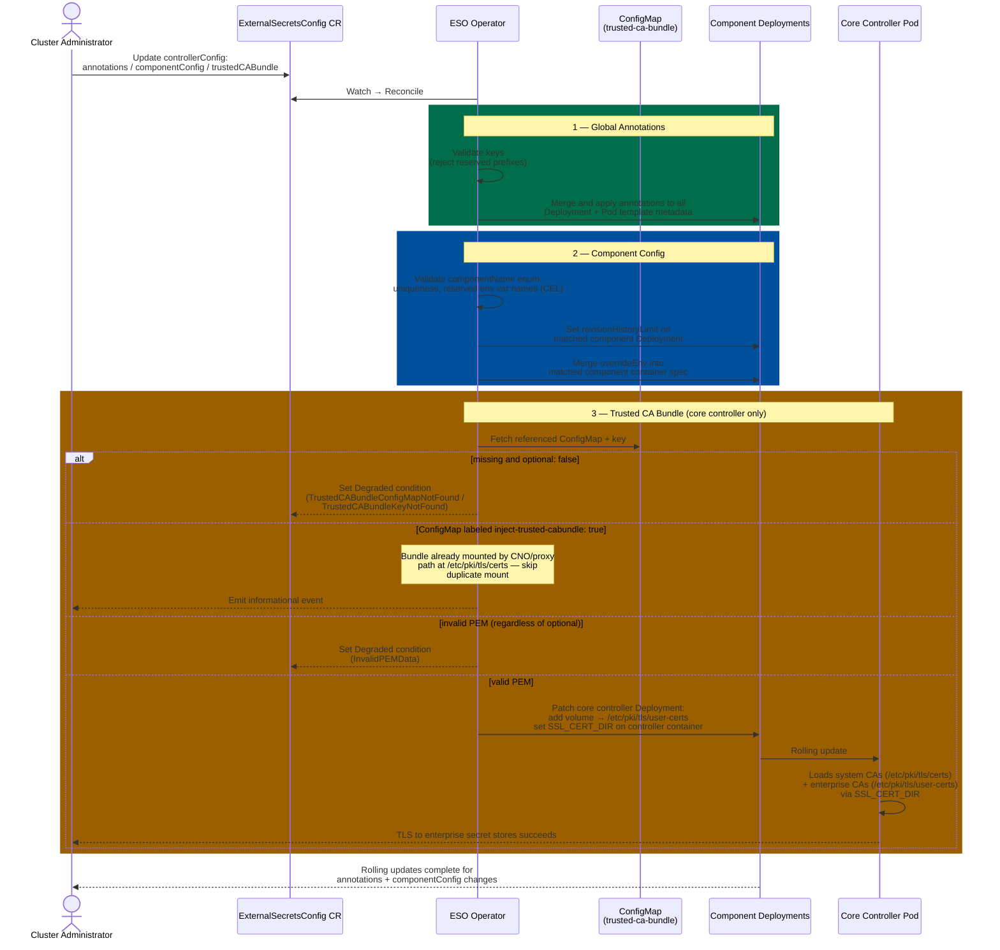

# Component Configuration for external-secrets Operator

## Summary

The External Secrets Operator for Red Hat OpenShift provides limited configuration options via its `ExternalSecretsConfig` API, constraining user customization. This enhancement proposes extending the `ExternalSecretsConfig` API to allow comprehensive customization of the external-secrets deployment. The extended configuration options—including annotations, environment variables, and deployment/pod specifications will be available for all core components (Controller, Webhook, CertController, BitwardenSDKServer). This change provides administrators with greater control over the resource management and operational parameters of each component.

This enhancement proposal also adds support for injecting a custom PKI CA bundle into the `external-secrets` operand **core controller** pod via a `ConfigMap` reference in the `ExternalSecretsConfig` custom resource, enabling the controller to verify **TLS** (HTTPS) connections to external secret management systems (such as IBM/Thycotic Secret Server or HashiCorp Vault) without depending on cluster-wide proxy configuration. The operator mounts the referenced `ConfigMap` under `/etc/pki/tls/user-certs` and sets `SSL_CERT_DIR` so Go trusts both that directory and the default system location without replacing `/etc/pki/tls/certs`. Administrators may populate the `ConfigMap` manually or with projects such as `cert-manager`.

## Motivation

Administrators often need to control core operational parameters, lifecycle settings, and custom metadata without directly modifying the underlying operator-managed resources. Currently, any manual changes made directly to the operand resources or other component specifications are immediately overwritten by the operator, making persistent customization impossible. This hardening forces users to accept default settings that may not be optimal for their workloads. This proposal resolves this issue by providing a dedicated, supported configuration path through `ExternalSecretsConfig`, granting administrators the necessary flexibility to fine-tune essential specifications like revisionHistoryLimit, add crucial environment variables, and apply additional metadata for seamless and efficient integration into complex cluster environments.

Administrators also frequently run external secret management systems (for example IBM Secret Server, Thycotic, HashiCorp Vault) that use certificates signed by external PKI; the CA certificates must be available to the `external-secrets` controller for **TLS server certificate verification** on outbound HTTPS. On OpenShift, the Cluster Network Operator (CNO) injects the merged trusted CA bundle into `ConfigMaps` that carry the label **`config.openshift.io/inject-trusted-cabundle: "true"`**. That mechanism is wired to the cluster **`Proxy`** object: administrators distribute user-configured CA certificates cluster-wide by setting `Proxy.spec.trustedCA` (and related proxy fields when they use an HTTP/HTTPS proxy). Asking administrators to edit the `Proxy` CR solely to attach a CA bundle when they do not use an HTTP/HTTPS proxy is a poor fit for clusters that otherwise do not operate `Proxy`. Some `external-secrets` providers expose per-store CA options, but not all do, and repeating configuration across many stores increases maintenance overhead. This enhancement extends `ExternalSecretsConfig` with an operator-local `trustedCABundle` for controller-wide trust when that model is appropriate.

### User Stories

- As an OpenShift administrator, I want to configure deployment lifecycle properties (e.g., revisionHistoryLimit) for external-secrets operand components using the `ExternalSecretsConfig` API so that I can control rollback behavior and optimize cluster resource consumption.
- As an OpenShift administrator, I want to apply configuration overrides to individual external-secrets components (Controller, Webhook, etc.) so that I can set component-specific environment variables or other operational parameters as needed.
- As an OpenShift Administrator, I want to define custom metadata (like annotations or labels) on the external-secrets component deployments via the `ExternalSecretsConfig` API so that the deployments correctly integrate with cluster policy tools, monitoring systems (e.g., Prometheus), and internal tooling without being overwritten.
- As an OpenShift Administrator, I need to set custom environment variables for specific components (e.g., the Controller) so that I can configure component behavior at runtime or securely integrate the operand with necessary external services.
- As an OpenShift Administrator, I want to reference a `ConfigMap` of custom CA bundle in `ExternalSecretsConfig`, so that the `external-secrets` controller can sync secrets from external secret management systems over **TLS** (HTTPS) using enterprise or private PKI.
- As a platform engineer, I want to configure controller TLS trust without touching the Proxy CR when our cluster has no HTTP/HTTPS proxy, so that we do not misuse or hollow out a cluster-wide object just to ship a PEM bundle.
- As a security engineer, I want custom roots added without replacing the container system trust store, so that the controller still trusts public CAs (for example cloud secret managers) while also trusting internal enterprise CAs.

### Goals

- Provide a declarative API for specifying deployment lifecycle overrides for each component via `ExternalSecretsConfig`.
- Provide a declarative API for adding custom annotations globally to all resources created for the `external-secrets` operand via `ExternalSecretsConfig`.
- Provide a declarative API for specifying custom environment variables uniquely for each component via `ExternalSecretsConfig`.
- Allow optional, supported injection of a user-supplied CA bundle so the `external-secrets` **core controller** can verify **TLS** to external HTTPS backends (enterprise PKI, private CAs).
- Automatically mount the referenced ConfigMap into the ESO core controller pod at `/etc/pki/tls/user-certs`, without overriding the system trust store at `/etc/pki/tls/certs`.
- Existing proxy-based CA bundle injection behavior (CNO-managed) is preserved unchanged and can coexist with new user configured CA bundle.

### Non-Goals

- Exhaustive validation of individual configured values (e.g., validating that an environment variable value is semantically correct). Users should consult upstream documentation. Only basic structural validation (non-empty strings, list length limits) will be performed.
- Ability to set resource limits (CPU, memory requests/limits), replica counts, pod affinity/anti-affinity, tolerations, or node selectors on a per-component or individual deployment basis. These component-level overrides are out of scope for this proposal (except for revisionHistoryLimit, which is specifically introduced here)
- Applying the user configured CA bundle to webhook or unrelated sidecars unless a follow-up explicitly requires it.
- Automatic CA certificate rotation or lifecycle management. The operator mounts the ConfigMap as-is; certificate updates are the cluster administrator's responsibility.
- Supporting ConfigMaps from namespaces other than the `external-secrets` operand namespace (`external-secrets`), as Kubernetes does not allow pods to mount ConfigMaps from other namespaces.


## Proposal

Extend the ExternalSecretsConfig API with:
1. A new `annotations` field for adding custom annotations globally to Deployments and Pod templates.
2. A new `componentConfig` field for per-component deployment lifecycle overrides.
3. A new `trustedCABundle` field for adding trusted CA bundle.

**For trusted CA bundle**

This proposal extends the `ExternalSecretsConfig` API with a new optional field `trustedCABundle` of type `ConfigMapKeyReference` under `spec.controllerConfig` (a **single** optional object, not a list). When set, the operator will:

- Validate that the referenced `ConfigMap` and key exist in the ESO operand namespace and that the value parses as **valid PEM-encoded CA data**.
  - If `optional: true` and the `ConfigMap` or key is **missing**, skip trusted-bundle mounting **without** error.
  - If the key is present but contains **no valid PEM**, set **Degraded** and do **not** roll out a broken trust configuration (**regardless** of `optional`).
- Mount the `ConfigMap` as a volume into the `external-secrets` core controller pod at `/etc/pki/tls/user-certs`.
- Set the `SSL_CERT_DIR` environment variable on the core controller container to `/etc/pki/tls/certs:/etc/pki/tls/user-certs`, causing Go's `crypto/x509` `loadSystemRoots()` to load certificates from both the system trust store and the custom CA directory into the same trust pool.

The custom path (`/etc/pki/tls/user-certs`) is intentionally separate from the system path (`/etc/pki/tls/certs`) to avoid overriding system CAs, which would break TLS connectivity to public services.

Both proxy-based CA injection (CNO-managed, at `/etc/pki/tls/certs`) and `trustedCABundle` injection can coexist; when both apply, `SSL_CERT_DIR` includes both inputs.

**`ConfigMap` with the CNO injection label:** If the `ConfigMap` referenced by `trustedCABundle` is labeled with `config.openshift.io/inject-trusted-cabundle: "true"`, operator **skips** mounting that reference for `trustedCABundle`.

**Interaction with `overrideEnv`:** The operator owns **`SSL_CERT_DIR`** (and, when applicable, **`SSL_CERT_FILE`**) on the **External Secrets core controller** for proxy/CNO trust and for **`trustedCABundle`** injection. **`overrideEnv`** therefore **must not** set **`SSL_CERT_DIR`** or **`SSL_CERT_FILE`** on **any** operand component: the **`ExternalSecretsConfig`** CRD extends the existing **`overrideEnv`** CEL rule so the API server **rejects** those names up front (same pattern as reserved prefixes such as `KUBERNETES_`). No runtime “ignore vs reject” choice is required for a valid CR.

| Situation | Expected behaviour |
|-----------|---------------------|
| `optional: false` (default) and missing `ConfigMap` or key | **Degraded**; do not patch the controller `Deployment` until valid. |
| `optional: true` and missing `ConfigMap` or key | Skip user bundle; no error for the missing reference alone. |
| Present key with **invalid PEM** | **Degraded** regardless of `optional`. |
| Referenced `ConfigMap` has **`config.openshift.io/inject-trusted-cabundle: "true"`** | A `ConfigMap` is already created, when proxy is configured, and its contents are mounted at `/etc/pki/tls/certs` path. Mounting it again under `/etc/pki/tls/user-certs` would be a duplicate. The operator **skips** the trustedCABundle volume mount. |

### Workflow Description



**For Global Annotations:**

1. **User Configuration:** Administrator updates the `ExternalSecretsConfig` CR with the `controllerConfig.annotations` field containing custom key-value pairs.
2. **Validation:** The operator validates that annotation keys and values conform to Kubernetes annotation constraints.
3. **Reconciliation:** The operator merges user-specified annotations with any default annotations. User annotations take precedence in case of conflicts. Annotations are applied to both the Deployment metadata and Pod template metadata for all components.
4. **Rollout:** Kubernetes detects the annotation changes and performs updates as needed.

**For Component Configuration:**

1. **User Configuration:** Administrator updates the `ExternalSecretsConfig` CR, utilizing the new `componentConfig` list to specify configuration entries for a component (Controller, Webhook, etc.). This includes deployment-level overrides via `DeploymentConfig` and custom environment variables via `overrideEnv`.
2. **Validation:** It verifies the `componentName` against the allowed enum values and enforces uniqueness across the list. It strictly validates the `DeploymentConfig` field using the provided Kubernetes CEL validation rules, ensuring every entry uses the specified format. For `overrideEnv`, it validates that environment variable names and values conform to Kubernetes conventions, and that **reserved names** (including **`SSL_CERT_DIR`** and **`SSL_CERT_FILE`**, plus the existing prefix rules) are rejected by CEL on the CRD.
3. **Reconciliation:** The operator applies the `deploymentConfigs` values (e.g., `revisionHistoryLimit`) directly to the component's underlying Kubernetes Deployment resource spec. For `overrideEnv`, the operator merges user-specified environment variables with default variables, with user values taking precedence in case of conflicts.
4. **Rollout:** Kubernetes detects the change in the Deployment's spec and performs a rolling update, applying the new setting to the component.

**For trusted CA bundle**

1. **User Configuration:** Administrator updates the `ExternalSecretsConfig` CR, setting the optional **`trustedCABundle`** object (`name`, `key`, `optional`) to reference a `ConfigMap` in the operand namespace.
2. **Validation:** Operator validates the referenced `ConfigMap` and key per the error-handling table in **For trusted CA bundle** above (including invalid PEM → **Degraded** regardless of `optional`).
3. **Reconciliation:** Operator updates the `external-secrets` **core controller** `Deployment` to add:
   - A volume referencing the `ConfigMap`.
   - A `volumeMount` at `/etc/pki/tls/user-certs` on the core controller container.
   - `SSL_CERT_DIR=/etc/pki/tls/certs:/etc/pki/tls/user-certs` on the core controller container.
4. **Rollout:** Kubernetes performs a rolling update when the `Deployment` spec changes.

### Implementation Details/Notes/Constraints

This enhancement extends the `ExternalSecretsConfig` for **operand customization**: administrators set **global annotations** on managed `Deployment`s and pod templates, **per-component** knobs (today `deploymentConfigs` such as `revisionHistoryLimit`, plus `overrideEnv`), and optionally **`trustedCABundle`** for core-controller TLS trust—without editing generated workloads by hand.

- **Operand namespace:** `trustedCABundle` references must resolve to a `ConfigMap` in the **operand** namespace (fixed to `external-secrets`).
- **Volume semantics:** Mount the trusted CA `ConfigMap` as a **directory** volume on the core controller. Go's trust loading expects PEM files under the directories listed in `SSL_CERT_DIR`; the operator should surface a predictable filename such as **`ca-bundle.crt`** under `/etc/pki/tls/user-certs`. When the `ConfigMap` **key** is not already named `ca-bundle.crt`, use the volume's **`items`** list to **project** that key to the path `ca-bundle.crt` inside the mount (same pattern as other operators that must normalize key names):

  ```yaml
  volumes:
    - name: user-trusted-ca-bundle
      configMap:
        name: trusted-ca-bundle
        items:
          - key: ca-chain.crt
            path: ca-bundle.crt
  ```

  With this, the controller sees `/etc/pki/tls/user-certs/ca-bundle.crt` regardless of the original key name in the `ConfigMap`.

- **Proxy/CNO path unchanged:** Existing behaviour that ties the CNO-injected bundle to cluster `Proxy` configuration remains; `trustedCABundle` is additive for controller-local trust.

### API Extensions

```go
// ComponentConfig defines configuration overrides for a specific external-secrets component.
type ComponentConfig struct {
	// componentName identifies which external-secrets component this configuration applies to.
	// Valid component names: ExternalSecretsCoreController, Webhook, CertController, BitwardenSDKServer.
	// +kubebuilder:validation:Enum:=ExternalSecretsCoreController;Webhook;CertController;BitwardenSDKServer
	// +required
	//nolint:kubeapilinter // ComponentName is a listMapKey and must not have omitempty for proper patch identification
	ComponentName ComponentName `json:"componentName"`

	// deploymentConfigs specifies overrides for the Kubernetes Deployment resource of this component.
	// +optional
	DeploymentConfigs *DeploymentConfig `json:"deploymentConfigs,omitempty"`

    // overrideEnv allows setting custom environment variables for the component's container. These environment variables are merged with the default environment variables set by the operator. User-specified variables take precedence in case of conflicts.
    // Environment variables starting with KUBERNETES_, or EXTERNAL_SECRETS_ are reserved and cannot be overridden. HOSTNAME, SSL_CERT_DIR and SSL_CERT_FILE are also reserved.
    // +kubebuilder:validation:Optional
    // +kubebuilder:validation:XValidation:rule="self.all(e, !['KUBERNETES_', 'EXTERNAL_SECRETS_'].exists(p, e.name.startsWith(p)) && e.name != 'HOSTNAME' && e.name != 'SSL_CERT_DIR' && e.name != 'SSL_CERT_FILE')",message="Environment variable names starting with 'KUBERNETES_' or 'EXTERNAL_SECRETS_' are reserved; 'HOSTNAME', 'SSL_CERT_DIR', and 'SSL_CERT_FILE' are also reserved exact names."
    // +optional
    OverrideEnv []corev1.EnvVar `json:"overrideEnv,omitempty"`
}

// ControllerConfig is for specifying the configurations for the controller to use while installing the `external-secrets` operand and the plugins.
type ControllerConfig struct {
	// annotations are for adding custom annotations to all the resources created for external-secrets deployment.
	// The annotations are merged with any default annotations set by the operator. User-specified annotations take precedence over defaults in case of conflicts.
	// Annotation keys containing domains `kubernetes.io/`, `openshift.io/`, `cert-manager.io/` or `k8s.io/` (including subdomains like `*.kubernetes.io/`) are not allowed.
	// +kubebuilder:validation:XValidation:rule="self.all(key, key.matches('^([a-z0-9]([-a-z0-9]*[a-z0-9])?(\\\\.[a-z0-9]([-a-z0-9]*[a-z0-9])?)*\\\\/)?([A-Za-z0-9][-A-Za-z0-9_.]*)?[A-Za-z0-9]$'))",message="Annotation keys must consist of alphanumeric characters, '-', '_' or '.', starting and ending with alphanumeric, with an optional lowercase DNS subdomain prefix and '/' (e.g., 'my-key' or 'example.com/my-key')"
	// +kubebuilder:validation:XValidation:rule="self.all(key, !key.contains('/') || key.split('/')[0].size() <= 253)",message="Annotation key prefix (DNS subdomain) must be no more than 253 characters"
	// +kubebuilder:validation:XValidation:rule="self.all(key, key.contains('/') ? key.split('/')[1].size() <= 63 : key.size() <= 63)",message="Annotation key name part must be no more than 63 characters"
	// +kubebuilder:validation:XValidation:rule="self.all(key, !key.matches('^([^/]*\\\\.)?(kubernetes\\\\.io|k8s\\\\.io|openshift\\\\.io)/'))",message="Annotation keys containing reserved domains 'kubernetes.io/', 'openshift.io/', 'k8s.io/' (including subdomains like '*.kubernetes.io/') are not allowed"
	// +kubebuilder:validation:XValidation:rule="self.all(key, !key.matches('^(cert-manager\\\\.io)/'))",message="Annotation keys containing reserved domain 'cert-manager.io/' are not allowed"
	// +kubebuilder:validation:MinProperties=0
	// +kubebuilder:validation:MaxProperties=20
	// +optional
	Annotations map[string]string `json:"annotations,omitempty"`

	// componentConfigs allows specifying deployment-level configuration overrides for individual external-secrets components. This field enables fine-grained control over deployment settings for each component independently.
	// Each component can only have one configuration entry.
	// +kubebuilder:validation:MinItems:=0
	// +kubebuilder:validation:MaxItems:=4
	// +listType=map
	// +listMapKey=componentName
	// +optional
	ComponentConfigs []ComponentConfig `json:"componentConfigs,omitempty"`

	// TrustedCABundle references a ConfigMap containing the CA certificates
	// required to verify external TLS endpoints (e.g., Proxies, External Secret Management Systems).
    // +optional
	TrustedCABundle *ConfigMapKeyReference `json:"trustedCABundle,omitempty"`
}

// DeploymentConfig defines configuration overrides for a Kubernetes Deployment resource.
type DeploymentConfig struct {
	// revisionHistoryLimit specifies the number of old ReplicaSets to retain for rollback purposes.
	// This allows rolling back to previous deployment versions using 'kubectl rollout undo'.
	// Must be at least 1 to ensure rollback capability. Maximum value is 50 to limit resource usage.
	// If not specified, defaults to 10.
	// +kubebuilder:default:=10
	// +kubebuilder:validation:Minimum=1
	// +kubebuilder:validation:Maximum=50
	// +optional
	RevisionHistoryLimit *int32 `json:"revisionHistoryLimit,omitempty"`
}

// ConfigMapKeyReference refers to a specific key within a ConfigMap.
type ConfigMapKeyReference struct {
    // name of the ConfigMap resource being referred to.
    // +kubebuilder:validation:MinLength:=1
    // +kubebuilder:validation:MaxLength:=253
    // +kubebuilder:validation:Required
    Name string `json:"name"`

    // key is the specific key in the ConfigMap to be utilized.
    // If not specified, defaults to "ca-bundle.crt".
    // +kubebuilder:validation:MinLength:=1
    // +kubebuilder:validation:MaxLength:=253
    // +kubebuilder:validation:Pattern:=^[-._a-zA-Z0-9]+$
    // +kubebuilder:default:="ca-bundle.crt"
    // +kubebuilder:validation:Optional
    Key string `json:"key,omitempty"`

    // optional specifies whether the ConfigMap or its key must be defined.
    // If true and the ConfigMap or key is missing, the operator will skip
    // the dependent logic instead of erroring.
    // +kubebuilder:default:=false
    // +kubebuilder:validation:Optional
    Optional *bool `json:"optional,omitempty"`
}
```

#### Example User Configuration

**Configure RevisionHistoryLimit for the Controller:**

```yaml
apiVersion: operator.openshift.io/v1alpha1
kind: ExternalSecretsConfig
metadata:
  name: cluster
spec:
  controllerConfig:
    componentConfigs:
      - componentName: ExternalSecretsCoreController
        deploymentConfigs:
          revisionHistoryLimit: 5
```

**Add custom annotations (applied to all components):**

```yaml
apiVersion: operator.openshift.io/v1alpha1
kind: ExternalSecretsConfig
metadata:
  name: cluster
spec:
  controllerConfig:
    annotations:
      "example.com/custom-annotation": "my-value"
```

**Set custom environment variables for a component:**

```yaml
apiVersion: operator.openshift.io/v1alpha1
kind: ExternalSecretsConfig
metadata:
  name: cluster
spec:
  controllerConfig:
    componentConfigs:
      - componentName: ExternalSecretsCoreController
        overrideEnv:
          - name: GOMAXPROCS
            value: "4"
```

**Configure `trustedCABundle`:**

1. The ConfigMap exists in the external-secrets namespace containing the trusted CA certificates:

```yaml
apiVersion: v1
kind: ConfigMap
metadata:
  name: trusted-ca-bundle
  namespace: external-secrets
data:
  ca-bundle.crt: |
    -----BEGIN CERTIFICATE-----
    MIIDXTCCAkWgAwIBAgIJAJC1HiIAZAiUMA...
    -----END CERTIFICATE-----
    -----BEGIN CERTIFICATE-----
    MIIDfTCCAmWgAwIBAgIBATANBgkqhkiG...
    -----END CERTIFICATE-----
```

2. Reference the ConfigMap in the `ExternalSecretsConfig` CR

```yaml
apiVersion: operator.openshift.io/v1alpha1
kind: ExternalSecretsConfig
metadata:
  name: cluster
spec:
  controllerConfig:
    trustedCABundle:
      name: trusted-ca-bundle
      key: ca-bundle.crt
      optional: false
```

**Combined: annotations (global) with component-specific deployment config, overrideEnv and trustedCABundle:**

```yaml
apiVersion: operator.openshift.io/v1alpha1
kind: ExternalSecretsConfig
metadata:
  name: cluster
spec:
  controllerConfig:
    # Annotations applied to ALL components
    annotations:
      "example.com/custom-annotation": "my-value"
    # Component-specific overrides
    componentConfigs:
      - componentName: ExternalSecretsCoreController
        deploymentConfigs:
          revisionHistoryLimit: 10
        overrideEnv:
          - name: GOMAXPROCS
            value: "4"
      - componentName: Webhook
        deploymentConfigs:
          revisionHistoryLimit: 3
    # trusted CA certificates
    trustedCABundle:
      name: trusted-ca-bundle
      key: ca-bundle.crt
      optional: false
```

### Topology Considerations

#### Hypershift / Hosted Control Planes

The ESO operator runs in the hosted cluster's data plane, not in the management cluster. The `ExternalSecretsConfig` CR and the trusted CA ConfigMap both reside in the hosted cluster. There are no unique considerations for Hypershift — the feature works identically to standalone clusters. The ConfigMap must be in the `external-secrets` namespace within the hosted cluster.

#### Standalone Clusters

This is the primary topology for this enhancement. The feature is fully applicable.

#### Single-node Deployments or MicroShift

**Single-node OpenShift (SNO)**: Applicable; behavior matches standalone.

**MicroShift**: External Secrets Operator is not part of the MicroShift product offering; this enhancement does not apply to MicroShift unless that changes.

### Risks and Mitigations

* **Risk:** The primary risk lies in administrators setting the RevisionHistoryLimit value too low (for example, setting it to 0 or 1). Doing so severely limits or completely eliminates the component's ability to perform quick rollbacks to previous stable versions. If a new deployment fails, recovery will be slower and more complex if there are no historical ReplicaSets to instantly switch back to.
    * **Mitigation:** strongly recommend a safe minimum value (typically between 3 and 5) to ensure operational continuity and maintain reasonable rollback capabilities.

* **Risk:** Users may accidentally override critical arguments required for proper operation.
    * **Mitigation:** The operator can protect certain critical arguments from being overridden and will log warnings if users attempt to do so.

* **Risk:** Users may override critical environment variables required for proper component operation.
    * **Mitigation:** The operator can protect certain critical environment variables from being overridden and will log warnings if users attempt to do so.

* **Risk:** Configuration changes may cause service disruption during rollout.
    * **Mitigation:** Standard Kubernetes rolling update strategies will minimize disruption. Users can control rollout behavior through the deployment's update strategy.

* **Risk:** Malicious CA injection.
    * **Mitigation:** ConfigMap must exist in `external-secrets` namespace; only cluster admins with write access to that namespace should be able to configure this, by restricting RBAC to cluster admins.

* **Risk:** Invalid PEM or mis-typed `ConfigMap` reference breaks secret sync.
    * **Mitigation:** Operator validates PEM on reconcile; sets **Degraded** with a clear message; does not roll out broken trust when `optional: false` (see error-handling table).

* **Risk:** User sets `SSL_CERT_DIR` or `SSL_CERT_FILE` in `overrideEnv`, conflicting with operator-managed trust.
    * **Mitigation:** CRD **CEL** on `overrideEnv` rejects those names at create/update (see **Interaction with `overrideEnv`**); document in user-facing docs; add API validation tests.

### Drawbacks

- Increased API surface complexity for users who don't need customization.
- Potential for misconfiguration leading to operational issues.
- Administrators must create, update, and delete ConfigMap contents themselves; there is no operator-managed CA rotation beyond what Kubernetes volume updates provide.

## Test Plan

* **Unit Tests:**
    1. Test validation of componentName uniqueness.
    2. Test validation of `deploymentConfigs.revisionHistoryLimit` values.
    3. Test that invalid `deploymentConfigs` values are handled gracefully.
    4. Test annotation merging logic with defaults and user overrides.
    5. Test that reserved annotation prefixes are rejected.
    6. Test environment variable merging logic with defaults and user overrides.
    7. Test that reserved environment variable prefixes are rejected.
    8. Test that environment variable names conform to Kubernetes conventions.
    9. Test that `overrideEnv` CEL rejects `SSL_CERT_DIR` and `SSL_CERT_FILE` for any component.
    10. Test for all combinations of proxy/trustedCABundle being set or unset.
    11. Test PEM validation logic; assert **Degraded** for invalid PEM regardless of `optional`.
    12. Test optional field behavior for missing ConfigMap and missing key.
    13. When referenced `ConfigMap` has `config.openshift.io/inject-trusted-cabundle: "true"`, assert reconcile **skips** user-bundle mount and does **not** set **Degraded** solely for that reason.

* **Integration Tests:**
    1. Deploy the operator and create an `ExternalSecretsConfig` with component configuration.
    2. Verify that `deploymentConfigs.revisionHistoryLimit` is correctly applied to the deployment's `spec.revisionHistoryLimit`.
    3. Verify that specified annotations appear on both Deployment and Pod template.
    4. Verify that specified environment variables appear in the container spec.
    5. Update the configuration and verify the deployment is updated accordingly.
    6. Remove the configuration and verify defaults are restored.
    7. Attempt to apply a configuration that fails XValidation and verify the API server rejects the resource with the appropriate error message (including `overrideEnv` containing `SSL_CERT_DIR` or `SSL_CERT_FILE`).
    8. Test annotation override behavior when user annotation conflicts with operator default.
    9. Test environment variable override behavior when user variable conflicts with operator default.
    10. Deploy with `trustedCABundle`; assert volume mount and `SSL_CERT_DIR` exist only on the core controller container; assert Degraded when reference invalid with `optional: false`; assert silent skip when `optional: true` and reference missing; assert Degraded for invalid PEM even when `optional: true`.
    11. With proxy configured and `trustedCABundle` referencing a ConfigMap labeled `config.openshift.io/inject-trusted-cabundle: "true"`, assert the operator does not add the trustedCABundle volume mount (since the bundle is already handled for the proxy path), does not set Degraded.

* **End-to-End (E2E) Tests:**
    1. Test each component type (Controller, Webhook, CertController, BitwardenSDKServer) individually.
    2. Configure `deploymentConfigs.revisionHistoryLimit` and verify old ReplicaSets are cleaned up accordingly.
    3. Configure custom environment variables and verify they are available in the running container.
    4. Verify that the operator correctly handles invalid configurations gracefully.
    5. Configure ESO to connect to an internal test secret store (self-signed cert, e.g., vault); verify secrets sync successfully after setting trustedCABundle. Verify no regression for stores using public CAs (e.g., AWS Secrets Manager).
    6. Verify proxy-based CA injection still works when both proxy and trustedCABundle are configured.

## Graduation Criteria

This feature will be delivered as GA directly, as it uses stable Kubernetes APIs and provides essential operational flexibility.

* All API fields are implemented with proper validation.
* Deployment config application logic is complete (e.g., `revisionHistoryLimit`).
* Annotation merging logic is complete and applies to both Deployment and Pod template.
* Environment variable merging logic is complete and applies to the container spec.
* All tests outlined in the Test Plan are passing.
* Documentation includes examples for common use cases.

### Dev Preview → Tech Preview

Not applicable. This feature will be enabled by default at GA.

### Tech Preview → GA

Not applicable. This feature will be enabled by default at GA.

### Removing a deprecated feature

Not applicable.

## Upgrade / Downgrade Strategy

* **Upgrade:** On upgrade, the new `annotations`, `componentConfig` (including `deploymentConfigs` and `overrideEnv`), and `trustedCABundle` fields will be available. Existing installations without these configurations will continue to work with default settings. Users can optionally add annotations, deployment overrides, custom environment variables, and `trustedCABundle` after upgrade.

* **Downgrade:** If a user downgrades to a version that does not support these fields, the older operator **ignores** unknown `spec.controllerConfig` keys (or they are pruned from stored objects depending on CRD schema). Effects include:
  * **`annotations` / `componentConfig`:** Deployments revert toward operator defaults; user annotations and `overrideEnv` entries from the newer schema are lost.
  * **`trustedCABundle`:** The custom CA volume and `SSL_CERT_DIR` user path are no longer applied. TLS to backends that require enterprise-only roots may fail with `x509: certificate signed by unknown authority` until the cluster is upgraded again or trust is supplied via another supported path (for example `Proxy.spec.trustedCA` and the CNO-injected bundle when `Proxy` is in use).

  Treat downgrade across this API split as an **availability risk** for external secret sync wherever custom trust was required.

## Alternatives (Not Implemented)

* **Validating Webhook for Argument Semantics:** A validating admission webhook could be implemented to perform semantic validation of override values against upstream external-secrets component schemas. This would provide pre-flight validation of override keys and semantic values, enabling the early rejection of invalid configurations before deployment rollout, and offering user-friendly error messages. This could be reconsidered in future iterations if runtime validation failures (due to invalid values for supported keys) become a significant operational burden.

* **Cluster-Wide Proxy Object trustedCA Field:** OpenShift's `Proxy` object supports a `trustedCA` field that works independently of HTTP/HTTPS proxy settings. Modifying operator logic to always create the CNO-labeled ConfigMap (removing the proxy check) would allow CA injection via the existing CNO mechanism with minimal code changes and no API changes to ExternalSecretsConfig. This requires cluster-admin access to modify the cluster-wide Proxy object, affects all workloads cluster-wide (not just ESO), and does not support ESO-specific CA configuration. It could be the right choice when Proxy is already part of cluster operations.

* **Service Mesh (Istio/OpenShift Service Mesh):** Use Istio/OpenShift Service Mesh for mTLS and CA management. This introduces significant infrastructure overhead and complexity for a problem solved more simply at the operator level. Not all customers have or want a service mesh.

* **Per-SecretStore `caProvider` / `caBundle`:** The upstream external-secrets project supports `caBundle` and `caProvider` on individual `SecretStore` and `ClusterSecretStore` resources for some providers, but not all. It requires configuring CA references on every store, cannot express a single global controller trust bundle, and increases maintenance burden during CA rotation.

## Version Skew Strategy

The External Secrets Operator and its operands (controller, webhook, cert-controller, BitwardenSDKServer) are delivered as a single OLM bundle and upgraded atomically. The operator image and all operand images advance together; there is no supported configuration where an older operand runs against a newer operator version or vice versa.

Because the new `annotations`, `componentConfig`, and `trustedCABundle` fields are applied by the operator during reconciliation after the bundle upgrade completes, there is no window in which an operand pod would attempt to read or act on these fields independently. The fields are purely operator-consumed: the operator reads them and patches the operand `Deployment` specs accordingly.

No version skew handling is therefore required for this enhancement.

## Operational Aspects of API Extensions

The `annotations` and `componentConfig` API extensions follow standard Kubernetes patterns:

* **Failure Modes:**
  * Invalid configurations will be rejected by the API server validation (annotations, `componentConfig`, CEL rules).
  * Invalid annotation formats will be rejected at the API level.
  * Invalid environment variable names will be rejected at the API level (including **`SSL_CERT_DIR`** and **`SSL_CERT_FILE`** in `overrideEnv` per CEL, alongside existing reserved-prefix rules).
  * For **`trustedCABundle`:** If the referenced `ConfigMap` or key is missing when `optional: false`, or the key contains invalid PEM, the operator sets **`Degraded`** on `ExternalSecretsConfig`, logs a clear error, and **does not** apply a broken controller `Deployment` patch—the running controller keeps its prior trust configuration until the spec is valid. If the referenced `ConfigMap` carries `config.openshift.io/inject-trusted-cabundle: "true"`, it is already created and mounted at `/etc/pki/tls/certs` when a proxy is configured. The operator **skips** the trustedCABundle volume mount to avoid a duplicate.

* **Support Procedures:** Administrators can verify the applied configuration by inspecting operand `Deployment` objects and comparing them to `ExternalSecretsConfig`. For the trusted CA path, also verify the referenced `ConfigMap`, controller pod env `SSL_CERT_DIR`, and files under `/etc/pki/tls/user-certs`.

## Support Procedures

Support personnel debugging configuration issues should:

1. Verify the `ExternalSecretsConfig` resource (resource name is commonly `cluster`; plural resource is `externalsecretsconfigs`, short names include `esc`):
   `oc get externalsecretsconfigs cluster -o yaml`
2. Inspect status conditions (including **Degraded** reasons for `trustedCABundle`):
   `oc get externalsecretsconfigs cluster -o jsonpath='{.status.conditions}'`
3. Compare the operand deployment spec to the expected configuration (deployment name may vary by release; confirm in-namespace):
   `oc get deployment -n external-secrets -o yaml`
4. Verify custom annotations on Deployment and Pod template: `.metadata.annotations` and `.spec.template.metadata.annotations`.
5. Verify custom environment variables: `.spec.template.spec.containers[*].env`.
6. Check pod logs for TLS errors (`x509: certificate signed by unknown authority`) or env merge issues.
7. Review events: `oc get events -n external-secrets`
8. If a pod fails to start, check the container termination message and logs.
