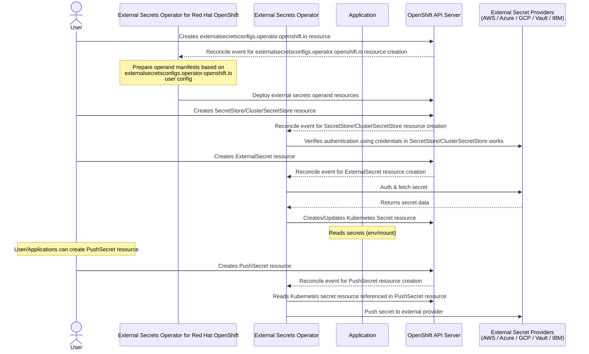

# External Secrets Operator for Red Hat OpenShift

## Summary

The [external-secrets](https://github.com/external-secrets/external-secrets) project integrates external secret management systems like [AWS Secrets Manager](https://aws.amazon.com/secrets-manager/), 
[HashiCorp Vault](https://www.vaultproject.io/), [Google Secrets Manager](https://cloud.google.com/secret-manager), [Azure Key Vault](https://azure.microsoft.com/en-us/services/key-vault/), [IBM Cloud Secrets Manager](https://www.ibm.com/cloud/secrets-manager), [CyberArk Conjur](https://www.conjur.org/), 
and many more. external-secrets is responsible for syncing secrets from external APIs to Kubernetes secrets and managing their lifecycle. The applications 
dependent on the secrets need not worry about authentication/access, or fetching the secrets from external sources. This enhancement describes
how the external-secrets project can be deployed by an optional operator on OpenShift.

Note: Throughout the document, the following terminology means.
- `external-secrets-operator` is the dedicated operator in Red Hat OpenShift for managing the external-secrets project deployment.
- `external-secrets` is the operand managed by the external-secrets-operator.
- `externalsecretsmanager.operator.openshift.io` and `externalsecretsconfigs.operator.openshift.io` are the custom resources for interacting
  with `external-secrets-operator` to install, configure and uninstall the `external-secrets` deployment in Red Hat OpenShift.

## Motivation

Kubernetes Secrets are built-in objects that store and manage secrets such as credentials, TLS keys, etc. in a Kubernetes cluster. External Secrets 
is for storing secrets outside the Kubernetes cluster. Secrets are stored and managed by external secret systems with which Kubernetes applications
interact to read and write secrets. Customers often rely on external secret managers (e.g., AWS Secrets Manager, HashiCorp Vault, GCP Secret Manager)
to meet security, compliance, and operational standards. The External Secrets Operator(ESO) integrates these systems with Kubernetes in a secure and 
automated way. ESO acts as a controller that authenticates with external secret stores, retrieves secrets, and injects them into Kubernetes 
as native Secret resources — without requiring applications to directly access or manage those secrets, which ensures
- Decouple applications from secret lifecycle management.
- Ensure compliance by centralizing secret storage.
- Enable secure, automated secret rotation.
- Support multi-cloud secret sourcing with fine-grained access control.
- Access control is centralized and auditable.

### User Stories

- As a cluster administrator, I want to install and manage external-secrets project though an OLM operator.
- As a security engineer, I want the applications to make use of Kubernetes native secret objects, instead of each
  application having access to the external secret managers.

### Goals

- Allow cluster administrators to install, upgrade and uninstall external-secrets though an optional OLM day-2 operator.
- New custom resource(CR) `externalsecretsconfigs.operator.openshift.io` to be made available to manage external-secrets deployment.
- Provide developers with access to sensitive information stored in external secret managers without requiring them to have 
  direct access to those external systems or their credentials. And instead, synchronize secrets from external sources into
  native Kubernetes secret objects.

### Non-Goals

- This enhancement will not diverge the `external-secrets` from upstream code, any missing functionality must go through the upstream process.
- Removing `externalsecretsconfigs.operator.openshift.io` CR object will not remove external-secrets deployment. But will only stop the reconciliation of
  Kubernetes resources created for operand installation. (Note: This will be a limitation for GA and will be re-evaluated in future releases).
- Upgrading from a TechPreview version is not supported.

## Proposal

The external-secrets can be deployed through the `external-secrets-operator`, a day-2 operator. A new custom resource is defined to configure the external-secrets
deployment. The operator will manage and maintain the external-secrets deployment in desired state which can be monitored by the user 
through the status sub-resource of the new custom resource. `external-secrets-operator` will make use of static manifest templates for creating 
the resources required for successfully deploying `external-secrets`. Please refer to the `Implementation Details/Notes/Constraints` section for 
more details. external-secrets-operator watches the new CR `externalsecretsconfigs.operator.openshift.io` and deploys the resources required for `external-secrets`.

Each of the resources created for external-secrets deployment will have the below set of labels added(sample values are used),
along with any additional labels configured by the user.
- `app: external-secrets-operator`
- `app.kubernetes.io/name: external-secrets`
- `app.kubernetes.io/instance: external-secrets`
- `app.kubernetes.io/version: "v0.19.0"`
- `app.kubernetes.io/managed-by: external-secrets-operator`
- `app.kubernetes.io/part-of: external-secrets-operator`

These labels adhere to Kubernetes and OpenShift conventions, aiding in identifying, categorizing, and managing the
`external-secrets` components within the cluster environment, thereby facilitating operations like monitoring and resource discovery.

Refer to the links below for more information on the labels used:
- [Guidelines for Labels and Annotations for OpenShift applications](https://github.com/redhat-developer/app-labels/blob/master/labels-annotation-for-openshift.adoc)
- [Well-Known Labels, Annotations and Taints](https://kubernetes.io/docs/reference/labels-annotations-taints/)

`externalsecretsconfigs.operator.openshift.io` CR object is a cluster-scoped object and is enforced in CRD to have the name as cluster.

Certain configurations made available in the spec of `externalsecretsconfigs.operator.openshift.io` CR are passed as command line arguments to `external-secrets`
and updating such configurations would cause the new rollout of the external-secrets agent deployment, which means a new pod will be created 
and old pod will terminate resulting in external-secrets restart.

When the user deletes `externalsecretsconfigs.operator.openshift.io` CR object, external-secrets-operator will stop managing all the resources
created for installing external-secrets and the user will have to manually clean up the resources. Please refer to the 
`Operational Aspects of API Extensions` section for command to list all the resources.

`externalsecretsconfigs.operator.openshift.io` CR status sub-resource will be used for updating the status of the external-secrets installation,
any error encountered while creating the required resources or the reconciling the state.

`externalsecretsmanager.operator.openshift.io` is another CR object, which is made available for configuring global options and to 
enable optional or TechPreview features. The CR object will be created by the operator with the default values and user can
modify or update the CR as required.

A fork of upstream [external-secrets](https://github.com/external-secrets/external-secrets) will be created [downstream](https://github.com/openshift/external-secrets) for better version management.

### Workflow Description

- Installation of external-secrets.
    - An OpenShift user with cluster-admin permissions
        - Installs the `external-secrets-operator`.
	    - Creates the `externalsecretsconfigs.operator.openshift.io` CR.
    - `external-secrets-operator` based on the configuration in `externalsecretsconfigs.operator.openshift.io` CR, installs the `external-secrets`.

- Uninstallation of external-secrets.
	- An OpenShift user with cluster-admin permissions deletes the `externalsecretsconfigs.operator.openshift.io` CR.
	- `external-secrets-operator` will not uninstall external-secrets, but will only stop reconciling the Kubernetes resources created for
      installing it. Please refer to the `Non-Goals` section for more details.
	- An OpenShift user with cluster-admin permissions uninstalls the `external-secrets-operator`.



### API Extensions

Below new APIs `externalsecretsmanager.operator.openshift.io` and `externalsecretsconfigs.operator.openshift.io` are introduced for managing
`external-secrets` deployment by the `external-secrets-operator`.

```go
package v1alpha1

// +k8s:deepcopy-gen:interfaces=k8s.io/apimachinery/pkg/runtime.Object
// +kubebuilder:object:root=true

// ExternalSecretsManagerList is a list of ExternalSecretsManager objects.
type ExternalSecretsManagerList struct {
	metav1.TypeMeta `json:",inline"`

	// metadata is the standard list's metadata.
	// More info: https://git.k8s.io/community/contributors/devel/sig-architecture/api-conventions.md#metadata
	metav1.ListMeta `json:"metadata"`
	Items           []ExternalSecretsManager `json:"items"`
}

// +genclient
// +genclient:nonNamespaced
// +k8s:deepcopy-gen:interfaces=k8s.io/apimachinery/pkg/runtime.Object
// +kubebuilder:object:root=true
// +kubebuilder:subresource:status
// +kubebuilder:resource:path=externalsecretsmanagers,scope=Cluster,categories={external-secrets-operator, external-secrets},shortName=esm;externalsecretsmanager;esmanager
// +kubebuilder:printcolumn:name="AGE",type="date",JSONPath=".metadata.creationTimestamp"
// +kubebuilder:metadata:labels={"app.kubernetes.io/name=externalsecretsmanager", "app.kubernetes.io/part-of=external-secrets-operator"}

// ExternalSecretsManager describes configuration and information about the deployments managed by
// the external-secrets-operator. The name must be `cluster` as this is a singleton object allowing
// only one instance of ExternalSecretsManager per cluster.
//
// It is mainly for configuring the global options and enabling optional features, which
// serves as a common/centralized config for managing multiple controllers of the operator. The object
// is automatically created during the operator installation.
//
// +kubebuilder:validation:XValidation:rule="self.metadata.name == 'cluster'",message="ExternalSecretsManager is a singleton, .metadata.name must be 'cluster'"
// +operator-sdk:csv:customresourcedefinitions:displayName="ExternalSecretsManager"
type ExternalSecretsManager struct {
	metav1.TypeMeta `json:",inline"`

	// metadata is the standard object's metadata.
	// More info: https://git.k8s.io/community/contributors/devel/sig-architecture/api-conventions.md#metadata
	metav1.ObjectMeta `json:"metadata,omitempty"`

	// spec is the specification of the desired behavior
	Spec ExternalSecretsManagerSpec `json:"spec,omitempty"`

	// status is the most recently observed status of controllers used by
	// External Secrets Operator.
	Status ExternalSecretsManagerStatus `json:"status,omitempty"`
}

// ExternalSecretsManagerSpec is the specification of the desired behavior of the ExternalSecretsManager.
type ExternalSecretsManagerSpec struct {
	// globalConfig is for configuring the behavior of deployments that are managed
	// by external secrets-operator.
	// +kubebuilder:validation:Optional
	GlobalConfig *GlobalConfig `json:"globalConfig,omitempty"`

	// features is for enabling the optional operator features.
	// +kubebuilder:validation:Optional
	Features []Feature `json:"features,omitempty"`
}

// GlobalConfig is for configuring the external-secrets-operator behavior.
type GlobalConfig struct {
	// labels to apply to all resources created by the operator.
	// +mapType=granular
	// +kubebuilder:validation:MinProperties:=0
	// +kubebuilder:validation:MaxProperties:=20
	// +kubebuilder:validation:Optional
	Labels map[string]string `json:"labels,omitempty"`

	CommonConfigs `json:",inline,omitempty"`
}

// Feature is for enabling the optional features.
type Feature struct {
	// name of the optional feature.
	// +kubebuilder:validation:Required
	Name string `json:"name"`

	// enabled indicates whether the feature is active.
	// +kubebuilder:validation:Enum:="true";"false"
	// +kubebuilder:validation:Required
	Enabled string `json:"enabled,omitempty"`
}

// ExternalSecretsManagerStatus is the most recently observed status of the ExternalSecretsManager.
type ExternalSecretsManagerStatus struct {
	// controllerStatuses holds the observed conditions of the controllers part of the operator.
	// +patchMergeKey=type
	// +patchStrategy=merge
	// +listType=map
	// +listMapKey=name
	ControllerStatuses []ControllerStatus `json:"controllerStatuses,omitempty"`

	// lastTransitionTime is the last time the condition transitioned from one status to another.
	// +kubebuilder:validation:Type=string
	// +kubebuilder:validation:Format=date-time
	LastTransitionTime metav1.Time `json:"lastTransitionTime,omitempty"`
}

// ControllerStatus holds the observed conditions of the controllers part of the operator.
type ControllerStatus struct {
	// name of the controller for which the observed condition is recorded.
	// +kubebuilder:validation:Required
	Name string `json:"name"`

	// conditions holds information of the current state of the external-secrets-operator controllers.
	// +patchMergeKey=type
	// +patchStrategy=merge
	// +listType=map
	// +listMapKey=type
	Conditions []Condition `json:"conditions,omitempty"`

	// observedGeneration represents the .metadata.generation on the observed resource.
	// +kubebuilder:validation:Minimum=0
	ObservedGeneration int64 `json:"observedGeneration,omitempty"`
}

type Condition struct {
	// type of the condition
	// +kubebuilder:validation:Required
	Type string `json:"type"`

	// status of the condition
	Status metav1.ConditionStatus `json:"status"`

	// message provides details about the state.
	Message string `json:"message"`
}
```

```go
package v1alpha1

// +k8s:deepcopy-gen:interfaces=k8s.io/apimachinery/pkg/runtime.Object
// +kubebuilder:object:root=true

// ExternalSecretsConfigList is a list of ExternalSecretsConfig objects.
type ExternalSecretsConfigList struct {
	metav1.TypeMeta `json:",inline"`

	// metadata is the standard list's metadata.
	// More info: https://git.k8s.io/community/contributors/devel/sig-architecture/api-conventions.md#metadata
	metav1.ListMeta `json:"metadata"`
	Items           []ExternalSecretsConfig `json:"items"`
}

// +genclient
// +genclient:nonNamespaced
// +k8s:deepcopy-gen:interfaces=k8s.io/apimachinery/pkg/runtime.Object
// +kubebuilder:object:root=true
// +kubebuilder:subresource:status
// +kubebuilder:resource:path=externalsecretsconfigs,scope=Cluster,categories={external-secrets-operator, external-secrets},shortName=esc;externalsecretsconfig;esconfig
// +kubebuilder:printcolumn:name="Ready",type="string",JSONPath=".status.conditions[?(@.type=='Ready')].status"
// +kubebuilder:printcolumn:name="Message",type="string",JSONPath=".status.conditions[?(@.type=='Ready')].message"
// +kubebuilder:printcolumn:name="AGE",type="date",JSONPath=".metadata.creationTimestamp"
// +kubebuilder:metadata:labels={"app.kubernetes.io/name=externalsecretsconfig", "app.kubernetes.io/part-of=external-secrets-operator"}

// ExternalSecretsConfig describes configuration and information about the managed external-secrets
// deployment. The name must be `cluster` as ExternalSecretsConfig is a singleton,
// allowing only one instance per cluster.
//
// When an ExternalSecretsConfig is created, a new deployment is created which manages the
// external-secrets and keeps it in the desired state.
//
// +kubebuilder:validation:XValidation:rule="self.metadata.name == 'cluster'",message="ExternalSecretsConfig is a singleton, .metadata.name must be 'cluster'"
// +operator-sdk:csv:customresourcedefinitions:displayName="ExternalSecretsConfig"
type ExternalSecretsConfig struct {
	metav1.TypeMeta `json:",inline"`

	// metadata is the standard object's metadata.
	// More info: https://git.k8s.io/community/contributors/devel/sig-architecture/api-conventions.md#metadata
	metav1.ObjectMeta `json:"metadata,omitempty"`

	// spec is the specification of the desired behavior of the ExternalSecretsConfig.
	Spec ExternalSecretsConfigSpec `json:"spec,omitempty"`

	// status is the most recently observed status of the ExternalSecretsConfig.
	Status ExternalSecretsConfigStatus `json:"status,omitempty"`
}

// ExternalSecretsConfigSpec is for configuring the external-secrets operand behavior.
type ExternalSecretsConfigSpec struct {
	// appConfig is for specifying the configurations for the external-secrets operand.
	// +kubebuilder:validation:Optional
	ApplicationConfig ApplicationConfig `json:"appConfig,omitempty"`

	// controllerConfig is for specifying the configurations for the controller to use while installing
	// the `external-secrets` operand.
	// +kubebuilder:validation:Optional
	ControllerConfig ControllerConfig `json:"controllerConfig,omitempty"`
}

// ExternalSecretsConfigStatus is the most recently observed status of the ExternalSecretsConfig.
type ExternalSecretsConfigStatus struct {
	// conditions holds information of the current state of the external-secrets deployment.
	ConditionalStatus `json:",inline,omitempty"`

	// externalSecretsImage is the name of the image and the tag used for deploying external-secrets.
	ExternalSecretsImage string `json:"externalSecretsImage,omitempty"`

	// BitwardenSDKServerImage is the name of the image and the tag used for deploying bitwarden-sdk-server.
	BitwardenSDKServerImage string `json:"bitwardenSDKServerImage,omitempty"`
}

// ApplicationConfig is for specifying the configurations for the external-secrets operand.
type ApplicationConfig struct {
	// operatingNamespace is for restricting the external-secrets operations to the provided namespace.
	// And when enabled `ClusterSecretStore` and `ClusterExternalSecret` are implicitly disabled.
	// +kubebuilder:validation:MinLength:=1
	// +kubebuilder:validation:MaxLength:=63
	// +kubebuilder:validation:Optional
	OperatingNamespace string `json:"operatingNamespace,omitempty"`

	// bitwardenSecretManagerProvider is for enabling the bitwarden secrets manager provider and
	// for setting up the additional service required for connecting with the bitwarden server.
	// +kubebuilder:validation:Optional
	BitwardenSecretManagerProvider *BitwardenSecretManagerProvider `json:"bitwardenSecretManagerProvider,omitempty"`

	// webhookConfig is for configuring external-secrets webhook specifics.
	// +kubebuilder:validation:Optional
	WebhookConfig *WebhookConfig `json:"webhookConfig,omitempty"`

	// CertManagerConfig is for configuring cert-manager specifics, which will be used for generating
	// certificates for webhook and bitwarden-sdk-server components.
	// +kubebuilder:validation:Optional
	CertManagerConfig *CertManagerConfig `json:"certManagerConfig,omitempty"`

	// +kubebuilder:validation:Optional
	CommonConfigs `json:",inline,omitempty"`
}

// ControllerConfig is for specifying the configurations for the controller to use while installing
// the `external-secrets` operand.
// +kubebuilder:validation:XValidation:rule="!has(oldSelf.namespace) && !has(self.namespace) || has(oldSelf.namespace) && has(self.namespace)",message="namespace can only be configured during creation"
type ControllerConfig struct {
	// namespace is for configuring the namespace to install the external-secret operand.
	// This field is immutable once set.
	// +kubebuilder:default:="external-secrets"
	// +kubebuilder:validation:MinLength:=1
	// +kubebuilder:validation:MaxLength:=63
	// +kubebuilder:validation:XValidation:rule="self == oldSelf",message="namespace is immutable once set"
	// +kubebuilder:validation:Optional
	Namespace string `json:"namespace,omitempty"`

	// labels to apply to all resources created for the external-secrets operand deployment.
	// +mapType=granular
	// +kubebuilder:validation:MinProperties:=0
	// +kubebuilder:validation:MaxProperties:=20
	// +kubebuilder:validation:Optional
	Labels map[string]string `json:"labels,omitempty"`
}

// BitwardenSecretManagerProvider is for enabling the bitwarden secrets manager provider and
// for setting up the additional service required for connecting with the bitwarden server.
type BitwardenSecretManagerProvider struct {
	// enabled is for enabling the bitwarden secrets manager provider, which can be indicated
	// by setting `true` or `false`.
	// +kubebuilder:validation:Enum:="true";"false"
	// +kubebuilder:default:="false"
	// +kubebuilder:validation:Optional
	Enabled string `json:"enabled,omitempty"`

	// SecretRef is the Kubernetes secret containing the TLS key pair to be used for the bitwarden server.
	// The issuer in CertManagerConfig will be utilized to generate the required certificate if the secret
	// reference is not provided and CertManagerConfig is configured. The key names in secret for certificate
	// must be `tls.crt`, for private key must be `tls.key` and for CA certificate key name must be `ca.crt`.
	// +kubebuilder:validation:Optional
	SecretRef *SecretReference `json:"secretRef,omitempty"`
}

// WebhookConfig is for configuring external-secrets webhook specifics.
type WebhookConfig struct {
	// CertificateCheckInterval is for configuring the polling interval to check the certificate
	// validity.
	// +kubebuilder:default:="5m"
	// +kubebuilder:validation:Optional
	CertificateCheckInterval *metav1.Duration `json:"certificateCheckInterval,omitempty"`
}

// CertManagerConfig is for configuring cert-manager specifics.
// +kubebuilder:validation:XValidation:rule="self.enabled != 'true' || has(self.issuerRef)",message="issuerRef must be provided when enabled is set to 'true'."
// +kubebuilder:validation:XValidation:rule="has(self.addInjectorAnnotations) && self.addInjectorAnnotations != 'false' ? self.enabled != 'false' : true",message="addInjectorAnnotations can only be set when enabled is set to 'true'."
type CertManagerConfig struct {
	// enabled is for enabling the use of cert-manager for obtaining and renewing the
	// certificates used for webhook server, instead of built-in certificates.
	// Use `true` or `false` to indicate the preference. This field is immutable once set.
	// +kubebuilder:validation:XValidation:rule="self == oldSelf",message="enabled is immutable once set"
	// +kubebuilder:validation:Enum:="true";"false"
	// +kubebuilder:default:="false"
	// +kubebuilder:validation:Required
	Enabled string `json:"enabled"`

	// addInjectorAnnotations is for adding the `cert-manager.io/inject-ca-from` annotation to the
	// webhooks and CRDs to automatically setup webhook to the cert-manager CA. This requires
	// CA Injector to be enabled in cert-manager. Use `true` or `false` to indicate the preference.
	// +kubebuilder:validation:Enum:="true";"false"
	// +kubebuilder:default:="false"
	// +kubebuilder:validation:Optional
	AddInjectorAnnotations string `json:"addInjectorAnnotations,omitempty"`

	// issuerRef contains details of the referenced object used for obtaining certificates. When
	// `issuerRef.Kind` is `Issuer`, it must exist in the `.spec.controllerConfig.namespace`.
	// This field is immutable once set.
	// +kubebuilder:validation:XValidation:rule="self == oldSelf",message="issuerRef is immutable once set"
	// +kubebuilder:validation:XValidation:rule="self.kind.lowerAscii() == 'issuer' || self.kind.lowerAscii() == 'clusterissuer'",message="kind must be either 'Issuer' or 'ClusterIssuer'"
	// +kubebuilder:validation:XValidation:rule="self.group.lowerAscii() == 'cert-manager.io'",message="group must be 'cert-manager.io'"
	// +kubebuilder:validation:Optional
	IssuerRef ObjectReference `json:"issuerRef,omitempty"`

	// certificateDuration is the validity period of the webhook certificate.
	// +kubebuilder:default:="8760h"
	// +kubebuilder:validation:Optional
	CertificateDuration *metav1.Duration `json:"certificateDuration,omitempty"`

	// certificateRenewBefore is the ahead time to renew the webhook certificate
	// before expiry.
	// +kubebuilder:default:="30m"
	// +kubebuilder:validation:Optional
	CertificateRenewBefore *metav1.Duration `json:"certificateRenewBefore,omitempty"`
}
```

```go
package v1alpha1

// ConditionalStatus holds information of the current state of the external-secrets deployment
// indicated through defined conditions.
type ConditionalStatus struct {
	// conditions holds information of the current state of deployment.
	// +patchMergeKey=type
	// +patchStrategy=merge
	// +listType=map
	// +listMapKey=type
	Conditions []metav1.Condition `json:"conditions,omitempty"`
}

// ObjectReference is a reference to an object with a given name, kind and group.
type ObjectReference struct {
	// Name of the resource being referred to.
	// +kubebuilder:validation:MinLength:=1
	// +kubebuilder:validation:MaxLength:=253
	// +kubebuilder:validation:Required
	Name string `json:"name"`
	// Kind of the resource being referred to.
	// +kubebuilder:validation:MinLength:=1
	// +kubebuilder:validation:MaxLength:=253
	// +kubebuilder:validation:Optional
	Kind string `json:"kind,omitempty"`
	// Group of the resource being referred to.
	// +kubebuilder:validation:MinLength:=1
	// +kubebuilder:validation:MaxLength:=253
	// +kubebuilder:validation:Optional
	Group string `json:"group,omitempty"`
}

// SecretReference is a reference to the secret with the given name, which should exist
// in the same namespace where it will be utilized.
type SecretReference struct {
	// Name of the secret resource being referred to.
	// +kubebuilder:validation:MinLength:=1
	// +kubebuilder:validation:MaxLength:=253
	// +kubebuilder:validation:Required
	Name string `json:"name"`
}

// CommonConfigs are the common configurations available for all the operands managed
// by the operator.
type CommonConfigs struct {
	// logLevel supports value range as per [Kubernetes logging guidelines](https://github.com/kubernetes/community/blob/master/contributors/devel/sig-instrumentation/logging.md#what-method-to-use).
	// +kubebuilder:default:=1
	// +kubebuilder:validation:Minimum:=1
	// +kubebuilder:validation:Maximum:=5
	// +kubebuilder:validation:Optional
	LogLevel int32 `json:"logLevel,omitempty"`

	// resources is for defining the resource requirements.
	// Cannot be updated.
	// ref: https://kubernetes.io/docs/concepts/configuration/manage-resources-containers/
	// +kubebuilder:validation:Optional
	Resources *corev1.ResourceRequirements `json:"resources,omitempty"`

	// affinity is for setting scheduling affinity rules.
	// ref: https://kubernetes.io/docs/concepts/scheduling-eviction/assign-pod-node/
	// +kubebuilder:validation:Optional
	Affinity *corev1.Affinity `json:"affinity,omitempty"`

	// tolerations is for setting the pod tolerations.
	// ref: https://kubernetes.io/docs/concepts/scheduling-eviction/taint-and-toleration/
	// +listType=atomic
	// +kubebuilder:validation:MinItems:=0
	// +kubebuilder:validation:MaxItems:=10
	// +kubebuilder:validation:Optional
	Tolerations []corev1.Toleration `json:"tolerations,omitempty"`

	// nodeSelector is for defining the scheduling criteria using node labels.
	// ref: https://kubernetes.io/docs/concepts/configuration/assign-pod-node/
	// +mapType=atomic
	// +kubebuilder:validation:MinProperties:=0
	// +kubebuilder:validation:MaxProperties:=10
	// +kubebuilder:validation:Optional
	NodeSelector map[string]string `json:"nodeSelector,omitempty"`

	// proxy is for setting the proxy configurations which will be made available
	// in operand containers managed by the operator as environment variables.
	// +kubebuilder:validation:Optional
	Proxy *ProxyConfig `json:"proxy,omitempty"`
}

// ProxyConfig is for setting the proxy configurations which will be made available
// in operand containers managed by the operator as environment variables.
type ProxyConfig struct {
	// httpProxy is the URL of the proxy for HTTP requests.
	// +kubebuilder:validation:MinLength:=0
	// +kubebuilder:validation:MaxLength:=2048
	// +kubebuilder:validation:Optional
	HTTPProxy string `json:"httpProxy,omitempty"`

	// httpsProxy is the URL of the proxy for HTTPS requests.
	// +kubebuilder:validation:MinLength:=0
	// +kubebuilder:validation:MaxLength:=2048
	// +kubebuilder:validation:Optional
	HTTPSProxy string `json:"httpsProxy,omitempty"`

	// noProxy is a comma-separated list of hostnames and/or CIDRs and/or IPs for which the proxy should not be used.
	// +kubebuilder:validation:MinLength:=0
	// +kubebuilder:validation:MaxLength:=4096
	// +kubebuilder:validation:Optional
	NoProxy string `json:"noProxy,omitempty"`
}
```

### Topology Considerations

#### Hypershift / Hosted Control Planes

None

#### Standalone Clusters

None

#### Single-node Deployments or MicroShift

None

### Implementation Details/Notes/Constraints

The implementation will make use of static manifests of below kinds to install `external-secrets` and keep the deployment in desired state.
- Certificates
- ClusterRoles
- ClusterRoleBindings
- Deployments
- Roles
- RoleBindings
- Secrets
- ServiceAccounts
- ValidatingWebhookConfigurations

The static manifests are derived from the charts found [here](https://github.com/openshift/external-secrets/tree/main/deploy/charts/external-secrets).

#### New API changes for GA release

The `spec` of `externalsecretsconfigs.operator.openshift.io` API in TP version had two fields `externalSecretsConfig` and `controllerConfig`
which were for specifying the configurations to set up and install the `external-secrets` application. The `externalSecretsConfig` field has
been renamed to `appConfig`, with no change to the `controllerConfig` field.

New configurations for providing proxy settings have been made available.If a cluster-wide proxy is configured on the OpenShift cluster,
OLM automatically updates the operator deployments with HTTP_PROXY, HTTPS_PROXY, and NO_PROXY environment variables. These variables will
then be propagated to all the operand deployments by the operator. Users can also set proxy configurations specific to
`external-secrets` in `externalsecretsconfigs.operator.openshift.io`, or they can set common configurations for all operands managed by
the operator in `externalsecretsmanager.operator.openshift.io`.

Validations for fields in the `externalsecretsconfigs.operator.openshift.io` API have been updated with minimum and maximum limits to
restrict configurable values, preventing users from setting arbitrarily large data that could cause system instability. For the fields
below, the lower and upper bounds have been set based on what is considered reasonable, as there is no defined standard. These can be
updated in the future based on user feedback.
- `spec.appConfig.tolerations` and `spec.appConfig.nodeSelector` fields are allowed to have a max of `10` entries.
- `spec.controllerConfig.labels` field allows to configure a maximum of `20` labels to be attached to all the resources created by
  the operator to deploy `external-secrets` operand.
- `spec.appConfig.proxy.httpProxy` and `spec.appConfig.proxy.httpsProxy` have an upper limit of `2048`. And similarly
  `spec.appConfig.proxy.noProxy` has an upper limit of `4096`.

#### Resources cleanup when optional features enabled/disabled.

- external-secrets has a dedicated controller for creating and managing the certificates required for its webhook component. It also
  has a provision to use the cert-manager solution for the webhook certificates. The in-built cert-controller also injects the
  CA certificate into the CRDs required by the API server to validate the webhook server

  When cert-manager configurations are added in `externalsecretsconfigs.operator.openshift.io` after `external-secrets` installation,
  the deployment created for the in-built certificate controller must be removed. This prevents conflicts where both cert-manager and
  the `cert-controller` attempt to inject their own CA certificates into CRDs.

  Since `cert-manager` specific configurations cannot be disabled once enabled, the following resources created for the `cert-controller`
  are no longer required and can be removed:
  - ClusterRole
  - ClusterRoleBinding
  - Deployment
  - Secret
  - ServiceAccount

  The current validation process for cert-manager configurations makes it easier and safer to delete the aforementioned resources,
  specifically because:
  - `cert-manager` specific configurations cannot be toggled.
  - The reconciliation flow ensures that the provided cert-manager configuration (e.g., the issuerRef) is valid and that the referenced
    objects exist. Only after this validation are the cert-controller-specific resources removed, ensuring a safe transition for
    certificate management.

- Enabling the `bitwarden secret manager` plugin is optional, and user can enable or disable it in `externalsecretsconfigs.operator.openshift.io`.
  Currently, when the feature is disabled, the following resources created for the plugin are not removed, requiring manual cleanup.
  - Certificates
  - Deployment
  - Service
  - ServiceAccount

  Cleanup will not cause any functionality degradation for services dependent on the secrets fetched from `bitwarden secret manager`, unless
  the secret value has been modified. The applications dependent on the fetched secrets can continue to consume it. The Kubernetes Secret
  resources containing the fetched values, or custom resources like SecretStore and ExternalSecrets, will not be deleted; users must
  manually clean those up.

### Risks and Mitigations

- The user must keep the `SecretStore` and `ClusterSecretStore` content updated to enable smooth reconciliation of secrets from the providers, 
which otherwise could cause authentication failures in applications dependent on the secrets, when secrets have been rotated.
- The secret zero problem is inherent, i.e. all the secrets fetched from external secret systems are stored in Kubernetes native `secret` object 
  which would need to be secured with additional encryption.

### Drawbacks

None

## Open Questions [optional]

None

## Test Plan

The following scenarios will be covered to ensure that the External Secrets Operator functions as expected and integrates properly with the OpenShift ecosystem:

### 1. Basic Installation Verification

- Install external-secrets by creating an `ExternalSecrets` custom resource (`externalsecretsconfigs.operator.openshift.io`) with default configurations.
- Verify that all core components are deployed and become ready, including:
    - Controller manager
    - Webhook (if enabled)
    - Custom Resource Definitions (CRDs)
- Validate default behavior and ensure basic sync functionality works.

### 2. Configuration Testing

- Apply configuration overrides such as:
    - Custom resource limits (CPU/memory)
    - Replicas and horizontal scaling
    - Disabling webhook or cert-manager components
- Ensure the operator reflects and respects configuration changes appropriately.

### 3. Provider Adaptation Testing

Verify compatibility and correct behavior with each officially supported backend provider:
- AWS Secrets Manager
- AWS Parameter Store
- HashiCorp Vault
- Google Cloud Secret Manager
- Azure Key Vault
- IBM Cloud Secrets Manager (if supported)
  For each provider:
- Create a valid `SecretStore` or `ClusterSecretStore`.
- Create one or more `ExternalSecret` resources referencing secrets in the backend.
- Verify that:
    - Secrets are successfully synced.
    - Updates in the backend reflect in Kubernetes secrets.
    - Misconfigurations produce appropriate status conditions.

### 4. Upgrade and Uninstall Testing

- Test upgrading from a previous operator version to the current version.
- Ensure existing secrets and `ExternalSecret` resources remain intact and continue syncing.
- Validate that uninstalling the operator cleans up associated resources without leaving orphaned components.

## Graduation Criteria

### Dev Preview -> Tech Preview

- Ability to utilize the enhancement end-to-end
- Operator usage documentation for end users, relative API stability
- Sufficient test coverage
- Gather feedback from the customers

### Tech Preview -> GA

- Ability to utilize the enhancement end-to-end
- Operator usage documentation for end users, relative API stability
- Sufficient test coverage

### Removing a deprecated feature

None

## Upgrade / Downgrade Strategy
N/A. This feature is for Tech Preview.

## Version Skew Strategy

N/A. This feature is for Tech Preview.

## Operational Aspects of API Extensions

Listing all the resources created for installing the external-secrets by the operator.

```shell
oc get CustomResourceDefinitions,Certificates,ClusterRoles,ClusterRoleBindings,Deployments,Roles,RoleBindings,Secrets,ServiceAccounts,ValidatingWebhookConfigurations -l "app=external-secrets" -n <external-secrets-installed-namespace>
```

## Support Procedures

## Alternatives (Not Implemented)

None

## Infrastructure Needed [optional]

None
