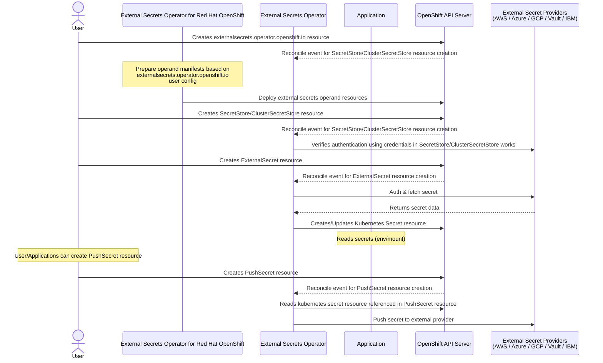

# External Secrets Operator for Red Hat OpenShift

## Summary

The [external-secrets](https://github.com/external-secrets/external-secrets) project integrates external secret management systems like [AWS Secrets Manager](https://aws.amazon.com/secrets-manager/), 
[HashiCorp Vault](https://www.vaultproject.io/), [Google Secrets Manager](https://cloud.google.com/secret-manager), [Azure Key Vault](https://azure.microsoft.com/en-us/services/key-vault/), [IBM Cloud Secrets Manager](https://www.ibm.com/cloud/secrets-manager), [CyberArk Conjur](https://www.conjur.org/), 
and many more. external-secrets is responsible for syncing secrets from external APIs to Kubernetes secrets and managing their lifecycle. The applications 
dependent on the secrets need not worry about authentication/access, or fetching the secrets from external sources. This enhancement describes
how the external-secrets project can be deployed by an optional operator on OpenShift.

Note: Throughout the document, the following terminology means.
- `external-secrets-operator` is the dedicated operator in Red Hat OpenShift for managing the external-secrets project deployment.
- `external-secrets` is the operand managed by the external-secrets-operator.
- `externalsecretsoperator.operator.openshift.io` and `externalsecrets.operator.openshift.io` are the custom resources for interacting 
  with `external-secrets-operator` to install, configure and uninstall the `external-secrets` deployment in Red Hat OpenShift.

## Motivation

Kubernetes Secrets are built-in objects that store and manage secrets such as credentials, TLS keys, etc. in a Kubernetes cluster. External Secrets 
is for storing secrets outside the Kubernetes cluster. Secrets are stored and managed by external secret systems with which Kubernetes applications
interact with to read and write secrets. Customers often rely on external secret managers (e.g., AWS Secrets Manager, HashiCorp Vault, GCP Secret Manager)
to meet security, compliance, and operational standards. The External Secrets Operator(ESO) integrates these systems with Kubernetes in a secure and 
automated way. ESO acts as a controller that authenticates with external secret stores, retrieves secrets, and injects them into Kubernetes 
as native Secret resources — without requiring applications to directly access or manage those secrets, which ensures
- Decouple applications from secret lifecycle management.
- Ensure compliance by centralizing secret storage.
- Enable secure, automated secret rotation.
- Support multi-cloud secret sourcing with fine-grained access control.
- Access control is centralized and auditable.

### User Stories

- As a cluster administrator, I want to install and manage external-secrets project though an OLM operator.
- As a security engineer, I want the applications to make use of kubernetes native secret objects, instead of each 
  application having access to the external secret managers.

### Goals

- Allow cluster administrators to install, upgrade and uninstall external-secrets though an optional OLM day-2 operator.
- New custom resource(CR) `externalsecrets.operator.openshift.io` to be made available to manage external-secrets deployment.
- Provide developers with access to sensitive information stored in external secret managers without requiring them to have 
  direct access to those external systems or their credentials. And instead, synchronize secrets from external sources into
  native Kubernetes secret objects.

### Non-Goals

- This enhancement will not diverge the `external-secrets` from upstream code, any missing functionality must go through the upstream process.
- Removing `externalsecrets.operator.openshift.io` CR object will not remove external-secrets deployment. But will only stop the reconciliation of 
  kubernetes resources created for agent deployment. (Note: This will be a limitation for TechPreview and will be re-evaluated for GA)
- Upgrading from a TechPreview version is not supported.

## Proposal

The external-secrets can be deployed through the `external-secrets-operator`, a day 2 operator. A new custom resource is defined to configure the external-secrets 
deployment. The operator will manage and maintain the external-secrets deployment in desired state which can be monitored by the user 
through the status sub-resource of the new custom resource. `external-secrets-operator` will make use of static manifest templates for creating 
the resources required for successfully deploying `external-secrets`. Please refer to the `Implementation Details/Notes/Constraints` section for 
more details. external-secrets-operator watches the new CR `externalsecrets.operator.openshift.io` and deploys the resources required for `external-secrets`.

Each of the resources created for external-secrets deployment will have the below set of labels added, along with any additional labels configured by the user.
- `app: external-secrets-operator`
- `app.kubernetes.io/name: external-secrets`
- `app.kubernetes.io/instance: external-secrets`
- `app.kubernetes.io/version: "v0.14.0"`
- `app.kubernetes.io/managed-by: external-secrets-operator`
- `app.kubernetes.io/part-of: external-secrets-operator`

Refer below links for more information on the labels used
- [Guidelines for Labels and Annotations for OpenShift applications](https://github.com/redhat-developer/app-labels/blob/master/labels-annotation-for-openshift.adoc)
- [Well-Known Labels, Annotations and Taints](https://kubernetes.io/docs/reference/labels-annotations-taints/)

`externalsecrets.operator.openshift.io` CR object is a cluster-scoped object and is enforced in CRD to have the name as cluster.

Configurations made available in the spec of `externalsecrets.operator.openshift.io` CR are passed as command line arguments to `external-secrets`
and updating such configurations would cause the new rollout of the external-secrets agent deployment, which means a new pod will be created 
and old pod will terminate resulting in external-secrets restart.

When the user deletes `externalsecrets.operator.openshift.io` CR object, external-secrets-operator will stop managing all the resources 
created for installing external-secrets and the user will have to manually clean up the resources. Please refer to the 
`Operational Aspects of API Extensions` section for command to list all the resources.

`externalsecrets.operator.openshift.io` CR status sub-resource will be used for updating the status of the external-secrets installation, 
any error encountered while creating the required resources or the reconciling the state.

`externalsecretsoperator.operator.openshift.io` is another CR object, which is made available for configuring global options and to 
enable optional or TechPreview features. The CR object will be created during the operator installation with default values and user can
modify or update the CR as required. 

A fork of upstream [external-secrets](https://github.com/external-secrets/external-secrets) will be created [downstream](https://github.com/openshift/external-secrets) for better version management.

### Workflow Description

- Installation of external-secrets.
    - An OpenShift user with cluster-admin permissions
        - Installs the `external-secrets-operator`.
	    - Creates the `externalsecrets.operator.openshift.io` CR.
    - `external-secrets-operator` based on the configuration in `externalsecrets.operator.openshift.io` CR, installs the `external-secrets`.

- Uninstallation of external-secrets.
	- An OpenShift user with cluster-admin permissions deletes the `externalsecrets.operator.openshift.io` CR.
	- `external-secrets-operator` will not uninstall external-secrets, but will only stop reconciling the kubernetes resources created for 
      installing it. Please refer to the `Non-Goals` section for more details.
	- An OpenShift user with cluster-admin permissions uninstalls the `external-secrets-operator`.



### API Extensions

Below new APIs `externalsecretsoperator.operator.openshift.io` and `externalsecrets.operator.openshift.io` are introduced for managing 
`external-secrets` deployment by the `external-secrets-operator`.

```go
package v1alpha1

// +k8s:deepcopy-gen:interfaces=k8s.io/apimachinery/pkg/runtime.Object
//+kubebuilder:object:root=true

// ExternalSecretsOperatorList is a list of ExternalSecretsOperator objects.
type ExternalSecretsOperatorList struct {
	metav1.TypeMeta `json:",inline"`

	// metadata is the standard list's metadata.
	// More info: https://git.k8s.io/community/contributors/devel/sig-architecture/api-conventions.md#metadata
	metav1.ListMeta `json:"metadata"`
	Items           []ExternalSecretsOperator `json:"items"`
}

// +genclient
// +k8s:deepcopy-gen:interfaces=k8s.io/apimachinery/pkg/runtime.Object
// +kubebuilder:object:root=true
// +kubebuilder:subresource:status
// +kubebuilder:resource:scope=Cluster

// ExternalSecretsOperator describes configuration and information about the managed external-secrets
// deployment. The name must be `cluster` to make ExternalSecretsOperator a singleton that is, to
// allow only one instance of ExternalSecretsOperator per cluster.
//
// ExternalSecretsOperator is mainly for configuring the global options and enabling the features, which
// serves as a common/centralized config for managing multiple controllers of the operator. The object
// will be created during the operator installation.
//
// +kubebuilder:validation:XValidation:rule="self.metadata.name == 'cluster'",message="ExternalSecretsOperator is a singleton, .metadata.name must be 'cluster'"
// +operator-sdk:csv:customresourcedefinitions:displayName="ExternalSecretsOperator"
type ExternalSecretsOperator struct {
	metav1.TypeMeta `json:",inline"`

	// metadata is the standard object's metadata.
	// More info: https://git.k8s.io/community/contributors/devel/sig-architecture/api-conventions.md#metadata
	metav1.ObjectMeta `json:"metadata,omitempty"`

	// spec is the specification of the desired behavior of the ExternalSecretsOperator.
	// +kubebuilder:validation:Required
	Spec ExternalSecretsOperatorSpec `json:"spec,omitempty"`

	// status is the most recently observed status of the ExternalSecretsOperator.
	Status ExternalSecretsOperatorStatus `json:"status,omitempty"`
}

// ExternalSecretsOperatorSpec is the specification of the desired behavior of the ExternalSecretsOperator.
type ExternalSecretsOperatorSpec struct {
	// globalConfig is for configuring the external-secrets-operator behavior.
	// +kubebuilder:validation:Optional
	GlobalConfig *GlobalConfig `json:"globalConfig,omitempty"`

	// features is for enabling the optional features.
	Features []Feature `json:"features,omitempty"`
}

// GlobalConfig is for configuring the external-secrets-operator behavior.
type GlobalConfig struct {
	// logLevel supports value range as per [kubernetes logging guidelines](https://github.com/kubernetes/community/blob/master/contributors/devel/sig-instrumentation/logging.md#what-method-to-use).
	// +kubebuilder:default:=1
	// +kubebuilder:validation:Minimum:=1
	// +kubebuilder:validation:Maximum:=5
	// +kubebuilder:validation:Optional
	LogLevel int32 `json:"logLevel,omitempty"`

	// resources is for defining the resource requirements.
	// Cannot be updated.
	// ref: https://kubernetes.io/docs/concepts/configuration/manage-resources-containers/
	// +kubebuilder:validation:Optional
	Resources corev1.ResourceRequirements `json:"resources,omitempty"`

	// affinity is for setting scheduling affinity rules.
	// ref: https://kubernetes.io/docs/concepts/scheduling-eviction/assign-pod-node/
	// +kubebuilder:validation:Optional
	Affinity *corev1.Affinity `json:"affinity,omitempty"`

	// tolerations is for setting the pod tolerations.
	// ref: https://kubernetes.io/docs/concepts/scheduling-eviction/taint-and-toleration/
	// +kubebuilder:validation:Optional
	// +listType=atomic
	Tolerations []corev1.Toleration `json:"tolerations,omitempty"`

	// nodeSelector is for defining the scheduling criteria using node labels.
	// ref: https://kubernetes.io/docs/concepts/configuration/assign-pod-node/
	// +kubebuilder:validation:Optional
	// +mapType=atomic
	NodeSelector map[string]string `json:"nodeSelector,omitempty"`

	// labels to apply to all resources created for external-secrets deployment.
	// +mapType=granular
	// +kubebuilder:validation:Optional
	Labels map[string]string `json:"labels,omitempty"`
}

// Feature is for enabling the optional features.
type Feature struct {
	Name    string `json:"name"`
	Enabled bool   `json:"enabled"`
}

// ExternalSecretsOperatorStatus is the most recently observed status of the ExternalSecretsOperator.
type ExternalSecretsOperatorStatus struct {
	// conditions holds information of the current state of the external-secrets deployment.
	ConditionalStatus `json:",inline,omitempty"`
}
```

```go
package v1alpha1

// +k8s:deepcopy-gen:interfaces=k8s.io/apimachinery/pkg/runtime.Object
//+kubebuilder:object:root=true

// ExternalSecretsList is a list of ExternalSecrets objects.
type ExternalSecretsList struct {
	metav1.TypeMeta `json:",inline"`

	// metadata is the standard list's metadata.
	// More info: https://git.k8s.io/community/contributors/devel/sig-architecture/api-conventions.md#metadata
	metav1.ListMeta `json:"metadata"`
	Items           []ExternalSecrets `json:"items"`
}

// +genclient
// +k8s:deepcopy-gen:interfaces=k8s.io/apimachinery/pkg/runtime.Object
// +kubebuilder:object:root=true
// +kubebuilder:subresource:status
// +kubebuilder:resource:scope=Cluster

// ExternalSecrets describes configuration and information about the managed external-secrets
// deployment. The name must be `cluster` to make ExternalSecrets a singleton that is, to
// allow only one instance of ExternalSecrets per cluster.
//
// When an ExternalSecrets is created, a new deployment is created which manages the
// external-secrets and keeps it in the desired state.
//
// +kubebuilder:validation:XValidation:rule="self.metadata.name == 'cluster'",message="ExternalSecrets is a singleton, .metadata.name must be 'cluster'"
// +operator-sdk:csv:customresourcedefinitions:displayName="ExternalSecrets"
type ExternalSecrets struct {
	metav1.TypeMeta `json:",inline"`

	// metadata is the standard object's metadata.
	// More info: https://git.k8s.io/community/contributors/devel/sig-architecture/api-conventions.md#metadata
	metav1.ObjectMeta `json:"metadata,omitempty"`

	// spec is the specification of the desired behavior of the ExternalSecrets.
	// +kubebuilder:validation:Required
	Spec ExternalSecretsSpec `json:"spec,omitempty"`

	// status is the most recently observed status of the ExternalSecrets.
	Status ExternalSecretsStatus `json:"status,omitempty"`
}

// ExternalSecretsSpec is the specification of the desired behavior of the ExternalSecrets.
type ExternalSecretsSpec struct {
	// externalSecretsConfig is for configuring the external-secrets behavior.
	// +kubebuilder:validation:Required
	ExternalSecretsConfig *ExternalSecretsConfig `json:"externalSecretsConfig,omitempty"`

	// controllerConfig is for configuring the controller for setting up
	// defaults to enable external-secrets.
	// +kubebuilder:validation:Optional
	ControllerConfig *ControllerConfig `json:"controllerConfig,omitempty"`
}

// ExternalSecretsStatus is the most recently observed status of the ExternalSecrets.
type ExternalSecretsStatus struct {
	// conditions holds information of the current state of the external-secrets deployment.
	ConditionalStatus `json:",inline,omitempty"`
}

// ExternalSecretsConfig is for configuring the external-secrets behavior.
type ExternalSecretsConfig struct {
	// logLevel supports value range as per [kubernetes logging guidelines](https://github.com/kubernetes/community/blob/master/contributors/devel/sig-instrumentation/logging.md#what-method-to-use).
	// +kubebuilder:default:=1
	// +kubebuilder:validation:Minimum:=1
	// +kubebuilder:validation:Maximum:=5
	// +kubebuilder:validation:Optional
	LogLevel int32 `json:"logLevel,omitempty"`

	// bitwardenSecretManagerProvider is for enabling the bitwarden secrets manager provider and
	// for setting up the additional service required for connecting with the bitwarden server.
	// +kubebuilder:validation:Optional
	BitwardenSecretManagerProvider *BitwardenSecretManagerProvider `json:"bitwardenSecretManagerProvider,omitempty"`

	// operatingNamespace is for restricting the external-secrets operations to provided namespace.
	// And when enabled `ClusterSecretStore` and `ClusterExternalSecret` are implicitly disabled.
	// +kubebuilder:validation:Optional
	OperatingNamespace string `json:"operatingNamespace,omitempty"`

	// webhookConfig is for configuring external-secrets webhook specifics.
	WebhookConfig *WebhookConfig `json:"webhookConfig,omitempty"`

	// resources is for defining the resource requirements.
	// Cannot be updated.
	// ref: https://kubernetes.io/docs/concepts/configuration/manage-resources-containers/
	// +kubebuilder:validation:Optional
	Resources corev1.ResourceRequirements `json:"resources,omitempty"`

	// affinity is for setting scheduling affinity rules.
	// ref: https://kubernetes.io/docs/concepts/scheduling-eviction/assign-pod-node/
	// +kubebuilder:validation:Optional
	Affinity *corev1.Affinity `json:"affinity,omitempty"`

	// tolerations is for setting the pod tolerations.
	// ref: https://kubernetes.io/docs/concepts/scheduling-eviction/taint-and-toleration/
	// +kubebuilder:validation:Optional
	// +listType=atomic
	Tolerations []corev1.Toleration `json:"tolerations,omitempty"`

	// nodeSelector is for defining the scheduling criteria using node labels.
	// ref: https://kubernetes.io/docs/concepts/configuration/assign-pod-node/
	// +kubebuilder:validation:Optional
	// +mapType=atomic
	NodeSelector map[string]string `json:"nodeSelector,omitempty"`
}

// ControllerConfig is for configuring the operator for setting up
// defaults to install external-secrets.
type ControllerConfig struct {
	// namespace is for configuring the namespace to install the external-secret operand.
	// +kubebuilder:validation:Optional
	// +kubebuilder:default:="external-secrets"
	Namespace string `json:"namespace,omitempty"`

	// labels to apply to all resources created for external-secrets deployment.
	// +mapType=granular
	// +kubebuilder:validation:Optional
	Labels map[string]string `json:"labels,omitempty"`
}

// BitwardenSecretManagerProvider is for enabling the bitwarden secrets manager provider and
// for setting up the additional service required for connecting with the bitwarden server.
type BitwardenSecretManagerProvider struct {
	// enabled is for enabling the bitwarden secrets manager provider, which can be indicated
	// by setting `true` or `false`.
	// +kubebuilder:default:="false"
	// +kubebuilder:validation:Enum:="true";"false"
	// +kubebuilder:validation:Optional
	Enabled string `json:"enabled,omitempty"`
}

// WebhookConfig is for configuring external-secrets webhook specifics.
type WebhookConfig struct {
	// CertificateCheckInterval is for configuring the polling interval to check the certificate
	// validity.
	// +kubebuilder:default:="5m"
	// +kubebuilder:validation:Optional
	CertificateCheckInterval metav1.Duration `json:"certificateCheckInterval,omitempty"`

	// CertManagerConfig is for configuring cert-manager specifics.
	// +kubebuilder:validation:Optional
	CertManager *CertManagerConfig `json:"certManager,omitempty"`
}

// CertManagerConfig is for configuring cert-manager specifics.
// +kubebuilder:validation:XValidation:rule="!has(oldSelf.issuerRef) && !has(self.issuerRef) || has(oldSelf.issuerRef) && has(self.issuerRef)",message="issuerRef may only be configured during creation"
type CertManagerConfig struct {
	// enabled is for enabling the use of cert-manager for obtaining and renewing the
	// certificates used for webhook server, instead of built-in certificates.
	// Use `true` or `false` to indicate the preference.
	// +kubebuilder:default:="false"
	// +kubebuilder:validation:Enum:="true";"false"
	// +kubebuilder:validation:Optional
	Enabled string `json:"enabled,omitempty"`

	// addInjectorAnnotations is for adding the `cert-manager.io/inject-ca-from` annotation to the
	// webhooks and CRDs to automatically setup webhook to the cert-manager CA. This requires
	// CA Injector to be enabled in cert-manager. Use `true` or `false` to indicate the preference.
	// +kubebuilder:default:="false"
	// +kubebuilder:validation:Enum:="true";"false"
	// +kubebuilder:validation:Optional
	AddInjectorAnnotations string `json:"addInjectorAnnotations,omitempty"`

	// issuerRef contains details to the referenced object used for
	// obtaining the certificates. When issuerRef.Kind is Issuer, it must exist in the
	// .spec.istioCSRConfig.istio.namespace.
	// +kubebuilder:validation:XValidation:rule="self == oldSelf",message="issuerRef is immutable once set"
	// +kubebuilder:validation:XValidation:rule="self.kind.lowerAscii() == 'issuer' || self.kind.lowerAscii() == 'clusterissuer'",message="kind must be either 'Issuer' or 'ClusterIssuer'"
	// +kubebuilder:validation:XValidation:rule="self.group.lowerAscii() == 'cert-manager.io'",message="group must be 'cert-manager.io'"
	// +kubebuilder:validation:Required
	// +required
	IssuerRef certmanagerv1.ObjectReference `json:"issuerRef,omitempty"`

	// certificateDuration is the validity period of the webhook certificate.
	// +kubebuilder:default:="8760h"
	// +kubebuilder:validation:Optional
	CertificateDuration *metav1.Duration `json:"certificateDuration,omitempty"`

	// certificateRenewBefore is the ahead time to renew the webhook certificate
	// before expiry.
	// +kubebuilder:validation:Optional
	CertificateRenewBefore *metav1.Duration `json:"certificateRenewBefore,omitempty"`
}
```

### Topology Considerations

#### Hypershift / Hosted Control Planes

None

#### Standalone Clusters

None

#### Single-node Deployments or MicroShift

None

### Implementation Details/Notes/Constraints

The implementation will make use of static manifests of below kinds to install `external-secrets` and keep the deployment in desired state.
- Certificates
- ClusterRoles
- ClusterRoleBindings
- Deployments
- Roles
- RoleBindings
- Secrets
- ServiceAccounts
- ValidatingWebhookConfigurations

The static manifests are derived from the charts found [here](https://github.com/openshift/external-secrets/tree/main/deploy/charts/external-secrets).

### Risks and Mitigations

- The user must keep the `SecretStore` and `ClusterSecretStore` content updated to enable smooth reconciliation of secrets from the providers, 
which otherwise could cause authentication failures in applications dependent on the secrets, when secrets have been rotated.
- The secret zero problem is inherent, i.e. all the secrets fetched from external secret systems are stored in Kubernetes native `secret` object 
  which would need to be secured with additional encryption.

### Drawbacks

None

## Open Questions [optional]

None

## Test Plan

The following scenarios will be covered to ensure that the External Secrets Operator functions as expected and integrates properly with the OpenShift ecosystem:

### 1. Basic Installation Verification

- Install external-secrets by creating an `ExternalSecrets` custom resource (`externalsecrets.operator.openshift.io`) with default configurations.
- Verify that all core components are deployed and become ready, including:
    - Controller manager
    - Webhook (if enabled)
    - Custom Resource Definitions (CRDs)
- Validate default behavior and ensure basic sync functionality works.

### 2. Configuration Testing

- Apply configuration overrides such as:
    - Custom resource limits (CPU/memory)
    - Replicas and horizontal scaling
    - Disabling webhook or cert-manager components
- Ensure the operator reflects and respects configuration changes appropriately.

### 3. Provider Adaptation Testing

Verify compatibility and correct behavior with each officially supported backend provider:
- AWS Secrets Manager
- AWS Parameter Store
- HashiCorp Vault
- Google Cloud Secret Manager
- Azure Key Vault
- IBM Cloud Secrets Manager (if supported)
  For each provider:
- Create a valid `SecretStore` or `ClusterSecretStore`.
- Create one or more `ExternalSecret` resources referencing secrets in the backend.
- Verify that:
    - Secrets are successfully synced.
    - Updates in the backend reflect in Kubernetes secrets.
    - Misconfigurations produce appropriate status conditions.

### 4. Upgrade and Uninstall Testing

- Test upgrading from a previous operator version to the current version.
- Ensure existing secrets and `ExternalSecret` resources remain intact and continue syncing.
- Validate that uninstalling the operator cleans up associated resources without leaving orphaned components.

## Graduation Criteria

### Dev Preview -> Tech Preview

- Ability to utilize the enhancement end to end
- Operator usage documentation for end users, relative API stability
- Sufficient test coverage
- Gather feedback from the customers

### Tech Preview -> GA

N/A. This feature is for Tech Preview, until decided for GA.

### Removing a deprecated feature

None

## Upgrade / Downgrade Strategy
N/A. This feature is for Tech Preview.

## Version Skew Strategy

N/A. This feature is for Tech Preview.

## Operational Aspects of API Extensions

Listing all the resources created for installing the external-secrets by the operator.

```shell
oc get Certificates, ClusterRoles, ClusterRoleBindings, Deployments, Roles, RoleBindings, Secrets, ServiceAccounts, ValidatingWebhookConfigurations -l "app=external-secrets-operator,app.kubernetes.io/name=external-secrets-operator" -n <external-secrets-operator_project_name>
```

## Support Procedures

## Alternatives (Not Implemented)

None

## Infrastructure Needed [optional]

None
